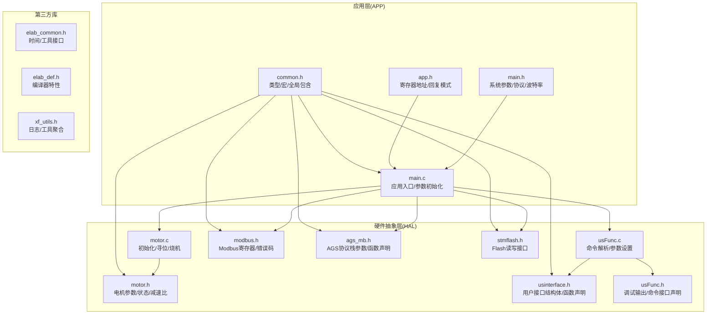
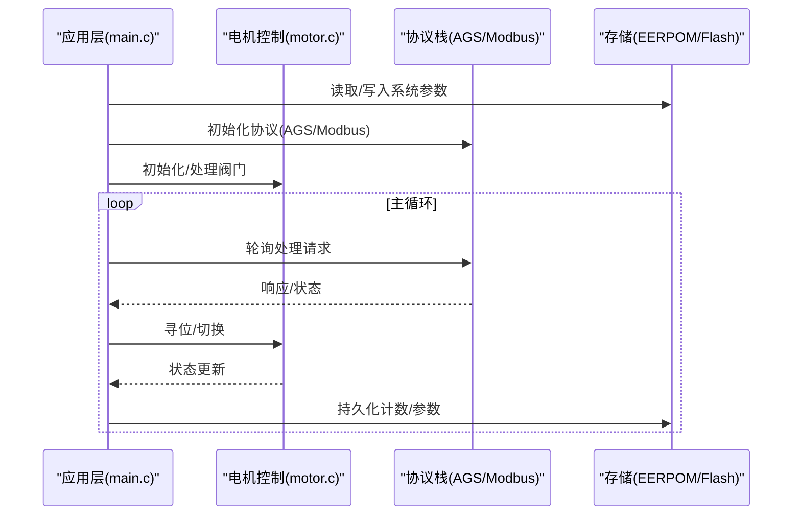
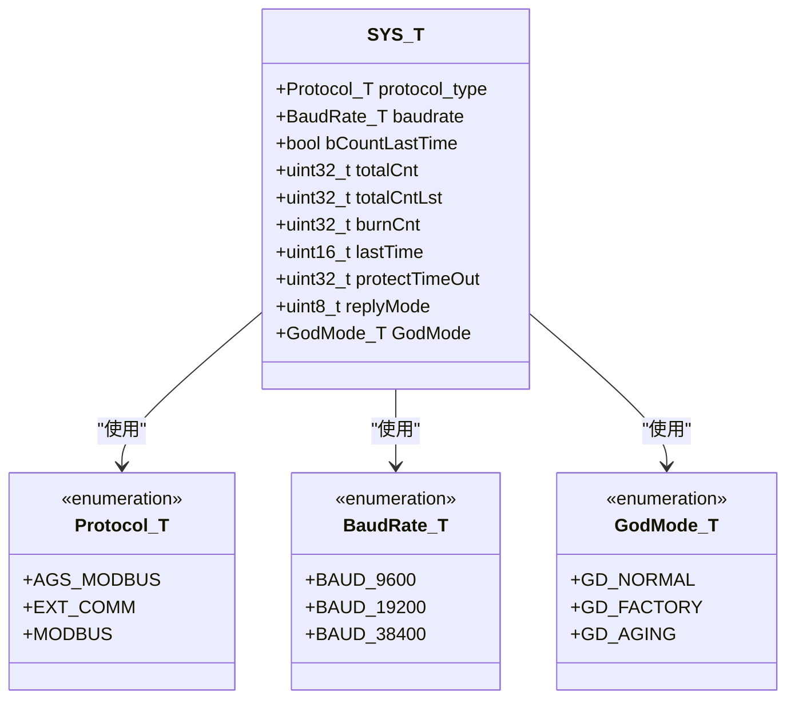
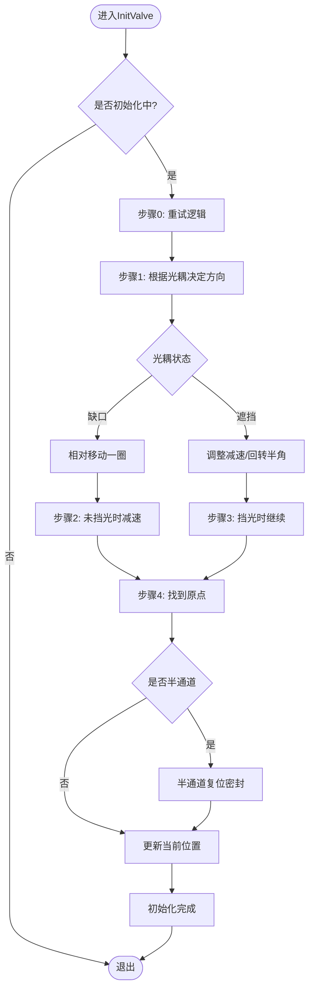
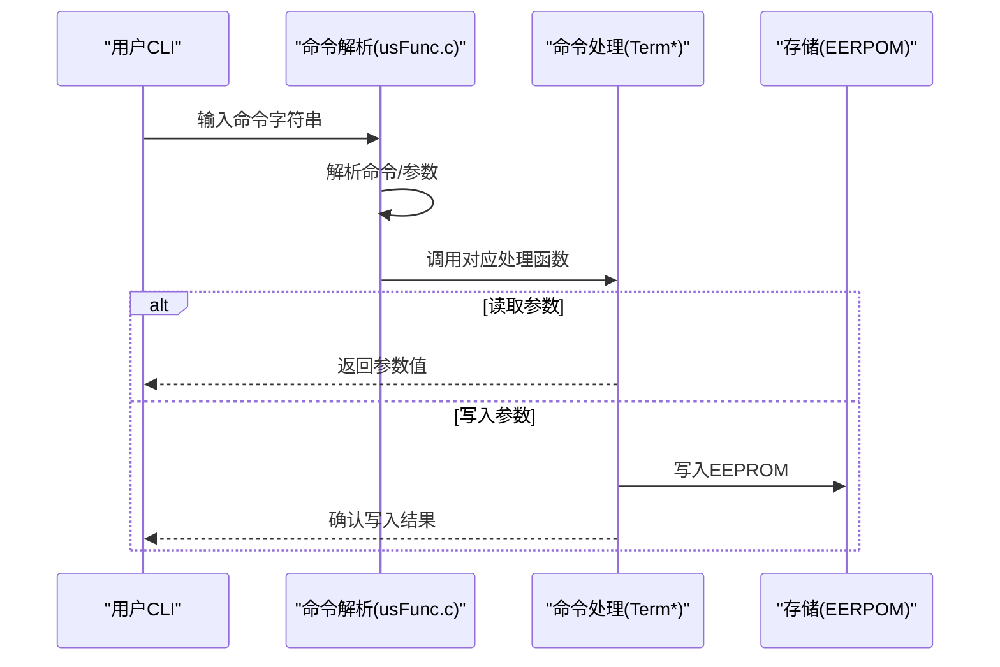
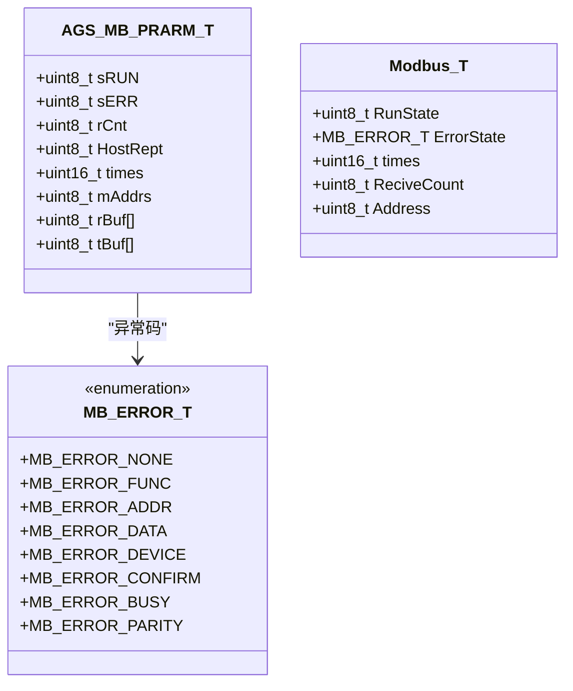

# API参考手册

<cite>
**本文档引用的文件**
- [SRC/APP/app.h](file://SRC/APP/app.h)
- [SRC/APP/common.h](file://SRC/APP/common.h)
- [SRC/APP/main.h](file://SRC/APP/main.h)
- [SRC/APP/main.c](file://SRC/APP/main.c)
- [SRC/HARDWARE/motor/motor.h](file://SRC/HARDWARE/motor/motor.h)
- [SRC/HARDWARE/motor/motor.c](file://SRC/HARDWARE/motor/motor.c)
- [SRC/HARDWARE/usinterface/usinterface.h](file://SRC/HARDWARE/usinterface/usinterface.h)
- [SRC/HARDWARE/usinterface/usFunc.h](file://SRC/HARDWARE/usinterface/usFunc.h)
- [SRC/HARDWARE/usinterface/usFunc.c](file://SRC/HARDWARE/usinterface/usFunc.c)
- [SRC/HARDWARE/modbus/modbus.h](file://SRC/HARDWARE/modbus/modbus.h)
- [SRC/HARDWARE/ags_mb/ags_mb.h](file://SRC/HARDWARE/ags_mb/ags_mb.h)
- [SRC/HARDWARE/stmFlash/stmflash.h](file://SRC/HARDWARE/stmFlash/stmflash.h)
- [SRC/3rd/common/elab_common.h](file://SRC/3rd/common/elab_common.h)
- [SRC/3rd/common/elab_def.h](file://SRC/3rd/common/elab_def.h)
- [SRC/3rd/x fusion/x f_utils.h](file://SRC/3rd/x fusion/x f_utils.h)
</cite>

## 目录
1. [简介](#简介)
2. [项目结构](#项目结构)
3. [核心组件](#核心组件)
4. [架构总览](#架构总览)
5. [详细组件分析](#详细组件分析)
6. [依赖关系分析](#依赖关系分析)
7. [性能考虑](#性能考虑)
8. [故障排查指南](#故障排查指南)
9. [结论](#结论)
10. [附录](#附录)

## 简介
本手册面向通用开关器项目的API使用者，提供完整、准确且易于查找的接口参考。内容涵盖：
- 公共接口函数清单（函数签名、参数、返回值、使用示例）
- 数据结构定义（结构体成员、字段含义、使用方法）
- 常量与枚举（取值范围、用途、关联常量）
- 调用约定与线程安全性
- 最佳实践与注意事项
- 版本兼容性与废弃接口迁移指南

## 项目结构
项目采用分层与按功能模块组织的结构：
- APP层：应用入口、系统参数、版本信息、EEPROM地址映射
- 硬件抽象层：电机控制、串口接口、Modbus/AGS协议栈、Flash存储
- 第三方库：日志与工具库封装

**图表来源**
- [SRC/APP/main.c:433-494](file://SRC/APP/main.c#L433-L494)
- [SRC/APP/main.h:195-251](file://SRC/APP/main.h#L195-L251)
- [SRC/APP/app.h:1-37](file://SRC/APP/app.h#L1-L37)
- [SRC/APP/common.h:1-526](file://SRC/APP/common.h#L1-L526)
- [SRC/HARDWARE/motor/motor.h:151-237](file://SRC/HARDWARE/motor/motor.h#L151-L237)
- [SRC/HARDWARE/motor/motor.c:73-268](file://SRC/HARDWARE/motor/motor.c#L73-L268)
- [SRC/HARDWARE/usinterface/usinterface.h:44-95](file://SRC/HARDWARE/usinterface/usinterface.h#L44-L95)
- [SRC/HARDWARE/usinterface/usFunc.h:1-55](file://SRC/HARDWARE/usinterface/usFunc.h#L1-L55)
- [SRC/HARDWARE/usinterface/usFunc.c:753-800](file://SRC/HARDWARE/usinterface/usFunc.c#L753-L800)
- [SRC/HARDWARE/modbus/modbus.h:25-213](file://SRC/HARDWARE/modbus/modbus.h#L25-L213)
- [SRC/HARDWARE/ags_mb/ags_mb.h:70-163](file://SRC/HARDWARE/ags_mb/ags_mb.h#L70-L163)
- [SRC/HARDWARE/stmFlash/stmflash.h:19-35](file://SRC/HARDWARE/stmFlash/stmflash.h#L19-L35)
- [SRC/3rd/common/elab_common.h:28-35](file://SRC/3rd/common/elab_common.h#L28-L35)
- [SRC/3rd/common/elab_def.h:24-48](file://SRC/3rd/common/elab_def.h#L24-L48)
- [SRC/3rd/x fusion/x f_utils.h:12-19](file://SRC/3rd/x fusion/x f_utils.h#L12-L19)

**章节来源**
- [SRC/APP/main.c:433-494](file://SRC/APP/main.c#L433-L494)
- [SRC/APP/common.h:1-526](file://SRC/APP/common.h#L1-L526)

## 核心组件
本项目的核心组件包括：
- 系统参数与版本管理：系统参数结构、协议类型、波特率、回复方式等
- 电机控制与状态机：阀门状态、位置、补偿、减速比、速度等
- 用户接口与命令解析：下载口命令、参数设置、点检模式
- 协议栈：AGS协议（基于Modbus扩展）与标准Modbus
- 存储与调试：EEPROM地址映射、Flash读写、调试输出

**章节来源**
- [SRC/APP/main.h:195-251](file://SRC/APP/main.h#L195-L251)
- [SRC/HARDWARE/motor/motor.h:151-237](file://SRC/HARDWARE/motor/motor.h#L151-L237)
- [SRC/HARDWARE/usinterface/usFunc.c:753-800](file://SRC/HARDWARE/usinterface/usFunc.c#L753-L800)
- [SRC/HARDWARE/modbus/modbus.h:25-213](file://SRC/HARDWARE/modbus/modbus.h#L25-L213)
- [SRC/HARDWARE/ags_mb/ags_mb.h:70-163](file://SRC/HARDWARE/ags_mb/ags_mb.h#L70-L163)

## 架构总览
系统采用“应用层调度 + 硬件抽象 + 协议栈 + 存储”的分层架构。应用层负责参数初始化、协议选择与主循环；硬件抽象层负责电机控制、IO与通信；协议栈负责与上位机交互；存储层负责参数持久化。

**图表来源**
- [SRC/APP/main.c:468-493](file://SRC/APP/main.c#L468-L493)
- [SRC/HARDWARE/motor/motor.c:275-351](file://SRC/HARDWARE/motor/motor.c#L275-L351)
- [SRC/HARDWARE/ags_mb/ags_mb.h:149-160](file://SRC/HARDWARE/ags_mb/ags_mb.h#L149-L160)
- [SRC/HARDWARE/modbus/modbus.h:205-211](file://SRC/HARDWARE/modbus/modbus.h#L205-L211)

## 详细组件分析

### 系统参数与版本管理
- 结构体：_SYS_T
  - 字段：protocol_type（协议类型）、baudrate（波特率）、bCountLastTime（切换计时标志）、totalCnt（切换次数）、lastTime（上次切换时间）、protectTimeOut（超时保护时间）、replyMode（回复方式）、GodMode（模式）
  - 使用场景：系统运行参数的集中管理与持久化
- 枚举：Protocol_T（AGS_MODBUS/EXT_COMM/MODBUS）
- 枚举：BaudRate_T（BAUD_9600/BAUD_19200/BAUD_38400）
- 枚举：GodMode_T（GD_NORMAL/GD_FACTORY/GD_AGING）
- 常量：版本号、软件修订号、控制方式描述、EEPROM地址映射

**图表来源**
- [SRC/APP/main.h:229-241](file://SRC/APP/main.h#L229-L241)
- [SRC/APP/main.h:200-206](file://SRC/APP/main.h#L200-L206)
- [SRC/APP/main.h:211-218](file://SRC/APP/main.h#L211-L218)
- [SRC/APP/main.h:220-224](file://SRC/APP/main.h#L220-L224)

**章节来源**
- [SRC/APP/main.h:195-251](file://SRC/APP/main.h#L195-L251)

### 电机控制与状态机
- 结构体：_VALVE_T（位置、状态、补偿、速度、步数等）
- 结构体：RDC_T（减速比、步数换算）
- 联合体：_12VALVE_FIX（通道补偿数组/结构体访问）
- 关键状态：VALVE_INITING/VALVE_RUNNING/VALVE_RUN_END/VALVE_RUN_ERR
- 关键函数：InitValve/ProcessValve/ValveOrg/TestBurn
- 常量：地址范围、速度范围、通道数范围、波特率范围、减速比常量

**图表来源**
- [SRC/HARDWARE/motor/motor.c:73-268](file://SRC/HARDWARE/motor/motor.c#L73-L268)

**章节来源**
- [SRC/HARDWARE/motor/motor.h:151-237](file://SRC/HARDWARE/motor/motor.h#L151-L237)
- [SRC/HARDWARE/motor/motor.c:73-268](file://SRC/HARDWARE/motor/motor.c#L73-L268)

### 用户接口与命令解析
- 结构体：_CMD_T/_CMDS_T（命令注册与解析）
- 结构体：_CMD_LINE_T（接收状态/超时/计数）
- 关键函数：UsrCmdInit/RegisterCmds/UsrCmdAnalyse/BootInterface
- 常用命令（下载口）：VR/IIC/RST/FIXO/FIXG/ADDR/CNT/POS/BDR/SPD/IOE/INT/ISET/OUT/RDCR/HALF/MOVES/INSP/REPLY/PRTCL
- 常量：参数长度与数量、接收缓冲区大小、命令名长度上限

**图表来源**
- [SRC/HARDWARE/usinterface/usFunc.c:753-800](file://SRC/HARDWARE/usinterface/usFunc.c#L753-L800)
- [SRC/HARDWARE/usinterface/usinterface.h:44-95](file://SRC/HARDWARE/usinterface/usinterface.h#L44-L95)

**章节来源**
- [SRC/HARDWARE/usinterface/usinterface.h:44-95](file://SRC/HARDWARE/usinterface/usinterface.h#L44-L95)
- [SRC/HARDWARE/usinterface/usFunc.h:1-55](file://SRC/HARDWARE/usinterface/usFunc.h#L1-L55)
- [SRC/HARDWARE/usinterface/usFunc.c:753-800](file://SRC/HARDWARE/usinterface/usFunc.c#L753-L800)

### 协议栈（AGS/Modbus）
- AGS协议（基于Modbus扩展）：扩展功能码、异常码、总线状态、缓冲区、函数声明
- Modbus协议：错误状态枚举、寄存器地址定义、功能码支持、保持寄存器接口宏
- 关键函数：ags_mbInit/ags_mbProcess/mb_Init/mb_Poll

**图表来源**
- [SRC/HARDWARE/ags_mb/ags_mb.h:70-82](file://SRC/HARDWARE/ags_mb/ags_mb.h#L70-L82)
- [SRC/HARDWARE/modbus/modbus.h:11-31](file://SRC/HARDWARE/modbus/modbus.h#L11-L31)

**章节来源**
- [SRC/HARDWARE/ags_mb/ags_mb.h:70-163](file://SRC/HARDWARE/ags_mb/ags_mb.h#L70-L163)
- [SRC/HARDWARE/modbus/modbus.h:11-213](file://SRC/HARDWARE/modbus/modbus.h#L11-L213)

### 存储与调试
- Flash接口：解锁/上锁、状态查询、等待完成、页擦除、半字写入/读取、批量写入/读取、测试写入
- 调试输出：级别控制、信息/调试输出宏、工作输出宏
- EEPROM地址映射：板号、模块号、补偿、波特率、速度、当前位置、IO控制、间隔、电流、序列号、减速比、半通道、切换次数、回复方式、初始状态、协议、烧机次数、上帝模式

**章节来源**
- [SRC/HARDWARE/stmFlash/stmflash.h:19-35](file://SRC/HARDWARE/stmFlash/stmflash.h#L19-L35)
- [SRC/HARDWARE/usinterface/usFunc.h:16-31](file://SRC/HARDWARE/usinterface/usFunc.h#L16-L31)
- [SRC/APP/main.h:127-189](file://SRC/APP/main.h#L127-L189)

## 依赖关系分析

```mermaid
graph LR
COMMON["common.h"] --> APP_H["app.h"]
COMMON --> MAIN_H["main.h"]
COMMON --> MOTOR_H["motor.h"]
COMMON --> USIF_H["usinterface.h"]
COMMON --> MODBUS_H["modbus.h"]
COMMON --> AGSMB_H["ags_mb.h"]
COMMON --> STMFLASH_H["stmflash.h"]
MAIN["main.c"] --> MOTOR_C["motor.c"]
MAIN --> USFUNC_C["usFunc.c"]
MAIN --> MODBUS_H
MAIN --> AGSMB_H
MAIN --> STMFLASH_H
USFUNC_C --> USIF_H
USFUNC_C --> USFUNC_H
MOTOR_C --> MOTOR_H
```

**图表来源**
- [SRC/APP/common.h:165-169](file://SRC/APP/common.h#L165-L169)
- [SRC/APP/main.c:468-474](file://SRC/APP/main.c#L468-L474)

**章节来源**
- [SRC/APP/common.h:165-169](file://SRC/APP/common.h#L165-L169)
- [SRC/APP/main.c:468-474](file://SRC/APP/main.c#L468-L474)

## 性能考虑
- 超时保护：单通道切换超时与初始化超时阈值，防止堵转
- 速度与减速比：不同减速比下的速度范围限制，避免过载
- 通信超时：Modbus字符间隔与无响应超时参数
- LED闪烁：错误/重试/正常运行不同闪烁周期，便于诊断
- 烧机模式：老化间隔可控，避免频繁切换导致发热

[本节为通用指导，无需特定文件引用]

## 故障排查指南
- 通信异常：检查波特率设置、命令格式、参数范围；查看Modbus/AGS异常码
- 电机不动：确认电源/使能引脚、电流设置、初始化状态、光耦信号
- 参数不生效：确认EEPROM写入成功、重启后读取流程、默认参数回退
- 烧机异常：检查GodMode设置、老化地址、间隔参数

**章节来源**
- [SRC/HARDWARE/motor/motor.c:180-202](file://SRC/HARDWARE/motor/motor.c#L180-L202)
- [SRC/HARDWARE/modbus/modbus.h:11-21](file://SRC/HARDWARE/modbus/modbus.h#L11-L21)
- [SRC/HARDWARE/ags_mb/ags_mb.h:25-34](file://SRC/HARDWARE/ags_mb/ags_mb.h#L25-L34)

## 结论
本手册提供了通用开关器项目的完整API参考，覆盖系统参数、电机控制、用户接口、协议栈与存储等核心模块。通过明确的接口定义、数据结构说明、常量与枚举解释以及调用约定，帮助开发者快速集成与维护。建议在生产环境中严格遵循参数范围与超时保护策略，确保系统稳定可靠。

[本节为总结，无需特定文件引用]

## 附录

### API函数清单与使用说明

- 应用入口与初始化
  - 函数：int main(void)
  - 作用：系统时钟/延时/串口/定时器/电机/IO配置；协议初始化；参数初始化；主循环
  - 线程安全：单线程主循环，内部无并发
  - 示例路径：[SRC/APP/main.c:433-494](file://SRC/APP/main.c#L433-L494)

- 参数初始化
  - 函数：void ParameterInit(void)
  - 作用：读取/写入EEPROM参数，设置默认值，初始化电机速度
  - 示例路径：[SRC/APP/main.c:222-429](file://SRC/APP/main.c#L222-L429)

- 使能/禁用接收
  - 函数：void EnableReceive(void) / void DisableReceive(void)
  - 作用：控制串口接收中断
  - 示例路径：[SRC/APP/main.c:204-220](file://SRC/APP/main.c#L204-L220)

- 电机控制
  - 函数：void InitValve(void) / void ProcessValve(void) / void ValveOrg(void) / void TestBurn(void)
  - 作用：初始化/寻位/原点校准/烧机测试
  - 示例路径：[SRC/HARDWARE/motor/motor.c:73-351](file://SRC/HARDWARE/motor/motor.c#L73-L351)

- 用户接口命令
  - 函数：TermVR/TermIIC/TermReset/TermFixO/TermFixG/TermAddr/TermCnt/TermPos/TermBaud/TermSpd/TermIO/TermInterval/TermISet/TermRDCR/TermHalf/TermOut/TermMovesCnt/TermInspection/TermReply/TermProtocal
  - 作用：版本查询、IIC读写、复位、补偿设置、地址/通道/位置设置、波特率/速度/IO/间隔/电流/减速比/半通道、输出翻转、切换次数、点检、回复方式、协议选择
  - 示例路径：[SRC/HARDWARE/usinterface/usFunc.c:7-800](file://SRC/HARDWARE/usinterface/usFunc.c#L7-L800)

- 协议栈
  - 函数：ags_mbInit/ags_mbProcess/mb_Init/mb_Poll
  - 作用：AGS协议初始化/处理；Modbus初始化/轮询
  - 示例路径：[SRC/HARDWARE/ags_mb/ags_mb.h:149-160](file://SRC/HARDWARE/ags_mb/ags_mb.h#L149-L160), [SRC/HARDWARE/modbus/modbus.h:205-211](file://SRC/HARDWARE/modbus/modbus.h#L205-L211)

- 存储接口
  - 函数：STMFLASH_Unlock/STMFLASH_Lock/STMFLASH_WaitDone/STMFLASH_ErasePage/STMFLASH_WriteHalfWord/STMFLASH_ReadHalfWord/STMFLASH_WriteLenByte/STMFLASH_ReadLenByte/STMFLASH_Write/STMFLASH_Read/Test_Write
  - 作用：Flash解锁/上锁/等待/擦除/半字读写/批量读写/测试写入
  - 示例路径：[SRC/HARDWARE/stmFlash/stmflash.h:19-35](file://SRC/HARDWARE/stmFlash/stmflash.h#L19-L35)

### 数据结构定义

- 系统参数结构体：_SYS_T
  - 字段：protocol_type、baudrate、bCountLastTime、totalCnt、totalCntLst、burnCnt、lastTime、protectTimeOut、replyMode、GodMode
  - 使用：集中管理运行参数与状态
  - 示例路径：[SRC/APP/main.h:229-241](file://SRC/APP/main.h#L229-L241)

- 电机参数结构体：_VALVE_T
  - 字段：OptStep/OptHigh/OptLow/stpCnt、BaudRate、ErrBlinkTime、Addr、status、optLast、retryTms、initStep、portCur/portDes/direct、portLast、iSet、lastIO、fixOrg、dirLast/statusLast、bStrtCnt、bHalfSeal、bNewInit、bEmgStopV、SnCode、spd
  - 使用：记录阀门状态与运动参数
  - 示例路径：[SRC/HARDWARE/motor/motor.h:151-186](file://SRC/HARDWARE/motor/motor.h#L151-L186)

- 减速比结构体：RDC_T
  - 字段：rate、stepRound、stepP1dgr、stepP01dgr
  - 使用：计算步进步数与角度换算
  - 示例路径：[SRC/HARDWARE/motor/motor.h:188-195](file://SRC/HARDWARE/motor/motor.h#L188-L195)

- 通道补偿联合体：_12VALVE_FIX
  - 字段：array[14]、fix.port1Val..port12Val、org、dirGap、portCnt
  - 使用：批量/结构化访问补偿参数
  - 示例路径：[SRC/HARDWARE/motor/motor.h:199-224](file://SRC/HARDWARE/motor/motor.h#L199-L224)

- 命令结构体：_CMD_T/_CMDS_T/_CMD_LINE_T
  - 字段：Name/RealLen/Operate、Cmds/Num、TimeOut/UsRxSta/RxCnt
  - 使用：命令注册与解析
  - 示例路径：[SRC/HARDWARE/usinterface/usinterface.h:44-95](file://SRC/HARDWARE/usinterface/usinterface.h#L44-L95)

### 常量与枚举

- 回复方式枚举：REPLYMODE_AGS/REPLYMODE_CUSTOM_1/REPLYMODE_CUSTOM_2/REPLYMODE_CUSTOM_3
  - 用途：控制AGS协议栈回复行为
  - 示例路径：[SRC/APP/app.h:28-34](file://SRC/APP/app.h#L28-L34)

- 协议类型枚举：AGS_MODBUS/EXT_COMM/MODBUS
  - 用途：选择通信协议
  - 示例路径：[SRC/APP/main.h:200-206](file://SRC/APP/main.h#L200-L206)

- 波特率枚举：BAUD_9600/BAUD_19200/BAUD_38400
  - 用途：设置串口波特率
  - 示例路径：[SRC/APP/main.h:211-218](file://SRC/APP/main.h#L211-L218)

- 上帝模式枚举：GD_NORMAL/GD_FACTORY/GD_AGING
  - 用途：系统运行模式
  - 示例路径：[SRC/APP/main.h:220-224](file://SRC/APP/main.h#L220-L224)

- 地址/速度/通道/波特率范围常量
  - 用途：参数合法性校验
  - 示例路径：[SRC/HARDWARE/motor/motor.h:77-98](file://SRC/HARDWARE/motor/motor.h#L77-L98)

### 调用约定与线程安全性
- 单线程主循环：main()为主调度，无多线程同步需求
- 中断与轮询：串口接收中断、定时器中断配合轮询处理
- 线程安全：全局变量访问需注意临界区保护（如切换次数、状态标志）

[本节为通用指导，无需特定文件引用]

### 最佳实践与注意事项
- 参数设置：先校验范围再写入EEPROM，重启后生效
- 通信配置：波特率必须为9600整数倍，命令格式严格遵循参数长度
- 电机保护：合理设置超时与减速比，避免长时间堵转
- 烧机测试：仅在老化模式下启用，控制老化间隔

[本节为通用指导，无需特定文件引用]

### 版本兼容性与废弃接口迁移指南
- 版本号：软件版本号与修订号分离，便于追踪变更
- 协议演进：AGS协议与Modbus并存，可通过协议选择切换
- 废弃接口：点检模式支持中文显示，历史命令保持兼容

**章节来源**
- [SRC/APP/main.h:12-108](file://SRC/APP/main.h#L12-L108)