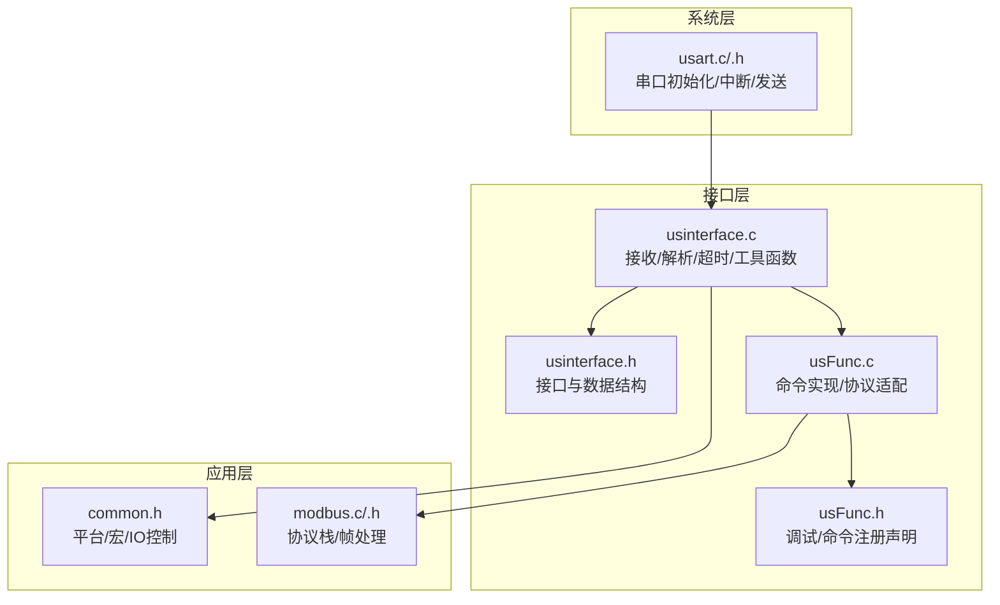
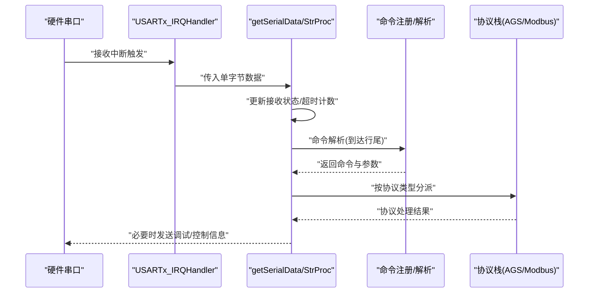
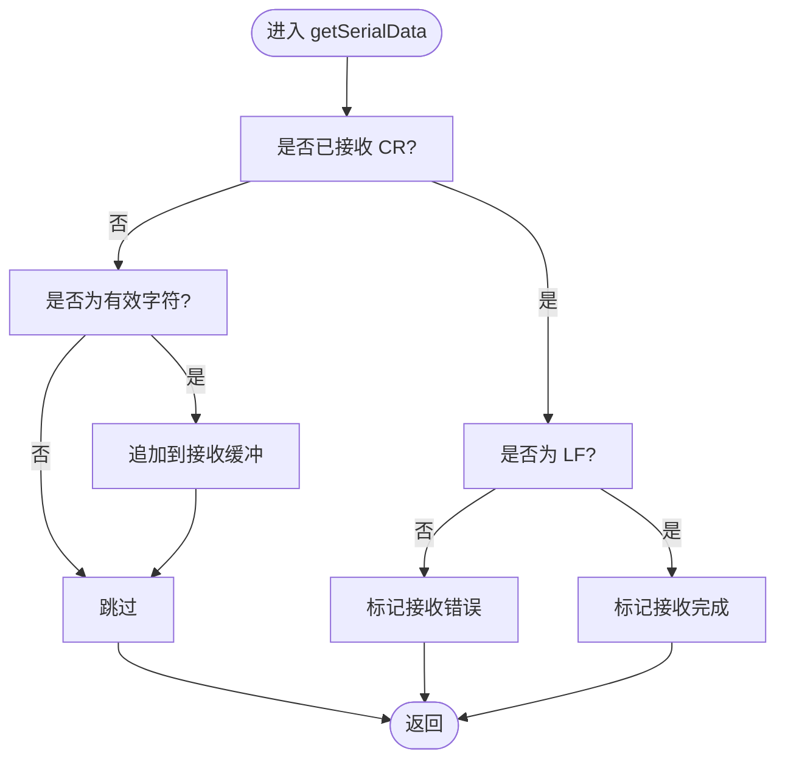
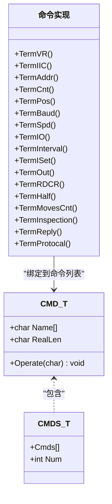
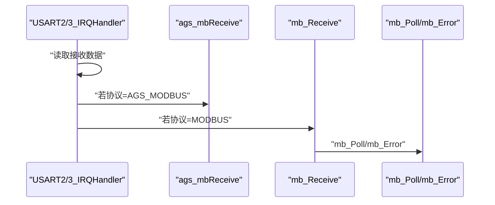
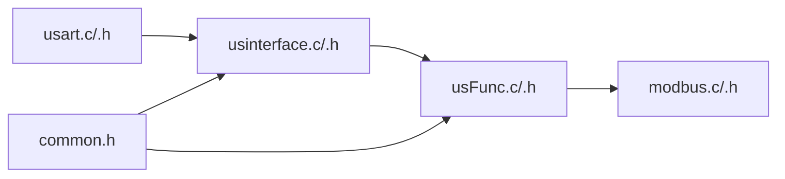

# 串口接口API

<cite>
**本文引用的文件**
- [usinterface.h](file://SRC/HARDWARE/usinterface/usinterface.h)
- [usinterface.c](file://SRC/HARDWARE/usinterface/usinterface.c)
- [usFunc.h](file://SRC/HARDWARE/usinterface/usFunc.h)
- [usFunc.c](file://SRC/HARDWARE/usinterface/usFunc.c)
- [usart.h](file://SRC/SYSTEM/usart/usart.h)
- [usart.c](file://SRC/SYSTEM/usart/usart.c)
- [common.h](file://SRC/APP/common.h)
- [modbus.h](file://SRC/HARDWARE/modbus/modbus.h)
- [modbus.c](file://SRC/HARDWARE/modbus/modbus.c)
- [QHF_v1.3.1修改说明.md](file://Doc/QHF_v1.3.1修改说明.md)
</cite>

## 目录
1. [简介](#简介)
2. [项目结构](#项目结构)
3. [核心组件](#核心组件)
4. [架构总览](#架构总览)
5. [详细组件分析](#详细组件分析)
6. [依赖关系分析](#依赖关系分析)
7. [性能考虑](#性能考虑)
8. [故障排查指南](#故障排查指南)
9. [结论](#结论)
10. [附录](#附录)

## 简介
本文件为“串口接口层”的完整API参考文档，覆盖串口通信抽象层的函数接口、数据帧处理、配置参数与数据格式规范、缓冲区与收发队列管理、错误处理与异常流程，以及协议适配与扩展接口。目标是帮助开发者快速理解并正确使用串口接口层，实现稳定可靠的串口通信。

## 项目结构
串口接口层由两部分组成：
- 串口硬件抽象与中断处理：位于 SYSTEM/usart，负责串口初始化、中断接收、发送等底层能力。
- 串口应用接口与命令解析：位于 HARDWARE/usinterface，负责命令注册、解析、参数提取、超时处理、调试输出等高层逻辑；同时集成 AGS/Modbus 协议栈以适配多种通信协议。

图表来源
- [usart.c:74-83](file://SRC/SYSTEM/usart/usart.c#L74-L83)
- [usart.c:138-151](file://SRC/SYSTEM/usart/usart.c#L138-L151)
- [usinterface.c:15-71](file://SRC/HARDWARE/usinterface/usinterface.c#L15-L71)
- [usinterface.c:79-106](file://SRC/HARDWARE/usinterface/usinterface.c#L79-L106)
- [usFunc.c:830-834](file://SRC/HARDWARE/usinterface/usFunc.c#L830-L834)
- [modbus.c:35-77](file://SRC/HARDWARE/modbus/modbus.c#L35-L77)

章节来源
- [usart.h:1-57](file://SRC/SYSTEM/usart/usart.h#L1-L57)
- [usart.c:34-120](file://SRC/SYSTEM/usart/usart.c#L34-L120)
- [usinterface.h:28-95](file://SRC/HARDWARE/usinterface/usinterface.h#L28-L95)
- [usinterface.c:1-140](file://SRC/HARDWARE/usinterface/usinterface.c#L1-L140)
- [usFunc.h:1-55](file://SRC/HARDWARE/usinterface/usFunc.h#L1-L55)
- [usFunc.c:750-834](file://SRC/HARDWARE/usinterface/usFunc.c#L750-L834)
- [common.h:174-190](file://SRC/APP/common.h#L174-L190)

## 核心组件
- 串口硬件抽象（SYSTEM/usart）
  - 提供串口初始化、中断回调、发送接口，以及针对不同串口号的配置宏。
  - 关键接口：Usartx_Init、USARTx_IRQHandler、Usartx_SendB/Str。
- 串口接口层（HARDWARE/usinterface）
  - 提供命令注册、命令解析、参数提取、超时处理、调试输出等。
  - 关键接口：BootInterface、getSerialData、StrProc、TimeOutInt、RegisterCmds、UsrCmdAnalyse、各类 Fetch* 工具函数。
- 协议适配（AGS/Modbus）
  - 在串口接收中断中根据当前协议类型分派到 AGS 或 Modbus 协议栈处理。
  - 关键接口：mb_Init、mb_Receive、mb_Poll、mb_Error 等。

章节来源
- [usart.c:74-83](file://SRC/SYSTEM/usart/usart.c#L74-L83)
- [usart.c:138-151](file://SRC/SYSTEM/usart/usart.c#L138-L151)
- [usinterface.c:136-141](file://SRC/HARDWARE/usinterface/usinterface.c#L136-L141)
- [usinterface.c:15-71](file://SRC/HARDWARE/usinterface/usinterface.c#L15-L71)
- [usinterface.c:79-106](file://SRC/HARDWARE/usinterface/usinterface.c#L79-L106)
- [usinterface.c:273-343](file://SRC/HARDWARE/usinterface/usinterface.c#L273-L343)
- [usFunc.c:750-834](file://SRC/HARDWARE/usinterface/usFunc.c#L750-L834)
- [modbus.c:35-77](file://SRC/HARDWARE/modbus/modbus.c#L35-L77)

## 架构总览
串口接口层的运行流程如下：
- 系统层串口接收中断触发，将单字节数据交由接口层的 getSerialData 处理。
- 接口层维护接收状态机与超时计数，周期性调用 StrProc/TimeOutInt 完成命令解析与超时清理。
- 解析完成后，根据协议类型将数据分派至 AGS 或 Modbus 协议栈处理。
- 应用层通过命令注册机制扩展新命令，统一由命令列表与解析函数驱动。

图表来源
- [usart.c:74-83](file://SRC/SYSTEM/usart/usart.c#L74-L83)
- [usart.c:138-151](file://SRC/SYSTEM/usart/usart.c#L138-L151)
- [usinterface.c:15-71](file://SRC/HARDWARE/usinterface/usinterface.c#L15-L71)
- [usinterface.c:79-106](file://SRC/HARDWARE/usinterface/usinterface.c#L79-L106)
- [usFunc.c:750-834](file://SRC/HARDWARE/usinterface/usFunc.c#L750-L834)
- [modbus.c:136-162](file://SRC/HARDWARE/modbus/modbus.c#L136-L162)

## 详细组件分析

### 1) 串口硬件抽象（SYSTEM/usart）
- 初始化
  - 提供 Usart1_Init/Usart2_Init/Usart3_Init/Uart4_Init 等接口，设置波特率、IO模式、中断使能等。
  - 关键宏：EN_UARTx_RX 控制是否启用接收中断。
- 中断处理
  - USARTx_IRQHandler 读取数据寄存器，调用 getSerialData 将字节交给接口层。
- 发送接口
  - 提供 Usartx_SendB/Str，阻塞式发送单字节与字符串。

章节来源
- [usart.h:22-37](file://SRC/SYSTEM/usart/usart.h#L22-L37)
- [usart.c:38-66](file://SRC/SYSTEM/usart/usart.c#L38-L66)
- [usart.c:91-120](file://SRC/SYSTEM/usart/usart.c#L91-L120)
- [usart.c:159-188](file://SRC/SYSTEM/usart/usart.c#L159-L188)
- [usart.c:229-258](file://SRC/SYSTEM/usart/usart.c#L229-L258)

### 2) 串口接口层（HARDWARE/usinterface）
- 接收与状态机
  - getSerialData：在中断中逐字节接收，维护接收状态与缓冲指针，支持 CR/LF 结束符或仅 CR 结束符两种模式。
  - StrProc：在主循环中检测接收完成或错误，调用命令处理函数并清空缓冲。
  - TimeOutInt：基于超时计数清理未完成的接收，防止卡死。
- 命令注册与解析
  - BootInterface：启动界面，初始化接收指针与命令处理函数指针。
  - RegisterCmds/UsrCmdAnalyse：注册命令列表，解析命令与参数。
- 参数提取与工具函数
  - FetchChar/FetchInt/UnEqFetchChar/UnEqFetchInt：从命令字符串中提取定长/不定长参数，带长度与个数校验。
  - int2str/str2int/tolower/toupper/strtohex/myStrncpy：常用字符串与数值转换工具。
- 调试与输出
  - printd/printw/prInfo/prDbg：条件编译的调试输出接口，支持级别控制。

图表来源
- [usinterface.c:15-71](file://SRC/HARDWARE/usinterface/usinterface.c#L15-L71)

章节来源
- [usinterface.c:136-141](file://SRC/HARDWARE/usinterface/usinterface.c#L136-L141)
- [usinterface.c:79-106](file://SRC/HARDWARE/usinterface/usinterface.c#L79-L106)
- [usinterface.c:109-131](file://SRC/HARDWARE/usinterface/usinterface.c#L109-L131)
- [usinterface.c:273-343](file://SRC/HARDWARE/usinterface/usinterface.c#L273-L343)
- [usinterface.c:355-425](file://SRC/HARDWARE/usinterface/usinterface.c#L355-L425)
- [usinterface.c:436-498](file://SRC/HARDWARE/usinterface/usinterface.c#L436-L498)
- [usinterface.c:510-573](file://SRC/HARDWARE/usinterface/usinterface.c#L510-L573)
- [usinterface.c:148-201](file://SRC/HARDWARE/usinterface/usinterface.c#L148-L201)
- [usinterface.c:238-253](file://SRC/HARDWARE/usinterface/usinterface.c#L238-L253)
- [usinterface.c:256-261](file://SRC/HARDWARE/usinterface/usinterface.c#L256-L261)
- [usFunc.h:16-31](file://SRC/HARDWARE/usinterface/usFunc.h#L16-L31)

### 3) 命令注册与实现（usFunc）
- 命令注册
  - cmds[]：内置命令列表，包含名称、长度与处理函数指针。
  - 注册接口：RegisterCmds/UsrCmdAnalyse/UsrCmdInit。
- 命令实现示例
  - VR/IIC/RST/ADDR/CNT/POS/BDR/SPD/IOE/INT/ISET/OUT/RDCR/HALF/MOVES/INSP/REPLY/PRTCL 等。
  - 每个命令均通过 FetchInt/FetchChar 进行参数提取，并进行范围/长度校验，最终写入系统参数或执行动作。
- 协议适配
  - 根据 syspara.protocol_type 在串口接收中断中分派到 AGS 或 Modbus 协议栈。

图表来源
- [usinterface.h:58-70](file://SRC/HARDWARE/usinterface/usinterface.h#L58-L70)
- [usFunc.c:753-778](file://SRC/HARDWARE/usinterface/usFunc.c#L753-L778)
- [usFunc.c:808-828](file://SRC/HARDWARE/usinterface/usFunc.c#L808-L828)
- [usFunc.c:830-834](file://SRC/HARDWARE/usinterface/usFunc.c#L830-L834)

章节来源
- [usFunc.c:753-778](file://SRC/HARDWARE/usinterface/usFunc.c#L753-L778)
- [usFunc.c:808-828](file://SRC/HARDWARE/usinterface/usFunc.c#L808-L828)
- [usFunc.c:830-834](file://SRC/HARDWARE/usinterface/usFunc.c#L830-L834)

### 4) 协议适配与扩展（AGS/Modbus）
- 协议选择
  - syspara.protocol_type 决定当前使用的协议类型（AGS/Modbus/扩展）。
- AGS 协议
  - 串口接收中断中调用 ags_mbReceive，按 AGS 协议解析帧。
- Modbus 协议
  - 串口接收中断中调用 mb_Receive，按 Modbus RTU 解析帧。
  - mb_Init 初始化串口与定时器，mb_Poll 轮询处理帧，mb_Error 处理异常。
- 扩展协议
  - 可通过扩展协议类型在中断中添加新的分派逻辑。

图表来源
- [usart.c:145-150](file://SRC/SYSTEM/usart/usart.c#L145-L150)
- [usart.c:215-220](file://SRC/SYSTEM/usart/usart.c#L215-L220)
- [modbus.c:136-162](file://SRC/HARDWARE/modbus/modbus.c#L136-L162)
- [modbus.c:469-492](file://SRC/HARDWARE/modbus/modbus.c#L469-L492)

章节来源
- [usart.c:145-150](file://SRC/SYSTEM/usart/usart.c#L145-L150)
- [usart.c:215-220](file://SRC/SYSTEM/usart/usart.c#L215-L220)
- [modbus.c:35-77](file://SRC/HARDWARE/modbus/modbus.c#L35-L77)
- [modbus.c:136-162](file://SRC/HARDWARE/modbus/modbus.c#L136-L162)
- [modbus.c:469-492](file://SRC/HARDWARE/modbus/modbus.c#L469-L492)

## 依赖关系分析
- 接口层依赖系统层的串口中断与发送接口。
- 接口层通过 syspara.protocol_type 间接依赖 AGS/Modbus 协议栈。
- 应用层通过 common.h 提供的宏与IO控制接口参与系统行为。

图表来源
- [usart.c:74-83](file://SRC/SYSTEM/usart/usart.c#L74-L83)
- [usinterface.c:15-71](file://SRC/HARDWARE/usinterface/usinterface.c#L15-L71)
- [usFunc.c:830-834](file://SRC/HARDWARE/usinterface/usFunc.c#L830-L834)
- [modbus.c:35-77](file://SRC/HARDWARE/modbus/modbus.c#L35-L77)
- [common.h:174-190](file://SRC/APP/common.h#L174-L190)

章节来源
- [usart.c:74-83](file://SRC/SYSTEM/usart/usart.c#L74-L83)
- [usinterface.c:15-71](file://SRC/HARDWARE/usinterface/usinterface.c#L15-L71)
- [usFunc.c:830-834](file://SRC/HARDWARE/usinterface/usFunc.c#L830-L834)
- [modbus.c:35-77](file://SRC/HARDWARE/modbus/modbus.c#L35-L77)
- [common.h:174-190](file://SRC/APP/common.h#L174-L190)

## 性能考虑
- 接收缓冲与超时
  - 接收缓冲区大小与命令最大长度受宏定义约束，避免越界与死机风险。
  - 超时机制通过 TimeOutInt 清理未完成接收，降低资源占用。
- 参数解析复杂度
  - Fetch* 系列函数对参数进行长度与个数校验，时间复杂度与参数数量线性相关。
- 发送阻塞
  - 发送接口为阻塞式，适合调试输出；生产环境建议使用 DMA 或队列异步发送。
- 协议处理
  - Modbus 帧解析包含 CRC 校验与状态机切换，注意在中断中避免长时间阻塞。

章节来源
- [usinterface.h:42-49](file://SRC/HARDWARE/usinterface/usinterface.h#L42-L49)
- [usinterface.c:109-131](file://SRC/HARDWARE/usinterface/usinterface.c#L109-L131)
- [usinterface.c:273-343](file://SRC/HARDWARE/usinterface/usinterface.c#L273-L343)
- [usart.c:123-136](file://SRC/SYSTEM/usart/usart.c#L123-L136)

## 故障排查指南
- 接收不到数据
  - 检查串口初始化参数与中断使能宏（EN_UARTx_RX）。
  - 确认 USARTx_IRQHandler 正确调用 getSerialData。
- 命令解析失败
  - 检查命令名称长度与分隔符是否符合 Fetch* 的预期。
  - 使用 printd 查看返回的错误码（1=分隔符异常，2=参数长度不符，3=参数个数不符）。
- 超时与卡死
  - 确认主循环调用 StrProc/TimeOutInt。
  - 检查接收缓冲区是否溢出（W_LEN 限制）。
- 协议不响应
  - 检查 syspara.protocol_type 设置与串口波特率。
  - 对于 Modbus，确认地址与功能码是否正确，CRC 是否通过。

章节来源
- [usart.c:60-65](file://SRC/SYSTEM/usart/usart.c#L60-L65)
- [usart.c:114-119](file://SRC/SYSTEM/usart/usart.c#L114-L119)
- [usart.c:145-150](file://SRC/SYSTEM/usart/usart.c#L145-L150)
- [usart.c:215-220](file://SRC/SYSTEM/usart/usart.c#L215-L220)
- [usinterface.c:109-131](file://SRC/HARDWARE/usinterface/usinterface.c#L109-L131)
- [usinterface.c:273-343](file://SRC/HARDWARE/usinterface/usinterface.c#L273-L343)
- [modbus.c:167-186](file://SRC/HARDWARE/modbus/modbus.c#L167-L186)

## 结论
串口接口层提供了清晰的抽象与完善的命令解析机制，结合 AGS/Modbus 协议栈，能够满足多场景下的串口通信需求。通过合理的缓冲区管理、超时控制与错误码返回，开发者可以快速扩展新命令与协议类型，构建稳定可靠的串口通信系统。

## 附录

### A. 关键API一览（按模块）
- 系统层（SYSTEM/usart）
  - 初始化：Usart1_Init、Usart2_Init、Usart3_Init、Uart4_Init
  - 中断：USART1_IRQHandler、USART2_IRQHandler、USART3_IRQHandler、UART4_IRQHandler
  - 发送：Usart2_SendB、USART2_SendStr、Usart3_SendB、USART3_SendStr、Uart4_SendB、UART4_SendStr
- 接口层（HARDWARE/usinterface）
  - 启动与处理：BootInterface、getSerialData、StrProc、TimeOutInt
  - 命令：RegisterCmds、UsrCmdAnalyse、UsrCmdInit
  - 参数提取：FetchChar、FetchInt、UnEqFetchChar、UnEqFetchInt
  - 工具：int2str、str2int、tolower、toupper、strtohex、myStrncpy、memset
- 协议层（HARDWARE/modbus）
  - 初始化与轮询：mb_Init、mb_Poll、mb_Error
  - 接收与发送：mb_Receive、mb_SendBuffer

章节来源
- [usart.h:22-37](file://SRC/SYSTEM/usart/usart.h#L22-L37)
- [usart.c:38-66](file://SRC/SYSTEM/usart/usart.c#L38-L66)
- [usart.c:91-120](file://SRC/SYSTEM/usart/usart.c#L91-L120)
- [usart.c:159-188](file://SRC/SYSTEM/usart/usart.c#L159-L188)
- [usart.c:229-258](file://SRC/SYSTEM/usart/usart.c#L229-L258)
- [usinterface.h:74-90](file://SRC/HARDWARE/usinterface/usinterface.h#L74-L90)
- [usinterface.c:136-141](file://SRC/HARDWARE/usinterface/usinterface.c#L136-L141)
- [usinterface.c:15-71](file://SRC/HARDWARE/usinterface/usinterface.c#L15-L71)
- [usinterface.c:79-106](file://SRC/HARDWARE/usinterface/usinterface.c#L79-L106)
- [usinterface.c:273-343](file://SRC/HARDWARE/usinterface/usinterface.c#L273-L343)
- [usinterface.c:355-425](file://SRC/HARDWARE/usinterface/usinterface.c#L355-L425)
- [usinterface.c:436-498](file://SRC/HARDWARE/usinterface/usinterface.c#L436-L498)
- [usinterface.c:510-573](file://SRC/HARDWARE/usinterface/usinterface.c#L510-L573)
- [usFunc.c:830-834](file://SRC/HARDWARE/usinterface/usFunc.c#L830-L834)
- [modbus.h:205-212](file://SRC/HARDWARE/modbus/modbus.h#L205-L212)

### B. 数据格式与配置参数规范
- 接收缓冲与命令格式
  - 命令最大长度、参数个数与单位长度由宏定义约束，命令与参数之间使用特定分隔符。
  - Fetch* 系列函数负责解析命令与参数，确保长度与个数校验。
- 调试输出
  - 通过 FSW_DBG_PRINT/FSW_WORK_PRINT 控制调试输出开关与级别。
- 协议类型
  - 支持 AGS_MODBUS、EXT_COMM、MODBUS 等协议类型，通过 syspara.protocol_type 切换。

章节来源
- [usinterface.h:37-49](file://SRC/HARDWARE/usinterface/usinterface.h#L37-L49)
- [usinterface.c:273-343](file://SRC/HARDWARE/usinterface/usinterface.c#L273-L343)
- [usFunc.h:16-31](file://SRC/HARDWARE/usinterface/usFunc.h#L16-L31)
- [usFunc.c:707-747](file://SRC/HARDWARE/usinterface/usFunc.c#L707-L747)
- [QHF_v1.3.1修改说明.md:1-190](file://Doc/QHF_v1.3.1修改说明.md#L1-L190)