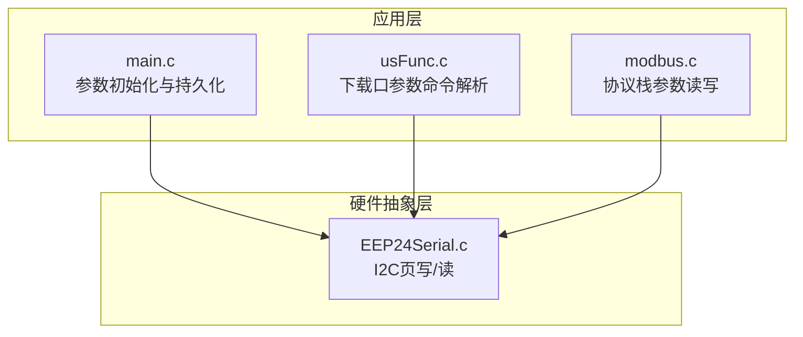
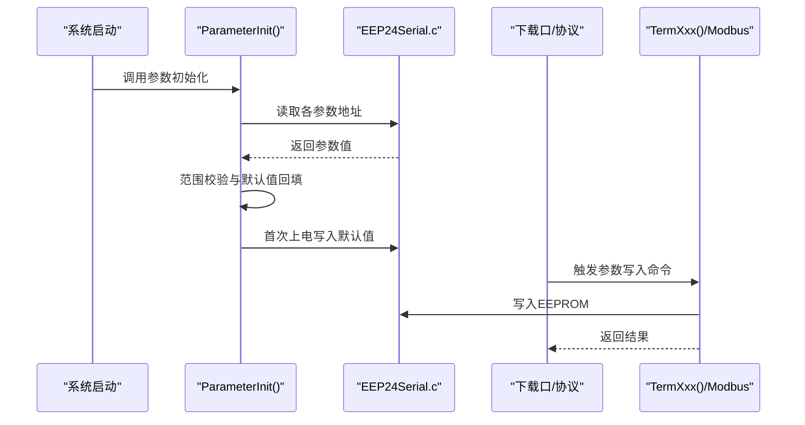
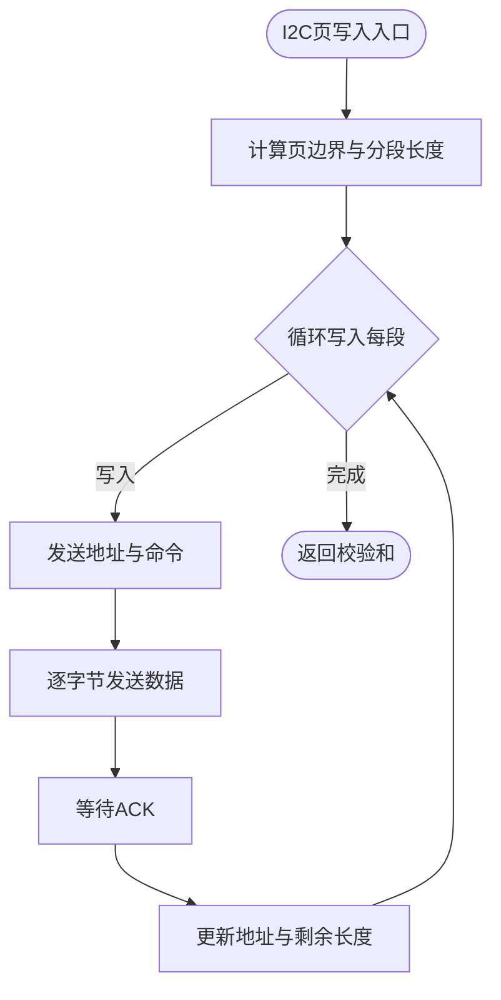
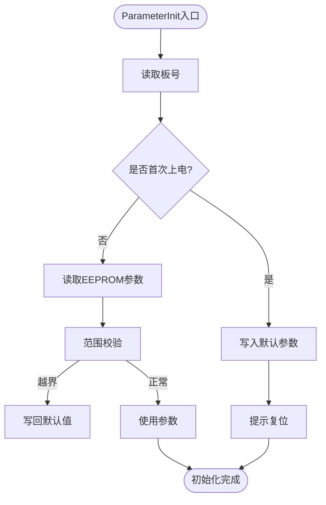
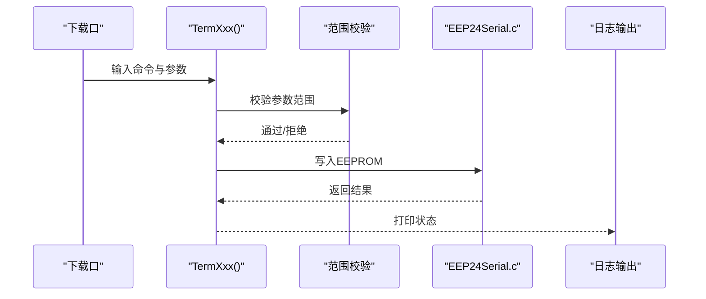
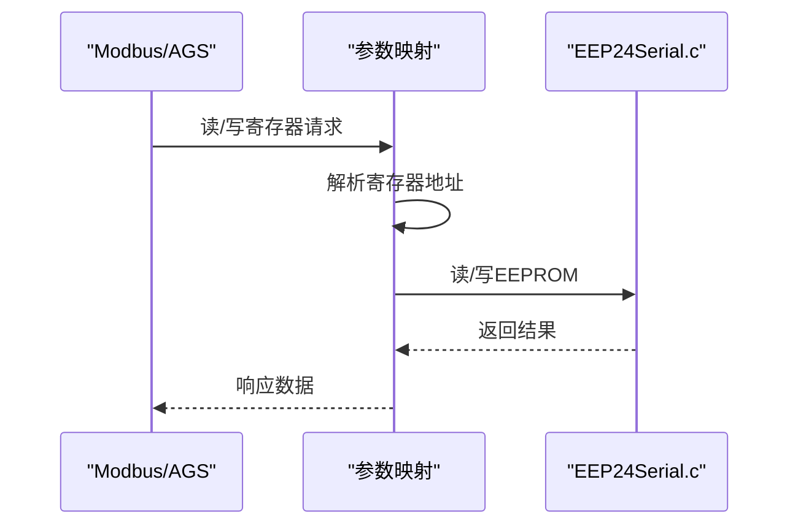
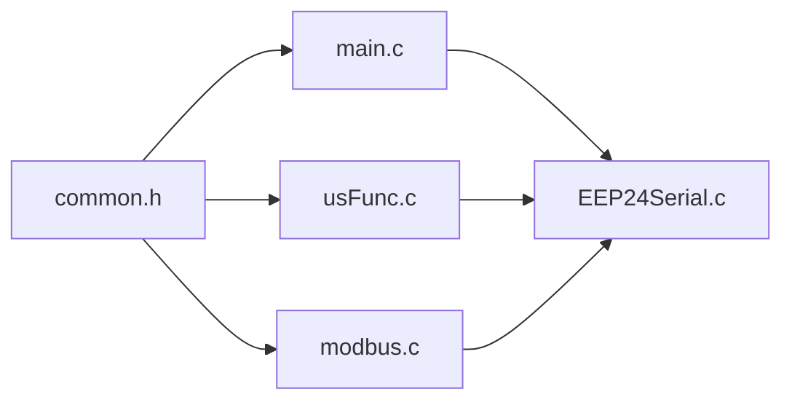

# 参数管理API

<cite>
**本文引用的文件**
- [EEP24Serial.h](file://SRC/HARDWARE/EEPROM/EEP24Serial.h)
- [EEP24Serial.c](file://SRC/HARDWARE/EEPROM/EEP24Serial.c)
- [usFunc.h](file://SRC/HARDWARE/usinterface/usFunc.h)
- [usFunc.c](file://SRC/HARDWARE/usinterface/usFunc.c)
- [main.h](file://SRC/APP/main.h)
- [main.c](file://SRC/APP/main.c)
- [common.h](file://SRC/APP/common.h)
- [app.h](file://SRC/APP/app.h)
- [modbus.c](file://SRC/HARDWARE/modbus/modbus.c)
- [QHF_v1.3.1修改说明.md](file://Doc/QHF_v1.3.1修改说明.md)
</cite>

## 目录
1. [简介](#简介)
2. [项目结构](#项目结构)
3. [核心组件](#核心组件)
4. [架构总览](#架构总览)
5. [详细组件分析](#详细组件分析)
6. [依赖关系分析](#依赖关系分析)
7. [性能考虑](#性能考虑)
8. [故障排查指南](#故障排查指南)
9. [结论](#结论)
10. [附录](#附录)

## 简介
本文件为参数管理系统的完整API参考文档，聚焦于EEPROM存储与读取相关的接口、参数配置结构体与数据格式、默认值管理、参数范围校验、参数持久化与恢复、参数版本管理与兼容性处理。文档面向开发者，提供接口调用指南与数据处理参考，帮助快速集成与维护参数管理系统。

## 项目结构
参数管理涉及以下关键模块：
- EEPROM访问层：提供I2C页写/读与系统参数读取接口
- 用户命令层：通过下载口或协议写入参数，执行范围校验与默认值回退
- 参数初始化与持久化：启动时从EEPROM读取参数，首次上电写入默认值
- 协议适配层：Modbus/AGS协议对参数的读写映射

**图表来源**
- [main.c:221-429](file://SRC/APP/main.c#L221-L429)
- [usFunc.c:70-110](file://SRC/HARDWARE/usinterface/usFunc.c#L70-L110)
- [modbus.c:540-765](file://SRC/HARDWARE/modbus/modbus.c#L540-L765)
- [EEP24Serial.c:95-200](file://SRC/HARDWARE/EEPROM/EEP24Serial.c#L95-L200)

**章节来源**
- [main.c:221-429](file://SRC/APP/main.c#L221-L429)
- [usFunc.c:70-110](file://SRC/HARDWARE/usinterface/usFunc.c#L70-L110)
- [modbus.c:540-765](file://SRC/HARDWARE/modbus/modbus.c#L540-L765)
- [EEP24Serial.c:95-200](file://SRC/HARDWARE/EEPROM/EEP24Serial.c#L95-L200)

## 核心组件
- EEPROM访问接口
  - I2C页读取：I2CPageRead_Nbytes(startAddr, length, buffer)
  - I2C页写入：I2CPageWrite_Nbytes(startAddr, length, buffer)
  - 系统参数读取：GetSystemParam()
- 参数初始化与默认值
  - ParameterInit()：启动时读取EEPROM并进行范围校验与默认值回填
- 参数命令接口（下载口）
  - 多个TermXxx函数负责参数读写与范围校验，如TermAddr、TermCnt、TermSpd、TermBaud、TermISet、TermRDCR、TermHalf、TermInterval、TermMovesCnt、TermReply、TermProtocal等
- 协议栈参数映射
  - Modbus/AGS协议对EEPROM参数的读写映射，确保外部协议与本地EEPROM一致

**章节来源**
- [EEP24Serial.h:29-34](file://SRC/HARDWARE/EEPROM/EEP24Serial.h#L29-L34)
- [EEP24Serial.c:95-200](file://SRC/HARDWARE/EEPROM/EEP24Serial.c#L95-L200)
- [main.c:221-429](file://SRC/APP/main.c#L221-L429)
- [usFunc.c:208-275](file://SRC/HARDWARE/usinterface/usFunc.c#L208-L275)
- [modbus.c:540-765](file://SRC/HARDWARE/modbus/modbus.c#L540-L765)

## 架构总览
参数管理采用“硬件抽象层 + 应用层 + 协议层”的分层设计：
- 硬件抽象层：统一I2C页写/读，屏蔽EEPROM容量差异
- 应用层：参数初始化、默认值回填、范围校验、持久化策略
- 协议层：Modbus/AGS协议将外部请求映射到EEPROM地址空间

**图表来源**
- [main.c:221-429](file://SRC/APP/main.c#L221-L429)
- [EEP24Serial.c:95-200](file://SRC/HARDWARE/EEPROM/EEP24Serial.c#L95-L200)
- [usFunc.c:208-275](file://SRC/HARDWARE/usinterface/usFunc.c#L208-L275)
- [modbus.c:540-765](file://SRC/HARDWARE/modbus/modbus.c#L540-L765)

## 详细组件分析

### EEPROM访问接口
- I2C页读取
  - 功能：按页边界进行连续读取，支持不同容量EEPROM的地址模式
  - 参数：起始地址、长度、读缓冲区
  - 返回：校验和
- I2C页写入
  - 功能：自动分页写入，处理页边界与ACK等待
  - 参数：起始地址、长度、写缓冲区
  - 返回：校验和
- 系统参数读取
  - 功能：读取系统级参数（如板号、协议类型等）

**图表来源**
- [EEP24Serial.c:202-313](file://SRC/HARDWARE/EEPROM/EEP24Serial.c#L202-L313)

**章节来源**
- [EEP24Serial.h:29-34](file://SRC/HARDWARE/EEPROM/EEP24Serial.h#L29-L34)
- [EEP24Serial.c:95-200](file://SRC/HARDWARE/EEPROM/EEP24Serial.c#L95-L200)
- [EEP24Serial.c:202-313](file://SRC/HARDWARE/EEPROM/EEP24Serial.c#L202-L313)

### 参数初始化与默认值管理
- 启动流程
  - 读取板号判断是否首次上电
  - 若非首次：从EEPROM读取参数并进行范围校验；若越界则写回默认值
  - 若首次：写入默认参数并提示复位
- 默认值来源
  - 通过全局默认值与编译宏控制，如通道数、波特率、速度、电流、减速比、半通道等
- 关键行为
  - 参数越界自动回退至默认值
  - 首次上电写入默认值后锁定驱动，需复位生效

**图表来源**
- [main.c:221-429](file://SRC/APP/main.c#L221-L429)

**章节来源**
- [main.c:221-429](file://SRC/APP/main.c#L221-L429)

### 参数命令接口（下载口）
- 命令集合
  - 地址设置：TermAddr
  - 通道数设置：TermCnt
  - 速度设置：TermSpd（含减速比影响）
  - 波特率设置：TermBaud
  - 电流设置：TermISet
  - 减速比设置：TermRDCR
  - 半通道设置：TermHalf
  - 老化间隔设置：TermInterval
  - 切换次数设置：TermMovesCnt
  - 回复模式设置：TermReply
  - 协议类型设置：TermProtocal
- 通用流程
  - 解析参数值
  - 范围校验
  - 写入EEPROM
  - 打印结果

**图表来源**
- [usFunc.c:208-275](file://SRC/HARDWARE/usinterface/usFunc.c#L208-L275)
- [usFunc.c:317-358](file://SRC/HARDWARE/usinterface/usFunc.c#L317-L358)
- [usFunc.c:493-532](file://SRC/HARDWARE/usinterface/usFunc.c#L493-L532)
- [usFunc.c:537-566](file://SRC/HARDWARE/usinterface/usFunc.c#L537-L566)
- [usFunc.c:571-599](file://SRC/HARDWARE/usinterface/usFunc.c#L571-L599)
- [usFunc.c:617-638](file://SRC/HARDWARE/usinterface/usFunc.c#L617-L638)
- [usFunc.c:676-705](file://SRC/HARDWARE/usinterface/usFunc.c#L676-L705)
- [usFunc.c:707-747](file://SRC/HARDWARE/usinterface/usFunc.c#L707-L747)

**章节来源**
- [usFunc.c:208-275](file://SRC/HARDWARE/usinterface/usFunc.c#L208-L275)
- [usFunc.c:317-358](file://SRC/HARDWARE/usinterface/usFunc.c#L317-L358)
- [usFunc.c:493-532](file://SRC/HARDWARE/usinterface/usFunc.c#L493-L532)
- [usFunc.c:537-566](file://SRC/HARDWARE/usinterface/usFunc.c#L537-L566)
- [usFunc.c:571-599](file://SRC/HARDWARE/usinterface/usFunc.c#L571-L599)
- [usFunc.c:617-638](file://SRC/HARDWARE/usinterface/usFunc.c#L617-L638)
- [usFunc.c:676-705](file://SRC/HARDWARE/usinterface/usFunc.c#L676-L705)
- [usFunc.c:707-747](file://SRC/HARDWARE/usinterface/usFunc.c#L707-L747)

### 协议栈参数映射
- Modbus/AGS协议将寄存器地址映射到EEPROM参数地址，保证外部协议与本地存储一致
- 示例映射
  - 地址寄存器：映射到模块地址参数
  - 序列号寄存器：映射到序列号参数
  - 工厂参数寄存器：映射到通道数、半通道、原点/方向补偿等
- 写入流程
  - 解析寄存器地址
  - 校验GodMode与权限
  - 写入对应EEPROM地址

**图表来源**
- [modbus.c:540-765](file://SRC/HARDWARE/modbus/modbus.c#L540-L765)

**章节来源**
- [modbus.c:540-765](file://SRC/HARDWARE/modbus/modbus.c#L540-L765)

### 参数地址与数据格式
- 参数地址布局（示例）
  - 板号：2字节
  - 模块地址：1字节
  - 原点补偿：1字节
  - 方向补偿：1字节
  - 通道数：1字节
  - 波特率：1字节
  - 速度：1字节
  - 当前位置：1字节
  - IO控制：1字节
  - 老化间隔：1字节
  - 电流设置：1字节
  - 序列号：5字节
  - 减速比：1字节
  - 半通道：1字节
  - 切换次数：4字节
- 数据类型与长度
  - 字节型参数：布尔、枚举、索引
  - 整型参数：通道数、速度、间隔、次数
  - 字符串/序列号：固定长度数组

**章节来源**
- [main.h:130-173](file://SRC/APP/main.h#L130-L173)

### 参数范围检查与默认值回退
- 范围检查
  - 地址：限定范围，越界回退默认值
  - 通道数：限定范围，越界回退默认值
  - 速度：受减速比影响，按速率档位设定范围
  - 波特率：限定枚举值
  - 电流：限定范围
  - 减速比：限定枚举值
  - 老化间隔：字节范围
  - 半通道：布尔
  - 切换次数：32位整型
  - 回复模式：枚举范围
  - 协议类型：枚举范围
- 默认值回退
  - 首次上电写入默认值
  - 参数越界自动写回默认值

**章节来源**
- [usFunc.c:208-275](file://SRC/HARDWARE/usinterface/usFunc.c#L208-L275)
- [usFunc.c:317-358](file://SRC/HARDWARE/usinterface/usFunc.c#L317-L358)
- [usFunc.c:493-532](file://SRC/HARDWARE/usinterface/usFunc.c#L493-L532)
- [usFunc.c:537-566](file://SRC/HARDWARE/usinterface/usFunc.c#L537-L566)
- [usFunc.c:571-599](file://SRC/HARDWARE/usinterface/usFunc.c#L571-L599)
- [usFunc.c:617-638](file://SRC/HARDWARE/usinterface/usFunc.c#L617-L638)
- [usFunc.c:676-705](file://SRC/HARDWARE/usinterface/usFunc.c#L676-L705)
- [usFunc.c:707-747](file://SRC/HARDWARE/usinterface/usFunc.c#L707-L747)
- [main.c:221-429](file://SRC/APP/main.c#L221-L429)

### 参数持久化与恢复
- 持久化策略
  - ParameterInit：启动时从EEPROM读取并校验，必要时写回默认值
  - 每秒检测：切换次数变更时写入EEPROM
- 恢复流程
  - 上电读取板号判断首次上电
  - 非首次：按EEPROM参数运行
  - 首次：写入默认参数并提示复位

**章节来源**
- [main.c:221-429](file://SRC/APP/main.c#L221-L429)
- [main.c:174-179](file://SRC/APP/main.c#L174-L179)

### 参数版本管理与兼容性
- 版本信息
  - 软件版本：通过宏与字符串标识
  - PCB版本：硬件描述字符串
- 兼容性处理
  - 不同硬件版本（A12-901/906/909）对IO控制、电流设置等差异化处理
  - 协议类型（AGS/Modbus）影响参数映射与行为
- 版本演进
  - 文档记录版本变更与参数限制调整，指导参数兼容性

**章节来源**
- [main.c:456-462](file://SRC/APP/main.c#L456-L462)
- [common.h:136-151](file://SRC/APP/common.h#L136-L151)
- [QHF_v1.3.1修改说明.md:50-105](file://Doc/QHF_v1.3.1修改说明.md#L50-L105)

## 依赖关系分析
- 模块耦合
  - main.c依赖EEP24Serial.c进行参数读写
  - usFunc.c依赖EEP24Serial.c进行参数写入
  - modbus.c依赖EEP24Serial.c进行参数读写
- 外部依赖
  - STM32F10x HAL（GPIO/I2C/定时器）
  - 第三方日志与工具库（xf_utils）

**图表来源**
- [main.c:221-429](file://SRC/APP/main.c#L221-L429)
- [usFunc.c:208-275](file://SRC/HARDWARE/usinterface/usFunc.c#L208-L275)
- [modbus.c:540-765](file://SRC/HARDWARE/modbus/modbus.c#L540-L765)
- [common.h:155-169](file://SRC/APP/common.h#L155-L169)

**章节来源**
- [main.c:221-429](file://SRC/APP/main.c#L221-L429)
- [usFunc.c:208-275](file://SRC/HARDWARE/usinterface/usFunc.c#L208-L275)
- [modbus.c:540-765](file://SRC/HARDWARE/modbus/modbus.c#L540-L765)
- [common.h:155-169](file://SRC/APP/common.h#L155-L169)

## 性能考虑
- EEPROM写入延迟
  - 页写入后需等待擦写完成，避免频繁写入导致性能下降
- 读写一致性
  - 写入前后进行读回校验，确保数据一致性
- 参数变更频率
  - 切换次数等高频参数建议批量写入或定期写入，减少EEPROM磨损

## 故障排查指南
- EEPROM读写失败
  - 检查I2C时序与上拉电阻
  - 确认地址与长度参数正确
- 参数越界
  - 检查命令参数范围，遵循设备限制
  - 首次上电确认默认值写入成功
- 协议映射异常
  - 核对寄存器地址与EEPROM地址映射
  - 检查GodMode与权限设置

**章节来源**
- [usFunc.c:70-110](file://SRC/HARDWARE/usinterface/usFunc.c#L70-L110)
- [EEP24Serial.c:95-200](file://SRC/HARDWARE/EEPROM/EEP24Serial.c#L95-L200)
- [modbus.c:540-765](file://SRC/HARDWARE/modbus/modbus.c#L540-L765)

## 结论
本文档系统梳理了参数管理的API与实现细节，覆盖EEPROM读写、参数初始化与默认值回填、范围校验、持久化与恢复、版本管理与兼容性处理。开发者可据此快速集成参数管理功能，并在后续版本迭代中保持参数兼容性与稳定性。

## 附录
- 常用命令与参数
  - 地址设置：ADDR
  - 通道数设置：CNT
  - 速度设置：SPD
  - 波特率设置：BDR
  - 电流设置：ISET
  - 减速比设置：RDCR
  - 半通道设置：HALF
  - 老化间隔设置：INT
  - 切换次数设置：MOVES
  - 回复模式设置：REPLY
  - 协议类型设置：PRTCL

**章节来源**
- [usFunc.c:753-778](file://SRC/HARDWARE/usinterface/usFunc.c#L753-L778)
- [app.h:27-34](file://SRC/APP/app.h#L27-L34)