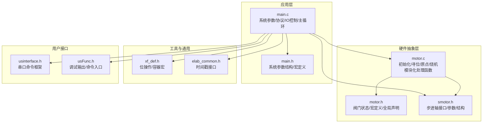
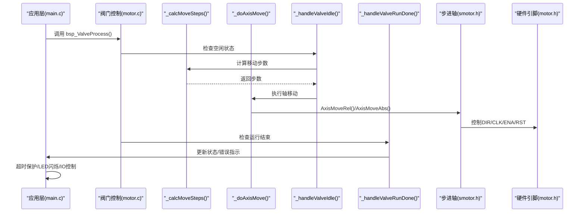
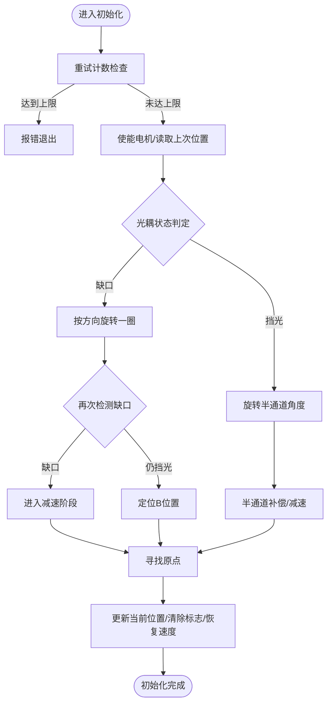
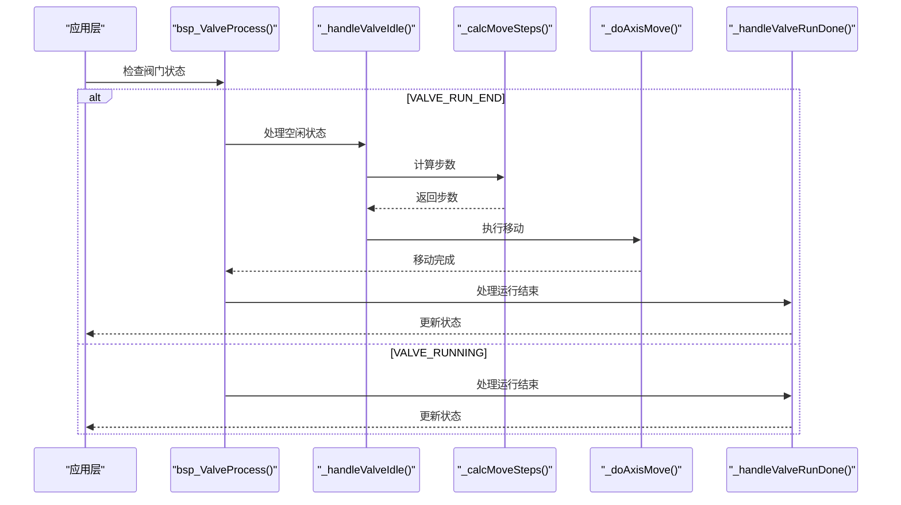
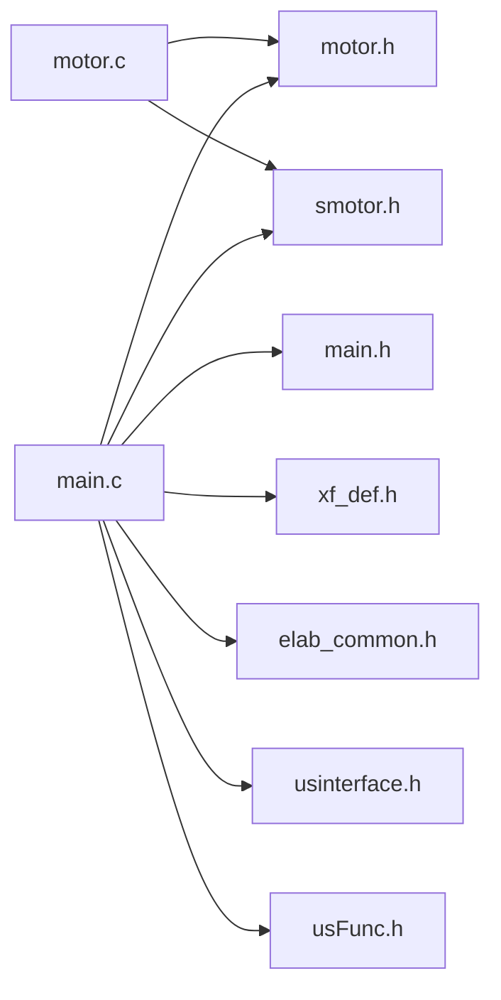

# 电机控制API

<cite>
**本文引用的文件**
- [motor.h](file://SRC/HARDWARE/motor/motor.h)
- [motor.c](file://SRC/HARDWARE/motor/motor.c)
- [smotor.h](file://SRC/HARDWARE/motor/smotor.h)
- [main.h](file://SRC/APP/main.h)
- [main.c](file://SRC/APP/main.c)
- [xf_def.h](file://SRC/3rd/xfusion/xf_common/xf_def.h)
- [elab_common.h](file://SRC/3rd/common/elab_common.h)
- [usinterface.h](file://SRC/HARDWARE/usinterface/usinterface.h)
- [usFunc.h](file://SRC/HARDWARE/usinterface/usFunc.h)
</cite>

## 目录
1. [简介](#简介)
2. [项目结构](#项目结构)
3. [核心组件](#核心组件)
4. [架构总览](#架构总览)
5. [详细组件分析](#详细组件分析)
6. [依赖关系分析](#依赖关系分析)
7. [性能考量](#性能考量)
8. [故障排查指南](#故障排查指南)
9. [结论](#结论)
10. [附录](#附录)

## 简介
本文件为电机控制模块的完整API参考文档，覆盖电机初始化、阀门控制、原点寻找、烧机测试、IO控制接口、硬件引脚配置宏定义、减速比与步进参数计算、错误处理与故障保护等关键主题。文档以"开发者可直接调用"的视角组织，提供函数签名路径、参数说明、返回值、使用示例与最佳实践，帮助快速集成与稳定运行。

**更新** 本版本反映了最新的模块化重构，原有的 `bsp_ValveProcess` 函数已被分解为四个专门的功能函数，提高了代码的可维护性和模块化程度。

## 项目结构
电机控制相关代码主要位于以下模块：
- 硬件抽象层：电机驱动与步进控制接口（motor.h/motor.c、smotor.h）
- 应用层：系统参数、协议、IO控制、主循环与保护机制（main.h/main.c）
- 工具与通用宏：位操作、容器与通用类型（xf_def.h、elab_common.h）
- 用户接口与调试：串口命令与调试输出（usinterface.h、usFunc.h）

**图示来源**
- [motor.h:1-236](file://SRC/HARDWARE/motor/motor.h#L1-L236)
- [motor.c:1-507](file://SRC/HARDWARE/motor/motor.c#L1-L507)
- [smotor.h:1-100](file://SRC/HARDWARE/motor/smotor.h#L1-L100)
- [main.h:1-230](file://SRC/APP/main.h#L1-L230)
- [main.c:1-384](file://SRC/APP/main.c#L1-L384)
- [xf_def.h:1-487](file://SRC/3rd/xfusion/xf_common/xf_def.h#L1-L487)
- [elab_common.h:1-36](file://SRC/3rd/common/elab_common.h#L1-L36)
- [usinterface.h:1-95](file://SRC/HARDWARE/usinterface/usinterface.h#L1-L95)
- [usFunc.h:1-55](file://SRC/HARDWARE/usinterface/usFunc.h#L1-L55)

**章节来源**
- [motor.h:1-236](file://SRC/HARDWARE/motor/motor.h#L1-L236)
- [motor.c:1-507](file://SRC/HARDWARE/motor/motor.c#L1-L507)
- [smotor.h:1-100](file://SRC/HARDWARE/motor/smotor.h#L1-L100)
- [main.h:1-230](file://SRC/APP/main.h#L1-L230)

## 核心组件
- 阀门状态结构体（_VALVE_T）：描述当前阀门位置、目标位置、运行状态、错误指示、补偿参数等。
- 减速比配置结构（RDC_T）：封装减速比、每圈步数、每度/每0.1度步数。
- 12通道修正联合体（_12VALVE_FIX）：包含各通道修正值、原点补偿、方向补偿、通道数等。
- 步进轴接口（smotor.h）：提供轴参数、状态机、移动接口（绝对/相对）、定时器回调等。
- 系统参数与IO控制（main.h/main.c）：协议类型、波特率、半通道、IO控制开关、超时保护、LED闪烁等。
- **模块化处理函数**：重构后的专用函数集合，包括步数计算、轴移动执行、空闲状态处理和运行结束处理。

**更新** 新增了四个模块化处理函数，每个函数负责特定的处理逻辑，提高了代码的可维护性和可测试性。

**章节来源**
- [motor.h:151-185](file://SRC/HARDWARE/motor/motor.h#L151-L185)
- [motor.h:188-195](file://SRC/HARDWARE/motor/motor.h#L188-L195)
- [motor.h:199-224](file://SRC/HARDWARE/motor/motor.h#L199-L224)
- [smotor.h:67-84](file://SRC/HARDWARE/motor/smotor.h#L67-L84)
- [main.h:229-241](file://SRC/APP/main.h#L229-L241)
- [motor.c:279-394](file://SRC/HARDWARE/motor/motor.c#L279-L394)

## 架构总览
电机控制采用"应用层-硬件抽象层-步进驱动"的分层设计：
- 应用层负责系统参数管理、协议解析、IO控制、超时保护与LED指示。
- 硬件抽象层负责阀门状态机、初始化流程、原点寻找、通道切换、烧机测试。
- 步进驱动提供统一的轴参数、状态机与移动接口，支持绝对/相对运动与急停减速。

**更新** 架构保持不变，但硬件抽象层内部实现了模块化重构，将复杂的阀门处理逻辑分解为更小、更专注的函数。

**图示来源**
- [motor.c:382-394](file://SRC/HARDWARE/motor/motor.c#L382-L394)
- [motor.c:279-320](file://SRC/HARDWARE/motor/motor.c#L279-L320)
- [motor.c:325-377](file://SRC/HARDWARE/motor/motor.c#L325-L377)
- [smotor.h:87-95](file://SRC/HARDWARE/motor/smotor.h#L87-L95)
- [motor.h:16-49](file://SRC/HARDWARE/motor/motor.h#L16-L49)

## 详细组件分析

### 阀门状态结构体（_VALVE_T）
描述当前阀门的运行状态、位置、补偿与错误指示等。

- 字段说明（节选）
  - OptStep/OptHigh/OptLow/stpCnt：光耦脉冲统计与补偿步数
  - BaudRate/ErrBlinkTime/Addr/status/optLast/retryTms：通信/错误/地址/状态/光耦历史/重试次数
  - initStep/portCur/portDes/direct/portLast：初始化步骤/当前位置/目标位置/方向/上一位置
  - iSet/lastIO/fixOrg/dirLast/statusLast/bStrtCnt/bHalfSeal/bNewInit/bEmgStopV/SnCode/spd：电流设置/IO状态/原点补偿/方向/状态/首轮丢弃/半通道/刚复位/急停标志/序列号/速度
- 使用方法
  - 通过全局变量访问与更新，配合初始化/寻位/切换流程使用
  - 错误时设置ErrBlinkTime触发LED闪烁；初始化完成后恢复速度参数

**章节来源**
- [motor.h:151-185](file://SRC/HARDWARE/motor/motor.h#L151-L185)

### 减速比配置（RDC_T）与步进参数
- RDC_T包含：减速比rate、每圈步数stepRound、每度步数stepP1dgr、每0.1度步数stepP01dgr
- 不同板型（A12_901/906/909）与减速比（1/4/10/16/20）下，每度/每0.1度步数由宏定义提供
- 计算关系
  - 每圈步数 = 细分数 × 200
  - 每度步数 = 每圈步数 / 360
  - 每0.1度步数 = 每度步数 / 10

**章节来源**
- [motor.h:188-195](file://SRC/HARDWARE/motor/motor.h#L188-L195)
- [motor.h:113-148](file://SRC/HARDWARE/motor/motor.h#L113-L148)

### 12通道修正联合体（_12VALVE_FIX）
- 提供各通道修正值（port1Val..port12Val）、原点补偿FIXO、方向补偿FIXG、通道数portCnt
- 用于初始化/切换过程中的补偿与半通道控制

**章节来源**
- [motor.h:199-224](file://SRC/HARDWARE/motor/motor.h#L199-L224)

### 步进轴接口（smotor.h）
- 轴参数：steps、accel、decel、speed、stpdecel、position、HomePos
- 运动状态：STOP、ACCEL、DECEL、RUN
- 轴状态结构（AXIS_T）：包含运行状态、方向、定时器延迟、减速起点、最小延迟、加速计数、原点回调、急停标志、IO引脚指针等
- 关键API
  - AxisMoveAbs(axis, step, accel, decel, speed)
  - AxisMoveRel(axis, step, accel, decel, speed)
  - AxisXTimer..AxisMTimer（定时器回调）

**章节来源**
- [smotor.h:46-95](file://SRC/HARDWARE/motor/smotor.h#L46-L95)

### 硬件引脚配置与IO控制
- 引脚宏（按板型）
  - LED_WORK：工作指示灯
  - VALVE_OPT：光耦输入
  - VALVE_ENA/VALVE_RST/VALVE_DIR/VALVE_CLK：电机使能/复位/方向/时钟
  - ISET_*：电流设置引脚（906/909）
- IO控制
  - IO_OUT/IO_IN：根据IO_RS宏选择不同板型的IO电平标准
  - bIoCtrl：IO控制开关（0/1），影响初始化/切换流程中的半通道行为

**章节来源**
- [motor.h:16-49](file://SRC/HARDWARE/motor/motor.h#L16-L49)
- [main.h:110-125](file://SRC/APP/main.h#L110-L125)
- [main.h:195](file://SRC/APP/main.h#L195)

### 初始化流程（InitValve）
- 功能：复位、根据光耦信号确定方向、寻找原点、半通道补偿、更新当前位置
- 关键步骤
  - 重试逻辑（retryTms）
  - 根据光耦状态决定旋转方向与角度
  - 触发减速与半通道补偿
  - 更新当前/目标位置，清除初始化标志，恢复速度参数
- 错误处理
  - 光耦信号异常时设置错误状态与LED闪烁

**图示来源**
- [motor.c:76-271](file://SRC/HARDWARE/motor/motor.c#L76-L271)

**章节来源**
- [motor.c:76-271](file://SRC/HARDWARE/motor/motor.c#L76-L271)

### 模块化阀门处理流程（重构后）
**更新** 原有的 `bsp_ValveProcess` 函数已被重构为四个专门的处理函数，每个函数负责特定的处理逻辑：

#### 步数计算函数（_calcMoveSteps）
- 功能：根据目标位置、半通道状态和方向补偿计算所需的移动步数
- 关键逻辑
  - 计算单通道步数 = 每圈步数 / 通道数
  - 半通道时步数折半
  - 方向补偿：dirGap × 每0.1度步数
  - A位置切换时特殊处理

#### 轴移动执行函数（_doAxisMove）
- 功能：根据是否刚复位选择相对或绝对移动方式执行轴移动
- 关键逻辑
  - 刚复位：使用相对移动（AxisMoveRel）
  - 正常切换：使用绝对移动（AxisMoveAbs）
  - 根据DIRECTION_SWITCH宏调整方向

#### 空闲状态处理函数（_handleValveIdle）
- 功能：处理阀门处于空闲状态时的切换请求
- 关键逻辑
  - 检查目标位置有效性
  - 计算移动步数并执行移动
  - 更新状态标志和保护计时

#### 运行结束处理函数（_handleValveRunDone）
- 功能：处理阀门运行结束后的位置更新和状态清理
- 关键逻辑
  - 光耦信号异常检测
  - 更新当前位置并写入EEPROM
  - 清理重试计数和目标位置
  - 更新切换次数和LED状态

**图示来源**
- [motor.c:382-394](file://SRC/HARDWARE/motor/motor.c#L382-L394)
- [motor.c:279-320](file://SRC/HARDWARE/motor/motor.c#L279-L320)
- [motor.c:325-377](file://SRC/HARDWARE/motor/motor.c#L325-L377)

**章节来源**
- [motor.c:279-394](file://SRC/HARDWARE/motor/motor.c#L279-L394)

### 原点寻找（ValveOrg）
- 功能：在光耦从挡光到缺口的跳变时，设置当前位置为原点补偿值，并进入减速阶段
- 行为
  - 初始化中处于特定步骤时，推进初始化流程
  - 目标为A位置时，重置初始化步骤

**章节来源**
- [motor.c:399-414](file://SRC/HARDWARE/motor/motor.c#L399-L414)

### 烧机测试（TestBurn）
- 功能：在指定地址或模式下，周期性切换通道或正反转，记录切换次数与老化次数
- 行为
  - 通过协议类型与GodMode/GodAddr判断是否启用
  - 定时器触发后，若处于运行结束状态则发起运动
  - 切换成功后写入EEPROM并更新计数

**章节来源**
- [motor.c:419-506](file://SRC/HARDWARE/motor/motor.c#L419-L506)

### 错误处理与故障保护
- 超时保护
  - 运行中与初始化中分别设置超时阈值，超时则设置错误状态与LED闪烁
- LED闪烁策略
  - 正常/重试/错误使用不同闪烁间隔
- 急停与减速
  - 原点/光耦信号触发减速，确保停止精度
- IO控制对初始化的影响
  - IO生效时禁用半通道；IO失效时启用半通道

**章节来源**
- [main.c:24-66](file://SRC/APP/main.c#L24-L66)
- [motor.c:399-414](file://SRC/HARDWARE/motor/motor.c#L399-L414)
- [motor.c:358-377](file://SRC/HARDWARE/motor/motor.c#L358-L377)

## 依赖关系分析
- motor.c 依赖 smotor.h 的轴接口与全局参数（accel/decel/speed/position/MotionStatus等）
- main.c 依赖 motor.h 的阀门状态与全局参数（syspara、bIoCtrl、spdVx2等）
- 位操作与容器宏来自 xf_def.h
- 时间戳接口来自 elab_common.h
- 用户接口与调试输出来自 usinterface.h/usFunc.h

**图示来源**
- [motor.c:1-507](file://SRC/HARDWARE/motor/motor.c#L1-L507)
- [motor.h:1-236](file://SRC/HARDWARE/motor/motor.h#L1-L236)
- [smotor.h:1-100](file://SRC/HARDWARE/motor/smotor.h#L1-L100)
- [main.h:1-230](file://SRC/APP/main.h#L1-L230)
- [xf_def.h:1-487](file://SRC/3rd/xfusion/xf_common/xf_def.h#L1-L487)
- [elab_common.h:1-36](file://SRC/3rd/common/elab_common.h#L1-L36)
- [usinterface.h:1-95](file://SRC/HARDWARE/usinterface/usinterface.h#L1-L95)
- [usFunc.h:1-55](file://SRC/HARDWARE/usinterface/usFunc.h#L1-L55)

**章节来源**
- [motor.c:1-507](file://SRC/HARDWARE/motor/motor.c#L1-L507)
- [motor.h:1-236](file://SRC/HARDWARE/motor/motor.h#L1-L236)
- [smotor.h:1-100](file://SRC/HARDWARE/motor/smotor.h#L1-L100)
- [main.h:1-230](file://SRC/APP/main.h#L1-L230)

## 性能考量
- 步进参数与减速比
  - 通过RDC_T与宏定义实现每度/每0.1度步数的精确换算，避免浮点运算开销
- 速度/加速度缩放
  - 速度与加/减速度按spd与rdc.rate缩放，便于统一调节
- 保护计时
  - 使用单次保护计时与LED闪烁策略，平衡实时性与可诊断性
- IO控制与半通道
  - IO控制开关影响初始化与切换路径，建议在稳定场景启用半通道以提升定位精度
- **模块化重构优势**
  - **更新** 重构后的函数职责单一，提高了代码的可维护性和可测试性
  - **更新** 减少了函数间的复杂耦合，提升了系统的整体稳定性

## 故障排查指南
- 初始化失败
  - 检查光耦信号与方向补偿；确认重试次数与错误闪烁间隔
  - 参考：初始化流程与错误闪烁设置
- 切换超时
  - 检查超时阈值与保护计时；确认运动状态与EEPROM写入
- 原点丢失
  - 检查原点回调与减速触发；核对原点补偿值
- IO控制异常
  - 核对IO_RS宏与IO电平标准；确认bIoCtrl状态
- **模块化处理问题**
  - **更新** 检查各处理函数的状态检查逻辑
  - **更新** 验证步数计算的边界条件和补偿值
  - **更新** 确认轴移动函数的方向设置是否正确

**章节来源**
- [motor.c:76-271](file://SRC/HARDWARE/motor/motor.c#L76-L271)
- [motor.c:279-394](file://SRC/HARDWARE/motor/motor.c#L279-L394)
- [motor.c:399-414](file://SRC/HARDWARE/motor/motor.c#L399-L414)
- [main.c:24-66](file://SRC/APP/main.c#L24-L66)

## 结论
本API文档梳理了电机控制模块的初始化、阀门控制、原点寻找、烧机测试、IO控制与故障保护等核心能力。通过明确的结构体字段、减速比与步进参数、硬件引脚宏与IO控制接口，开发者可快速集成并稳定运行。

**更新** 最新的模块化重构显著提升了代码质量，将复杂的阀门处理逻辑分解为四个专门的函数，每个函数职责清晰、易于维护。这种设计不仅提高了代码的可读性和可测试性，还为未来的功能扩展奠定了良好的基础。

建议在实际部署中结合板型差异、协议类型与IO控制策略，合理配置减速比、速度与保护阈值，确保系统可靠与可维护。

## 附录

### API清单与使用示例（路径指引）
- 电机配置
  - 函数：MotorCfg()
  - 作用：配置GPIO、复位引脚、定时器信号指针、电流设置
  - 示例路径：[motor.c:4-71](file://SRC/HARDWARE/motor/motor.c#L4-L71)
- 阀门初始化
  - 函数：InitValve()
  - 作用：复位、寻位、半通道补偿、更新位置
  - 示例路径：[motor.c:76-271](file://SRC/HARDWARE/motor/motor.c#L76-L271)
- **模块化阀门处理**（重构后）
  - 函数：bsp_ValveProcess()
  - 作用：协调各处理函数执行阀门切换
  - 示例路径：[motor.c:382-394](file://SRC/HARDWARE/motor/motor.c#L382-L394)
  - 步数计算：_calcMoveSteps()
  - 轴移动执行：_doAxisMove()
  - 空闲处理：_handleValveIdle()
  - 运行结束处理：_handleValveRunDone()
- 原点寻找
  - 函数：ValveOrg()
  - 作用：光耦跳变触发减速与原点定位
  - 示例路径：[motor.c:399-414](file://SRC/HARDWARE/motor/motor.c#L399-L414)
- 烧机测试
  - 函数：TestBurn()
  - 作用：周期性切换或正反转，记录老化次数
  - 示例路径：[motor.c:419-506](file://SRC/HARDWARE/motor/motor.c#L419-L506)
- 步进移动
  - 函数：AxisMoveAbs()/AxisMoveRel()
  - 作用：绝对/相对运动控制
  - 示例路径：[smotor.h:88-90](file://SRC/HARDWARE/motor/smotor.h#L88-L90)

### 关键数据结构与字段说明
- 阀门状态（_VALVE_T）
  - 字段：OptStep/OptHigh/OptLow/stpCnt、BaudRate、ErrBlinkTime、Addr、status、optLast、retryTms、initStep、portCur/portDes、direct、portLast、iSet/lastIO、fixOrg、dirLast/statusLast、bStrtCnt、bHalfSeal、bNewInit、bEmgStopV、SnCode、spd
  - 示例路径：[motor.h:151-185](file://SRC/HARDWARE/motor/motor.h#L151-L185)
- 减速比（RDC_T）
  - 字段：rate、stepRound、stepP1dgr、stepP01dgr
  - 示例路径：[motor.h:188-195](file://SRC/HARDWARE/motor/motor.h#L188-L195)
- 12通道修正（_12VALVE_FIX）
  - 字段：各通道修正值、原点补偿FIXO、方向补偿FIXG、portCnt
  - 示例路径：[motor.h:199-224](file://SRC/HARDWARE/motor/motor.h#L199-L224)
- 轴状态（AXIS_T）
  - 字段：run_state、dir、step_delay、decel_start、decel_val、min_delay、accel_count、SearchOrg、bEmgStop、signalCLK/DIR/CCR1/ARR/CR1
  - 示例路径：[smotor.h:67-84](file://SRC/HARDWARE/motor/smotor.h#L67-L84)

### 硬件引脚与IO控制宏
- 引脚宏（按板型）
  - LED_WORK、VALVE_OPT、VALVE_ENA、VALVE_RST、VALVE_DIR、VALVE_CLK、ISET_*
  - 示例路径：[motor.h:16-49](file://SRC/HARDWARE/motor/motor.h#L16-L49)
- IO控制
  - IO_OUT/IO_IN、bIoCtrl、IO_RS
  - 示例路径：[main.h:110-125](file://SRC/APP/main.h#L110-L125)
  - 示例路径：[main.h:195](file://SRC/APP/main.h#L195)

### 错误处理与保护
- 超时保护与LED闪烁
  - 示例路径：[main.c:24-66](file://SRC/APP/main.c#L24-L66)
- 急停与减速
  - 示例路径：[motor.c:399-414](file://SRC/HARDWARE/motor/motor.c#L399-L414)
- 重试与错误闪烁
  - 示例路径：[motor.c:358-377](file://SRC/HARDWARE/motor/motor.c#L358-L377)

### 模块化重构详情
**更新** 以下是重构后的新函数结构：

- **_calcMoveSteps(float *ftemp)**：计算移动步数
  - 输入：指向浮点数的指针
  - 输出：计算得到的步数
  - 关键逻辑：单通道步数计算、半通道补偿、方向补偿、目标位置处理
- **_doAxisMove(float ftemp)**：执行轴移动
  - 输入：移动步数
  - 输出：无
  - 关键逻辑：相对/绝对移动选择、方向调整、移动执行
- **_handleValveIdle(void)**：处理空闲状态
  - 输入：无
  - 输出：无
  - 关键逻辑：目标位置检查、步数计算、移动执行、状态更新
- **_handleValveRunDone(void)**：处理运行结束
  - 输入：无
  - 输出：无
  - 关键逻辑：光耦信号检测、位置更新、EEPROM写入、状态清理

**章节来源**
- [motor.c:279-394](file://SRC/HARDWARE/motor/motor.c#L279-L394)