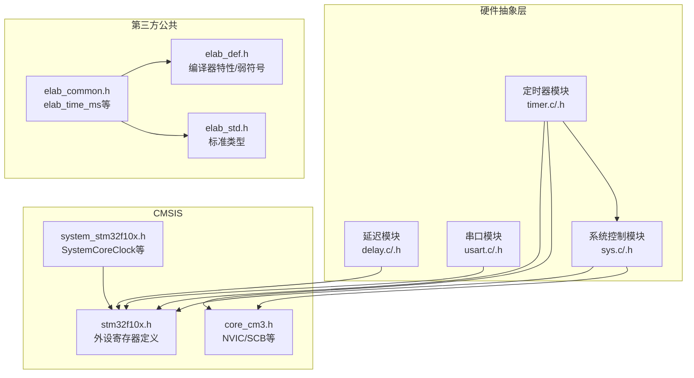
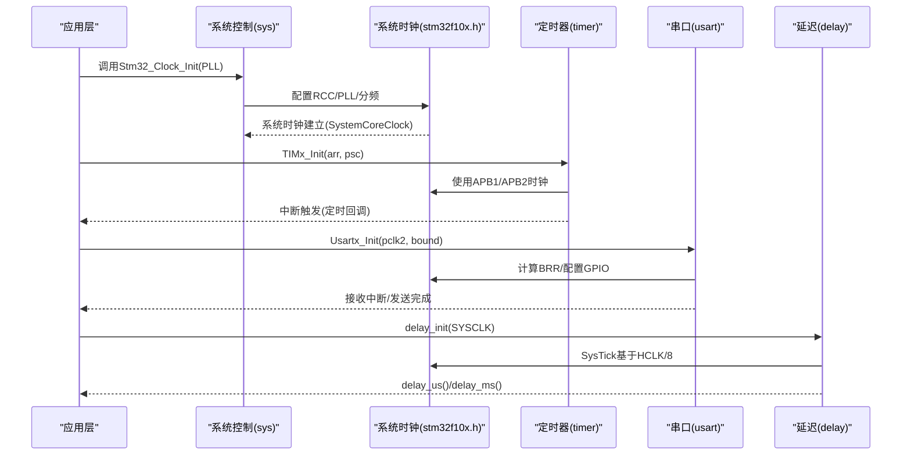
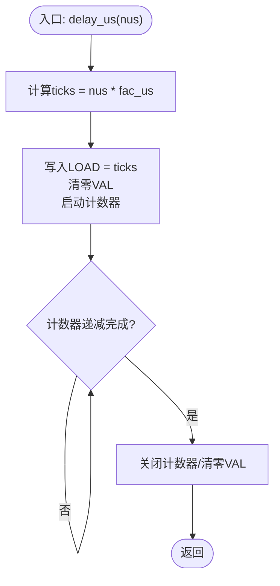
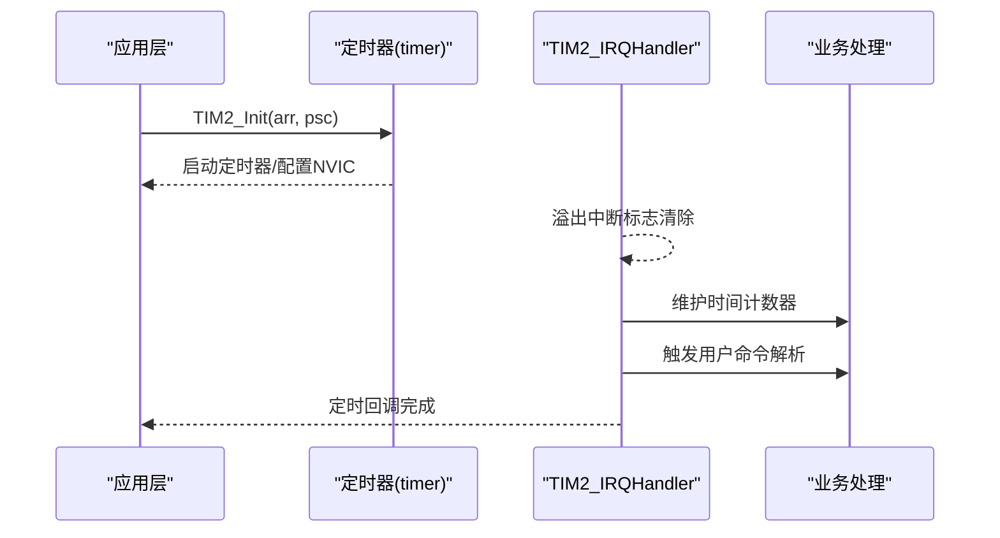
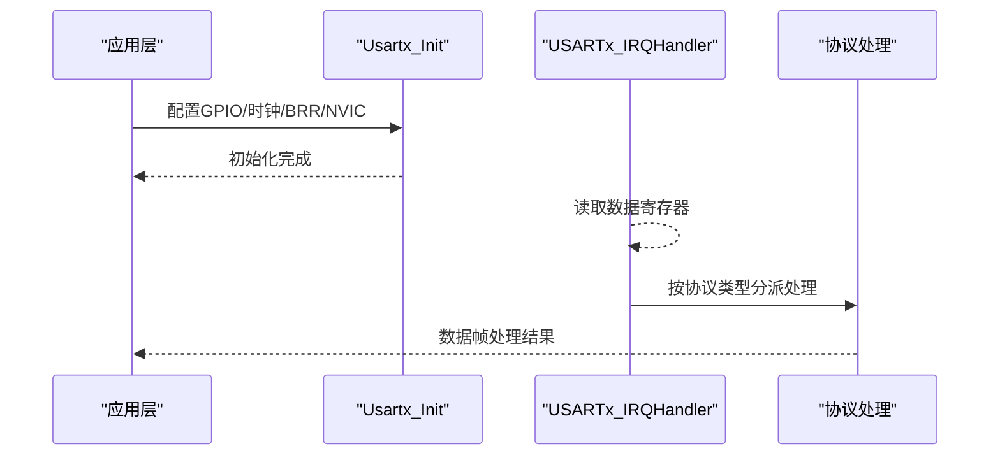
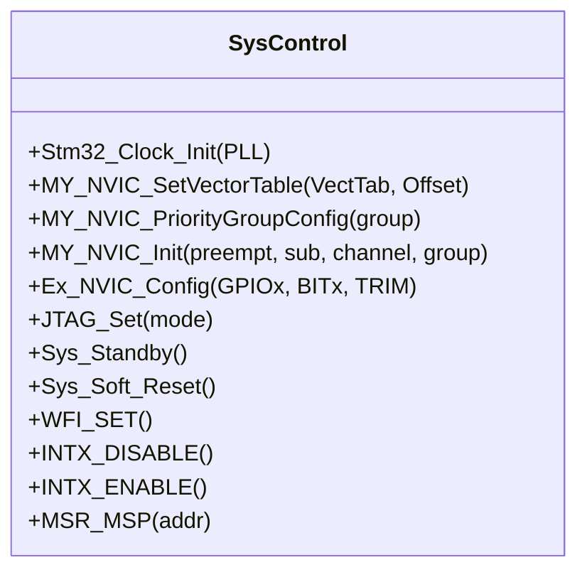
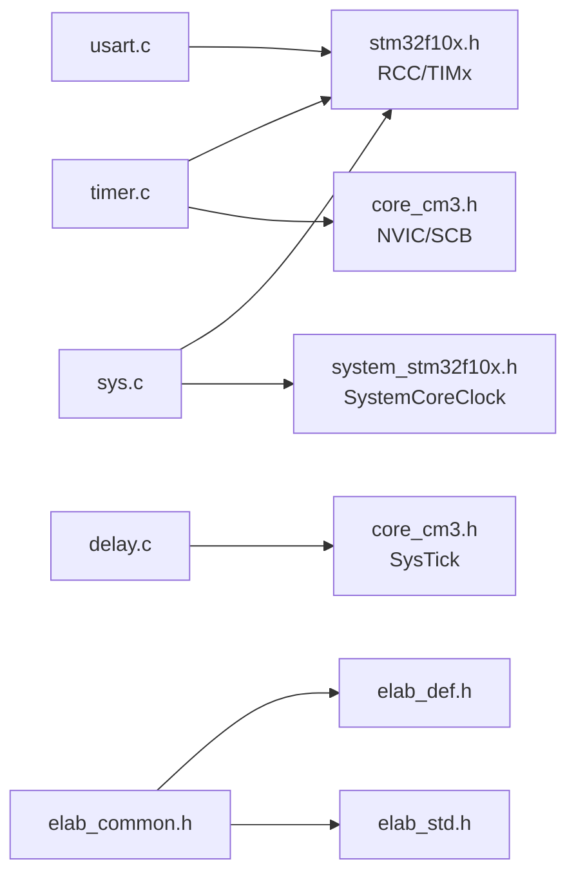

# 硬件抽象API

<cite>
**本文引用的文件**
- [delay.h](file://SRC/SYSTEM/delay/delay.h)
- [delay.c](file://SRC/SYSTEM/delay/delay.c)
- [timer.h](file://SRC/SYSTEM/timer/timer.h)
- [timer.c](file://SRC/SYSTEM/timer/timer.c)
- [usart.h](file://SRC/SYSTEM/usart/usart.h)
- [usart.c](file://SRC/SYSTEM/usart/usart.c)
- [sys.h](file://SRC/SYSTEM/sys/sys.h)
- [sys.c](file://SRC/SYSTEM/sys/sys.c)
- [stm32f10x.h](file://SRC/CMSIS/DeviceSupport/stm32f10x.h)
- [core_cm3.h](file://SRC/CMSIS/CoreSupport/core_cm3.h)
- [system_stm32f10x.h](file://SRC/CMSIS/DeviceSupport/system_stm32f10x.h)
- [elab_common.h](file://SRC/3rd/common/elab_common.h)
- [elab_def.h](file://SRC/3rd/common/elab_def.h)
- [elab_std.h](file://SRC/3rd/common/elab_std.h)
</cite>

## 目录
1. [简介](#简介)
2. [项目结构](#项目结构)
3. [核心组件](#核心组件)
4. [架构总览](#架构总览)
5. [详细组件分析](#详细组件分析)
6. [依赖关系分析](#依赖关系分析)
7. [性能考量](#性能考量)
8. [故障排查指南](#故障排查指南)
9. [结论](#结论)
10. [附录](#附录)

## 简介
本文件为本项目的硬件抽象层（HAL）API参考与使用指南，覆盖延时函数、定时器配置、串口通信、系统初始化、NVIC中断配置、系统时钟配置等底层硬件接口。文档同时说明延时精度与定时器分辨率相关的API使用方法，并提供USART初始化配置、数据收发处理的完整接口说明。此外，文档还包含硬件版本兼容性相关的条件编译接口说明，帮助嵌入式开发者快速理解并正确使用这些底层硬件控制API。

## 项目结构
硬件抽象层位于SRC/SYSTEM目录下，分别提供延时、定时器、串口、系统控制四个子模块；底层外设寄存器定义来自CMSIS设备头文件；第三方公共头文件提供通用类型与弱符号支持。

**图表来源**
- [delay.c:1-160](file://SRC/SYSTEM/delay/delay.c#L1-L160)
- [timer.c:1-223](file://SRC/SYSTEM/timer/timer.c#L1-L223)
- [usart.c:1-292](file://SRC/SYSTEM/usart/usart.c#L1-L292)
- [sys.c:1-201](file://SRC/SYSTEM/sys/sys.c#L1-L201)
- [stm32f10x.h:1-200](file://SRC/CMSIS/DeviceSupport/stm32f10x.h#L1-L200)
- [core_cm3.h:132-148](file://SRC/CMSIS/CoreSupport/core_cm3.h#L132-L148)
- [system_stm32f10x.h:53-80](file://SRC/CMSIS/DeviceSupport/system_stm32f10x.h#L53-L80)
- [elab_common.h:28-29](file://SRC/3rd/common/elab_common.h#L28-L29)

**章节来源**
- [delay.h:1-52](file://SRC/SYSTEM/delay/delay.h#L1-L52)
- [delay.c:1-160](file://SRC/SYSTEM/delay/delay.c#L1-L160)
- [timer.h:1-70](file://SRC/SYSTEM/timer/timer.h#L1-L70)
- [timer.c:1-223](file://SRC/SYSTEM/timer/timer.c#L1-L223)
- [usart.h:1-57](file://SRC/SYSTEM/usart/usart.h#L1-L57)
- [usart.c:1-292](file://SRC/SYSTEM/usart/usart.c#L1-L292)
- [sys.h:1-99](file://SRC/SYSTEM/sys/sys.h#L1-L99)
- [sys.c:1-201](file://SRC/SYSTEM/sys/sys.c#L1-L201)
- [stm32f10x.h:1-200](file://SRC/CMSIS/DeviceSupport/stm32f10x.h#L1-L200)
- [core_cm3.h:132-148](file://SRC/CMSIS/CoreSupport/core_cm3.h#L132-L148)
- [system_stm32f10x.h:53-80](file://SRC/CMSIS/DeviceSupport/system_stm32f10x.h#L53-L80)
- [elab_common.h:28-29](file://SRC/3rd/common/elab_common.h#L28-L29)

## 核心组件
- 延迟模块：提供微秒与毫秒级延迟，基于SysTick或RTOS节拍（如适用）。
- 定时器模块：通用定时器中断初始化与服务例程，含外部中断配置。
- 串口模块：USART1/2/3初始化、中断接收处理、发送接口；在特定硬件版本下支持UART4。
- 系统控制模块：系统时钟初始化、NVIC优先级分组与中断配置、外部中断配置、JTAG模式设置、待机/软复位等。

**章节来源**
- [delay.h:11-13](file://SRC/SYSTEM/delay/delay.h#L11-L13)
- [delay.c:23-42](file://SRC/SYSTEM/delay/delay.c#L23-L42)
- [timer.h:31-39](file://SRC/SYSTEM/timer/timer.h#L31-L39)
- [timer.c:11-19](file://SRC/SYSTEM/timer/timer.c#L11-L19)
- [usart.h:22-37](file://SRC/SYSTEM/usart/usart.h#L22-L37)
- [usart.c:38-66](file://SRC/SYSTEM/usart/usart.c#L38-L66)
- [sys.h:73-86](file://SRC/SYSTEM/sys/sys.h#L73-L86)
- [sys.c:152-172](file://SRC/SYSTEM/sys/sys.c#L152-L172)

## 架构总览
硬件抽象层通过统一的API封装底层外设寄存器访问，向上提供稳定易用的接口。系统时钟由系统控制模块配置，定时器与串口模块在该时钟基础上进行分频与中断配置，延迟模块基于SysTick实现高精度延时。

**图表来源**
- [sys.c:152-172](file://SRC/SYSTEM/sys/sys.c#L152-L172)
- [timer.c:11-19](file://SRC/SYSTEM/timer/timer.c#L11-L19)
- [usart.c:38-66](file://SRC/SYSTEM/usart/usart.c#L38-L66)
- [delay.c:23-42](file://SRC/SYSTEM/delay/delay.c#L23-L42)
- [stm32f10x.h:115-121](file://SRC/CMSIS/DeviceSupport/stm32f10x.h#L115-L121)

## 详细组件分析

### 延迟函数API
- 初始化
  - 函数：delay_init(SYSCLK)
  - 功能：初始化SysTick，计算us/ms倍乘因子；在RTOS环境下配置节拍中断。
  - 参数：SYSCLK（MHz），用于计算fac_us与fac_ms。
  - 注意：SysTick时钟为HCLK/8。
- 微秒延时
  - 函数：delay_us(nus)
  - 行为：在非RTOS环境下直接使用SysTick递减计数实现；在RTOS环境下通过调度锁保证精度。
- 毫秒延时
  - 函数：delay_ms(nms)
  - 行为：在RTOS环境下结合OSTimeDly与delay_us实现；非RTOS环境下使用SysTick递减计数实现。

延时精度与限制
- 精度来源：fac_us = SYSCLK/8，fac_ms = fac_us*1000。
- 限制：SysTick为24位递减计数器，最大延时约0xffffff*8*1000/SYSCLK（单位ms）。在72MHz下约为1864ms。

**章节来源**
- [delay.h:11-13](file://SRC/SYSTEM/delay/delay.h#L11-L13)
- [delay.c:23-42](file://SRC/SYSTEM/delay/delay.c#L23-L42)
- [delay.c:88-122](file://SRC/SYSTEM/delay/delay.c#L88-L122)
- [delay.c:47-83](file://SRC/SYSTEM/delay/delay.c#L47-L83)

**图表来源**
- [delay.c:88-101](file://SRC/SYSTEM/delay/delay.c#L88-L101)

### 定时器配置与中断API
- 定时器初始化
  - TIM2_Init(arr, psc)：通用定时器2，1ms基准（ARR/PSC设置），开启更新中断，配置NVIC优先级。
  - TIM3_Init(arr, psc)：通用定时器3，1ms基准，开启更新中断，配置NVIC优先级。
  - TIM4_Init(arr, psc)：通用定时器4，1ms基准，开启更新中断，配置NVIC优先级。
  - 条件编译：STM32RC_C8版本额外提供TIM5/TIM6/TIM7初始化与中断服务例程。
- 中断服务例程
  - TIM2_IRQHandler：维护多类时间计数器（调试、命令、毫秒、超时、秒、LED检测），并在特定状态下触发用户命令解析。
  - TIM3_IRQHandler：根据协议类型调用相应的时间处理函数（AGS_MODBUS或MODBUS）。
  - TIM4_IRQHandler：调用轴向定时器处理函数。
  - 条件编译：STM32RC_C8版本提供TIM5/TIM6/TIM7的ISR占位。
- 外部中断
  - EXTI_Init：配置PB9为外部中断输入，下降沿触发，NVIC优先级设置。
  - EXTI9_5_IRQHandler：清除中断挂起标志。

定时器分辨率与精度
- 分辨率：ARR/PSC决定计数频率与溢出周期；示例中ARR/PSC设置为1ms基准。
- 精度：受系统时钟与分频影响，典型1ms级定时。

**章节来源**
- [timer.h:31-39](file://SRC/SYSTEM/timer/timer.h#L31-L39)
- [timer.c:11-19](file://SRC/SYSTEM/timer/timer.c#L11-L19)
- [timer.c:22-42](file://SRC/SYSTEM/timer/timer.c#L22-L42)
- [timer.c:51-59](file://SRC/SYSTEM/timer/timer.c#L51-L59)
- [timer.c:62-73](file://SRC/SYSTEM/timer/timer.c#L62-L73)
- [timer.c:81-89](file://SRC/SYSTEM/timer/timer.c#L81-L89)
- [timer.c:92-99](file://SRC/SYSTEM/timer/timer.c#L92-L99)
- [timer.c:114-139](file://SRC/SYSTEM/timer/timer.c#L114-L139)
- [timer.c:197-206](file://SRC/SYSTEM/timer/timer.c#L197-L206)
- [timer.c:211-214](file://SRC/SYSTEM/timer/timer.c#L211-L214)

**图表来源**
- [timer.c:11-19](file://SRC/SYSTEM/timer/timer.c#L11-L19)
- [timer.c:22-42](file://SRC/SYSTEM/timer/timer.c#L22-L42)

### 串口通信API
- 初始化
  - Usart1_Init(pclk2, bound)：配置PA9/PA10，计算BRR，启用接收中断（可选），配置NVIC。
  - Usart2_Init(pclk2, bound)：配置PA2/PA3，计算BRR，启用接收中断（可选），配置NVIC。
  - Usart3_Init(pclk2, bound)：配置PB10/PB11，计算BRR，启用接收中断（可选），配置NVIC。
  - 条件编译：STM32RC_C8版本提供Uart4_Init(pclk2, bound)，配置PC10/PC11。
- 中断处理
  - USART1_IRQHandler：接收数据，调用数据采集函数。
  - USART2_IRQHandler：接收数据，按协议类型分派至AGS_MODBUS或MODBUS处理。
  - USART3_IRQHandler：接收数据，按协议类型分派至AGS_MODBUS或MODBUS处理。
  - 条件编译：STM32RC_C8版本提供UART4_IRQHandler占位。
- 发送接口
  - Usart2_SendB/ch、USART2_SendStr/s：串口2发送单字节/字符串。
  - Usart3_SendB/ch、USART3_SendStr/s：串口3发送单字节/字符串。
  - 条件编译：STM32RC_C8版本提供Uart4_SendB/ch、UART4_SendStr/s。
- 波特率计算
  - 依据公式：波特率 = fck / (16 * USARTDIV)，其中USARTDIV = 整数部分<<4 + 小数部分。

USART初始化配置要点
- 时钟使能：分别为APB2（GPIOA/USART1）与APB1（USART2/USART3）。
- IO配置：TX为复用推挽输出，RX为上/下拉输入。
- 接收中断：根据EN_UARTx_RX宏控制是否启用PE中断与接收缓冲区非空中断。
- NVIC优先级：不同串口配置不同抢占/响应优先级。

**章节来源**
- [usart.h:22-37](file://SRC/SYSTEM/usart/usart.h#L22-L37)
- [usart.c:38-66](file://SRC/SYSTEM/usart/usart.c#L38-L66)
- [usart.c:91-120](file://SRC/SYSTEM/usart/usart.c#L91-L120)
- [usart.c:159-188](file://SRC/SYSTEM/usart/usart.c#L159-L188)
- [usart.c:229-258](file://SRC/SYSTEM/usart/usart.c#L229-L258)
- [usart.c:74-83](file://SRC/SYSTEM/usart/usart.c#L74-L83)
- [usart.c:138-151](file://SRC/SYSTEM/usart/usart.c#L138-L151)
- [usart.c:208-221](file://SRC/SYSTEM/usart/usart.c#L208-L221)
- [usart.c:278-286](file://SRC/SYSTEM/usart/usart.c#L278-L286)

**图表来源**
- [usart.c:38-66](file://SRC/SYSTEM/usart/usart.c#L38-L66)
- [usart.c:138-151](file://SRC/SYSTEM/usart/usart.c#L138-L151)
- [usart.c:208-221](file://SRC/SYSTEM/usart/usart.c#L208-L221)

### 系统时钟与NVIC配置API
- 系统时钟初始化
  - 函数：Stm32_Clock_Init(PLL)
  - 步骤：外部高速时钟使能与等待、AHB/APB分频设置、PLL倍频设置与等待锁定、切换系统时钟源。
  - 影响：SystemCoreClock更新，后续外设时钟与定时器/串口等均依赖该频率。
- NVIC配置
  - MY_NVIC_SetVectorTable：设置向量表偏移地址（RAM或ROM）。
  - MY_NVIC_PriorityGroupConfig：设置优先级分组（0~4组）。
  - MY_NVIC_Init：设置抢占优先级、响应优先级、中断通道与分组，使能中断并写入优先级。
- 外部中断
  - Ex_NVIC_Config：配置GPIOx引脚映射到EXTI线、触发方式（上升/下降/任意），并使能对应中断屏蔽线。
- 其他系统控制
  - JTAG_Set(mode)：设置JTAG/SWD模式。
  - Sys_Standby/Sys_Soft_Reset：待机模式与软复位。
  - WFI_SET/INTX_DISABLE/INTX_ENABLE/MSR_MSP：低功耗与中断控制、设置主堆栈指针。

NVIC优先级分组与数值范围
- 组0：0位抢占优先级，4位响应优先级
- 组1：1位抢占优先级，3位响应优先级
- 组2：2位抢占优先级，2位响应优先级
- 组3：3位抢占优先级，1位响应优先级
- 组4：4位抢占优先级，0位响应优先级
- 数值越小优先级越高。

**章节来源**
- [sys.h:73-86](file://SRC/SYSTEM/sys/sys.h#L73-L86)
- [sys.c:8-25](file://SRC/SYSTEM/sys/sys.c#L8-L25)
- [sys.c:15-49](file://SRC/SYSTEM/sys/sys.c#L15-L49)
- [sys.c:59-73](file://SRC/SYSTEM/sys/sys.c#L59-L73)
- [sys.c:122-135](file://SRC/SYSTEM/sys/sys.c#L122-L135)
- [sys.c:141-149](file://SRC/SYSTEM/sys/sys.c#L141-L149)
- [sys.c:99-119](file://SRC/SYSTEM/sys/sys.c#L99-L119)
- [core_cm3.h:132-148](file://SRC/CMSIS/CoreSupport/core_cm3.h#L132-L148)
- [system_stm32f10x.h:53-80](file://SRC/CMSIS/DeviceSupport/system_stm32f10x.h#L53-L80)

**图表来源**
- [sys.h:73-86](file://SRC/SYSTEM/sys/sys.h#L73-L86)
- [sys.c:8-25](file://SRC/SYSTEM/sys/sys.c#L8-L25)
- [sys.c:15-49](file://SRC/SYSTEM/sys/sys.c#L15-L49)
- [sys.c:59-73](file://SRC/SYSTEM/sys/sys.c#L59-L73)
- [sys.c:141-149](file://SRC/SYSTEM/sys/sys.c#L141-L149)
- [sys.c:122-135](file://SRC/SYSTEM/sys/sys.c#L122-L135)
- [sys.c:99-119](file://SRC/SYSTEM/sys/sys.c#L99-L119)

### 条件编译与硬件版本兼容性
- 条件编译宏：STM32RC_C8
  - 作用：在特定硬件版本（如C8系列）下启用额外定时器（TIM5/TIM6/TIM7）与串口（UART4）相关API。
  - 影响：仅在定义STM32RC_C8时编译对应初始化与中断处理函数，避免在不支持的硬件上生成无效代码。

**章节来源**
- [timer.h:34-39](file://SRC/SYSTEM/timer/timer.h#L34-L39)
- [timer.c:114-139](file://SRC/SYSTEM/timer/timer.c#L114-L139)
- [usart.h:32-37](file://SRC/SYSTEM/usart/usart.h#L32-L37)
- [usart.c:229-258](file://SRC/SYSTEM/usart/usart.c#L229-L258)

## 依赖关系分析
- 外设寄存器与中断
  - timer.c依赖stm32f10x.h中的RCC、TIM2/3/4/5/6/7寄存器与core_cm3.h中的NVIC/SCB结构体。
  - usart.c依赖stm32f10x.h中的USART1/2/3/UART4寄存器与GPIO/AFIO配置。
  - delay.c依赖SysTick（由core_cm3.h提供）。
- 系统时钟
  - sys.c通过RCC配置系统时钟，影响SystemCoreClock，进而影响delay/timer/usart等模块的时序。
- 第三方公共头
  - elab_common.h提供弱符号与编译器适配，便于扩展与移植。

**图表来源**
- [timer.c:11-19](file://SRC/SYSTEM/timer/timer.c#L11-L19)
- [usart.c:38-66](file://SRC/SYSTEM/usart/usart.c#L38-L66)
- [delay.c:23-42](file://SRC/SYSTEM/delay/delay.c#L23-L42)
- [sys.c:152-172](file://SRC/SYSTEM/sys/sys.c#L152-L172)
- [stm32f10x.h:1-200](file://SRC/CMSIS/DeviceSupport/stm32f10x.h#L1-L200)
- [core_cm3.h:132-148](file://SRC/CMSIS/CoreSupport/core_cm3.h#L132-L148)
- [system_stm32f10x.h:53-80](file://SRC/CMSIS/DeviceSupport/system_stm32f10x.h#L53-L80)
- [elab_common.h:28-29](file://SRC/3rd/common/elab_common.h#L28-L29)

**章节来源**
- [timer.c:1-223](file://SRC/SYSTEM/timer/timer.c#L1-L223)
- [usart.c:1-292](file://SRC/SYSTEM/usart/usart.c#L1-L292)
- [delay.c:1-160](file://SRC/SYSTEM/delay/delay.c#L1-L160)
- [sys.c:1-201](file://SRC/SYSTEM/sys/sys.c#L1-L201)
- [stm32f10x.h:1-200](file://SRC/CMSIS/DeviceSupport/stm32f10x.h#L1-L200)
- [core_cm3.h:132-148](file://SRC/CMSIS/CoreSupport/core_cm3.h#L132-L148)
- [system_stm32f10x.h:53-80](file://SRC/CMSIS/DeviceSupport/system_stm32f10x.h#L53-L80)
- [elab_common.h:28-29](file://SRC/3rd/common/elab_common.h#L28-L29)

## 性能考量
- SysTick延时
  - 在非RTOS环境下，delay_us/delay_ms通过SysTick递减计数实现，受CPU主频与分频影响；建议在高频系统中优先使用us级延时以减少误差累积。
  - 24位计数器上限导致最大延时受限，应避免一次性大跨度延时。
- 定时器精度
  - 通过合理设置ARR/PSC获得所需分辨率；示例中为1ms基准，若需更高精度，应降低ARR或提高PSC。
- 串口波特率
  - 波特率计算采用整数与小数部分合成，实际波特率可能与目标值存在误差；可通过调整pclk2或bound逼近目标值。
- NVIC优先级
  - 合理设置抢占/响应优先级，避免关键中断被低优先级阻塞；组划分影响可用位宽。

## 故障排查指南
- 延时异常
  - 现象：延时不准确或卡死。
  - 排查：确认delay_init(SYSCLK)已按实际系统时钟调用；检查fac_us/fac_ms是否正确计算；避免在RTOS环境下误用非RTOS路径。
- 定时器不触发
  - 现象：定时器中断未发生。
  - 排查：确认RCC时钟已使能、ARR/PSC设置正确、NVIC优先级组与数值有效、中断标志位已清除。
- 串口接收不到数据
  - 现象：接收中断未触发。
  - 排查：确认GPIO复用时钟与串口时钟已使能、RX引脚上/下拉配置正确、接收中断已启用、NVIC优先级设置合理。
- NVIC优先级冲突
  - 现象：中断抢占异常或系统不稳定。
  - 排查：统一使用MY_NVIC_PriorityGroupConfig设置组别，确保preempt/sub在组范围内；避免同组内优先级重复过高。

**章节来源**
- [delay.c:23-42](file://SRC/SYSTEM/delay/delay.c#L23-L42)
- [timer.c:11-19](file://SRC/SYSTEM/timer/timer.c#L11-L19)
- [usart.c:38-66](file://SRC/SYSTEM/usart/usart.c#L38-L66)
- [sys.c:15-49](file://SRC/SYSTEM/sys/sys.c#L15-L49)

## 结论
本硬件抽象层提供了统一、稳定的底层接口，涵盖延时、定时器、串口、系统控制与NVIC配置等关键能力。通过SysTick与通用定时器实现高精度延时与定时，通过USART实现灵活的数据收发；系统时钟初始化确保各模块时序一致。条件编译机制支持多硬件版本兼容。建议在实际工程中严格遵循API使用规范与优先级分组策略，以获得最佳稳定性与性能。

## 附录
- 关键常量与类型
  - 时间单位：SEC=1000、HSEC=500、DCSEC=100。
  - 编译器弱符号：ELAB_WEAK用于跨模块弱引用。
- 典型使用流程
  - 系统初始化：调用Stm32_Clock_Init配置系统时钟。
  - 外设初始化：按需调用TIMx_Init/Usartx_Init/MY_NVIC_Init。
  - 延时使用：delay_init(SYSCLK)后调用delay_us/delay_ms。
  - 数据收发：配置串口后在中断中处理数据，或使用发送接口主动发送。