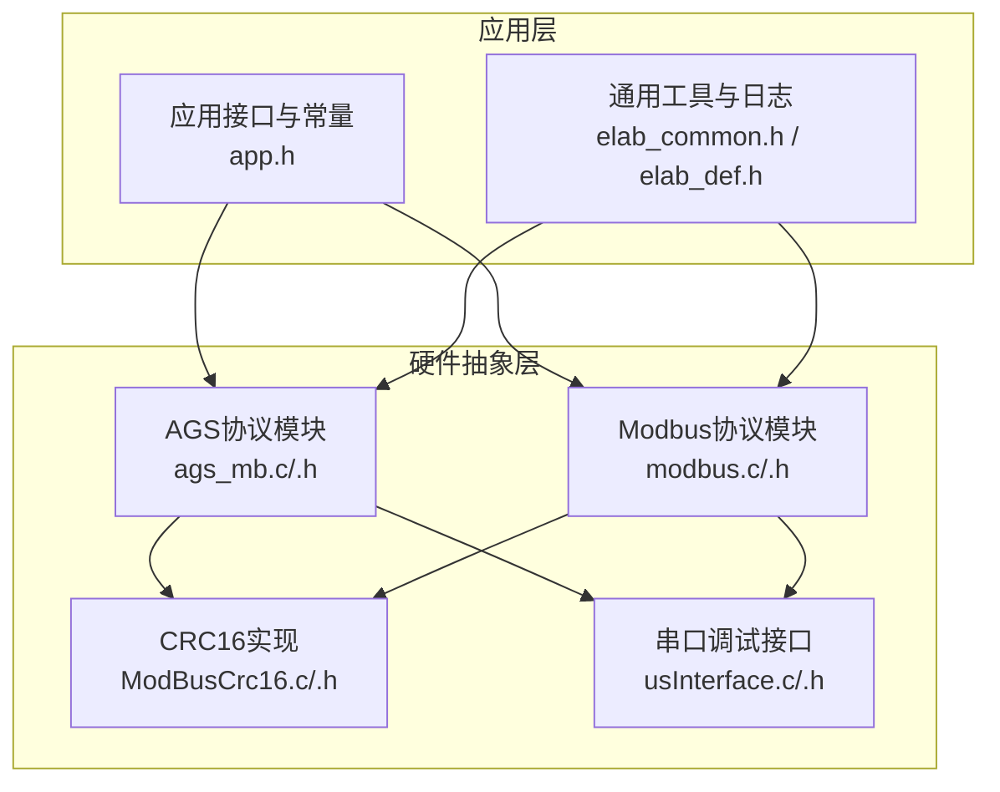
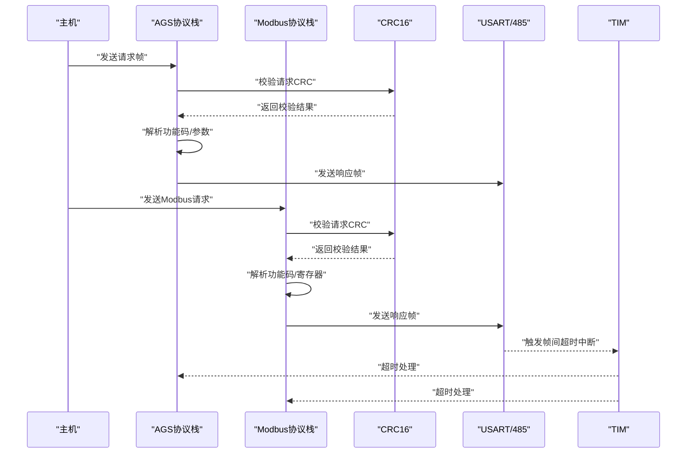
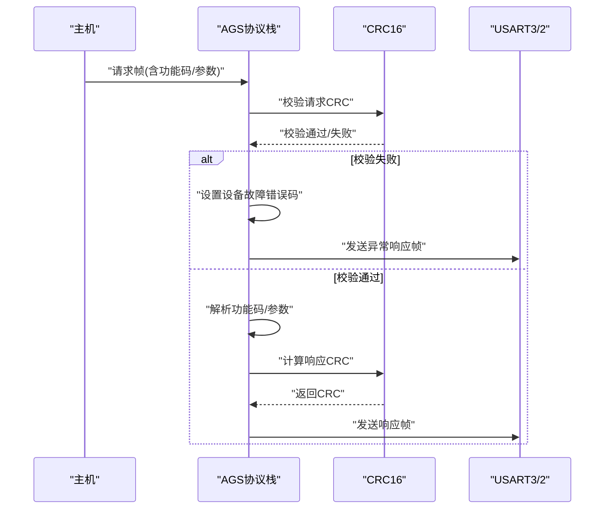
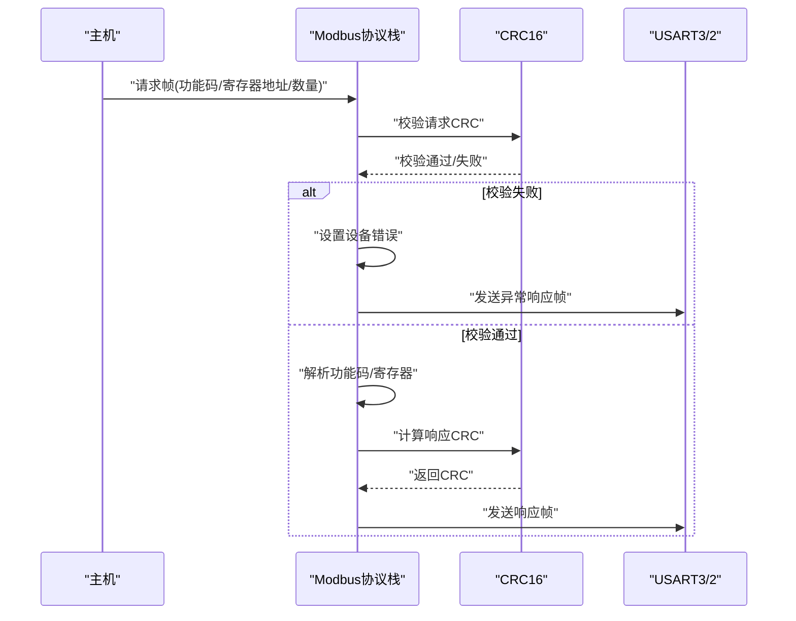
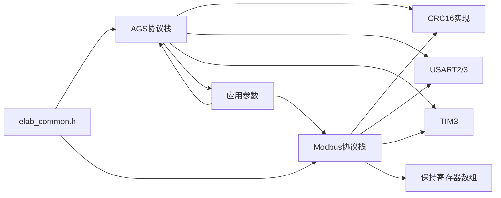

# 通信协议API

<cite>
**本文引用的文件**
- [ags_mb.h](file://SRC/HARDWARE/ags_mb/ags_mb.h)
- [ags_mb.c](file://SRC/HARDWARE/ags_mb/ags_mb.c)
- [ModBusCrc16.h](file://SRC/HARDWARE/ags_mb/ModBusCrc16.h)
- [ModBusCrc16.c](file://SRC/HARDWARE/ags_mb/ModBusCrc16.c)
- [modbus.h](file://SRC/HARDWARE/modbus/modbus.h)
- [modbus.c](file://SRC/HARDWARE/modbus/modbus.c)
- [usInterface.h](file://SRC/HARDWARE/usinterface/usInterface.h)
- [usInterface.c](file://SRC/HARDWARE/usinterface/usInterface.c)
- [usFunc.h](file://SRC/HARDWARE/usinterface/usFunc.h)
- [elab_common.h](file://SRC/3rd/common/elab_common.h)
- [elab_def.h](file://SRC/3rd/common/elab_def.h)
- [app.h](file://SRC/APP/app.h)
</cite>

## 目录
1. [简介](#简介)
2. [项目结构](#项目结构)
3. [核心组件](#核心组件)
4. [架构总览](#架构总览)
5. [详细组件分析](#详细组件分析)
6. [依赖关系分析](#依赖关系分析)
7. [性能考量](#性能考量)
8. [故障排查指南](#故障排查指南)
9. [结论](#结论)
10. [附录](#附录)

## 简介
本文件为通信协议栈的完整API参考文档，聚焦两类协议：
- AGS协议：基于Modbus RTU的扩展协议，面向阀门切换器的设备控制与状态读写。
- Modbus协议：通用Modbus RTU协议栈，提供读写保持寄存器、异常处理与CRC校验。

文档覆盖以下主题：
- 协议初始化与串口/定时器配置
- 数据帧处理流程与功能码解析
- 寄存器映射与消息格式
- CRC校验、错误处理与异常码
- 通信参数与协议配置接口
- 协议扩展与自定义功能接口
- 为开发者提供的接口调用参考与实现指南

## 项目结构
协议栈位于硬件抽象层，分别实现AGS协议与Modbus协议两个子系统，均通过串口与定时器驱动进行数据收发与帧间超时管理，并提供CRC校验与错误处理机制。

**图示来源**
- [ags_mb.c:1-474](file://SRC/HARDWARE/ags_mb/ags_mb.c#L1-L474)
- [modbus.c:1-776](file://SRC/HARDWARE/modbus/modbus.c#L1-L776)
- [ModBusCrc16.c:1-76](file://SRC/HARDWARE/ags_mb/ModBusCrc16.c#L1-L76)
- [usInterface.c:1-577](file://SRC/HARDWARE/usinterface/usInterface.c#L1-L577)
- [app.h:1-37](file://SRC/APP/app.h#L1-L37)
- [elab_common.h:1-36](file://SRC/3rd/common/elab_common.h#L1-L36)
- [elab_def.h:1-49](file://SRC/3rd/common/elab_def.h#L1-L49)

**章节来源**
- [ags_mb.h:1-163](file://SRC/HARDWARE/ags_mb/ags_mb.h#L1-L163)
- [modbus.h:1-213](file://SRC/HARDWARE/modbus/modbus.h#L1-L213)
- [usInterface.h:1-95](file://SRC/HARDWARE/usinterface/usInterface.h#L1-L95)

## 核心组件
- AGS协议模块
  - 提供协议初始化、发送/接收、超时处理、功能码解析与错误响应。
  - 支持功能码：读保持寄存器、预置单个保持寄存器等扩展功能。
  - 提供CRC16校验与异常码处理。
- Modbus协议模块
  - 提供通用Modbus RTU协议栈，支持读保持寄存器、写单个/多个保持寄存器。
  - 提供寄存器映射与读写回调，支持异常处理与CRC校验。
- CRC16实现
  - 提供Modbus标准CRC16查找表与计算函数。
- 串口调试接口
  - 提供命令解析、参数提取与超时处理，便于开发调试。

**章节来源**
- [ags_mb.c:7-73](file://SRC/HARDWARE/ags_mb/ags_mb.c#L7-L73)
- [modbus.c:35-67](file://SRC/HARDWARE/modbus/modbus.c#L35-L67)
- [ModBusCrc16.c:62-74](file://SRC/HARDWARE/ags_mb/ModBusCrc16.c#L62-L74)
- [usInterface.c:15-106](file://SRC/HARDWARE/usinterface/usInterface.c#L15-L106)

## 架构总览
下图展示AGS与Modbus协议在系统中的交互关系及数据流：

**图示来源**
- [ags_mb.c:426-473](file://SRC/HARDWARE/ags_mb/ags_mb.c#L426-L473)
- [modbus.c:469-517](file://SRC/HARDWARE/modbus/modbus.c#L469-L517)
- [ModBusCrc16.c:62-74](file://SRC/HARDWARE/ags_mb/ModBusCrc16.c#L62-L74)

## 详细组件分析

### AGS协议API参考
- 协议初始化
  - 接口：ags_mbInit()
  - 功能：初始化串口、定时器、波特率参数，清空运行状态与缓冲区。
  - 关键行为：根据系统参数选择波特率，初始化USART2/USART3与TIM3，设置默认设备地址与运行状态。
- 发送/接收
  - 接口：ags_mbSend(length)、ags_mbReceive(res)
  - 功能：发送数据帧、接收数据字节并维护帧计数与时钟。
  - 关键行为：切换485收发使能，按序通过USART2/USART3发送/接收，更新运行状态与计时。
- 超时处理
  - 接口：ags_mbTimesProcess()
  - 功能：在定时器中断中处理帧间超时，判定空闲/接收结束/错误状态。
- 功能码处理
  - 接口：ags_mbProcess()
  - 功能：在接收帧结束时进行CRC校验与功能码分发。
  - 关键行为：仅处理已支持功能码，其余抛出异常码。
- 读保持寄存器（扩展）
  - 接口：ags_mbReadHoldingRegisters()
  - 功能：根据操作码返回状态、通道、地址、版本、波特率、序列号、速度、切换次数、回复方式、半通道、通道数等。
  - 关键行为：按操作码分支拼装响应，附加CRC并发送。
- 预置单个保持寄存器（扩展）
  - 接口：ags_mbPresetSingleHoldingRegister()
  - 功能：写通道、地址、复位、波特率、序列号、速度、切换次数、回复方式、半通道、通道数等。
  - 关键行为：参数合法性校验，成功后写入系统参数并发送确认帧。
- 错误处理与异常码
  - 接口：ags_mbError()
  - 功能：根据错误码生成异常响应帧并发送。
  - 异常码：非法功能、非法地址、非法数据值、设备故障、确认、忙、非法从站地址等。
- CRC校验
  - 接口：ModbusCRC16(puchMsg, usDataLen)
  - 功能：计算Modbus标准CRC16。
- 数据结构与寄存器映射
  - 结构体：_AGS_MB_PRARM_T（运行状态、错误状态、接收计数、发送缓冲、接收缓冲等）
  - 寄存器映射：线圈位、离散输入、保持寄存器、输入寄存器等，以及HMI通信地址分配。
- 通信参数
  - 波特率：UART_BAUD_DEF/9600/19200/38400
  - 时间参数：每个bit时间、帧空闲时间、字符间超时、无响应超时等
  - 地址参数：设备地址、广播地址、最大地址等

**图示来源**
- [ags_mb.c:426-473](file://SRC/HARDWARE/ags_mb/ags_mb.c#L426-L473)
- [ModBusCrc16.c:62-74](file://SRC/HARDWARE/ags_mb/ModBusCrc16.c#L62-L74)

**章节来源**
- [ags_mb.h:66-162](file://SRC/HARDWARE/ags_mb/ags_mb.h#L66-L162)
- [ags_mb.c:7-73](file://SRC/HARDWARE/ags_mb/ags_mb.c#L7-L73)
- [ags_mb.c:96-129](file://SRC/HARDWARE/ags_mb/ags_mb.c#L96-L129)
- [ags_mb.c:131-157](file://SRC/HARDWARE/ags_mb/ags_mb.c#L131-L157)
- [ags_mb.c:75-94](file://SRC/HARDWARE/ags_mb/ags_mb.c#L75-L94)
- [ags_mb.c:181-285](file://SRC/HARDWARE/ags_mb/ags_mb.c#L181-L285)
- [ags_mb.c:287-423](file://SRC/HARDWARE/ags_mb/ags_mb.c#L287-L423)
- [ags_mb.c:159-179](file://SRC/HARDWARE/ags_mb/ags_mb.c#L159-L179)
- [ModBusCrc16.c:62-74](file://SRC/HARDWARE/ags_mb/ModBusCrc16.c#L62-L74)

### Modbus协议API参考
- 协议初始化
  - 接口：mb_Init()
  - 功能：初始化串口、定时器、波特率参数，清空运行状态与缓冲区，初始化保持寄存器。
- 发送/接收
  - 接口：mb_SendBuffer(_length)、mb_Receive(_recStr)
  - 功能：发送/接收数据帧，维护帧计数与时钟。
- 超时处理
  - 接口：mb_TimesProcess()
  - 功能：在定时器中断中处理帧间超时，判定空闲/接收结束/错误状态。
- 功能码处理
  - 接口：mb_Poll()
  - 功能：在接收帧结束时进行CRC校验与功能码分发。
  - 支持功能码：03H（读保持寄存器）、06H（写单个保持寄存器）、10H（写多个保持寄存器）。
- 读保持寄存器（03H）
  - 接口：mb_03H()
  - 功能：读取保持寄存器，返回字节数与数据，附加CRC。
- 写单个保持寄存器（06H）
  - 接口：mb_06H()
  - 功能：写入单个保持寄存器，返回写入值与CRC。
- 写多个保持寄存器（10H）
  - 接口：mb_10H()
  - 功能：写入多个保持寄存器，返回写入数量与CRC。
- 寄存器映射与读写
  - 接口：mb_ReadHolding(_regAddr)、mb_WriteHolding(_regAddr, _value)
  - 功能：按地址分区更新/写入保持寄存器，支持控制指令、状态参数、运行参数、序列号、出厂参数等。
- 错误处理与异常码
  - 接口：mb_Error()
  - 功能：根据错误码生成异常响应帧并发送。
  - 错误类型：功能码错误、地址错误、数据错误、设备错误、确认、忙、奇偶校验错误等。
- CRC校验
  - 接口：ModbusCRC16(puchMsg, usDataLen)
  - 功能：计算Modbus标准CRC16。

**图示来源**
- [modbus.c:469-517](file://SRC/HARDWARE/modbus/modbus.c#L469-L517)
- [ModBusCrc16.c:62-74](file://SRC/HARDWARE/ags_mb/ModBusCrc16.c#L62-L74)

**章节来源**
- [modbus.h:205-212](file://SRC/HARDWARE/modbus/modbus.h#L205-L212)
- [modbus.c:35-67](file://SRC/HARDWARE/modbus/modbus.c#L35-L67)
- [modbus.c:97-130](file://SRC/HARDWARE/modbus/modbus.c#L97-L130)
- [modbus.c:136-162](file://SRC/HARDWARE/modbus/modbus.c#L136-L162)
- [modbus.c:72-91](file://SRC/HARDWARE/modbus/modbus.c#L72-L91)
- [modbus.c:191-278](file://SRC/HARDWARE/modbus/modbus.c#L191-L278)
- [modbus.c:284-367](file://SRC/HARDWARE/modbus/modbus.c#L284-L367)
- [modbus.c:372-467](file://SRC/HARDWARE/modbus/modbus.c#L372-L467)
- [modbus.c:469-517](file://SRC/HARDWARE/modbus/modbus.c#L469-L517)
- [modbus.c:523-568](file://SRC/HARDWARE/modbus/modbus.c#L523-L568)
- [modbus.c:583-765](file://SRC/HARDWARE/modbus/modbus.c#L583-L765)
- [modbus.c:167-186](file://SRC/HARDWARE/modbus/modbus.c#L167-L186)

### CRC16校验API
- 接口：ModbusCRC16(puchMsg, usDataLen)
- 功能：计算Modbus标准CRC16，使用高低位查找表进行查表法计算。
- 使用场景：AGS协议与Modbus协议在发送/接收时均需进行CRC校验与验证。

**章节来源**
- [ModBusCrc16.c:62-74](file://SRC/HARDWARE/ags_mb/ModBusCrc16.c#L62-L74)

### 串口调试接口API
- 接口：BootInterface()、getSerialData(sdata)、StrProc()、TimeOutInt()
- 功能：启动调试界面、接收串口数据、解析命令、超时处理。
- 参数解析：提供整数/字符参数提取函数，支持等长/不等长参数解析。
- 使用场景：开发调试、参数配置与命令下发。

**章节来源**
- [usInterface.h:74-91](file://SRC/HARDWARE/usinterface/usInterface.h#L74-L91)
- [usInterface.c:15-131](file://SRC/HARDWARE/usinterface/usInterface.c#L15-L131)
- [usInterface.c:273-425](file://SRC/HARDWARE/usinterface/usInterface.c#L273-L425)
- [usInterface.c:436-573](file://SRC/HARDWARE/usinterface/usInterface.c#L436-L573)

## 依赖关系分析
- AGS协议依赖
  - CRC16实现：用于请求/响应帧的CRC校验。
  - 串口与定时器：USART2/USART3与TIM3驱动帧收发与超时。
  - 应用层参数：系统参数（波特率、地址、序列号、速度、切换次数等）。
- Modbus协议依赖
  - CRC16实现：用于请求/响应帧的CRC校验。
  - 串口与定时器：USART2/USART3与TIM3驱动帧收发与超时。
  - 寄存器映射：保持寄存器数组与读写回调。
- 通用工具
  - 日志与时间：elab_common.h提供时间戳与日志打印接口。

**图示来源**
- [ags_mb.c:7-73](file://SRC/HARDWARE/ags_mb/ags_mb.c#L7-L73)
- [modbus.c:35-67](file://SRC/HARDWARE/modbus/modbus.c#L35-L67)
- [ModBusCrc16.c:62-74](file://SRC/HARDWARE/ags_mb/ModBusCrc16.c#L62-L74)
- [elab_common.h:28](file://SRC/3rd/common/elab_common.h#L28)

**章节来源**
- [ags_mb.c:1-474](file://SRC/HARDWARE/ags_mb/ags_mb.c#L1-L474)
- [modbus.c:1-776](file://SRC/HARDWARE/modbus/modbus.c#L1-L776)
- [elab_common.h:1-36](file://SRC/3rd/common/elab_common.h#L1-L36)

## 性能考量
- 串口波特率与帧间隔
  - 不同波特率对应不同的每字节耗时与帧空闲时间，需确保帧间间隔满足Modbus规范。
- CRC计算开销
  - 查表法CRC16计算效率高，适合实时性要求较高的嵌入式环境。
- 接收缓冲与超时
  - 合理设置最小接收字节数与帧间超时阈值，避免误判与资源浪费。
- 中断驱动
  - 帧间超时通过定时器中断处理，减少轮询开销，提高系统响应性。

[本节为通用指导，无需特定文件来源]

## 故障排查指南
- CRC校验失败
  - 现象：接收端返回设备错误或发送端校验失败。
  - 排查：检查数据帧长度、字节顺序、CRC计算逻辑是否一致。
- 功能码/地址错误
  - 现象：从站返回异常响应帧。
  - 排查：确认功能码是否受支持、寄存器地址是否越界、参数范围是否合法。
- 通信超时
  - 现象：无响应或帧间间隔超时。
  - 排查：检查波特率设置、帧空闲时间、定时器中断是否正常。
- 串口冲突
  - 现象：485收发切换导致冲突或数据丢失。
  - 排查：确保收发使能切换时机正确，发送完成后及时切换为接收模式。

**章节来源**
- [ags_mb.c:159-179](file://SRC/HARDWARE/ags_mb/ags_mb.c#L159-L179)
- [modbus.c:167-186](file://SRC/HARDWARE/modbus/modbus.c#L167-L186)
- [modbus.c:477-504](file://SRC/HARDWARE/modbus/modbus.c#L477-L504)

## 结论
本协议栈提供了完整的AGS与Modbus RTU通信能力，具备清晰的初始化流程、完善的帧处理与超时机制、标准的CRC16校验与异常处理。通过寄存器映射与参数配置接口，开发者可快速扩展设备控制与状态读写功能，并在保证实时性的前提下实现稳定可靠的通信。

[本节为总结性内容，无需特定文件来源]

## 附录

### 协议配置参数与通信参数
- AGS协议
  - 波特率：UART_BAUD_DEF/9600/19200/38400
  - 时间参数：每个bit时间、帧空闲时间、字符间超时、无响应超时
  - 地址参数：设备地址、广播地址、最大地址
- Modbus协议
  - 功能码支持：03H、06H、10H（可通过宏控制启用）
  - 从站地址：单地址或广播地址
  - 保持寄存器数量：MODBUS_NUMBER

**章节来源**
- [ags_mb.h:84-89](file://SRC/HARDWARE/ags_mb/ags_mb.h#L84-L89)
- [ags_mb.h:34-46](file://SRC/HARDWARE/ags_mb/ags_mb.h#L34-L46)
- [ags_mb.h:56-63](file://SRC/HARDWARE/ags_mb/ags_mb.h#L56-L63)
- [modbus.h:40-64](file://SRC/HARDWARE/modbus/modbus.h#L40-L64)
- [modbus.h:49-51](file://SRC/HARDWARE/modbus/modbus.h#L49-L51)
- [modbus.h:71-76](file://SRC/HARDWARE/modbus/modbus.h#L71-L76)

### 寄存器映射与消息格式
- AGS协议
  - 线圈位：SUM_COIL_BIT
  - 离散输入：SUM_DiscreteREG_BIT
  - 保持寄存器：SUM_HoldingREG_WORD
  - 输入寄存器：SUM_InputREG_WORD
  - HMI通信地址：HMI_hREG01_BasePic、HMI_hREG02_CMD、HMI_COIL_BITn、HMI_DisIN_BITn
- Modbus协议
  - 控制指令：MB_RW_CTRL_SET_NORMAL、MB_RW_CTRL_SET_CW、MB_RW_CTRL_SET_CCW、MB_RW_CTRL_SET_FREE、MB_RW_CTRL_SET_ZERO、MB_RW_CTRL_SET_GOD_MODE
  - 状态参数：MB_R_STATUS_CHANNEL_CUR、MB_R_STATUS_CONTROL_STATE、MB_R_STATUS_MOVE_TIME、MB_R_STATUS_SW_CODE、MB_R_STATUS_SW_VERSION、MB_R_STATUS_COUNT_1、MB_R_STATUS_COUNT_2
  - 运行参数：MB_RW_OPERATE1_ADDRESS、MB_RW_OPERATE1_SPEED、MB_RW_OPERATE1_DIRECTION、MB_RW_OPERATE1_BAUDRATE、MB_RW_OPERATE1_MOVE_COUNT_1、MB_RW_OPERATE1_MOVE_COUNT_2
  - 序列号：MB_RW_USER_SN_1..MB_RW_USER_SN_10
  - 出厂参数：MB_R_FACTORY1_UID_X0..UID_Z1、MB_RW_FACTORY2_VALVE_TYPE..MB_RW_FACTORY2_COMPEN_CCW
  - 保持寄存器数组：g_mb_Holding[MODBUS_NUMBER]

**章节来源**
- [ags_mb.h:91-146](file://SRC/HARDWARE/ags_mb/ags_mb.h#L91-L146)
- [modbus.h:88-197](file://SRC/HARDWARE/modbus/modbus.h#L88-L197)
- [modbus.c:13-13](file://SRC/HARDWARE/modbus/modbus.c#L13-L13)

### 协议扩展与自定义功能
- AGS协议扩展
  - 新增操作码：在读保持寄存器与预置单个保持寄存器处理函数中添加分支。
  - 新增异常码：在异常码定义区域添加并使用。
- Modbus协议扩展
  - 新增功能码：在mb_Poll中添加分发，在对应静态函数中实现处理逻辑。
  - 新增寄存器分区：在mb_ReadHolding与mb_WriteHolding中添加地址范围与处理逻辑。
- 串口调试扩展
  - 注册命令：通过命令列表结构体注册新命令与操作函数。
  - 参数解析：使用参数提取函数实现灵活的参数解析。

**章节来源**
- [ags_mb.c:181-285](file://SRC/HARDWARE/ags_mb/ags_mb.c#L181-L285)
- [ags_mb.c:287-423](file://SRC/HARDWARE/ags_mb/ags_mb.c#L287-L423)
- [modbus.c:469-517](file://SRC/HARDWARE/modbus/modbus.c#L469-L517)
- [modbus.c:523-568](file://SRC/HARDWARE/modbus/modbus.c#L523-L568)
- [modbus.c:583-765](file://SRC/HARDWARE/modbus/modbus.c#L583-L765)
- [usInterface.h:57-70](file://SRC/HARDWARE/usinterface/usInterface.h#L57-L70)
- [usInterface.c:273-425](file://SRC/HARDWARE/usinterface/usInterface.c#L273-L425)

### AGS协议应用常量
- 读写地址常量：AGS_R_STATE、AGS_R_CUR_PORT、AGS_RW_ADDR、AGS_R_VERSION、AGS_R_BAUDRATE、AGS_RW_SN、AGS_W_RESET、AGS_RW_P_SPEED、AGS_RW_P_FIXORG、AGS_RW_P_FIXVOL、AGS_RW_P_ABS_STEP 等。
- 回复方式枚举：REPLYMODE_AGS、REPLYMODE_CUSTOM_1、REPLYMODE_CUSTOM_2、REPLYMODE_CUSTOM_3。

**章节来源**
- [app.h:27-34](file://SRC/APP/app.h#L27-L34)
- [app.h:4-26](file://SRC/APP/app.h#L4-L26)