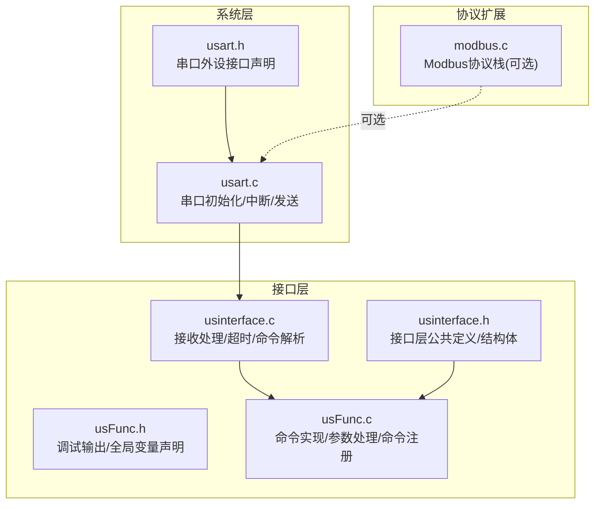
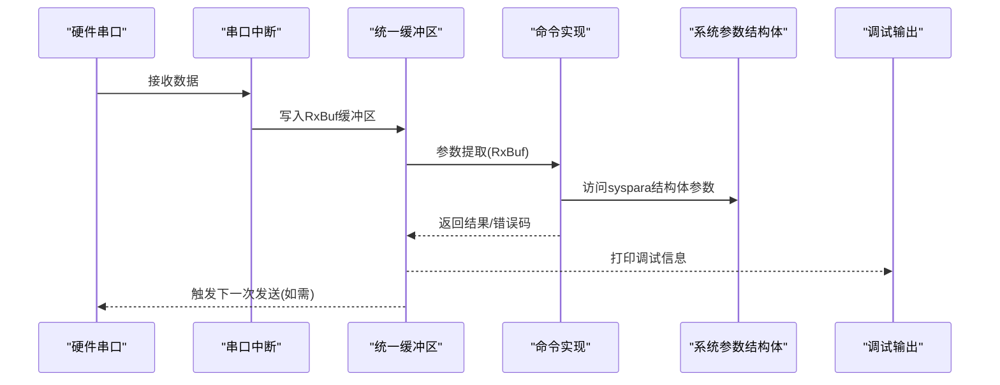
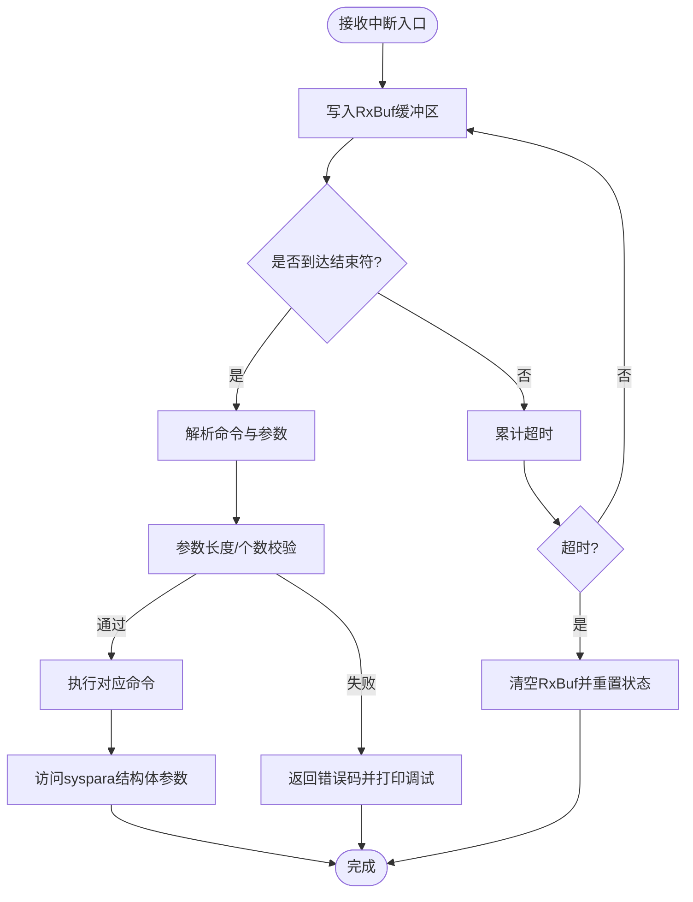
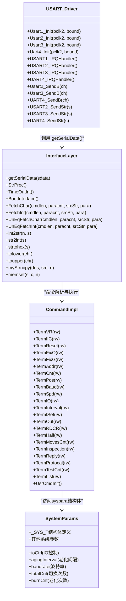

# 串口接口层

<cite>
**本文档引用的文件**
- [usinterface.h](file://SRC/HARDWARE/usinterface/usinterface.h)
- [usinterface.c](file://SRC/HARDWARE/usinterface/usinterface.c)
- [usFunc.h](file://SRC/HARDWARE/usinterface/usFunc.h)
- [usFunc.c](file://SRC/HARDWARE/usinterface/usFunc.c)
- [usart.h](file://SRC/SYSTEM/usart/usart.h)
- [usart.c](file://SRC/SYSTEM/usart/usart.c)
- [modbus.c](file://SRC/HARDWARE/modbus/modbus.c)
- [main.h](file://SRC/APP/main.h)
</cite>

## 更新摘要
**变更内容**
- 更新了接收缓冲区设计，统一使用 RxBuf 缓冲区替代原有的 rcvStr 和 pRcvStr 指针管理
- 新增 TermTestCnt() 命令用于老化计数器管理，支持读取和设置老化次数
- 完善了命令参数处理机制，所有命令现在统一使用 RxBuf 作为参数提取源

## 目录
1. [简介](#简介)
2. [项目结构](#项目结构)
3. [核心组件](#核心组件)
4. [架构总览](#架构总览)
5. [详细组件分析](#详细组件分析)
6. [依赖关系分析](#依赖关系分析)
7. [性能考虑](#性能考虑)
8. [故障排除指南](#故障排除指南)
9. [结论](#结论)
10. [附录](#附录)

## 简介
本文件面向通用开关器项目的串口接口层，系统性阐述串口通信抽象设计、数据帧处理机制、接口函数定义与实现、串口配置与参数设置、以及调试与故障排除方法。文档旨在帮助开发者快速理解并高效使用该串口接口层，统一不同串口类型的接口使用，确保数据帧的正确封装与解封装，提升开发效率与系统稳定性。

**更新** 本版本重点介绍了接收缓冲区的统一管理和新增的老化计数器管理功能。

## 项目结构
串口接口层由两大部分组成：
- 系统层串口驱动：负责底层硬件初始化、中断接收、发送等基础能力。
- 接口层串口协议：负责命令解析、参数提取、命令注册与执行、超时处理、调试输出等高层逻辑。

**图表来源**
- [usart.h:1-57](file://SRC/SYSTEM/usart/usart.h#L1-L57)
- [usart.c:1-292](file://SRC/SYSTEM/usart/usart.c#L1-L292)
- [usinterface.h:1-95](file://SRC/HARDWARE/usinterface/usinterface.h#L1-L95)
- [usinterface.c:1-577](file://SRC/HARDWARE/usinterface/usinterface.c#L1-L577)
- [usFunc.h:1-55](file://SRC/HARDWARE/usinterface/usFunc.h#L1-L55)
- [usFunc.c:1-866](file://SRC/HARDWARE/usinterface/usFunc.c#L1-L866)
- [modbus.c:34-143](file://SRC/HARDWARE/modbus/modbus.c#L34-L143)

**章节来源**
- [usart.h:1-57](file://SRC/SYSTEM/usart/usart.h#L1-L57)
- [usart.c:1-292](file://SRC/SYSTEM/usart/usart.c#L1-L292)
- [usinterface.h:1-95](file://SRC/HARDWARE/usinterface/usinterface.h#L1-L95)
- [usinterface.c:1-577](file://SRC/HARDWARE/usinterface/usinterface.c#L1-L577)
- [usFunc.h:1-55](file://SRC/HARDWARE/usinterface/usFunc.h#L1-L55)
- [usFunc.c:1-866](file://SRC/HARDWARE/usinterface/usFunc.c#L1-L866)
- [modbus.c:34-143](file://SRC/HARDWARE/modbus/modbus.c#L34-L143)

## 核心组件
- 串口系统驱动：提供串口初始化、中断回调、发送接口，支持多串口实例（USART1/2/3/4）。
- 接口层协议：提供命令注册、参数解析、超时处理、调试输出等高层能力。
- 命令实现集合：通过命令注册表统一管理各类命令及其行为。
- 可选协议扩展：Modbus协议栈，支持在特定串口上运行。
- 统一接收缓冲区：提供统一的接收缓冲区管理，替代原有的 rcvStr 和 pRcvStr 指针管理。
- 老化计数器管理：新增 TermTestCnt() 命令，支持老化次数的读取和设置。

**更新** 新增了统一接收缓冲区管理和老化计数器管理功能。

**章节来源**
- [usart.h:1-57](file://SRC/SYSTEM/usart/usart.h#L1-L57)
- [usart.c:34-292](file://SRC/SYSTEM/usart/usart.c#L34-L292)
- [usinterface.h:37-95](file://SRC/HARDWARE/usinterface/usinterface.h#L37-L95)
- [usinterface.c:136-141](file://SRC/HARDWARE/usinterface/usinterface.c#L136-L141)
- [usFunc.c:751-834](file://SRC/HARDWARE/usinterface/usFunc.c#L751-L834)
- [modbus.c:34-143](file://SRC/HARDWARE/modbus/modbus.c#L34-L143)
- [main.h:227-241](file://SRC/APP/main.h#L227-L241)

## 架构总览
串口接口层采用"系统驱动 + 接口协议 + 命令实现"的分层设计：
- 系统驱动层：负责硬件初始化、中断接收、发送缓冲与状态标记。
- 接口协议层：负责接收字符流的拼接、命令识别、参数提取、超时清理、调试输出。
- 命令实现层：通过命令注册表集中管理命令，实现具体业务逻辑。
- 统一缓冲区层：提供统一的接收缓冲区管理，简化参数处理流程。

**图表来源**
- [usart.c:74-83](file://SRC/SYSTEM/usart/usart.c#L74-L83)
- [usinterface.c:15-106](file://SRC/HARDWARE/usinterface/usinterface.c#L15-L106)
- [usFunc.c:751-834](file://SRC/HARDWARE/usinterface/usFunc.c#L751-L834)
- [usFunc.h:10-31](file://SRC/HARDWARE/usinterface/usFunc.h#L10-L31)
- [main.h:227-241](file://SRC/APP/main.h#L227-L241)

## 详细组件分析

### 1. 串口系统驱动（usart）
- 提供多串口初始化函数（USART1/2/3/4），设置波特率、数据位、停止位、校验位等。
- 提供中断服务例程，接收中断触发后调用接口层的接收处理函数。
- 提供发送单字节与字符串的便捷函数，便于调试与数据传输。

**章节来源**
- [usart.h:21-37](file://SRC/SYSTEM/usart/usart.h#L21-L37)
- [usart.c:38-120](file://SRC/SYSTEM/usart/usart.c#L38-L120)
- [usart.c:123-151](file://SRC/SYSTEM/usart/usart.c#L123-L151)
- [usart.c:159-221](file://SRC/SYSTEM/usart/usart.c#L159-L221)
- [usart.c:229-286](file://SRC/SYSTEM/usart/usart.c#L229-L286)

### 2. 接口层协议（usinterface）
- 统一接收缓冲区：使用 RxBuf 作为统一的接收缓冲区，替代原有的 rcvStr 和 pRcvStr 指针管理。
- 命令解析：提供多种参数提取函数，支持定长/不定长参数、整型/字符型参数、分隔符容错。
- 超时处理：基于时间片计数，超时自动清理接收缓冲，避免阻塞。
- 调试输出：通过宏控制调试信息输出级别与开关。

**更新** 接收缓冲区已统一使用 RxBuf，简化了缓冲区管理逻辑。

**章节来源**
- [usinterface.h:37-95](file://SRC/HARDWARE/usinterface/usinterface.h#L37-L95)
- [usinterface.c:15-106](file://SRC/HARDWARE/usinterface/usinterface.c#L15-L106)
- [usinterface.c:273-425](file://SRC/HARDWARE/usinterface/usinterface.c#L273-L425)
- [usinterface.c:436-573](file://SRC/HARDWARE/usinterface/usinterface.c#L436-L573)
- [usFunc.h:10-31](file://SRC/HARDWARE/usinterface/usFunc.h#L10-L31)

### 3. 命令实现与注册（usFunc）
- 命令注册：通过静态数组集中注册命令名称、长度与处理函数。
- 命令实现：覆盖版本查询、IIC读写、复位、位置切换、波特率、速度、IO控制、间隔、电流、减速比、半通道、切换次数、点检、回复模式、协议类型、老化计数等。
- 参数处理：统一使用 RxBuf 作为参数提取源，保证参数长度与范围校验。
- 系统参数访问：通过syspara结构体统一管理所有系统参数，包括IO控制和老化间隔设置。

**更新** 所有命令现在统一使用 RxBuf 进行参数提取，新增了老化计数器管理功能。

**章节来源**
- [usFunc.c:751-834](file://SRC/HARDWARE/usinterface/usFunc.c#L751-L834)
- [usFunc.c:7-22](file://SRC/HARDWARE/usinterface/usFunc.c#L7-L22)
- [usFunc.c:70-110](file://SRC/HARDWARE/usinterface/usFunc.c#L70-L110)
- [usFunc.c:116-146](file://SRC/HARDWARE/usinterface/usFunc.c#L116-L146)
- [usFunc.c:155-202](file://SRC/HARDWARE/usinterface/usFunc.c#L155-L202)
- [usFunc.c:208-275](file://SRC/HARDWARE/usinterface/usFunc.c#L208-L275)
- [usFunc.c:317-358](file://SRC/HARDWARE/usinterface/usFunc.c#L317-L358)
- [usFunc.c:363-426](file://SRC/HARDWARE/usinterface/usFunc.c#L363-L426)
- [usFunc.c:432-453](file://SRC/HARDWARE/usinterface/usFunc.c#L432-L453)
- [usFunc.c:459-487](file://SRC/HARDWARE/usinterface/usFunc.c#L459-L487)
- [usFunc.c:493-532](file://SRC/HARDWARE/usinterface/usFunc.c#L493-L532)
- [usFunc.c:537-566](file://SRC/HARDWARE/usinterface/usFunc.c#L537-L566)
- [usFunc.c:571-599](file://SRC/HARDWARE/usinterface/usFunc.c#L571-L599)
- [usFunc.c:604-612](file://SRC/HARDWARE/usinterface/usFunc.c#L604-L612)
- [usFunc.c:617-638](file://SRC/HARDWARE/usinterface/usFunc.c#L617-L638)
- [usFunc.c:644-671](file://SRC/HARDWARE/usinterface/usFunc.c#L644-L671)
- [usFunc.c:676-705](file://SRC/HARDWARE/usinterface/usFunc.c#L676-L705)
- [usFunc.c:707-747](file://SRC/HARDWARE/usinterface/usFunc.c#L707-L747)
- [usFunc.c:752-778](file://SRC/HARDWARE/usinterface/usFunc.c#L752-L778)

### 4. 数据帧处理机制
- 帧格式定义：命令名 + 等号 + 参数列表，参数间以分隔符分隔，支持定长参数与不定长参数。
- 数据封装：命令解析成功后，按命令定义的参数个数与长度进行封装，便于后续业务处理。
- 数据解封装：通过参数提取函数，将字符串形式的参数还原为整型或字符数组，同时进行长度与范围校验。

**图表来源**
- [usinterface.c:15-106](file://SRC/HARDWARE/usinterface/usinterface.c#L15-L106)
- [usinterface.c:273-425](file://SRC/HARDWARE/usinterface/usinterface.c#L273-L425)
- [usinterface.c:436-573](file://SRC/HARDWARE/usinterface/usinterface.c#L436-L573)
- [main.h:227-241](file://SRC/APP/main.h#L227-L241)

### 5. 接口函数定义与实现
- 接收处理：getSerialData（中断中调用）、StrProc（主循环调用）、TimeOutInt（超时处理）。
- 参数提取：FetchChar/FetchInt/UnEqFetchChar/UnEqFetchInt（统一使用 RxBuf）。
- 工具函数：int2str、str2int、strtohex、tolower/toupper、myStrncpy、memset。
- 命令注册：RegisterCmds、UsrCmdAnalyse、BootInterface。

**更新** 参数提取函数现在统一使用 RxBuf 作为参数源。

**章节来源**
- [usinterface.h:73-95](file://SRC/HARDWARE/usinterface/usinterface.h#L73-L95)
- [usinterface.c:15-131](file://SRC/HARDWARE/usinterface/usinterface.c#L15-L131)
- [usinterface.c:148-261](file://SRC/HARDWARE/usinterface/usinterface.c#L148-L261)
- [usinterface.c:273-573](file://SRC/HARDWARE/usinterface/usinterface.c#L273-L573)

### 6. 串口配置与参数设置
- 波特率：支持多种预设值，通过EEPROM读取当前配置，写入新值后更新硬件波特率。
- 数据位/停止位/校验位：系统层初始化时默认配置为1起始位、8数据位、1停止位、无校验。
- 串口选择：支持USART1/2/3/4，可通过宏启用/禁用接收，设置中断优先级。
- 参数范围：各命令对参数范围进行严格限制，超出范围自动回退默认值并记录调试信息。
- 统一缓冲区管理：提供统一的接收缓冲区管理，简化参数处理流程。
- 老化计数器：新增 TESTC 命令，支持老化次数的读取和设置。

**更新** 新增了老化计数器管理和统一缓冲区管理功能。

**章节来源**
- [usart.c:38-120](file://SRC/SYSTEM/usart/usart.c#L38-L120)
- [usart.c:159-221](file://SRC/SYSTEM/usart/usart.c#L159-L221)
- [usart.c:229-286](file://SRC/SYSTEM/usart/usart.c#L229-L286)
- [usFunc.c:317-358](file://SRC/HARDWARE/usinterface/usFunc.c#L317-L358)
- [usFunc.c:363-426](file://SRC/HARDWARE/usinterface/usFunc.c#L363-L426)
- [usFunc.c:493-532](file://SRC/HARDWARE/usinterface/usFunc.c#L493-L532)
- [usFunc.c:537-566](file://SRC/HARDWARE/usinterface/usFunc.c#L537-L566)
- [usFunc.c:571-599](file://SRC/HARDWARE/usinterface/usFunc.c#L571-L599)
- [usFunc.c:617-638](file://SRC/HARDWARE/usinterface/usFunc.c#L617-L638)
- [usFunc.c:676-705](file://SRC/HARDWARE/usinterface/usFunc.c#L676-L705)
- [usFunc.c:707-747](file://SRC/HARDWARE/usinterface/usFunc.c#L707-L747)
- [usFunc.c:752-778](file://SRC/HARDWARE/usinterface/usFunc.c#L752-L778)
- [main.h:227-241](file://SRC/APP/main.h#L227-L241)

### 7. 调试方法与故障排除
- 调试输出：通过宏控制调试信息输出级别（信息/调试），支持批量关闭调试输出。
- 超时与错误：接收超时自动清理缓冲；参数长度/个数/范围错误返回错误码并打印调试信息。
- 常见问题：
  - 接收不到数据：检查串口初始化、中断使能、分隔符设置。
  - 参数解析失败：确认命令格式、分隔符、参数长度与范围。
  - 波特率不匹配：确认系统层波特率与设备端一致。
  - 超时频繁：检查通信质量、中断优先级与任务调度。
  - 统一缓冲区问题：检查 RxBuf 缓冲区溢出和指针管理。
  - 老化计数器异常：确认 TESTC 命令参数范围和EEPROM写入操作。

**更新** 新增了统一缓冲区管理和老化计数器相关的故障排除指导。

**章节来源**
- [usFunc.h:10-31](file://SRC/HARDWARE/usinterface/usFunc.h#L10-L31)
- [usinterface.c:109-131](file://SRC/HARDWARE/usinterface/usinterface.c#L109-L131)
- [usinterface.c:273-425](file://SRC/HARDWARE/usinterface/usinterface.c#L273-L425)

## 依赖关系分析

**图表来源**
- [usart.c:38-286](file://SRC/SYSTEM/usart/usart.c#L38-L286)
- [usinterface.c:15-141](file://SRC/HARDWARE/usinterface/usinterface.c#L15-L141)
- [usFunc.c:7-866](file://SRC/HARDWARE/usinterface/usFunc.c#L7-L866)
- [main.h:227-241](file://SRC/APP/main.h#L227-L241)

**章节来源**
- [usart.c:38-286](file://SRC/SYSTEM/usart/usart.c#L38-L286)
- [usinterface.c:15-141](file://SRC/HARDWARE/usinterface/usinterface.c#L15-L141)
- [usFunc.c:751-834](file://SRC/HARDWARE/usinterface/usFunc.c#L751-L834)
- [main.h:227-241](file://SRC/APP/main.h#L227-L241)

## 性能考虑
- 中断优先级：系统层为串口中断设置了合理的抢占与响应优先级，避免高优先级任务抢占导致接收延迟。
- 统一缓冲区：使用 RxBuf 作为统一的接收缓冲区，减少内存碎片与指针管理复杂度。
- 参数解析：采用定长/不定长参数分离策略，减少不必要的字符串处理开销。
- 调试输出：通过宏控制输出级别，生产环境可完全关闭调试输出，降低CPU占用。
- 老化计数器：新增的 TESTC 命令提供高效的老化次数管理功能。

**更新** 新增了统一缓冲区管理和老化计数器性能优化考虑。

## 故障排除指南
- 无法接收数据
  - 检查串口初始化是否正确，中断是否启用。
  - 确认分隔符设置与调试助手一致（CR/LF 或仅 CR）。
- 参数解析失败
  - 确认命令格式与参数长度、个数一致。
  - 检查分隔符是否正确，参数范围是否在允许范围内。
- 波特率不匹配
  - 确认系统层波特率与设备端一致，必要时通过命令修改并写入EEPROM。
- 超时频繁
  - 检查通信质量与中断优先级，避免长时间任务阻塞中断。
  - 调整超时阈值或优化主循环任务调度。
- 统一缓冲区问题
  - 检查 RxBuf 缓冲区溢出情况，确认缓冲区大小足够。
  - 验证参数提取函数的正确使用。
- 老化计数器异常
  - 检查 TESTC 命令的参数范围（通常为0-65535）。
  - 确认EEPROM写入操作成功执行。
  - 验证老化次数的读取和设置流程。

**更新** 新增了统一缓冲区管理和老化计数器相关的故障排除指导。

**章节来源**
- [usart.c:38-120](file://SRC/SYSTEM/usart/usart.c#L38-L120)
- [usart.c:159-221](file://SRC/SYSTEM/usart/usart.c#L159-L221)
- [usart.c:229-286](file://SRC/SYSTEM/usart/usart.c#L229-L286)
- [usinterface.c:15-106](file://SRC/HARDWARE/usinterface/usinterface.c#L15-L106)
- [usinterface.c:273-425](file://SRC/HARDWARE/usinterface/usinterface.c#L273-L425)
- [main.h:227-241](file://SRC/APP/main.h#L227-L241)

## 结论
串口接口层通过清晰的分层设计与完善的命令解析机制，实现了对不同串口类型的统一抽象与高效使用。其严谨的数据帧处理、严格的参数校验与完善的调试输出，为开发者提供了稳定可靠的串口通信基础。通过引入统一的 RxBuf 缓冲区管理和新增的 TESTC 命令，进一步提升了系统的可靠性和功能性。结合本文档的配置与排障建议，开发者可快速集成并优化串口通信功能，满足通用开关器项目的多样化需求。

**更新** 通过引入统一缓冲区管理和老化计数器功能，系统参数管理更加统一和规范，提升了代码的可维护性和可靠性。

## 附录
- 常用命令与参数范围
  - 波特率：支持多种预设值，写入后更新硬件波特率。
  - 速度：范围受减速比影响，20-200（特定减速比范围不同）。
  - 通道数：3-16。
  - 电流：0-4（对应不同额定电流）。
  - 半通道：0/1。
  - 回复模式：AGS标准/自定义等。
  - 协议类型：AGS/扩展/HX/Modbus等。
  - IO控制：0/1（关闭/开启），通过syspara.ioCtrl访问。
  - 老化间隔：0-255秒，通过syspara.agingInterval访问。
  - 老化次数：0-65535次，通过TESTC命令管理。

**更新** 新增了老化计数器和统一缓冲区的相关参数说明。

**章节来源**
- [usFunc.c:317-358](file://SRC/HARDWARE/usinterface/usFunc.c#L317-L358)
- [usFunc.c:363-426](file://SRC/HARDWARE/usinterface/usFunc.c#L363-L426)
- [usFunc.c:493-532](file://SRC/HARDWARE/usinterface/usFunc.c#L493-L532)
- [usFunc.c:537-566](file://SRC/HARDWARE/usinterface/usFunc.c#L537-L566)
- [usFunc.c:571-599](file://SRC/HARDWARE/usinterface/usFunc.c#L571-L599)
- [usFunc.c:676-705](file://SRC/HARDWARE/usinterface/usFunc.c#L676-L705)
- [usFunc.c:707-747](file://SRC/HARDWARE/usinterface/usFunc.c#L707-L747)
- [usFunc.c:752-778](file://SRC/HARDWARE/usinterface/usFunc.c#L752-L778)
- [main.h:227-241](file://SRC/APP/main.h#L227-L241)