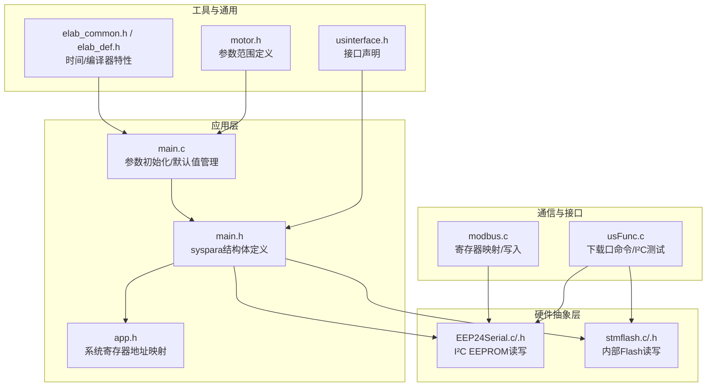
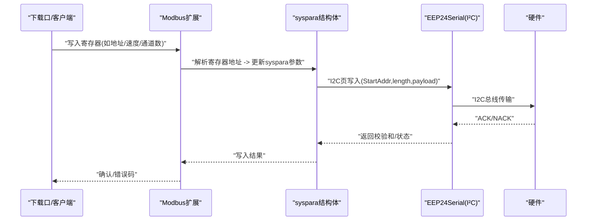
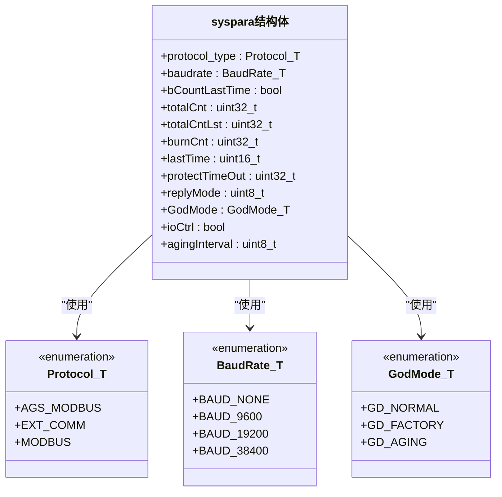
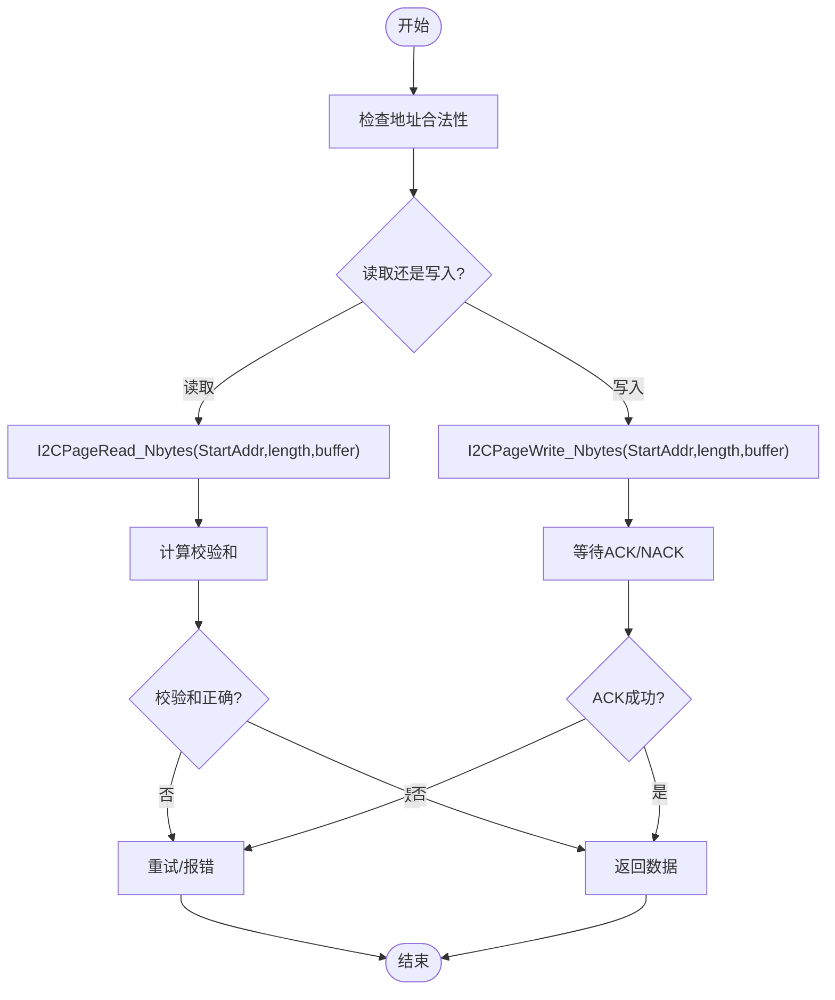
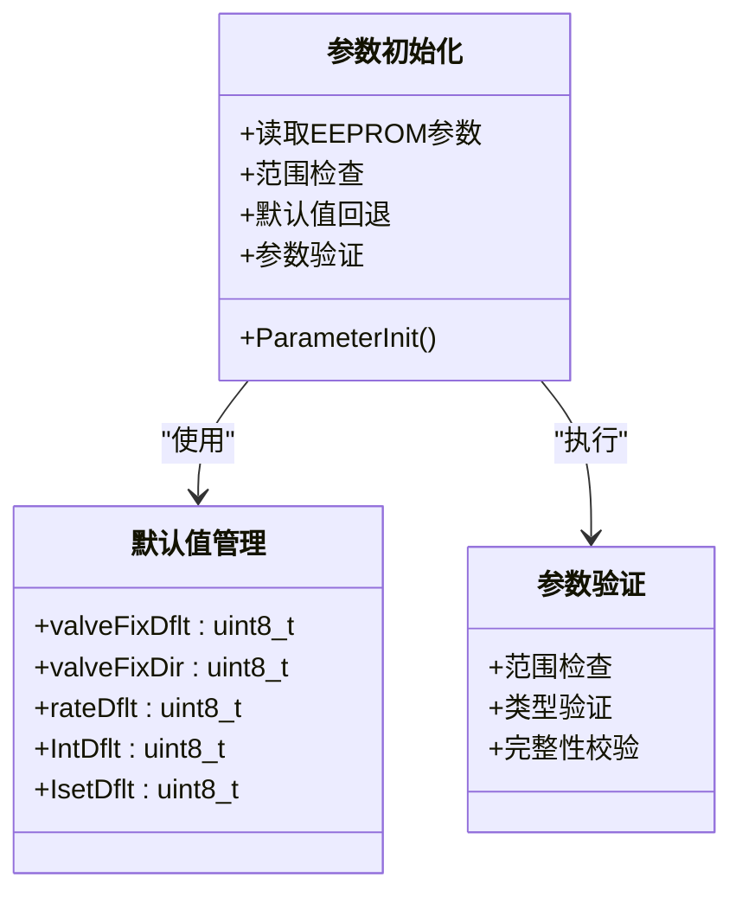
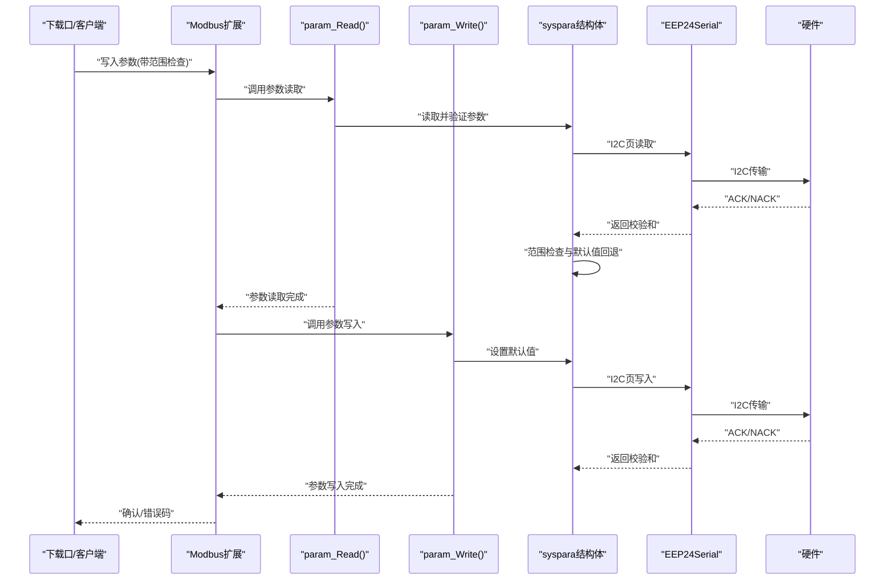
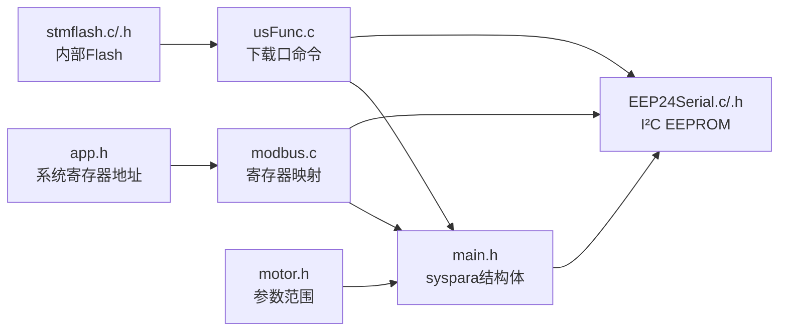

# 参数管理系统

<cite>
**本文引用的文件**
- [main.h](file://SRC/APP/main.h)
- [main.c](file://SRC/APP/main.c)
- [app.h](file://SRC/APP/app.h)
- [usFunc.c](file://SRC/HARDWARE/usinterface/usFunc.c)
- [modbus.c](file://SRC/HARDWARE/modbus/modbus.c)
- [EEP24Serial.h](file://SRC/HARDWARE/EEPROM/EEP24Serial.h)
- [EEP24Serial.c](file://SRC/HARDWARE/EEPROM/EEP24Serial.c)
- [stmflash.h](file://SRC/HARDWARE/stmFlash/stmflash.h)
- [stmflash.c](file://SRC/HARDWARE/stmFlash/stmflash.c)
- [usinterface.h](file://SRC/HARDWARE/usinterface/usinterface.h)
- [elab_common.h](file://SRC/3rd/common/elab_common.h)
- [elab_def.h](file://SRC/3rd/common/elab_def.h)
- [motor.h](file://SRC/HARDWARE/motor/motor.h)
</cite>

## 更新摘要
**变更内容**
- 系统参数管理从分散的全局变量重构为集中式syspara结构体
- 参数读取、写入、验证机制全面更新
- 默认值管理机制得到显著改进
- 参数验证范围扩大，包括更多参数类型的范围检查
- 错误恢复机制增强，支持更完善的参数回退策略
- **重大重构**：分离 `param_Read()` 和 `param_Write()` 函数，以及 `ParameterInit()` 的简化实现
- **用户界面系统更新**：改进参数初始化和持久化机制，增强参数设置功能，改善终端地址设置功能

## 目录
1. [简介](#简介)
2. [项目结构](#项目结构)
3. [核心组件](#核心组件)
4. [架构总览](#架构总览)
5. [详细组件分析](#详细组件分析)
6. [依赖关系分析](#依赖关系分析)
7. [性能考量](#性能考量)
8. [故障排查指南](#故障排查指南)
9. [结论](#结论)
10. [附录](#附录)

## 简介
本文件面向通用开关器项目的参数管理系统，系统采用"双介质"持久化策略：以I²C EEPROM为参数主存储介质，结合内部Flash用于特定场景的快速读写与校验。经过重构升级，系统参数管理已从分散的全局变量转变为集中式的syspara结构体，提供了更加规范和可靠的参数管理机制。文档围绕以下主题展开：
- EEPROM存储原理与参数持久化机制（数据格式、访问方法、可靠性保障）
- 参数配置结构（参数定义、数据类型、默认值管理）
- 参数验证机制（范围检查、长度验证、完整性校验）
- 参数读取与写入流程（事务处理与错误恢复）
- 参数管理API与使用方法
- 参数备份、恢复与迁移操作指南

## 项目结构
参数管理涉及硬件抽象层（I²C EEPROM、内部Flash）、应用层（参数定义与默认值）、通信协议层（Modbus扩展）与用户接口层（下载口命令）。关键文件分布如下：
- 硬件抽象：EEP24Serial（I²C EEPROM读写）、stmflash（内部Flash读写）
- 应用层：main.h（集中式参数结构体定义）、main.c（参数初始化与默认值管理）
- 通信与接口：modbus.c（寄存器读写映射）、usFunc.c（下载口命令与I²C测试）
- 工具与通用：elab_*（时间与编译器特性）

**图表来源**
- [main.c:1-378](file://SRC/APP/main.c#L1-L378)
- [main.h:109-171](file://SRC/APP/main.h#L109-L171)
- [app.h:1-37](file://SRC/APP/app.h#L1-L37)
- [usFunc.c:1-867](file://SRC/HARDWARE/usinterface/usFunc.c#L1-L867)
- [modbus.c:1-776](file://SRC/HARDWARE/modbus/modbus.c#L1-L776)
- [motor.h:75-92](file://SRC/HARDWARE/motor/motor.h#L75-L92)

**章节来源**
- [main.c:1-378](file://SRC/APP/main.c#L1-L378)
- [main.h:109-171](file://SRC/APP/main.h#L109-L171)
- [app.h:1-37](file://SRC/APP/app.h#L1-L37)
- [usFunc.c:1-867](file://SRC/HARDWARE/usinterface/usFunc.c#L1-L867)
- [modbus.c:1-776](file://SRC/HARDWARE/modbus/modbus.c#L1-L776)

## 核心组件
- **集中式参数结构体**：syspara结构体统一管理所有系统参数，包括协议类型、波特率、切换次数、老化间隔、回复方式等
- **I²C EEPROM访问层**：提供页写入与按字节读取能力，支持校验和计算，保证参数块的完整性
- **内部Flash访问层**：提供页擦除、半字写入、批量读写等底层操作，用于快速读写与状态记录
- **参数验证与默认值管理**：在参数读取和写入时进行全面的范围检查和默认值回退机制
- **通信与接口**：Modbus扩展将寄存器地址映射到参数结构体，下载口命令提供参数读写与I²C自检

**章节来源**
- [main.h:209-223](file://SRC/APP/main.h#L209-L223)
- [main.c:79-203](file://SRC/APP/main.c#L79-L203)
- [EEP24Serial.c:202-313](file://SRC/HARDWARE/EEPROM/EEP24Serial.c#L202-L313)
- [stmflash.c:122-172](file://SRC/HARDWARE/stmFlash/stmflash.c#L122-L172)

## 架构总览
参数管理采用"集中式结构体 + 通信协议映射 + 硬件抽象"的分层设计：
- **集中式参数管理**：syspara结构体统一管理所有系统参数，提供类型安全的参数访问
- **寄存器地址映射**：app.h定义系统寄存器地址；main.h定义EEPROM参数布局与默认值
- **通信协议映射**：modbus.c将寄存器地址映射到syspara结构体参数，实现读写
- **硬件抽象**：EEP24Serial.c提供I²C页写入与读取；stmflash.c提供内部Flash读写

**图表来源**
- [modbus.c:640-669](file://SRC/HARDWARE/modbus/modbus.c#L640-L669)
- [main.h:209-223](file://SRC/APP/main.h#L209-L223)
- [EEP24Serial.c:202-313](file://SRC/HARDWARE/EEPROM/EEP24Serial.c#L202-L313)

## 详细组件分析

### 集中式syspara结构体设计
系统参数管理已完全重构为集中式syspara结构体，提供统一的参数访问接口：

- **结构体定义**：_SYS_T结构体包含协议类型、波特率、切换次数、老化间隔、回复方式等所有系统参数
- **类型安全**：使用强类型枚举（Protocol_T、BaudRate_T、GodMode_T）确保参数类型正确性
- **统一访问**：所有参数通过syspara结构体统一访问，避免全局变量分散管理的问题
- **内存布局**：参数按逻辑分组存储，便于维护和扩展

**图表来源**
- [main.h:209-223](file://SRC/APP/main.h#L209-L223)
- [main.h:180-198](file://SRC/APP/main.h#L180-L198)

**章节来源**
- [main.h:209-223](file://SRC/APP/main.h#L209-L223)
- [main.h:180-198](file://SRC/APP/main.h#L180-L198)

### EEPROM存储原理与参数持久化
- **存储介质**：I²C EEPROM（通过EEP24Serial.c实现），支持页写入与按字节读取
- **数据格式**：参数按固定长度字段组织，每个参数占用1或若干字节，具体由main.h中LEN_*定义
- **访问方法**：
  - 读取：I2CPageRead_Nbytes(StartAddr, length, buffer)，返回校验和
  - 写入：I2CPageWrite_Nbytes(StartAddr, length, buffer)，按页边界自动分段写入
- **可靠性保障**：
  - 校验和：读写均产生校验和，用于完整性校验
  - 页写入：按页边界写入，避免跨页写入导致的页内数据破坏
  - 延时与等待：写入后等待ACK/NACK，确保写入完成

**图表来源**
- [EEP24Serial.c:95-200](file://SRC/HARDWARE/EEPROM/EEP24Serial.c#L95-L200)
- [EEP24Serial.c:202-313](file://SRC/HARDWARE/EEPROM/EEP24Serial.c#L202-L313)

**章节来源**
- [EEP24Serial.c:95-200](file://SRC/HARDWARE/EEPROM/EEP24Serial.c#L95-L200)
- [EEP24Serial.c:202-313](file://SRC/HARDWARE/EEPROM/EEP24Serial.c#L202-L313)
- [EEP24Serial.h:10-27](file://SRC/HARDWARE/EEPROM/EEP24Serial.h#L10-L27)

### 参数配置结构与默认值管理
- **集中式参数定义**：所有参数集中在syspara结构体中，包含协议类型、波特率、速度、通道数、序列号、减速比、半密封、切换次数、回复方式、初始状态、协议类型、烧机次数、上帝模式等
- **数据类型**：主要为uint8_t、uint16_t、uint32_t，部分枚举类型（如Protocol_T、BaudRate_T、GodMode_T）
- **默认值管理**：main.c中定义了多个默认值（如原点补偿、方向补偿、减速比、老化间隔、电流设置），并在初始化阶段写入EEPROM
- **参数初始化流程**：系统启动时读取EEPROM参数，进行范围检查和默认值回退，确保参数有效性

**图表来源**
- [main.c:274-292](file://SRC/APP/main.c#L274-L292)
- [main.c:5-10](file://SRC/APP/main.c#L5-L10)

**章节来源**
- [main.h:109-171](file://SRC/APP/main.h#L109-L171)
- [main.c:5-10](file://SRC/APP/main.c#L5-L10)
- [main.c:274-292](file://SRC/APP/main.c#L274-L292)

### 参数验证机制
- **范围检查**：下载口命令在写入前进行范围检查（如地址、通道数、波特率、速度、减速比、半通道等），超出范围则回退到默认值
- **类型验证**：使用强类型枚举确保参数类型正确性，防止类型混淆
- **完整性校验**：读写均产生校验和，写入后读回校验，确保数据一致性
- **参数回退机制**：当参数无效时自动回退到安全的默认值，确保系统稳定性

**更新** 用户界面系统的重要更新包括：

- **改进的参数初始化机制**：`param_Read()` 函数现在包含更严格的参数范围检查和默认值回退逻辑
- **增强的参数设置功能**：下载口命令支持更精确的参数范围验证，包括地址(0-63)、波特率(1-3)、速度(20-200)、通道数(3-16)等
- **改善的终端地址设置功能**：地址设置支持广播地址AA(0x55)和老化地址64，提供更灵活的地址配置选项

**章节来源**
- [usFunc.c:208-238](file://SRC/HARDWARE/usinterface/usFunc.c#L208-L238)
- [usFunc.c:244-276](file://SRC/HARDWARE/usinterface/usFunc.c#L244-L276)
- [main.c:79-203](file://SRC/APP/main.c#L79-L203)
- [EEP24Serial.c:95-200](file://SRC/HARDWARE/EEPROM/EEP24Serial.c#L95-L200)

### 参数读取与写入流程（含事务处理与错误恢复）
- **读取流程**：下载口/Modbus请求 -> 解析地址 -> 读取syspara结构体参数 -> 校验和验证 -> 返回数据
- **写入流程**：下载口/Modbus请求 -> 参数验证 -> 更新syspara结构体 -> I2C页写入 -> 等待ACK -> 读回校验 -> 成功/失败处理
- **错误恢复**：若写入失败或校验失败，系统回退到默认值或保持原值，并通过LED闪烁提示错误
- **事务处理**：使用校验和确保数据完整性，支持部分参数的原子性更新

**更新** 参数管理系统的重大重构包括分离 `param_Read()` 和 `param_Write()` 函数，以及 `ParameterInit()` 的简化实现。这种分离使得参数管理更加模块化和清晰：

- **param_Read() 函数**：专门负责从EEPROM读取参数，执行范围检查和默认值回退
- **param_Write() 函数**：专门负责写入默认参数到EEPROM，设置系统初始状态
- **ParameterInit() 函数**：简化为根据板号判断执行读取还是写入操作，然后进行初始化

**图表来源**
- [modbus.c:640-669](file://SRC/HARDWARE/modbus/modbus.c#L640-L669)
- [usFunc.c:70-110](file://SRC/HARDWARE/usinterface/usFunc.c#L70-L110)
- [EEP24Serial.c:202-313](file://SRC/HARDWARE/EEPROM/EEP24Serial.c#L202-L313)

**章节来源**
- [modbus.c:640-669](file://SRC/HARDWARE/modbus/modbus.c#L640-L669)
- [usFunc.c:70-110](file://SRC/HARDWARE/usinterface/usFunc.c#L70-L110)
- [EEP24Serial.c:202-313](file://SRC/HARDWARE/EEPROM/EEP24Serial.c#L202-L313)
- [main.c:79-203](file://SRC/APP/main.c#L79-L203)
- [main.c:207-272](file://SRC/APP/main.c#L207-L272)
- [main.c:274-292](file://SRC/APP/main.c#L274-L292)

### 参数管理API与使用方法
- **下载口命令（usFunc.c）**：
  - I²C测试与擦除：TermIIC，支持任意地址读写测试与清零
  - 参数读写：如原点补偿、方向补偿、通道数、速度、地址等，通过syspara结构体统一管理
  - **增强的参数范围检查**：支持地址(0-63)、波特率(1-3)、速度(20-200)、通道数(3-16)等精确范围限制
  - **改进的地址设置**：支持广播地址AA(0x55)和老化地址64的配置
- **Modbus扩展（modbus.c）**：
  - 寄存器读写映射：将寄存器地址映射到syspara结构体参数，支持读取与写入
  - 参数更新：直接更新syspara结构体中的对应参数
- **系统寄存器映射（app.h）**：
  - 定义系统状态、版本、通道、波特率等寄存器地址

**章节来源**
- [usFunc.c:208-238](file://SRC/HARDWARE/usinterface/usFunc.c#L208-L238)
- [usFunc.c:364-427](file://SRC/HARDWARE/usinterface/usFunc.c#L364-L427)
- [modbus.c:523-545](file://SRC/HARDWARE/modbus/modbus.c#L523-L545)
- [app.h:1-37](file://SRC/APP/app.h#L1-L37)

### 参数备份、恢复与迁移
- **备份**：
  - 使用下载口命令读取各参数块，保存至外部存储
  - 可通过I2C页读取将参数块导出为二进制备份
  - 支持完整参数结构体的序列化备份
- **恢复**：
  - 将备份数据按原地址写回EEPROM，注意校验和与页边界
  - 若写入失败，系统会回退到默认值
  - 支持部分参数的增量恢复
- **迁移**：
  - 新版本参数布局变更时，需对照main.h中的地址映射，逐项迁移
  - 迁移前后进行校验和验证，确保数据一致性
  - 支持结构体字段的兼容性检查

**章节来源**
- [main.h:109-171](file://SRC/APP/main.h#L109-L171)
- [EEP24Serial.c:95-200](file://SRC/HARDWARE/EEPROM/EEP24Serial.c#L95-L200)
- [usFunc.c:70-110](file://SRC/HARDWARE/usinterface/usFunc.c#L70-L110)

## 依赖关系分析
- syspara结构体依赖EEP24Serial提供的I²C读写接口
- Modbus扩展依赖syspara结构体与EEP24Serial
- 下载口命令依赖EEP24Serial与syspara结构体
- 内部Flash访问层与EEP24Serial并行存在，用于快速读写与状态记录
- **参数范围定义**：motor.h提供速度、通道数、地址等参数的范围限制定义

**图表来源**
- [main.h:209-223](file://SRC/APP/main.h#L209-L223)
- [app.h:1-37](file://SRC/APP/app.h#L1-L37)
- [EEP24Serial.c:1-316](file://SRC/HARDWARE/EEPROM/EEP24Serial.c#L1-L316)
- [stmflash.c:1-199](file://SRC/HARDWARE/stmFlash/stmflash.c#L1-L199)
- [modbus.c:523-545](file://SRC/HARDWARE/modbus/modbus.c#L523-L545)
- [usFunc.c:1-867](file://SRC/HARDWARE/usinterface/usFunc.c#L1-L867)
- [motor.h:75-92](file://SRC/HARDWARE/motor/motor.h#L75-L92)

**章节来源**
- [main.h:209-223](file://SRC/APP/main.h#L209-L223)
- [app.h:1-37](file://SRC/APP/app.h#L1-L37)
- [EEP24Serial.c:1-316](file://SRC/HARDWARE/EEPROM/EEP24Serial.c#L1-L316)
- [stmflash.c:1-199](file://SRC/HARDWARE/stmFlash/stmflash.c#L1-L199)
- [modbus.c:523-545](file://SRC/HARDWARE/modbus/modbus.c#L523-L545)
- [usFunc.c:1-867](file://SRC/HARDWARE/usinterface/usFunc.c#L1-L867)
- [motor.h:75-92](file://SRC/HARDWARE/motor/motor.h#L75-L92)

## 性能考量
- **I²C写入延迟**：由于EEPROM写入需等待ACK/NACK与页写入延时，建议批量写入时合并参数，减少I²C往返
- **Flash读写**：内部Flash读写速度快，适合频繁读取的状态量；EEPROM适合长期参数存储
- **校验开销**：读写均进行校验和计算，确保可靠性的同时带来一定CPU开销
- **结构体访问**：集中式结构体访问相比全局变量访问具有更好的缓存局部性
- **参数范围检查**：增强的参数验证机制在写入前进行范围检查，虽然增加了CPU开销，但提高了系统稳定性

## 故障排查指南
- **I²C读写失败**：
  - 检查地址合法性与页边界；确认硬件连接与上拉电阻
  - 使用下载口命令进行I²C自检，验证读写路径
- **参数越界**：
  - 下载口命令在写入前进行范围检查，越界将回退默认值
  - 检查syspara结构体中的参数范围定义
- **校验失败**：
  - 写入后读回校验和不一致，系统回退默认值；建议重新写入并检查硬件
- **LED指示**：
  - 错误闪烁模式用于提示超时保护与错误状态，便于现场定位
- **参数初始化失败**：
  - 检查EEPROM中是否存在有效的参数数据
  - 确认默认值写入流程是否正常执行
- **地址设置问题**：
  - **新功能**：支持广播地址AA(0x55)和老化地址64的配置
  - 检查地址范围(0-63)限制，确保地址在有效范围内

**章节来源**
- [usFunc.c:208-238](file://SRC/HARDWARE/usinterface/usFunc.c#L208-L238)
- [usFunc.c:364-427](file://SRC/HARDWARE/usinterface/usFunc.c#L364-L427)
- [main.c:170-200](file://SRC/APP/main.c#L170-L200)

## 结论
本参数管理系统通过从全局变量到集中式syspara结构体的重构升级，实现了更加规范和可靠的参数管理机制。系统采用清晰的分层设计与严格的验证机制，实现了参数的可靠持久化与灵活管理。I²C EEPROM提供稳定的参数存储，内部Flash用于快速读写，Modbus扩展与下载口命令提供统一的参数访问接口。默认值管理与错误恢复机制确保系统在异常情况下仍能稳定运行。新的结构体设计提高了代码的可维护性和扩展性，为系统的长期发展奠定了坚实基础。

**重大重构总结**：
- 参数管理系统的分离设计使得代码结构更加清晰，职责更加明确
- `param_Read()` 和 `param_Write()` 函数的分离提高了代码的模块化程度
- `ParameterInit()` 的简化实现减少了初始化流程的复杂性
- **用户界面系统更新**：改进的参数初始化和持久化机制，增强的参数设置功能，改善的终端地址设置功能
- 这些重构为后续的功能扩展和维护提供了更好的基础

## 附录
- **关键参数地址与长度（示例）**
  - 板级标识：地址0，长度2
  - 模块编号：地址2，长度1
  - 原点补偿：地址4，长度1
  - 方向补偿：地址5，长度1
  - 通道数：地址6，长度1
  - 波特率：地址7，长度1
  - 速度：地址8，长度1
  - 当前位置：地址9，长度1
  - IO控制：地址10，长度1
  - 间隔：地址11，长度1
  - 电流设置：地址12，长度1
  - 序列号：地址13，长度5
  - 减速比：地址18，长度1
  - 半密封：地址19，长度1
  - 切换次数：地址20，长度4
  - 回复方式：地址24，长度1
  - 初始化状态：地址25，长度1
  - 协议类型：地址26，长度1
  - 烧机次数：地址30，长度4
  - 上帝模式：地址34，长度1
- **syspara结构体字段说明**
  - protocol_type：控制协议类型（AGS_MODBUS、EXT_COMM、MODBUS）
  - baudrate：波特率设置（BAUD_9600、BAUD_19200、BAUD_38400）
  - totalCnt：总切换次数（uint32_t）
  - agingInterval：老化间隔（uint8_t）
  - replyMode：回复方式（REPLYMODE_AGS、REPLYMODE_CUSTOM_1等）
  - GodMode：系统模式（GD_NORMAL、GD_FACTORY、GD_AGING）
- **参数范围定义**
  - 速度范围：SPD_MIN(1) - SPD_MAX(200)，20减速比时SPD_MIN_RDCR20(1) - SPD_MAX_RDCR20(50)
  - 通道数范围：CHANNEL_MIN(3) - CHANNEL_MAX(16)
  - 地址范围：AGS_ADDR_MIN(0) - AGS_ADDR_MAX(63)，支持老化地址BURN_ADDR(64)
  - 波特率范围：BAUD_MIN(1) - BAUD_MAX(3)

**章节来源**
- [main.h:109-171](file://SRC/APP/main.h#L109-L171)
- [main.h:209-223](file://SRC/APP/main.h#L209-L223)
- [motor.h:75-92](file://SRC/HARDWARE/motor/motor.h#L75-L92)