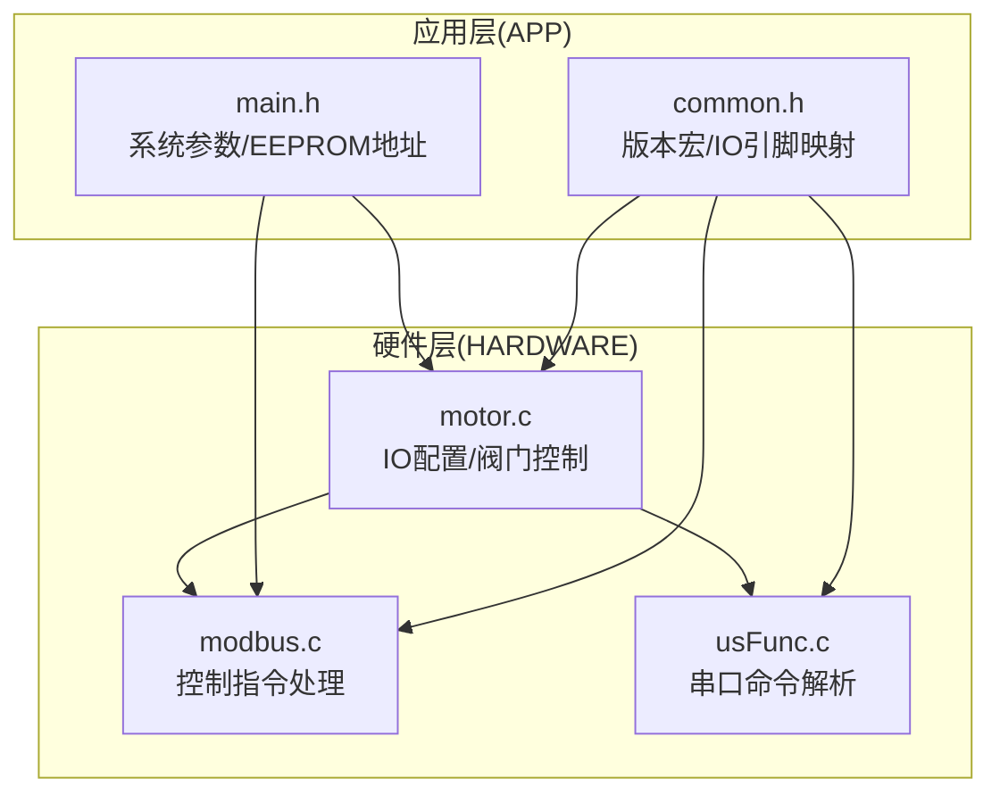
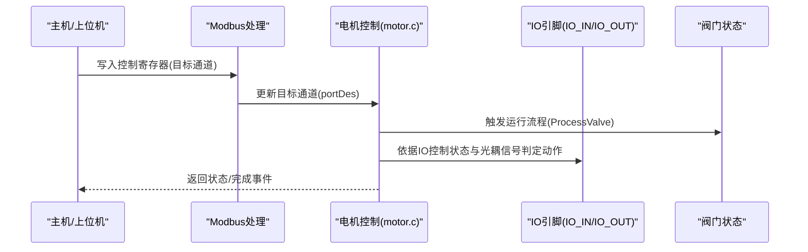
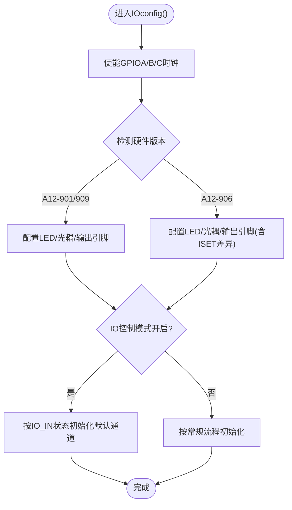
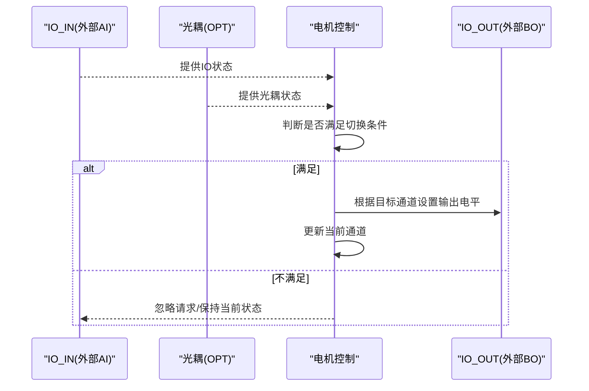
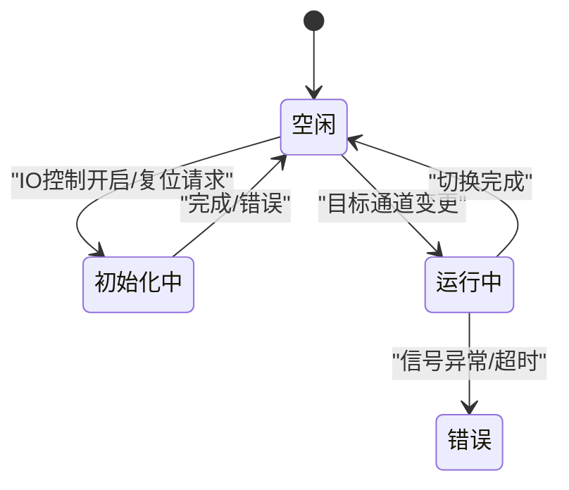
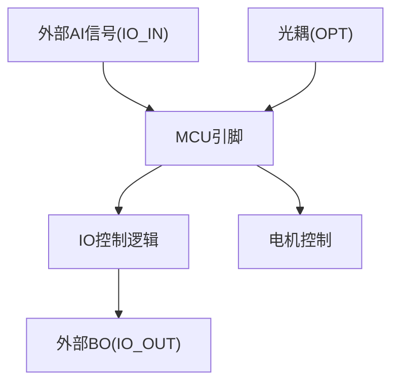
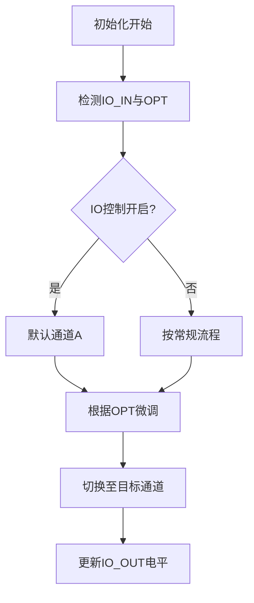
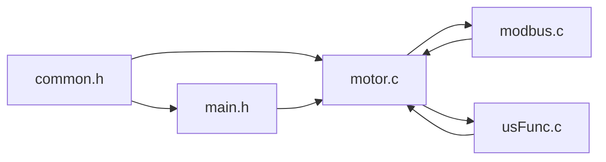

# IO控制集成

<cite>
**本文引用的文件**
- [motor.c](file://SRC/HARDWARE/motor/motor.c)
- [common.h](file://SRC/APP/common.h)
- [main.h](file://SRC/APP/main.h)
- [modbus.c](file://SRC/HARDWARE/modbus/modbus.c)
- [usFunc.c](file://SRC/HARDWARE/usinterface/usFunc.c)
- [QHF_v1.3.1修改说明.md](file://Doc/QHF_v1.3.1修改说明.md)
- [A_901_STM32F103C8_1.0.0.dbgconf](file://USER/DebugConfig/A_901_STM32F103C8_1.0.0.dbgconf)
- [A_906_STM32F103C8_1.0.0.dbgconf](file://USER/DebugConfig/A_906_STM32F103C8_1.0.0.dbgconf)
</cite>

## 目录
1. [简介](#简介)
2. [项目结构](#项目结构)
3. [核心组件](#核心组件)
4. [架构总览](#架构总览)
5. [详细组件分析](#详细组件分析)
6. [依赖关系分析](#依赖关系分析)
7. [性能考虑](#性能考虑)
8. [故障排查指南](#故障排查指南)
9. [结论](#结论)
10. [附录](#附录)

## 简介
本文件面向通用开关器项目的IO控制集成，围绕IOconfig()函数的IO端口配置机制展开，系统性说明不同硬件版本（A12-901/906/909）的IO引脚分配与功能设置；解释IO控制模式下的输入输出逻辑，以及AI信号检测与BO输出控制的实现原理；阐述IO控制与阀门控制的协同机制（状态同步与冲突处理）；提供硬件连接示意与信号时序图；并给出调试方法与常见问题排查建议。

## 项目结构
- IO控制相关代码主要分布在APP层与HARDWARE层：
  - APP层：版本宏定义、IO引脚映射、系统参数与EEPROM地址布局
  - HARDWARE层：电机控制与IO配置、Modbus控制指令处理、串口接口命令解析

**图表来源**
- [common.h:42-133](file://SRC/APP/common.h#L42-L133)
- [main.h:110-125](file://SRC/APP/main.h#L110-L125)
- [motor.c:4-68](file://SRC/HARDWARE/motor/motor.c#L4-L68)
- [modbus.c:590-621](file://SRC/HARDWARE/modbus/modbus.c#L590-L621)
- [usFunc.c:280-312](file://SRC/HARDWARE/usinterface/usFunc.c#L280-L312)

**章节来源**
- [common.h:42-133](file://SRC/APP/common.h#L42-L133)
- [main.h:110-125](file://SRC/APP/main.h#L110-L125)

## 核心组件
- IO配置与引脚映射
  - 通过版本宏选择IO引脚：A12-901/906/909分别映射至不同GPIO引脚，形成统一的IO_IN/IO_OUT抽象
  - IO控制模式由宏IOCTRL开启，配合IO_RS电平标准区分A/B版本
- 阀门控制与IO联动
  - 初始化流程中根据IO控制状态决定默认通道与半通道策略
  - 运行过程中通过光耦信号与IO状态共同参与定位与保护
- Modbus控制与串口命令
  - Modbus控制寄存器写入触发阀门目标位置更新
  - 串口命令解析支持通道切换与参数设置

**章节来源**
- [motor.c:158-257](file://SRC/HARDWARE/motor/motor.c#L158-L257)
- [modbus.c:590-621](file://SRC/HARDWARE/modbus/modbus.c#L590-L621)
- [usFunc.c:280-312](file://SRC/HARDWARE/usinterface/usFunc.c#L280-L312)

## 架构总览
IO控制集成以“版本宏选择 + 引脚映射 + 阀门控制 + 通信协议”为主线，形成如下交互：

**图表来源**
- [modbus.c:590-621](file://SRC/HARDWARE/modbus/modbus.c#L590-L621)
- [motor.c:275-351](file://SRC/HARDWARE/motor/motor.c#L275-L351)
- [main.h:110-125](file://SRC/APP/main.h#L110-L125)

## 详细组件分析

### IOconfig()函数与IO端口配置机制
- IOconfig()负责IO端口的初始化与配置，核心要点：
  - 使能GPIOA/B/C时钟
  - 针对不同硬件版本（A12-901/906/909）设置LED、光耦输入、输出引脚模式
  - 906/909版本对ISET引脚配置存在差异，需按版本选择
- 引脚映射与版本差异
  - A12-901：IO_OUT映射至PA8，IO_IN映射至PB3（或PBout(3)，取决于具体版本）
  - A12-906：IO_OUT映射至PB13，IO_IN映射至PB14
  - A12-909：IO_OUT映射至PB13，IO_IN映射至PB5
- IO控制模式与电平标准
  - IO_RS宏决定IO_IN/IO_OUT电平逻辑：IO_RS=1表示A版本（IO_IN高电平有效、IO_OUT低电平有效），IO_RS=0表示B版本（两者均为高电平有效）
  - IOCTRL宏开启IO控制模式，影响初始化默认通道与半通道行为

**图表来源**
- [motor.c:4-68](file://SRC/HARDWARE/motor/motor.c#L4-L68)
- [main.h:110-125](file://SRC/APP/main.h#L110-L125)
- [common.h:42-133](file://SRC/APP/common.h#L42-L133)

**章节来源**
- [motor.c:4-68](file://SRC/HARDWARE/motor/motor.c#L4-L68)
- [main.h:110-125](file://SRC/APP/main.h#L110-L125)
- [common.h:42-133](file://SRC/APP/common.h#L42-L133)

### IO控制模式下的输入输出逻辑
- 输入逻辑（AI检测）
  - IO_IN作为外部AI输入，结合光耦OPT信号共同参与定位与保护判断
  - 在初始化与运行阶段，若检测到特定信号组合，触发急停或状态切换
- 输出逻辑（BO控制）
  - IO_OUT作为外部BO输出，用于指示当前通道状态或联动外部设备
  - 电平逻辑由IO_RS与IOCTRL共同决定：A版本通常为“高电平有效输入、低电平有效输出”，B版本为“高电平有效输入、高电平有效输出”
- 状态同步与冲突处理
  - IO控制开启时，初始化默认通道优先设置为A，避免就近复位冲突
  - 若处于运行中且状态不满足切换条件，忽略外部IO请求，防止冲突

**图表来源**
- [motor.c:158-257](file://SRC/HARDWARE/motor/motor.c#L158-L257)
- [main.h:110-125](file://SRC/APP/main.h#L110-L125)

**章节来源**
- [motor.c:158-257](file://SRC/HARDWARE/motor/motor.c#L158-L257)
- [main.h:110-125](file://SRC/APP/main.h#L110-L125)

### AI信号检测与BO输出控制实现原理
- AI检测
  - 通过IO_IN引脚读取外部信号，结合OPT信号与方向补偿策略，确保在复位与切换过程中的安全性
  - 初始化阶段利用光耦信号决定初始方向，避免误判
- BO输出控制
  - 根据当前通道状态与IO控制模式，动态设置IO_OUT电平
  - 电平标准遵循版本宏定义，确保与外部设备一致

**章节来源**
- [motor.c:73-268](file://SRC/HARDWARE/motor/motor.c#L73-L268)
- [main.h:110-125](file://SRC/APP/main.h#L110-L125)

### IO控制与阀门控制的协调机制
- 初始化阶段
  - IO控制开启时，默认通道设为A，半通道策略被抑制，避免与IO状态冲突
  - 初始化完成后，根据IO状态与光耦信号决定最终当前位置
- 运行阶段
  - 通信或IO请求到达时，先检查运行状态与切换条件，满足后再执行
  - 切换完成后，更新当前通道并持久化到EEPROM

**图表来源**
- [motor.c:73-268](file://SRC/HARDWARE/motor/motor.c#L73-L268)
- [modbus.c:590-621](file://SRC/HARDWARE/modbus/modbus.c#L590-L621)

**章节来源**
- [motor.c:73-268](file://SRC/HARDWARE/motor/motor.c#L73-L268)
- [modbus.c:590-621](file://SRC/HARDWARE/modbus/modbus.c#L590-L621)

### 硬件连接图与信号时序图
- 硬件连接示意（概念图）
  - IO_IN连接外部AI信号源（如传感器/PLC输出）
  - IO_OUT连接外部BO负载（如指示灯/继电器）
  - 光耦OPT与电机轴位置联动，提供原点与端口检测
  - ISET引脚用于电流设置（906/909版本）

- 信号时序（概念图）
  - IO控制开启时，初始化阶段优先将通道置为A，随后根据光耦信号进行微调
  - 切换过程中，IO_OUT根据目标通道输出相应电平

**图表来源**
- [motor.c:73-268](file://SRC/HARDWARE/motor/motor.c#L73-L268)
- [main.h:110-125](file://SRC/APP/main.h#L110-L125)

## 依赖关系分析
- 版本宏与IO引脚映射
  - common.h中通过O_/A_/B_系列宏选择硬件版本，并定义IO_RS、IOCTRL、DIRECTION_SWITCH等关键宏
  - main.h中根据版本宏生成IO_OUT/IO_IN引脚映射
- IO控制与阀门控制耦合
  - motor.c中初始化与运行流程受IOCTRL影响，同时依赖光耦信号与EEPROM参数
- 通信协议与IO控制
  - modbus.c处理控制指令，更新目标通道；usFunc.c提供串口命令解析，二者共同驱动阀门动作

**图表来源**
- [common.h:42-133](file://SRC/APP/common.h#L42-L133)
- [main.h:110-125](file://SRC/APP/main.h#L110-L125)
- [motor.c:73-268](file://SRC/HARDWARE/motor/motor.c#L73-L268)
- [modbus.c:590-621](file://SRC/HARDWARE/modbus/modbus.c#L590-L621)
- [usFunc.c:280-312](file://SRC/HARDWARE/usinterface/usFunc.c#L280-L312)

**章节来源**
- [common.h:42-133](file://SRC/APP/common.h#L42-L133)
- [main.h:110-125](file://SRC/APP/main.h#L110-L125)
- [motor.c:73-268](file://SRC/HARDWARE/motor/motor.c#L73-L268)
- [modbus.c:590-621](file://SRC/HARDWARE/modbus/modbus.c#L590-L621)
- [usFunc.c:280-312](file://SRC/HARDWARE/usinterface/usFunc.c#L280-L312)

## 性能考虑
- IO控制模式下，初始化流程优先确定默认通道，减少不必要的运动与定位时间
- 通信与IO处理采用非阻塞状态机，避免长时间占用CPU
- EEPROM写入频率控制，防止频繁擦写导致寿命衰减

## 故障排查指南
- 症状：IO控制开启后无法就近复位
  - 排查：确认IO控制模式与当前通道状态，检查IO_IN电平与光耦信号是否符合预期
  - 参考：初始化流程中针对IO控制的特殊处理
- 症状：BO输出电平与预期不符
  - 排查：核对IO_RS与IOCTRL宏定义，确认硬件版本是否正确编译
  - 参考：main.h中的引脚映射与电平标准
- 症状：通信与IO同时触发导致冲突
  - 排查：检查运行状态与切换条件，确保在VALVE_RUN_END状态下才接受新请求
  - 参考：motor.c中的运行状态机与条件判断
- 症状：版本兼容性问题
  - 排查：核对版本宏定义与调试配置文件，确保编译目标与硬件一致
  - 参考：QHF_v1.3.1修改说明中关于版本输出与宏开关的变更

**章节来源**
- [motor.c:73-268](file://SRC/HARDWARE/motor/motor.c#L73-L268)
- [main.h:110-125](file://SRC/APP/main.h#L110-L125)
- [QHF_v1.3.1修改说明.md:106-146](file://Doc/QHF_v1.3.1修改说明.md#L106-L146)

## 结论
IO控制集成通过版本宏与引脚映射实现了对A12-901/906/909硬件的统一支持；在IO控制模式下，AI检测与BO输出与阀门控制紧密协作，确保安全可靠的切换与状态同步。通过合理的初始化策略、状态机设计与通信协议处理，系统在不同硬件版本间具备良好的兼容性与可维护性。

## 附录
- 版本与调试配置参考
  - A12-901调试配置文件
  - A12-906调试配置文件
- 版本变更与IO控制相关修订
  - 1.3.1A/B版本统一IO宏定义，区分A/B电平标准
  - 1.3.1AB-r11起默认输出三种版本程序，区分IO控制能力
  - 1.3.1-r15新增灯状态输出，便于IO状态诊断

**章节来源**
- [A_901_STM32F103C8_1.0.0.dbgconf:1-37](file://USER/DebugConfig/A_901_STM32F103C8_1.0.0.dbgconf#L1-L37)
- [A_906_STM32F103C8_1.0.0.dbgconf:1-37](file://USER/DebugConfig/A_906_STM32F103C8_1.0.0.dbgconf#L1-L37)
- [QHF_v1.3.1修改说明.md:106-146](file://Doc/QHF_v1.3.1修改说明.md#L106-L146)