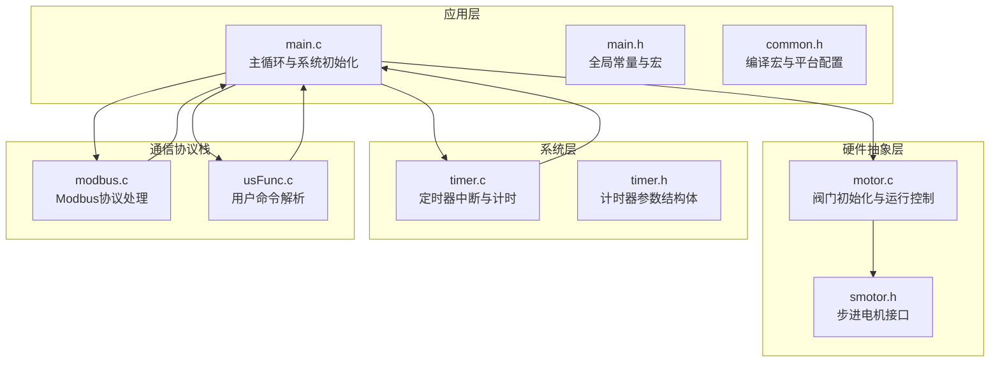
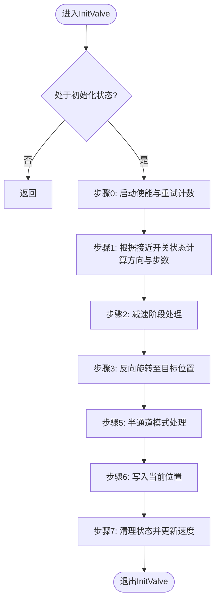
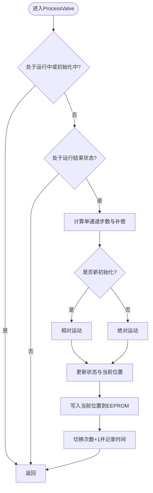
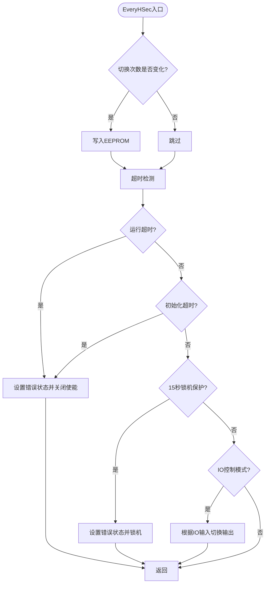
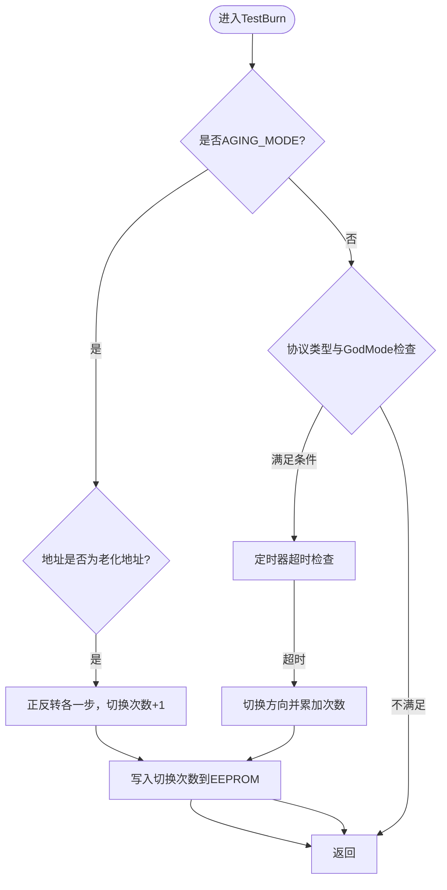
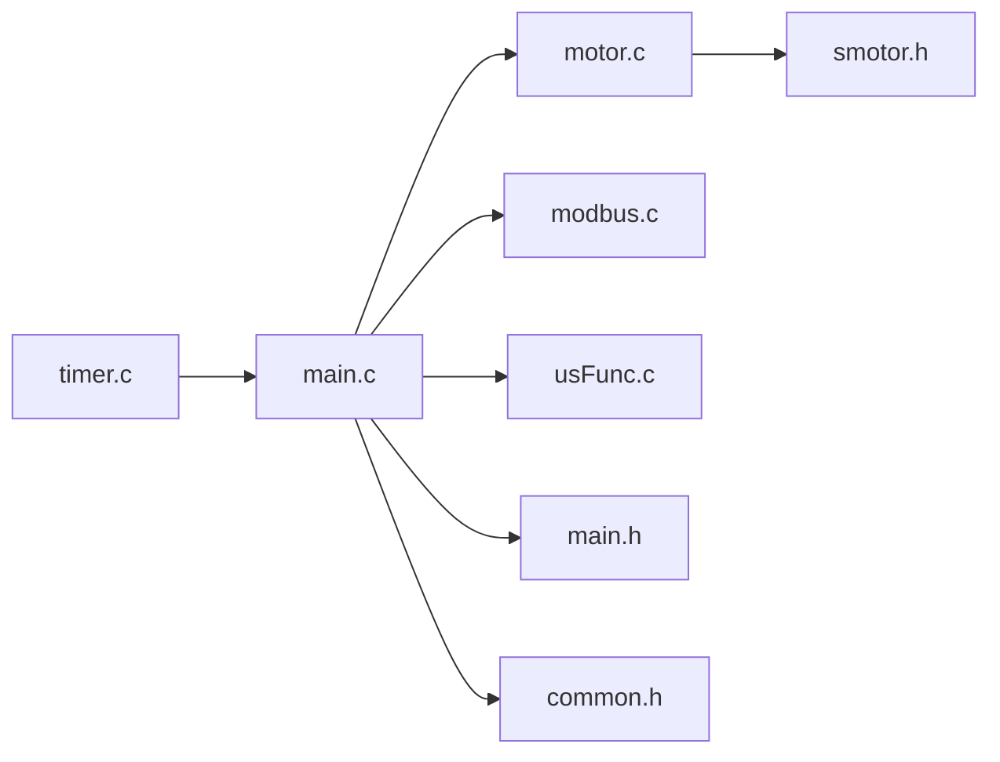

# 主循环逻辑

<cite>
**本文档引用的文件**
- [main.c](file://SRC/APP/main.c)
- [main.h](file://SRC/APP/main.h)
- [motor.c](file://SRC/HARDWARE/motor/motor.c)
- [motor.h](file://SRC/HARDWARE/motor/motor.h)
- [timer.c](file://SRC/SYSTEM/timer/timer.c)
- [timer.h](file://SRC/SYSTEM/timer/timer.h)
- [common.h](file://SRC/APP/common.h)
- [modbus.c](file://SRC/HARDWARE/modbus/modbus.c)
- [usFunc.c](file://SRC/HARDWARE/usinterface/usFunc.c)
- [smotor.h](file://SRC/HARDWARE/motor/smotor.h)
</cite>

## 目录
1. [简介](#简介)
2. [项目结构](#项目结构)
3. [核心组件](#核心组件)
4. [架构总览](#架构总览)
5. [详细组件分析](#详细组件分析)
6. [依赖关系分析](#依赖关系分析)
7. [性能考虑](#性能考虑)
8. [故障排查指南](#故障排查指南)
9. [结论](#结论)

## 简介
本文件聚焦通用开关器项目的主循环逻辑，系统性梳理以下关键内容：
- 主循环的任务调度机制与调用顺序（InitValve()、ProcessValve()、协议栈处理、EveryHSec()、DebugOut()、ErrBlink()）
- 每秒定时检测任务EveryHSec()的实现原理、超时保护机制与故障检测逻辑
- 调试输出DebugOut()与错误指示ErrBlink()的工作机制
- 主循环执行流程图与任务时序图
- 性能优化技巧与实时性保障措施
- AGING_MODE模式下的特殊处理逻辑与测试功能实现

## 项目结构
该工程采用分层模块化组织，主循环位于应用层，核心控制逻辑位于硬件抽象层，系统定时器与通信协议分别由系统层与协议栈实现。



**图表来源**
- [main.c:433-494](file://SRC/APP/main.c#L433-L494)
- [motor.c:73-268](file://SRC/HARDWARE/motor/motor.c#L73-L268)
- [timer.c:22-42](file://SRC/SYSTEM/timer/timer.c#L22-L42)
- [modbus.c:540-752](file://SRC/HARDWARE/modbus/modbus.c#L540-L752)
- [usFunc.c:217-316](file://SRC/HARDWARE/usinterface/usFunc.c#L217-L316)

**章节来源**
- [main.c:433-494](file://SRC/APP/main.c#L433-L494)
- [common.h:30-134](file://SRC/APP/common.h#L30-L134)

## 核心组件
- 主循环与系统初始化：负责系统时钟、延时、串口、定时器、IO配置、协议栈初始化、参数读取与主循环调度。
- 阀门控制：InitValve()完成初始化流程；ProcessValve()处理运行切换；TestBurn()在特定模式下执行老化测试。
- 定时器与计时：TIM2中断每毫秒递增多个计时变量，支撑EveryHSec()、超时保护、切换时间统计等。
- 协议栈：根据协议类型选择AGS或Modbus处理路径，轮询解析数据帧。
- 调试与错误指示：周期性调试输出与LED错误闪烁。

**章节来源**
- [main.c:433-494](file://SRC/APP/main.c#L433-L494)
- [motor.c:73-351](file://SRC/HARDWARE/motor/motor.c#L73-L351)
- [timer.c:22-42](file://SRC/SYSTEM/timer/timer.c#L22-L42)
- [main.h:191-251](file://SRC/APP/main.h#L191-L251)

## 架构总览
主循环在while(1)中按固定顺序执行，确保控制、通信与监控任务的协调运行。

```mermaid
sequenceDiagram
participant SYS as "系统初始化"
participant LOOP as "主循环"
participant INIT as "InitValve()"
participant PROC as "ProcessValve()"
participant PROT as "协议栈处理"
participant SEC as "EveryHSec()"
participant DBG as "DebugOut()"
participant ERR as "ErrBlink()"
SYS->>LOOP : 启动主循环
LOOP->>INIT : 调用初始化控制
INIT-->>LOOP : 返回
LOOP->>PROC : 调用运行控制
PROC-->>LOOP : 返回
LOOP->>PROT : 协议栈轮询
PROT-->>LOOP : 返回
LOOP->>SEC : 定时检测与超时保护
SEC-->>LOOP : 返回
LOOP->>DBG : 周期性调试输出
DBG-->>LOOP : 返回
LOOP->>ERR : 错误指示刷新
ERR-->>LOOP : 返回
LOOP->>LOOP : 循环继续
```

**图表来源**
- [main.c:478-493](file://SRC/APP/main.c#L478-L493)
- [motor.c:73-351](file://SRC/HARDWARE/motor/motor.c#L73-L351)
- [timer.c:22-42](file://SRC/SYSTEM/timer/timer.c#L22-L42)

## 详细组件分析

### 主循环任务调度与执行时机
- 调用顺序：InitValve() → ProcessValve() → 协议栈处理 → EveryHSec() → DebugOut() → TestBurn() → ErrBlink()
- 执行条件：
  - InitValve()/ProcessValve()受状态机约束，仅在满足条件时推进
  - 协议栈处理依据当前协议类型分支
  - EveryHSec()在每秒定时触发时执行
  - DebugOut()按固定周期输出
  - TestBurn()在特定模式与地址条件下触发
  - ErrBlink()按LED闪烁间隔刷新

**章节来源**
- [main.c:478-493](file://SRC/APP/main.c#L478-L493)
- [motor.c:73-351](file://SRC/HARDWARE/motor/motor.c#L73-L351)

### InitValve() 初始化流程
- 功能：完成阀门原点寻找、方向校准、半通道定位与最终位置确认
- 关键步骤：
  - 启动使能与重试计数
  - 根据接近开关状态决定旋转方向与步数
  - 在半通道模式下执行半步定位
  - 写入当前位置并结束初始化
- 状态转换：VALVE_INITING → VALVE_RUN_END，同时更新速度参数



**图表来源**
- [motor.c:73-268](file://SRC/HARDWARE/motor/motor.c#L73-L268)

**章节来源**
- [motor.c:73-268](file://SRC/HARDWARE/motor/motor.c#L73-L268)

### ProcessValve() 运行控制流程
- 功能：在运行状态与无运动状态下，根据目标位置与方向补偿计算步数，执行绝对或相对运动，并记录切换次数与时间
- 关键逻辑：
  - 计算单通道步数与方向补偿
  - 根据是否新初始化选择相对或绝对运动
  - 更新状态机与当前位置，写入EEPROM
  - 记录切换时间与总次数



**图表来源**
- [motor.c:275-351](file://SRC/HARDWARE/motor/motor.c#L275-L351)

**章节来源**
- [motor.c:275-351](file://SRC/HARDWARE/motor/motor.c#L275-L351)

### 协议栈处理
- AGS协议：调用ags_mbProcess()进行帧解析与处理
- Modbus协议：调用mb_Poll()进行轮询解析
- 协议类型在系统初始化时根据EEPROM参数确定

**章节来源**
- [main.c:468-487](file://SRC/APP/main.c#L468-L487)
- [modbus.c:540-752](file://SRC/HARDWARE/modbus/modbus.c#L540-L752)

### EveryHSec() 定时检测与超时保护
- 触发条件：定时器中断每秒触发一次
- 主要功能：
  - 保存切换次数到EEPROM（状态变化时）
  - 超时保护：运行超时与初始化超时分别设置阈值，超过则置错误状态并关闭使能
  - 15秒锁机保护：进一步锁定设备防止持续异常
- IO控制（可选）：在IO控制模式下，根据IO输入状态切换输出电平



**图表来源**
- [main.c:69-202](file://SRC/APP/main.c#L69-L202)
- [timer.c:22-42](file://SRC/SYSTEM/timer/timer.c#L22-L42)

**章节来源**
- [main.c:69-202](file://SRC/APP/main.c#L69-L202)
- [timer.c:22-42](file://SRC/SYSTEM/timer/timer.c#L22-L42)

### DebugOut() 调试输出
- 触发条件：按固定周期（约3秒）输出调试信息
- 输出内容：状态、当前位置、目标位置、光感状态、IO状态（视版本）

**章节来源**
- [main.c:496-510](file://SRC/APP/main.c#L496-L510)

### ErrBlink() 错误指示
- 触发条件：按LED闪烁间隔定时翻转LED
- 闪烁间隔：正常运行、重试、错误三种模式，通过ErrBlinkTime控制

**章节来源**
- [main.c:512-519](file://SRC/APP/main.c#L512-L519)
- [main.h:191-193](file://SRC/APP/main.h#L191-L193)

### TestBurn() 测试功能与AGING_MODE模式
- 模式识别：AGING_MODE宏开启时，进入专用老化循环
- 地址判定：根据协议类型与地址判断是否执行测试
- 老化逻辑：
  - AGING_MODE模式：固定1秒间隔正反转各一步，累计切换次数并写入EEPROM
  - 非AGING_MODE模式：按老化地址与间隔定时器触发，正反转交替，记录烧机次数
- 速度与步数：根据减速比与速度参数计算步数



**图表来源**
- [motor.c:376-462](file://SRC/HARDWARE/motor/motor.c#L376-L462)
- [main.c:450-456](file://SRC/APP/main.c#L450-L456)

**章节来源**
- [motor.c:376-462](file://SRC/HARDWARE/motor/motor.c#L376-L462)
- [main.c:450-456](file://SRC/APP/main.c#L450-L456)

## 依赖关系分析
- 主循环依赖定时器中断提供时间基准，驱动EveryHSec()与切换时间统计
- InitValve()/ProcessValve()依赖步进电机接口与EEPROM参数
- 协议栈依赖系统参数与通信接口
- 调试与错误指示依赖计时器与LED引脚



**图表来源**
- [timer.c:22-42](file://SRC/SYSTEM/timer/timer.c#L22-L42)
- [main.c:433-494](file://SRC/APP/main.c#L433-L494)
- [motor.c:73-351](file://SRC/HARDWARE/motor/motor.c#L73-L351)
- [modbus.c:540-752](file://SRC/HARDWARE/modbus/modbus.c#L540-L752)
- [usFunc.c:217-316](file://SRC/HARDWARE/usinterface/usFunc.c#L217-L316)

**章节来源**
- [timer.c:22-42](file://SRC/SYSTEM/timer/timer.c#L22-L42)
- [main.c:433-494](file://SRC/APP/main.c#L433-L494)

## 性能考虑
- 中断优先级与定时精度：TIM2中断提供1ms基准，确保超时与计时准确
- 任务粒度划分：将IO控制、超时保护、调试输出与错误指示分离，避免阻塞主循环
- 实时性保障：
  - 将耗时的协议处理与调试输出置于主循环末尾，优先保证控制与检测
  - 使用状态机避免重复计算，减少分支判断开销
- 通信优化：在非RELEASE模式下减少调试输出频率，降低串口占用

**章节来源**
- [timer.c:11-19](file://SRC/SYSTEM/timer/timer.c#L11-L19)
- [main.c:496-510](file://SRC/APP/main.c#L496-L510)
- [common.h:30-37](file://SRC/APP/common.h#L30-L37)

## 故障排查指南
- 超时保护触发：
  - 现象：设备进入错误状态并关闭使能，LED以错误间隔闪烁
  - 排查：检查机械负载、接近开关状态、电源与电机连线
- 初始化失败：
  - 现象：初始化步骤卡住或反复重试
  - 排查：确认接近开关接线、减速比与速度参数、EEPROM写入状态
- 通信异常：
  - 现象：协议栈解析失败或命令无响应
  - 排查：核对地址、波特率、帧格式与线序
- 老化模式异常：
  - 现象：老化循环不触发或切换次数不增长
  - 排查：确认AGING_MODE宏、地址配置与定时器中断

**章节来源**
- [main.c:69-202](file://SRC/APP/main.c#L69-L202)
- [motor.c:73-268](file://SRC/HARDWARE/motor/motor.c#L73-L268)
- [modbus.c:540-752](file://SRC/HARDWARE/modbus/modbus.c#L540-L752)

## 结论
主循环通过明确的任务划分与严格的时序控制，实现了阀门初始化、运行控制、协议处理、定时检测与故障保护的协同工作。在AGING_MODE模式下，系统提供了稳定的自动化测试能力。通过合理利用定时器中断与状态机，系统在保证实时性的同时具备良好的可维护性与扩展性。