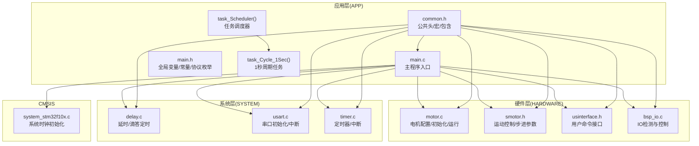
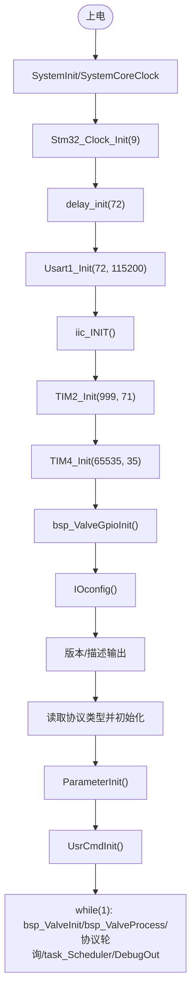
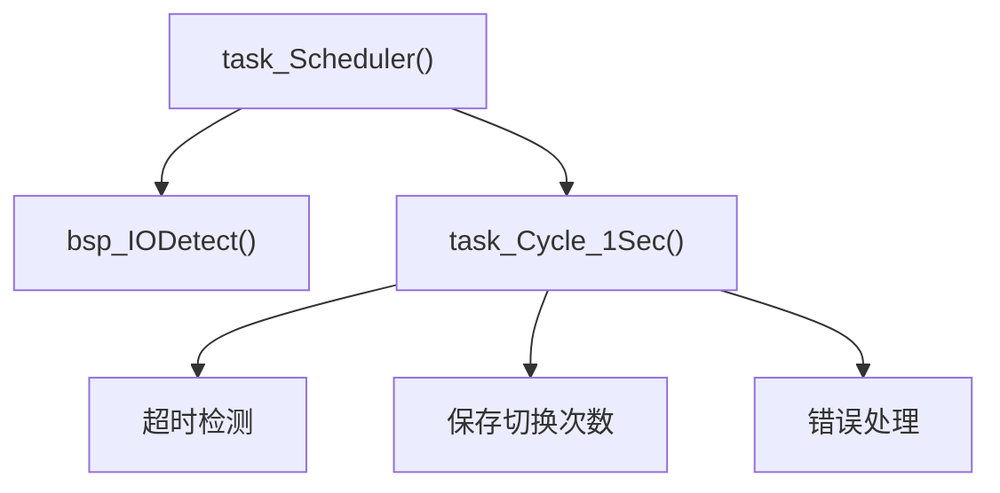
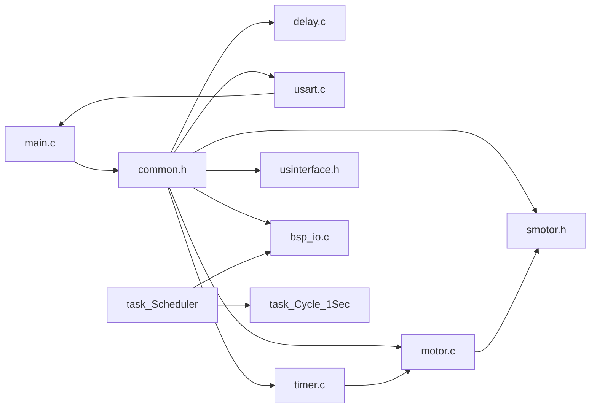

# 主程序结构

<cite>
**本文引用的文件**
- [main.c](file://SRC/APP/main.c)
- [main.h](file://SRC/APP/main.h)
- [common.h](file://SRC/APP/common.h)
- [system_stm32f10x.c](file://SRC/CMSIS/DeviceSupport/system_stm32f10x.c)
- [delay.c](file://SRC/SYSTEM/delay/delay.c)
- [usart.c](file://SRC/SYSTEM/usart/usart.c)
- [timer.c](file://SRC/SYSTEM/timer/timer.c)
- [motor.c](file://SRC/HARDWARE/motor/motor.c)
- [smotor.h](file://SRC/HARDWARE/motor/smotor.h)
- [usinterface.h](file://SRC/HARDWARE/usinterface/usinterface.h)
- [bsp_io.c](file://SRC/HARDWARE/io/bsp_io.c)
</cite>

## 更新摘要
**变更内容**
- 移除了 io_Ctrl_Process() 函数，引入了新的任务调度机制
- 新增 task_Scheduler() 和 task_Cycle_1Sec() 函数，重构了主循环处理流程
- 电机控制函数统一使用 bsp_ 前缀，提升了代码规范性
- 重新组织了主循环中的任务执行顺序，提高了系统的实时性和稳定性

## 目录
1. [简介](#简介)
2. [项目结构](#项目结构)
3. [核心组件](#核心组件)
4. [架构总览](#架构总览)
5. [详细组件分析](#详细组件分析)
6. [依赖关系分析](#依赖关系分析)
7. [性能考量](#性能考量)
8. [故障排查指南](#故障排查指南)
9. [结论](#结论)

## 简介
本文面向通用开关器项目的主程序，系统性梳理 main 函数的整体架构与执行流程，覆盖系统初始化、硬件配置、程序启动序列、分层设计思想、关键初始化步骤（时钟、延时、串口、定时器、电机与IO）以及常见初始化问题的排查方法。通过架构图与时序图帮助开发者快速理解从上电到稳定运行的完整路径。

## 项目结构
- 应用层入口位于 APP 目录，主程序集中在 main.c，公共头文件 common.h 汇聚各模块头文件与平台宏定义。
- 硬件抽象层（HAL）由 SYSTEM 与 HARDWARE 子目录提供：SYSTEM 提供延时、串口、定时器等通用外设封装；HARDWARE 提供电机、EEPROM、通信协议等具体硬件接口。
- CMSIS 提供底层系统时钟与启动文件支持。



**图表来源**
- [main.c:300-358](file://SRC/APP/main.c#L300-L358)
- [main.c:68-75](file://SRC/APP/main.c#L68-L75)
- [main.c:27-66](file://SRC/APP/main.c#L27-L66)
- [bsp_io.c:16-65](file://SRC/HARDWARE/io/bsp_io.c#L16-L65)

**章节来源**
- [main.c:300-358](file://SRC/APP/main.c#L300-L358)
- [main.c:68-75](file://SRC/APP/main.c#L68-L75)
- [main.c:27-66](file://SRC/APP/main.c#L27-L66)

## 核心组件
- 系统时钟初始化：通过 SystemInit 与 Stm32_Clock_Init 实现系统频率配置，确保后续外设与定时基准稳定。
- 延时与定时：delay_init 配置 SysTick，TIM2/TIM4 提供毫秒级与脉冲定时，支撑协议轮询与运动控制。
- 串口通信：Usart1_Init/Usart2_Init/Usart3_Init 初始化调试串口与多路通信接口，中断驱动接收。
- 电机与IO：bsp_ValveGpioInit/bsp_ValveInit/bsp_ValveProcess 配置电机驱动引脚、光耦检测与IO控制引脚，配合运动控制算法实现定位与切换。
- **新增** 任务调度系统：task_Scheduler() 统一管理IO检测与周期性任务，task_Cycle_1Sec() 提供1秒精度的周期性检查。
- 参数与协议：ParameterInit 从EEPROM读取/写入系统参数，根据协议类型初始化 AGS 或 Modbus 协议栈。

**章节来源**
- [main.c:300-358](file://SRC/APP/main.c#L300-L358)
- [main.c:68-75](file://SRC/APP/main.c#L68-L75)
- [main.c:27-66](file://SRC/APP/main.c#L27-L66)
- [system_stm32f10x.c:212-269](file://SRC/CMSIS/DeviceSupport/system_stm32f10x.c#L212-L269)
- [delay.c:23-42](file://SRC/SYSTEM/delay/delay.c#L23-L42)
- [usart.c:38-66](file://SRC/SYSTEM/usart/usart.c#L38-L66)
- [timer.c:11-19](file://SRC/SYSTEM/timer/timer.c#L11-L19)
- [motor.c:4-70](file://SRC/HARDWARE/motor/motor.c#L4-L70)
- [main.h:127-189](file://SRC/APP/main.h#L127-L189)

## 架构总览
主程序采用"分层初始化 + 任务调度 + 循环处理"的结构：
- 上电后先进行系统时钟与基础外设初始化，再加载参数与协议栈，最后进入主循环持续处理初始化、运行、协议与调试输出。
- **重构后的主循环**：InitValve → ProcessValve → 协议栈轮询 → task_Scheduler → DebugOut，其中 task_Scheduler 统一管理IO检测与1秒周期任务。

```mermaid
sequenceDiagram
participant PWR as "电源上电"
participant SYS as "SystemInit/SystemCoreClock"
participant CLK as "Stm32_Clock_Init"
participant DEL as "delay_init"
participant DBG as "Usart1_Init"
participant I2C as "iic_INIT"
participant TM2 as "TIM2_Init"
participant TM4 as "TIM4_Init"
participant GPIO as "bsp_ValveGpioInit"
participant IO as "IOconfig"
participant PR as "ParameterInit"
participant PS as "协议初始化(AGS/Modbus)"
participant LOOP as "主循环"
participant SCH as "task_Scheduler"
participant CYCLE as "task_Cycle_1Sec"
PWR->>SYS : 复位后调用SystemInit
SYS-->>CLK : 设置系统时钟
CLK-->>DEL : 配置SysTick基准
DEL-->>DBG : 初始化调试串口
DBG-->>I2C : 初始化I2C
I2C-->>TM2 : 初始化10kHz定时器
TM2-->>TM4 : 初始化脉冲定时器
TM4-->>GPIO : 配置电机IO与驱动
GPIO-->>IO : 配置IO控制引脚
IO-->>PR : 读取/写入系统参数
PR-->>PS : 根据协议初始化
PS-->>LOOP : 进入主循环
LOOP->>LOOP : bsp_ValveInit/bsp_ValveProcess
LOOP->>LOOP : 协议栈轮询
LOOP->>SCH : task_Scheduler()
SCH->>CYCLE : task_Cycle_1Sec()
LOOP->>LOOP : DebugOut
```

**图表来源**
- [main.c:300-358](file://SRC/APP/main.c#L300-L358)
- [main.c:68-75](file://SRC/APP/main.c#L68-L75)
- [main.c:27-66](file://SRC/APP/main.c#L27-L66)
- [system_stm32f10x.c:212-269](file://SRC/CMSIS/DeviceSupport/system_stm32f10x.c#L212-L269)
- [delay.c:23-42](file://SRC/SYSTEM/delay/delay.c#L23-L42)
- [usart.c:38-66](file://SRC/SYSTEM/usart/usart.c#L38-L66)
- [timer.c:11-19](file://SRC/SYSTEM/timer/timer.c#L11-L19)
- [motor.c:4-70](file://SRC/HARDWARE/motor/motor.c#L4-L70)

## 详细组件分析

### 主程序入口与启动序列
- main 函数顺序执行：系统时钟设置、延时初始化、JTAG配置、调试串口初始化、I2C初始化、TIM2/TIM4初始化、**bsp_ValveGpioInit**、IO配置、版本信息输出、协议类型判定、参数初始化、用户命令初始化、进入主循环。
- **重构后的主循环**：bsp_ValveInit → bsp_ValveProcess → 协议栈轮询 → **task_Scheduler** → DebugOut，其中 task_Scheduler 统一管理IO检测与周期性任务。



**图表来源**
- [main.c:300-358](file://SRC/APP/main.c#L300-L358)

**章节来源**
- [main.c:300-358](file://SRC/APP/main.c#L300-L358)

### 系统时钟与基础外设初始化
- SystemInit 在启动文件中被调用，负责重置RCC配置、设置系统时钟源与分频、Flash预取与等待周期，并将向量表重定位到内部Flash。
- main 中调用 Stm32_Clock_Init 与 delay_init，确保SysTick以72MHz为基础进行微秒/毫秒延时。
- 串口初始化分别针对USART1/2/3，设置波特率、IO模式与中断优先级。
- TIM2/TIM4 初始化用于毫秒计时与脉冲定时，驱动运动控制与协议轮询。

**章节来源**
- [system_stm32f10x.c:212-269](file://SRC/CMSIS/DeviceSupport/system_stm32f10x.c#L212-L269)
- [main.c:300-314](file://SRC/APP/main.c#L300-L314)
- [delay.c:23-42](file://SRC/SYSTEM/delay/delay.c#L23-L42)
- [usart.c:38-66](file://SRC/SYSTEM/usart/usart.c#L38-L66)
- [timer.c:11-19](file://SRC/SYSTEM/timer/timer.c#L11-L19)

### 参数初始化与EEPROM交互
- ParameterInit 读取EEPROM中的板号以判断是否首次初始化；若非首次，则从EEPROM读取系统参数（地址、原点补偿、方向补偿、通道数、波特率、速度、IO控制、老化间隔、电流设置、序列号、协议、减速比、半通道、切换次数、回复方式等），并对越界参数进行修正或回写默认值。
- 若为首次初始化，写入默认参数并提示复位。

**章节来源**
- [main.c:272-298](file://SRC/APP/main.c#L272-L298)
- [main.h:127-189](file://SRC/APP/main.h#L127-L189)

### 电机与IO配置
- **更新** bsp_ValveGpioInit 配置电机驱动IO、光耦检测与电流设置引脚，绑定TIM4用于脉冲输出，并初始化原点搜索回调。
- **更新** IOconfig 根据不同硬件版本配置RS485收发使能、IO控制输出与输入（含不同电平标准与宏控制）。
- **新增** bsp_ValveInit/bsp_ValveProcess 提供更完善的阀门初始化与运行控制流程。

**章节来源**
- [motor.c:4-70](file://SRC/HARDWARE/motor/motor.c#L4-L70)
- [main.c:14-22](file://SRC/APP/main.c#L14-L22)
- [smotor.h:1-100](file://SRC/HARDWARE/motor/smotor.h#L1-L100)

### 协议栈初始化与轮询
- 根据协议类型（AGS_MODBUS 或 MODBUS）初始化对应协议栈；主循环中按协议类型调用 ags_mbProcess 或 mb_Poll 进行数据帧处理。
- 串口中断在收到数据时根据协议类型分派到 ags_mbReceive 或 mb_Receive。

**章节来源**
- [main.c:333-341](file://SRC/APP/main.c#L333-L341)
- [usart.c:138-221](file://SRC/SYSTEM/usart/usart.c#L138-L221)

### 任务调度系统
- **新增** task_Scheduler() 统一管理所有周期性任务，目前包含 bsp_IODetect() 和 task_Cycle_1Sec()。
- **新增** task_Cycle_1Sec() 提供1秒精度的周期性检查，包括超时检测、切换次数保存、错误处理等。
- **移除** 旧的 io_Ctrl_Process() 函数，其功能已整合到新的任务调度系统中。



**图表来源**
- [main.c:68-75](file://SRC/APP/main.c#L68-L75)
- [main.c:27-66](file://SRC/APP/main.c#L27-L66)

**章节来源**
- [main.c:68-75](file://SRC/APP/main.c#L68-L75)
- [main.c:27-66](file://SRC/APP/main.c#L27-L66)

### 主循环处理流程
- **更新** bsp_ValveInit：阀门初始化流程，包含重试、方向判断、减速调整、半通道处理、状态更新与速度恢复。
- **更新** bsp_ValveProcess：根据目标位置计算步数，执行相对/绝对移动，更新当前位置与切换次数，设置超时保护。
- **新增** task_Scheduler：统一管理IO检测与周期性任务。
- **更新** DebugOut/ErrBlink：周期性调试输出与LED闪烁控制。

**章节来源**
- [motor.c:378-392](file://SRC/HARDWARE/motor/motor.c#L378-L392)
- [main.c:342-357](file://SRC/APP/main.c#L342-L357)
- [main.c:360-384](file://SRC/APP/main.c#L360-L384)

## 依赖关系分析
- main.c 通过 common.h 统一包含各模块头文件，形成强耦合的顶层依赖；建议在大型项目中拆分为更细粒度的模块边界。
- 串口与协议栈存在双向依赖：串口中断处理调用协议接收函数，协议轮询依赖串口发送/接收能力。
- 定时器与运动控制耦合：TIM4 作为脉冲定时器，AxisXTimer 在中断中推进步进电机运动状态。
- **新增** 任务调度系统依赖：task_Scheduler 依赖 bsp_IODetect 和 task_Cycle_1Sec，形成清晰的任务层次结构。



**图表来源**
- [common.h:155-173](file://SRC/APP/common.h#L155-L173)
- [main.c:300-358](file://SRC/APP/main.c#L300-L358)
- [main.c:68-75](file://SRC/APP/main.c#L68-L75)
- [main.c:27-66](file://SRC/APP/main.c#L27-L66)

**章节来源**
- [common.h:155-173](file://SRC/APP/common.h#L155-L173)

## 性能考量
- SysTick 与定时器精度：delay_init 与 TIM2/TIM4 的分频与ARR设置直接影响延时与定时精度，需结合系统频率校准。
- 串口波特率：USARTx_Init 通过计算 USARTDIV 设置波特率，需确保 pclk2 与分频正确。
- 协议轮询：主循环中协议栈轮询与运动控制均在中断驱动下进行，应避免长时阻塞，必要时引入优先级与短时任务切片。
- EEPROM访问：ParameterInit 中多次I2C读写，建议在初始化阶段集中处理，避免运行期频繁访问。
- **新增** 任务调度性能：task_Scheduler 将多个周期性任务合并执行，减少了主循环中的重复检查，提高了系统响应性。

## 故障排查指南
- 串口无输出/接收异常
  - 检查 Usart1_Init 参数（pclk2/bound）与GPIO配置。
  - 确认 NVIC 初始化与中断优先级设置。
  - 参考：[usart.c:38-66](file://SRC/SYSTEM/usart/usart.c#L38-L66)
- 电机不动作或抖动
  - 检查 bsp_ValveGpioInit 中IO配置与TIM4脉冲设置。
  - 确认 bsp_ValveInit/bsp_ValveProcess 中步数与加速度参数。
  - 参考：[motor.c:4-70](file://SRC/HARDWARE/motor/motor.c#L4-L70)
- 参数未生效或EEPROM越界
  - 检查 ParameterInit 中参数范围校验与默认值写入。
  - 参考：[main.c:272-298](file://SRC/APP/main.c#L272-L298)
- 系统时钟异常导致延时不准确
  - 检查 SystemInit 与 Stm32_Clock_Init 的调用顺序与参数。
  - 参考：[system_stm32f10x.c:212-269](file://SRC/CMSIS/DeviceSupport/system_stm32f10x.c#L212-L269)
- 定时器中断未触发
  - 检查 TIM2/TIM4 初始化与NVIC优先级设置。
  - 参考：[timer.c:11-19](file://SRC/SYSTEM/timer/timer.c#L11-L19)
- **新增** 任务调度异常
  - 检查 task_Scheduler 调用频率与任务执行时间。
  - 确认 bsp_IODetect 与 task_Cycle_1Sec 的定时精度。
  - 参考：[main.c:68-75](file://SRC/APP/main.c#L68-L75)
- **新增** IO控制失效
  - 检查 IOCTRL 宏定义与硬件版本配置。
  - 确认 bsp_IODetect 中IO输入输出状态判断逻辑。
  - 参考：[bsp_io.c:75-153](file://SRC/HARDWARE/io/bsp_io.c#L75-L153)

**章节来源**
- [usart.c:38-66](file://SRC/SYSTEM/usart/usart.c#L38-L66)
- [motor.c:4-70](file://SRC/HARDWARE/motor/motor.c#L4-L70)
- [main.c:272-298](file://SRC/APP/main.c#L272-L298)
- [system_stm32f10x.c:212-269](file://SRC/CMSIS/DeviceSupport/system_stm32f10x.c#L212-L269)
- [timer.c:11-19](file://SRC/SYSTEM/timer/timer.c#L11-L19)
- [main.c:68-75](file://SRC/APP/main.c#L68-L75)
- [bsp_io.c:75-153](file://SRC/HARDWARE/io/bsp_io.c#L75-L153)

## 结论
主程序经过重构后，采用了更加规范化的分层初始化与任务调度处理模式，将系统时钟、延时、串口、定时器、电机与参数管理有机结合。通过引入 task_Scheduler() 和 task_Cycle_1Sec() 函数，实现了统一的任务管理机制，提升了系统的实时性和可维护性。同时，电机控制函数的 BSP 前缀规范化使得代码结构更加清晰。建议在后续维护中进一步细化模块边界、优化任务调度策略，以提升整体系统的性能和可靠性。