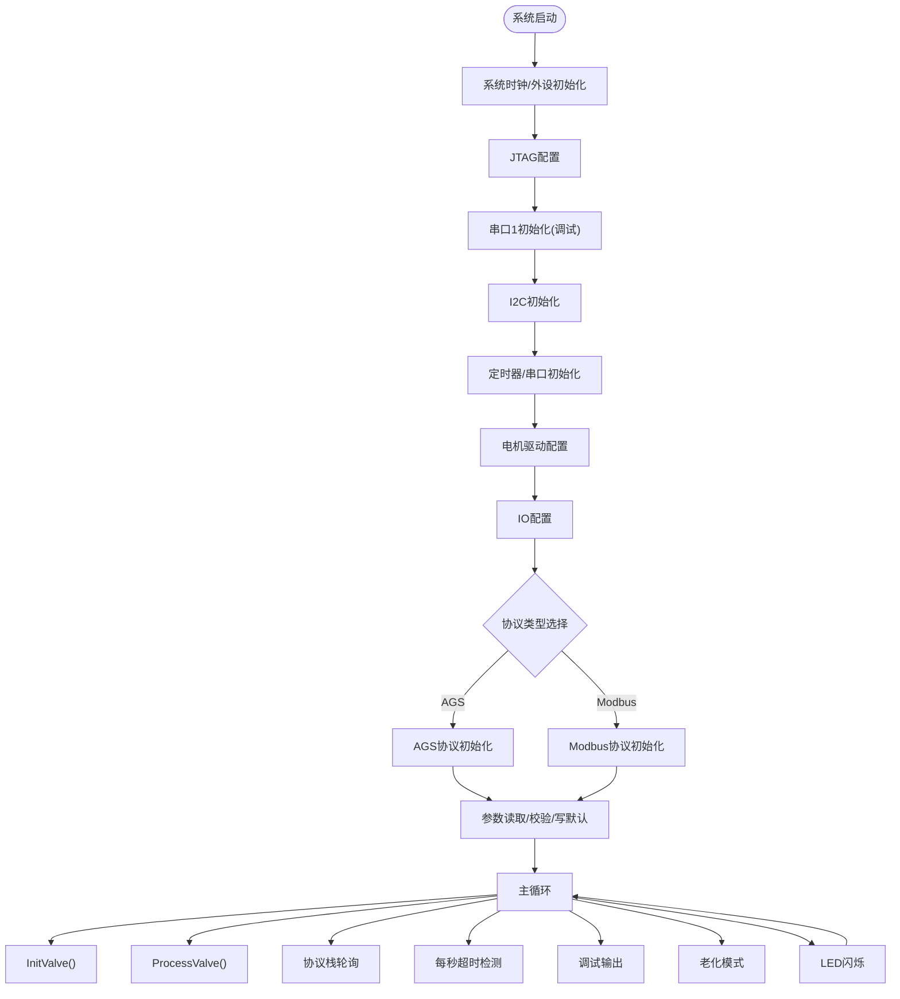
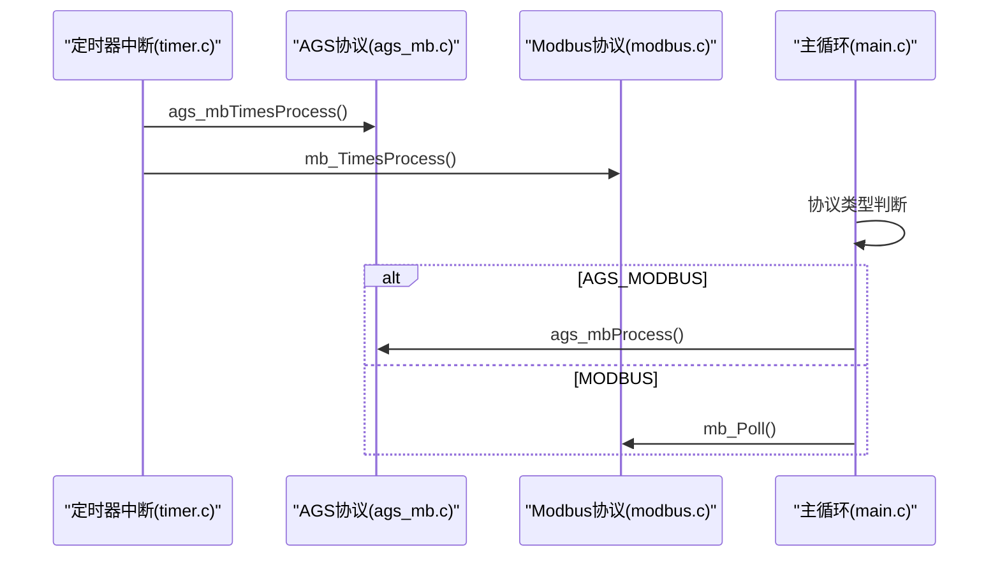
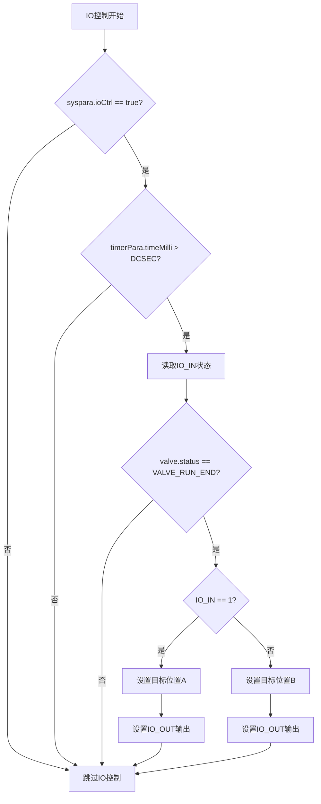
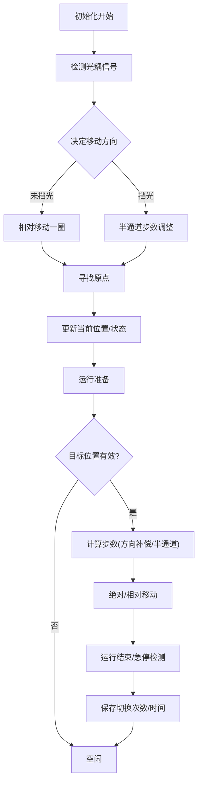
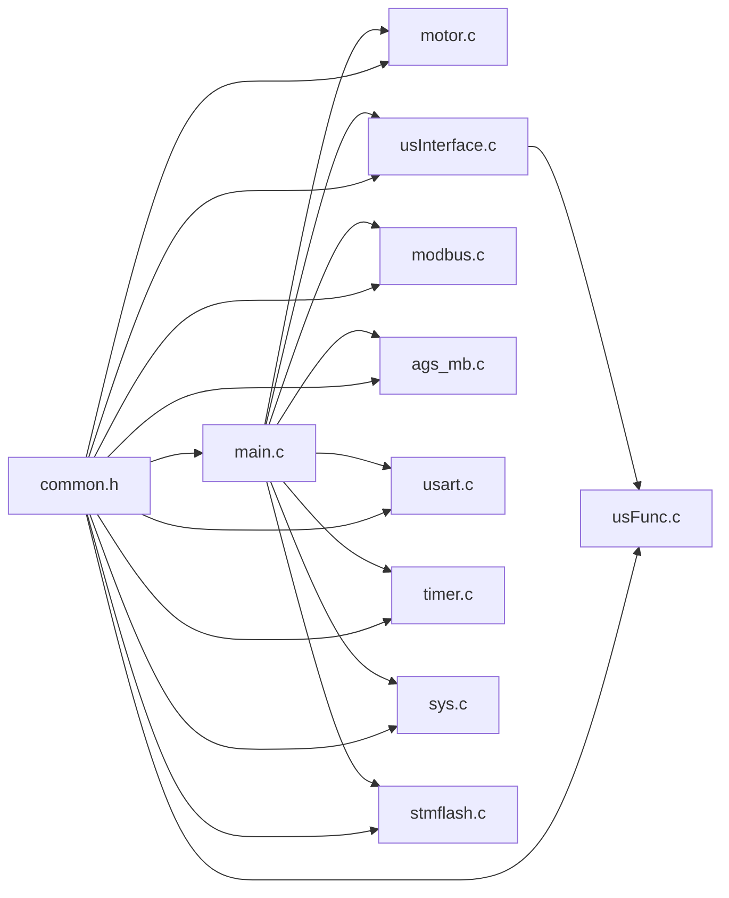

# 应用层开发

<cite>
**本文档引用的文件**
- [main.c](file://SRC/APP/main.c)
- [main.h](file://SRC/APP/main.h)
- [common.h](file://SRC/APP/common.h)
- [app.h](file://SRC/APP/app.h)
- [motor.c](file://SRC/HARDWARE/motor/motor.c)
- [usInterface.c](file://SRC/HARDWARE/usinterface/usInterface.c)
- [usFunc.c](file://SRC/HARDWARE/usinterface/usFunc.c)
- [modbus.c](file://SRC/HARDWARE/modbus/modbus.c)
- [ags_mb.c](file://SRC/HARDWARE/ags_mb/ags_mb.c)
- [timer.c](file://SRC/SYSTEM/timer/timer.c)
- [sys.c](file://SRC/SYSTEM/sys/sys.c)
- [usart.c](file://SRC/SYSTEM/usart/usart.c)
- [stmflash.c](file://SRC/HARDWARE/stmFlash/stmflash.c)
- [QHF.uvprojx](file://USER/QHF.uvprojx)
</cite>

## 更新摘要
**变更内容**
- 新增IO控制逻辑封装函数io_Ctrl_Process()，替代原有直接全局变量访问
- 改善代码组织和可维护性，统一IO控制处理流程
- 优化EveryHSec()函数中的IO控制调用，提升代码可读性

## 目录
1. [简介](#简介)
2. [项目结构](#项目结构)
3. [核心组件](#核心组件)
4. [架构总览](#架构总览)
5. [详细组件分析](#详细组件分析)
6. [依赖关系分析](#依赖关系分析)
7. [性能考虑](#性能考虑)
8. [故障排查指南](#故障排查指南)
9. [结论](#结论)
10. [附录](#附录)

## 简介
本文件面向应用层开发者，系统性梳理通用开关器项目的应用层架构与开发要点，覆盖主程序结构、系统初始化流程、参数读取与硬件检测、协议栈初始化、主循环与任务调度、事件处理机制（中断与轮询）、扩展与定制方法、调试与测试接口使用，以及实用编程指南与最佳实践。

## 项目结构
项目采用分层与按功能域组织的结构：
- APP层：应用入口与系统初始化、主循环、参数管理、调试输出与IO控制
- SYSTEM层：系统时钟、NVIC、定时器、串口、延时等底层支撑
- HARDWARE层：电机控制、EEPROM、Modbus/AGS协议栈、用户串口交互
- 3rd-party：第三方日志与工具库
- USER：Keil工程配置与构建选项

```mermaid
graph TB
subgraph "应用层(APP)"
MAIN["main.c<br/>应用入口/主循环"]
COMMON["common.h<br/>全局宏/类型/包含"]
APPH["app.h<br/>应用寄存器/命令定义"]
MAINH["main.h<br/>版本/地址/枚举/全局变量"]
END
subgraph "系统层(SYSTEM)"
TIMER["timer.c<br/>定时器/中断"]
SYS["sys.c<br/>NVIC/向量表/复位"]
USART["usart.c<br/>串口/中断"]
END
subgraph "硬件层(HARDWARE)"
MOTOR["motor.c<br/>阀门初始化/运行/老化"]
USIF["usInterface.c<br/>用户串口接口/命令解析"]
USFUNC["usFunc.c<br/>用户命令实现"]
MODBUS["modbus.c<br/>Modbus协议栈"]
AGS["ags_mb.c<br/>AGS协议栈"]
STMFLASH["stmflash.c<br/>Flash读写"]
END
COMMON --> MAIN
COMMON --> MOTOR
COMMON --> USIF
COMMON --> USFUNC
COMMON --> MODBUS
COMMON --> AGS
COMMON --> USART
COMMON --> TIMER
COMMON --> SYS
COMMON --> STMFLASH
MAIN --> MOTOR
MAIN --> USIF
MAIN --> MODBUS
MAIN --> AGS
MAIN --> USART
MAIN --> TIMER
MAIN --> SYS
MAIN --> STMFLASH
```

**图表来源**
- [main.c:433-494](file://SRC/APP/main.c#L433-L494)
- [common.h:155-169](file://SRC/APP/common.h#L155-L169)
- [motor.c:73-351](file://SRC/HARDWARE/motor/motor.c#L73-L351)
- [usInterface.c:1-141](file://SRC/HARDWARE/usinterface/usInterface.c#L1-L141)
- [usFunc.c:753-778](file://SRC/HARDWARE/usinterface/usFunc.c#L753-L778)
- [modbus.c:35-67](file://SRC/HARDWARE/modbus/modbus.c#L35-L67)
- [ags_mb.c:7-73](file://SRC/HARDWARE/ags_mb/ags_mb.c#L7-L73)
- [timer.c:11-19](file://SRC/SYSTEM/timer/timer.c#L11-L19)
- [sys.c:8-49](file://SRC/SYSTEM/sys/sys.c#L8-L49)
- [usart.c:38-66](file://SRC/SYSTEM/usart/usart.c#L38-L66)

**章节来源**
- [main.c:433-494](file://SRC/APP/main.c#L433-L494)
- [common.h:155-169](file://SRC/APP/common.h#L155-L169)

## 核心组件
- 应用入口与主循环：系统时钟与外设初始化、协议栈初始化、参数读取与校验、主循环调度与事件处理
- 电机与阀门控制：初始化、寻位、运行、急停、老化模式
- 用户串口交互：命令解析、参数读写、点检模式、调试输出
- 协议栈：AGS协议与Modbus协议的初始化、接收/发送、错误处理、轮询处理
- 系统时钟与中断：定时器中断、串口中断、NVIC优先级配置
- 参数持久化：EEPROM/Flash读写与版本兼容
- **IO控制封装**：新增io_Ctrl_Process()函数统一处理IO控制逻辑，替代直接全局变量访问

**章节来源**
- [main.c:433-494](file://SRC/APP/main.c#L433-L494)
- [main.c:69-137](file://SRC/APP/main.c#L69-L137)
- [motor.c:73-351](file://SRC/HARDWARE/motor/motor.c#L73-L351)
- [usInterface.c:79-106](file://SRC/HARDWARE/usinterface/usInterface.c#L79-L106)
- [usFunc.c:753-778](file://SRC/HARDWARE/usinterface/usFunc.c#L753-L778)
- [modbus.c:35-67](file://SRC/HARDWARE/modbus/modbus.c#L35-L67)
- [ags_mb.c:7-73](file://SRC/HARDWARE/ags_mb/ags_mb.c#L7-L73)
- [timer.c:22-42](file://SRC/SYSTEM/timer/timer.c#L22-L42)
- [sys.c:15-49](file://SRC/SYSTEM/sys/sys.c#L15-L49)
- [usart.c:138-151](file://SRC/SYSTEM/usart/usart.c#L138-L151)

## 架构总览
应用层以main.c为核心，贯穿系统初始化、参数读取、协议栈初始化、主循环调度与事件处理。系统时钟与NVIC在sys.c中配置，定时器在timer.c中产生1ms节拍，串口在usart.c中负责通信中断，motor.c负责阀门动作，usInterface.c与usFunc.c提供用户调试接口，ags_mb.c与modbus.c提供通信协议栈。

```mermaid
sequenceDiagram
participant Boot as "系统启动"
participant Sys as "系统初始化(sys.c/timer.c)"
participant App as "应用入口(main.c)"
participant Para as "参数读取/校验"
participant Proto as "协议栈初始化"
participant Loop as "主循环"
participant ISR as "中断服务(timer/uart)"
Boot->>Sys : 配置时钟/NVIC/定时器
Sys-->>App : 初始化完成
App->>Para : 读取EEPROM参数/校验
Para-->>App : 参数就绪
App->>Proto : 初始化AGS/Modbus
Proto-->>Loop : 协议栈就绪
Loop->>ISR : 定时器1ms节拍
Loop->>Loop : InitValve()/ProcessValve()
Loop->>Loop : 协议栈轮询
Loop->>Loop : io_Ctrl_Process() (新增)
ISR-->>Loop : 串口中断/定时器中断
```

**图表来源**
- [sys.c:152-172](file://SRC/SYSTEM/sys/sys.c#L152-L172)
- [timer.c:11-19](file://SRC/SYSTEM/timer/timer.c#L11-L19)
- [main.c:433-494](file://SRC/APP/main.c#L433-L494)
- [main.c:69-137](file://SRC/APP/main.c#L69-L137)
- [motor.c:73-351](file://SRC/HARDWARE/motor/motor.c#L73-L351)
- [usart.c:138-151](file://SRC/SYSTEM/usart/usart.c#L138-L151)

## 详细组件分析

### 主程序结构与系统初始化
- 系统时钟与外设：设置系统时钟、JTAG配置、串口1调试输出、I2C、定时器、电机驱动配置、IO配置
- 协议栈选择：根据EEPROM中协议类型初始化AGS或Modbus
- 参数初始化：读取EEPROM参数，若首次使用则写入默认值；根据减速比计算步进电机参数
- 主循环：初始化阀门、处理阀门、协议栈轮询、每秒超时检测、调试输出、老化模式、LED闪烁



**图表来源**
- [main.c:433-494](file://SRC/APP/main.c#L433-L494)
- [main.c:222-429](file://SRC/APP/main.c#L222-L429)
- [main.c:478-493](file://SRC/APP/main.c#L478-L493)

**章节来源**
- [main.c:433-494](file://SRC/APP/main.c#L433-L494)
- [main.c:222-429](file://SRC/APP/main.c#L222-L429)

### 参数读取与硬件检测
- 参数来源：EEPROM地址映射定义在main.h中，包含地址、波特率、速度、通道数、原点/方向补偿、IO控制、老化间隔、电流设置、序列号、减速比、半通道、切换次数、回复方式、协议类型、老化次数、模式等
- 参数读取：ParameterInit()按地址段读取并校验，越界则写默认值；根据减速比计算步进电机参数
- 硬件检测：EveryHSec()每秒执行，检测运行超时、初始化超时、切换次数保存、IO控制灯状态输出（特定版本）

**章节来源**
- [main.h:127-189](file://SRC/APP/main.h#L127-L189)
- [main.c:222-429](file://SRC/APP/main.c#L222-L429)
- [main.c:69-202](file://SRC/APP/main.c#L69-L202)

### 协议栈初始化与轮询
- AGS协议：ags_mbInit()初始化USART2/3与定时器，设置默认地址、运行状态、缓冲区
- Modbus协议：mb_Init()初始化USART2/3与定时器，设置默认地址、运行状态、保持寄存器
- 轮询处理：定时器中断中调用ags_mbTimesProcess()/mb_TimesProcess()进行帧超时检测；主循环中调用ags_mbProcess()/mb_Poll()进行数据帧解析与响应



**图表来源**
- [timer.c:62-73](file://SRC/SYSTEM/timer/timer.c#L62-L73)
- [ags_mb.c:75-94](file://SRC/HARDWARE/ags_mb/ags_mb.c#L75-L94)
- [modbus.c:72-91](file://SRC/HARDWARE/modbus/modbus.c#L72-L91)
- [main.c:482-487](file://SRC/APP/main.c#L482-L487)

**章节来源**
- [ags_mb.c:7-73](file://SRC/HARDWARE/ags_mb/ags_mb.c#L7-L73)
- [modbus.c:35-67](file://SRC/HARDWARE/modbus/modbus.c#L35-L67)
- [timer.c:62-73](file://SRC/SYSTEM/timer/timer.c#L62-L73)
- [main.c:482-487](file://SRC/APP/main.c#L482-L487)

### 主循环逻辑与任务调度
- 任务顺序：InitValve() -> ProcessValve() -> 协议栈轮询 -> 每秒超时检测 -> 调试输出 -> 老化模式 -> LED闪烁
- 优先级：定时器1ms节拍为最高优先级，保证协议栈超时检测与计时精度；协议栈轮询在主循环中进行，避免阻塞；LED闪烁与调试输出在较低优先级时间片执行
- 关键状态：valve.status、syspara.protectTimeOut、syspara.lastTime、syspara.bCountLastTime等

**章节来源**
- [main.c:478-493](file://SRC/APP/main.c#L478-L493)
- [motor.c:73-351](file://SRC/HARDWARE/motor/motor.c#L73-L351)
- [timer.c:22-42](file://SRC/SYSTEM/timer/timer.c#L22-L42)

### 事件处理机制：中断与轮询
- 中断源：
  - 定时器2：1ms节拍，更新计时器、切换时间计时、超时保护计时、LED闪烁节拍
  - 定时器3：协议栈帧超时检测
  - 串口2/3：接收中断，调用协议栈接收处理函数
- 轮询机制：
  - 主循环中协议栈轮询处理，避免阻塞
  - 用户串口命令解析在定时器中断中触发

**章节来源**
- [timer.c:22-42](file://SRC/SYSTEM/timer/timer.c#L22-L42)
- [timer.c:62-73](file://SRC/SYSTEM/timer/timer.c#L62-L73)
- [usart.c:138-151](file://SRC/SYSTEM/usart/usart.c#L138-L151)
- [usInterface.c:79-106](file://SRC/HARDWARE/usinterface/usInterface.c#L79-L106)

### IO控制逻辑封装与改进
**更新** 新增io_Ctrl_Process()函数统一处理IO控制逻辑，替代原有的直接全局变量访问，提升代码组织性和可维护性。

- **封装的IO控制逻辑**：
  - 条件检查：仅在syspara.ioCtrl为true时执行IO控制
  - 时间节拍：每DCSEC毫秒执行一次IO状态检测
  - 输入检测：根据IO_IN状态判断AI信号电平
  - 目标位置控制：根据当前阀门状态和位置设置目标位置
  - 输出控制：根据IO_RS宏和硬件版本设置IO_OUT电平

- **集成到主循环**：
  - EveryHSec()函数中调用io_Ctrl_Process()统一处理IO控制
  - 保持原有功能不变，但代码结构更加清晰



**图表来源**
- [main.c:69-137](file://SRC/APP/main.c#L69-L137)
- [main.c:142-207](file://SRC/APP/main.c#L142-L207)

**章节来源**
- [main.c:69-137](file://SRC/APP/main.c#L69-L137)
- [main.c:142-207](file://SRC/APP/main.c#L142-L207)

### 电机与阀门控制
- 初始化：根据光耦信号决定移动方向，寻找原点，半通道处理，更新当前位置
- 运行：根据目标位置计算步数，相对/绝对移动，急停检测，切换次数统计
- 老化模式：定时切换A/B位置，记录老化次数



**图表来源**
- [motor.c:73-351](file://SRC/HARDWARE/motor/motor.c#L73-L351)

**章节来源**
- [motor.c:73-351](file://SRC/HARDWARE/motor/motor.c#L73-L351)

### 用户串口交互与调试接口
- 用户串口接口：usInterface.c提供命令接收、超时处理、字符串处理
- 用户命令实现：usFunc.c提供版本、IIC、复位、地址、通道数、位置、波特率、速度、IO、间隔、电流、减速比、半通道、切换次数、点检、回复方式、协议等命令
- 调试输出：DebugOut()按周期输出状态信息；ErrBlink()控制LED闪烁

**章节来源**
- [usInterface.c:15-106](file://SRC/HARDWARE/usinterface/usInterface.c#L15-L106)
- [usFunc.c:753-778](file://SRC/HARDWARE/usinterface/usFunc.c#L753-L778)
- [main.c:496-510](file://SRC/APP/main.c#L496-L510)
- [main.c:512-519](file://SRC/APP/main.c#L512-L519)

### 参数持久化与版本兼容
- EEPROM/Flash：通过I2C与Flash接口读写参数，支持版本兼容与默认值写入
- 版本信息：main.h定义版本号、修订号、软件名称、硬件描述等

**章节来源**
- [main.h:12-100](file://SRC/APP/main.h#L12-L100)
- [stmflash.c:122-172](file://SRC/HARDWARE/stmFlash/stmflash.c#L122-L172)

## 依赖关系分析
应用层各模块之间的依赖关系如下：



**图表来源**
- [common.h:155-169](file://SRC/APP/common.h#L155-L169)
- [main.c:433-494](file://SRC/APP/main.c#L433-L494)
- [motor.c:73-351](file://SRC/HARDWARE/motor/motor.c#L73-L351)
- [usInterface.c:1-141](file://SRC/HARDWARE/usinterface/usInterface.c#L1-L141)
- [usFunc.c:753-778](file://SRC/HARDWARE/usinterface/usFunc.c#L753-L778)
- [modbus.c:35-67](file://SRC/HARDWARE/modbus/modbus.c#L35-L67)
- [ags_mb.c:7-73](file://SRC/HARDWARE/ags_mb/ags_mb.c#L7-L73)
- [usart.c:38-66](file://SRC/SYSTEM/usart/usart.c#L38-L66)
- [timer.c:11-19](file://SRC/SYSTEM/timer/timer.c#L11-L19)
- [sys.c:15-49](file://SRC/SYSTEM/sys/sys.c#L15-L49)
- [stmflash.c:122-172](file://SRC/HARDWARE/stmFlash/stmflash.c#L122-L172)

**章节来源**
- [common.h:155-169](file://SRC/APP/common.h#L155-L169)

## 性能考虑
- 定时器节拍：1ms定时器保证协议栈与状态检测的实时性
- 协议栈轮询：在主循环中进行，避免阻塞；协议栈内部使用超时检测避免长时间占用
- 通信波特率：支持9600/19200/38400，根据需求选择；定时器周期与波特率相关
- 电机控制：加减速曲线与步进电机细分配合，提升运行稳定性
- 调试输出：按周期输出，避免频繁打印影响实时性
- **IO控制优化**：io_Ctrl_Process()函数统一处理IO控制逻辑，减少重复代码，提升执行效率

## 故障排查指南
- 通信异常：
  - 检查波特率设置与实际波特率匹配
  - 查看协议栈错误码与CRC校验
  - 确认串口接收中断使能与NVIC优先级
- 电机不动作：
  - 检查电机使能引脚与方向/时钟信号
  - 确认初始化步骤与原点寻找逻辑
  - 核对减速比与速度参数
- 参数异常：
  - 使用点检命令查看参数
  - 检查EEPROM写入权限与地址范围
- 超时保护：
  - 检查超时计时与保护逻辑
  - 确认LED闪烁节拍与错误状态
- **IO控制异常**：
  - 检查syspara.ioCtrl参数设置
  - 验证IO_IN输入信号状态
  - 确认IO_OUT输出电平与硬件版本匹配

**章节来源**
- [modbus.c:167-186](file://SRC/HARDWARE/modbus/modbus.c#L167-L186)
- [ags_mb.c:159-179](file://SRC/HARDWARE/ags_mb/ags_mb.c#L159-L179)
- [usart.c:138-151](file://SRC/SYSTEM/usart/usart.c#L138-L151)
- [motor.c:353-463](file://SRC/HARDWARE/motor/motor.c#L353-L463)
- [main.c:180-202](file://SRC/APP/main.c#L180-L202)
- [main.c:69-137](file://SRC/APP/main.c#L69-L137)

## 结论
本应用层以清晰的初始化流程、稳定的主循环调度、完善的事件处理机制为基础，结合AGS/Modbus协议栈与电机控制，实现了可靠的阀门开关功能。通过参数持久化与版本兼容设计，便于部署与维护。新增的io_Ctrl_Process()函数进一步提升了代码组织性和可维护性，开发者可在现有框架上按需扩展新功能或修改既有行为。

## 附录

### 应用扩展与定制指南
- 新增协议支持：
  - 参考AGS/Modbus协议栈初始化与轮询流程，在main.c中增加协议类型判断与初始化调用
  - 在common.h中定义协议枚举与相关参数
- 新增用户命令：
  - 在usFunc.c中新增命令函数与参数解析
  - 在usInterface.c中完善命令列表与帮助信息
- 修改参数项：
  - 在main.h中新增EEPROM地址与长度定义
  - 在ParameterInit()中读取/写入新参数
- 调整电机控制策略：
  - 在motor.c中修改InitValve()/ProcessValve()逻辑
  - 调整加减速参数与保护逻辑
- **IO控制扩展**：
  - 通过io_Ctrl_Process()函数统一处理新的IO控制需求
  - 在main.h中定义新的IO控制参数
  - 在ParameterInit()中添加新参数的读取与默认值设置

**章节来源**
- [main.h:127-189](file://SRC/APP/main.h#L127-L189)
- [main.c:222-429](file://SRC/APP/main.c#L222-L429)
- [usFunc.c:753-778](file://SRC/HARDWARE/usinterface/usFunc.c#L753-L778)
- [motor.c:73-351](file://SRC/HARDWARE/motor/motor.c#L73-L351)
- [main.c:69-137](file://SRC/APP/main.c#L69-L137)

### 调试与测试接口使用
- 点检模式：通过INSP命令打印版本、地址、通道数、波特率、速度、减速比、半通道、原点/方向补偿、IO控制、电流、切换次数、回复方式、序列号等关键参数
- IIC测试：通过IIC命令读写EEPROM，验证存储功能
- 复位与老化：通过RST命令复位，老化模式下自动切换A/B位置
- 调试输出：通过DebugOut()周期输出状态，ErrBlink()指示错误状态
- **IO控制测试**：通过INSP命令查看IO控制参数状态，验证io_Ctrl_Process()函数执行效果

**章节来源**
- [usFunc.c:644-671](file://SRC/HARDWARE/usinterface/usFunc.c#L644-L671)
- [usFunc.c:70-110](file://SRC/HARDWARE/usinterface/usFunc.c#L70-L110)
- [usFunc.c:116-123](file://SRC/HARDWARE/usinterface/usFunc.c#L116-L123)
- [main.c:496-519](file://SRC/APP/main.c#L496-L519)
- [main.c:69-137](file://SRC/APP/main.c#L69-L137)

### 实用编程指南与最佳实践
- 初始化顺序：严格遵循时钟、外设、协议、参数的初始化顺序
- 中断优先级：定时器中断优先级高于串口中断，避免协议栈超时丢失
- 参数边界：所有参数读写均需进行边界检查与默认值处理
- 错误处理：协议栈错误码与LED闪烁相结合，快速定位问题
- 代码风格：使用common.h集中管理宏与包含，避免分散定义
- **IO控制封装**：通过io_Ctrl_Process()函数统一处理IO控制逻辑，提升代码可维护性
- **模块化设计**：将复杂的IO控制逻辑封装到独立函数中，便于测试和维护

**章节来源**
- [sys.c:15-49](file://SRC/SYSTEM/sys/sys.c#L15-L49)
- [timer.c:22-42](file://SRC/SYSTEM/timer/timer.c#L22-L42)
- [main.c:222-429](file://SRC/APP/main.c#L222-L429)
- [modbus.c:167-186](file://SRC/HARDWARE/modbus/modbus.c#L167-L186)
- [ags_mb.c:159-179](file://SRC/HARDWARE/ags_mb/ags_mb.c#L159-L179)
- [main.c:69-137](file://SRC/APP/main.c#L69-L137)