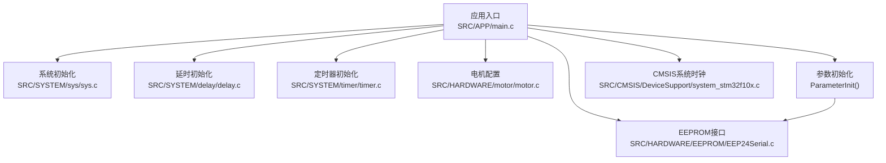
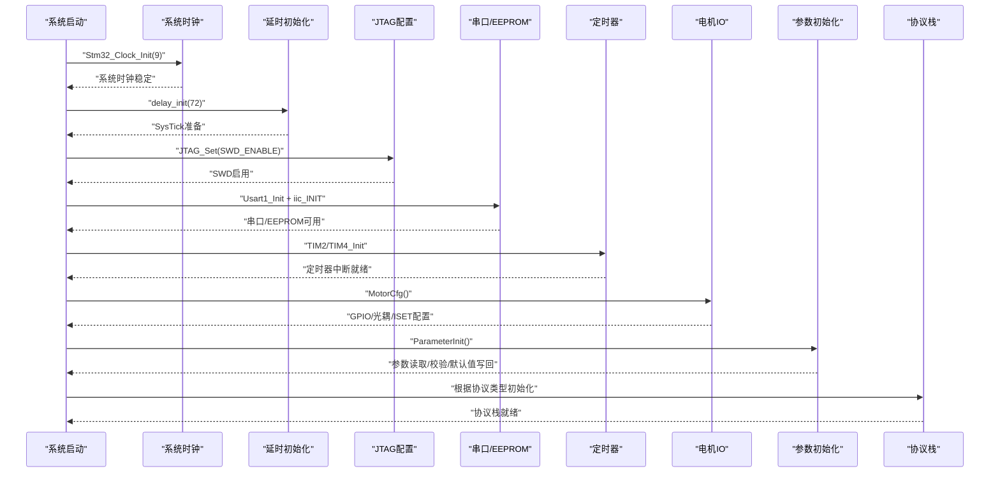
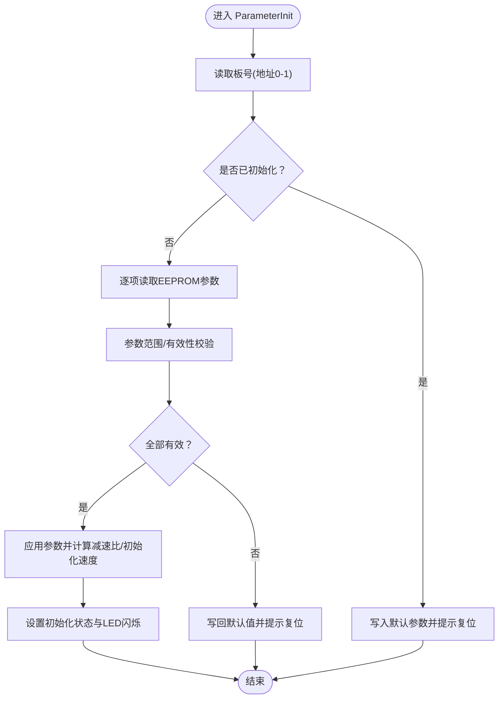
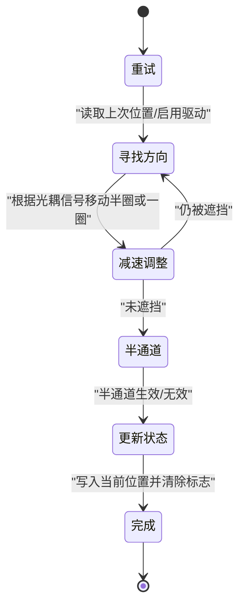
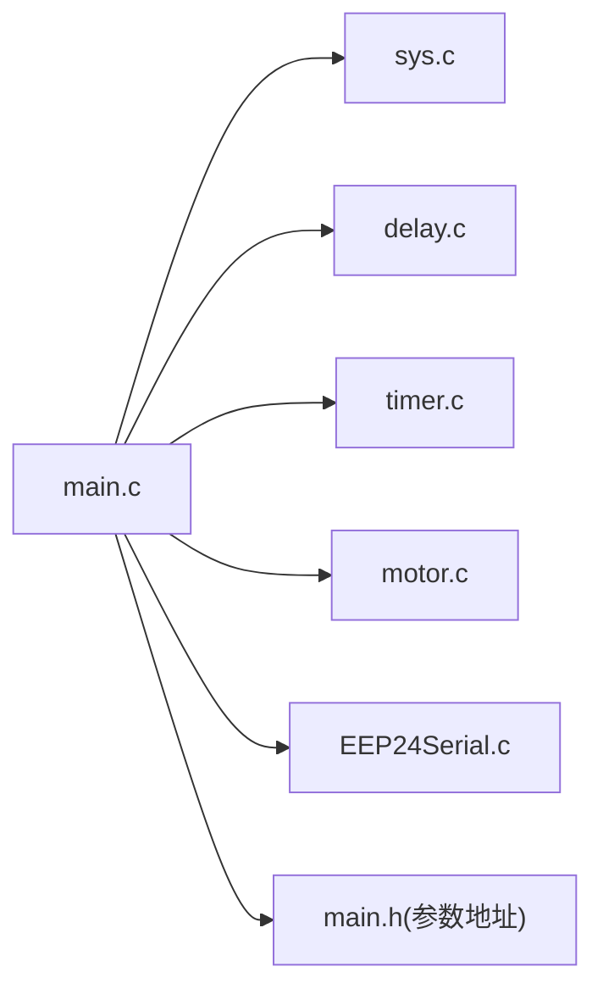

# 系统初始化流程

<cite>
**本文引用的文件**
- [SRC/APP/main.c](file://SRC/APP/main.c)
- [SRC/APP/main.h](file://SRC/APP/main.h)
- [SRC/SYSTEM/sys/sys.c](file://SRC/SYSTEM/sys/sys.c)
- [SRC/SYSTEM/delay/delay.c](file://SRC/SYSTEM/delay/delay.c)
- [SRC/SYSTEM/timer/timer.c](file://SRC/SYSTEM/timer/timer.c)
- [SRC/HARDWARE/motor/motor.c](file://SRC/HARDWARE/motor/motor.c)
- [SRC/HARDWARE/EEPROM/EEP24Serial.c](file://SRC/HARDWARE/EEPROM/EEP24Serial.c)
- [SRC/HARDWARE/stmFlash/stmflash.c](file://SRC/HARDWARE/stmFlash/stmflash.c)
- [SRC/CMSIS/DeviceSupport/system_stm32f10x.c](file://SRC/CMSIS/DeviceSupport/system_stm32f10x.c)
- [SRC/CMSIS/CoreSupport/core_cm3.c](file://SRC/CMSIS/CoreSupport/core_cm3.c)
- [USER/DebugConfig/A_901_STM32F103C8_1.0.0.dbgconf](file://USER/DebugConfig/A_901_STM32F103C8_1.0.0.dbgconf)
- [USER/DebugConfig/B_901_STM32F103C8_1.0.0.dbgconf](file://USER/DebugConfig/B_901_STM32F103C8_1.0.0.dbgconf)
- [USER/DebugConfig/C_901_STM32F103C8_1.0.0.dbgconf](file://USER/DebugConfig/C_901_STM32F103C8_1.0.0.dbgconf)
</cite>

## 目录
1. [简介](#简介)
2. [项目结构](#项目结构)
3. [核心组件](#核心组件)
4. [架构总览](#架构总览)
5. [详细组件分析](#详细组件分析)
6. [依赖关系分析](#依赖关系分析)
7. [性能考量](#性能考量)
8. [故障排查指南](#故障排查指南)
9. [结论](#结论)
10. [附录](#附录)

## 简介
本文件围绕通用开关器项目的“系统初始化流程”展开，重点解析 ParameterInit 参数初始化函数的工作机制，涵盖以下方面：
- EEPROM 参数读取、参数验证与默认值设置
- 硬件检测与配置（含不同硬件版本差异）
- 系统时钟、外设初始化、中断配置等底层设置
- 参数初始化失败处理与错误恢复策略
- JTAG 配置、延时初始化、定时器配置等系统级设置的作用与实现原理
- 提供参数初始化的流程图与状态转换图

## 项目结构
项目采用分层组织，核心初始化流程集中在应用入口与系统支撑层：
- 应用层：main.c/main.h（主循环、参数初始化、协议栈选择）
- 系统层：sys.c（NVIC/中断/向量表）、delay.c（SysTick延时）、timer.c（通用定时器）
- 硬件抽象层：motor.c（步进电机IO与初始化）、EEPROM/EEP24Serial.c（I²C EEPROM访问）
- 设备支撑层：CMSIS（system_stm32f10x.c、core_cm3.c）

图表来源
- [SRC/APP/main.c:433-494](file://SRC/APP/main.c#L433-L494)
- [SRC/SYSTEM/sys/sys.c:150-172](file://SRC/SYSTEM/sys/sys.c#L150-L172)
- [SRC/SYSTEM/delay/delay.c:23-42](file://SRC/SYSTEM/delay/delay.c#L23-L42)
- [SRC/SYSTEM/timer/timer.c:11-19](file://SRC/SYSTEM/timer/timer.c#L11-L19)
- [SRC/HARDWARE/motor/motor.c:4-68](file://SRC/HARDWARE/motor/motor.c#L4-L68)
- [SRC/HARDWARE/EEPROM/EEP24Serial.c:35-59](file://SRC/HARDWARE/EEPROM/EEP24Serial.c#L35-L59)

章节来源
- [SRC/APP/main.c:433-494](file://SRC/APP/main.c#L433-L494)
- [SRC/APP/main.h:127-189](file://SRC/APP/main.h#L127-L189)

## 核心组件
- 系统时钟初始化：Stm32_Clock_Init（设置PLL、HSE、AHB/APB分频、FLASH等待周期）
- 延时初始化：delay_init（基于SysTick，配置fac_us/fac_ms）
- 中断与NVIC：MY_NVIC_Init（分组、抢占优先级、响应优先级、使能中断）
- 定时器初始化：TIM2/TIM3/TIM4（10kHz计数频率，中断服务更新系统时间）
- EEPROM接口：I2CPageRead_Nbytes/I2CPageWrite_Nbytes（I²C EEPROM页写/读）
- 电机IO配置：MotorCfg（GPIO初始化、ISET引脚、光耦输入）
- 参数初始化：ParameterInit（EEPROM参数读取、验证、默认值写回、减速比计算、初始化速度赋值）

章节来源
- [SRC/SYSTEM/sys/sys.c:150-172](file://SRC/SYSTEM/sys/sys.c#L150-L172)
- [SRC/SYSTEM/delay/delay.c:23-42](file://SRC/SYSTEM/delay/delay.c#L23-L42)
- [SRC/SYSTEM/timer/timer.c:11-19](file://SRC/SYSTEM/timer/timer.c#L11-L19)
- [SRC/HARDWARE/EEPROM/EEP24Serial.c:95-200](file://SRC/HARDWARE/EEPROM/EEP24Serial.c#L95-L200)
- [SRC/HARDWARE/motor/motor.c:4-68](file://SRC/HARDWARE/motor/motor.c#L4-L68)
- [SRC/APP/main.c:222-429](file://SRC/APP/main.c#L222-L429)

## 架构总览
系统初始化顺序与职责：
- 系统启动后依次执行：系统时钟 → 延时 → JTAG配置（SWD）→ 串口/EEPROM → 定时器 → 电机IO → 参数初始化 → 协议栈初始化 → 主循环
- 参数初始化贯穿EEPROM读取、参数合法性校验、必要时写回默认值，并据此计算减速比与初始化速度

图表来源
- [SRC/APP/main.c:433-473](file://SRC/APP/main.c#L433-L473)
- [SRC/SYSTEM/sys/sys.c:150-172](file://SRC/SYSTEM/sys/sys.c#L150-L172)
- [SRC/SYSTEM/delay/delay.c:23-42](file://SRC/SYSTEM/delay/delay.c#L23-L42)
- [SRC/SYSTEM/timer/timer.c:11-19](file://SRC/SYSTEM/timer/timer.c#L11-L19)
- [SRC/HARDWARE/motor/motor.c:4-68](file://SRC/HARDWARE/motor/motor.c#L4-L68)
- [SRC/HARDWARE/EEPROM/EEP24Serial.c:35-59](file://SRC/HARDWARE/EEPROM/EEP24Serial.c#L35-L59)

## 详细组件分析

### 参数初始化（ParameterInit）机制
ParameterInit 的核心职责：
- 通过 EEPROM 读取板号以判断是否首次初始化
- 若非首次：读取系统参数并进行范围/有效性校验；越界则写回默认值
- 若首次：写入默认参数并提示复位
- 根据减速比计算单圈步数，按初始化速度配置电机加速/减速参数
- 设置阀门初始状态为“初始化中”，LED闪烁间隔为正常运行

关键步骤与验证要点：
- 板号识别：读取地址0-1，若为特定标记则认为已初始化
- 地址/波特率/速度/通道数/减速比/半通道/回复方式等参数均进行边界检查，越界则回退至默认值并写回EEPROM
- 电流设置（A12_901除外）：读取后立即应用到ISET引脚
- 减速比映射：根据减速比枚举值设置每度/每0.1度步数，并计算单圈步数
- 初始化速度：结合初始化速度与减速比计算运行速度、加速度、减速度

图表来源
- [SRC/APP/main.c:222-429](file://SRC/APP/main.c#L222-L429)
- [SRC/APP/main.h:127-189](file://SRC/APP/main.h#L127-L189)
- [SRC/HARDWARE/EEPROM/EEP24Serial.c:95-200](file://SRC/HARDWARE/EEPROM/EEP24Serial.c#L95-L200)

章节来源
- [SRC/APP/main.c:222-429](file://SRC/APP/main.c#L222-L429)
- [SRC/APP/main.h:127-189](file://SRC/APP/main.h#L127-L189)

### 硬件检测与配置（不同硬件版本）
- IO配置（IOconfig）：根据硬件版本宏（A12_901/906/909）配置PB1为RS485收发控制，以及不同版本的FB OUT/KEY IN/KEY OUT引脚
- 电机IO配置（MotorCfg）：根据硬件版本宏配置LED、光耦输入、步进电机控制引脚与ISET引脚
- IO控制模式：在A/B两种IO模式下，不同硬件版本的IO电平标准不同，影响复位与运行逻辑

章节来源
- [SRC/APP/main.c:12-67](file://SRC/APP/main.c#L12-L67)
- [SRC/HARDWARE/motor/motor.c:4-68](file://SRC/HARDWARE/motor/motor.c#L4-L68)
- [SRC/APP/main.h:110-125](file://SRC/APP/main.h#L110-L125)

### 系统时钟、外设与中断配置
- 系统时钟：Stm32_Clock_Init（HSE使能、PLL设置、AHB/APB分频、FLASH等待周期、系统时钟切换）
- 延时：delay_init（SysTick配置，fac_us/fac_ms计算）
- 中断：MY_NVIC_Init（分组、优先级、使能），MY_NVIC_PriorityGroupConfig（优先级分组）
- 定时器：TIM2（10kHz，1ms节拍）、TIM4（X轴脉冲定时器），TIM3（协议栈定时处理）
- 外部中断：EXTI_Init（PB9外部中断配置）

章节来源
- [SRC/SYSTEM/sys/sys.c:150-172](file://SRC/SYSTEM/sys/sys.c#L150-L172)
- [SRC/SYSTEM/delay/delay.c:23-42](file://SRC/SYSTEM/delay/delay.c#L23-L42)
- [SRC/SYSTEM/timer/timer.c:11-19](file://SRC/SYSTEM/timer/timer.c#L11-L19)
- [SRC/SYSTEM/timer/timer.c:51-73](file://SRC/SYSTEM/timer/timer.c#L51-L73)
- [SRC/SYSTEM/timer/timer.c:81-99](file://SRC/SYSTEM/timer/timer.c#L81-L99)
- [SRC/SYSTEM/timer/timer.c:197-206](file://SRC/SYSTEM/timer/timer.c#L197-L206)

### JTAG配置与调试
- JTAG_Set：通过AFIO_MAPR寄存器设置SWJ（JTAG/SWD）模式，启用SWD以释放JTAG引脚用于GPIO
- 调试配置文件：A/B/C版本的调试配置文件展示了DBGMCU_CR寄存器的调试停止行为设置

章节来源
- [SRC/SYSTEM/sys/sys.c:141-149](file://SRC/SYSTEM/sys/sys.c#L141-L149)
- [USER/DebugConfig/A_901_STM32F103C8_1.0.0.dbgconf:34](file://USER/DebugConfig/A_901_STM32F103C8_1.0.0.dbgconf#L34)
- [USER/DebugConfig/B_901_STM32F103C8_1.0.0.dbgconf:34](file://USER/DebugConfig/B_901_STM32F103C8_1.0.0.dbgconf#L34)
- [USER/DebugConfig/C_901_STM32F103C8_1.0.0.dbgconf:34](file://USER/DebugConfig/C_901_STM32F103C8_1.0.0.dbgconf#L34)

### EEPROM参数读取与写入
- I2CPageRead_Nbytes：实现随机读取，支持多字节连续读取与ACK/NACK处理
- I2CPageWrite_Nbytes：实现页写入，处理跨页写入与写入等待
- 地址布局：参数在EEPROM中的连续地址段，包含板号、地址、原点补偿、方向补偿、通道数、波特率、速度、IO控制、老化间隔、电流设置、序列号、减速比、半通道、切换次数、回复方式、初始化状态、协议类型、烧机次数、上帝模式等

章节来源
- [SRC/HARDWARE/EEPROM/EEP24Serial.c:95-200](file://SRC/HARDWARE/EEPROM/EEP24Serial.c#L95-L200)
- [SRC/HARDWARE/EEPROM/EEP24Serial.c:202-313](file://SRC/HARDWARE/EEPROM/EEP24Serial.c#L202-L313)
- [SRC/APP/main.h:127-189](file://SRC/APP/main.h#L127-L189)

### 参数初始化失败处理与错误恢复
- 参数越界：当参数超出允许范围（如波特率、速度、通道数、减速比等），写回默认值并提示复位
- 首次初始化：写入默认参数后强制复位，确保后续流程一致
- 电机初始化：初始化速度与加速度按减速比与设定速度计算，避免过快导致堵转
- 超时保护：定时器中断周期性更新保护计时，超时进入错误状态并关闭驱动

章节来源
- [SRC/APP/main.c:222-429](file://SRC/APP/main.c#L222-L429)
- [SRC/SYSTEM/timer/timer.c:22-42](file://SRC/SYSTEM/timer/timer.c#L22-L42)

### 状态转换图（阀门初始化）
阀门初始化状态机覆盖“重试、寻找方向、减速调整、半通道、更新状态、完成”等步骤，依据光耦信号与方向开关宏进行动作切换。

图表来源
- [SRC/HARDWARE/motor/motor.c:73-268](file://SRC/HARDWARE/motor/motor.c#L73-L268)

## 依赖关系分析
- main.c 依赖 sys.c（时钟/中断）、delay.c（SysTick）、timer.c（定时器/中断）、motor.c（GPIO）、EEPROM.c（I²C）
- 参数初始化依赖 EEPROM 地址布局定义（main.h）
- 定时器中断服务函数更新全局计时变量，驱动超时保护与周期任务

图表来源
- [SRC/APP/main.c:433-494](file://SRC/APP/main.c#L433-L494)
- [SRC/APP/main.h:127-189](file://SRC/APP/main.h#L127-L189)

章节来源
- [SRC/APP/main.c:433-494](file://SRC/APP/main.c#L433-L494)
- [SRC/APP/main.h:127-189](file://SRC/APP/main.h#L127-L189)

## 性能考量
- SysTick延时精度与OS集成：delay.c支持UCOS与非OS两种路径，非OS路径下延时受SysTick负载影响
- 定时器中断频率：TIM2/TIM4设置为10kHz，提供1ms节拍，兼顾实时性与CPU占用
- EEPROM写入等待：I2CPageWrite_Nbytes包含页写入等待与跨页延时，避免写入冲突
- 电机加速度/速度：初始化阶段采用较低速度与加速度，降低堵转风险

## 故障排查指南
- 参数读取异常：检查EEPROM地址与页大小、I2C时序与上拉电阻
- 参数越界复位：确认下载口设置范围（地址、波特率、速度、通道数、减速比、半通道、电流等）
- 初始化卡死：查看定时器中断是否触发、保护计时是否溢出、光耦信号是否异常
- IO控制不生效：核对硬件版本宏与IO电平标准，确认按键/反馈引脚配置
- JTAG/SWD冲突：确认JTAG_Set调用与调试器连接状态

章节来源
- [SRC/HARDWARE/EEPROM/EEP24Serial.c:95-200](file://SRC/HARDWARE/EEPROM/EEP24Serial.c#L95-L200)
- [SRC/SYSTEM/timer/timer.c:22-42](file://SRC/SYSTEM/timer/timer.c#L22-L42)
- [SRC/SYSTEM/sys/sys.c:141-149](file://SRC/SYSTEM/sys/sys.c#L141-L149)

## 结论
ParameterInit 通过EEPROM参数读取、严格验证与默认值回写，确保系统在不同硬件版本与参数环境下稳定运行。配合系统时钟、延时、定时器与中断的协同配置，形成可靠的底层基础。初始化失败与超时保护机制进一步提升了系统的鲁棒性。建议在开发与部署过程中：
- 严格遵循参数范围约束
- 在首次上电或更换硬件版本后执行完整参数写入流程
- 关注EEPROM写入时序与等待时间
- 合理配置JTAG/SWD与调试停止行为

## 附录
- EEPROM参数地址映射与长度定义见 main.h 中的地址常量
- Flash读写封装（STMFLASH）可用于固件升级场景（非参数存储）

章节来源
- [SRC/APP/main.h:127-189](file://SRC/APP/main.h#L127-L189)
- [SRC/HARDWARE/stmFlash/stmflash.c:1-199](file://SRC/HARDWARE/stmFlash/stmflash.c#L1-L199)