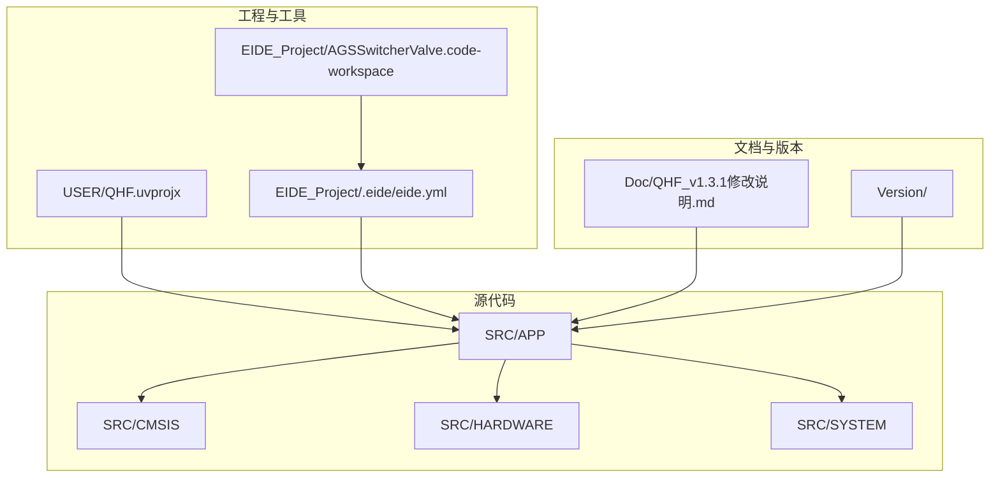
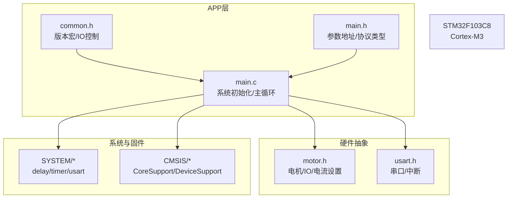
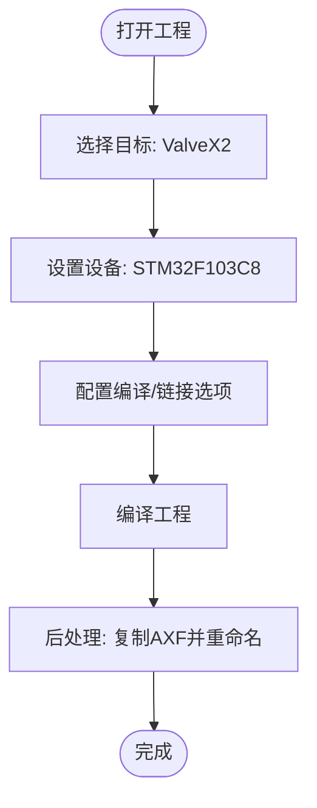
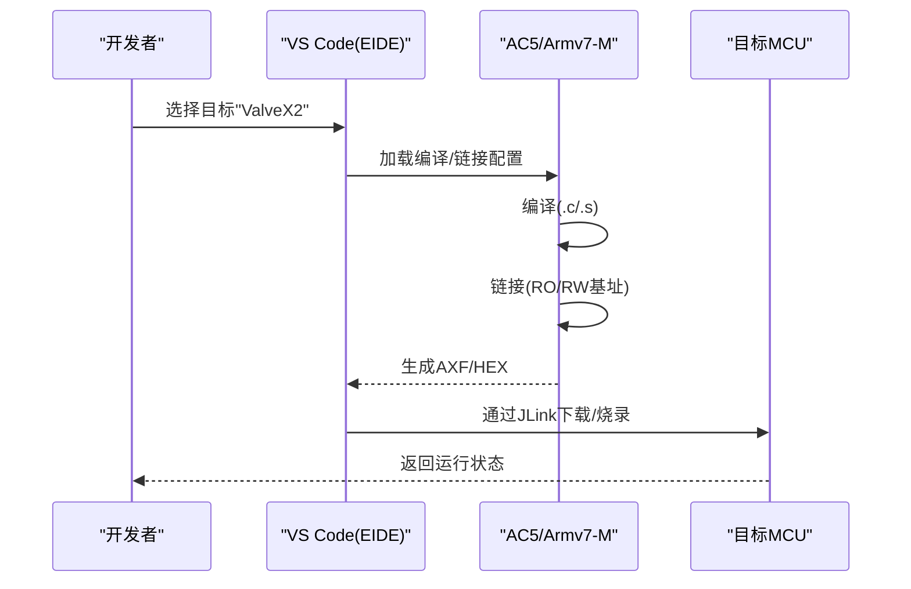
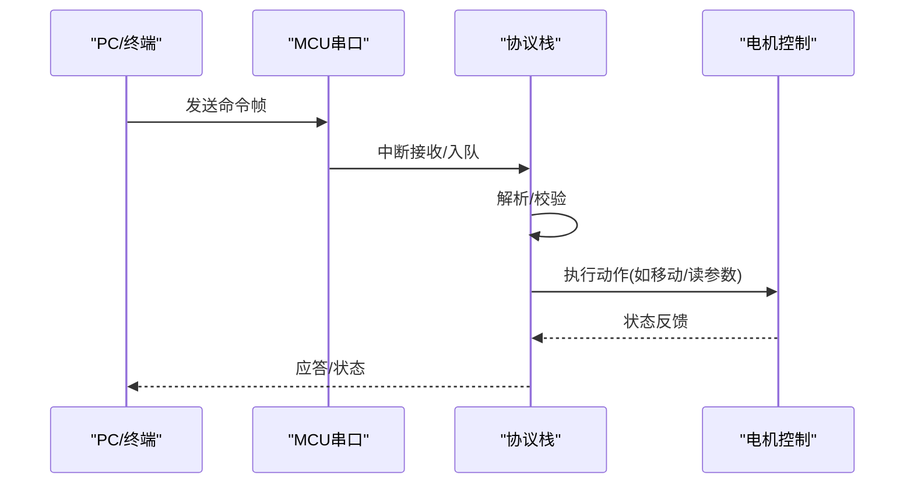
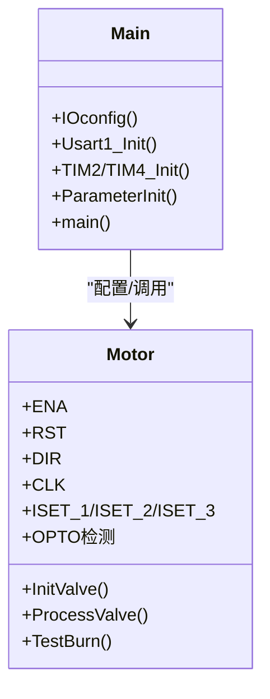
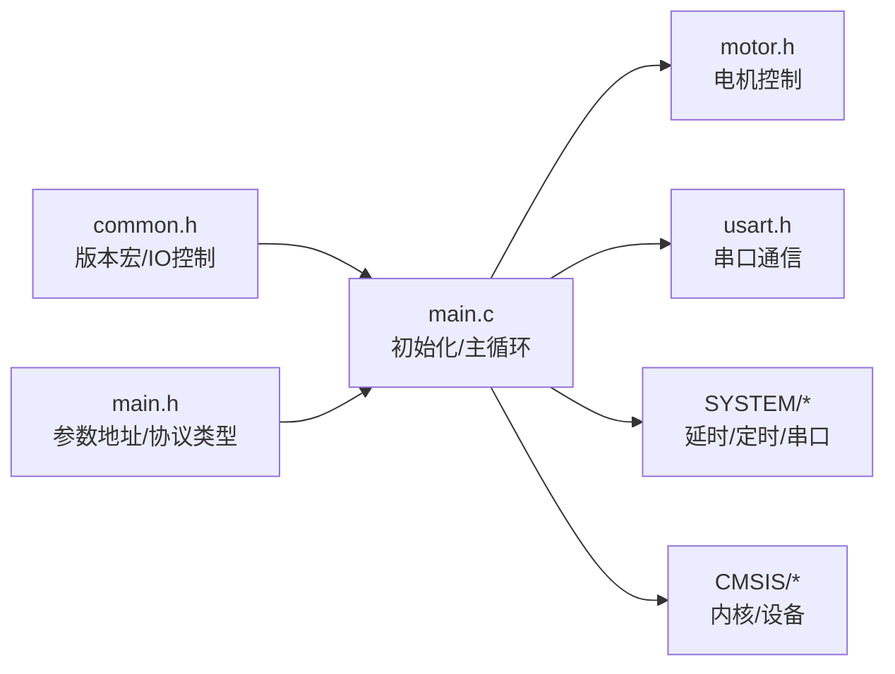

# 快速开始

<cite>
**本文引用的文件**
- [USER/QHF.uvprojx](file://USER/QHF.uvprojx)
- [EIDE_Project/.eide/eide.yml](file://EIDE_Project/.eide/eide.yml)
- [EIDE_Project/.eide/files.options.yml](file://EIDE_Project/.eide/files.options.yml)
- [EIDE_Project/AGSSwitcherValve.code-workspace](file://EIDE_Project/AGSSwitcherValve.code-workspace)
- [SRC/APP/main.c](file://SRC/APP/main.c)
- [SRC/APP/main.h](file://SRC/APP/main.h)
- [SRC/APP/common.h](file://SRC/APP/common.h)
- [SRC/HARDWARE/motor/motor.h](file://SRC/HARDWARE/motor/motor.h)
- [SRC/SYSTEM/usart/usart.h](file://SRC/SYSTEM/usart/usart.h)
- [USER/DebugConfig/A_901_STM32F103C8_1.0.0.dbgconf](file://USER/DebugConfig/A_901_STM32F103C8_1.0.0.dbgconf)
- [keilkill.bat](file://keilkill.bat)
- [rename2.bat](file://rename2.bat)
- [Doc/QHF_v1.3.1修改说明.md](file://Doc/QHF_v1.3.1修改说明.md)
</cite>

## 目录
1. [简介](#简介)
2. [项目结构](#项目结构)
3. [核心组件](#核心组件)
4. [架构总览](#架构总览)
5. [详细组件分析](#详细组件分析)
6. [依赖关系分析](#依赖关系分析)
7. [性能考虑](#性能考虑)
8. [故障排查指南](#故障排查指南)
9. [结论](#结论)
10. [附录](#附录)

## 简介
本指南面向首次接触通用开关器项目的开发者，帮助你在最短时间内完成开发环境搭建、编译与下载、硬件连接与初始化、以及首次运行测试。内容覆盖 Keil MDK 与 EIDE 两种主流开发工具链的安装与配置，解释项目配置、编译选项与烧录流程，并提供串口通信与阀门控制的测试方法，同时汇总常见环境配置问题与解决方案。

## 项目结构
仓库采用按功能域分层的组织方式：
- USER：Keil 工程与调试配置
- EIDE_Project：EIDE 工程与工具链配置
- SRC：源代码，按功能域划分（APP、CMSIS、HARDWARE、SYSTEM）
- DOC：版本与修改说明文档
- VERSION：构建产物输出目录
- 根目录脚本：清理与重命名构建产物

**图表来源**
- [USER/QHF.uvprojx](file://USER/QHF.uvprojx)
- [EIDE_Project/.eide/eide.yml](file://EIDE_Project/.eide/eide.yml)
- [EIDE_Project/AGSSwitcherValve.code-workspace](file://EIDE_Project/AGSSwitcherValve.code-workspace)

**章节来源**
- [USER/QHF.uvprojx](file://USER/QHF.uvprojx)
- [EIDE_Project/.eide/eide.yml](file://EIDE_Project/.eide/eide.yml)
- [EIDE_Project/AGSSwitcherValve.code-workspace](file://EIDE_Project/AGSSwitcherValve.code-workspace)

## 核心组件
- 主程序入口与初始化：负责系统时钟、延时、串口、I2C、定时器、电机与IO配置，以及协议栈初始化与主循环调度。
- 阀门控制与电机驱动：封装电机步进控制、原点校准、位置切换、超时保护与LED指示逻辑。
- 串口与通信：提供USART初始化、中断接收与发送接口，支持AGS与Modbus协议解析。
- 参数存储：通过EEPROM实现参数持久化，包含地址、波特率、速度、减速比、半通道、切换次数等。
- 工程配置：Keil与EIDE分别提供目标设备、编译选项、链接器基地址、调试器与上传器等配置。

**章节来源**
- [SRC/APP/main.c](file://SRC/APP/main.c)
- [SRC/APP/main.h](file://SRC/APP/main.h)
- [SRC/HARDWARE/motor/motor.h](file://SRC/HARDWARE/motor/motor.h)
- [SRC/SYSTEM/usart/usart.h](file://SRC/SYSTEM/usart/usart.h)

## 架构总览
系统以STM32F103C8为核心，通过APP层协调硬件抽象层（HARDWARE、SYSTEM）与CMSIS固件库，实现：
- 系统初始化与外设配置
- 串口通信与协议解析
- 电机控制与位置闭环
- 参数读写与状态指示

**图表来源**
- [SRC/APP/main.c](file://SRC/APP/main.c)
- [SRC/APP/common.h](file://SRC/APP/common.h)
- [SRC/APP/main.h](file://SRC/APP/main.h)
- [SRC/HARDWARE/motor/motor.h](file://SRC/HARDWARE/motor/motor.h)
- [SRC/SYSTEM/usart/usart.h](file://SRC/SYSTEM/usart/usart.h)

## 详细组件分析

### Keil MDK 工程配置与编译
- 目标设备：STM32F103C8（Cortex-M3）
- 输出：AXF、HEX，Debug信息启用，列表文件生成
- 包管理：Keil.STM32F1xx_DFP.2.4.1
- 链接器基地址：IROM=0x08000000，IRAM=0x20000000
- 编译器宏：STM32F10X_MD
- 头文件路径：APP、HARDWARE、SYSTEM、CMSIS等
- 后处理：构建完成后复制AXF至USER目录并重命名

**图表来源**
- [USER/QHF.uvprojx](file://USER/QHF.uvprojx)
- [rename2.bat](file://rename2.bat)

**章节来源**
- [USER/QHF.uvprojx](file://USER/QHF.uvprojx)
- [rename2.bat](file://rename2.bat)

### EIDE 工程配置与编译
- 工具链：AC5（ARM Compiler 5）
- 目标：ValveX2，CPU类型Cortex-M3
- 存储布局：IRAM=0x20000000（0x5000），IROM=0x08000000（0x10000）
- 调试器：cortex-debug
- 上传器：JLink
- 编译选项：优化等级0、警告全部、启用调试信息、禁用微库

**图表来源**
- [EIDE_Project/.eide/eide.yml](file://EIDE_Project/.eide/eide.yml)

**章节来源**
- [EIDE_Project/.eide/eide.yml](file://EIDE_Project/.eide/eide.yml)

### 串口通信与测试
- 串口初始化：USART1（调试）、USART2/3（通信）
- 接收缓冲与状态：最大200字节，支持多串口接收
- 测试要点：上电后打印版本信息；通过串口下发命令验证协议解析；检查LED闪烁与IO电平变化

**图表来源**
- [SRC/SYSTEM/usart/usart.h](file://SRC/SYSTEM/usart/usart.h)
- [SRC/APP/main.c](file://SRC/APP/main.c)

**章节来源**
- [SRC/SYSTEM/usart/usart.h](file://SRC/SYSTEM/usart/usart.h)
- [SRC/APP/main.c](file://SRC/APP/main.c)

### 阀门控制与硬件连接
- 电机驱动：ENA/RST/DIR/CLK引脚，电流设置引脚（A12_906/909）
- 光电传感器：用于原点与位置检测
- IO控制：根据版本宏配置IO输入/输出电平与方向
- 硬件版本：A12-901/906/909，最大电流不同

**图表来源**
- [SRC/HARDWARE/motor/motor.h](file://SRC/HARDWARE/motor/motor.h)
- [SRC/APP/main.c](file://SRC/APP/main.c)

**章节来源**
- [SRC/HARDWARE/motor/motor.h](file://SRC/HARDWARE/motor/motor.h)
- [SRC/APP/main.c](file://SRC/APP/main.c)

## 依赖关系分析
- 版本宏与IO控制：通过common.h中的宏组合选择具体硬件版本与IO行为
- 参数地址映射：main.h定义EEPROM参数起始地址与长度，供I2C读写
- 协议选择：main.c根据EEPROM中协议类型初始化AGS或Modbus协议栈
- 外设依赖：main.c中对USART、TIM、I2C、GPIO的初始化顺序与依赖关系

**图表来源**
- [SRC/APP/common.h](file://SRC/APP/common.h)
- [SRC/APP/main.h](file://SRC/APP/main.h)
- [SRC/APP/main.c](file://SRC/APP/main.c)
- [SRC/HARDWARE/motor/motor.h](file://SRC/HARDWARE/motor/motor.h)
- [SRC/SYSTEM/usart/usart.h](file://SRC/SYSTEM/usart/usart.h)

**章节来源**
- [SRC/APP/common.h](file://SRC/APP/common.h)
- [SRC/APP/main.h](file://SRC/APP/main.h)
- [SRC/APP/main.c](file://SRC/APP/main.c)

## 性能考虑
- 优化等级：EIDE默认优化等级0，便于调试；发布版本建议启用适当优化并保留调试信息
- 中断优先级：USART接收中断与定时器中断影响实时性，需合理安排任务调度
- 串口波特率：默认9600，可通过EEPROM参数调整；过高可能引入误码与MCU负载
- 电机速度与减速比：速度与减速比影响步进频率与定位精度，需结合硬件能力设置

[本节为通用指导，无需列出章节来源]

## 故障排查指南
- Keil编译失败
  - 检查设备包是否正确安装（Keil.STM32F1xx_DFP.2.4.1）
  - 确认包含路径与宏定义完整
  - 清理旧构建产物后重试
  - 参考清理脚本：[keilkill.bat](file://keilkill.bat)
- HEX/AXF重命名失败
  - 确认main.h中版本宏定义存在且可被脚本解析
  - 手动执行重命名脚本：[rename2.bat](file://rename2.bat)
- 无法下载/烧录
  - 检查JLink驱动与连接
  - 确认EIDE上传器配置为JLink
  - 参考调试配置：[A_901_STM32F103C8_1.0.0.dbgconf](file://USER/DebugConfig/A_901_STM32F103C8_1.0.0.dbgconf)
- 串口无输出/接收异常
  - 检查USART初始化参数与波特率设置
  - 确认RX/TX引脚连接正确
  - 使用串口助手观察调试输出
- 阀门不动作/卡死
  - 检查ENA/RST/DIR/CLK信号
  - 观察LED与光电传感器状态
  - 查看超时保护触发日志
- 参数读写异常
  - 确认EEPROM页写入函数可用
  - 检查参数地址与长度映射
  - 参考参数地址定义：[main.h](file://SRC/APP/main.h)

**章节来源**
- [keilkill.bat](file://keilkill.bat)
- [rename2.bat](file://rename2.bat)
- [USER/DebugConfig/A_901_STM32F103C8_1.0.0.dbgconf](file://USER/DebugConfig/A_901_STM32F103C8_1.0.0.dbgconf)
- [SRC/SYSTEM/usart/usart.h](file://SRC/SYSTEM/usart/usart.h)
- [SRC/APP/main.c](file://SRC/APP/main.c)
- [SRC/APP/main.h](file://SRC/APP/main.h)

## 结论
通过本指南，你可以在本地快速完成Keil与EIDE的环境准备，理解工程配置与编译流程，掌握硬件连接与初始化步骤，并完成串口通信与阀门控制的首次运行测试。遇到问题时，可依据故障排查章节逐项定位与解决。建议在熟悉基础功能后，逐步调整参数与优化策略，以满足实际应用场景需求。

[本节为总结性内容，无需列出章节来源]

## 附录

### 首次运行测试清单
- 硬件连接
  - MCU供电、复位、SWD调试线
  - 电机驱动线与电源
  - 串口转USB线连接USART1
- 软件准备
  - 安装Keil MDK或EIDE
  - 导入工程并配置目标设备
- 编译与下载
  - Keil：直接编译并下载
  - EIDE：使用JLink下载
- 首次测试
  - 打开串口助手，设置波特率与参数
  - 观察上电输出与LED状态
  - 下发简单命令（如读版本/读参数）验证通信
  - 执行一次阀门动作测试（注意安全）

**章节来源**
- [USER/QHF.uvprojx](file://USER/QHF.uvprojx)
- [EIDE_Project/.eide/eide.yml](file://EIDE_Project/.eide/eide.yml)
- [SRC/APP/main.c](file://SRC/APP/main.c)