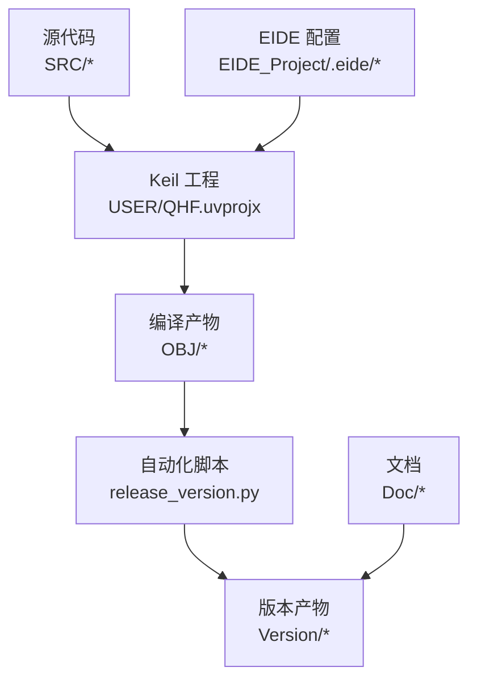
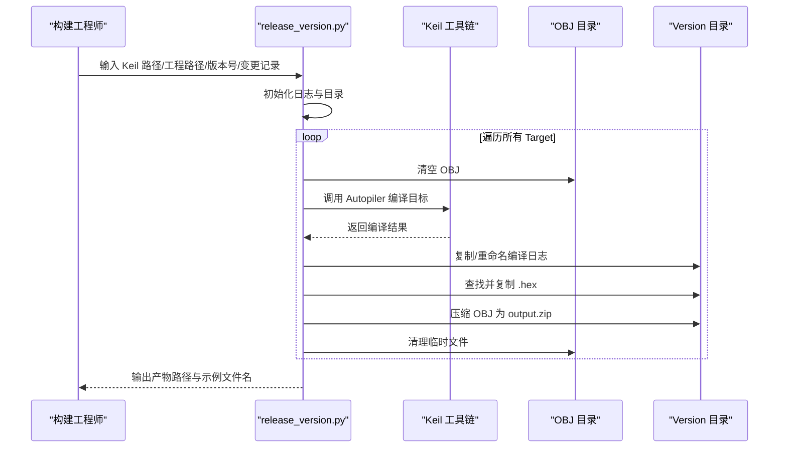
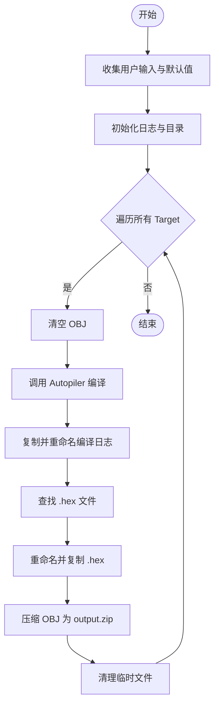
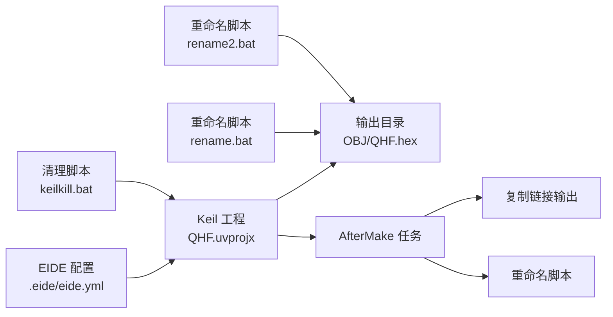
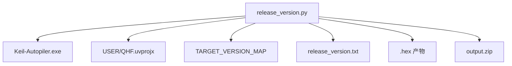

# 版本管理和构建

<cite>
**本文引用的文件**
- [release_version.py](file://release_version.py)
- [release_version.txt](file://Version/release_version.txt)
- [QHF_v1.3.1修改说明.md](file://Doc/QHF_v1.3.1修改说明.md)
- [QHF.uvprojx](file://USER/QHF.uvprojx)
- [eide.yml](file://EIDE_Project/.eide/eide.yml)
- [files.options.yml](file://EIDE_Project/.eide/files.options.yml)
- [keilkill.bat](file://keilkill.bat)
- [rename.bat](file://rename.bat)
- [rename2.bat](file://rename2.bat)
</cite>

## 目录
1. [简介](#简介)
2. [项目结构](#项目结构)
3. [核心组件](#核心组件)
4. [架构总览](#架构总览)
5. [详细组件分析](#详细组件分析)
6. [依赖分析](#依赖分析)
7. [性能考虑](#性能考虑)
8. [故障排查指南](#故障排查指南)
9. [结论](#结论)
10. [附录](#附录)

## 简介
本文件面向项目经理与构建工程师，系统化梳理通用开关器项目的版本管理与构建流程。内容涵盖版本控制策略与命名规范、自动化构建流程、发布与质量保证、版本升级与回滚方法、构建环境配置与依赖管理等，帮助团队建立标准化、可追溯、可重复的交付体系。

## 项目结构
项目采用“源代码 + 工程 + 文档 + 版本产物”的组织方式：
- 源代码位于 SRC、EIDE_Project 等目录，按功能模块分层
- Keil 工程位于 USER/QHF.uvprojx，支持多 Target（O_901/O_906/O_909/A_* /B_* /C_*）
- 版本产物输出至 Version 目录，包含 .hex 固件、编译日志与压缩包
- 文档位于 Doc，包含版本修改说明与特性列表
- 构建辅助脚本位于根目录，用于清理、重命名与自动化编译

图示来源
- [QHF.uvprojx](file://USER/QHF.uvprojx)
- [release_version.py](file://release_version.py)
- [eide.yml](file://EIDE_Project/.eide/eide.yml)

章节来源
- [QHF.uvprojx](file://USER/QHF.uvprojx)
- [eide.yml](file://EIDE_Project/.eide/eide.yml)

## 核心组件
- 自动化构建脚本：负责批量编译、产物重命名、日志记录与压缩归档
- 版本产物管理：统一命名规范与存储结构，便于追溯与分发
- 工程配置：Keil 工程与 EIDE 配置，定义编译参数、目标与输出
- 文档与变更记录：维护版本演进历史与特性说明
- 构建辅助工具：清理脚本、重命名脚本，保障构建环境整洁

章节来源
- [release_version.py](file://release_version.py)
- [release_version.txt](file://Version/release_version.txt)
- [QHF.uvprojx](file://USER/QHF.uvprojx)
- [QHF_v1.3.1修改说明.md](file://Doc/QHF_v1.3.1修改说明.md)
- [eide.yml](file://EIDE_Project/.eide/eide.yml)

## 架构总览
整体流程由“用户输入 → 自动化编译 → 产物归档 → 日志记录”构成，覆盖多 Target 的一致性处理与版本命名规范。

图示来源
- [release_version.py](file://release_version.py)
- [release_version.txt](file://Version/release_version.txt)

章节来源
- [release_version.py](file://release_version.py)
- [release_version.txt](file://Version/release_version.txt)

## 详细组件分析

### 版本命名规范与策略
- 命名格式：软件名称 + 版本号 + 版次 + 板卡标识 + 日期 + 变更记录 + 备注
- 示例：QHF_v1.3.1-r27_901_260422_(支援modbus_优化显示)_带灯输出A状态IN高OUT高_B状态IN低OUT低_半通道全低_错误全高.hex
- 字段说明：
  - 软件名称：固定前缀
  - 版本号：主版本.次版本.修订版本（如 v1.3.1）
  - 版次：rN，表示同一版本下的修改次数
  - 板卡标识：901/906/909 等
  - 日期：YYMMDD
  - 变更记录：简短英文或数字，避免中文导致的文件名问题
  - 备注：目标板卡状态或功能说明（可选）

章节来源
- [QHF_v1.3.1修改说明.md](file://Doc/QHF_v1.3.1修改说明.md)
- [release_version.py](file://release_version.py)
- [release_version.txt](file://Version/release_version.txt)

### 自动化构建流程
- 输入参数
  - Keil 安装路径、工程路径、Version 目录、版次号、变更记录
  - 日期自动获取（YYMMDD）
- 处理步骤
  - 清空 OBJ 目录
  - 调用 Autopiler 编译目标
  - 复制并重命名编译日志
  - 查找 .hex 并复制到 Version，按命名规范重命名
  - 压缩 OBJ 目录为 output.zip
  - 清理临时文件
- 输出管理
  - 每个 Target 生成独立 .hex 与 output.zip
  - 统一记录到 release_version.txt，包含编译起止时间、工具路径、目标列表等

图示来源
- [release_version.py](file://release_version.py)

章节来源
- [release_version.py](file://release_version.py)
- [release_version.txt](file://Version/release_version.txt)

### 发布流程与质量保证
- 发布前校验
  - 确认所有 Target 编译通过且生成 .hex
  - 校验命名规范与日期一致性
  - 检查 release_version.txt 是否包含完整编译信息
- 文档更新
  - 更新 Doc/QHF_v1.3.1修改说明.md，记录本次变更与影响范围
  - 在版本说明中标注支持的板卡类型与特性
- 产物归档
  - 将 .hex 与 output.zip 归档至 Version 目录
  - 提供示例文件名与版本说明，便于分发与追溯

章节来源
- [QHF_v1.3.1修改说明.md](file://Doc/QHF_v1.3.1修改说明.md)
- [release_version.txt](file://Version/release_version.txt)

### 版本升级与回滚
- 升级策略
  - 同版本内通过版次号（rN）区分修改；跨版本遵循语义化版本
  - 升级前在测试环境验证 .hex 与 output.zip 的功能与稳定性
- 回滚方法
  - 保留历史 .hex 与 output.zip，按命名规范快速定位目标版本
  - 回滚时恢复对应版本的 .hex，并同步回滚相关文档与配置
- 兼容性检查
  - 对涉及协议、参数范围、波特率等变更，提供兼容性矩阵与迁移清单
  - 在 Doc 中明确受影响的功能与默认值变化

章节来源
- [QHF_v1.3.1修改说明.md](file://Doc/QHF_v1.3.1修改说明.md)
- [release_version.txt](file://Version/release_version.txt)

### 构建环境配置与依赖管理
- Keil 工程配置
  - 设备型号、内存布局、编译选项、输出目录与名称、Hex 生成等
  - 工程中配置 AfterMake 阶段的用户命令，用于拷贝链接输出与重命名
- EIDE 配置
  - 源文件目录、包含路径、编译器选项、工具链与目标设置
  - 任务配置中包含复制与重命名脚本的调用
- 构建辅助脚本
  - keilkill.bat：清理工程临时文件，保持构建环境干净
  - rename.bat / rename2.bat：从版本头文件中提取版本信息并重命名输出文件

图示来源
- [QHF.uvprojx](file://USER/QHF.uvprojx)
- [eide.yml](file://EIDE_Project/.eide/eide.yml)
- [keilkill.bat](file://keilkill.bat)
- [rename.bat](file://rename.bat)
- [rename2.bat](file://rename2.bat)

章节来源
- [QHF.uvprojx](file://USER/QHF.uvprojx)
- [eide.yml](file://EIDE_Project/.eide/eide.yml)
- [files.options.yml](file://EIDE_Project/.eide/files.options.yml)
- [keilkill.bat](file://keilkill.bat)
- [rename.bat](file://rename.bat)
- [rename2.bat](file://rename2.bat)

## 依赖分析
- 组件耦合
  - release_version.py 依赖 Keil-Autopiler.exe 与工程路径，输出产物受工程配置影响
  - 版本命名依赖 TARGET_VERSION_MAP 与软件名称常量
- 外部依赖
  - Keil 工具链与 Pack 包
  - Python 运行环境（日志、子进程、压缩等）
- 潜在风险
  - 路径分隔符与编码问题（脚本中使用 Windows 反斜杠）
  - 变更记录合法性（建议启用校验以避免非法字符）

图示来源
- [release_version.py](file://release_version.py)
- [QHF.uvprojx](file://USER/QHF.uvprojx)

章节来源
- [release_version.py](file://release_version.py)
- [QHF.uvprojx](file://USER/QHF.uvprojx)

## 性能考虑
- 并行编译：当前脚本顺序处理各 Target，可在 CI 环境中并行执行以缩短总耗时
- 日志与磁盘：频繁复制与压缩可能影响磁盘 I/O，建议在专用构建机上执行
- 产物体积：output.zip 包含 OBJ 全量文件，可根据需要裁剪仅保留必要文件

## 故障排查指南
- 编译失败
  - 检查 release_version.txt 中的错误信息与返回码
  - 确认 Keil 安装路径与工程路径正确
- 未找到 .hex
  - 确认工程配置生成 Hex 文件，检查 OBJ 目录是否被清空后重新生成
- 文件名异常
  - 变更记录仅允许字母、数字与下划线，避免中文导致的文件名问题
- 产物缺失
  - 确认 AfterMake 任务与重命名脚本执行成功

章节来源
- [release_version.py](file://release_version.py)
- [release_version.txt](file://Version/release_version.txt)

## 结论
本项目通过统一的版本命名规范、自动化构建脚本与完善的日志记录，实现了可追溯、可重复的固件发布流程。建议在现有基础上引入 CI/CD 以实现自动化触发与并行构建，并强化变更记录的合法性校验与文档模板化，进一步提升发布效率与质量。

## 附录
- 命名规范速查
  - 格式：软件名称 + 版本号 + 版次 + 板卡标识 + 日期 + 变更记录 + 备注
  - 示例：QHF_v1.3.1-r27_901_260422_(fix_bug).hex
- 关键文件清单
  - 自动化脚本：release_version.py
  - 版本日志：Version/release_version.txt
  - 工程配置：USER/QHF.uvprojx
  - 文档说明：Doc/QHF_v1.3.1修改说明.md
  - EIDE 配置：EIDE_Project/.eide/eide.yml、files.options.yml
  - 构建辅助：keilkill.bat、rename.bat、rename2.bat