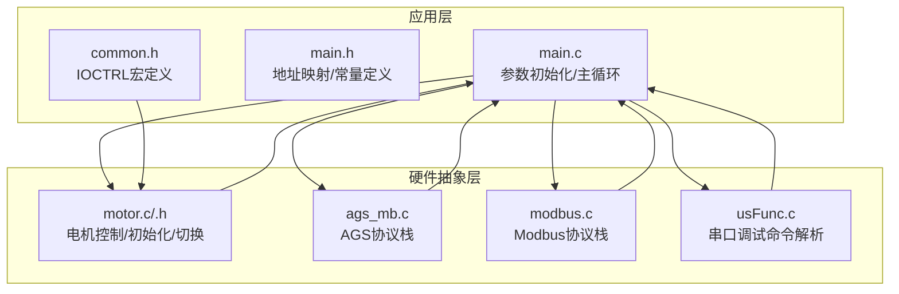
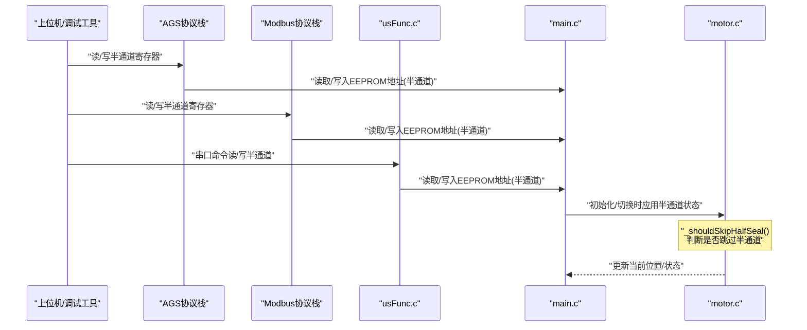
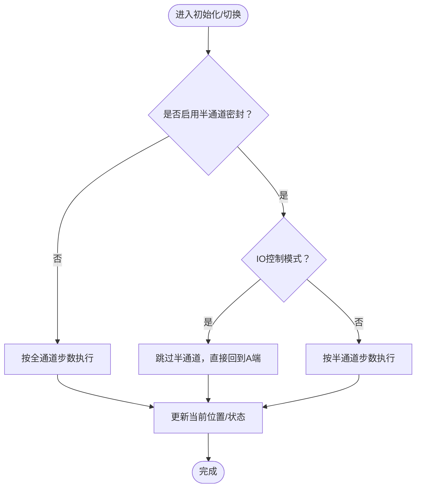
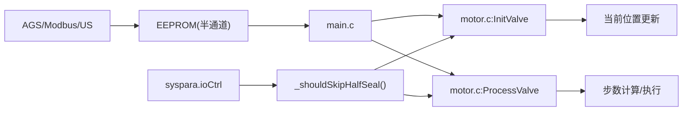

# 半通道密封功能

<cite>
**本文档引用的文件**
- [main.c](file://SRC/APP/main.c)
- [main.h](file://SRC/APP/main.h)
- [motor.c](file://SRC/HARDWARE/motor/motor.c)
- [motor.h](file://SRC/HARDWARE/motor/motor.h)
- [ags_mb.c](file://SRC/HARDWARE/ags_mb/ags_mb.c)
- [modbus.c](file://SRC/HARDWARE/modbus/modbus.c)
- [usFunc.c](file://SRC/HARDWARE/usinterface/usFunc.c)
- [common.h](file://SRC/APP/common.h)
</cite>

## 更新摘要
**所做更改**
- 新增_shouldSkipHalfSeal()函数的详细说明，增强IOCTRL模式下的半通道控制逻辑
- 更新半通道密封状态检测与验证方法，强调IO控制模式下的特殊行为
- 完善启用条件与禁用机制，明确IO控制与半通道的互斥关系
- 增强故障排查指南，涵盖IO控制模式下的常见问题

## 目录
1. [简介](#简介)
2. [项目结构](#项目结构)
3. [核心组件](#核心组件)
4. [架构总览](#架构总览)
5. [详细组件分析](#详细组件分析)
6. [依赖关系分析](#依赖关系分析)
7. [性能考量](#性能考量)
8. [故障排查指南](#故障排查指南)
9. [结论](#结论)
10. [附录](#附录)

## 简介
本文件围绕"半通道密封"功能展开，系统性阐述其工作原理、实现机制与工程落地细节。重点覆盖以下方面：
- 半通道位置的计算方法与物理意义
- 密封角度的精确控制与步进实现
- 密封压力的调节策略（结合电流设置）
- 半通道密封与全通道密封的区别与适用场景
- 半通道密封状态的检测与验证方法
- 对阀门寿命与能耗的影响评估
- 启用条件、禁用机制与参数配置
- 故障诊断与性能测试流程

## 项目结构
本项目采用分层架构：应用层负责参数初始化与主循环；硬件抽象层封装电机控制、通信协议与接口；底层驱动提供步进电机与传感器信号处理。

**图示来源**
- [main.c:433-494](file://SRC/APP/main.c#L433-L494)
- [motor.c:73-268](file://SRC/HARDWARE/motor/motor.c#L73-L268)
- [ags_mb.c:1-474](file://SRC/HARDWARE/ags_mb/ags_mb.c#L1-L474)
- [modbus.c:540-752](file://SRC/HARDWARE/modbus/modbus.c#L540-L752)
- [usFunc.c:571-599](file://SRC/HARDWARE/usinterface/usFunc.c#L571-L599)
- [common.h:35-130](file://SRC/APP/common.h#L35-L130)

**章节来源**
- [main.c:433-494](file://SRC/APP/main.c#L433-L494)
- [main.h:127-189](file://SRC/APP/main.h#L127-L189)
- [common.h:35-130](file://SRC/APP/common.h#L35-L130)

## 核心组件
- 半通道密封状态变量：位于阀门状态结构体中，用于指示是否启用半通道密封。
- **新增_shouldSkipHalfSeal()函数**：判断当前是否应跳过半通道逻辑，主要在IO控制模式下发挥作用。
- 初始化与切换流程：在复位初始化阶段根据半通道状态执行半步进动作，随后更新当前位置。
- 通信接口：通过AGS与Modbus协议读写半通道状态寄存器；通过串口调试命令进行读写与点检。
- 电流设置：通过ISET引脚配置，间接影响密封压力与能耗。

**章节来源**
- [motor.h:178](file://SRC/HARDWARE/motor/motor.h#L178)
- [motor.c:98-105](file://SRC/HARDWARE/motor/motor.c#L98-L105)
- [motor.c:157-224](file://SRC/HARDWARE/motor/motor.c#L157-L224)
- [ags_mb.c:252-256](file://SRC/HARDWARE/ags_mb/ags_mb.c#L252-L256)
- [modbus.c:736-739](file://SRC/HARDWARE/modbus/modbus.c#L736-L739)
- [usFunc.c:571-599](file://SRC/HARDWARE/usinterface/usFunc.c#L571-L599)

## 架构总览
半通道密封贯穿"参数持久化—协议读写—初始化与切换—状态更新"的完整链路。

**图示来源**
- [ags_mb.c:252-256](file://SRC/HARDWARE/ags_mb/ags_mb.c#L252-L256)
- [ags_mb.c:382-389](file://SRC/HARDWARE/ags_mb/ags_mb.c#L382-L389)
- [modbus.c:736-739](file://SRC/HARDWARE/modbus/modbus.c#L736-L739)
- [usFunc.c:571-599](file://SRC/HARDWARE/usinterface/usFunc.c#L571-L599)
- [main.c:337-339](file://SRC/APP/main.c#L337-L339)
- [motor.c:157-224](file://SRC/HARDWARE/motor/motor.c#L157-L224)
- [motor.c:98-105](file://SRC/HARDWARE/motor/motor.c#L98-L105)

## 详细组件分析

### 半通道位置计算与步进控制
- 半通道物理意义：在复位初始化阶段，若启用半通道密封，则在到达原点附近时额外执行"半通道步进"，使阀芯精确停靠在A/B之间的中间位置，形成轻微密封。
- 计算公式：半通道步进 = 单圈步数 ÷ 通道数 ÷ 2
- **新增_shouldSkipHalfSeal()函数**：在IO控制模式下，无论半通道状态如何，都直接跳过半通道逻辑，强制回到A端。
- 实现位置：
  - 初始化阶段：根据半通道状态和IO控制状态执行相应的半步进或直接跳过。
  - 切换阶段：若启用半通道且非IO控制模式，单次切换步数减半。
- 关键实现路径：
  - 初始化半通道步进：[motor.c:168](file://SRC/HARDWARE/motor/motor.c#L168)
  - 切换步数减半：[motor.c:286-287](file://SRC/HARDWARE/motor/motor.c#L286-L287)
  - **新增_shouldSkipHalfSeal()函数**：[motor.c:98-105](file://SRC/HARDWARE/motor/motor.c#L98-L105)

**图示来源**
- [motor.c:157-224](file://SRC/HARDWARE/motor/motor.c#L157-L224)
- [motor.c:286-287](file://SRC/HARDWARE/motor/motor.c#L286-L287)
- [motor.c:98-105](file://SRC/HARDWARE/motor/motor.c#L98-L105)

**章节来源**
- [motor.c:157-224](file://SRC/HARDWARE/motor/motor.c#L157-L224)
- [motor.c:286-287](file://SRC/HARDWARE/motor/motor.c#L286-L287)
- [motor.c:98-105](file://SRC/HARDWARE/motor/motor.c#L98-L105)

### 密封角度的精确控制
- 角度与步数映射：基于减速比与细分，将角度转换为步数。
- 步数精度：
  - A12_901/A12_909：每度步数≈142.2（4倍减速比），每0.1度≈14.2
  - A12_906：每度步数≈35.6（4倍减速比），每0.1度≈3.6
- 半通道角度：等于单通道角度的一半，步数亦随之减半。
- 关键实现路径：
  - 步数常量定义：[motor.h:113-148](file://SRC/HARDWARE/motor/motor.h#L113-L148)
  - 半通道步数计算：[motor.c:168](file://SRC/HARDWARE/motor/motor.c#L168)

**章节来源**
- [motor.h:113-148](file://SRC/HARDWARE/motor/motor.h#L113-L148)
- [motor.c:168](file://SRC/HARDWARE/motor/motor.c#L168)

### 密封压力的调节策略
- 电流设置（ISET）：通过ISET引脚配置，影响保持力与密封压力。
- 电流档位与典型电流：见电流设置函数路径。
- 影响：
  - 电流越大，保持力越强，密封效果越好，但能耗与发热上升。
  - 电流过小可能导致密封不严或因振动导致泄漏。
- 关键实现路径：
  - 电流设置命令解析：[usFunc.c:493-532](file://SRC/HARDWARE/usinterface/usFunc.c#L493-L532)
  - ISET引脚配置：[motor.h:44-49](file://SRC/HARDWARE/motor/motor.h#L44-L49)

**章节来源**
- [usFunc.c:493-532](file://SRC/HARDWARE/usinterface/usFunc.c#L493-L532)
- [motor.h:44-49](file://SRC/HARDWARE/motor/motor.h#L44-L49)

### 半通道与全通道密封对比
- 全通道密封：切换至目标端口（A/B），形成完全隔断。
- 半通道密封：在原点附近执行半步进，形成轻微接触，适用于需要微流量控制或节能场景。
- **IO控制模式特殊行为**：在IO控制模式下，半通道密封功能被强制禁用，无论半通道状态如何，阀门都会回到A端。
- 适用场景：
  - 半通道：长周期稳定运行、微泄漏容忍、节能需求。
  - 全通道：严格隔断、频繁切换、高密封要求。
  - **IO控制模式**：需要外部IO信号控制的自动化系统，半通道功能不适用。
- 关键实现路径：
  - 半通道启用条件（IO控制与半通道状态）：[motor.c:158-202](file://SRC/HARDWARE/motor/motor.c#L158-L202)

**章节来源**
- [motor.c:158-202](file://SRC/HARDWARE/motor/motor.c#L158-L202)
- [motor.c:98-105](file://SRC/HARDWARE/motor/motor.c#L98-L105)

### 半通道状态检测与验证
- 状态读取：
  - AGS协议：功能码0x0D读半通道寄存器。
  - Modbus协议：寄存器地址写入半通道值。
  - 串口命令：TermHalf读写半通道。
- **IO控制模式下的特殊检测**：
  - 点检模式会显示IO控制状态（IOE）。
  - 在IO控制模式下，半通道状态读取仍有效，但不会影响实际运行。
- 验证方法：
  - 初始化后检查当前位置是否为半通道（POS_M）。
  - **IO控制模式验证**：检查syspara.ioCtrl状态，确认半通道被强制跳过。
  - 切换测试：A↔M或B↔M，确认动作与EEPROM写入一致。
- 关键实现路径：
  - AGS读半通道：[ags_mb.c:252-256](file://SRC/HARDWARE/ags_mb/ags_mb.c#L252-L256)
  - Modbus写半通道：[modbus.c:736-739](file://SRC/HARDWARE/modbus/modbus.c#L736-L739)
  - 串口命令读写：[usFunc.c:571-599](file://SRC/HARDWARE/usinterface/usFunc.c#L571-L599)
  - 初始化后位置更新：[motor.c:204-224](file://SRC/HARDWARE/motor/motor.c#L204-L224)

**章节来源**
- [ags_mb.c:252-256](file://SRC/HARDWARE/ags_mb/ags_mb.c#L252-L256)
- [modbus.c:736-739](file://SRC/HARDWARE/modbus/modbus.c#L736-L739)
- [usFunc.c:571-599](file://SRC/HARDWARE/usinterface/usFunc.c#L571-L599)
- [motor.c:204-224](file://SRC/HARDWARE/motor/motor.c#L204-L224)
- [usFunc.c:644-671](file://SRC/HARDWARE/usinterface/usFunc.c#L644-L671)

### 启用条件与禁用机制
- 启用条件：
  - 通过协议或串口命令将半通道状态写入EEPROM。
  - 初始化阶段根据半通道状态执行半步进。
- **禁用机制增强**：
  - 半通道状态为OFF时，不执行半步进，按全通道执行。
  - **IO控制生效时（bIoCtrl=ON）**，半通道不生效，直接回到A端。
  - **新增_shouldSkipHalfSeal()函数**确保在IO控制模式下强制跳过半通道逻辑。
- 关键实现路径：
  - 半通道写入EEPROM：[main.c:337-339](file://SRC/APP/main.c#L337-L339)
  - IO控制与半通道互斥：[motor.c:158-202](file://SRC/HARDWARE/motor/motor.c#L158-L202)
  - **新增_shouldSkipHalfSeal()函数**：[motor.c:98-105](file://SRC/HARDWARE/motor/motor.c#L98-L105)

**章节来源**
- [main.c:337-339](file://SRC/APP/main.c#L337-L339)
- [motor.c:158-202](file://SRC/HARDWARE/motor/motor.c#L158-L202)
- [motor.c:98-105](file://SRC/HARDWARE/motor/motor.c#L98-L105)

### 参数配置指南与调试方法
- EEPROM地址映射（半通道）：[main.h:168-169](file://SRC/APP/main.h#L168-L169)
- 配置入口：
  - AGS协议：功能码0x0D写半通道寄存器。
  - Modbus协议：寄存器写入半通道值。
  - 串口命令：TermHalf读写半通道。
- **IO控制模式配置**：
  - 通过common.h中的IOCTRL宏定义启用IO控制模式。
  - 点检模式输出IO控制状态（IOE）。
- 调试要点：
  - 点检模式输出半通道状态和IO控制状态。
  - 观察初始化日志与切换日志，确认半步进执行或跳过逻辑。
  - **IO控制模式下**，初始化日志应显示跳过半通道的处理。
- 关键实现路径：
  - 点检模式输出：[usFunc.c:644-671](file://SRC/HARDWARE/usinterface/usFunc.c#L644-L671)
  - 半通道写入EEPROM：[usFunc.c:571-599](file://SRC/HARDWARE/usinterface/usFunc.c#L571-L599)

**章节来源**
- [main.h:168-169](file://SRC/APP/main.h#L168-L169)
- [usFunc.c:644-671](file://SRC/HARDWARE/usinterface/usFunc.c#L644-L671)
- [usFunc.c:571-599](file://SRC/HARDWARE/usinterface/usFunc.c#L571-L599)
- [common.h:35-130](file://SRC/APP/common.h#L35-L130)

## 依赖关系分析
- 数据流依赖：
  - 半通道状态由应用层读取EEPROM并在初始化/切换流程中使用。
  - **新增_shouldSkipHalfSeal()函数**依赖syspara.ioCtrl状态判断是否跳过半通道。
  - 通信协议层负责将半通道状态与EEPROM地址映射关联。
- 控制流依赖：
  - 初始化流程依赖半通道状态和IO控制状态决定是否执行半步进。
  - 切换流程依赖半通道状态和IO控制状态决定步数是否减半。
- 外部依赖：
  - EEPROM用于持久化半通道状态。
  - 串口/AGS/Modbus用于远程配置与状态读取。
  - **IO控制模式依赖硬件IO信号输入**。

**图示来源**
- [main.c:337-339](file://SRC/APP/main.c#L337-L339)
- [motor.c:157-224](file://SRC/HARDWARE/motor/motor.c#L157-L224)
- [motor.c:286-287](file://SRC/HARDWARE/motor/motor.c#L286-L287)
- [ags_mb.c:252-256](file://SRC/HARDWARE/ags_mb/ags_mb.c#L252-L256)
- [modbus.c:736-739](file://SRC/HARDWARE/modbus/modbus.c#L736-L739)
- [usFunc.c:571-599](file://SRC/HARDWARE/usinterface/usFunc.c#L571-L599)
- [motor.c:98-105](file://SRC/HARDWARE/motor/motor.c#L98-L105)

**章节来源**
- [main.c:337-339](file://SRC/APP/main.c#L337-L339)
- [motor.c:157-224](file://SRC/HARDWARE/motor/motor.c#L157-L224)
- [motor.c:286-287](file://SRC/HARDWARE/motor/motor.c#L286-L287)
- [ags_mb.c:252-256](file://SRC/HARDWARE/ags_mb/ags_mb.c#L252-L256)
- [modbus.c:736-739](file://SRC/HARDWARE/modbus/modbus.c#L736-L739)
- [usFunc.c:571-599](file://SRC/HARDWARE/usinterface/usFunc.c#L571-L599)
- [motor.c:98-105](file://SRC/HARDWARE/motor/motor.c#L98-L105)

## 性能考量
- 能耗影响：
  - 半通道密封可降低切换频率与保持电流，从而降低能耗。
  - **IO控制模式下**，由于强制回到A端，避免了半通道的额外功耗。
  - 电流过大可能提升能耗与温升，需结合工况选择合适档位。
- 寿命影响：
  - 半通道减少频繁全行程切换，有助于延长机械寿命。
  - **IO控制模式**减少了不必要的电机运动，进一步延长寿命。
  - 长期微压密封可能产生局部磨损，需定期检查与维护。
- 控制精度：
  - 步数计算受减速比与细分影响，需确保参数一致性。
  - 半通道步进在初始化阶段执行，避免运行中扰动。
  - **IO控制模式**确保了更稳定的控制行为。

## 故障排查指南
- 症状：半通道不生效
  - 检查半通道状态是否为ON。
  - **特别检查**：确认是否处于IO控制模式（syspara.ioCtrl）。
  - 在IO控制模式下，半通道功能会被强制禁用。
  - 验证初始化日志是否包含半步进执行记录或跳过记录。
- 症状：切换步数异常
  - 检查通道数与减速比配置是否正确。
  - 确认半通道启用时步数应为全通道的一半。
  - **IO控制模式下**，步数应按全通道计算，因为半通道被跳过。
- 症状：密封压力不足
  - 提升电流档位，观察电流设置命令解析结果。
  - 检查ISET引脚配置是否正确。
  - **注意**：在IO控制模式下，半通道密封功能被禁用，压力调节主要通过全通道模式。
- 症状：通信读写失败
  - 校验协议栈功能码与寄存器地址。
  - 使用点检模式核对半通道状态和IO控制状态。
- **新增IO控制模式专用排查**：
  - 检查硬件IO信号输入是否正常。
  - 确认common.h中的IOCTRL宏定义正确。
  - 验证syspara.ioCtrl状态与预期一致。

**章节来源**
- [motor.c:158-202](file://SRC/HARDWARE/motor/motor.c#L158-L202)
- [motor.c:98-105](file://SRC/HARDWARE/motor/motor.c#L98-L105)
- [usFunc.c:493-532](file://SRC/HARDWARE/usinterface/usFunc.c#L493-L532)
- [usFunc.c:644-671](file://SRC/HARDWARE/usinterface/usFunc.c#L644-L671)
- [common.h:35-130](file://SRC/APP/common.h#L35-L130)

## 结论
半通道密封通过"半步进+电流调节"的组合，实现了在节能与密封可靠性之间的平衡。其实现依托于明确的状态管理、严谨的步进计算与多协议接口，配合完善的检测与调试手段，可在多种工况下稳定运行。

**新增_shouldSkipHalfSeal()函数**增强了系统的鲁棒性，特别是在IO控制模式下，确保了半通道功能与外部控制系统的一致性。该函数的引入使得半通道密封功能能够更好地适应不同的应用场景，包括需要外部IO控制的自动化系统。

建议在实际部署中结合具体介质特性与能耗约束，合理选择半通道与电流参数，并建立定期验证机制。对于需要外部IO控制的应用，应充分理解半通道功能在IO控制模式下的特殊行为，避免误解系统状态。

## 附录
- 关键地址与常量
  - 半通道EEPROM地址：[main.h:168-169](file://SRC/APP/main.h#L168-L169)
  - 通道数与减速比常量：[motor.h:87-98](file://SRC/HARDWARE/motor/motor.h#L87-L98)
- 协议接口
  - AGS读半通道：[ags_mb.c:252-256](file://SRC/HARDWARE/ags_mb/ags_mb.c#L252-L256)
  - AGS写半通道：[ags_mb.c:382-389](file://SRC/HARDWARE/ags_mb/ags_mb.c#L382-L389)
  - Modbus写半通道：[modbus.c:736-739](file://SRC/HARDWARE/modbus/modbus.c#L736-L739)
  - 串口命令读写：[usFunc.c:571-599](file://SRC/HARDWARE/usinterface/usFunc.c#L571-L599)
- **新增函数与宏定义**
  - **_shouldSkipHalfSeal()函数**：[motor.c:98-105](file://SRC/HARDWARE/motor/motor.c#L98-L105)
  - IOCTRL宏定义：[common.h:35-130](file://SRC/APP/common.h#L35-L130)
  - syspara.ioCtrl字段：[main.h:220](file://SRC/APP/main.h#L220)