# 原点寻找算法

<cite>
**本文引用的文件**
- [motor.c](file://SRC/HARDWARE/motor/motor.c)
- [motor.h](file://SRC/HARDWARE/motor/motor.h)
- [smotor.h](file://SRC/HARDWARE/motor/smotor.h)
- [timer.c](file://SRC/SYSTEM/timer/timer.c)
- [main.c](file://SRC/APP/main.c)
- [common.h](file://SRC/APP/common.h)
- [main.h](file://SRC/APP/main.h)
- [modbus.c](file://SRC/HARDWARE/modbus/modbus.c)
</cite>

## 更新摘要
**变更内容**
- 重构原点寻找算法，新增模块化步骤处理函数
- 改进初始化流程的可维护性和可靠性
- 新增方向系数宏处理机制
- 增强半通道密封功能的模块化设计

## 目录
1. [简介](#简介)
2. [项目结构](#项目结构)
3. [核心组件](#核心组件)
4. [架构总览](#架构总览)
5. [详细组件分析](#详细组件分析)
6. [依赖关系分析](#依赖关系分析)
7. [性能考量](#性能考量)
8. [故障排查指南](#故障排查指南)
9. [结论](#结论)
10. [附录](#附录)

## 简介
本文件面向步进电机原点寻找算法的技术文档，聚焦于基于光耦信号的原点定位闭环流程。经过重构后，算法采用了模块化的步骤处理函数，显著提升了代码的可维护性和可靠性。内容涵盖：
- 光耦信号检测机制与去抖动策略
- 原点位置识别与精确定位策略
- 模块化原点寻找状态机（初始化/搜索/检测/确认）
- 原点信号处理逻辑（高低电平判断、状态记忆）
- 坐标系建立与原点位置计算
- 寻位失败处理与错误恢复
- 算法流程图与状态转换图
- 精度分析与优化建议

## 项目结构
该系统围绕"应用层 → 接口层 → 硬件抽象层"的分层组织，原点寻找涉及以下关键模块：
- 应用层：主循环与状态输出、错误指示
- 接口层：定时器中断、串口/协议解析
- 硬件抽象层：步进电机轴控制、光耦输入、I2C参数存储

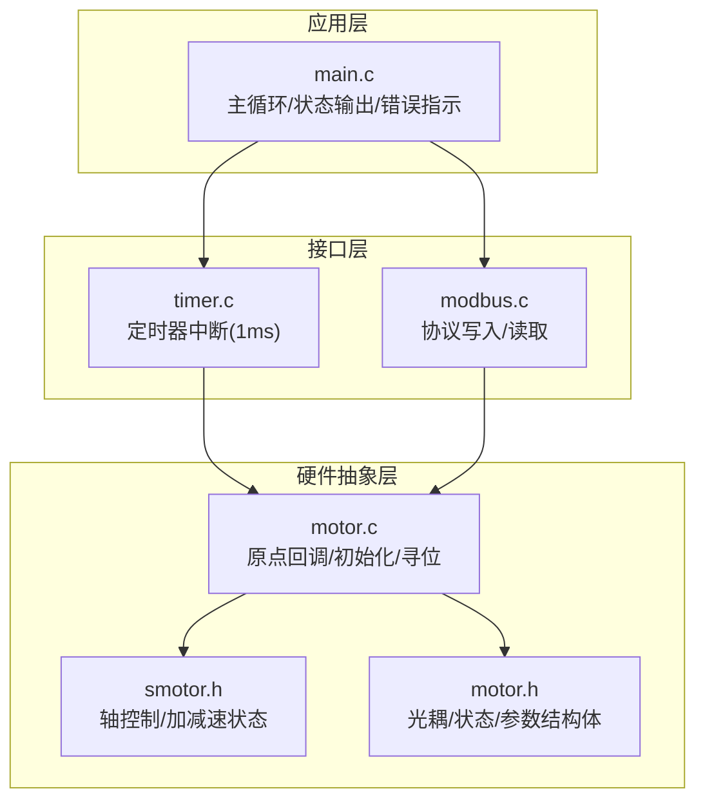

**图表来源**
- [main.c:336-337](file://SRC/APP/main.c#L336-L337)
- [timer.c:22-42](file://SRC/SYSTEM/timer/timer.c#L22-L42)
- [modbus.c:587-775](file://SRC/HARDWARE/modbus/modbus.c#L587-L775)
- [motor.c:356-371](file://SRC/HARDWARE/motor/motor.c#L356-L371)
- [smotor.h:67-96](file://SRC/HARDWARE/motor/smotor.h#L67-L96)
- [motor.h:151-237](file://SRC/HARDWARE/motor/motor.h#L151-L237)

**章节来源**
- [main.c:336-337](file://SRC/APP/main.c#L336-L337)
- [timer.c:22-42](file://SRC/SYSTEM/timer/timer.c#L22-L42)
- [modbus.c:587-775](file://SRC/HARDWARE/modbus/modbus.c#L587-L775)
- [motor.c:356-371](file://SRC/HARDWARE/motor/motor.c#L356-L371)
- [smotor.h:67-96](file://SRC/HARDWARE/motor/smotor.h#L67-L96)
- [motor.h:151-237](file://SRC/HARDWARE/motor/motor.h#L151-L237)

## 核心组件
- 光耦输入与状态枚举：提供缺口/挡光两种状态，用于判断原点窗口与遮挡状态。
- 原点回调函数：在光耦触发时执行，记录原点位置并进入减速/停止流程。
- **模块化初始化流程**：将初始化过程拆分为7个独立的静态函数，每个函数负责特定的初始化步骤，提升代码可维护性。
- 寻位流程：在非初始化状态下，依据目标位置与方向补偿进行相对/绝对移动，并在到达目标通道时校准。
- 参数与坐标：通过固定补偿数组中的原点补偿与方向补偿，建立以机械零点为基准的坐标。

**章节来源**
- [motor.h:61-66](file://SRC/HARDWARE/motor/motor.h#L61-L66)
- [motor.h:151-186](file://SRC/HARDWARE/motor/motor.h#L151-L186)
- [motor.h:198-224](file://SRC/HARDWARE/motor/motor.h#L198-L224)
- [motor.c:121-137](file://SRC/HARDWARE/motor/motor.c#L121-L137)
- [motor.c:143-161](file://SRC/HARDWARE/motor/motor.c#L143-L161)
- [motor.c:278-314](file://SRC/HARDWARE/motor/motor.c#L278-L314)

## 架构总览
原点寻找贯穿"初始化阶段"和"运行阶段"，由定时器中断驱动状态推进，由光耦信号触发原点回调，最终在减速阶段完成精确定位。重构后的架构采用了模块化的步骤处理函数，每个初始化步骤都有独立的处理函数。

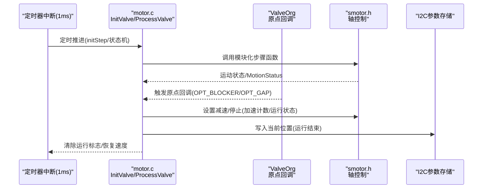

**图表来源**
- [timer.c:22-42](file://SRC/SYSTEM/timer/timer.c#L22-L42)
- [motor.c:278-314](file://SRC/HARDWARE/motor/motor.c#L278-L314)
- [motor.c:442-457](file://SRC/HARDWARE/motor/motor.c#L442-L457)
- [motor.c:356-371](file://SRC/HARDWARE/motor/motor.c#L356-L371)
- [smotor.h:67-96](file://SRC/HARDWARE/motor/smotor.h#L67-L96)

## 详细组件分析

### 光耦信号检测机制与去抖动
- 输入引脚配置：光耦引脚作为上拉/下拉输入，配合内部上拉/下拉电阻，避免悬空。
- 状态枚举：缺口状态与挡光状态，分别对应不同的寻位策略。
- 去抖动策略：通过状态记忆变量optLast与连续两次一致的判定，避免瞬时抖动导致的误判；当检测到缺口状态时，将optLast更新为挡光状态，反之亦然。

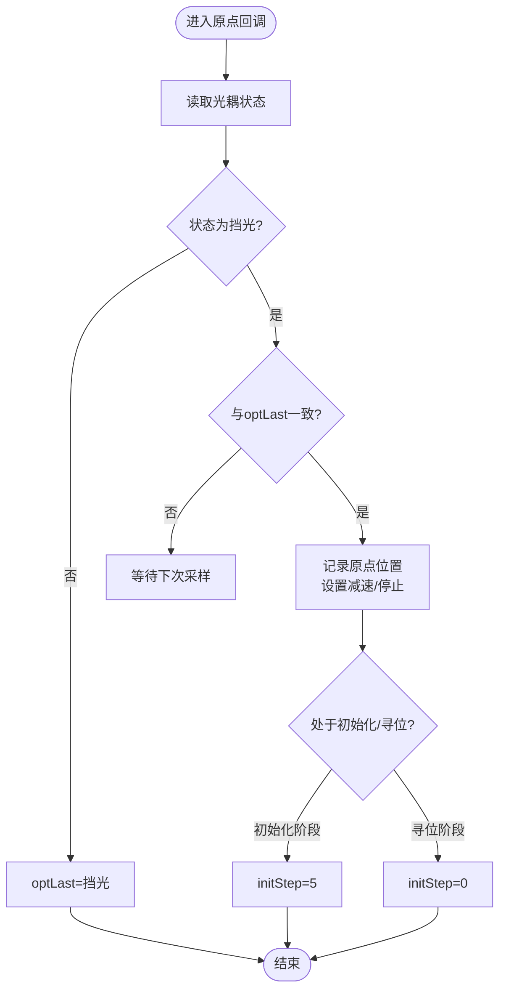

**图表来源**
- [motor.c:442-457](file://SRC/HARDWARE/motor/motor.c#L442-L457)
- [motor.h:61-66](file://SRC/HARDWARE/motor/motor.h#L61-L66)

**章节来源**
- [motor.c:442-457](file://SRC/HARDWARE/motor/motor.c#L442-L457)
- [motor.h:61-66](file://SRC/HARDWARE/motor/motor.h#L61-L66)

### 模块化初始化流程与状态机实现
**更新** 重构后的初始化流程采用了7个独立的模块化步骤处理函数，每个函数负责特定的初始化步骤，显著提升了代码的可维护性和可靠性。

- **步骤0：重试逻辑** - 启动电机，增加重试计数，读取上次位置
- **步骤1：方向决策** - 根据光感信号决定电机移动方向（正向转一圈或反向转半通道）
- **步骤2：调整减速** - 未挡住时光耦时立即减速，仍挡住时标记B位置
- **步骤3：等待缺口** - 等待光耦信号变为缺口状态
- **步骤5：半通道密封** - 执行半通道密封（如启用），或跳过此步骤
- **步骤6：更新位置** - 根据IO控制和半通道配置确定最终位置，写入EEPROM
- **步骤7：完成初始化** - 清除状态标志，恢复工作状态

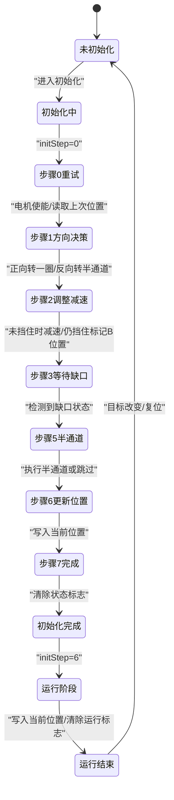

**图表来源**
- [motor.c:278-314](file://SRC/HARDWARE/motor/motor.c#L278-L314)
- [motor.c:121-137](file://SRC/HARDWARE/motor/motor.c#L121-L137)
- [motor.c:143-161](file://SRC/HARDWARE/motor/motor.c#L143-L161)
- [motor.c:167-181](file://SRC/HARDWARE/motor/motor.c#L167-L181)
- [motor.c:186-191](file://SRC/HARDWARE/motor/motor.c#L186-L191)
- [motor.c:197-217](file://SRC/HARDWARE/motor/motor.c#L197-L217)
- [motor.c:223-244](file://SRC/HARDWARE/motor/motor.c#L223-L244)
- [motor.c:249-273](file://SRC/HARDWARE/motor/motor.c#L249-L273)

**章节来源**
- [motor.c:278-314](file://SRC/HARDWARE/motor/motor.c#L278-L314)
- [motor.c:121-137](file://SRC/HARDWARE/motor/motor.c#L121-L137)
- [motor.c:143-161](file://SRC/HARDWARE/motor/motor.c#L143-L161)
- [motor.c:167-181](file://SRC/HARDWARE/motor/motor.c#L167-L181)
- [motor.c:186-191](file://SRC/HARDWARE/motor/motor.c#L186-L191)
- [motor.c:197-217](file://SRC/HARDWARE/motor/motor.c#L197-L217)
- [motor.c:223-244](file://SRC/HARDWARE/motor/motor.c#L223-L244)
- [motor.c:249-273](file://SRC/HARDWARE/motor/motor.c#L249-L273)

### 方向系数宏与模块化处理
**新增** 重构引入了DIRECTION_SWITCH宏来统一处理电机方向，消除了重复代码，提升了代码的可维护性。

- **方向系数宏**：根据DIRECTION_SWITCH统一处理电机方向正负，简化了方向处理逻辑
- **模块化步骤函数**：每个初始化步骤都有独立的静态函数，消除了重复代码，提升可维护性
- **半通道密封处理**：新增了半通道密封功能的模块化处理，支持IO控制模式下的跳过逻辑

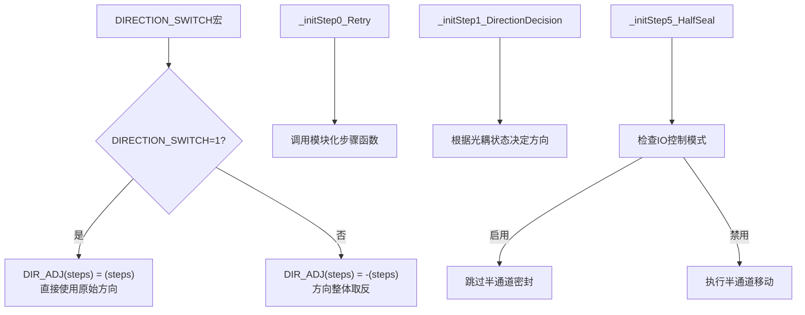

**图表来源**
- [motor.c:81-86](file://SRC/HARDWARE/motor/motor.c#L81-L86)
- [motor.c:121-137](file://SRC/HARDWARE/motor/motor.c#L121-L137)
- [motor.c:143-161](file://SRC/HARDWARE/motor/motor.c#L143-L161)
- [motor.c:197-217](file://SRC/HARDWARE/motor/motor.c#L197-L217)

**章节来源**
- [motor.c:81-86](file://SRC/HARDWARE/motor/motor.c#L81-L86)
- [motor.c:121-137](file://SRC/HARDWARE/motor/motor.c#L121-L137)
- [motor.c:143-161](file://SRC/HARDWARE/motor/motor.c#L143-L161)
- [motor.c:197-217](file://SRC/HARDWARE/motor/motor.c#L197-L217)

### 原点位置识别与精确定位策略
- 原点识别：当光耦状态为挡光且与上次状态一致时，认为已捕获原点窗口，记录当前位置为原点偏移量，并进入减速/停止阶段。
- 精确定位：将当前位置设置为原点偏移步数，同时将加速度计数设置为原点偏移步数，运行状态置为减速，确保在原点附近以较低速度完成最终定位。
- 坐标系建立：原点补偿来自固定参数数组中的org字段，结合每度步数与减速比，形成以机械零点为基准的坐标。

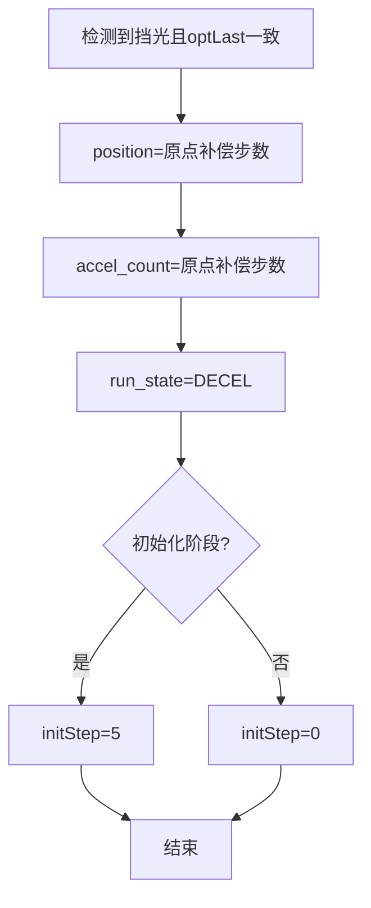

**图表来源**
- [motor.c:442-457](file://SRC/HARDWARE/motor/motor.c#L442-L457)
- [motor.h:198-224](file://SRC/HARDWARE/motor/motor.h#L198-L224)

**章节来源**
- [motor.c:442-457](file://SRC/HARDWARE/motor/motor.c#L442-L457)
- [motor.h:198-224](file://SRC/HARDWARE/motor/motor.h#L198-L224)

### 原点信号处理逻辑
- 高低电平判断：通过光耦输入引脚读取状态，缺口状态与挡光状态分别对应不同处理分支。
- 去抖动处理：采用optLast与当前状态一致性检查，避免误触发。
- 状态转换：缺口状态时更新optLast为挡光，便于后续确认阶段的判定。

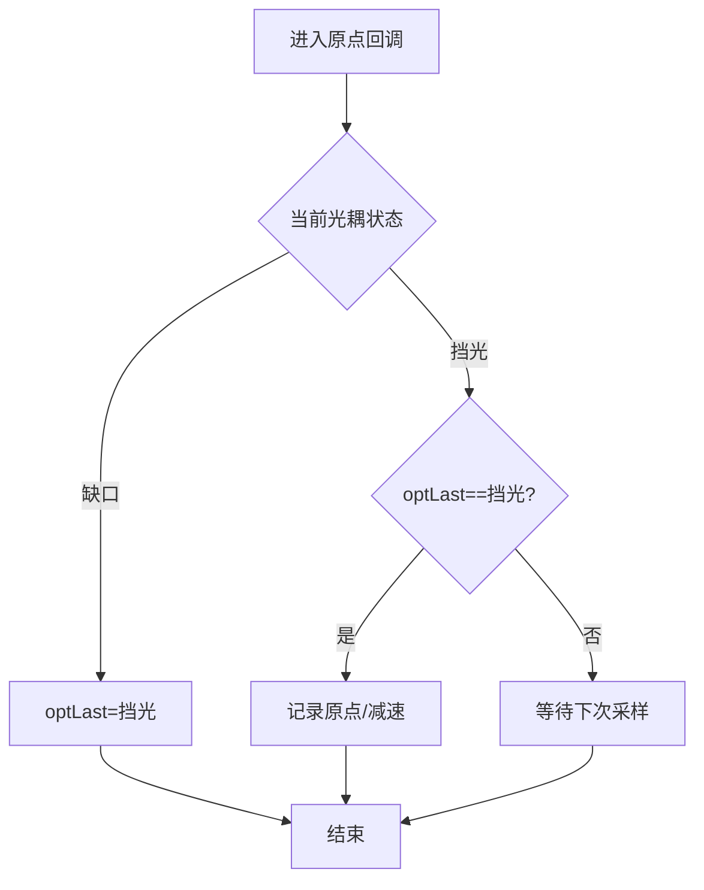

**图表来源**
- [motor.c:442-457](file://SRC/HARDWARE/motor/motor.c#L442-L457)

**章节来源**
- [motor.c:442-457](file://SRC/HARDWARE/motor/motor.c#L442-L457)

### 原点位置计算与坐标系
- 原点补偿：来自固定参数数组fix.org，单位为步数，结合每度步数与减速比换算。
- 方向补偿：fix.dirGap用于修正方向误差，影响相对移动步数。
- 步数换算：每度步数由减速比与细分共同决定，具体数值在头文件中定义。

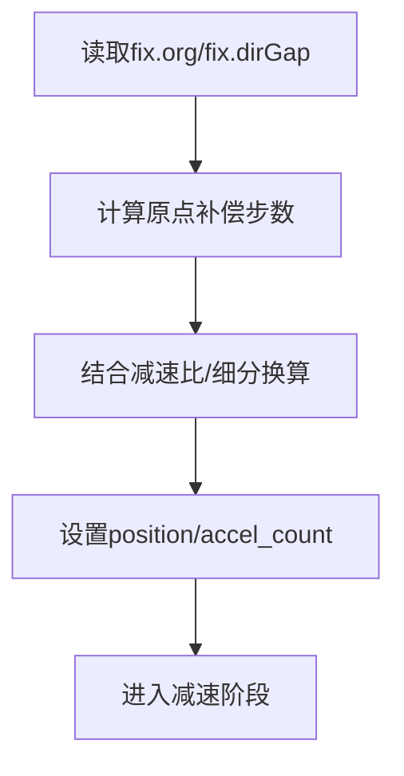

**图表来源**
- [motor.h:198-224](file://SRC/HARDWARE/motor/motor.h#L198-L224)
- [motor.h:112-148](file://SRC/HARDWARE/motor/motor.h#L112-L148)

**章节来源**
- [motor.h:198-224](file://SRC/HARDWARE/motor/motor.h#L198-L224)
- [motor.h:112-148](file://SRC/HARDWARE/motor/motor.h#L112-L148)

### 寻位失败处理与错误恢复
- 超时保护：定时器计数protectTimeOut用于保护性超时，防止长时间卡死。
- 错误闪烁：ErrBlinkTime控制LED闪烁周期，用于指示错误状态。
- 初始化重试：initStep=0时进行重试，最多RETRY_TIMES次，超过则报错。
- 寻位阶段错误：若在A位置寻位时检测到缺口状态，直接标记运行错误并停止。

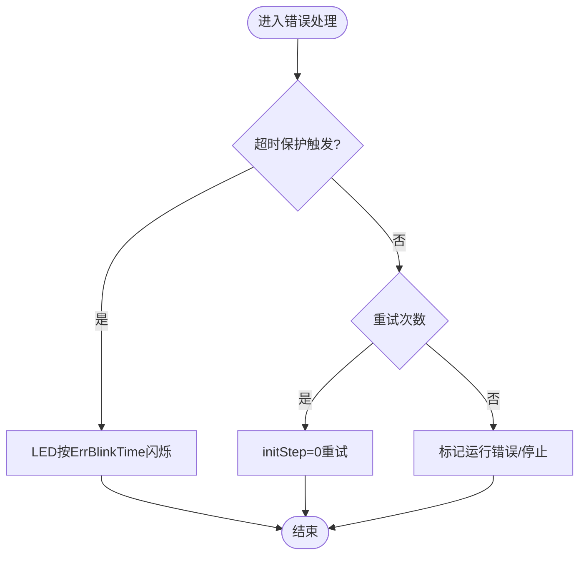

**图表来源**
- [timer.c:22-42](file://SRC/SYSTEM/timer/timer.c#L22-L42)
- [motor.c:121-137](file://SRC/HARDWARE/motor/motor.c#L121-L137)
- [motor.c:402-409](file://SRC/HARDWARE/motor/motor.c#L402-L409)

**章节来源**
- [timer.c:22-42](file://SRC/SYSTEM/timer/timer.c#L22-L42)
- [motor.c:121-137](file://SRC/HARDWARE/motor/motor.c#L121-L137)
- [motor.c:402-409](file://SRC/HARDWARE/motor/motor.c#L402-L409)

## 依赖关系分析
- 定时器中断驱动状态机推进与超时保护
- 协议层写入目标位置，触发寻位流程
- 原点回调与轴控制模块协同，完成减速与停止
- I2C参数存储用于保存当前位置与补偿参数

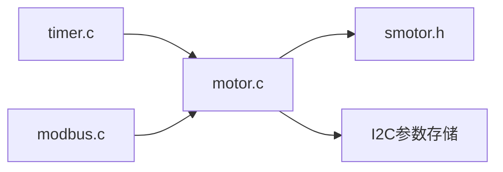

**图表来源**
- [timer.c:22-42](file://SRC/SYSTEM/timer/timer.c#L22-L42)
- [modbus.c:587-775](file://SRC/HARDWARE/modbus/modbus.c#L587-L775)
- [motor.c:442-457](file://SRC/HARDWARE/motor/motor.c#L442-L457)
- [smotor.h:67-96](file://SRC/HARDWARE/motor/smotor.h#L67-L96)

**章节来源**
- [timer.c:22-42](file://SRC/SYSTEM/timer/timer.c#L22-L42)
- [modbus.c:587-775](file://SRC/HARDWARE/modbus/modbus.c#L587-L775)
- [motor.c:442-457](file://SRC/HARDWARE/motor/motor.c#L442-L457)
- [smotor.h:67-96](file://SRC/HARDWARE/motor/smotor.h#L67-L96)

## 性能考量
- 中断频率与步进控制：1ms定时器中断驱动状态推进，确保响应及时。
- 加减速策略：通过accel_count与run_state控制，减少过冲与振荡。
- 参数范围限制：速度、波特率、通道数等参数范围限制，避免异常工况。
- 电流与细分：不同版本的电流与细分配置影响扭矩与分辨率，需与机械负载匹配。
- **模块化优势**：重构后的模块化设计减少了重复代码，提升了代码执行效率和可维护性。

## 故障排查指南
- 光耦误触发：检查optLast一致性与输入上拉/下拉配置，确认接线与供电稳定。
- 原点未识别：核对fix.org与方向补偿，确认机械安装与挡光片位置。
- 寻位超时：检查超时保护计数与运动状态，确认是否存在机械卡滞。
- LED闪烁异常：检查ErrBlinkTime与定时器计数，确认错误状态是否被正确清除。
- **模块化问题**：检查各步骤函数的返回条件，确认initStep状态机的正确流转。

**章节来源**
- [motor.c:442-457](file://SRC/HARDWARE/motor/motor.c#L442-L457)
- [timer.c:22-42](file://SRC/SYSTEM/timer/timer.c#L22-L42)
- [main.c:368-376](file://SRC/APP/main.c#L368-L376)

## 结论
该原点寻找算法通过光耦信号与模块化状态机协同，实现了可靠且可重复的原点定位。重构后的架构显著提升了代码的可维护性和可靠性，其关键在于：
- 明确的去抖动策略与状态记忆
- 基于固定补偿的坐标系建立
- **模块化步骤处理函数的引入，消除了重复代码，提升了可维护性**
- **方向系数宏的统一处理，简化了方向逻辑**
- 减速阶段的精确定位
- 完善的超时与错误处理机制

在实际部署中，建议结合机械安装精度与负载特性，合理设置补偿参数与速度/加速度，以获得更优的定位精度与稳定性。

## 附录

### 关键数据结构与参数
- 光耦状态枚举：缺口/挡光
- 固定补偿：原点补偿(org)、方向补偿(dirGap)
- 速度/加速度/减速比：与细分共同决定步数换算
- **模块化步骤函数**：7个独立的初始化步骤处理函数

**章节来源**
- [motor.h:61-66](file://SRC/HARDWARE/motor/motor.h#L61-L66)
- [motor.h:198-224](file://SRC/HARDWARE/motor/motor.h#L198-L224)
- [motor.h:112-148](file://SRC/HARDWARE/motor/motor.h#L112-L148)
- [motor.c:121-137](file://SRC/HARDWARE/motor/motor.c#L121-L137)

### 算法流程图（综合）
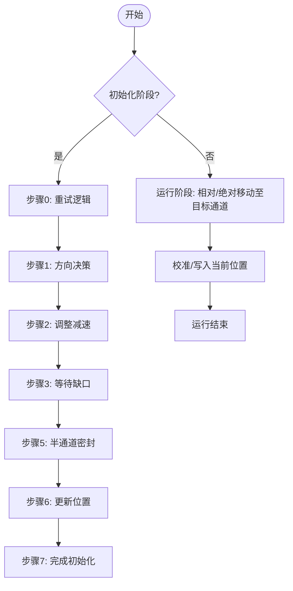

**图表来源**
- [motor.c:278-314](file://SRC/HARDWARE/motor/motor.c#L278-L314)
- [motor.c:121-137](file://SRC/HARDWARE/motor/motor.c#L121-L137)
- [motor.c:143-161](file://SRC/HARDWARE/motor/motor.c#L143-L161)
- [motor.c:167-181](file://SRC/HARDWARE/motor/motor.c#L167-L181)
- [motor.c:186-191](file://SRC/HARDWARE/motor/motor.c#L186-L191)
- [motor.c:197-217](file://SRC/HARDWARE/motor/motor.c#L197-L217)
- [motor.c:223-244](file://SRC/HARDWARE/motor/motor.c#L223-L244)
- [motor.c:249-273](file://SRC/HARDWARE/motor/motor.c#L249-L273)