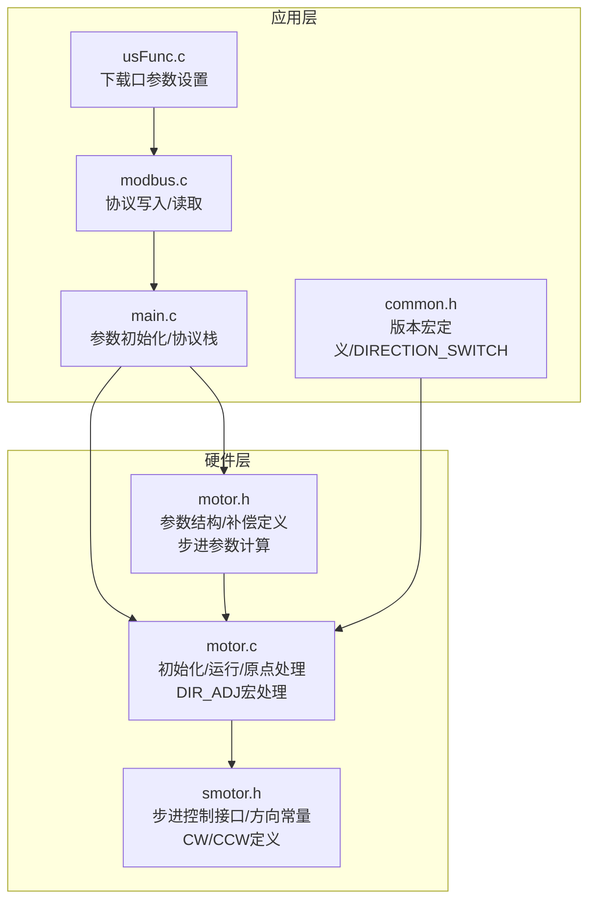
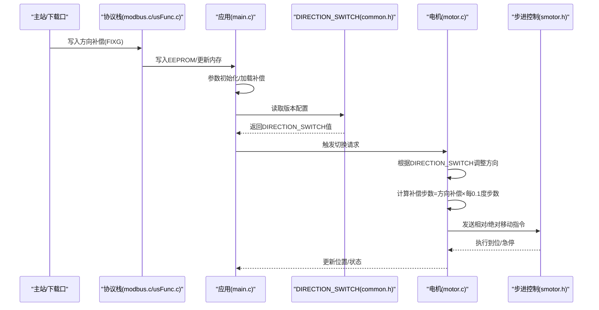
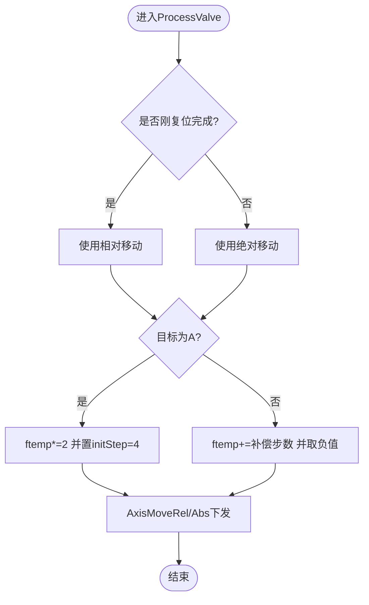
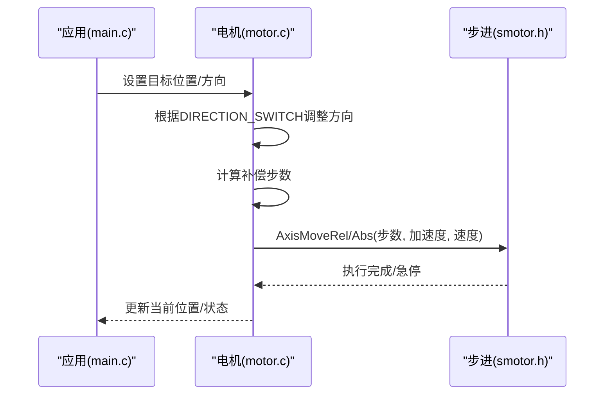
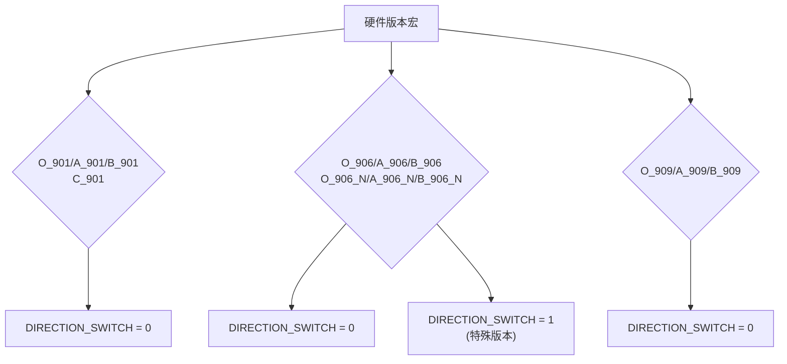
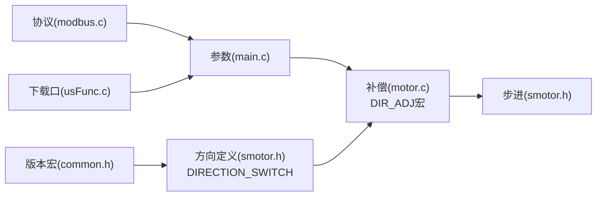

# 方向补偿机制

<cite>
**本文引用的文件**
- [motor.c](file://SRC/HARDWARE/motor/motor.c)
- [motor.h](file://SRC/HARDWARE/motor/motor.h)
- [smotor.h](file://SRC/HARDWARE/motor/smotor.h)
- [main.c](file://SRC/APP/main.c)
- [main.h](file://SRC/APP/main.h)
- [common.h](file://SRC/APP/common.h)
- [modbus.c](file://SRC/HARDWARE/modbus/modbus.c)
- [usFunc.c](file://SRC/HARDWARE/usinterface/usFunc.c)
</cite>

## 更新摘要
**变更内容**
- 新增DIRECTION_SWITCH宏系统，提供条件编译支持不同硬件配置的方向处理机制
- 更新方向补偿算法以适应不同的硬件方向定义
- 增强了硬件兼容性和配置灵活性

## 目录
1. [简介](#简介)
2. [项目结构](#项目结构)
3. [核心组件](#核心组件)
4. [架构总览](#架构总览)
5. [详细组件分析](#详细组件分析)
6. [DIRECTION_SWITCH宏系统](#direction_switch宏系统)
7. [依赖关系分析](#依赖关系分析)
8. [性能考量](#性能考量)
9. [故障排查指南](#故障排查指南)
10. [结论](#结论)
11. [附录](#附录)

## 简介
本文件围绕通用阀门开关器中的"方向补偿机制"展开，系统性阐述其工作原理、实现细节与工程应用。重点内容包括：
- 方向补偿算法的数学模型与步进电机步距角的关系
- 补偿角度计算、补偿步数转换与补偿精度控制
- A-B与B-A方向的补偿策略差异与实现路径
- DIRECTION_SWITCH宏系统对硬件配置的支持
- 补偿参数的配置方法、调优流程与测试验证
- 故障诊断与性能优化建议

## 项目结构
该方向补偿机制位于硬件层的电机控制模块与应用层的参数初始化、协议交互之间，形成"参数存储—参数加载—补偿计算—步进控制"的闭环。



**图示来源**
- [main.c:222-429](file://SRC/APP/main.c#L222-L429)
- [motor.c:73-351](file://SRC/HARDWARE/motor/motor.c#L73-L351)
- [motor.h:198-224](file://SRC/HARDWARE/motor/motor.h#L198-L224)
- [smotor.h:10-95](file://SRC/HARDWARE/motor/smotor.h#L10-L95)
- [common.h:49-133](file://SRC/APP/common.h#L49-L133)
- [modbus.c:583-749](file://SRC/HARDWARE/modbus/modbus.c#L583-L749)
- [usFunc.c:180-202](file://SRC/HARDWARE/usinterface/usFunc.c#L180-L202)

**章节来源**
- [main.c:222-429](file://SRC/APP/main.c#L222-L429)
- [motor.c:73-351](file://SRC/HARDWARE/motor/motor.c#L73-L351)
- [motor.h:198-224](file://SRC/HARDWARE/motor/motor.h#L198-L224)
- [smotor.h:10-95](file://SRC/HARDWARE/motor/smotor.h#L10-L95)
- [common.h:49-133](file://SRC/APP/common.h#L49-L133)
- [modbus.c:583-749](file://SRC/HARDWARE/modbus/modbus.c#L583-L749)
- [usFunc.c:180-202](file://SRC/HARDWARE/usinterface/usFunc.c#L180-L202)

## 核心组件
- 参数结构与补偿字段
  - 方向补偿字段：fix.dirGap（单位0.1度）
  - 步进参数：stepRound、stepP1dgr、stepP01dgr（每度/每0.1度步数）
- 运行时控制流
  - 初始化阶段：根据光耦状态与上次位置选择方向与步数
  - 运行阶段：根据目标位置与方向计算补偿步数并下发步进控制
  - DIRECTION_SWITCH宏：统一处理不同硬件配置的方向定义
- 协议与下载口
  - Modbus/AGS协议写入/读取方向补偿
  - 下载口指令设置方向补偿

**章节来源**
- [motor.h:198-224](file://SRC/HARDWARE/motor/motor.h#L198-L224)
- [motor.h:112-148](file://SRC/HARDWARE/motor/motor.h#L112-L148)
- [motor.c:275-351](file://SRC/HARDWARE/motor/motor.c#L275-L351)
- [common.h:49-133](file://SRC/APP/common.h#L49-L133)
- [modbus.c:746-747](file://SRC/HARDWARE/modbus/modbus.c#L746-L747)
- [usFunc.c:180-202](file://SRC/HARDWARE/usinterface/usFunc.c#L180-L202)

## 架构总览
方向补偿贯穿"参数加载—补偿计算—步进执行"的全链路，新增的DIRECTION_SWITCH宏系统提供了硬件兼容性支持：



**图示来源**
- [modbus.c:746-747](file://SRC/HARDWARE/modbus/modbus.c#L746-L747)
- [usFunc.c:180-202](file://SRC/HARDWARE/usinterface/usFunc.c#L180-L202)
- [main.c:222-429](file://SRC/APP/main.c#L222-L429)
- [motor.c:275-351](file://SRC/HARDWARE/motor/motor.c#L275-L351)
- [common.h:49-133](file://SRC/APP/common.h#L49-L133)
- [smotor.h:89-95](file://SRC/HARDWARE/motor/smotor.h#L89-L95)

## 详细组件分析

### 方向补偿算法与数学模型
- 步进电机步距角与细分
  - 每圈步数：stepRound = P_ROUND × SCALE × rate
  - 每度步数：stepP1dgr = stepRound / 360
  - 每0.1度步数：stepP01dgr = stepRound / 3600
- 补偿步数计算
  - 补偿步数 = fix.dirGap × stepP01dgr（fix.dirGap单位为0.1度）
  - 在B-A方向切换时叠加补偿步数；在A-B方向切换时按比例缩放并取负值以适配方向
- 方向差异与实现
  - DIRECTION_SWITCH宏影响方向定义与实际走位方向
  - A-B方向：ftemp *= 2，随后加上补偿步数并取负值（或正值，视方向定义）
  - B-A方向：ftemp += 补偿步数，再乘以系数并取负值（或正值）



**图示来源**
- [motor.c:275-351](file://SRC/HARDWARE/motor/motor.c#L275-L351)
- [motor.h:112-148](file://SRC/HARDWARE/motor/motor.h#L112-L148)

**章节来源**
- [motor.c:275-351](file://SRC/HARDWARE/motor/motor.c#L275-L351)
- [motor.h:112-148](file://SRC/HARDWARE/motor/motor.h#L112-L148)
- [smotor.h:20-31](file://SRC/HARDWARE/motor/smotor.h#L20-L31)

### 补偿参数配置与调优
- 参数来源与默认值
  - 默认原点补偿：valveFixDflt
  - 默认方向补偿：valveFixDir（通常为0）
  - 参数通过EEPROM读取/写入，支持Modbus/AGS与下载口指令
- 配置入口
  - 应用层参数初始化：ParameterInit
  - 协议写入：mb_WriteHolding → 写入方向补偿寄存器
  - 下载口指令：TermFixG（FIXG）读/写方向补偿
- 调优建议
  - 先进行A-B与B-A双向切换测试，记录误差
  - 以0.1度为步进增量逐步调整fix.dirGap，观察定位精度
  - 结合半通道与通道数设置，评估补偿一致性

**章节来源**
- [main.c:222-429](file://SRC/APP/main.c#L222-L429)
- [modbus.c:746-747](file://SRC/HARDWARE/modbus/modbus.c#L746-L747)
- [usFunc.c:180-202](file://SRC/HARDWARE/usinterface/usFunc.c#L180-L202)

### 补偿精度控制与步数转换
- 精度来源
  - 步进分辨率：由stepP01dgr决定（每0.1度步数）
  - 补偿粒度：fix.dirGap以0.1度为单位
- 转换关系
  - 补偿步数 = fix.dirGap × stepP01dgr
  - 单通道步数 = stepRound / portCnt（portCnt来自参数）
- 精度影响
  - 0.1度对应步数越小，定位越精细；但过小可能受机械间隙与传感器分辨率限制
  - 建议结合实际机械回差与光耦检测精度进行校准

**章节来源**
- [motor.h:198-224](file://SRC/HARDWARE/motor/motor.h#L198-L224)
- [motor.c:275-351](file://SRC/HARDWARE/motor/motor.c#L275-L351)

### 不同工况下的补偿策略
- A-B方向（B→A）
  - 将目标通道步数放大2倍，随后叠加补偿步数，并根据方向定义取负值
  - 适用于快速定位与减少空程
- B-A方向（A→B）
  - 在单通道步数基础上叠加补偿步数，再按比例缩放并取负值
  - 用于补偿机械反向间隙与传感器滞后
- 半通道场景
  - 若启用半通道，补偿步数按一半处理，避免过度补偿

**章节来源**
- [motor.c:289-318](file://SRC/HARDWARE/motor/motor.c#L289-L318)
- [motor.c:285-300](file://SRC/HARDWARE/motor/motor.c#L285-L300)

### 与步进电机步距角的关系
- 步距角与细分
  - 实际步数 = 设定步数 × SCALE（细分系数）
  - 每度步数 = (P_ROUND × SCALE × rate) / 360
- 补偿与步距角
  - 补偿以"每0.1度步数"为基准，直接与步进分辨率耦合
  - 更高的细分与更小的减速比可提升补偿分辨率，但需平衡响应速度与噪声

**章节来源**
- [motor.h:109](file://SRC/HARDWARE/motor/motor.h#L109)
- [motor.h:137-148](file://SRC/HARDWARE/motor/motor.h#L137-L148)
- [motor.c:284-296](file://SRC/HARDWARE/motor/motor.c#L284-L296)

### API与控制流程
- 步进控制接口
  - AxisMoveRel/AxisMoveAbs：相对/绝对移动
  - 方向控制：DIR/CW/CCW与DIRECTION_SWITCH配合
- 控制序列
  - 参数加载 → 计算补偿步数 → 选择相对/绝对移动 → 执行并等待到位 → 更新状态



**图示来源**
- [motor.c:275-351](file://SRC/HARDWARE/motor/motor.c#L275-L351)
- [smotor.h:89-95](file://SRC/HARDWARE/motor/smotor.h#L89-L95)

## DIRECTION_SWITCH宏系统

### 宏系统概述
DIRECTION_SWITCH宏系统是本次更新的核心特性，提供了条件编译支持不同硬件配置的方向处理机制。该系统通过预处理器宏定义实现了硬件兼容性的统一管理。

### 宏定义与版本映射
系统根据不同的硬件版本宏自动设置DIRECTION_SWITCH值：



**图示来源**
- [common.h:49-133](file://SRC/APP/common.h#L49-L133)

### 方向常量定义
基于DIRECTION_SWITCH的值，系统定义不同的方向常量：

| DIRECTION_SWITCH值 | CW定义 | CCW定义 | 方向说明 |
|-------------------|--------|---------|----------|
| 0 | 0（顺时针） | 1（逆时针） | 标准方向定义 |
| 1 | 1（顺时针） | 0（逆时针） | 反向方向定义 |

### DIR_ADJ宏处理
系统使用DIR_ADJ宏统一处理方向补偿：

```c
/* 方向系数宏：根据DIRECTION_SWITCH统一处理电机方向正负 */
#if DIRECTION_SWITCH == 1
#define DIR_ADJ(steps) (steps) /* DIRECTION_SWITCH=1时，直接使用原始方向 */
#else
#define DIR_ADJ(steps) (-(steps)) /* DIRECTION_SWITCH=0时，方向整体取反 */
#endif
```

### 硬件兼容性
DIRECTION_SWITCH宏系统确保了：
- **硬件一致性**：不同硬件版本使用统一的方向处理逻辑
- **配置灵活性**：通过宏定义轻松切换硬件配置
- **代码复用**：减少重复代码，提高维护效率

**章节来源**
- [common.h:49-133](file://SRC/APP/common.h#L49-L133)
- [motor.c:80-86](file://SRC/HARDWARE/motor/motor.c#L80-L86)
- [smotor.h:20-31](file://SRC/HARDWARE/motor/smotor.h#L20-L31)

## 依赖关系分析
- 参数依赖
  - 方向补偿依赖：fix.dirGap、stepP01dgr、portCnt、rate、SCALE
  - DIRECTION_SWITCH宏：影响方向定义与补偿计算
- 控制依赖
  - 方向定义依赖：DIRECTION_SWITCH、CW/CCW常量
- 协议依赖
  - Modbus/AGS写入/读取方向补偿寄存器
  - 下载口FIXG指令



**图示来源**
- [main.c:222-429](file://SRC/APP/main.c#L222-L429)
- [motor.c:275-351](file://SRC/HARDWARE/motor/motor.c#L275-L351)
- [smotor.h:20-31](file://SRC/HARDWARE/motor/smotor.h#L20-L31)
- [common.h:49-133](file://SRC/APP/common.h#L49-L133)
- [modbus.c:746-747](file://SRC/HARDWARE/modbus/modbus.c#L746-L747)
- [usFunc.c:180-202](file://SRC/HARDWARE/usinterface/usFunc.c#L180-L202)

**章节来源**
- [main.c:222-429](file://SRC/APP/main.c#L222-L429)
- [motor.c:275-351](file://SRC/HARDWARE/motor/motor.c#L275-L351)
- [smotor.h:20-31](file://SRC/HARDWARE/motor/smotor.h#L20-L31)
- [common.h:49-133](file://SRC/APP/common.h#L49-L133)
- [modbus.c:746-747](file://SRC/HARDWARE/modbus/modbus.c#L746-L747)
- [usFunc.c:180-202](file://SRC/HARDWARE/usinterface/usFunc.c#L180-L202)

## 性能考量
- 分辨率与稳定性
  - 提升细分与减速比可提高分辨率，但会增加响应延迟与发热
- 速度与加速度
  - 补偿步数应与速度/加速度匹配，避免因补偿步数过大导致过冲或振动
- 机械回差与传感器分辨率
  - 补偿值应基于实测修正，避免过度补偿造成反复微调
- DIRECTION_SWITCH影响
  - 不同硬件配置下的方向处理差异需要统一测试验证
  - 宏定义切换时需确保硬件接线与软件定义一致

## 故障排查指南
- 症状：切换不到位或反复抖动
  - 检查fix.dirGap是否过小或过大
  - 核对DIRECTION_SWITCH与硬件接线方向一致
  - 验证DIR_ADJ宏在不同版本下的行为
- 症状：A-B与B-A误差不一致
  - 对比A-B与B-A的补偿步数计算路径，确认系数与符号
  - 检查DIRECTION_SWITCH宏定义是否正确
- 症状：初始化阶段误判光耦状态
  - 检查OPT_GAP/OPT_BLOCKER判定逻辑与硬件接线
- 症状：参数写入后未生效
  - 确认EEPROM写入成功与ParameterInit正确加载
- 症状：版本切换后方向异常
  - 检查common.h中的版本宏定义
  - 验证DIRECTION_SWITCH值与硬件配置匹配

**章节来源**
- [motor.c:97-156](file://SRC/HARDWARE/motor/motor.c#L97-L156)
- [motor.c:275-351](file://SRC/HARDWARE/motor/motor.c#L275-L351)
- [main.c:222-429](file://SRC/APP/main.c#L222-L429)
- [common.h:49-133](file://SRC/APP/common.h#L49-L133)

## 结论
方向补偿机制通过"参数化补偿+步进步数转换+方向适配"的方式，在A-B与B-A两种工况下实现高精度定位。新增的DIRECTION_SWITCH宏系统进一步增强了硬件兼容性，通过条件编译支持不同硬件配置的方向处理。其实现依赖于步进电机的步距角、细分与减速比，以及方向定义的一致性。通过合理的参数配置与实测调优，可显著提升阀门定位准确性与系统稳定性。

## 附录

### 补偿参数表
- 参数项
  - 方向补偿 FIXG：单位0.1度（来自EEPROM）
  - 每0.1度步数 stepP01dgr：由减速比与细分决定
  - 单通道步数：stepRound / portCnt
  - DIRECTION_SWITCH：硬件方向配置宏
- 关键公式
  - 补偿步数 = fix.dirGap × stepP01dgr
  - A-B方向步数 = (单通道步数 × 2) ± 补偿步数（取负值）
  - B-A方向步数 = 单通道步数 + 补偿步数（取负值）
  - DIR_ADJ宏：根据DIRECTION_SWITCH调整方向符号

**章节来源**
- [motor.h:198-224](file://SRC/HARDWARE/motor/motor.h#L198-L224)
- [motor.c:284-318](file://SRC/HARDWARE/motor/motor.c#L284-L318)
- [common.h:49-133](file://SRC/APP/common.h#L49-L133)

### DIRECTION_SWITCH配置指南
- 版本宏与DIRECTION_SWITCH映射
  - O_901/A_901/B_901/C_901：DIRECTION_SWITCH = 0
  - O_906/A_906/B_906：DIRECTION_SWITCH = 0
  - O_906_N/A_906_N/B_906_N：DIRECTION_SWITCH = 1
  - O_909/A_909/B_909：DIRECTION_SWITCH = 0
- 配置验证
  - 编译时检查DIRECTION_SWITCH值
  - 运行时验证方向常量定义
  - 硬件接线与软件定义一致性检查

### 精度测试方法
- 测试步骤
  - 在A-B与B-A方向各进行多次往返切换，记录定位偏差
  - 以0.1度为增量调整fix.dirGap，观察偏差变化趋势
  - 在不同速度/加速度下重复测试，评估稳定性
  - 验证DIRECTION_SWITCH在不同硬件版本下的表现
- 数据记录
  - 记录每次测试的fix.dirGap、偏差均值与标准差
  - 对比补偿前后定位精度改善情况
  - 记录不同DIRECTION_SWITCH值下的性能差异

### 故障诊断清单
- 参数类
  - EEPROM读写是否成功
  - 参数加载顺序与范围检查
- 控制类
  - 方向定义与硬件接线是否一致
  - 步进控制接口调用是否正确
  - DIRECTION_SWITCH宏定义验证
- 机械类
  - 传感器状态判定是否稳定
  - 机械回差与负载变化对补偿效果的影响
- 版本兼容类
  - 硬件版本宏定义正确性
  - DIRECTION_SWITCH值与硬件配置匹配度
  - 不同版本间的兼容性测试