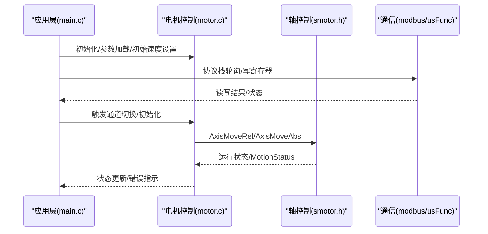
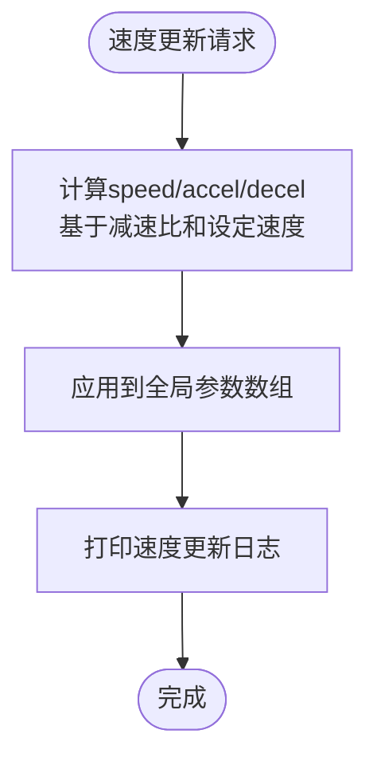
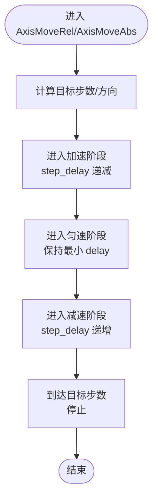
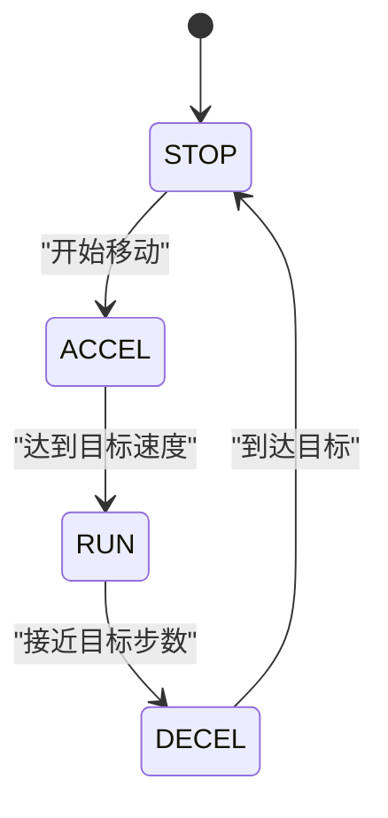
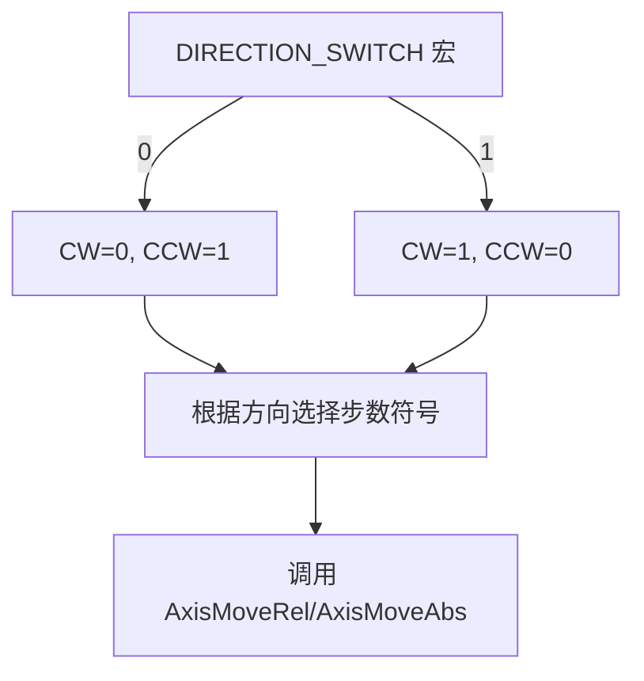
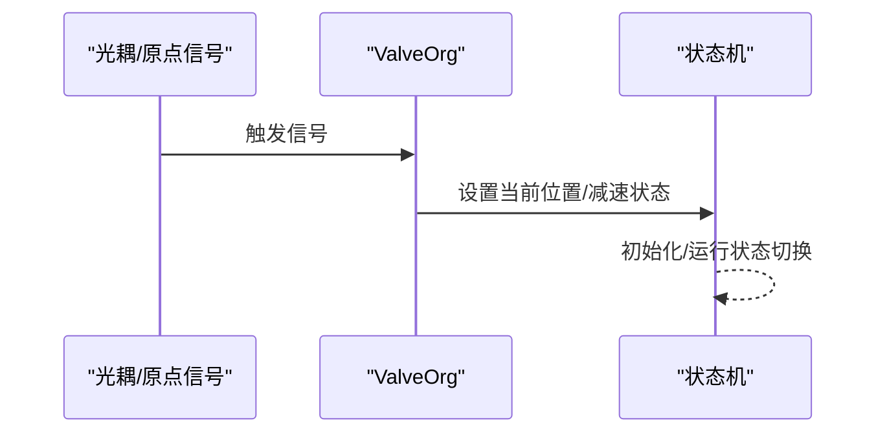
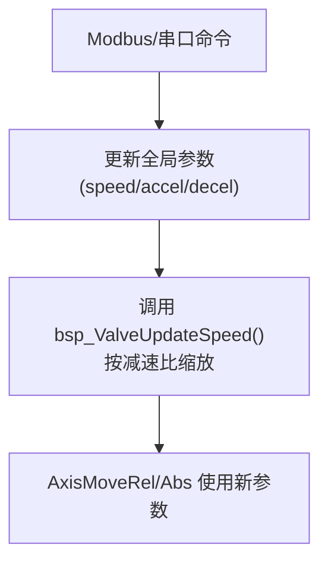
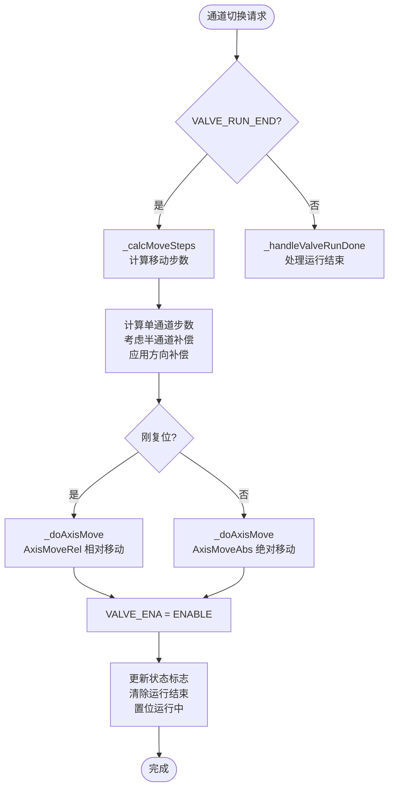
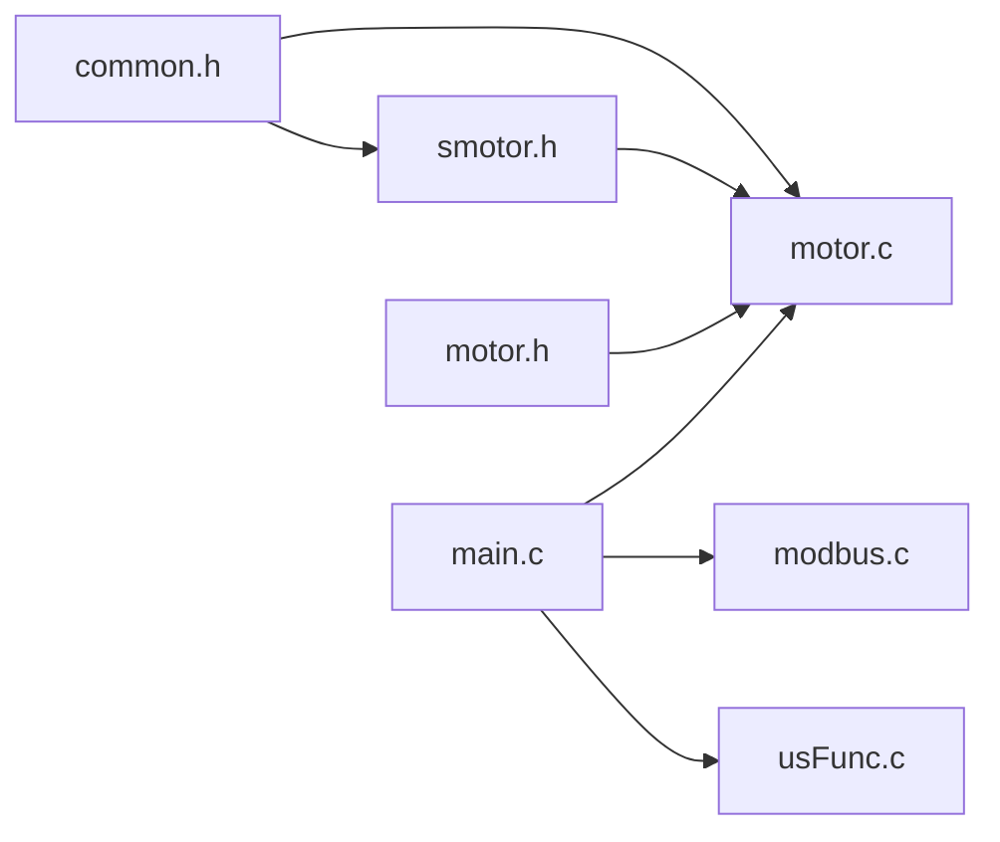

# 电机控制操作

<cite>
**本文引用的文件**
- [motor.c](file://SRC/HARDWARE/motor/motor.c)
- [motor.h](file://SRC/HARDWARE/motor/motor.h)
- [smotor.h](file://SRC/HARDWARE/motor/smotor.h)
- [main.c](file://SRC/APP/main.c)
- [common.h](file://SRC/APP/common.h)
- [modbus.c](file://SRC/HARDWARE/modbus/modbus.c)
- [modbus.h](file://SRC/HARDWARE/modbus/modbus.h)
- [usFunc.c](file://SRC/HARDWARE/usinterface/usFunc.c)
</cite>

## 更新摘要
**变更内容**
- 新增统一速度更新函数 bsp_ValveUpdateSpeed()，提供更清晰的API接口
- 完善模块化架构分析，详细说明计算步数、执行移动和状态处理的职责分离
- 更新相对移动与绝对移动控制的实现细节
- 增强状态监控与反馈机制的说明
- 完善参数动态调整与实时优化的实现方案

## 目录
1. [简介](#简介)
2. [项目结构](#项目结构)
3. [核心组件](#核心组件)
4. [架构总览](#架构总览)
5. [详细组件分析](#详细组件分析)
6. [模块化架构设计](#模块化架构设计)
7. [依赖关系分析](#依赖关系分析)
8. [性能考量](#性能考量)
9. [故障排查指南](#故障排查指南)
10. [结论](#结论)
11. [附录](#附录)

## 简介
本文件面向电机控制操作，围绕相对移动与绝对移动控制方法展开，重点解析 AxisMoveRel 与 AxisMoveAbs 的实现原理与使用场景；阐述加速度曲线与速度控制策略（加速、匀速、减速）；说明方向切换机制及 DIRECTION_SWITCH 宏的作用；介绍状态监控与反馈；描述参数动态调整与实时优化；提供编程示例与最佳实践，并给出故障诊断与性能调优建议。

**更新** 本版本特别关注新的模块化架构设计和统一速度更新函数，展示了计算步数、执行移动和状态处理的职责分离，以及通过 bsp_ValveUpdateSpeed() 提供的统一速度管理接口，提高了代码的可读性和可维护性。

## 项目结构
该电机控制位于硬件层 motor 子模块，配合应用层主循环与通信协议栈（AGS/Modbus），通过定时器与GPIO驱动步进电机。关键文件职责如下：
- motor.c/motor.h：电机初始化、初始化流程、运行流程、原点触发、老化测试、统一速度更新
- smotor.h：轴抽象、速度阶跃状态、参数数组、AxisMoveRel/AxisMoveAbs 声明
- main.c：系统初始化、参数加载、协议栈轮询、超时保护、IO控制、初始速度设置
- common.h：版本宏、DIRECTION_SWITCH 宏定义、编译选项
- modbus.c/modbus.h：Modbus协议写入速度/方向/控制寄存器，联动速度参数更新
- usFunc.c：串口终端设置速度接口，范围校验与参数写入

```mermaid
graph TB
subgraph "应用层"
MAIN["main.c<br/>系统初始化/协议轮询/超时保护/初始速度设置"]
END
subgraph "硬件层"
MOTOR["motor.c/.h<br/>初始化/运行/原点/老化/统一速度更新"]
SMOTOR["smotor.h<br/>轴抽象/速度阶跃状态/函数声明"]
END
subgraph "通信协议"
MODBUS["modbus.c/.h<br/>写寄存器更新速度/方向/控制"]
USIF["usFunc.c<br/>串口终端设置速度"]
END
COMMON["common.h<br/>DIRECTION_SWITCH/版本宏"]
MAIN --> MOTOR
MAIN --> MODBUS
MAIN --> USIF
MOTOR --> SMOTOR
MODBUS --> MOTOR
USIF --> MOTOR
COMMON --> MOTOR
COMMON --> SMOTOR
```

**图表来源**
- [main.c:285-290](file://SRC/APP/main.c#L285-L290)
- [motor.c:109-116](file://SRC/HARDWARE/motor/motor.c#L109-L116)
- [smotor.h:67-96](file://SRC/HARDWARE/motor/smotor.h#L67-L96)
- [modbus.c:605-607](file://SRC/HARDWARE/modbus/modbus.c#L605-L607)
- [usFunc.c:363-426](file://SRC/HARDWARE/usinterface/usFunc.c#L363-L426)
- [common.h:53-131](file://SRC/APP/common.h#L53-L131)

**章节来源**
- [main.c:285-290](file://SRC/APP/main.c#L285-L290)
- [motor.c:109-116](file://SRC/HARDWARE/motor/motor.c#L109-L116)
- [smotor.h:67-96](file://SRC/HARDWARE/motor/smotor.h#L67-L96)
- [common.h:53-131](file://SRC/APP/common.h#L53-L131)

## 核心组件
- 轴抽象与控制参数
  - srd[AXIS_N]：每个轴的状态机与控制信号指针（方向、时钟、捕获/比较/自动重装/控制寄存器）
  - speed/accel/decel/stpdecel：全局速度、加速度、减速度、急停减速度数组
  - MotionStatus：运动状态标志
- 统一速度更新函数
  - bsp_ValveUpdateSpeed：统一的速度更新接口，替代分散的速度计算逻辑
  - 实现：根据减速比和设定速度计算 speed、accel、decel 参数
- 电机控制函数
  - AxisMoveRel：相对移动（以步数为单位，基于加速度曲线）
  - AxisMoveAbs：绝对移动（以目标位置为基准，基于加速度曲线）
- 初始化与运行流程
  - InitValve：原点寻找、半通道复位、方向补偿、初始化完成后的参数恢复
  - ProcessValve：通道切换的相对/绝对移动决策与状态机推进
  - ValveOrg：原点/端口光耦触发时的减速与状态切换
  - TestBurn：老化模式下的正反转循环切换
- 参数与宏
  - DIRECTION_SWITCH：统一方向逻辑，兼容不同硬件板型
  - rdc：减速比、每圈步数、每度/每0.1度步数
  - valve：位置、目标、半通道、重试次数、错误指示等

**章节来源**
- [smotor.h:67-96](file://SRC/HARDWARE/motor/smotor.h#L67-L96)
- [motor.h:151-186](file://SRC/HARDWARE/motor/motor.h#L151-L186)
- [motor.c:109-116](file://SRC/HARDWARE/motor/motor.c#L109-L116)
- [motor.c:4-68](file://SRC/HARDWARE/motor/motor.c#L4-L68)
- [motor.c:73-268](file://SRC/HARDWARE/motor/motor.c#L73-L268)
- [motor.c:275-351](file://SRC/HARDWARE/motor/motor.c#L275-L351)
- [motor.c:356-371](file://SRC/HARDWARE/motor/motor.c#L356-L371)
- [motor.c:376-462](file://SRC/HARDWARE/motor/motor.c#L376-L462)

## 架构总览
下图展示从应用层到硬件层的调用链路与交互：



**图表来源**
- [main.c:285-290](file://SRC/APP/main.c#L285-L290)
- [motor.c:275-351](file://SRC/HARDWARE/motor/motor.c#L275-L351)
- [smotor.h:87-96](file://SRC/HARDWARE/motor/smotor.h#L87-L96)
- [modbus.c:605-607](file://SRC/HARDWARE/modbus/modbus.c#L605-L607)
- [usFunc.c:363-426](file://SRC/HARDWARE/usinterface/usFunc.c#L363-L426)

## 详细组件分析

### 统一速度更新函数 bsp_ValveUpdateSpeed
**更新** 新增统一速度更新函数，提供更清晰的API接口，替代分散的速度计算逻辑。

- 函数签名：void bsp_ValveUpdateSpeed(uint8_t _spd)
- 实现原理：
  - speed[AXSV] = 100 * _spd * rdc.rate
  - accel[AXSV] = 100 * _spd * rdc.rate  
  - decel[AXSV] = 200 * _spd * rdc.rate
- 调用时机：
  - 系统初始化时：main.c 中调用 bsp_ValveUpdateSpeed(INIT_SPD)
  - Modbus协议处理：modbus.c 中接收到速度设置时调用
  - 老化模式：motor.c 中老化模式循环时调用
  - 串口终端设置：usFunc.c 中设置速度后调用



**图表来源**
- [motor.c:109-116](file://SRC/HARDWARE/motor/motor.c#L109-L116)
- [main.c:285-286](file://SRC/APP/main.c#L285-L286)
- [modbus.c:605-607](file://SRC/HARDWARE/modbus/modbus.c#L605-L607)
- [usFunc.c:412-413](file://SRC/HARDWARE/usinterface/usFunc.c#L412-L413)

**章节来源**
- [motor.c:109-116](file://SRC/HARDWARE/motor/motor.c#L109-L116)
- [main.c:285-286](file://SRC/APP/main.c#L285-L286)
- [modbus.c:605-607](file://SRC/HARDWARE/modbus/modbus.c#L605-L607)
- [usFunc.c:412-413](file://SRC/HARDWARE/usinterface/usFunc.c#L412-L413)

### 相对移动与绝对移动控制
- AxisMoveRel（相对移动）
  - 输入：轴索引、步数（可正可负）、加速度、减速度、速度
  - 实现要点：根据步数符号确定方向；按加速度曲线逐步缩短周期，达到目标步数后按减速度曲线减速至停止
  - 使用场景：初始化寻位、半通道复位、老化模式正反转
- AxisMoveAbs（绝对移动）
  - 输入：轴索引、目标位置（相对当前位置的步数）、加速度、减速度、速度
  - 实现要点：计算相对步数，结合方向补偿与半通道策略，选择相对或绝对移动路径
  - 使用场景：正常通道切换（A↔B 或 半通道）



**图表来源**
- [smotor.h:67-96](file://SRC/HARDWARE/motor/smotor.h#L67-L96)

**章节来源**
- [motor.c:105-113](file://SRC/HARDWARE/motor/motor.c#L105-L113)
- [motor.c:125-131](file://SRC/HARDWARE/motor/motor.c#L125-L131)
- [motor.c:169-179](file://SRC/HARDWARE/motor/motor.c#L169-L179)
- [motor.c:302-318](file://SRC/HARDWARE/motor/motor.c#L302-L318)
- [motor.c:433-455](file://SRC/HARDWARE/motor/motor.c#L433-L455)

### 加速、匀速与减速控制策略
- 速度阶跃状态
  - STOP/ACCEL/RUN/DECEL：四段式速度曲线
  - step_delay：下一时刻定时器延时，加速时递减，减速时递增，匀速时保持最小延时
  - decel_start：开始减速的步数阈值
- 参数来源与缩放
  - speed/accel/decel 由全局数组管理，随减速比与设定速度缩放
  - 初始化时使用较低速度与加速度，提高可靠性



**图表来源**
- [smotor.h:46-50](file://SRC/HARDWARE/motor/smotor.h#L46-L50)
- [smotor.h:67-84](file://SRC/HARDWARE/motor/smotor.h#L67-L84)
- [motor.c:416-425](file://SRC/HARDWARE/motor/motor.c#L416-L425)

**章节来源**
- [smotor.h:46-50](file://SRC/HARDWARE/motor/smotor.h#L46-L50)
- [smotor.h:67-84](file://SRC/HARDWARE/motor/smotor.h#L67-L84)
- [motor.c:416-425](file://SRC/HARDWARE/motor/motor.c#L416-L425)

### 方向切换机制与 DIRECTION_SWITCH 宏
- DIRECTION_SWITCH 宏
  - 0：程序方向与电机方向一致（CW=0，CCW=1）
  - 1：程序方向与电机方向相反（CW=1，CCW=0）
  - 通过宏控制 CW/CCW 定义与调试提示，统一不同硬件的转向逻辑
- 在初始化与运行中，根据 DIRECTION_SWITCH 选择 AxisMoveRel/AxisMoveAbs 的步数符号，确保机械动作与期望一致



**图表来源**
- [smotor.h:20-31](file://SRC/HARDWARE/motor/smotor.h#L20-L31)
- [motor.c:105-113](file://SRC/HARDWARE/motor/motor.c#L105-L113)
- [motor.c:302-318](file://SRC/HARDWARE/motor/motor.c#L302-L318)

**章节来源**
- [smotor.h:20-31](file://SRC/HARDWARE/motor/smotor.h#L20-L31)
- [motor.c:105-113](file://SRC/HARDWARE/motor/motor.c#L105-L113)
- [motor.c:302-318](file://SRC/HARDWARE/motor/motor.c#L302-L318)
- [common.h:53-131](file://SRC/APP/common.h#L53-L131)

### 电机控制状态监控与反馈
- 状态机与标志
  - VALVE_INITING/VALVE_RUNNING/VALVE_RUN_END/VALVE_RUN_ERR：初始化、运行、结束、错误
  - MotionStatus：各轴运动状态（0=停止，1=运动）
  - 错误闪烁：ErrBlinkTime 控制LED闪烁周期
- 原点与光耦反馈
  - ValveOrg：原点/端口光耦触发时，设置当前位置、减速起始与状态切换
- 超时保护
  - EveryHSec：单次运行/初始化超时检测，超时置错误并停止



**图表来源**
- [motor.c:356-371](file://SRC/HARDWARE/motor/motor.c#L356-L371)
- [motor.c:170-202](file://SRC/HARDWARE/motor/motor.c#L170-L202)
- [main.c:170-202](file://SRC/APP/main.c#L170-L202)

**章节来源**
- [motor.c:356-371](file://SRC/HARDWARE/motor/motor.c#L356-L371)
- [motor.c:170-202](file://SRC/HARDWARE/motor/motor.c#L170-L202)
- [main.c:170-202](file://SRC/APP/main.c#L170-L202)

### 参数动态调整与实时优化
- 速度参数更新
  - Modbus写入速度寄存器：更新全局 speed 数组，随后调用 bsp_ValveUpdateSpeed() 统一处理
  - 串口终端设置速度：范围校验后写入全局参数，然后调用 bsp_ValveUpdateSpeed()
- 减速比与步数换算
  - rdc.rate 决定每度/每0.1度步数，影响步数计算与加速度曲线
- 初始化与运行参数恢复
  - 初始化完成后恢复用户设定的速度/加速度/减速度



**图表来源**
- [modbus.c:605-607](file://SRC/HARDWARE/modbus/modbus.c#L605-L607)
- [usFunc.c:412-413](file://SRC/HARDWARE/usinterface/usFunc.c#L412-L413)
- [motor.c:246-256](file://SRC/HARDWARE/motor/motor.c#L246-L256)

**章节来源**
- [modbus.c:605-607](file://SRC/HARDWARE/modbus/modbus.c#L605-L607)
- [usFunc.c:412-413](file://SRC/HARDWARE/usinterface/usFunc.c#L412-L413)
- [motor.c:246-256](file://SRC/HARDWARE/motor/motor.c#L246-L256)

### 编程示例与最佳实践
- 示例一：初始化寻位（相对移动）
  - 场景：根据光耦信号判断方向，相对移动一圈或半圈，再进入减速与定位
  - 关键点：结合 DIRECTION_SWITCH 选择步数符号；初始化阶段使用较低速度/加速度
  - 参考路径：[motor.c:97-156](file://SRC/HARDWARE/motor/motor.c#L97-L156)
- 示例二：通道切换（相对/绝对）
  - 场景：从当前位置到目标位置，若刚复位则用相对移动，否则用绝对移动
  - 关键点：半通道时步数折半；方向补偿与减速起始
  - 参考路径：[motor.c:275-351](file://SRC/HARDWARE/motor/motor.c#L275-L351)
- 示例三：老化模式（正反转）
  - 场景：固定间隔正反转各一圈，累计切换次数
  - 关键点：使用 AxisMoveRel 相对移动一圈；注意方向切换宏
  - 参考路径：[motor.c:376-462](file://SRC/HARDWARE/motor/motor.c#L376-L462)
- 最佳实践
  - 明确 DIRECTION_SWITCH，确保方向一致性
  - 初始化阶段降低速度/加速度，提高可靠性
  - 半通道与方向补偿需与机械结构匹配
  - 通过 Modbus/串口动态调整速度，注意范围校验
  - 使用统一的 bsp_ValveUpdateSpeed() 函数管理速度参数

**章节来源**
- [motor.c:97-156](file://SRC/HARDWARE/motor/motor.c#L97-L156)
- [motor.c:275-351](file://SRC/HARDWARE/motor/motor.c#L275-L351)
- [motor.c:376-462](file://SRC/HARDWARE/motor/motor.c#L376-L462)
- [modbus.c:605-607](file://SRC/HARDWARE/modbus/modbus.c#L605-L607)
- [usFunc.c:363-426](file://SRC/HARDWARE/usinterface/usFunc.c#L363-L426)

## 模块化架构设计

**更新** 新的模块化架构通过职责分离显著提升了代码质量。motor.c 中引入了三个关键的静态函数来处理不同的控制职责，同时新增了统一的速度更新管理。

### 计算步数函数 (_calcMoveSteps)
- 职责：计算通道切换所需的移动步数
- 功能特性：
  - 基于减速比和通道数计算单通道切换步数
  - 处理半通道补偿（当刚复位且启用半通道时步数减半）
  - 实现方向补偿（A→B时增加方向间隙补偿，B→A时使用倍数并设置初始化步骤）
- 输入输出：
  - 输入：指向浮点数的指针
  - 输出：计算得到的移动步数（可能为正或负，取决于目标方向）

### 执行移动函数 (_doAxisMove)
- 职责：根据计算结果执行实际的电机移动
- 功能特性：
  - 区分刚复位和非刚复位两种情况
  - 刚复位时使用相对移动（AxisMoveRel）
  - 非刚复位时使用绝对移动（AxisMoveAbs）
  - 根据 DIRECTION_SWITCH 宏正确设置步数符号
- 参数传递：
  - 接收 _calcMoveSteps 计算出的步数
  - 调用相应的移动函数并传入当前速度参数

### 状态处理器函数
- _handleValveIdle：处理阀门空闲状态
  - 计算移动步数
  - 启用电机
  - 执行移动
  - 更新状态标志
- _handleValveRunDone：处理运行结束状态
  - 光耦信号异常检测
  - 更新当前位置
  - 保存状态到EEPROM
  - 清理状态标志



**图表来源**
- [motor.c:321-338](file://SRC/HARDWARE/motor/motor.c#L321-L338)
- [motor.c:340-363](file://SRC/HARDWARE/motor/motor.c#L340-L363)
- [motor.c:368-392](file://SRC/HARDWARE/motor/motor.c#L368-L392)
- [motor.c:397-420](file://SRC/HARDWARE/motor/motor.c#L397-L420)

**章节来源**
- [motor.c:321-338](file://SRC/HARDWARE/motor/motor.c#L321-L338)
- [motor.c:340-363](file://SRC/HARDWARE/motor/motor.c#L340-L363)
- [motor.c:368-392](file://SRC/HARDWARE/motor/motor.c#L368-L392)
- [motor.c:397-420](file://SRC/HARDWARE/motor/motor.c#L397-L420)

## 依赖关系分析
- 应用层依赖
  - main.c 依赖 motor.c、modbus.c、usFunc.c、common.h
- 硬件层依赖
  - motor.c 依赖 smotor.h、motor.h、common.h
- 参数与宏
  - DIRECTION_SWITCH 在 common.h 中按版本宏定义，影响 smotor.h 与 motor.c 的行为



**图表来源**
- [common.h:53-131](file://SRC/APP/common.h#L53-L131)
- [smotor.h:67-96](file://SRC/HARDWARE/motor/smotor.h#L67-L96)
- [motor.c:4-68](file://SRC/HARDWARE/motor/motor.c#L4-L68)
- [motor.h:151-186](file://SRC/HARDWARE/motor/motor.h#L151-L186)
- [main.c:433-494](file://SRC/APP/main.c#L433-L494)

**章节来源**
- [common.h:53-131](file://SRC/APP/common.h#L53-L131)
- [smotor.h:67-96](file://SRC/HARDWARE/motor/smotor.h#L67-L96)
- [motor.c:4-68](file://SRC/HARDWARE/motor/motor.c#L4-L68)
- [motor.h:151-186](file://SRC/HARDWARE/motor/motor.h#L151-L186)
- [main.c:433-494](file://SRC/APP/main.c#L433-L494)

## 性能考量
- 加速度曲线与步数换算
  - 依据减速比与每度步数，合理设置 accel/decel，避免过大的加速度导致失步或冲击
- 速度缩放
  - speed/accel/decel 乘以减速比与设定速度，确保在不同减速比下速度一致性
- 定时器精度
  - step_delay 的精度直接影响速度曲线平滑性，需保证定时器中断稳定
- 半通道与方向补偿
  - 半通道步数折半与方向补偿需与机械结构匹配，减少定位误差
- **模块化优势**
  - 职责分离提高了代码的可维护性和可测试性
  - 静态函数封装了内部逻辑，减少了全局变量的使用
- **统一速度更新优势**
  - bsp_ValveUpdateSpeed() 提供单一入口，确保速度参数的一致性
  - 替代分散的速度计算逻辑，减少重复代码

## 故障排查指南
- 初始化失败/找不到原点
  - 检查光耦信号与方向判断逻辑；确认 DIRECTION_SWITCH 与硬件一致
  - 参考：[motor.c:97-156](file://SRC/HARDWARE/motor/motor.c#L97-L156)
- 运行超时/堵转保护
  - EveryHSec 超时保护会置错误并停止；检查负载与加速度设置
  - 参考：[main.c:170-202](file://SRC/APP/main.c#L170-L202)
- 通道切换异常
  - 检查 ProcessValve 中相对/绝对移动选择与方向补偿；确认 MotionStatus 与状态标志
  - 参考：[motor.c:275-351](file://SRC/HARDWARE/motor/motor.c#L275-L351)
- 老化模式不工作
  - 确认老化地址与协议类型；检查 AxisMoveRel 的方向与步数
  - 参考：[motor.c:376-462](file://SRC/HARDWARE/motor/motor.c#L376-L462)
- 速度参数未生效
  - 检查 Modbus/串口写入是否成功；确认 bsp_ValveUpdateSpeed() 调用链
  - 参考：[modbus.c:605-607](file://SRC/HARDWARE/modbus/modbus.c#L605-L607)，[usFunc.c:412-413](file://SRC/HARDWARE/usinterface/usFunc.c#L412-L413)
- **模块化相关问题**
  - 检查 _calcMoveSteps 的步数计算是否正确
  - 验证 _doAxisMove 的移动类型选择逻辑
  - 确认状态处理器函数的状态标志更新
- **统一速度更新问题**
  - 检查 bsp_ValveUpdateSpeed() 的调用时机和参数传递
  - 验证速度参数缩放计算的正确性
  - 确认减速比 rdc.rate 的设置是否正确

**章节来源**
- [motor.c:97-156](file://SRC/HARDWARE/motor/motor.c#L97-L156)
- [main.c:170-202](file://SRC/APP/main.c#L170-L202)
- [motor.c:275-351](file://SRC/HARDWARE/motor/motor.c#L275-L351)
- [motor.c:376-462](file://SRC/HARDWARE/motor/motor.c#L376-L462)
- [modbus.c:605-607](file://SRC/HARDWARE/modbus/modbus.c#L605-L607)
- [usFunc.c:412-413](file://SRC/HARDWARE/usinterface/usFunc.c#L412-L413)

## 结论
本文系统梳理了电机控制的相对/绝对移动、加速度曲线与速度控制策略、方向切换机制与 DIRECTION_SWITCH 宏、状态监控与反馈、参数动态调整与实时优化，并提供了编程示例与故障排查指南。**更新** 新的模块化架构通过计算步数、执行移动和状态处理的职责分离，显著提升了代码的可读性和可维护性。新增的统一速度更新函数 bsp_ValveUpdateSpeed() 提供了更清晰的API接口，替代了分散的速度计算逻辑，确保了速度参数的一致性。实际部署中应结合具体硬件版本与机械结构，严格校准减速比、半通道与方向补偿，确保安全可靠运行。

## 附录
- 关键宏与常量
  - DIRECTION_SWITCH：0 或 1，决定方向映射
  - RDC01/RDC04/RDC10/RDC16/RDC20：减速比枚举
  - VALVE_INITING/VALVE_RUNNING/VALVE_RUN_END/VALVE_RUN_ERR：状态标志
- 相关路径参考
  - [motor.c:4-68](file://SRC/HARDWARE/motor/motor.c#L4-L68)
  - [motor.c:73-268](file://SRC/HARDWARE/motor/motor.c#L73-L268)
  - [motor.c:109-116](file://SRC/HARDWARE/motor/motor.c#L109-L116)
  - [motor.c:275-351](file://SRC/HARDWARE/motor/motor.c#L275-L351)
  - [motor.c:356-371](file://SRC/HARDWARE/motor/motor.c#L356-L371)
  - [motor.c:376-462](file://SRC/HARDWARE/motor/motor.c#L376-L462)
  - [smotor.h:46-50](file://SRC/HARDWARE/motor/smotor.h#L46-L50)
  - [smotor.h:67-96](file://SRC/HARDWARE/motor/smotor.h#L67-L96)
  - [motor.h:151-186](file://SRC/HARDWARE/motor/motor.h#L151-L186)
  - [main.c:170-202](file://SRC/APP/main.c#L170-L202)
  - [main.c:416-425](file://SRC/APP/main.c#L416-L425)
  - [modbus.c:605-607](file://SRC/HARDWARE/modbus/modbus.c#L605-L607)
  - [usFunc.c:363-426](file://SRC/HARDWARE/usinterface/usFunc.c#L363-L426)
  - [common.h:53-131](file://SRC/APP/common.h#L53-L131)