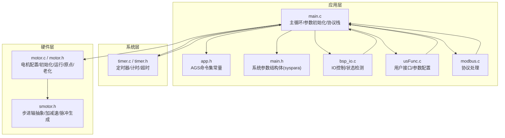
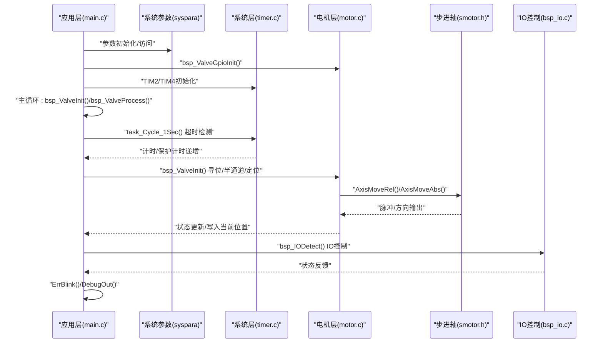
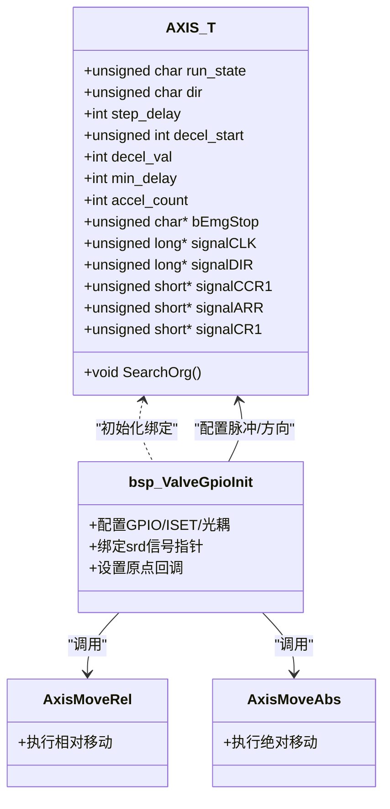
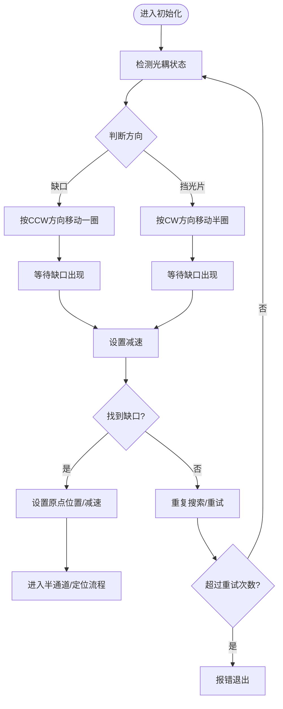
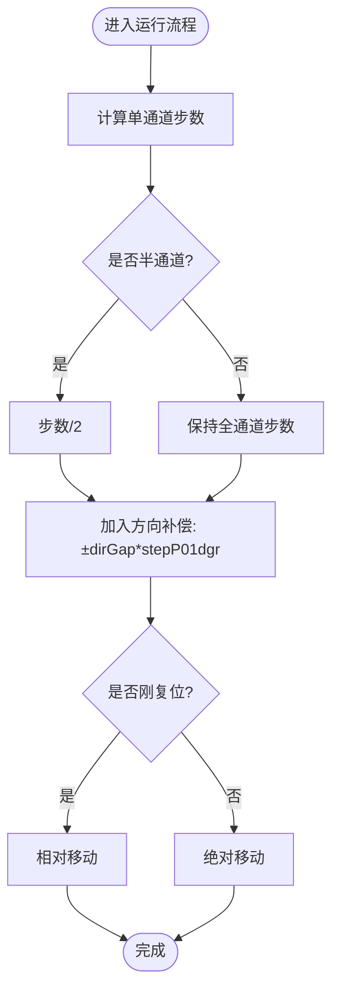
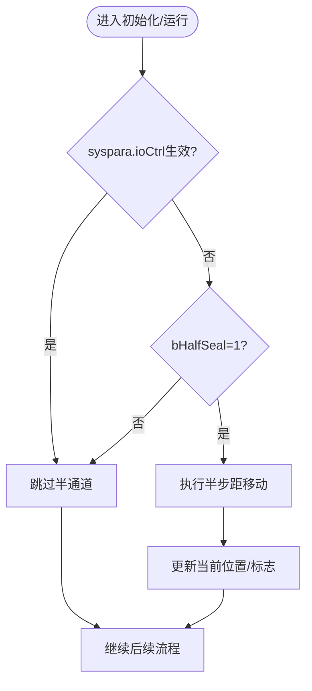
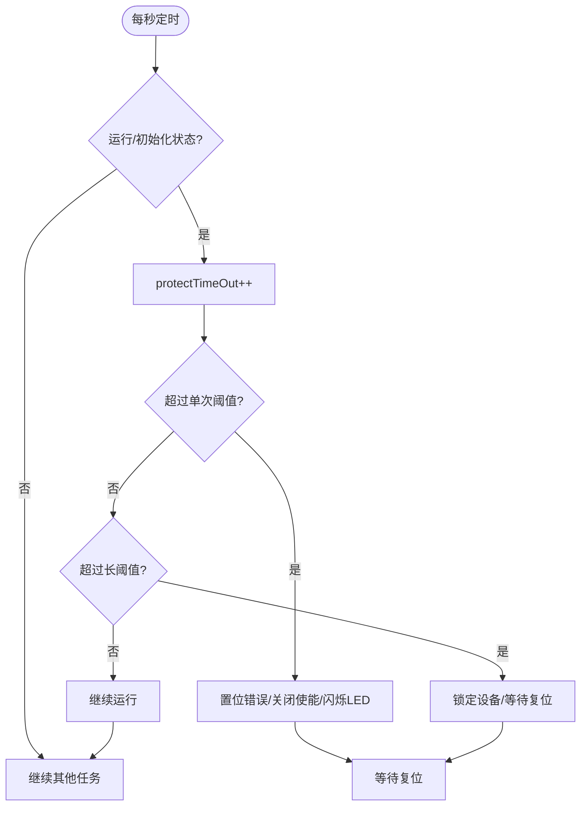
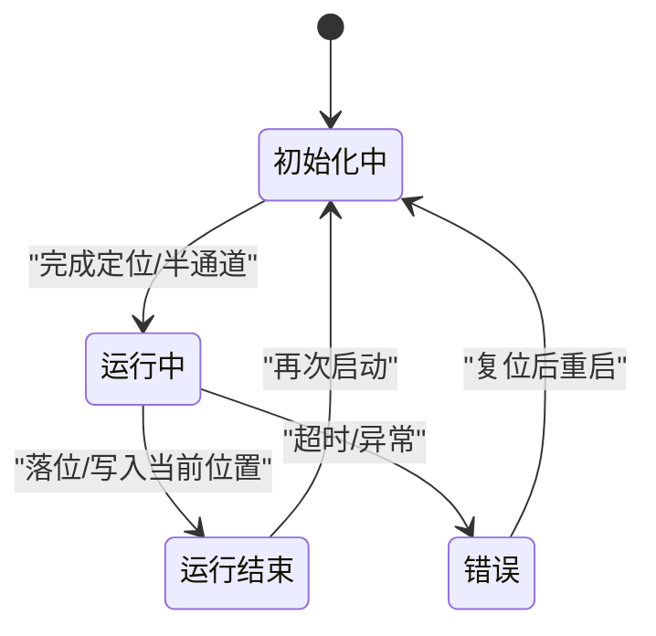
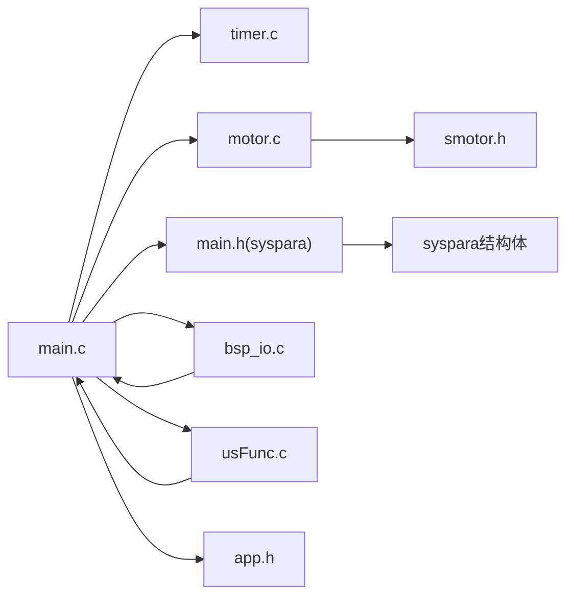

# 电机控制模块

<cite>
**本文引用的文件**
- [motor.c](file://SRC/HARDWARE/motor/motor.c)
- [motor.h](file://SRC/HARDWARE/motor/motor.h)
- [smotor.h](file://SRC/HARDWARE/motor/smotor.h)
- [main.c](file://SRC/APP/main.c)
- [timer.c](file://SRC/SYSTEM/timer/timer.c)
- [timer.h](file://SRC/SYSTEM/timer/timer.h)
- [app.h](file://SRC/APP/app.h)
- [main.h](file://SRC/APP/main.h)
- [usFunc.c](file://SRC/HARDWARE/usinterface/usFunc.c)
- [bsp_io.c](file://SRC/HARDWARE/io/bsp_io.c)
</cite>

## 更新摘要
**变更内容**
- 更新了API命名规范化：所有电机控制函数现在都带有 `bsp_` 前缀，如 `bsp_ValveGpioInit()`, `bsp_ValveInit()`, `bsp_ValveProcess()`, `bsp_ValveOrigin()`, `bsp_ValveAgingMode()`
- 更新了参数访问方式：从全局变量 `bIoCtrl` 和 `intCtrl` 更新为 `syspara.ioCtrl` 和 `syspara.agingInterval`
- 增强了参数管理的类型安全性
- 统一了参数访问接口，提高了代码的一致性
- 改进了调试能力和错误处理机制
- 增强了向后兼容性设计

## 目录
1. [简介](#简介)
2. [项目结构](#项目结构)
3. [核心组件](#核心组件)
4. [架构总览](#架构总览)
5. [详细组件分析](#详细组件分析)
6. [依赖关系分析](#依赖关系分析)
7. [性能考量](#性能考量)
8. [故障诊断与排除](#故障诊断与排除)
9. [结论](#结论)
10. [附录](#附录)

## 简介
本文件面向电机控制工程师，系统性梳理通用开关器项目中"电机控制模块"的硬件接口、控制策略与软件实现，重点覆盖以下主题：
- 步进电机脉冲/方向控制与精确位置控制
- 原点寻找算法（搜索策略、检测机制、定位精度）
- 方向补偿机制（补偿算法、精度控制、误差修正）
- 半通道密封功能（密封策略、压力控制、安全保护）
- 超时保护机制（超时检测、保护动作、恢复策略）
- 电机参数配置与调优方法
- 故障诊断与排除指南

## 项目结构
电机控制模块位于硬件层的 motor 子目录，配合系统层定时器、应用层主循环与参数存储，形成完整的控制闭环。

**图表来源**
- [main.c:300-358](file://SRC/APP/main.c#L300-L358)
- [motor.c:4-70](file://SRC/HARDWARE/motor/motor.c#L4-L70)
- [timer.c:92-99](file://SRC/SYSTEM/timer/timer.c#L92-L99)
- [main.h:227-241](file://SRC/APP/main.h#L227-L241)
- [bsp_io.c:75-95](file://SRC/HARDWARE/io/bsp_io.c#L75-L95)
- [usFunc.c:660-859](file://SRC/HARDWARE/usinterface/usFunc.c#L660-L859)

**章节来源**
- [main.c:300-358](file://SRC/APP/main.c#L300-L358)
- [motor.c:4-70](file://SRC/HARDWARE/motor/motor.c#L4-L70)
- [timer.c:92-99](file://SRC/SYSTEM/timer/timer.c#L92-L99)
- [main.h:227-241](file://SRC/APP/main.h#L227-L241)

## 核心组件
- 电机配置与硬件接口：负责GPIO初始化、ISET电流设置、光耦信号采集、脉冲/方向输出等。
- 步进轴控制：封装加减速、脉冲生成、方向控制、急停等底层细节。
- 初始化与寻位流程：包含原点搜索、方向判定、半通道密封、最终定位与状态更新。
- 运行流程：根据目标位置计算步数、方向补偿、执行相对或绝对移动、落位后写入当前位置。
- 超时保护：基于系统计时器的单次运行/初始化超时检测与保护动作。
- 参数存储与恢复：通过I2C页读写保存/加载地址、补偿、波特率、速度、减速比、半通道等参数。
- **新增** 系统参数管理：通过syspara结构体统一管理IO控制、老化间隔等系统级参数。
- **更新** API命名规范化：所有电机控制函数现在都带有 `bsp_` 前缀，提供一致的接口风格。
- **增强** 调试能力：增加了详细的调试输出和状态监控功能。
- **改进** 错误处理：更好的超时保护和状态管理机制。

**章节来源**
- [motor.h:16-49](file://SRC/HARDWARE/motor/motor.h#L16-L49)
- [motor.h:151-186](file://SRC/HARDWARE/motor/motor.h#L151-L186)
- [smotor.h:67-84](file://SRC/HARDWARE/motor/smotor.h#L67-L84)
- [main.c:342-358](file://SRC/APP/main.c#L342-L358)
- [main.h:227-241](file://SRC/APP/main.h#L227-L241)

## 架构总览
下图展示从应用层到硬件层的关键交互路径，以及超时保护与参数初始化的触发点。

**图表来源**
- [main.c:300-358](file://SRC/APP/main.c#L300-L358)
- [timer.c:22-42](file://SRC/SYSTEM/timer/timer.c#L22-L42)
- [motor.c:75-270](file://SRC/HARDWARE/motor/motor.c#L75-L270)
- [smotor.h:89-95](file://SRC/HARDWARE/motor/smotor.h#L89-L95)
- [main.h:227-241](file://SRC/APP/main.h#L227-L241)
- [bsp_io.c:75-95](file://SRC/HARDWARE/io/bsp_io.c#L75-L95)

## 详细组件分析

### 1) 步进电机脉冲控制与方向控制
- 脉冲与时钟源
  - 使用定时器4作为脉冲时钟源，周期性触发轴定时器回调以生成脉冲。
  - 通过srd结构体中的信号指针绑定GPIO引脚，实现脉冲/方向输出。
- 方向控制
  - 方向由srd.dir控制；宏DIRECTION_SWITCH用于统一不同板型的正反逻辑。
  - 在不同场景下（初始化、运行、老化）根据方向标志与补偿值计算步数与方向。
- 加减速策略
  - 采用三段式加减速：加速、匀速、减速；通过step_delay与min_delay控制速度曲线。
  - 支持相对移动与绝对移动两种模式，满足初始化与正常运行的不同需求。

**图表来源**
- [smotor.h:67-84](file://SRC/HARDWARE/motor/smotor.h#L67-L84)
- [motor.c:4-70](file://SRC/HARDWARE/motor/motor.c#L4-L70)
- [smotor.h:89-95](file://SRC/HARDWARE/motor/smotor.h#L89-L95)

**章节来源**
- [motor.c:4-70](file://SRC/HARDWARE/motor/motor.c#L4-L70)
- [smotor.h:20-31](file://SRC/HARDWARE/motor/smotor.h#L20-L31)
- [smotor.h:46-50](file://SRC/HARDWARE/motor/smotor.h#L46-L50)

### 2) 原点寻找算法
- 搜索策略
  - 初始化阶段，先依据光耦状态判断初始方向，再旋转整圈以确保至少两次经过目标通道。
  - 通过原点回调函数在光耦遮挡/间隙切换时触发，进入下一步骤。
- 检测机制
  - 光耦状态枚举区分"缺口/间隙"与"挡光片"，用于判断是否到达目标通道。
  - 原点回调记录当前位置并设置减速状态，确保精确定位。
- 定位精度
  - 使用原点补偿fix.org微调定位，结合方向补偿fix.dirGap消除系统误差。
  - 定位完成后清除初始化标志，进入空闲状态。

**图表来源**
- [motor.c:98-156](file://SRC/HARDWARE/motor/motor.c#L98-L156)
- [motor.c:397-412](file://SRC/HARDWARE/motor/motor.c#L397-L412)
- [motor.h:62-66](file://SRC/HARDWARE/motor/motor.h#L62-L66)

**章节来源**
- [motor.c:98-156](file://SRC/HARDWARE/motor/motor.c#L98-L156)
- [motor.c:397-412](file://SRC/HARDWARE/motor/motor.c#L397-L412)
- [motor.h:199-224](file://SRC/HARDWARE/motor/motor.h#L199-L224)

### 3) 方向补偿机制
- 补偿算法
  - 运行前根据方向补偿fix.dirGap对目标步数进行修正，消除机械装配误差与方向差异。
  - 计算公式在运行流程中体现：ftemp += dirGap * stepP01dgr，并按方向取负。
- 精度控制
  - 补偿以0.1度为单位，步进分辨率由减速比与细分共同决定。
  - 通过I2C参数读取/写入，支持现场校准与批量导入。
- 误差修正
  - 若定位后仍存在偏差，可通过调整dirGap逐步修正，直至满足精度要求。

**图表来源**
- [motor.c:284-318](file://SRC/HARDWARE/motor/motor.c#L284-L318)
- [motor.h:202-222](file://SRC/HARDWARE/motor/motor.h#L202-L222)

**章节来源**
- [motor.c:284-318](file://SRC/HARDWARE/motor/motor.c#L284-L318)
- [motor.h:202-222](file://SRC/HARDWARE/motor/motor.h#L202-L222)

### 4) 半通道密封功能
- 密封策略
  - 在初始化与运行前，若启用半通道，则先执行半步距移动至中间位置，再进入后续流程。
  - 半通道状态受syspara.ioCtrl参数控制（当IO生效时可禁用半通道），以适配不同工况。
- 压力控制与安全保护
  - 半通道密封期间，电机处于较低电流与较低速度，降低扭矩峰值，避免密封件过载。
  - 结合超时保护，防止长时间堵转导致过热。
- 实现要点
  - 通过bHalfSeal标志位控制；移动步数为单通道步数的一半。
  - 完成后更新当前位置并清除初始化标志，进入空闲状态。

**图表来源**
- [motor.c:157-202](file://SRC/HARDWARE/motor/motor.c#L157-L202)
- [motor.c:285-318](file://SRC/HARDWARE/motor/motor.c#L285-L318)

**章节来源**
- [motor.c:157-202](file://SRC/HARDWARE/motor/motor.c#L157-L202)
- [motor.c:285-318](file://SRC/HARDWARE/motor/motor.c#L285-L318)

### 5) 超时保护机制
- 超时检测
  - 每秒检查一次：若处于运行或初始化状态且保护计时超过阈值，则触发超时。
  - 单次运行超时阈值与初始化超时阈值不同，避免误判。
- 保护动作
  - 将目标位置清零、置位错误状态、关闭电机使能，同时点亮错误指示灯。
- 恢复策略
  - 超时累计超过更长时限后锁定设备，需人工干预与复位。
  - 保护计时在每次状态切换时重置，避免瞬时动作误触发。

**图表来源**
- [timer.c:170-201](file://SRC/SYSTEM/timer/timer.c#L170-L201)
- [main.c:24-66](file://SRC/APP/main.c#L24-L66)

**章节来源**
- [timer.c:170-201](file://SRC/SYSTEM/timer/timer.c#L170-L201)
- [main.c:24-66](file://SRC/APP/main.c#L24-L66)

### 6) 电机参数配置与调优
- 关键参数
  - 地址、波特率、速度、减速比、半通道、原点/方向补偿、**syspara.ioCtrl**、**syspara.agingInterval**、电流设置、序列号、协议类型、回复方式等。
- 参数来源与默认值
  - 首次上电或检测到特定板号时写入默认参数；否则从I2C页读取并校验范围。
- 调优建议
  - 速度与加速度：根据负载与机械摩擦调整，避免振荡与失步。
  - 减速比与细分：提高分辨率与扭矩，但需平衡响应速度。
  - 补偿参数：先校准原点补偿，再校准方向补偿，确保多通道一致性。
  - 超时阈值：根据实际机械惯量与堵转特性适当调整，兼顾安全性与效率。

**章节来源**
- [main.c:272-298](file://SRC/APP/main.c#L272-L298)
- [motor.h:100-148](file://SRC/HARDWARE/motor/motor.h#L100-L148)
- [main.h:227-241](file://SRC/APP/main.h#L227-L241)

### 7) 运行流程与状态机
- 初始化流程
  - 重试逻辑、方向判定、半通道处理、最终定位与状态更新。
- 运行流程
  - 计算步数与方向补偿，执行相对/绝对移动，落位后写入当前位置并更新切换计数。
- 状态流转
  - 初始化中 -> 运行中 -> 运行结束（空闲）；错误状态下点亮LED并锁定。

**图表来源**
- [motor.c:75-270](file://SRC/HARDWARE/motor/motor.c#L75-L270)
- [motor.c:275-351](file://SRC/HARDWARE/motor/motor.c#L275-L351)

**章节来源**
- [motor.c:75-270](file://SRC/HARDWARE/motor/motor.c#L75-L270)
- [motor.c:275-351](file://SRC/HARDWARE/motor/motor.c#L275-L351)

### 8) 老化测试模式
- 触发条件
  - 根据协议类型与地址判断是否进入老化模式；定时器周期性启动切换。
- 功能特性
  - 循环正反转各一圈，记录切换次数与老化次数，支持断电保存。
  - **新增** 老化间隔通过syspara.agingInterval参数控制，提供统一的参数管理。
- 实现要点
  - 使用syspara.agingInterval进行老化间隔计时，替代之前的全局变量intCtrl。
  - 适用于长期可靠性验证与寿命评估。

**章节来源**
- [motor.c:417-504](file://SRC/HARDWARE/motor/motor.c#L417-L504)
- [main.h:239](file://SRC/APP/main.h#L239)

### 9) 系统参数管理
- 参数结构体
  - syspara结构体统一管理所有系统级参数，包括协议类型、波特率、切换次数、老化间隔、IO控制等。
- 参数访问方式
  - 所有参数访问通过syspara前缀进行，确保类型安全性和一致性。
  - 提供参数初始化、读取、写入的完整流程。
- 类型安全性
  - 通过结构体定义确保参数类型正确，避免全局变量访问带来的类型不匹配问题。
- **增强** 调试能力
  - 增加了详细的调试输出，包括参数状态、运行状态、错误信息等。
  - 支持多种调试模式和状态监控。

**章节来源**
- [main.h:227-241](file://SRC/APP/main.h#L227-L241)
- [main.c:276-283](file://SRC/APP/main.c#L276-L283)
- [motor.c:158-159](file://SRC/HARDWARE/motor/motor.c#L158-L159)
- [motor.c:207-208](file://SRC/HARDWARE/motor/motor.c#L207-L208)
- [motor.c:394-395](file://SRC/HARDWARE/motor/motor.c#L394-L395)
- [motor.c:425-426](file://SRC/HARDWARE/motor/motor.c#L425-L426)

### 10) IO控制与状态检测
- IO控制机制
  - 通过syspara.ioCtrl参数控制IO功能的启用与禁用。
  - 在初始化过程中，当IO生效时可禁用半通道功能。
- 状态检测
  - 定期检测IO状态，根据检测结果执行相应的控制动作。
  - 支持多种IO配置和状态反馈机制。

**章节来源**
- [bsp_io.c:75-95](file://SRC/HARDWARE/io/bsp_io.c#L75-L95)
- [motor.c:161-167](file://SRC/HARDWARE/motor/motor.c#L161-L167)
- [motor.c:211-218](file://SRC/HARDWARE/motor/motor.c#L211-L218)

## 依赖关系分析
- 应用层依赖系统层定时器提供稳定的毫秒级计时与超时保护。
- 电机层依赖步进轴抽象实现脉冲/方向控制与加减速算法。
- 参数存储依赖I2C页读写，贯穿初始化与运行期。
- **新增** 系统参数通过syspara结构体统一管理，提供类型安全的参数访问接口。
- **更新** API命名规范化：所有电机控制函数现在都带有 `bsp_` 前缀，提供一致的接口风格。
- **增强** 调试能力：增加了详细的调试输出和状态监控功能。
- **改进** 错误处理：更好的超时保护和状态管理机制。

**图表来源**
- [main.c:300-358](file://SRC/APP/main.c#L300-L358)
- [motor.c:4-70](file://SRC/HARDWARE/motor/motor.c#L4-L70)
- [timer.c:92-99](file://SRC/SYSTEM/timer/timer.c#L92-L99)
- [main.h:227-241](file://SRC/APP/main.h#L227-L241)
- [bsp_io.c:75-95](file://SRC/HARDWARE/io/bsp_io.c#L75-L95)
- [usFunc.c:660-859](file://SRC/HARDWARE/usinterface/usFunc.c#L660-L859)

**章节来源**
- [main.c:300-358](file://SRC/APP/main.c#L300-L358)
- [motor.c:4-70](file://SRC/HARDWARE/motor/motor.c#L4-L70)
- [timer.c:92-99](file://SRC/SYSTEM/timer/timer.c#L92-L99)
- [main.h:227-241](file://SRC/APP/main.h#L227-L241)

## 性能考量
- 分辨率与速度
  - 细分与减速比直接影响分辨率与最大速度，需在精度与响应速度间折衷。
- 抗干扰与稳定性
  - 光耦信号与方向补偿有助于提升定位稳定性；建议屏蔽高频噪声与抖动。
- 能耗与温升
  - 半通道与较低电流可降低功耗与温升；超时保护避免长时间堵转发热。
- 实时性
  - 定时器中断与轴定时器回调需保持稳定周期，避免抖动导致的步数累积误差。
- **新增** 参数管理优化
  - 通过syspara结构体统一管理参数，减少全局变量访问，提高代码可维护性。
- **更新** API命名规范化优势
  - 统一的 `bsp_` 前缀命名提供清晰的模块标识，便于代码维护与团队协作。
- **增强** 调试能力优势
  - 详细的调试输出和状态监控功能，便于问题诊断和系统优化。
- **改进** 错误处理优势
  - 更好的超时保护和状态管理机制，提高系统的可靠性和安全性。

## 故障诊断与排除
- 现象：无法找到原点
  - 排查：确认光耦安装与信号线连接；检查原点补偿是否合理；确认方向判定逻辑。
- 现象：定位偏差较大
  - 排查：校准原点补偿与方向补偿；检查减速比与细分设置；确认机械装配是否松动。
- 现象：运行超时/频繁报错
  - 排查：检查负载是否过大；核查超时阈值设置；确认是否存在卡死或异物；查看LED闪烁模式。
- 现象：半通道无效
  - 排查：确认syspara.ioCtrl参数状态；检查bHalfSeal标志位；核对半通道相关参数。
- 现象：老化模式不工作
  - 排查：确认协议类型与地址；检查syspara.agingInterval参数设置；检查定时器周期与切换间隔；查看计数保存是否成功。
- **新增** 参数访问问题
  - 现象：参数读取失败或值异常
  - 排查：确认syspara结构体初始化；检查I2C页读写操作；验证参数范围与默认值设置。
- **更新** API调用问题
  - 现象：编译错误或链接失败
  - 排查：确认使用正确的 `bsp_` 前缀函数名；检查头文件包含；验证函数声明与定义匹配。
- **增强** 调试能力问题
  - 现象：调试输出异常或信息缺失
  - 排查：确认调试开关设置；检查调试输出格式；验证调试信息的完整性。
- **改进** 错误处理问题
  - 现象：超时保护失效或误触发
  - 排查：检查超时阈值设置；确认状态切换逻辑；验证保护计时机制。

**章节来源**
- [motor.c:397-412](file://SRC/HARDWARE/motor/motor.c#L397-L412)
- [main.c:24-66](file://SRC/APP/main.c#L24-L66)
- [motor.c:157-202](file://SRC/HARDWARE/motor/motor.c#L157-L202)
- [motor.c:417-504](file://SRC/HARDWARE/motor/motor.c#L417-L504)

## 结论
该电机控制模块通过清晰的状态机、可靠的原点寻找算法、可调的方向补偿与半通道密封策略，以及完善的超时保护机制，实现了高精度、高可靠性的步进电机控制。**最新的架构改进**引入了syspara结构体统一管理参数访问，提供了更好的类型安全性与代码一致性。**API命名规范化**进一步提升了代码的可读性与维护性，所有电机控制函数都带有统一的 `bsp_` 前缀。**增强的调试能力**和**改进的错误处理机制**使得系统更加易于维护和优化。配合参数化配置与老化测试能力，能够满足工业环境下的长期稳定运行需求。工程师可根据具体工况对参数进行精细化调优，并结合故障诊断流程快速定位问题。

## 附录
- 命令与参数参考
  - AGS命令集常量定义参见应用层头文件，涵盖读写地址、回复方式等。
  - **新增** 用户接口命令支持syspara.ioCtrl和syspara.agingInterval参数的读取与设置。
- 版本与构建信息
  - 主循环打印包含版本号、编译时间、硬件描述等信息，便于追溯与排障。
- **新增** 参数管理规范
  - 所有系统级参数应通过syspara结构体访问，避免直接使用全局变量。
  - 参数初始化应在ParameterInit函数中完成，确保系统启动时的参数一致性。
- **更新** API命名规范
  - 所有电机控制函数均使用 `bsp_` 前缀：`bsp_ValveGpioInit()`, `bsp_ValveInit()`, `bsp_ValveProcess()`, `bsp_ValveOrigin()`, `bsp_ValveAgingMode()`
  - 保持一致的接口风格，便于代码维护与团队协作。
- **增强** 调试功能
  - 支持详细的调试输出和状态监控，便于问题诊断和系统优化。
  - 提供多种调试模式和状态反馈机制。
- **改进** 错误处理
  - 更好的超时保护和状态管理机制，提高系统的可靠性和安全性。
  - 支持多种错误状态和恢复策略。

**章节来源**
- [app.h:10-34](file://SRC/APP/app.h#L10-L34)
- [main.c:319-329](file://SRC/APP/main.c#L319-L329)
- [usFunc.c:663](file://SRC/HARDWARE/usinterface/usFunc.c#L663)
- [main.h:227-241](file://SRC/APP/main.h#L227-L241)