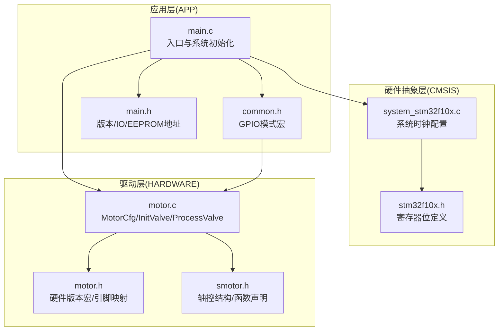
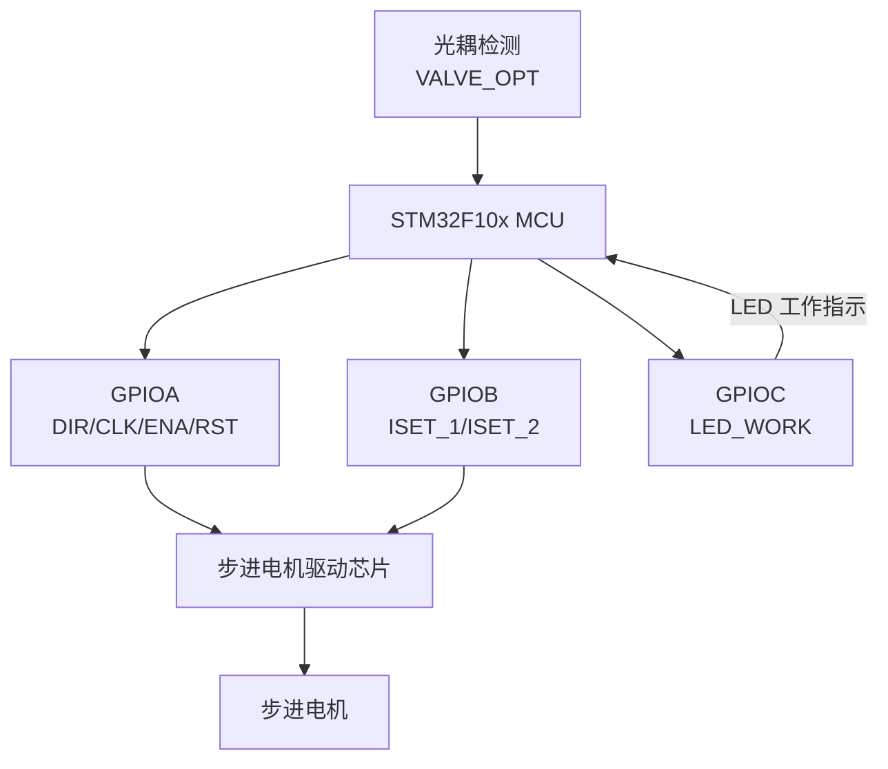
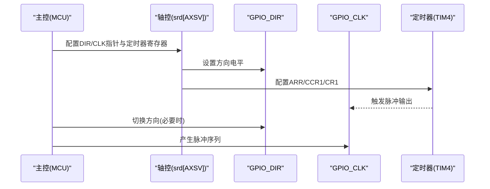
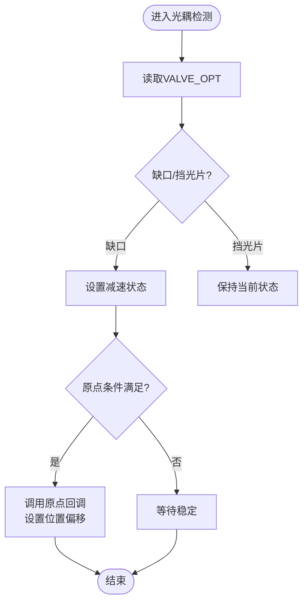
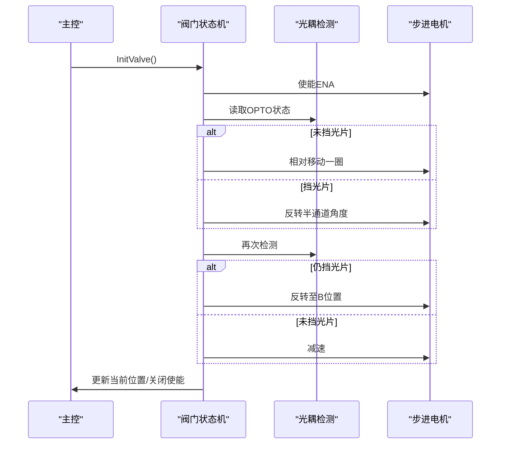
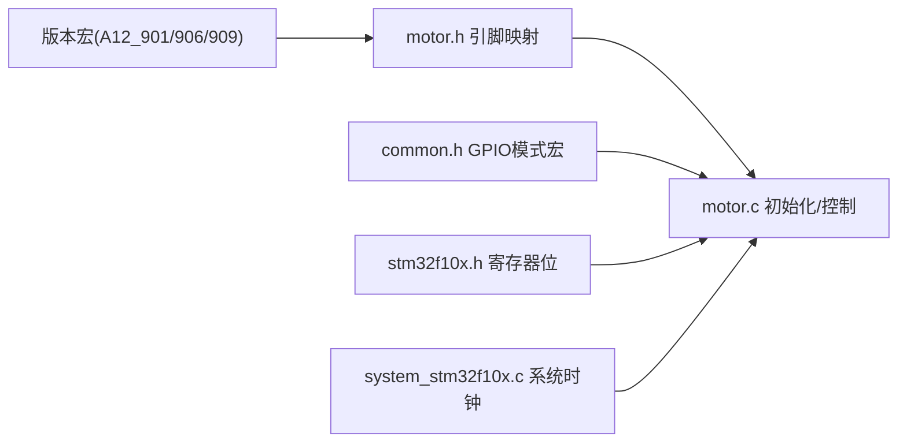

# 电机硬件配置

<cite>
**本文引用的文件**
- [SRC/HARDWARE/motor/motor.h](file://SRC/HARDWARE/motor/motor.h)
- [SRC/HARDWARE/motor/motor.c](file://SRC/HARDWARE/motor/motor.c)
- [SRC/HARDWARE/motor/smotor.h](file://SRC/HARDWARE/motor/smotor.h)
- [SRC/APP/common.h](file://SRC/APP/common.h)
- [SRC/APP/main.h](file://SRC/APP/main.h)
- [SRC/CMSIS/DeviceSupport/system_stm32f10x.c](file://SRC/CMSIS/DeviceSupport/system_stm32f10x.c)
- [SRC/CMSIS/DeviceSupport/stm32f10x.h](file://SRC/CMSIS/DeviceSupport/stm32f10x.h)
- [Doc/QHF_v1.3.1修改说明.md](file://Doc/QHF_v1.3.1修改说明.md)
- [USER/DebugConfig/A_901_STM32F103C8_1.0.0.dbgconf](file://USER/DebugConfig/A_901_STM32F103C8_1.0.0.dbgconf)
- [USER/DebugConfig/A_906_STM32F103C8_1.0.0.dbgconf](file://USER/DebugConfig/A_906_STM32F103C8_1.0.0.dbgconf)
- [USER/DebugConfig/A_909_STM32F103C8_1.0.0.dbgconf](file://USER/DebugConfig/A_909_STM32F103C8_1.0.0.dbgconf)
</cite>

## 更新摘要
**变更内容**
- 增强GPIO初始化配置，完善不同硬件版本的引脚映射
- 添加详细的硬件变体支持说明，明确各版本的电气特性
- 改进ISET电流设置引脚配置文档，提供更准确的硬件接线指导

## 目录
1. [简介](#简介)
2. [项目结构](#项目结构)
3. [核心组件](#核心组件)
4. [架构总览](#架构总览)
5. [详细组件分析](#详细组件分析)
6. [依赖关系分析](#依赖关系分析)
7. [性能考虑](#性能考虑)
8. [故障排查指南](#故障排查指南)
9. [结论](#结论)
10. [附录](#附录)

## 简介
本文件面向电机硬件配置与实现，围绕步进电机的脉冲(Pulse)、方向(Direction)、使能(Enable)三类信号的硬件连接与控制逻辑展开，结合不同硬件版本(A12-901/906/909)的引脚差异、GPIO端口与时钟配置、外设初始化流程，以及LED指示、光耦检测、电流设置引脚的作用与接线方式，提供完整的硬件说明与排障建议。同时给出基于代码的时序与控制流程图示，帮助读者快速理解硬件与软件协同工作机制。

## 项目结构
本项目采用分层组织：应用层(APP)、硬件抽象层(HAL/CMSIS)、驱动层(SYSTEM/HARDWARE)，其中电机控制位于HARDWARE子目录，通过motor.c/motor.h实现，配合通用GPIO宏(common.h)与定时器/轴控(smotor.h)共同完成步进电机的脉冲输出与运动控制。

**图表来源**
- [SRC/APP/main.h:1-230](file://SRC/APP/main.h#L1-L230)
- [SRC/APP/common.h:300-527](file://SRC/APP/common.h#L300-L527)
- [SRC/CMSIS/DeviceSupport/system_stm32f10x.c:97-127](file://SRC/CMSIS/DeviceSupport/system_stm32f10x.c#L97-L127)
- [SRC/CMSIS/DeviceSupport/stm32f10x.h:4192-4426](file://SRC/CMSIS/DeviceSupport/stm32f10x.h#L4192-L4426)
- [SRC/HARDWARE/motor/motor.h:1-237](file://SRC/HARDWARE/motor/motor.h#L1-L237)
- [SRC/HARDWARE/motor/motor.c:1-545](file://SRC/HARDWARE/motor/motor.c#L1-L545)
- [SRC/HARDWARE/motor/smotor.h:1-100](file://SRC/HARDWARE/motor/smotor.h#L1-L100)

## 核心组件
- 电机控制与引脚映射：motor.h定义了不同硬件版本的引脚宏，包括LED工作指示、光耦检测输入、使能/方向/脉冲输出引脚，以及电流设置引脚ISET的组合。
- GPIO与外设初始化：motor.c中的bsp_ValveGpioInit负责启用GPIO端口时钟、配置LED为推挽输出、光耦输入为上拉/下拉输入、方向/脉冲/复位为推挽输出，并对电流设置引脚进行上拉/下拉配置。
- 轴控与定时器：smotor.h定义了轴控结构体与移动函数接口，motor.c中将方向/脉冲引脚与TIM4的比较输出关联，用于生成步进脉冲序列。
- 版本与IO：main.h定义了不同硬件版本的IO引脚映射与EEPROM参数地址，motor.c中根据版本选择电流档位默认值。

**章节来源**
- [SRC/HARDWARE/motor/motor.h:100-148](file://SRC/HARDWARE/motor/motor.h#L100-L148)
- [SRC/HARDWARE/motor/motor.c:4-74](file://SRC/HARDWARE/motor/motor.c#L4-L74)
- [SRC/HARDWARE/motor/smotor.h:67-84](file://SRC/HARDWARE/motor/smotor.h#L67-L84)
- [SRC/APP/main.h:109-125](file://SRC/APP/main.h#L109-L125)

## 架构总览
下图展示了电机驱动电路与控制软件之间的交互关系：MCU通过GPIO输出方向与脉冲信号，经由光耦检测回路反馈位置信息；电流设置引脚通过三个ISET引脚的不同电平组合实现多档位电流调节；系统时钟与定时器为脉冲输出提供基准。

**图表来源**
- [SRC/HARDWARE/motor/motor.h:16-49](file://SRC/HARDWARE/motor/motor.h#L16-L49)
- [SRC/HARDWARE/motor/motor.c:4-74](file://SRC/HARDWARE/motor/motor.c#L4-L74)
- [SRC/APP/common.h:300-527](file://SRC/APP/common.h#L300-L527)

## 详细组件分析

### 硬件版本差异与引脚配置

**A12-901版本**
- LED工作指示：PC15（推挽输出，50MHz）
- 光耦检测：PA15（上拉/下拉输入）
- 使能/方向/脉冲/复位：PA4/PA5/PA6/PA7（推挽输出，50MHz）
- 电流设置：PB0/PB12/PA11（上拉/下拉输入，内部上拉）

**A12-906版本**
- LED工作指示：PC14（推挽输出，50MHz）
- 光耦检测：PC15（上拉/下拉输入）
- 使能/方向/脉冲/复位：PA6/PA7/PA4/PA5（推挽输出，50MHz）
- 电流设置：PB12/PB0/PA11（上拉/下拉输入，内部上拉）

**A12-909版本**
- LED工作指示：PC15（推挽输出，50MHz）
- 光耦检测：PA15（上拉/下拉输入）
- 使能/方向/脉冲/复位：PA4/PA6/PA7/PA5（推挽输出，50MHz）
- 电流设置：PB0/PB12/PA11（上拉/下拉输入，内部上拉）

**更新** 增强了GPIO初始化配置，明确了各版本的引脚位置差异和配置要求

**章节来源**
- [SRC/HARDWARE/motor/motor.h:16-49](file://SRC/HARDWARE/motor/motor.h#L16-L49)
- [SRC/HARDWARE/motor/motor.c:8-55](file://SRC/HARDWARE/motor/motor.c#L8-L55)

### GPIO端口配置与时钟初始化

**时钟配置**
- MotorCfg中启用APB2外设时钟至GPIOA/B/C
- 通过RCC_APB2ENR寄存器位配置各GPIO端口时钟

**LED指示配置**
- A12-901：PC15配置为推挽输出，50MHz频率
- A12-906：PC14配置为推挽输出，50MHz频率

**光耦输入配置**
- A12-901：PA15配置为上拉/下拉输入，内部上拉
- A12-906：PC15配置为上拉/下拉输入，内部上拉

**驱动信号配置**
- 方向/脉冲/使能/复位引脚均配置为推挽输出，50MHz频率
- 引脚位置因版本而异，但配置方式一致

**电流设置引脚配置**
- 三个ISET引脚均配置为上拉/下拉输入，内部上拉
- 通过不同电平组合实现多档位电流设置

**更新** 完善了GPIO初始化的具体配置细节和寄存器位操作

**章节来源**
- [SRC/HARDWARE/motor/motor.c:6-74](file://SRC/HARDWARE/motor/motor.c#L6-L74)
- [SRC/APP/common.h:243-527](file://SRC/APP/common.h#L243-L527)

### 电机驱动芯片接线与保护

**接线要点**
- 使能(ENA)：低电平有效，用于锁定电机或进入待机状态
- 方向(DIR)：决定旋转方向，结合脉冲信号实现正反转
- 脉冲(CLK)：由定时器输出或软件控制产生，驱动步进电机步进
- 复位(RST)：低电平复位，用于初始化阶段
- 光耦(OPTO)：检测挡光片/缺口位置，作为原点/端点信号反馈
- 电流设置(ISET)：通过PB0/PB12/PA11的不同电平组合选择电流档位

**电流档位设置**
- I_26A = 0x00（最大档位）
- I_22A = 0x01
- I_18A = 0x02
- I_16A = 0x03
- I_05A = 0x04

**保护措施**
- 电流档位默认值在非901版本中设置为最大档位（I_26A），以满足较高负载需求
- 光耦检测用于急停与原点定位，避免过冲与误动作
- 通过软件状态机与超时保护机制，防止长时间无响应导致的风险

**更新** 改进了ISET引脚配置说明，提供了更准确的电流档位设置指导

**章节来源**
- [SRC/HARDWARE/motor/motor.h:10-15](file://SRC/HARDWARE/motor/motor.h#L10-L15)
- [SRC/HARDWARE/motor/motor.h:44-49](file://SRC/HARDWARE/motor/motor.h#L44-L49)
- [SRC/HARDWARE/motor/motor.c:70-74](file://SRC/HARDWARE/motor/motor.c#L70-L74)

### 脉冲/方向/使能信号的硬件实现

**方向/脉冲输出绑定**
- motor.c将srd[AXSV].signalDIR/signalCLK与VALVE_DIR/VALVE_CLK关联
- 结合TIM4的比较输出与计数寄存器，形成稳定的脉冲序列

**使能控制**
- VALVE_ENA在初始化与运行前后进行置位/复位，确保电机在静止时锁定，在运行时释放

**复位控制**
- VALVE_RST在初始化时先拉低10ms再拉高，确保驱动芯片处于复位状态

**图表来源**
- [SRC/HARDWARE/motor/motor.c:62-68](file://SRC/HARDWARE/motor/motor.c#L62-L68)
- [SRC/HARDWARE/motor/smotor.h:76-82](file://SRC/HARDWARE/motor/smotor.h#L76-L82)

**章节来源**
- [SRC/HARDWARE/motor/motor.c:62-68](file://SRC/HARDWARE/motor/motor.c#L62-L68)
- [SRC/HARDWARE/motor/smotor.h:76-82](file://SRC/HARDWARE/motor/smotor.h#L76-L82)

### 光耦检测与原点/端点处理

**光耦输入VALVE_OPT用于检测挡光片与缺口位置，作为原点与端点信号**

**原点处理流程**
- 当检测到特定光耦状态且持续一段时间后，调用原点回调函数
- 设置当前位置偏移并进入减速阶段

**端点处理**
- 在运行过程中若检测到异常信号，清除使能并设置错误状态

**图表来源**
- [SRC/HARDWARE/motor/motor.c:442-457](file://SRC/HARDWARE/motor/motor.c#L442-L457)

**章节来源**
- [SRC/HARDWARE/motor/motor.c:442-457](file://SRC/HARDWARE/motor/motor.c#L442-L457)

### LED指示灯与状态反馈

**LED工作指示配置**
- A12-901：PC15（推挽输出，50MHz）
- A12-906：PC14（推挽输出，50MHz）

**状态闪烁逻辑**
- 正常运行：1500ms闪烁间隔
- 重试状态：1100ms闪烁间隔  
- 错误状态：400ms闪烁间隔

**更新** 明确了各版本LED引脚位置和闪烁间隔配置

**章节来源**
- [SRC/HARDWARE/motor/motor.h:17-33](file://SRC/HARDWARE/motor/motor.h#L17-L33)
- [SRC/APP/main.h:173-176](file://SRC/APP/main.h#L173-L176)

### 初始化与运行流程

**初始化流程**
- 启用使能引脚，读取当前位置
- 根据光耦状态确定移动方向与步数
- 逐步减速直至找到原点
- 根据半通道设置与IO控制策略更新当前位置并关闭使能

**运行流程**
- 根据目标位置计算相对/绝对移动步数
- 启动电机并监控光耦状态
- 完成后写入EEPROM并更新状态

**图表来源**
- [SRC/HARDWARE/motor/motor.c:278-314](file://SRC/HARDWARE/motor/motor.c#L278-L314)

**章节来源**
- [SRC/HARDWARE/motor/motor.c:278-314](file://SRC/HARDWARE/motor/motor.c#L278-L314)

## 依赖关系分析

**版本宏依赖**
- motor.h通过A12_901/906/909宏选择引脚映射与电流档位默认值
- main.h定义IO引脚与EEPROM地址，二者共同决定硬件布局

**GPIO模式依赖**
- motor.c通过common.h提供的GPIO模式宏配置端口
- 确保不同版本引脚的一致行为和正确的电气特性

**寄存器位定义**
- stm32f10x.h提供TIM寄存器位定义
- motor.c中通过TIM4寄存器实现脉冲输出

**系统时钟**
- system_stm32f10x.c定义系统时钟频率
- 影响定时器分频与脉冲频率

**图表来源**
- [SRC/HARDWARE/motor/motor.h:16-49](file://SRC/HARDWARE/motor/motor.h#L16-L49)
- [SRC/HARDWARE/motor/motor.c:4-74](file://SRC/HARDWARE/motor/motor.c#L4-L74)
- [SRC/APP/common.h:300-527](file://SRC/APP/common.h#L300-L527)
- [SRC/CMSIS/DeviceSupport/stm32f10x.h:4192-4426](file://SRC/CMSIS/DeviceSupport/stm32f10x.h#L4192-L4426)
- [SRC/CMSIS/DeviceSupport/system_stm32f10x.c:97-127](file://SRC/CMSIS/DeviceSupport/system_stm32f10x.c#L97-L127)

**章节来源**
- [SRC/HARDWARE/motor/motor.h:16-49](file://SRC/HARDWARE/motor/motor.h#L16-L49)
- [SRC/HARDWARE/motor/motor.c:4-74](file://SRC/HARDWARE/motor/motor.c#L4-L74)
- [SRC/APP/common.h:300-527](file://SRC/APP/common.h#L300-L527)
- [SRC/CMSIS/DeviceSupport/stm32f10x.h:4192-4426](file://SRC/CMSIS/DeviceSupport/stm32f10x.h#L4192-L4426)
- [SRC/CMSIS/DeviceSupport/system_stm32f10x.c:97-127](file://SRC/CMSIS/DeviceSupport/system_stm32f10x.c#L97-L127)

## 性能考虑

**脉冲频率与定时器**
- 通过TIM4的ARR/CCR1/CR1寄存器配置脉冲频率
- 结合系统时钟与分频系数，确保脉冲精度与稳定性

**电流档位优化**
- 在高负载或高速运行场景下，适当提高电流档位可提升转矩与运行稳定性
- A12-906/909版本默认设置为最大档位（I_26A）

**光耦检测策略**
- 合理设置检测窗口与去抖动策略，避免误触发导致的频繁启停
- 不同版本的光耦输入引脚位置不同，需注意电气特性差异

**通信与LED优先级**
- LED闪烁周期与通信优先级需平衡，避免影响控制实时性
- A12-901版本支持LED指示功能

## 故障排查指南

**现象：电机不转**
- 检查使能引脚是否被正确拉低/拉高
- 确认复位引脚是否完成复位
- 检查方向/脉冲引脚电平与定时器配置是否正确

**现象：位置不准或反复寻找原点**
- 检查光耦输入是否被遮挡或干扰
- 确认原点回调逻辑是否被触发
- 验证不同版本的光耦输入引脚配置

**现象：运行中突然停止**
- 检查光耦检测状态与错误处理分支
- 确认使能是否被意外关闭
- 验证电流档位设置是否合适

**现象：电流过大或发热严重**
- 检查电流档位设置
- 确认ISET引脚电平组合是否符合预期
- 验证不同版本的ISET引脚配置差异

**现象：LED指示异常**
- 检查LED引脚配置与版本差异
- 确认闪烁周期与状态机逻辑
- 验证A12-901版本的LED指示功能

**更新** 增强了故障排查指南，特别关注了不同硬件版本的引脚配置差异

**章节来源**
- [SRC/HARDWARE/motor/motor.c:401-420](file://SRC/HARDWARE/motor/motor.c#L401-L420)
- [SRC/HARDWARE/motor/motor.c:442-457](file://SRC/HARDWARE/motor/motor.c#L442-L457)
- [SRC/HARDWARE/motor/motor.h:17-33](file://SRC/HARDWARE/motor/motor.h#L17-L33)

## 结论

本项目通过明确的硬件版本宏与引脚映射，结合GPIO模式宏与定时器配置，实现了对步进电机脉冲、方向、使能信号的可靠控制。不同硬件版本在LED、光耦与ISET引脚上的差异通过编译宏自动适配，确保软件与硬件的一致性。

**更新亮点**
- 增强了GPIO初始化配置的详细程度，明确了各版本的具体引脚位置
- 改进了ISET电流设置引脚配置文档，提供了更准确的硬件接线指导
- 完善了硬件变体支持说明，便于用户选择合适的硬件版本

通过光耦检测与原点回调机制，系统能够稳定地完成初始化与运行过程。建议在实际部署中重点关注电流档位、光耦安装与定时器配置，以获得最佳的运行性能与可靠性。

## 附录

**版本与IO说明**
- main.h中定义了不同硬件版本的IO引脚与EEPROM参数地址
- 便于参数固化与版本识别，支持A12-901/906/909三种硬件版本

**调试配置**
- USER/DebugConfig目录下的调试配置文件可用于仿真与调试环境的时钟/调试控制设置
- 三种硬件版本共享相同的调试配置格式

**文档更新**
- Doc/QHF_v1.3.1修改说明.md记录了版本演进与功能变更
- 有助于理解当前版本的特性与限制，特别是GPIO初始化和ISET配置的改进

**更新** 增加了对GPIO初始化配置和ISET引脚配置的详细说明

**章节来源**
- [SRC/APP/main.h:109-125](file://SRC/APP/main.h#L109-L125)
- [Doc/QHF_v1.3.1修改说明.md:1-190](file://Doc/QHF_v1.3.1修改说明.md#L1-L190)
- [USER/DebugConfig/A_901_STM32F103C8_1.0.0.dbgconf:1-37](file://USER/DebugConfig/A_901_STM32F103C8_1.0.0.dbgconf#L1-L37)
- [USER/DebugConfig/A_906_STM32F103C8_1.0.0.dbgconf:1-37](file://USER/DebugConfig/A_906_STM32F103C8_1.0.0.dbgconf#L1-L37)
- [USER/DebugConfig/A_909_STM32F103C8_1.0.0.dbgconf:1-37](file://USER/DebugConfig/A_909_STM32F103C8_1.0.0.dbgconf#L1-L37)