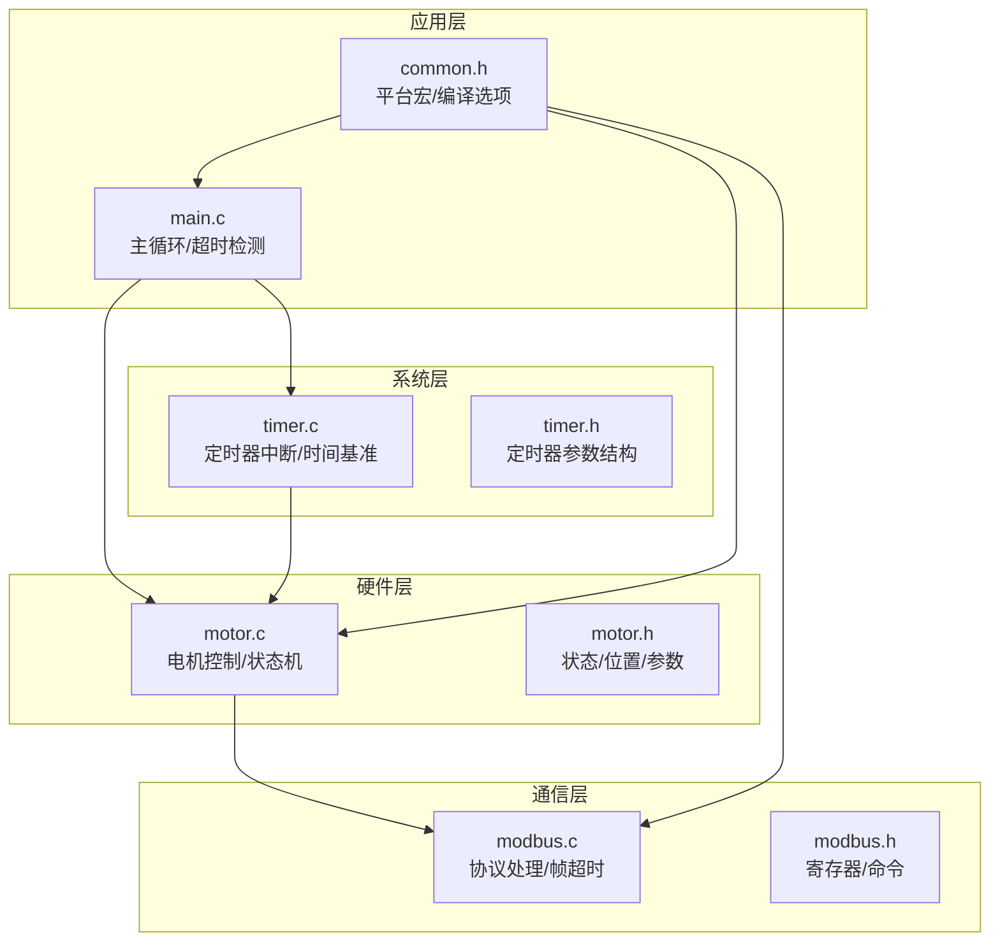
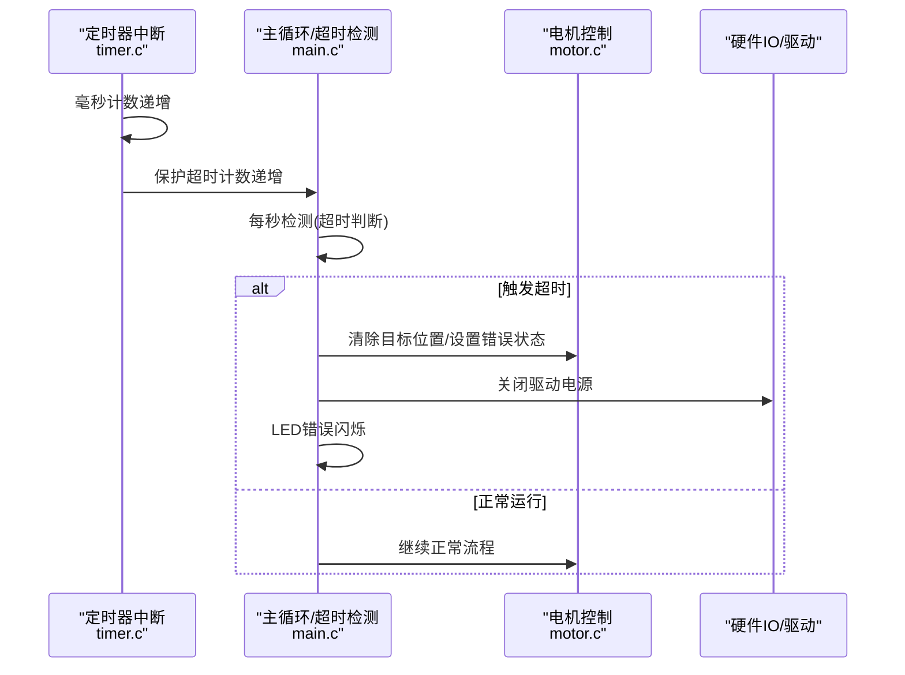
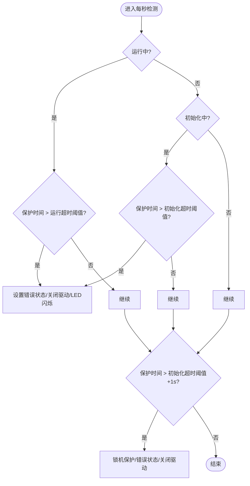
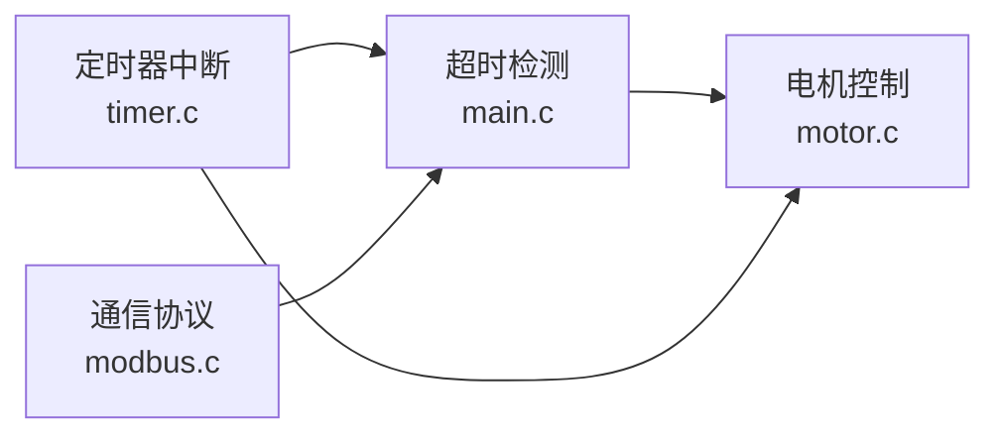

# 超时保护机制

<cite>
**本文档引用的文件**
- [main.c](file://SRC/APP/main.c)
- [main.h](file://SRC/APP/main.h)
- [motor.c](file://SRC/HARDWARE/motor/motor.c)
- [motor.h](file://SRC/HARDWARE/motor/motor.h)
- [timer.c](file://SRC/SYSTEM/timer/timer.c)
- [timer.h](file://SRC/SYSTEM/timer/timer.h)
- [common.h](file://SRC/APP/common.h)
- [modbus.c](file://SRC/HARDWARE/modbus/modbus.c)
- [modbus.h](file://SRC/HARDWARE/modbus/modbus.h)
</cite>

## 目录
1. [简介](#简介)
2. [项目结构](#项目结构)
3. [核心组件](#核心组件)
4. [架构总览](#架构总览)
5. [详细组件分析](#详细组件分析)
6. [依赖关系分析](#依赖关系分析)
7. [性能考虑](#性能考虑)
8. [故障排查指南](#故障排查指南)
9. [结论](#结论)
10. [附录](#附录)

## 简介
本文件针对通用开关器项目中的“超时保护机制”进行系统化技术说明，覆盖以下要点：
- 超时保护工作原理与触发条件：运动超时检测、故障超时判断、紧急停止联动
- 时间参数配置与保护策略：运行超时、初始化超时、锁机保护阈值
- 与急停功能的协调与优先级：超时触发后的急停动作与状态管理
- 对系统安全性与可靠性的保障作用
- 复位机制与恢复策略：超时后的状态清理与系统重启流程
- 参数设置指南与测试方法：如何配置与验证超时保护
- 故障排查与性能优化建议：常见问题定位与改进措施

## 项目结构
本项目采用分层架构，超时保护涉及应用层（主循环与定时器中断）、硬件抽象层（电机控制与IO）、通信协议层（Modbus/AGS），以及系统时基（定时器）。关键文件分布如下：
- 应用层：主循环、超时检测与LED闪烁控制
- 硬件层：电机控制、状态机与急停联动
- 系统层：定时器中断与时间基准
- 通信层：Modbus/AGS协议处理（含帧超时）

**图表来源**
- [main.c:433-494](file://SRC/APP/main.c#L433-L494)
- [timer.c:22-42](file://SRC/SYSTEM/timer/timer.c#L22-L42)
- [motor.c:73-268](file://SRC/HARDWARE/motor/motor.c#L73-L268)
- [modbus.c:69-91](file://SRC/HARDWARE/modbus/modbus.c#L69-L91)

**章节来源**
- [main.c:433-494](file://SRC/APP/main.c#L433-L494)
- [timer.c:11-42](file://SRC/SYSTEM/timer/timer.c#L11-L42)
- [motor.c:73-268](file://SRC/HARDWARE/motor/motor.c#L73-L268)
- [modbus.c:69-91](file://SRC/HARDWARE/modbus/modbus.c#L69-L91)

## 核心组件
- 超时计数器与时间基准
  - 定时器中断每毫秒递增多个计时变量，包括秒计数、保护超时计数、LED闪烁计数等
  - 保护超时计数在运行或初始化状态下递增，作为超时检测的依据
- 超时检测逻辑
  - 在每秒检测任务中，根据当前状态与累计保护时间判断是否触发超时保护
  - 区分“单次运行超时”和“初始化超时”，并设置不同的阈值
- 急停联动
  - 超时触发后，清除目标位置、设置运行错误状态、关闭驱动电源，并点亮错误指示
  - 若超过更长时限，进入“锁机保护”状态，强制错误并保持锁定
- LED闪烁与错误提示
  - 通过错误闪烁间隔控制LED状态，便于现场观察

**章节来源**
- [timer.c:22-42](file://SRC/SYSTEM/timer/timer.c#L22-L42)
- [main.c:69-202](file://SRC/APP/main.c#L69-L202)
- [motor.c:322-349](file://SRC/HARDWARE/motor/motor.c#L322-L349)

## 架构总览
超时保护贯穿应用层与硬件层，形成“时间基准 → 超时检测 → 急停联动”的闭环。

**图表来源**
- [timer.c:22-42](file://SRC/SYSTEM/timer/timer.c#L22-L42)
- [main.c:69-202](file://SRC/APP/main.c#L69-L202)
- [motor.c:322-349](file://SRC/HARDWARE/motor/motor.c#L322-L349)

## 详细组件分析

### 超时检测与触发条件
- 计时基础
  - 定时器中断每毫秒递增保护超时计数，用于衡量运行/初始化持续时间
- 触发条件
  - 单次运行超时：当处于运行状态且累计保护时间超过“单次运行超时阈值”时触发
  - 初始化超时：当处于初始化状态且累计保护时间超过“初始化超时阈值”时触发
  - 锁机保护：若累计保护时间超过“初始化超时阈值+1秒”，直接进入锁机保护状态
- 动作
  - 清除目标位置，设置运行错误状态，关闭驱动电源，点亮错误指示，记录错误日志

**图表来源**
- [main.c:170-202](file://SRC/APP/main.c#L170-L202)
- [timer.c:34-38](file://SRC/SYSTEM/timer/timer.c#L34-L38)

**章节来源**
- [main.c:69-202](file://SRC/APP/main.c#L69-L202)
- [timer.c:22-42](file://SRC/SYSTEM/timer/timer.c#L22-L42)

### 时间参数与保护策略
- 关键时间参数
  - 单次运行超时阈值：用于判定单次运行是否超时
  - 初始化超时阈值：用于判定初始化过程是否超时
  - 锁机保护阈值：超过此阈值后强制锁机
- 保护策略
  - 运行超时：立即触发错误状态，关闭驱动，防止长时间堵转
  - 初始化超时：在多次尝试后仍无法完成初始化，进入锁机保护
  - 错误闪烁：通过LED闪烁间隔提示用户系统处于错误状态

**章节来源**
- [main.c:70-71](file://SRC/APP/main.c#L70-L71)
- [main.c:180-201](file://SRC/APP/main.c#L180-L201)
- [main.h:191-193](file://SRC/APP/main.h#L191-L193)

### 与急停功能的协调与优先级
- 急停联动
  - 超时触发后，系统清除目标位置、设置运行错误状态、关闭驱动电源
  - 若同时检测到光耦信号异常，也会触发错误状态并急停
- 优先级
  - 超时保护优先于正常运行流程；一旦触发，立即中断当前动作并进入错误状态
  - 锁机保护进一步提升安全性，确保系统在长时间异常后被强制锁定

**章节来源**
- [motor.c:322-349](file://SRC/HARDWARE/motor/motor.c#L322-L349)
- [main.c:180-201](file://SRC/APP/main.c#L180-L201)

### 复位机制与恢复策略
- 复位触发
  - 初始化完成后，系统清除运行结束标志，准备下一次切换
  - 切换完成后，系统更新当前位置、计数切换次数、暂停切换时间计时
- 恢复策略
  - 错误状态可通过复位操作清除；系统重新进入初始化流程
  - 恢复速度与加速度参数在初始化完成后恢复至设定值

**章节来源**
- [motor.c:275-351](file://SRC/HARDWARE/motor/motor.c#L275-L351)
- [motor.c:427-257](file://SRC/HARDWARE/motor/motor.c#L427-L257)

### 通信层的超时处理（Modbus/AGS）
- 帧超时检测
  - 在定时器中断中定期检查总线状态，若超过空闲阈值则判定帧结束或开始
  - 若接收过程中出现数据溢出或间隔超时，进入错误状态并释放总线
- 与主超时保护的关系
  - 通信层的帧超时与主超时保护相互独立，均用于保障系统稳定性
  - 通信异常可能间接导致主超时保护触发（如长时间无响应）

**章节来源**
- [modbus.c:69-91](file://SRC/HARDWARE/modbus/modbus.c#L69-L91)
- [modbus.c:136-162](file://SRC/HARDWARE/modbus/modbus.c#L136-L162)

## 依赖关系分析
- 时间基准依赖
  - 定时器中断为超时检测提供统一的时间基准
- 状态依赖
  - 超时检测依赖于当前阀门状态（运行/初始化/错误）
  - 电机控制依赖于目标位置与当前位置，超时触发后会清除目标位置
- 通信依赖
  - 通信协议处理依赖于定时器中断提供的帧超时判断

**图表来源**
- [timer.c:22-42](file://SRC/SYSTEM/timer/timer.c#L22-L42)
- [main.c:69-202](file://SRC/APP/main.c#L69-L202)
- [motor.c:73-268](file://SRC/HARDWARE/motor/motor.c#L73-L268)
- [modbus.c:69-91](file://SRC/HARDWARE/modbus/modbus.c#L69-L91)

**章节来源**
- [timer.c:22-42](file://SRC/SYSTEM/timer/timer.c#L22-L42)
- [main.c:69-202](file://SRC/APP/main.c#L69-L202)
- [motor.c:73-268](file://SRC/HARDWARE/motor/motor.c#L73-L268)
- [modbus.c:69-91](file://SRC/HARDWARE/modbus/modbus.c#L69-L91)

## 性能考虑
- 中断频率与精度
  - 定时器以固定频率递增计数，确保超时判断的准确性与时序一致性
- 资源占用
  - 超时检测逻辑简单，仅涉及比较与状态设置，对CPU负载影响较小
- 抖动与鲁棒性
  - 通过合理的阈值设置与错误闪烁提示，提升系统在异常情况下的可诊断性

[本节为通用指导，无需具体文件引用]

## 故障排查指南
- 症状：频繁触发运行超时
  - 可能原因：机械卡阻、负载过大、速度设置过高
  - 排查步骤：检查机械路径、确认负载能力、适当降低速度
- 症状：初始化超时
  - 可能原因：光耦信号异常、原点未找到、方向补偿不当
  - 排查步骤：检查光耦连接、确认原点位置、校准方向补偿
- 症状：锁机保护
  - 可能原因：长时间无响应或持续超时
  - 排查步骤：复位系统、检查通信链路、确认参数设置
- 症状：LED不闪烁或闪烁异常
  - 可能原因：错误闪烁间隔配置不当
  - 排查步骤：核对错误闪烁间隔参数，检查LED硬件连接

**章节来源**
- [main.c:180-201](file://SRC/APP/main.c#L180-L201)
- [main.h:191-193](file://SRC/APP/main.h#L191-L193)
- [motor.c:322-349](file://SRC/HARDWARE/motor/motor.c#L322-L349)

## 结论
超时保护机制通过统一的时间基准与明确的触发条件，有效防止电机长时间堵转与初始化失败带来的风险。其与急停功能的协同设计提升了系统的安全性与可靠性；合理的参数配置与恢复策略确保了系统在异常情况下能够快速、稳定地回到可控状态。结合通信层的帧超时处理，整体系统具备良好的鲁棒性与可维护性。

[本节为总结性内容，无需具体文件引用]

## 附录

### 参数设置指南
- 时间阈值配置
  - 单次运行超时阈值：用于判定单次运行是否超时
  - 初始化超时阈值：用于判定初始化过程是否超时
  - 锁机保护阈值：超过此阈值后强制锁机
- LED闪烁参数
  - 正常运行闪烁间隔、错误闪烁间隔等参数用于指示系统状态
- 通信帧超时
  - 通信层的帧超时阈值用于判定帧接收是否异常

**章节来源**
- [main.c:70-71](file://SRC/APP/main.c#L70-L71)
- [main.h:191-193](file://SRC/APP/main.h#L191-L193)
- [modbus.c:69-91](file://SRC/HARDWARE/modbus/modbus.c#L69-L91)

### 测试方法
- 运行超时测试
  - 在运行状态下施加机械卡阻，验证超时保护是否正确触发并急停
- 初始化超时测试
  - 断开光耦信号或模拟原点异常，验证初始化超时与锁机保护
- LED状态验证
  - 观察错误闪烁间隔是否符合预期，确认LED指示正常
- 通信帧超时测试
  - 在通信层模拟帧超时场景，验证协议处理逻辑

**章节来源**
- [main.c:180-201](file://SRC/APP/main.c#L180-L201)
- [motor.c:322-349](file://SRC/HARDWARE/motor/motor.c#L322-L349)
- [modbus.c:69-91](file://SRC/HARDWARE/modbus/modbus.c#L69-L91)