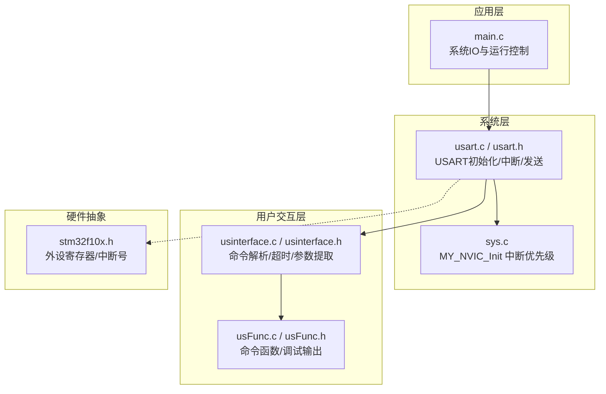
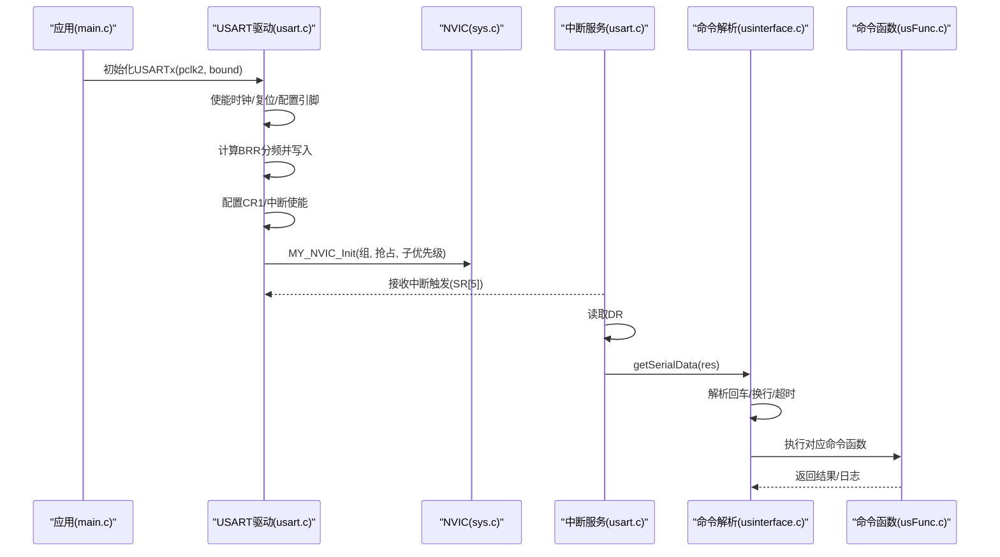
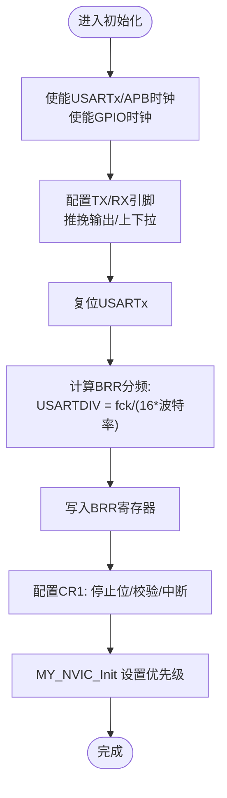
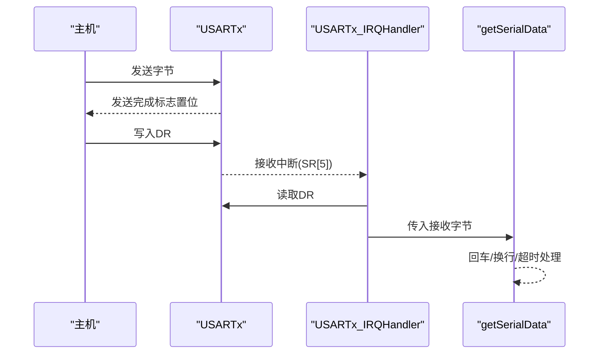
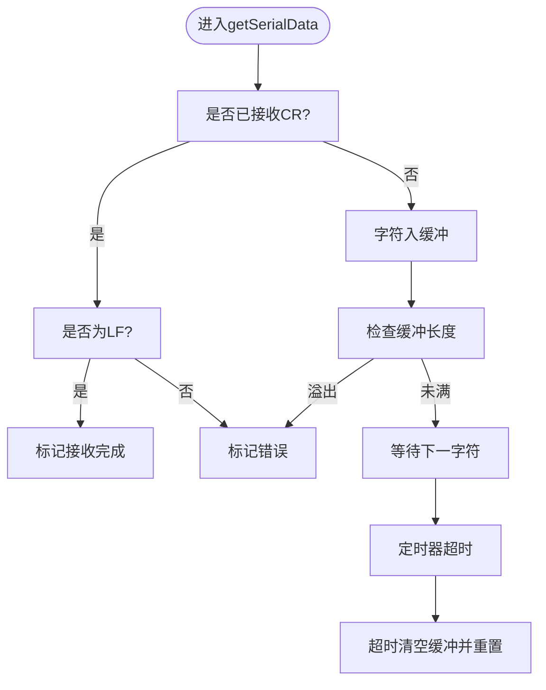
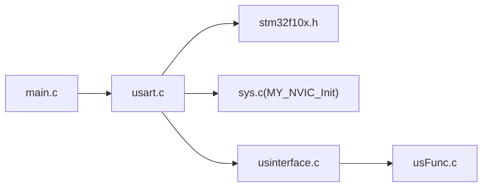

# 串口通信

<cite>
**本文引用的文件**   
- [usart.c](file://SRC/SYSTEM/usart/usart.c)
- [usart.h](file://SRC/SYSTEM/usart/usart.h)
- [usinterface.h](file://SRC/HARDWARE/usinterface/usinterface.h)
- [usinterface.c](file://SRC/HARDWARE/usinterface/usinterface.c)
- [usFunc.c](file://SRC/HARDWARE/usinterface/usFunc.c)
- [usFunc.h](file://SRC/HARDWARE/usinterface/usFunc.h)
- [main.c](file://SRC/APP/main.c)
- [stm32f10x.h](file://SRC/CMSIS/DeviceSupport/stm32f10x.h)
- [sys.c](file://SRC/SYSTEM/sys/sys.c)
</cite>

## 目录
1. [简介](#简介)
2. [项目结构](#项目结构)
3. [核心组件](#核心组件)
4. [架构总览](#架构总览)
5. [详细组件分析](#详细组件分析)
6. [依赖关系分析](#依赖关系分析)
7. [性能考虑](#性能考虑)
8. [故障排查指南](#故障排查指南)
9. [结论](#结论)
10. [附录](#附录)

## 简介
本文件面向STM32F10x系列MCU的串口通信模块，系统性梳理USART外设的初始化配置流程（时钟、引脚、寄存器）、数据收发机制（发送阻塞、接收中断、帧格式）、波特率计算与分频策略、状态管理与错误处理、以及调试与性能优化方法。文档同时给出基于仓库源码的架构图、序列图与流程图，帮助开发者快速理解并实现稳定可靠的串口通信。

## 项目结构
串口相关代码分布在如下模块：
- 系统层USART驱动：提供USART1/2/3及可选UART4的初始化、发送、中断处理等
- 用户交互层：提供命令解析、超时处理、参数提取等
- 应用入口：系统IO配置、NVIC中断优先级初始化等
- 外设头文件：CMSIS寄存器定义与中断号

**图表来源**
- [usart.c:38-66](file://SRC/SYSTEM/usart/usart.c#L38-L66)
- [usart.c:91-120](file://SRC/SYSTEM/usart/usart.c#L91-L120)
- [usart.c:159-188](file://SRC/SYSTEM/usart/usart.c#L159-L188)
- [usart.c:229-258](file://SRC/SYSTEM/usart/usart.c#L229-L258)
- [usinterface.c:15-106](file://SRC/HARDWARE/usinterface/usinterface.c#L15-L106)
- [usFunc.c:753-778](file://SRC/HARDWARE/usinterface/usFunc.c#L753-L778)
- [sys.c:38](file://SRC/SYSTEM/sys/sys.c#L38)
- [stm32f10x.h:167-200](file://SRC/CMSIS/DeviceSupport/stm32f10x.h#L167-L200)

**章节来源**
- [usart.c:38-288](file://SRC/SYSTEM/usart/usart.c#L38-L288)
- [usart.h:11-41](file://SRC/SYSTEM/usart/usart.h#L11-L41)
- [usinterface.c:15-131](file://SRC/HARDWARE/usinterface/usinterface.c#L15-L131)
- [usFunc.c:753-778](file://SRC/HARDWARE/usinterface/usFunc.c#L753-L778)
- [sys.c:38](file://SRC/SYSTEM/sys/sys.c#L38)
- [stm32f10x.h:167-200](file://SRC/CMSIS/DeviceSupport/stm32f10x.h#L167-L200)

## 核心组件
- USART初始化与波特率配置：分别针对USART1/2/3/UART4，完成时钟使能、引脚复用推挽输出、RX下拉输入、复位、BRR分频设置、CR1控制位（停止位/校验/中断使能）
- 发送机制：阻塞式发送，查询DR的发送完成标志，确保数据可靠发出
- 接收机制：接收中断触发，从DR读取数据，进入命令解析或协议处理
- 命令解析与超时：接收缓冲、回车/换行识别、超时清理、参数提取与命令执行
- 中断优先级：通过MY_NVIC_Init统一配置USART中断优先级组与抢占/子优先级

**章节来源**
- [usart.c:38-66](file://SRC/SYSTEM/usart/usart.c#L38-L66)
- [usart.c:91-120](file://SRC/SYSTEM/usart/usart.c#L91-L120)
- [usart.c:159-188](file://SRC/SYSTEM/usart/usart.c#L159-L188)
- [usart.c:229-258](file://SRC/SYSTEM/usart/usart.c#L229-L258)
- [usart.c:74-83](file://SRC/SYSTEM/usart/usart.c#L74-L83)
- [usart.c:138-151](file://SRC/SYSTEM/usart/usart.c#L138-L151)
- [usart.c:208-221](file://SRC/SYSTEM/usart/usart.c#L208-L221)
- [usart.c:278-286](file://SRC/SYSTEM/usart/usart.c#L278-L286)
- [usinterface.c:15-106](file://SRC/HARDWARE/usinterface/usinterface.c#L15-L106)
- [usinterface.c:109-131](file://SRC/HARDWARE/usinterface/usinterface.c#L109-L131)
- [usFunc.c:753-778](file://SRC/HARDWARE/usinterface/usFunc.c#L753-L778)
- [sys.c:38](file://SRC/SYSTEM/sys/sys.c#L38)

## 架构总览
下图展示USART初始化、中断接收与命令解析的整体流程：

**图表来源**
- [usart.c:38-66](file://SRC/SYSTEM/usart/usart.c#L38-L66)
- [usart.c:91-120](file://SRC/SYSTEM/usart/usart.c#L91-L120)
- [usart.c:159-188](file://SRC/SYSTEM/usart/usart.c#L159-L188)
- [usart.c:229-258](file://SRC/SYSTEM/usart/usart.c#L229-L258)
- [usart.c:74-83](file://SRC/SYSTEM/usart/usart.c#L74-L83)
- [usart.c:138-151](file://SRC/SYSTEM/usart/usart.c#L138-L151)
- [usart.c:208-221](file://SRC/SYSTEM/usart/usart.c#L208-L221)
- [usart.c:278-286](file://SRC/SYSTEM/usart/usart.c#L278-L286)
- [usinterface.c:15-106](file://SRC/HARDWARE/usinterface/usinterface.c#L15-L106)
- [usFunc.c:753-778](file://SRC/HARDWARE/usinterface/usFunc.c#L753-L778)
- [sys.c:38](file://SRC/SYSTEM/sys/sys.c#L38)

## 详细组件分析

### USART初始化与波特率配置
- 时钟配置：分别使能USARTx所在APB总线时钟；GPIO端口时钟使能；对USARTx进行复位与停止复位
- 引脚映射：根据USARTx选择对应GPIO引脚，配置TX为复用推挽输出、RX为上/下拉输入（不同串口引脚不同）
- 寄存器设置：CR1设置停止位/校验位；BRR按公式计算分频值并写入
- 中断使能：开启接收缓冲区非空中断与PE中断；配置NVIC优先级

**图表来源**
- [usart.c:38-66](file://SRC/SYSTEM/usart/usart.c#L38-L66)
- [usart.c:91-120](file://SRC/SYSTEM/usart/usart.c#L91-L120)
- [usart.c:159-188](file://SRC/SYSTEM/usart/usart.c#L159-L188)
- [usart.c:229-258](file://SRC/SYSTEM/usart/usart.c#L229-L258)

**章节来源**
- [usart.c:38-66](file://SRC/SYSTEM/usart/usart.c#L38-L66)
- [usart.c:91-120](file://SRC/SYSTEM/usart/usart.c#L91-L120)
- [usart.c:159-188](file://SRC/SYSTEM/usart/usart.c#L159-L188)
- [usart.c:229-258](file://SRC/SYSTEM/usart/usart.c#L229-L258)

### 数据收发机制
- 发送：阻塞式发送，轮询发送完成标志，随后写入数据寄存器
- 接收：接收中断中读取数据寄存器，进入命令解析或协议处理分支
- 帧格式：默认1起始位、8数据位、1停止位、无校验

**图表来源**
- [usart.c:68-72](file://SRC/SYSTEM/usart/usart.c#L68-L72)
- [usart.c:123-127](file://SRC/SYSTEM/usart/usart.c#L123-L127)
- [usart.c:191-195](file://SRC/SYSTEM/usart/usart.c#L191-L195)
- [usart.c:261-265](file://SRC/SYSTEM/usart/usart.c#L261-L265)
- [usart.c:74-83](file://SRC/SYSTEM/usart/usart.c#L74-L83)
- [usart.c:138-151](file://SRC/SYSTEM/usart/usart.c#L138-L151)
- [usart.c:208-221](file://SRC/SYSTEM/usart/usart.c#L208-L221)
- [usart.c:278-286](file://SRC/SYSTEM/usart/usart.c#L278-L286)
- [usinterface.c:15-71](file://SRC/HARDWARE/usinterface/usinterface.c#L15-L71)

**章节来源**
- [usart.c:68-72](file://SRC/SYSTEM/usart/usart.c#L68-L72)
- [usart.c:123-127](file://SRC/SYSTEM/usart/usart.c#L123-L127)
- [usart.c:191-195](file://SRC/SYSTEM/usart/usart.c#L191-L195)
- [usart.c:261-265](file://SRC/SYSTEM/usart/usart.c#L261-L265)
- [usart.c:74-83](file://SRC/SYSTEM/usart/usart.c#L74-L83)
- [usart.c:138-151](file://SRC/SYSTEM/usart/usart.c#L138-L151)
- [usart.c:208-221](file://SRC/SYSTEM/usart/usart.c#L208-L221)
- [usart.c:278-286](file://SRC/SYSTEM/usart/usart.c#L278-L286)
- [usinterface.c:15-71](file://SRC/HARDWARE/usinterface/usinterface.c#L15-L71)

### 命令解析与超时处理
- 接收缓冲：固定长度缓冲区，记录接收状态、计数与超时
- 回车/换行：支持CR/LF两种结束符，严格校验顺序与有效性
- 超时清理：超过阈值自动清空缓冲并重置状态
- 参数提取：按命令长度与分隔符提取参数，支持定长/不定长参数

**图表来源**
- [usinterface.c:15-71](file://SRC/HARDWARE/usinterface/usinterface.c#L15-L71)
- [usinterface.c:109-131](file://SRC/HARDWARE/usinterface/usinterface.c#L109-L131)
- [usinterface.h:42-49](file://SRC/HARDWARE/usinterface/usinterface.h#L42-L49)

**章节来源**
- [usinterface.c:15-106](file://SRC/HARDWARE/usinterface/usinterface.c#L15-L106)
- [usinterface.c:109-131](file://SRC/HARDWARE/usinterface/usinterface.c#L109-L131)
- [usinterface.h:42-49](file://SRC/HARDWARE/usinterface/usinterface.h#L42-L49)

### 中断优先级与NVIC配置
- USART中断优先级通过MY_NVIC_Init统一配置，保证接收中断的响应及时性
- NVIC组、抢占优先级、子优先级参数在各串口初始化中分别设置

**章节来源**
- [usart.c:64](file://SRC/SYSTEM/usart/usart.c#L64)
- [usart.c:118](file://SRC/SYSTEM/usart/usart.c#L118)
- [usart.c:186](file://SRC/SYSTEM/usart/usart.c#L186)
- [usart.c:256](file://SRC/SYSTEM/usart/usart.c#L256)
- [sys.c:38](file://SRC/SYSTEM/sys/sys.c#L38)

## 依赖关系分析
- USART驱动依赖CMSIS寄存器定义与NVIC初始化
- 命令解析依赖USART中断回调与系统参数（协议类型等）
- 应用层通过main.c配置IO与运行状态，间接影响串口工作模式（如RS485收发使能）

**图表来源**
- [usart.c:38-66](file://SRC/SYSTEM/usart/usart.c#L38-L66)
- [usart.c:91-120](file://SRC/SYSTEM/usart/usart.c#L91-L120)
- [usart.c:159-188](file://SRC/SYSTEM/usart/usart.c#L159-L188)
- [usart.c:229-258](file://SRC/SYSTEM/usart/usart.c#L229-L258)
- [usinterface.c:15-106](file://SRC/HARDWARE/usinterface/usinterface.c#L15-L106)
- [usFunc.c:753-778](file://SRC/HARDWARE/usinterface/usFunc.c#L753-L778)
- [main.c:12-67](file://SRC/APP/main.c#L12-L67)
- [sys.c:38](file://SRC/SYSTEM/sys/sys.c#L38)
- [stm32f10x.h:167-200](file://SRC/CMSIS/DeviceSupport/stm32f10x.h#L167-L200)

**章节来源**
- [usart.c:38-288](file://SRC/SYSTEM/usart/usart.c#L38-L288)
- [usinterface.c:15-131](file://SRC/HARDWARE/usinterface/usinterface.c#L15-L131)
- [usFunc.c:753-778](file://SRC/HARDWARE/usinterface/usFunc.c#L753-L778)
- [main.c:12-67](file://SRC/APP/main.c#L12-L67)
- [sys.c:38](file://SRC/SYSTEM/sys/sys.c#L38)
- [stm32f10x.h:167-200](file://SRC/CMSIS/DeviceSupport/stm32f10x.h#L167-L200)

## 性能考虑
- 发送阻塞：阻塞式发送简单可靠，但会占用CPU；高波特率或频繁发送时建议采用DMA或环形缓冲+中断通知
- 接收中断：启用接收中断与PE中断，确保数据及时处理；合理设置NVIC优先级避免丢失
- 缓冲与超时：固定长度缓冲配合超时清理，防止内存越界与长时间占用；可根据业务调整缓冲大小与超时阈值
- 波特率精度：BRR分频为整数部分与小数部分合成，尽量选择整数分频以降低误差

[本节为通用指导，无需列出具体文件来源]

## 故障排查指南
- 无法接收数据
  - 检查是否启用接收中断与PE中断
  - 确认引脚配置为复用推挽输出与正确上/下拉
  - 核对NVIC优先级设置
- 接收乱码或丢字符
  - 检查波特率设置与BRR分频计算
  - 确认主机端回车/换行设置与接收端解析一致
- 命令解析失败
  - 检查参数长度与个数限制
  - 确认分隔符与结束符顺序
  - 观察超时逻辑是否提前清空缓冲

**章节来源**
- [usart.c:58-65](file://SRC/SYSTEM/usart/usart.c#L58-L65)
- [usart.c:112-119](file://SRC/SYSTEM/usart/usart.c#L112-L119)
- [usart.c:180-187](file://SRC/SYSTEM/usart/usart.c#L180-L187)
- [usart.c:250-257](file://SRC/SYSTEM/usart/usart.c#L250-L257)
- [usinterface.c:15-71](file://SRC/HARDWARE/usinterface/usinterface.c#L15-L71)
- [usinterface.c:109-131](file://SRC/HARDWARE/usinterface/usinterface.c#L109-L131)

## 结论
该串口通信模块以最小实现覆盖了初始化、发送、接收与命令解析的关键路径，具备良好的可扩展性。建议在高负载场景引入DMA与环形缓冲，进一步优化中断处理与错误恢复能力；同时保持严格的参数校验与超时控制，提升系统鲁棒性。

[本节为总结性内容，无需列出具体文件来源]

## 附录

### USART初始化与波特率配置要点
- 时钟与复位：分别使能USARTx/APB时钟与GPIO时钟，执行复位并停止复位
- 引脚：TX为复用推挽输出，RX为上/下拉输入；不同串口引脚不同
- 分频：USARTDIV = fck/(16×波特率)，整数部分与小数部分组合写入BRR
- 中断：启用接收缓冲区非空中断与PE中断；配置NVIC优先级

**章节来源**
- [usart.c:38-66](file://SRC/SYSTEM/usart/usart.c#L38-L66)
- [usart.c:91-120](file://SRC/SYSTEM/usart/usart.c#L91-L120)
- [usart.c:159-188](file://SRC/SYSTEM/usart/usart.c#L159-L188)
- [usart.c:229-258](file://SRC/SYSTEM/usart/usart.c#L229-L258)

### 数据收发与帧格式
- 发送：阻塞式发送，查询发送完成标志后写入DR
- 接收：中断读取DR，进入命令解析或协议处理
- 帧格式：默认1起始位、8数据位、1停止位、无校验

**章节来源**
- [usart.c:68-72](file://SRC/SYSTEM/usart/usart.c#L68-L72)
- [usart.c:123-127](file://SRC/SYSTEM/usart/usart.c#L123-L127)
- [usart.c:191-195](file://SRC/SYSTEM/usart/usart.c#L191-L195)
- [usart.c:261-265](file://SRC/SYSTEM/usart/usart.c#L261-L265)
- [usart.c:74-83](file://SRC/SYSTEM/usart/usart.c#L74-L83)
- [usart.c:138-151](file://SRC/SYSTEM/usart/usart.c#L138-L151)
- [usart.c:208-221](file://SRC/SYSTEM/usart/usart.c#L208-L221)
- [usart.c:278-286](file://SRC/SYSTEM/usart/usart.c#L278-L286)

### 命令解析与参数提取
- 接收缓冲与状态：记录接收计数、超时与结束符状态
- 解析流程：CR/LF识别、长度校验、越界保护、超时清理
- 参数提取：定长/不定长参数，分隔符与结束符校验

**章节来源**
- [usinterface.c:15-106](file://SRC/HARDWARE/usinterface/usinterface.c#L15-L106)
- [usinterface.c:109-131](file://SRC/HARDWARE/usinterface/usinterface.c#L109-L131)
- [usinterface.h:42-49](file://SRC/HARDWARE/usinterface/usinterface.h#L42-L49)

### 中断优先级与NVIC
- 通过MY_NVIC_Init设置优先级组、抢占与子优先级
- USART中断优先级在各串口初始化中分别配置

**章节来源**
- [usart.c:64](file://SRC/SYSTEM/usart/usart.c#L64)
- [usart.c:118](file://SRC/SYSTEM/usart/usart.c#L118)
- [usart.c:186](file://SRC/SYSTEM/usart/usart.c#L186)
- [usart.c:256](file://SRC/SYSTEM/usart/usart.c#L256)
- [sys.c:38](file://SRC/SYSTEM/sys/sys.c#L38)