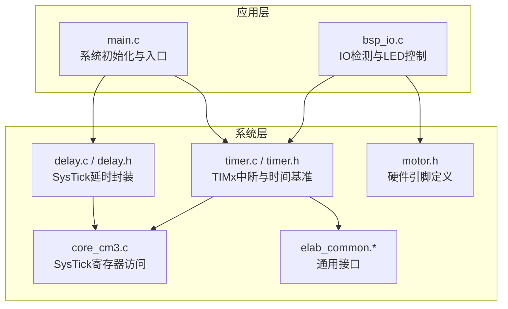
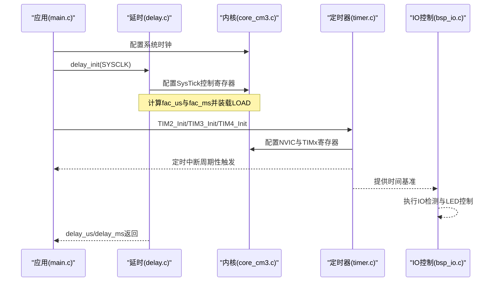
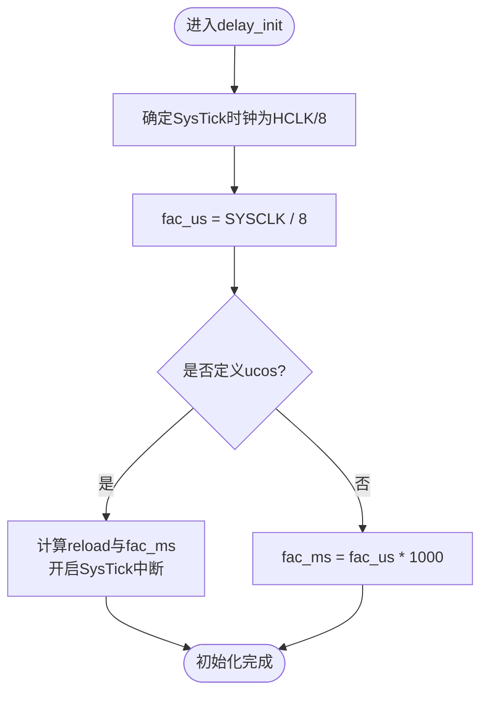
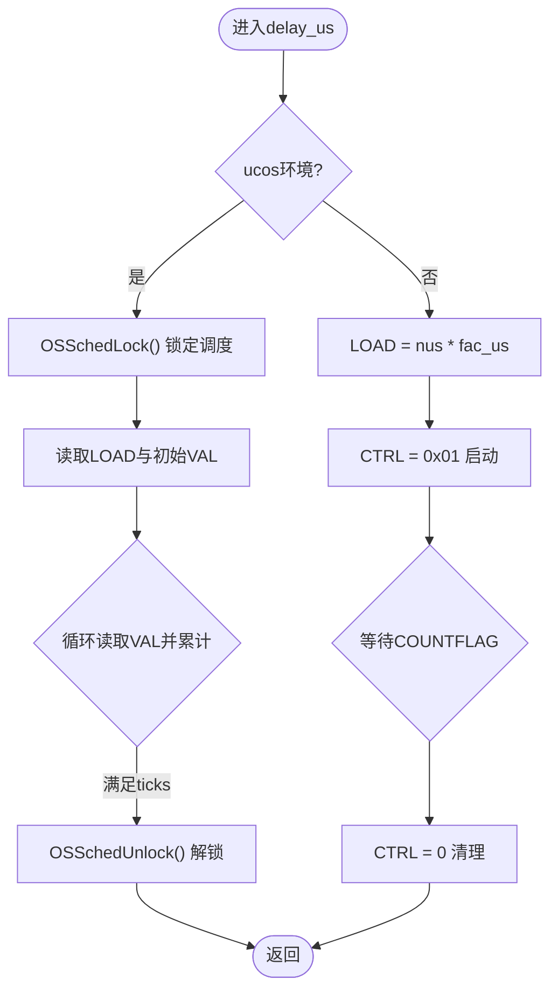
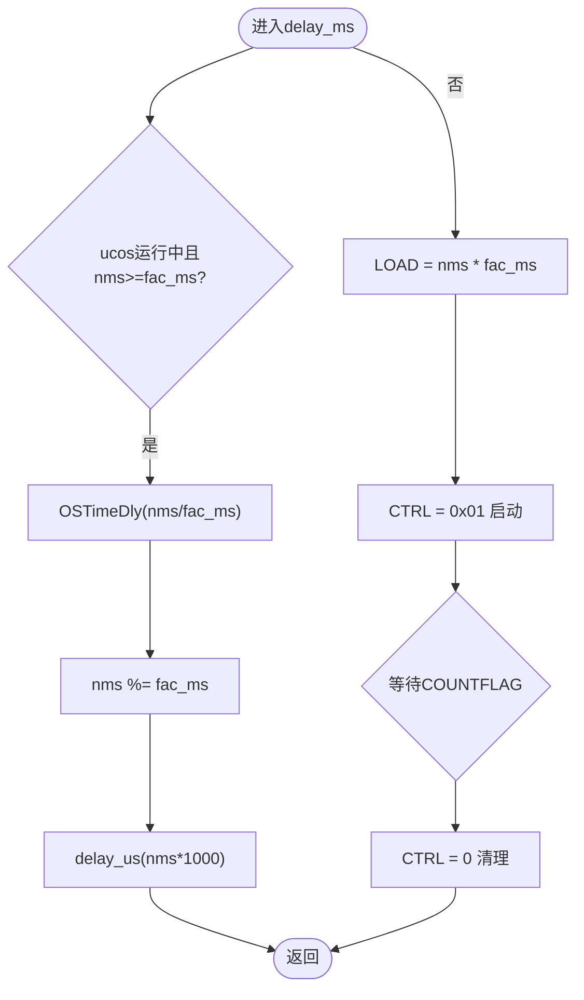
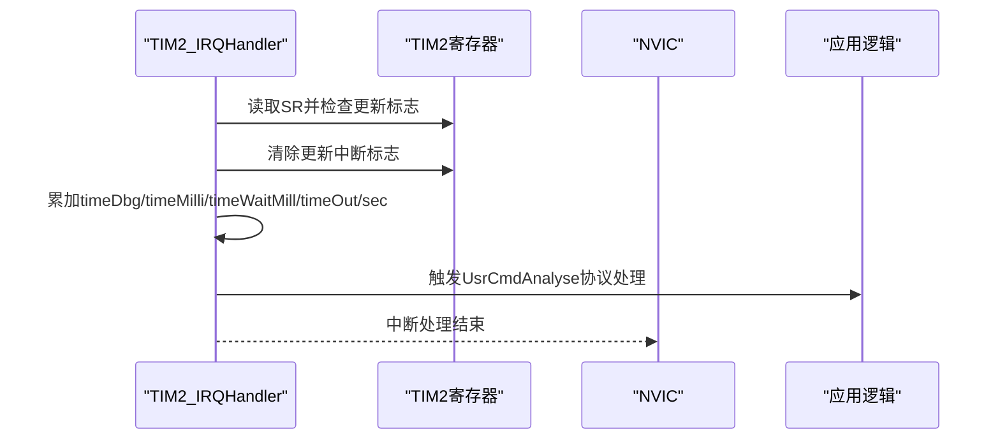
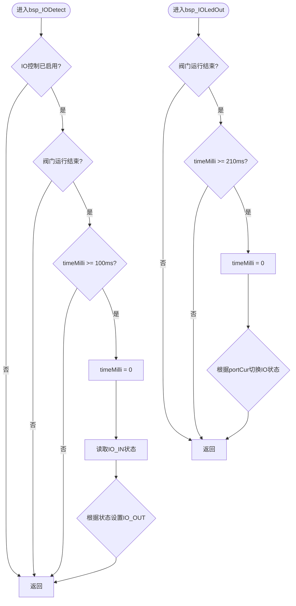
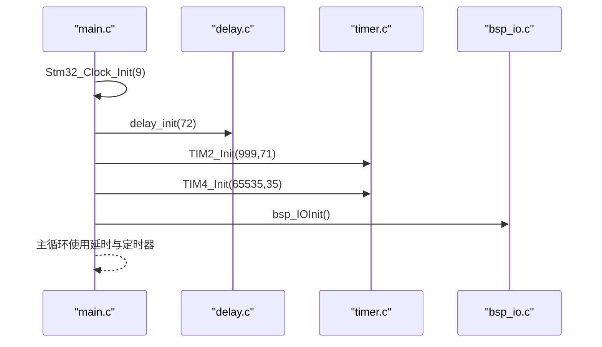
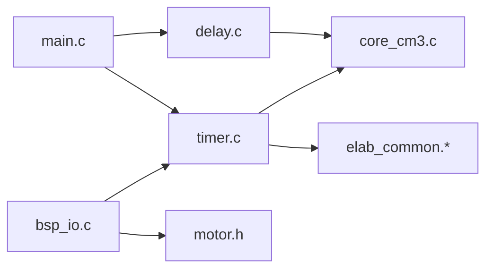

# 延时和定时功能

<cite>
**本文引用的文件**   
- [delay.c](file://SRC/SYSTEM/delay/delay.c)
- [delay.h](file://SRC/SYSTEM/delay/delay.h)
- [timer.c](file://SRC/SYSTEM/timer/timer.c)
- [timer.h](file://SRC/SYSTEM/timer/timer.h)
- [main.c](file://SRC/APP/main.c)
- [core_cm3.c](file://SRC/CMSIS/CoreSupport/core_cm3.c)
- [elab_common.h](file://SRC/3rd/common/elab_common.h)
- [elab_common.c](file://SRC/3rd/common/elab_common.c)
- [bsp_io.c](file://SRC/HARDWARE/io/bsp_io.c)
- [motor.h](file://SRC/HARDWARE/motor/motor.h)
</cite>

## 目录
1. [简介](#简介)
2. [项目结构](#项目结构)
3. [核心组件](#核心组件)
4. [架构总览](#架构总览)
5. [详细组件分析](#详细组件分析)
6. [依赖关系分析](#依赖关系分析)
7. [性能考虑](#性能考虑)
8. [故障排查指南](#故障排查指南)
9. [结论](#结论)
10. [附录](#附录)

## 简介
本文件聚焦于STM32F10x平台上的"延时与定时"功能，系统性解析以下内容：
- SysTick定时器的工作原理与配置方法
- delay_init初始化流程、fac_us与fac_ms倍乘数的计算逻辑
- delay_us与delay_ms在ucos与非ucos环境下的差异化实现策略
- 定时器中断机制与时间基准管理
- 延时精度分析与性能优化建议
- 实际使用场景与代码路径参考

**更新** 本次更新反映了定时器系统的简化，移除了timeLedDetect相关变量，简化了TIM2_IRQHandler()中断处理逻辑，提升了代码可维护性和执行效率。

## 项目结构
围绕延时与定时功能的相关模块组织如下：
- SYSTEM/delay：基于SysTick的微秒/毫秒延时实现（含ucos适配）
- SYSTEM/timer：通用定时器（TIM2/TIM3/TIM4等）中断初始化与回调
- APP/main：系统时钟初始化、延时初始化入口、定时器初始化入口
- CMSIS CoreSupport：Cortex-M3内核寄存器访问与SysTick底层能力
- 3rd/common：通用接口与弱符号扩展（如时间戳）
- HARDWARE/io：IO检测与LED控制逻辑，使用定时器时间基准

**图示来源**
- [main.c:300-358](file://SRC/APP/main.c#L300-L358)
- [bsp_io.c:75-153](file://SRC/HARDWARE/io/bsp_io.c#L75-L153)
- [timer.c:22-41](file://SRC/SYSTEM/timer/timer.c#L22-L41)
- [delay.c:19-42](file://SRC/SYSTEM/delay/delay.c#L19-L42)

**章节来源**
- [main.c:300-358](file://SRC/APP/main.c#L300-L358)
- [bsp_io.c:75-153](file://SRC/HARDWARE/io/bsp_io.c#L75-L153)
- [timer.c:22-41](file://SRC/SYSTEM/timer/timer.c#L22-L41)
- [delay.c:19-42](file://SRC/SYSTEM/delay/delay.c#L19-L42)

## 核心组件
- SysTick延时模块（delay.c/h）
  - 提供delay_init、delay_us、delay_ms三类接口
  - 在ucos环境下通过SysTick中断驱动系统节拍；在非ucos环境下直接使用SysTick计数
  - 关键变量fac_us、fac_ms分别用于微秒与毫秒延时的节拍换算
- 通用定时器模块（timer.c/h）
  - TIM2/TIM3/TIM4等定时器初始化与中断服务
  - 中断周期性累加时间基准（毫秒/秒等），作为应用层时间管理的基础
  - 简化后的TIM2_IRQHandler仅包含必要的时间累加和业务处理
- IO检测与LED控制模块（bsp_io.c）
  - 基于定时器时间基准的IO检测逻辑
  - LED状态指示与IO输出控制
- 应用入口（main.c）
  - 系统时钟初始化后调用delay_init与多个TIMx_Init，建立时间基准与延时能力

**章节来源**
- [delay.c:6-42](file://SRC/SYSTEM/delay/delay.c#L6-L42)
- [delay.h:11-13](file://SRC/SYSTEM/delay/delay.h#L11-L13)
- [timer.c:11-42](file://SRC/SYSTEM/timer/timer.c#L11-L42)
- [timer.h:12-24](file://SRC/SYSTEM/timer/timer.h#L12-L24)
- [main.c:300-358](file://SRC/APP/main.c#L300-L358)
- [bsp_io.c:75-153](file://SRC/HARDWARE/io/bsp_io.c#L75-L153)

## 架构总览
SysTick与通用定时器共同构成系统的"软硬结合"的时间基础设施：
- SysTick：高分辨率、低开销，适合短时延时与ucos节拍
- TIMx：周期性中断，提供稳定的毫秒/秒级时间基准，便于业务逻辑的时间推进

**图示来源**
- [main.c:300-358](file://SRC/APP/main.c#L300-L358)
- [delay.c:23-42](file://SRC/SYSTEM/delay/delay.c#L23-L42)
- [timer.c:11-42](file://SRC/SYSTEM/timer/timer.c#L11-L42)
- [bsp_io.c:75-153](file://SRC/HARDWARE/io/bsp_io.c#L75-L153)

## 详细组件分析

### SysTick延时模块（delay.c/h）
- 初始化流程与倍乘数计算
  - fac_us = SYSCLK / 8：SysTick时钟为系统时钟的1/8，fac_us用于将微秒转换为SysTick节拍
  - 在ucos环境下：根据OS_TICKS_PER_SEC计算reload与fac_ms，SysTick中断用于ucos节拍
  - 在非ucos环境下：fac_ms = fac_us * 1000，直接以节拍数控制延时
- 微秒延时（delay_us）
  - ucos：通过OSSchedLock锁定调度，循环读取SysTick->VAL，累计计数值达到ticks后退出
  - 非ucos：直接设置LOAD为nus*fac_us，等待COUNTFLAG标志位指示时间到达
- 毫秒延时（delay_ms）
  - ucos：若nms大于等于fac_ms，则调用OSTimeDly进行任务休眠；不足部分用delay_us补齐
  - 非ucos：设置LOAD为nms*fac_ms，等待COUNTFLAG标志位

**图示来源**
- [delay.c:23-42](file://SRC/SYSTEM/delay/delay.c#L23-L42)

**图示来源**
- [delay.c:47-101](file://SRC/SYSTEM/delay/delay.c#L47-L101)

**图示来源**
- [delay.c:72-122](file://SRC/SYSTEM/delay/delay.c#L72-L122)

**章节来源**
- [delay.c:6-42](file://SRC/SYSTEM/delay/delay.c#L6-L42)
- [delay.c:47-122](file://SRC/SYSTEM/delay/delay.c#L47-L122)
- [delay.h:11-13](file://SRC/SYSTEM/delay/delay.h#L11-L13)

### 通用定时器模块（timer.c/h）
- 定时器初始化
  - 以TIM2/TIM3/TIM4为例，开启APB1时钟，配置ARR/PSC，使能更新中断，配置NVIC优先级组
  - ARR与PSC共同决定定时周期（例如1ms），作为系统时间基准
- 中断服务流程
  - 清除更新中断标志位
  - 简化后的TIM2_IRQHandler仅包含必要的时间累加和业务处理
  - 累加各类时间变量（timeDbg、timeMilli、timeWaitMill、timeOut、sec）
  - 触发协议处理或轴控制等业务逻辑

**更新** 移除了timeLedDetect相关变量和逻辑，简化了中断处理流程，提升了执行效率。

**图示来源**
- [timer.c:22-41](file://SRC/SYSTEM/timer/timer.c#L22-L41)

**章节来源**
- [timer.c:11-42](file://SRC/SYSTEM/timer/timer.c#L11-L42)
- [timer.c:22-41](file://SRC/SYSTEM/timer/timer.c#L22-L41)
- [timer.h:12-24](file://SRC/SYSTEM/timer/timer.h#L12-L24)

### IO检测与LED控制模块（bsp_io.c）
- IO检测逻辑
  - 基于定时器时间基准的IO检测，避免频繁IO读取
  - 使用timerPara.timeMilli作为时间窗口控制（100ms间隔）
  - 支持多种硬件版本的IO配置和状态检测
- LED控制逻辑
  - 根据阀门状态控制LED指示灯
  - 支持C901版本的特殊LED输出控制
  - 使用timerPara.timeMilli作为LED闪烁的时间基准

**图示来源**
- [bsp_io.c:75-153](file://SRC/HARDWARE/io/bsp_io.c#L75-L153)
- [bsp_io.c:159-191](file://SRC/HARDWARE/io/bsp_io.c#L159-L191)

**章节来源**
- [bsp_io.c:75-153](file://SRC/HARDWARE/io/bsp_io.c#L75-L153)
- [bsp_io.c:159-191](file://SRC/HARDWARE/io/bsp_io.c#L159-L191)
- [motor.h:16-42](file://SRC/HARDWARE/motor/motor.h#L16-L42)

### 应用入口与集成（main.c）
- 系统时钟初始化后调用delay_init传入SYSCLK（如72）
- 初始化多个定时器（TIM2/TIM4等）以建立时间基准
- 在主循环中配合协议栈与控制逻辑使用延时与定时器

**图示来源**
- [main.c:300-358](file://SRC/APP/main.c#L300-L358)

**章节来源**
- [main.c:300-358](file://SRC/APP/main.c#L300-L358)

## 依赖关系分析
- 延时模块依赖SysTick寄存器与NVIC配置，由CMSIS提供底层访问
- 定时器模块依赖RCC、NVIC与TIM外设寄存器
- IO控制模块依赖定时器时间基准和硬件引脚定义
- 应用层通过main.c统一初始化延时与定时器，形成稳定的时间基础设施

**图示来源**
- [main.c:300-358](file://SRC/APP/main.c#L300-L358)
- [delay.c:23-42](file://SRC/SYSTEM/delay/delay.c#L23-L42)
- [timer.c:11-42](file://SRC/SYSTEM/timer/timer.c#L11-L42)
- [bsp_io.c:75-153](file://SRC/HARDWARE/io/bsp_io.c#L75-L153)
- [motor.h:16-42](file://SRC/HARDWARE/motor/motor.h#L16-L42)

**章节来源**
- [main.c:300-358](file://SRC/APP/main.c#L300-L358)
- [delay.c:23-42](file://SRC/SYSTEM/delay/delay.c#L23-L42)
- [timer.c:11-42](file://SRC/SYSTEM/timer/timer.c#L11-L42)
- [bsp_io.c:75-153](file://SRC/HARDWARE/io/bsp_io.c#L75-L153)
- [motor.h:16-42](file://SRC/HARDWARE/motor/motor.h#L16-L42)

## 性能考虑
- SysTick延时精度
  - 基于fac_us/fac_ms的整数换算，存在舍入误差；微秒延时在ucos下通过VAL递减计数累计，非ucos下通过COUNTFLAG判断，均受系统时钟与中断影响
  - 非ucos下，delay_us/delay_ms直接使用LOAD计数，避免任务切换开销，但需确保LOAD在24位范围内
- 时间基准稳定性
  - TIMx中断提供稳定的毫秒/秒基准，适用于业务逻辑的时间推进与超时控制
  - 简化后的中断处理逻辑减少了不必要的变量操作，提升了中断响应效率
- IO控制优化
  - IO检测采用时间窗口控制，避免频繁IO读取操作
  - LED控制使用独立的时间基准，不影响主业务逻辑
- 优化建议
  - 尽量批量延时，减少频繁调用delay_us/delay_ms
  - 在高频中断场景下，优先使用TIMx中断+全局变量计时，而非短周期SysTick轮询
  - 合理设置OS_TICKS_PER_SEC，平衡延时精度与系统开销
  - 利用简化的中断处理逻辑，提升整体系统响应性能

## 故障排查指南
- 延时不准确
  - 检查delay_init传入SYSCLK是否与实际一致
  - 确认ucos是否启用，以及OS_TICKS_PER_SEC配置是否合理
- SysTick中断未触发
  - 检查SysTick->CTRL配置（ENABLE、TICKINT、CLCKSOURCE），确认NVIC优先级组设置
- TIMx中断异常
  - 确认ARR/PSC设置是否导致溢出或过小
  - 检查中断标志位是否正确清除（SR更新标志位）
  - 验证简化的中断处理逻辑是否正常执行
- IO控制失效
  - 检查IO控制是否启用（syspara.ioCtrl）
  - 确认阀门状态是否为VALVE_RUN_END
  - 验证timerPara.timeMilli时间基准是否正常累加
- LED指示异常
  - 检查硬件版本对应的LED引脚配置
  - 确认阀门状态与LED状态映射关系
  - 验证时间基准是否达到LED闪烁间隔要求

**章节来源**
- [delay.c:23-42](file://SRC/SYSTEM/delay/delay.c#L23-L42)
- [timer.c:22-41](file://SRC/SYSTEM/timer/timer.c#L22-L41)
- [bsp_io.c:75-153](file://SRC/HARDWARE/io/bsp_io.c#L75-L153)

## 结论
本系统通过SysTick与通用定时器实现了高可靠的时间基础设施：
- SysTick提供微秒至毫秒级的高精度延时，支持ucos与非ucos双环境
- TIMx中断提供稳定的毫秒/秒级时间基准，支撑业务逻辑的时间推进
- 简化的中断处理逻辑提升了系统执行效率和可维护性
- IO检测与LED控制模块充分利用时间基准，实现高效的硬件控制
- 合理配置fac_us/fac_ms与定时器参数，可在保证精度的同时兼顾性能与稳定性

## 附录
- 使用场景参考
  - 短时序控制：delay_us/delay_ms用于脉冲宽度、通信帧间隔等
  - 业务计时：TIMx中断累计毫秒/秒，用于超时保护、周期任务调度
  - 协议处理：定时器中断内触发协议栈处理，确保实时性
  - IO检测：基于时间基准的IO状态检测，避免频繁IO操作
  - LED控制：根据阀门状态和时间基准控制LED指示灯
- 相关接口路径
  - 延时初始化：[delay_init:23-42](file://SRC/SYSTEM/delay/delay.c#L23-L42)
  - 微秒延时：[delay_us:47-101](file://SRC/SYSTEM/delay/delay.c#L47-L101)
  - 毫秒延时：[delay_ms:72-122](file://SRC/SYSTEM/delay/delay.c#L72-L122)
  - 定时器初始化：[TIM2_Init/TIM3_Init/TIM4_Init:11-42](file://SRC/SYSTEM/timer/timer.c#L11-L42)
  - IO检测：[bsp_IODetect:75-153](file://SRC/HARDWARE/io/bsp_io.c#L75-L153)
  - LED控制：[bsp_IOLedOut:159-191](file://SRC/HARDWARE/io/bsp_io.c#L159-L191)
  - 应用入口：[main:300-358](file://SRC/APP/main.c#L300-L358)