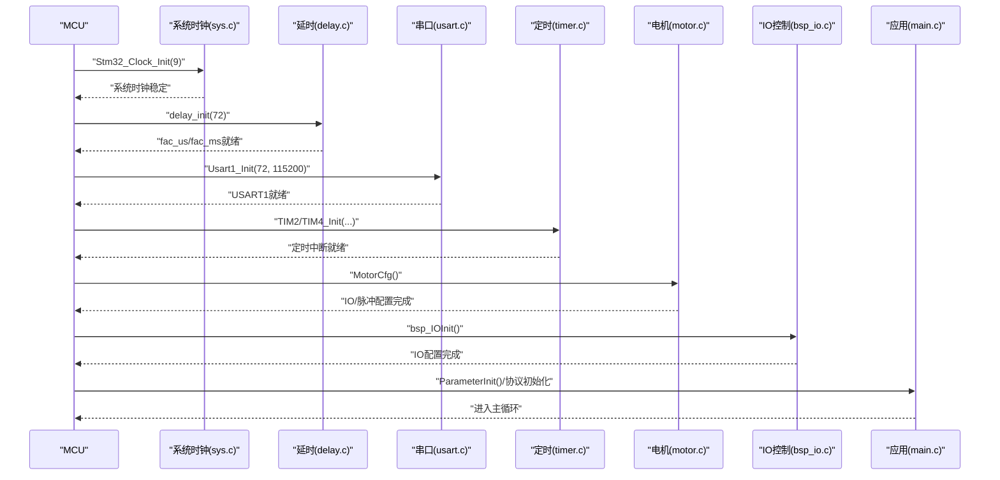
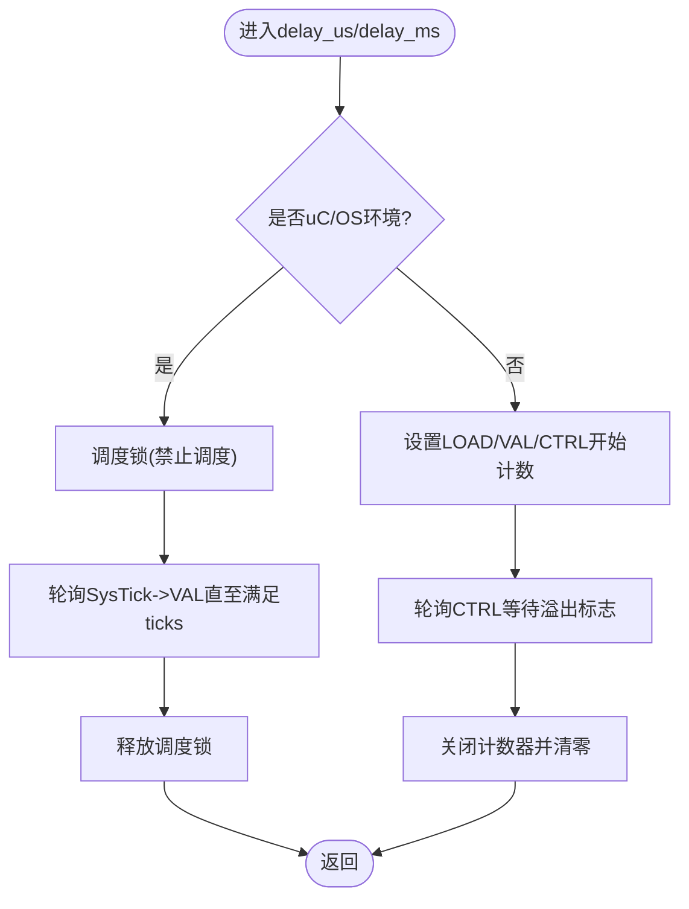
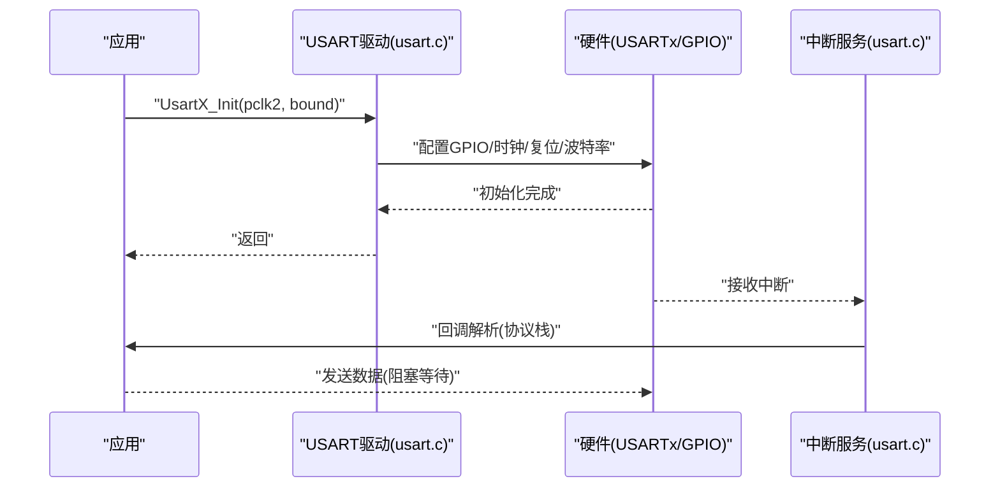
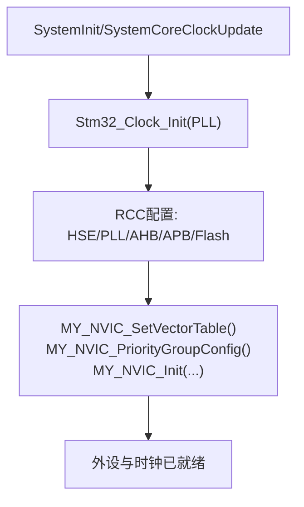
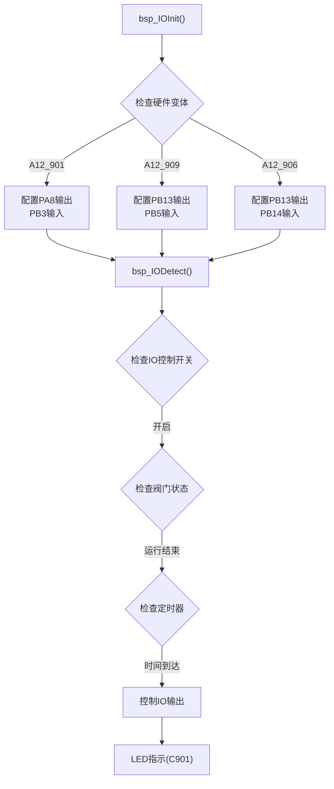
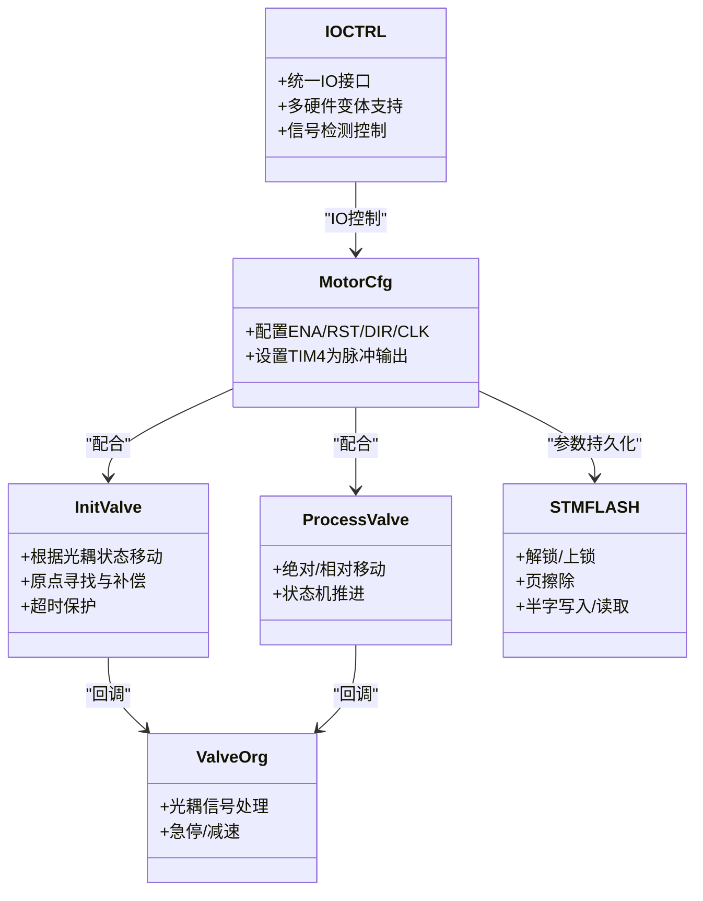
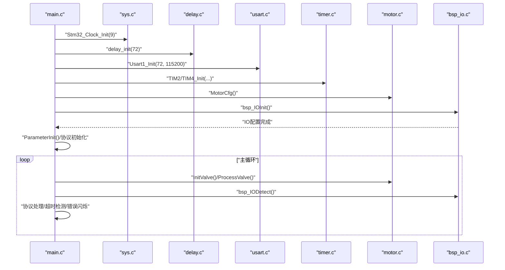
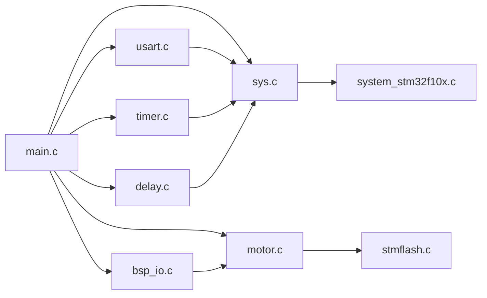

# 硬件抽象层

<cite>
**本文引用的文件**
- [delay.c](file://SRC/SYSTEM/delay/delay.c)
- [delay.h](file://SRC/SYSTEM/delay/delay.h)
- [timer.c](file://SRC/SYSTEM/timer/timer.c)
- [timer.h](file://SRC/SYSTEM/timer/timer.h)
- [usart.c](file://SRC/SYSTEM/usart/usart.c)
- [usart.h](file://SRC/SYSTEM/usart/usart.h)
- [sys.c](file://SRC/SYSTEM/sys/sys.c)
- [sys.h](file://SRC/SYSTEM/sys/sys.h)
- [motor.c](file://SRC/HARDWARE/motor/motor.c)
- [motor.h](file://SRC/HARDWARE/motor/motor.h)
- [stmflash.c](file://SRC/HARDWARE/stmFlash/stmflash.c)
- [stmflash.h](file://SRC/HARDWARE/stmFlash/stmflash.h)
- [main.c](file://SRC/APP/main.c)
- [system_stm32f10x.c](file://SRC/CMSIS/DeviceSupport/system_stm32f10x.c)
- [elab_common.h](file://SRC/3rd/common/elab_common.h)
- [bsp_io.c](file://SRC/HARDWARE/io/bsp_io.c)
- [bsp_io.h](file://SRC/HARDWARE/io/bsp_io.h)
- [common.h](file://SRC/APP/common.h)
</cite>

## 目录
1. [简介](#简介)
2. [项目结构](#项目结构)
3. [核心组件](#核心组件)
4. [架构总览](#架构总览)
5. [详细组件分析](#详细组件分析)
6. [依赖关系分析](#依赖关系分析)
7. [性能考量](#性能考量)
8. [故障排查指南](#故障排查指南)
9. [结论](#结论)
10. [附录](#附录)

## 简介
本文件面向硬件工程师与嵌入式开发者，系统性梳理"通用开关器"项目的硬件抽象层（HAL）。文档聚焦以下目标：
- 设计目标与实现策略：通过软件抽象硬件差异，提供统一的硬件接口，屏蔽不同MCU与外设的具体实现细节。
- 延时与定时：精确延时算法、定时器配置与时间基准管理。
- 串口通信：USART初始化、数据收发处理与波特率配置。
- 系统初始化：时钟配置、外设初始化与NVIC中断配置。
- IO控制：统一的IO控制接口，包括GPIO配置、信号控制和检测逻辑，支持多种硬件变体（A12_901, A12_909, A12_906）。
- 扩展与移植：如何在新平台或新硬件上快速适配HAL。
- 调试与测试：硬件调试与验证要点。

## 项目结构
硬件抽象层主要分布在以下目录：
- SYSTEM：系统级抽象（延时、定时、串口、系统与NVIC）
- HARDWARE：硬件设备抽象（电机、EEPROM/Flash、IO控制等）
- APP：应用入口与系统初始化流程
- CMSIS：设备支持包（SystemInit、SystemCoreClock等）
- 3rd：第三方通用工具头文件

```mermaid
graph TB
subgraph "应用层(APP)"
MAIN["main.c"]
END
subgraph "系统抽象层(SYSTEM)"
DELAY["delay.c/delay.h"]
TIMER["timer.c/timer.h"]
USART["usart.c/usart.h"]
SYS["sys.c/sys.h"]
END
subgraph "硬件抽象层(HARDWARE)"
MOTOR["motor.c/motor.h"]
STMFLASH["stmflash.c/stmflash.h"]
IOCTRL["bsp_io.c/bsp_io.h"]
END
subgraph "设备支持(CMSIS)"
CMSIS_SYS["system_stm32f10x.c"]
END
subgraph "第三方"
ELAB["elab_common.h"]
END
MAIN --> DELAY
MAIN --> TIMER
MAIN --> USART
MAIN --> SYS
MAIN --> MOTOR
MAIN --> STMFLASH
MAIN --> IOCTRL
MAIN --> CMSIS_SYS
MAIN --> ELAB
```

**图示来源**
- [main.c](file://SRC/APP/main.c)
- [delay.c](file://SRC/SYSTEM/delay/delay.c)
- [timer.c](file://SRC/SYSTEM/timer/timer.c)
- [usart.c](file://SRC/SYSTEM/usart/usart.c)
- [sys.c](file://SRC/SYSTEM/sys/sys.c)
- [motor.c](file://SRC/HARDWARE/motor/motor.c)
- [stmflash.c](file://SRC/HARDWARE/stmFlash/stmflash.c)
- [bsp_io.c](file://SRC/HARDWARE/io/bsp_io.c)
- [system_stm32f10x.c](file://SRC/CMSIS/DeviceSupport/system_stm32f10x.c)
- [elab_common.h](file://SRC/3rd/common/elab_common.h)

**章节来源**
- [main.c](file://SRC/APP/main.c)
- [system_stm32f10x.c](file://SRC/CMSIS/DeviceSupport/system_stm32f10x.c)

## 核心组件
- 延时与定时：基于SysTick与通用定时器，提供us/ms级延时与周期性任务调度。
- 串口通信：多路USART初始化、中断驱动收发与波特率计算。
- 系统与NVIC：系统时钟初始化、向量表与NVIC优先级分组、中断配置。
- 电机控制：IO配置、脉冲/方向控制、光耦寻位与保护机制。
- IO控制：统一的IO控制接口，支持多种硬件变体的GPIO配置、信号控制和检测逻辑。
- 存储抽象：内部Flash读写封装，支持页擦除与半字写入。

**章节来源**
- [delay.c](file://SRC/SYSTEM/delay/delay.c)
- [timer.c](file://SRC/SYSTEM/timer/timer.c)
- [usart.c](file://SRC/SYSTEM/usart/usart.c)
- [sys.c](file://SRC/SYSTEM/sys/sys.c)
- [motor.c](file://SRC/HARDWARE/motor/motor.c)
- [stmflash.c](file://SRC/HARDWARE/stmFlash/stmflash.c)
- [bsp_io.c](file://SRC/HARDWARE/io/bsp_io.c)
- [bsp_io.h](file://SRC/HARDWARE/io/bsp_io.h)

## 架构总览
系统初始化流程自上而下贯穿时钟、外设与中断配置，随后进入主循环，驱动协议栈、电机与IO控制。



**图示来源**
- [main.c](file://SRC/APP/main.c)
- [sys.c](file://SRC/SYSTEM/sys/sys.c)
- [delay.c](file://SRC/SYSTEM/delay/delay.c)
- [usart.c](file://SRC/SYSTEM/usart/usart.c)
- [timer.c](file://SRC/SYSTEM/timer/timer.c)
- [motor.c](file://SRC/HARDWARE/motor/motor.c)
- [bsp_io.c](file://SRC/HARDWARE/io/bsp_io.c)

## 详细组件分析

### 延时与定时
- SysTick延时：通过fac_us/fac_ms倍乘数与寄存器计数实现us/ms级延时；在uC/OS环境下接管SysTick中断并参与调度。
- 定时器中断：TIM2/TIM3/TIM4等通用定时器按预分频与自动重装载配置产生1ms/10ms等周期中断，用于系统时间基准、协议处理与轴控制。
- 时间基准管理：全局计时变量（如毫秒、秒、调试计时）在中断中累加，主循环按基准进行超时判断与任务调度。



**图示来源**
- [delay.c](file://SRC/SYSTEM/delay/delay.c)

**章节来源**
- [delay.c](file://SRC/SYSTEM/delay/delay.c)
- [delay.h](file://SRC/SYSTEM/delay/delay.h)
- [timer.c](file://SRC/SYSTEM/timer/timer.c)
- [timer.h](file://SRC/SYSTEM/timer/timer.h)

### 串口通信抽象
- USART初始化：根据pclk2与目标波特率计算BRR（整数与小数部分），配置GPIO复用推挽输出与上/下拉输入，使能USART与中断。
- 数据收发：发送阻塞等待DR可写；接收中断回调解析协议数据。
- 多路支持：USART1/2/3（及条件编译下的USART4），分别绑定不同GPIO端口与中断向量。



**图示来源**
- [usart.c](file://SRC/SYSTEM/usart/usart.c)
- [usart.h](file://SRC/SYSTEM/usart/usart.h)

**章节来源**
- [usart.c](file://SRC/SYSTEM/usart/usart.c)
- [usart.h](file://SRC/SYSTEM/usart/usart.h)

### 系统与NVIC初始化
- 时钟初始化：外部高速晶振使能、PLL倍频、AHB/APB分频与Flash等待周期设置，最终切换系统时钟源。
- NVIC配置：分组设置、抢占优先级与响应优先级编码、中断使能与优先级寄存器写入。
- 向量表：支持将向量表放置在RAM或Flash，便于异常处理与引导。



**图示来源**
- [sys.c](file://SRC/SYSTEM/sys/sys.c)
- [system_stm32f10x.c](file://SRC/CMSIS/DeviceSupport/system_stm32f10x.c)

**章节来源**
- [sys.c](file://SRC/SYSTEM/sys/sys.c)
- [sys.h](file://SRC/SYSTEM/sys/sys.h)
- [system_stm32f10x.c](file://SRC/CMSIS/DeviceSupport/system_stm32f10x.c)

### IO控制抽象
- 统一IO接口：提供统一的IO控制接口，包括GPIO配置、信号控制和检测逻辑。
- 多硬件变体支持：支持A12_901、A12_909、A12_906三种硬件变体，通过条件编译实现差异化配置。
- IO配置：根据不同硬件变体配置相应的GPIO引脚，包括输出引脚和输入引脚。
- 信号检测：定期检测IO信号状态，根据阀门当前位置和IO状态控制输出信号。
- LED指示：针对C901版本提供LED输出状态指示功能。



**图示来源**
- [bsp_io.c](file://SRC/HARDWARE/io/bsp_io.c)
- [bsp_io.h](file://SRC/HARDWARE/io/bsp_io.h)

**章节来源**
- [bsp_io.c](file://SRC/HARDWARE/io/bsp_io.c)
- [bsp_io.h](file://SRC/HARDWARE/io/bsp_io.h)

### 电机控制抽象
- IO与脉冲：配置ENA/RST/DIR/CLK等IO，TIM4作为脉冲输出与轴控制定时器。
- 寻位与保护：光耦信号检测、原点寻找、方向与原点补偿、运行/初始化超时保护。
- 参数与存储：I2C读写参数（地址、波特率、速度、减速比、半通道等），内部Flash写入与页擦除。



**图示来源**
- [motor.c](file://SRC/HARDWARE/motor/motor.c)
- [motor.h](file://SRC/HARDWARE/motor/motor.h)
- [stmflash.c](file://SRC/HARDWARE/stmFlash/stmflash.c)
- [stmflash.h](file://SRC/HARDWARE/stmFlash/stmflash.h)
- [bsp_io.c](file://SRC/HARDWARE/io/bsp_io.c)

**章节来源**
- [motor.c](file://SRC/HARDWARE/motor/motor.c)
- [motor.h](file://SRC/HARDWARE/motor/motor.h)
- [stmflash.c](file://SRC/HARDWARE/stmFlash/stmflash.c)
- [stmflash.h](file://SRC/HARDWARE/stmFlash/stmflash.h)

### 应用初始化与主循环
- 初始化顺序：时钟→延时→JTAG设置→串口→I2C→定时器→电机→IO→参数读取与协议初始化→命令解析。
- 主循环：电机初始化/运行、协议处理、周期性检测与错误指示、老化测试与错误闪烁。



**图示来源**
- [main.c](file://SRC/APP/main.c)
- [sys.c](file://SRC/SYSTEM/sys/sys.c)
- [delay.c](file://SRC/SYSTEM/delay/delay.c)
- [usart.c](file://SRC/SYSTEM/usart/usart.c)
- [timer.c](file://SRC/SYSTEM/timer/timer.c)
- [motor.c](file://SRC/HARDWARE/motor/motor.c)
- [bsp_io.c](file://SRC/HARDWARE/io/bsp_io.c)

**章节来源**
- [main.c](file://SRC/APP/main.c)

## 依赖关系分析
- 应用层依赖系统抽象层与硬件抽象层，系统抽象层依赖CMSIS与寄存器访问。
- 串口与定时器依赖NVIC配置；电机控制依赖定时器与GPIO；Flash抽象依赖延时与底层寄存器。
- IO控制模块依赖电机控制模块的状态信息进行信号检测与控制。
- 外设初始化顺序影响系统稳定性，必须遵循"时钟→外设→中断"的原则。



**图示来源**
- [main.c](file://SRC/APP/main.c)
- [sys.c](file://SRC/SYSTEM/sys/sys.c)
- [delay.c](file://SRC/SYSTEM/delay/delay.c)
- [usart.c](file://SRC/SYSTEM/usart/usart.c)
- [timer.c](file://SRC/SYSTEM/timer/timer.c)
- [motor.c](file://SRC/HARDWARE/motor/motor.c)
- [bsp_io.c](file://SRC/HARDWARE/io/bsp_io.c)
- [stmflash.c](file://SRC/HARDWARE/stmFlash/stmflash.c)
- [system_stm32f10x.c](file://SRC/CMSIS/DeviceSupport/system_stm32f10x.c)

**章节来源**
- [main.c](file://SRC/APP/main.c)
- [sys.c](file://SRC/SYSTEM/sys/sys.c)
- [delay.c](file://SRC/SYSTEM/delay/delay.c)
- [usart.c](file://SRC/SYSTEM/usart/usart.c)
- [timer.c](file://SRC/SYSTEM/timer/timer.c)
- [motor.c](file://SRC/HARDWARE/motor/motor.c)
- [bsp_io.c](file://SRC/HARDWARE/io/bsp_io.c)
- [stmflash.c](file://SRC/HARDWARE/stmFlash/stmflash.c)
- [system_stm32f10x.c](file://SRC/CMSIS/DeviceSupport/system_stm32f10x.c)

## 性能考量
- SysTick延时精度受系统时钟与预分频影响，建议在高频时钟下使用更短延时以减少误差累积。
- 定时器中断频率与任务调度需平衡实时性与CPU占用，避免过长中断处理导致抖动。
- USART收发采用中断+轮询组合，注意在高波特率场景下避免中断饱和。
- Flash写入需考虑页擦除与等待状态，批量写入应合并以降低擦写次数。
- IO控制检测频率需合理设置，避免过于频繁的GPIO操作影响系统性能。

## 故障排查指南
- 串口无输出/接收异常：检查USART时钟与GPIO复用、BRR计算、中断使能与优先级。
- 定时不准：确认SysTick/定时器时钟源、预分频与自动重装载值，核对中断优先级与调度。
- 电机不动/抖动：检查ENA/DIR/CLK配置、脉冲频率与占空比、光耦信号与保护逻辑。
- IO控制异常：检查硬件变体宏定义、GPIO配置、信号检测逻辑与定时器配置。
- 参数丢失：确认I2C读写流程与Flash写入路径，避免在忙状态写入。

**章节来源**
- [usart.c](file://SRC/SYSTEM/usart/usart.c)
- [timer.c](file://SRC/SYSTEM/timer/timer.c)
- [motor.c](file://SRC/HARDWARE/motor/motor.c)
- [stmflash.c](file://SRC/HARDWARE/stmFlash/stmflash.c)
- [bsp_io.c](file://SRC/HARDWARE/io/bsp_io.c)

## 结论
本HAL通过清晰的模块边界与统一接口，有效屏蔽硬件差异，实现了延时、定时、串口、IO控制与系统初始化的标准化。结合电机控制与Flash抽象，形成从系统到设备的完整硬件抽象链路。新增的IO控制模块进一步增强了系统的硬件抽象能力，支持多种硬件变体的统一管理。建议在新平台移植时，优先复用NVIC与时钟抽象，再逐步替换外设实现，确保系统稳定性与可维护性。

## 附录
- 扩展与移植建议
  - 新增外设：在SYSTEM/HARDWARE新增对应模块，遵循现有初始化与中断处理模式。
  - 时钟变更：修改系统时钟初始化与SysTick/定时器预分频，确保时间基准一致。
  - 串口迁移：保持波特率计算与中断回调签名，适配新GPIO与外设编号。
  - 中断优先级：统一NVIC分组策略，避免同组内优先级冲突。
  - IO控制扩展：新增硬件变体时，在bsp_io.c中添加对应的条件编译分支，确保GPIO配置正确。
- 调试与测试
  - 使用串口打印关键变量与状态机步进，结合示波器观测脉冲与IO电平。
  - 在高负载场景下测量中断延迟与抖动，优化任务调度与中断处理时长。
  - 对Flash写入进行压力测试，记录擦写次数与失败率。
  - IO控制测试：验证不同硬件变体下的IO信号检测与控制逻辑，确保兼容性。