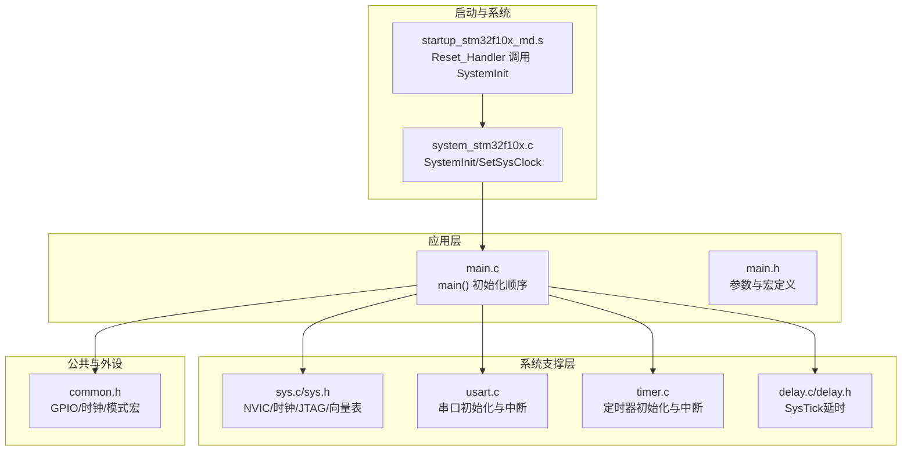
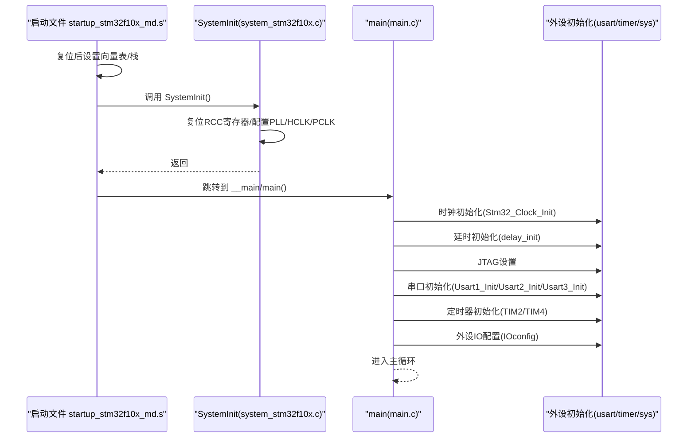
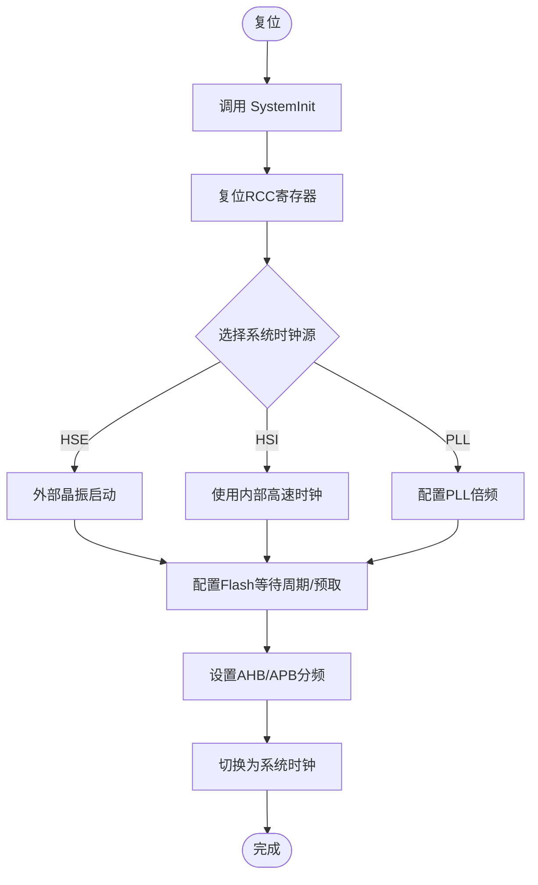
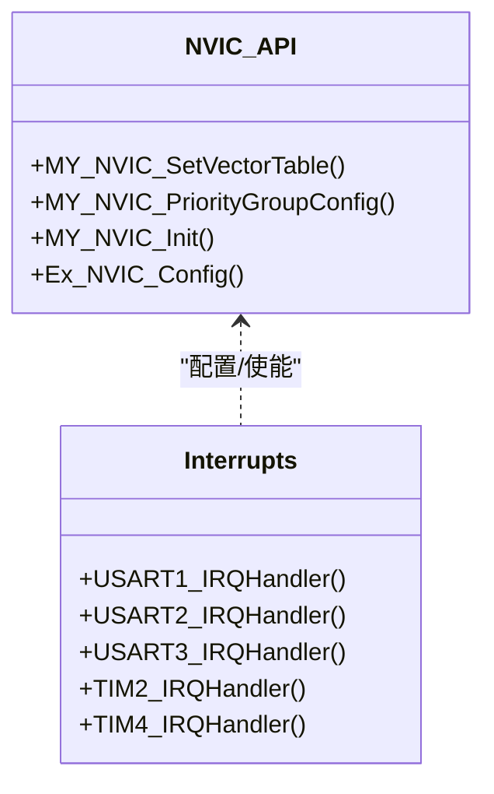
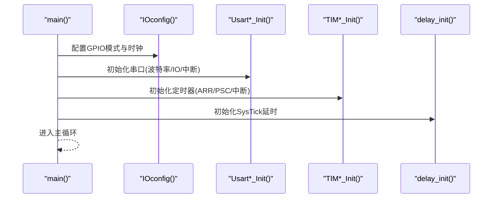
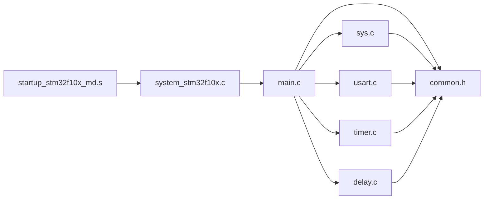

# 系统初始化

<cite>
**本文引用的文件列表**
- [system_stm32f10x.c](file://SRC/CMSIS/DeviceSupport/system_stm32f10x.c)
- [system_stm32f10x.h](file://SRC/CMSIS/DeviceSupport/system_stm32f10x.h)
- [startup_stm32f10x_md.s](file://SRC/CMSIS/DeviceSupport/startup/startup_stm32f10x_md.s)
- [main.c](file://SRC/APP/main.c)
- [main.h](file://SRC/APP/main.h)
- [sys.c](file://SRC/SYSTEM/sys/sys.c)
- [sys.h](file://SRC/SYSTEM/sys/sys.h)
- [usart.c](file://SRC/SYSTEM/usart/usart.c)
- [timer.c](file://SRC/SYSTEM/timer/timer.c)
- [delay.c](file://SRC/SYSTEM/delay/delay.c)
- [delay.h](file://SRC/SYSTEM/delay/delay.h)
- [common.h](file://SRC/APP/common.h)
</cite>

## 目录
1. [简介](#简介)
2. [项目结构](#项目结构)
3. [核心组件](#核心组件)
4. [架构总览](#架构总览)
5. [详细组件分析](#详细组件分析)
6. [依赖关系分析](#依赖关系分析)
7. [性能考量](#性能考量)
8. [故障排查指南](#故障排查指南)
9. [结论](#结论)
10. [附录](#附录)

## 简介
本文件聚焦于系统初始化模块，系统性阐述：
- 系统时钟配置（PLL倍频、AHB/APB分频与各外设时钟分配）
- 外设初始化流程（GPIO、USART、TIM等）与顺序
- NVIC中断控制器初始化（优先级分组与中断使能）
- 系统启动流程与关键初始化函数作用
- 系统资源管理最佳实践与性能优化建议
- 完整初始化代码示例路径与调试技巧

## 项目结构
该项目基于CMSIS与标准外设库，采用分层组织：
- 启动与系统时钟：CMSIS启动文件与SystemInit实现
- 应用入口与业务逻辑：APP层main.c
- 系统支撑：SYSTEM层（sys、usart、timer、delay等）
- 外设抽象与公共宏：APP层common.h

图表来源
- [startup_stm32f10x_md.s:128-137](file://SRC/CMSIS/DeviceSupport/startup/startup_stm32f10x_md.s#L128-L137)
- [system_stm32f10x.c:212-269](file://SRC/CMSIS/DeviceSupport/system_stm32f10x.c#L212-L269)
- [main.c:433-494](file://SRC/APP/main.c#L433-L494)
- [sys.c:150-172](file://SRC/SYSTEM/sys/sys.c#L150-L172)
- [usart.c:38-66](file://SRC/SYSTEM/usart/usart.c#L38-L66)
- [timer.c:11-19](file://SRC/SYSTEM/timer/timer.c#L11-L19)
- [delay.c:23-42](file://SRC/SYSTEM/delay/delay.c#L23-L42)

章节来源
- [startup_stm32f10x_md.s:128-137](file://SRC/CMSIS/DeviceSupport/startup/startup_stm32f10x_md.s#L128-L137)
- [system_stm32f10x.c:212-269](file://SRC/CMSIS/DeviceSupport/system_stm32f10x.c#L212-L269)
- [main.c:433-494](file://SRC/APP/main.c#L433-L494)

## 核心组件
- 系统时钟与启动：由启动文件调用SystemInit完成时钟与向量表配置；SystemInit再根据编译期宏选择目标系统频率，并设置AHB/APB分频与Flash预取/等待周期。
- 中断与NVIC：提供NVIC分组配置、中断使能与优先级设置接口；外部中断通过Ex_NVIC_Config完成映射与触发模式配置。
- 外设初始化：GPIO、USART、TIM、SysTick等均在main()中按顺序初始化，确保系统稳定运行与通信可用。
- 资源管理：统一的GPIO模式宏、时钟使能宏与中断优先级策略，便于维护与移植。

章节来源
- [system_stm32f10x.c:212-412](file://SRC/CMSIS/DeviceSupport/system_stm32f10x.c#L212-L412)
- [sys.c:8-49](file://SRC/SYSTEM/sys/sys.c#L8-L49)
- [usart.c:38-66](file://SRC/SYSTEM/usart/usart.c#L38-L66)
- [timer.c:11-19](file://SRC/SYSTEM/timer/timer.c#L11-L19)
- [delay.c:23-42](file://SRC/SYSTEM/delay/delay.c#L23-L42)

## 架构总览
系统启动到应用初始化的关键流程如下：

图表来源
- [startup_stm32f10x_md.s:128-137](file://SRC/CMSIS/DeviceSupport/startup/startup_stm32f10x_md.s#L128-L137)
- [system_stm32f10x.c:212-269](file://SRC/CMSIS/DeviceSupport/system_stm32f10x.c#L212-L269)
- [main.c:433-494](file://SRC/APP/main.c#L433-L494)
- [sys.c:150-172](file://SRC/SYSTEM/sys/sys.c#L150-L172)
- [usart.c:38-66](file://SRC/SYSTEM/usart/usart.c#L38-L66)
- [timer.c:11-19](file://SRC/SYSTEM/timer/timer.c#L11-L19)

## 详细组件分析

### 系统时钟与启动流程
- 启动文件在Reset_Handler中调用SystemInit，随后跳转到C库入口。
- SystemInit完成：
  - 复位RCC寄存器至默认状态
  - 配置系统时钟源（HSI/HSE/PLL）、AHB/APB分频
  - 配置Flash等待周期与预取缓存
  - 可选：配置向量表位置（内部Flash或内部SRAM）
- 编译期宏选择目标频率（如72MHz），SetSysClockTo72等分支负责具体配置与切换。

图表来源
- [system_stm32f10x.c:212-269](file://SRC/CMSIS/DeviceSupport/system_stm32f10x.c#L212-L269)
- [system_stm32f10x.c:419-437](file://SRC/CMSIS/DeviceSupport/system_stm32f10x.c#L419-L437)
- [system_stm32f10x.c:500-570](file://SRC/CMSIS/DeviceSupport/system_stm32f10x.c#L500-L570)
- [system_stm32f10x.c:784-890](file://SRC/CMSIS/DeviceSupport/system_stm32f10x.c#L784-L890)

章节来源
- [startup_stm32f10x_md.s:128-137](file://SRC/CMSIS/DeviceSupport/startup/startup_stm32f10x_md.s#L128-L137)
- [system_stm32f10x.c:212-412](file://SRC/CMSIS/DeviceSupport/system_stm32f10x.c#L212-L412)

### NVIC中断控制器初始化
- 提供向量表偏移设置、优先级分组配置、中断使能与优先级编程接口。
- 优先级分组规则：组0~4，分别对应不同的抢占/响应位宽。
- 外部中断通过Ex_NVIC_Config完成GPIO到EXTI的映射与触发模式设置。

图表来源
- [sys.c:8-49](file://SRC/SYSTEM/sys/sys.c#L8-L49)
- [usart.c:74-83](file://SRC/SYSTEM/usart/usart.c#L74-L83)
- [usart.c:138-151](file://SRC/SYSTEM/usart/usart.c#L138-L151)
- [usart.c:208-221](file://SRC/SYSTEM/usart/usart.c#L208-L221)
- [timer.c:22-42](file://SRC/SYSTEM/timer/timer.c#L22-L42)
- [timer.c:92-99](file://SRC/SYSTEM/timer/timer.c#L92-L99)

章节来源
- [sys.c:8-49](file://SRC/SYSTEM/sys/sys.c#L8-L49)

### 外设初始化流程（GPIO/USART/TIM）
- GPIO：在IOconfig中使能端口时钟，配置引脚模式（推挽/浮空/上下拉/复用推挽等），并设置初始电平。
- USART：分别初始化USART1/2/3，设置波特率、IO模式、使能接收中断并配置NVIC优先级。
- TIM：初始化TIM2/TIM4等通用定时器，配置ARR/PSC、更新中断、NVIC优先级。
- SysTick：delay_init设置SysTick作为系统延时基准，支持us/ms两级精度。

图表来源
- [main.c:12-67](file://SRC/APP/main.c#L12-L67)
- [usart.c:38-66](file://SRC/SYSTEM/usart/usart.c#L38-L66)
- [usart.c:91-120](file://SRC/SYSTEM/usart/usart.c#L91-L120)
- [usart.c:159-188](file://SRC/SYSTEM/usart/usart.c#L159-L188)
- [timer.c:11-19](file://SRC/SYSTEM/timer/timer.c#L11-L19)
- [timer.c:81-89](file://SRC/SYSTEM/timer/timer.c#L81-L89)
- [delay.c:23-42](file://SRC/SYSTEM/delay/delay.c#L23-L42)

章节来源
- [main.c:12-67](file://SRC/APP/main.c#L12-L67)
- [usart.c:38-188](file://SRC/SYSTEM/usart/usart.c#L38-L188)
- [timer.c:11-89](file://SRC/SYSTEM/timer/timer.c#L11-L89)
- [delay.c:23-42](file://SRC/SYSTEM/delay/delay.c#L23-L42)

### 关键初始化函数详解
- SystemInit：复位RCC寄存器、设置系统时钟源与分频、配置Flash、设置向量表。
- Stm32_Clock_Init：自定义时钟初始化（HSE+PLL），设置AHB/APB分频与Flash等待周期。
- delay_init：SysTick初始化，计算us/ms倍乘因子，支持中断或轮询方式。
- USARTx_Init：配置IO模式、波特率、使能接收中断与NVIC优先级。
- TIMx_Init：配置ARR/PSC、更新中断、NVIC优先级。
- Ex_NVIC_Config：GPIO到EXTI映射与触发模式配置。

章节来源
- [system_stm32f10x.c:212-412](file://SRC/CMSIS/DeviceSupport/system_stm32f10x.c#L212-L412)
- [sys.c:150-172](file://SRC/SYSTEM/sys/sys.c#L150-L172)
- [delay.c:23-42](file://SRC/SYSTEM/delay/delay.c#L23-L42)
- [usart.c:38-188](file://SRC/SYSTEM/usart/usart.c#L38-L188)
- [timer.c:11-89](file://SRC/SYSTEM/timer/timer.c#L11-L89)
- [sys.c:51-73](file://SRC/SYSTEM/sys/sys.c#L51-L73)

## 依赖关系分析
- 启动文件依赖SystemInit；SystemInit依赖RCC/FLASH/SCB寄存器。
- main()依赖sys/usart/timer/delay/common等模块。
- NVIC与外设中断紧密耦合，需先配置NVIC再使能外设中断。
- GPIO模式宏与时钟使能宏集中于common.h，便于统一管理。

图表来源
- [startup_stm32f10x_md.s:128-137](file://SRC/CMSIS/DeviceSupport/startup/startup_stm32f10x_md.s#L128-L137)
- [system_stm32f10x.c:212-269](file://SRC/CMSIS/DeviceSupport/system_stm32f10x.c#L212-L269)
- [main.c:433-494](file://SRC/APP/main.c#L433-L494)
- [sys.c:8-49](file://SRC/SYSTEM/sys/sys.c#L8-L49)
- [usart.c:38-66](file://SRC/SYSTEM/usart/usart.c#L38-L66)
- [timer.c:11-19](file://SRC/SYSTEM/timer/timer.c#L11-L19)
- [delay.c:23-42](file://SRC/SYSTEM/delay/delay.c#L23-L42)
- [common.h:155-169](file://SRC/APP/common.h#L155-L169)

章节来源
- [common.h:155-169](file://SRC/APP/common.h#L155-L169)

## 性能考量
- 时钟配置
  - 优先使用HSE+PLL提升系统主频，合理设置AHB/APB分频，避免过高的AHB频率导致外设过载。
  - Flash等待周期与预取缓存应与目标频率匹配，避免因等待周期不足导致总线仲裁冲突。
- 中断优先级
  - 将关键实时任务（如定时器中断）置于较高优先级，避免被低优先级中断抢占造成抖动。
  - 合理分组，避免抢占/响应优先级组合不当导致优先级反转。
- 外设初始化顺序
  - 先配置时钟与时序，再使能中断，最后启用外设，确保中断触发时外设已就绪。
- SysTick延时
  - 在非RTOS环境下，尽量使用delay_us/delay_ms而非阻塞轮询，减少CPU占用。

[本节为通用指导，无需特定文件引用]

## 故障排查指南
- 时钟不稳定或系统重启
  - 检查HSE是否正常启动与超时判断；确认SetSysClockToHSE/72等分支逻辑。
  - 确认AHB/APB分频与Flash等待周期配置正确。
- 串口无输出/接收中断不触发
  - 检查USARTx_Init中IO模式、波特率计算、中断使能与NVIC优先级设置。
  - 确认USART中断服务函数存在且未被覆盖。
- 定时器中断异常
  - 检查ARR/PSC设置、更新中断使能与NVIC优先级。
  - 确认中断服务函数清除标志位，避免重复触发。
- NVIC优先级异常
  - 检查MY_NVIC_PriorityGroupConfig与MY_NVIC_Init参数，确保抢占/响应位宽符合预期。
  - 避免优先级组合导致优先级反转。

章节来源
- [system_stm32f10x.c:500-570](file://SRC/CMSIS/DeviceSupport/system_stm32f10x.c#L500-L570)
- [usart.c:38-66](file://SRC/SYSTEM/usart/usart.c#L38-L66)
- [timer.c:22-42](file://SRC/SYSTEM/timer/timer.c#L22-L42)
- [sys.c:15-49](file://SRC/SYSTEM/sys/sys.c#L15-L49)

## 结论
本系统初始化模块遵循“启动文件—SystemInit—应用初始化”的清晰路径，结合NVIC优先级与外设初始化顺序，确保系统稳定运行。通过合理的时钟配置、中断优先级与外设初始化顺序，可有效提升系统性能与可靠性。建议在新项目中严格遵循本文所述初始化流程与最佳实践，以降低集成风险并提升可维护性。

[本节为总结性内容，无需特定文件引用]

## 附录

### 初始化代码示例路径
- 系统时钟初始化（HSE+PLL）
  - [system_stm32f10x.c:784-890](file://SRC/CMSIS/DeviceSupport/system_stm32f10x.c#L784-L890)
  - [sys.c:150-172](file://SRC/SYSTEM/sys/sys.c#L150-L172)
- 应用入口与初始化顺序
  - [main.c:433-494](file://SRC/APP/main.c#L433-L494)
- GPIO初始化
  - [main.c:12-67](file://SRC/APP/main.c#L12-L67)
- USART初始化
  - [usart.c:38-66](file://SRC/SYSTEM/usart/usart.c#L38-L66)
  - [usart.c:91-120](file://SRC/SYSTEM/usart/usart.c#L91-L120)
  - [usart.c:159-188](file://SRC/SYSTEM/usart/usart.c#L159-L188)
- 定时器初始化
  - [timer.c:11-19](file://SRC/SYSTEM/timer/timer.c#L11-L19)
  - [timer.c:81-89](file://SRC/SYSTEM/timer/timer.c#L81-L89)
- SysTick延时
  - [delay.c:23-42](file://SRC/SYSTEM/delay/delay.c#L23-L42)

### 调试技巧
- 使用JTAG_Set在下载阶段禁用JTAG，释放IO资源。
- 在USART中断中加入断点，观察接收数据流与协议解析。
- 使用定时器中断统计任务执行周期，评估系统负载。
- 通过MY_NVIC_PriorityGroupConfig验证优先级分组效果，避免优先级反转。

章节来源
- [sys.c:141-149](file://SRC/SYSTEM/sys/sys.c#L141-L149)
- [usart.c:74-83](file://SRC/SYSTEM/usart/usart.c#L74-L83)
- [timer.c:22-42](file://SRC/SYSTEM/timer/timer.c#L22-L42)
- [sys.c:15-49](file://SRC/SYSTEM/sys/sys.c#L15-L49)