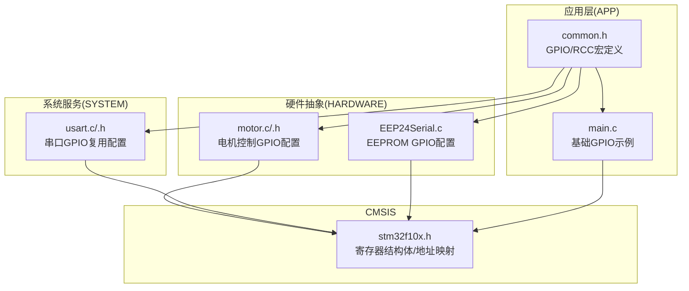
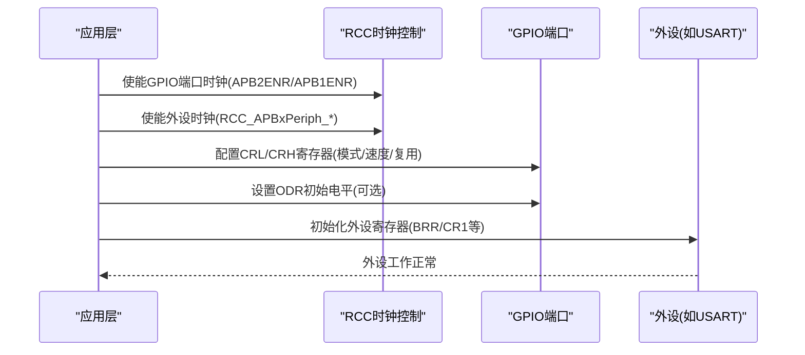
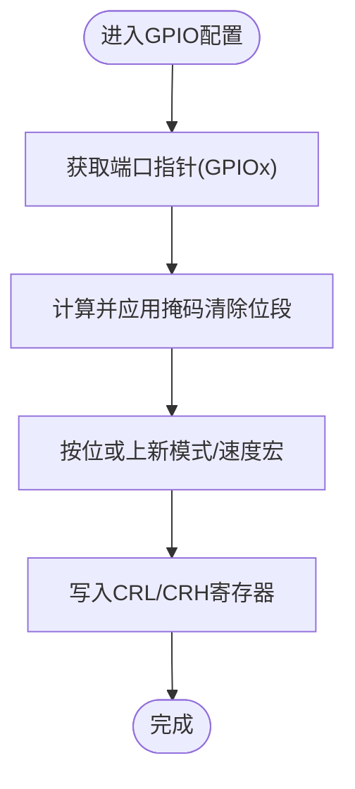
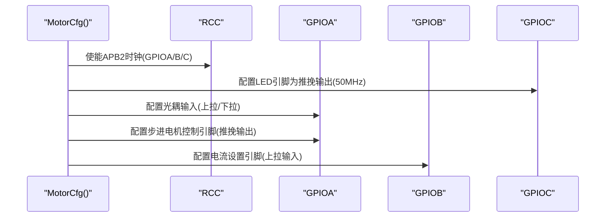
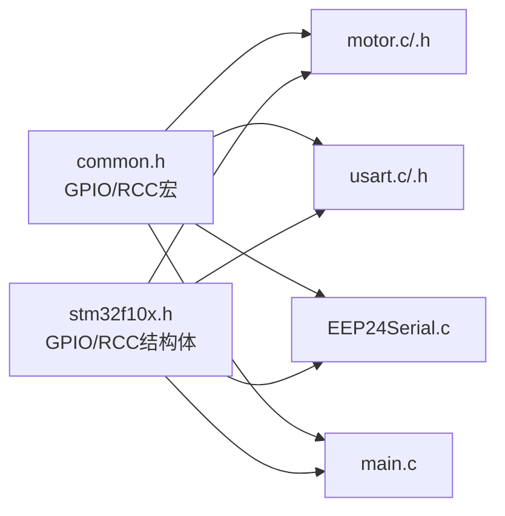

# GPIO和外设配置

<cite>
**本文档引用的文件**
- [motor.c](file://SRC/HARDWARE/motor/motor.c)
- [motor.h](file://SRC/HARDWARE/motor/motor.h)
- [usart.c](file://SRC/SYSTEM/usart/usart.c)
- [usart.h](file://SRC/SYSTEM/usart/usart.h)
- [common.h](file://SRC/APP/common.h)
- [stm32f10x.h](file://SRC/CMSIS/DeviceSupport/stm32f10x.h)
- [main.c](file://SRC/APP/main.c)
- [EEP24Serial.c](file://SRC/HARDWARE/EEPROM/EEP24Serial.c)
</cite>

## 目录
1. [简介](#简介)
2. [项目结构](#项目结构)
3. [核心组件](#核心组件)
4. [架构总览](#架构总览)
5. [详细组件分析](#详细组件分析)
6. [依赖关系分析](#依赖关系分析)
7. [性能考虑](#性能考虑)
8. [故障排除指南](#故障排除指南)
9. [结论](#结论)

## 简介
本文件面向通用开关器项目，系统性说明基于STM32F10x系列的GPIO端口配置与外设时钟配置，涵盖：
- 输入模式：浮空输入、上拉/下拉输入、模拟输入
- 输出模式：推挽输出、开漏输出、复用功能（含速度配置：2MHz、10MHz、50MHz）
- GPIO寄存器操作：CRL/CRH寄存器的位段设置与掩码清除
- 外设时钟配置：RCC_APB1Periph与RCC_APB2Periph的使用
- GPIO初始化函数实现原理与参数含义
- 常用外设GPIO复用功能：USART、SPI、I2C等引脚映射
- 最佳实践与常见错误规避

## 项目结构
本项目采用分层组织方式，GPIO与外设配置主要集中在APP层的公共头文件中，硬件具体实现位于HARDWARE与SYSTEM目录，CMSIS提供底层寄存器定义。

**图表来源**
- [common.h:193-241](file://SRC/APP/common.h#L193-L241)
- [motor.c:1-68](file://SRC/HARDWARE/motor/motor.c#L1-L68)
- [usart.c:34-66](file://SRC/SYSTEM/usart/usart.c#L34-L66)
- [EEP24Serial.c:39-83](file://SRC/HARDWARE/EEPROM/EEP24Serial.c#L39-L83)
- [main.c:15-63](file://SRC/APP/main.c#L15-L63)

**章节来源**
- [common.h:193-520](file://SRC/APP/common.h#L193-L520)
- [stm32f10x.h:998-1098](file://SRC/CMSIS/DeviceSupport/stm32f10x.h#L998-L1098)

## 核心组件
- GPIO寄存器与基地址
  - GPIO端口结构体包含CRL/CRH寄存器，用于配置每个IO引脚的工作模式与速度
  - 寄存器基址在stm32f10x.h中定义，例如GPIOA/GPIOB/GPIOC等
- RCC时钟控制
  - APB1/APB2时钟使能寄存器用于开启GPIO端口与外设时钟
  - 提供RCC_APB1Periph与RCC_APB2Periph相关宏
- GPIO模式与速度宏
  - 输入：浮空输入、上拉/下拉输入、模拟输入
  - 输出：推挽/开漏输出，速度2MHz/10MHz/50MHz
  - 复用：复用推挽/开漏输出，速度2MHz/10MHz/50MHz
- 外设复用
  - USART/TIM/SPI/I2C等外设通过GPIO复用功能实现引脚映射

**章节来源**
- [stm32f10x.h:1001-1010](file://SRC/CMSIS/DeviceSupport/stm32f10x.h#L1001-L1010)
- [common.h:193-241](file://SRC/APP/common.h#L193-L241)
- [common.h:279-520](file://SRC/APP/common.h#L279-L520)

## 架构总览
GPIO配置遵循“时钟使能 → 引脚复用/模式设置 → 数据方向/初始电平 → 外设连接”的流程。外设初始化通常先开启对应GPIO端口与时钟，再配置GPIO为复用功能，最后初始化外设寄存器。

**图表来源**
- [usart.c:49-59](file://SRC/SYSTEM/usart/usart.c#L49-L59)
- [motor.c:6](file://SRC/HARDWARE/motor/motor.c#L6)
- [common.h:193-241](file://SRC/APP/common.h#L193-L241)

## 详细组件分析

### GPIO输入模式配置
- 浮空输入：适用于外部信号已由上拉/下拉电阻提供电平
- 上拉/下拉输入：内部上拉或下拉，减少外部电阻
- 模拟输入：ADC专用，关闭数字输入缓冲

配置要点：
- 使用GPIO_Mode_IN_FLOATING_*、GPIO_Mode_IN_PU_PD_*、GPIO_Mode_IN_AIN宏
- 通过CRL/CRH对应位段设置，结合GPIO_Crl_Pn/ GPIO_Crh_Pn掩码清除

**章节来源**
- [common.h:279-313](file://SRC/APP/common.h#L279-L313)

### GPIO输出模式与速度配置
- 推挽输出：可驱动高/低电平，驱动能力强
- 开漏输出：需外接上拉电阻，常用于I2C
- 复用功能：推挽/开漏，配合外设功能使用

速度等级：
- 2MHz、10MHz、50MHz，影响开关瞬态与功耗

配置要点：
- 使用GPIO_Mode_Out_PP_*、GPIO_Mode_Out_OD_*、GPIO_Mode_AF_PP_*、GPIO_Mode_AF_OD_*宏
- 对应速度宏按引脚位段写入CRL/CRH

**章节来源**
- [common.h:314-520](file://SRC/APP/common.h#L314-L520)

### GPIO寄存器操作详解
- CRL/CRH寄存器
  - CRL管理Pin0-7，CRH管理Pin8-15
  - 每个引脚占4位，包含模式与速度位段
- 掩码清除与按位或设置
  - 先用GPIO_Crl_Pn/ GPIO_Crh_Pn掩码清除对应位段
  - 再按位或上新的模式/速度组合

**图表来源**
- [motor.c:8-27](file://SRC/HARDWARE/motor/motor.c#L8-L27)
- [EEP24Serial.c:39-83](file://SRC/HARDWARE/EEPROM/EEP24Serial.c#L39-L83)
- [main.c:15-63](file://SRC/APP/main.c#L15-L63)

**章节来源**
- [motor.c:8-27](file://SRC/HARDWARE/motor/motor.c#L8-L27)
- [EEP24Serial.c:39-83](file://SRC/HARDWARE/EEPROM/EEP24Serial.c#L39-L83)
- [main.c:15-63](file://SRC/APP/main.c#L15-L63)

### 外设时钟配置（RCC_APB1/APB2）
- APB2：GPIOA/B/C/D/E/F/G、ADC1/2、TIM1/8、SPI1、USART1、TIM9/10/11等
- APB1：TIM2/3/4/5、SPI2/3、USART2/3、I2C1/2、USB、CAN等

配置流程：
- 在RCC_APB2ENR或RCC_APB1ENR中置位对应位
- 若涉及GPIO复用，还需使能GPIO端口时钟

**章节来源**
- [common.h:193-241](file://SRC/APP/common.h#L193-L241)
- [usart.c:49-59](file://SRC/SYSTEM/usart/usart.c#L49-L59)
- [motor.c:6](file://SRC/HARDWARE/motor/motor.c#L6)

### GPIO初始化函数实现原理
以电机控制为例，MotorCfg函数展示了典型初始化流程：
- 使能GPIOA/B/C时钟
- 配置LED/光耦/步进电机控制引脚模式与速度
- 配置电流设置引脚为输入并上拉
- 通过宏封装简化引脚操作（如PCout(15)、PAin(15)）

**图表来源**
- [motor.c:6](file://SRC/HARDWARE/motor/motor.c#L6)
- [motor.c:8-27](file://SRC/HARDWARE/motor/motor.c#L8-L27)
- [motor.h:16-42](file://SRC/HARDWARE/motor/motor.h#L16-L42)

**章节来源**
- [motor.c:4-68](file://SRC/HARDWARE/motor/motor.c#L4-L68)
- [motor.h:16-49](file://SRC/HARDWARE/motor/motor.h#L16-L49)

### 常用外设GPIO复用功能与引脚映射
- USART
  - USART1：TX=PA.9，RX=PA.10（示例见Usart1_Init）
  - USART2：TX=PA.2，RX=PA.3（示例见Usart2_Init）
  - USART3：TX=PB.10，RX=PB.11（示例见Usart3_Init）
  - UART4：TX=PC.10，RX=PC.11（条件编译）
- SPI
  - SPI1：PA.5/6/7（SCK/MISO/MOSI）
  - SPI2：PB.13/14/15（SCK/MISO/MOSI）
  - SPI3：PB.3/4/5（SCK/MISO/MOSI）
- I2C
  - I2C1：PB.6/7（SCL/SDA）
  - I2C2：PB.10/11（SCL/SDA）

配置要点：
- 先使能GPIO端口与时钟
- 将对应引脚配置为复用推挽/开漏输出（速度根据外设需求）
- 外设寄存器初始化（如USART的BRR、CR1等）

**章节来源**
- [usart.c:34-66](file://SRC/SYSTEM/usart/usart.c#L34-L66)
- [usart.c:87-120](file://SRC/SYSTEM/usart/usart.c#L87-L120)
- [usart.c:155-188](file://SRC/SYSTEM/usart/usart.c#L155-L188)
- [usart.c:223-288](file://SRC/SYSTEM/usart/usart.c#L223-L288)

### GPIO配置最佳实践
- 明确外设需求：若为外设复用，必须先开启GPIO端口与时钟，再配置为复用模式
- 速度匹配：外设高速场景选择50MHz，低速或长线传输可选2MHz
- 上拉/下拉策略：输入端尽量使用内部上拉/下拉，减少外部器件
- 复用冲突避免：同一引脚在同一时刻只能映射到一个功能
- 初始化顺序：时钟 → 引脚模式 → 外设寄存器 → 中断/DMA（如需要）

**章节来源**
- [usart.c:49-59](file://SRC/SYSTEM/usart/usart.c#L49-L59)
- [common.h:314-520](file://SRC/APP/common.h#L314-L520)

### 常见错误与规避
- 忘记使能GPIO端口时钟：导致引脚配置无效
- 先配置外设再使能时钟：外设无法正常工作
- 混用模式：输入/输出/复用模式混淆，造成电平不稳定或外设异常
- 掩码清除不当：未正确清除旧位段，导致模式/速度设置错误
- 复用引脚冲突：多个外设同时映射到同一引脚

**章节来源**
- [usart.c:49-59](file://SRC/SYSTEM/usart/usart.c#L49-L59)
- [motor.c:8-27](file://SRC/HARDWARE/motor/motor.c#L8-L27)

## 依赖关系分析
GPIO配置依赖于CMSIS提供的寄存器结构体与地址映射，以及APP层的公共宏定义。外设初始化通常依赖GPIO配置结果。

**图表来源**
- [common.h:193-520](file://SRC/APP/common.h#L193-L520)
- [stm32f10x.h:998-1098](file://SRC/CMSIS/DeviceSupport/stm32f10x.h#L998-L1098)

**章节来源**
- [common.h:193-520](file://SRC/APP/common.h#L193-L520)
- [stm32f10x.h:998-1098](file://SRC/CMSIS/DeviceSupport/stm32f10x.h#L998-L1098)

## 性能考虑
- 速度选择：高频外设建议50MHz，低功耗场景可选2MHz
- 上拉/下拉：合理使用内部上下拉，减少外部电阻带来的功耗与噪声
- 复用时钟：仅在需要时开启外设时钟，避免不必要的功耗
- 信号完整性：长线传输建议使用上拉/下拉与合适的输出速度

## 故障排除指南
- 现象：外设无法通信
  - 检查GPIO端口与时钟是否开启
  - 检查引脚是否配置为复用模式
  - 检查波特率/时钟分频设置是否正确
- 现象：输入信号不稳定
  - 检查是否使用了内部上拉/下拉
  - 检查是否存在外部干扰或阻抗不匹配
- 现象：引脚冲突
  - 检查是否有多个外设映射到同一引脚
  - 修改引脚映射或禁用冲突外设

**章节来源**
- [usart.c:34-66](file://SRC/SYSTEM/usart/usart.c#L34-L66)
- [motor.c:6](file://SRC/HARDWARE/motor/motor.c#L6)

## 结论
本项目通过统一的GPIO/RCC宏定义与清晰的初始化流程，实现了对STM32F10x系列GPIO与外设的可靠配置。遵循“时钟使能 → 引脚模式 → 外设初始化”的顺序，结合速度与复用策略，可有效提升系统稳定性与性能。建议在实际开发中严格遵循最佳实践，避免常见错误，确保引脚映射与外设功能一致。