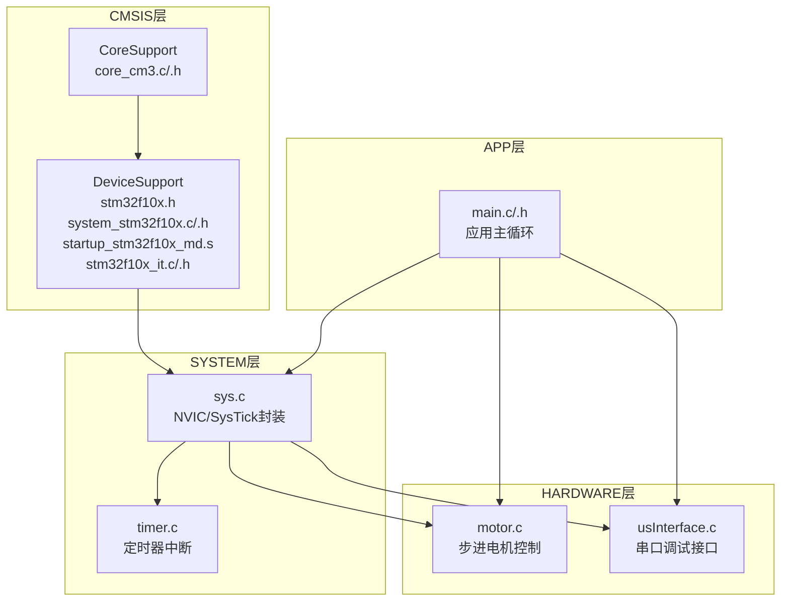
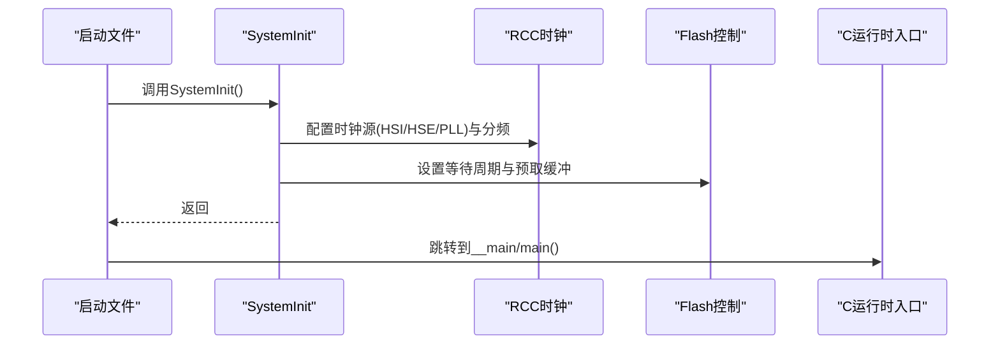
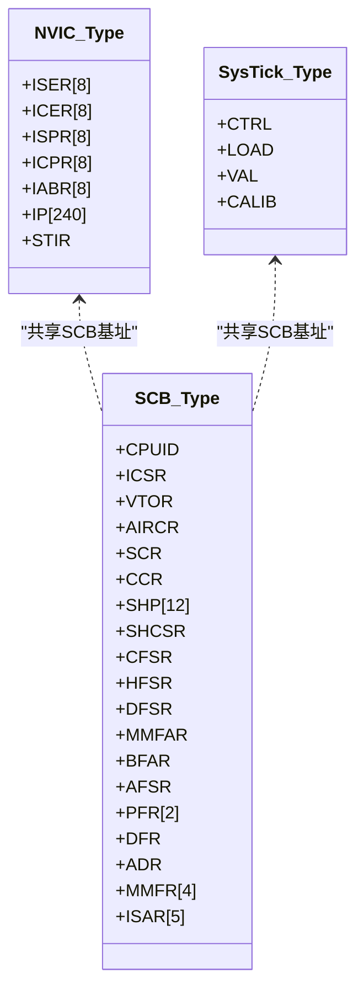
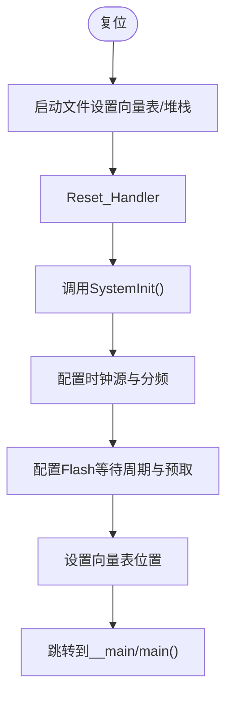
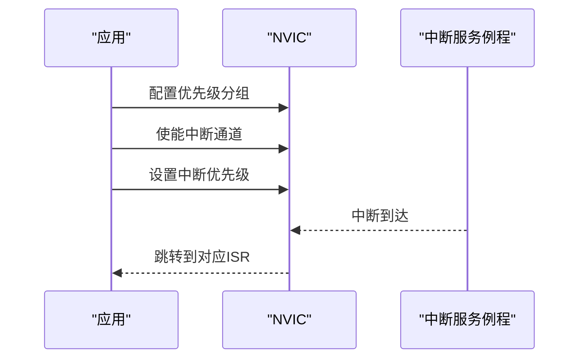
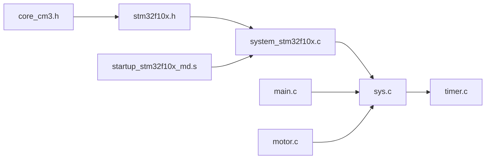

# 微控制器架构

<cite>
**本文档引用的文件**
- [system_stm32f10x.c](file://SRC\CMSIS\DeviceSupport\system_stm32f10x.c)
- [system_stm32f10x.h](file://SRC\CMSIS\DeviceSupport\system_stm32f10x.h)
- [core_cm3.c](file://SRC\CMSIS\CoreSupport\core_cm3.c)
- [core_cm3.h](file://SRC\CMSIS\CoreSupport\core_cm3.h)
- [stm32f10x.h](file://SRC\CMSIS\DeviceSupport\stm32f10x.h)
- [startup_stm32f10x_md.s](file://SRC\CMSIS\DeviceSupport\startup\startup_stm32f10x_md.s)
- [stm32f10x_it.c](file://SRC\CMSIS\DeviceSupport\stm32f10x_it.c)
- [stm32f10x_it.h](file://SRC\CMSIS\DeviceSupport\stm32f10x_it.h)
- [main.c](file://SRC\APP\main.c)
- [main.h](file://SRC\APP\main.h)
- [sys.c](file://SRC\SYSTEM\sys\sys.c)
- [timer.c](file://SRC\SYSTEM\timer\timer.c)
- [motor.c](file://SRC\HARDWARE\motor\motor.c)
- [usInterface.c](file://SRC\HARDWARE\usinterface\usInterface.c)
</cite>

## 目录
1. [简介](#简介)
2. [项目结构](#项目结构)
3. [核心组件](#核心组件)
4. [架构总览](#架构总览)
5. [详细组件分析](#详细组件分析)
6. [依赖关系分析](#依赖关系分析)
7. [性能考虑](#性能考虑)
8. [故障排查指南](#故障排查指南)
9. [结论](#结论)

## 简介
本文件面向通用开关器项目的微控制器架构文档，聚焦于STM32F10x系列（基于ARM Cortex-M3内核）的系统级实现。内容涵盖：
- ARM Cortex-M3内核特性与Thumb-2指令集支持
- 内存映射与存储器组织（Flash、SRAM、外设寄存器）
- 时钟系统配置（HSI/HSE/PLL/分频）
- NVIC中断控制器与SysTick定时器
- CMSIS库的使用（Core与Device Peripheral Access Layer）
- 寄存器级编程实践与系统初始化流程

## 项目结构
项目采用分层组织，围绕CMSIS库与应用层展开：
- CMSIS层：Core Support（内核访问）、Device Support（设备外设与启动）
- SYSTEM层：系统基础（时钟、NVIC、SysTick封装）
- HARDWARE层：外设驱动（电机、串口、EEPROM等）
- APP层：应用逻辑（主循环、协议处理）

图表来源
- [core_cm3.c:1-200](file://SRC\CMSIS\CoreSupport\core_cm3.c#L1-L200)
- [core_cm3.h:714-734](file://SRC\CMSIS\CoreSupport\core_cm3.h#L714-L734)
- [stm32f10x.h:478-481](file://SRC\CMSIS\DeviceSupport\stm32f10x.h#L478-L481)
- [system_stm32f10x.c:212-269](file://SRC\CMSIS\DeviceSupport\system_stm32f10x.c#L212-L269)
- [startup_stm32f10x_md.s:55-125](file://SRC\CMSIS\DeviceSupport\startup\startup_stm32f10x_md.s#L55-L125)
- [sys.c:8-49](file://SRC\SYSTEM\sys\sys.c#L8-L49)
- [timer.c:11-73](file://SRC\SYSTEM\timer\timer.c#L11-L73)
- [motor.c:4-68](file://SRC\HARDWARE\motor\motor.c#L4-L68)
- [usInterface.c:1-200](file://SRC\HARDWARE\usinterface\usInterface.c#L1-L200)
- [main.c:12-67](file://SRC\APP\main.c#L12-L67)

章节来源
- [system_stm32f10x.c:1-120](file://SRC\CMSIS\DeviceSupport\system_stm32f10x.c#L1-L120)
- [startup_stm32f10x_md.s:1-125](file://SRC\CMSIS\DeviceSupport\startup\startup_stm32f10x_md.s#L1-L125)

## 核心组件
- Cortex-M3内核与CMSIS Core Peripheral Access Layer：提供NVIC、SCB、SysTick等系统控制寄存器的结构化访问与工具函数。
- 设备Peripheral Access Layer：通过stm32f10x.h统一声明外设寄存器、中断号、类型定义等。
- 启动与系统初始化：startup_stm32f10x_md.s负责向量表、堆栈、复位入口；system_stm32f10x.c完成时钟与系统配置。
- 系统基础封装：sys.c对NVIC、向量表、时钟初始化等进行封装；timer.c提供定时器中断服务与优先级配置。

章节来源
- [core_cm3.h:128-148](file://SRC\CMSIS\CoreSupport\core_cm3.h#L128-L148)
- [stm32f10x.h:167-472](file://SRC\CMSIS\DeviceSupport\stm32f10x.h#L167-L472)
- [system_stm32f10x.c:212-269](file://SRC\CMSIS\DeviceSupport\system_stm32f10x.c#L212-L269)
- [startup_stm32f10x_md.s:55-125](file://SRC\CMSIS\DeviceSupport\startup\startup_stm32f10x_md.s#L55-L125)
- [sys.c:8-49](file://SRC\SYSTEM\sys\sys.c#L8-L49)

## 架构总览
STM32F10x采用ARM Cortex-M3内核，遵循Harvard架构（指令与数据总线分离），支持Thumb-2指令集。系统由以下关键路径组成：
- 启动路径：启动文件设置向量表与堆栈，调用SystemInit完成时钟与系统配置，再跳转至C运行时入口。
- 中断路径：NVIC管理中断优先级与使能，外设产生中断请求，经向量表跳转到具体ISR。
- 系统时钟：默认HSI，可通过HSE/PLL配置到更高频率，同时设置AHB/APB分频与Flash等待周期。

图表来源
- [startup_stm32f10x_md.s:128-137](file://SRC\CMSIS\DeviceSupport\startup\startup_stm32f10x_md.s#L128-L137)
- [system_stm32f10x.c:212-269](file://SRC\CMSIS\DeviceSupport\system_stm32f10x.c#L212-L269)

章节来源
- [startup_stm32f10x_md.s:128-137](file://SRC\CMSIS\DeviceSupport\startup\startup_stm32f10x_md.s#L128-L137)
- [system_stm32f10x.c:212-269](file://SRC\CMSIS\DeviceSupport\system_stm32f10x.c#L212-L269)

## 详细组件分析

### 1) Cortex-M3内核与CMSIS Core Peripheral Access Layer
- NVIC结构体：提供ISER/ICER/ISPR/ICPR/IABR/IP寄存器，支持中断使能、挂起、活动状态与优先级设置。
- SCB结构体：VTOR向量表偏移寄存器、AIRCR复位与优先级分组控制等。
- SysTick结构体：CTRL/LOAD/VAL/CALIB寄存器，用于系统节拍与延迟。
- 内核工具函数：提供MSP/PSP读写、PRIMASK/FAULTMASK控制、REV/REV16/REVSH等位操作与原子操作封装。

图表来源
- [core_cm3.h:128-148](file://SRC\CMSIS\CoreSupport\core_cm3.h#L128-L148)
- [core_cm3.h:155-177](file://SRC\CMSIS\CoreSupport\core_cm3.h#L155-L177)
- [core_cm3.h:365-371](file://SRC\CMSIS\CoreSupport\core_cm3.h#L365-L371)

章节来源
- [core_cm3.h:714-734](file://SRC\CMSIS\CoreSupport\core_cm3.h#L714-L734)
- [core_cm3.c:48-120](file://SRC\CMSIS\CoreSupport\core_cm3.c#L48-L120)

### 2) 设备Peripheral Access Layer（STM32F10x）
- 头文件stm32f10x.h统一声明外设寄存器、中断号、类型别名与标准外设库兼容性宏。
- 包含CMSIS core与system_stm32f10x.h，形成完整的设备访问层。
- 提供各系列设备的中断号枚举（如WWDG、PVD、RTC、TIM2/3/4等）。

章节来源
- [stm32f10x.h:478-481](file://SRC\CMSIS\DeviceSupport\stm32f10x.h#L478-L481)
- [stm32f10x.h:167-472](file://SRC\CMSIS\DeviceSupport\stm32f10x.h#L167-L472)

### 3) 启动与系统初始化（startup + system）
- 向量表：包含初始堆栈指针、复位处理、异常与外设中断向量。
- Reset_Handler：调用SystemInit与C运行时入口。
- SystemInit：重置RCC寄存器、配置时钟源（HSI/HSE/PLL）、设置AHB/APB分频、配置Flash等待周期与预取缓冲、向量表位置（FLASH或SRAM）。

图表来源
- [startup_stm32f10x_md.s:55-125](file://SRC\CMSIS\DeviceSupport\startup\startup_stm32f10x_md.s#L55-L125)
- [startup_stm32f10x_md.s:128-137](file://SRC\CMSIS\DeviceSupport\startup\startup_stm32f10x_md.s#L128-L137)
- [system_stm32f10x.c:212-269](file://SRC\CMSIS\DeviceSupport\system_stm32f10x.c#L212-L269)

章节来源
- [startup_stm32f10x_md.s:55-125](file://SRC\CMSIS\DeviceSupport\startup\startup_stm32f10x_md.s#L55-L125)
- [system_stm32f10x.c:212-269](file://SRC\CMSIS\DeviceSupport\system_stm32f10x.c#L212-L269)

### 4) 时钟系统与SystemCoreClock
- 时钟源：HSI（默认8MHz）、HSE（外部晶振，默认8MHz或25MHz取决于系列）、PLL（倍频）。
- 系统时钟配置：通过RCC CFGR配置SW/HPRE/PPRE1/PPRE2/ADCPRE等；SystemInit按产品族选择目标频率。
- 动态更新：SystemCoreClockUpdate根据CFGR寄存器当前状态计算HCLK频率。

章节来源
- [system_stm32f10x.c:148-167](file://SRC\CMSIS\DeviceSupport\system_stm32f10x.c#L148-L167)
- [system_stm32f10x.c:306-412](file://SRC\CMSIS\DeviceSupport\system_stm32f10x.c#L306-L412)

### 5) NVIC中断控制器
- 分组配置：通过SCB AIRCR的PRIGROUP位设置抢占优先级与响应优先级位数。
- 中断使能：通过ISER/ICER设置中断通道使能与禁用。
- 优先级设置：通过IP寄存器按通道设置优先级组合。
- 实战封装：sys.c提供MY_NVIC_Init/MY_NVIC_PriorityGroupConfig等便捷函数。

图表来源
- [sys.c:15-49](file://SRC\SYSTEM\sys\sys.c#L15-L49)
- [core_cm3.h:128-148](file://SRC\CMSIS\CoreSupport\core_cm3.h#L128-L148)

章节来源
- [sys.c:15-49](file://SRC\SYSTEM\sys\sys.c#L15-L49)
- [core_cm3.h:128-148](file://SRC\CMSIS\CoreSupport\core_cm3.h#L128-L148)

### 6) SysTick定时器
- 用途：系统节拍与延迟基准；配合SystemCoreClock实现毫秒级延时。
- 配置：通过SysTick_Type的CTRL/LOAD/VAL/CALIB寄存器设置节拍与计数。
- 实践：timer.c中定时器中断服务程序利用SysTick节拍推进全局计时变量。

章节来源
- [core_cm3.h:365-403](file://SRC\CMSIS\CoreSupport\core_cm3.h#L365-L403)
- [timer.c:22-42](file://SRC\SYSTEM\timer\timer.c#L22-L42)

### 7) 寄存器级编程示例与最佳实践
- 时钟配置（寄存器级）：参考system_stm32f10x.c中的SystemInit/SetSysClock系列函数，涉及RCC/FLASH寄存器直接操作。
- 中断配置（寄存器级）：参考sys.c中的MY_NVIC_Init/MYRCC_DeInit，直接操作RCC/NVIC/SCB寄存器。
- 外设控制（寄存器级）：参考main.c/motor.c等，对GPIO/TIM/RCC等寄存器进行位操作以实现IO与电机控制。

章节来源
- [system_stm32f10x.c:212-269](file://SRC\CMSIS\DeviceSupport\system_stm32f10x.c#L212-L269)
- [sys.c:75-96](file://SRC\SYSTEM\sys\sys.c#L75-L96)
- [main.c:12-67](file://SRC\APP\main.c#L12-L67)
- [motor.c:4-68](file://SRC\HARDWARE\motor\motor.c#L4-L68)

### 8) 中断处理与异常向量
- 异常向量：NMI、HardFault、MemManage、BusFault、UsageFault、SVC、DebugMon、PendSV、SysTick等。
- 外设中断：WWDG、PVD、RTC、TIM2/3/4/5/6/7、USART、SPI、I2C等。
- 实现：stm32f10x_it.c提供默认空实现，应用可在对应IRQHandler中添加业务逻辑。

章节来源
- [startup_stm32f10x_md.s:61-121](file://SRC\CMSIS\DeviceSupport\startup\startup_stm32f10x_md.s#L61-L121)
- [stm32f10x_it.c:49-142](file://SRC\CMSIS\DeviceSupport\stm32f10x_it.c#L49-L142)
- [stm32f10x_it.h:38-46](file://SRC\CMSIS\DeviceSupport\stm32f10x_it.h#L38-L46)

## 依赖关系分析
- CMSIS Core与Device层：core_cm3.h包含于stm32f10x.h，system_stm32f10x.c依赖stm32f10x.h。
- 启动与系统：startup_stm32f10x_md.s调用SystemInit，SystemInit最终影响NVIC/SCB/FLASH寄存器。
- 应用与系统：main.c依赖GPIO/TIM寄存器配置，timer.c依赖NVIC封装与SysTick节拍。

图表来源
- [stm32f10x.h:478-481](file://SRC\CMSIS\DeviceSupport\stm32f10x.h#L478-L481)
- [system_stm32f10x.c:65-66](file://SRC\CMSIS\DeviceSupport\system_stm32f10x.c#L65-L66)
- [startup_stm32f10x_md.s:128-137](file://SRC\CMSIS\DeviceSupport\startup\startup_stm32f10x_md.s#L128-L137)
- [sys.c:8-49](file://SRC\SYSTEM\sys\sys.c#L8-L49)
- [timer.c:11-73](file://SRC\SYSTEM\timer\timer.c#L11-L73)
- [main.c:12-67](file://SRC\APP\main.c#L12-L67)
- [motor.c:4-68](file://SRC\HARDWARE\motor\motor.c#L4-L68)

章节来源
- [stm32f10x.h:478-481](file://SRC\CMSIS\DeviceSupport\stm32f10x.h#L478-L481)
- [system_stm32f10x.c:65-66](file://SRC\CMSIS\DeviceSupport\system_stm32f10x.c#L65-L66)

## 性能考虑
- 时钟频率与Flash等待周期：高频率需适当延长Flash等待周期，避免取指/数据访问错误。
- 中断优先级分组：合理分配抢占与响应优先级，避免关键中断被抢占导致实时性不足。
- SysTick节拍与任务调度：基于SysTick的毫秒计时应避免长耗时ISR，必要时拆分为轮询或更低优先级任务。
- 外设时钟域：AHB/APB分频影响外设工作频率，需确保外设驱动参数（如定时器预分频）与系统时钟一致。

## 故障排查指南
- 硬Fault/内存/总线/用法错误：启动文件与异常向量表已提供默认处理，建议在对应Handler中加入诊断输出或看门狗复位。
- 时钟配置失败：检查HSE启动超时、PLL锁定状态与AHB/APB分频设置是否与器件规格匹配。
- 中断不触发：确认NVIC分组、中断使能位、优先级设置与向量表位置正确。
- SysTick节拍异常：检查SysTick时钟源（系统时钟或外部时钟）、LOAD与ENABLE位。

章节来源
- [startup_stm32f10x_md.s:140-181](file://SRC\CMSIS\DeviceSupport\startup\startup_stm32f10x_md.s#L140-L181)
- [stm32f10x_it.c:49-106](file://SRC\CMSIS\DeviceSupport\stm32f10x_it.c#L49-L106)
- [system_stm32f10x.c:502-570](file://SRC\CMSIS\DeviceSupport\system_stm32f10x.c#L502-L570)
- [sys.c:15-49](file://SRC\SYSTEM\sys\sys.c#L15-L49)

## 结论
本项目基于CMSIS的STM32F10x微控制器架构，通过清晰的分层设计实现了从内核访问、系统初始化、中断管理到外设驱动与应用逻辑的完整链路。遵循寄存器级编程的最佳实践与合理的时钟/中断配置，可确保系统稳定、可维护且具备良好的实时性。建议在后续开发中持续完善异常处理与诊断机制，以提升系统的可靠性与可调试性。