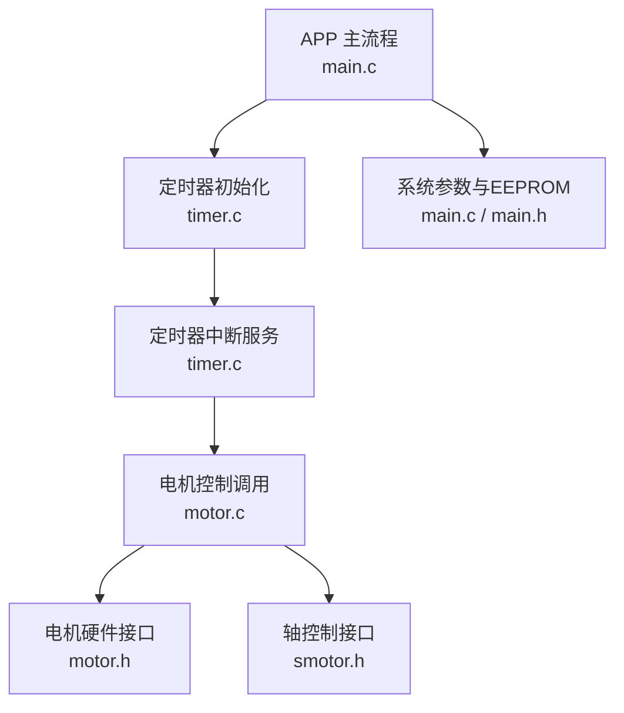
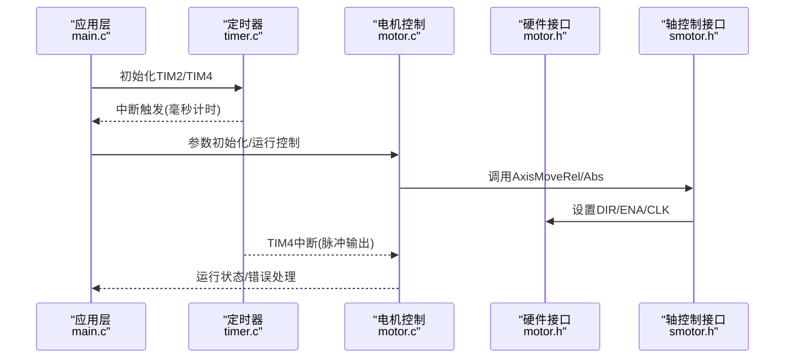
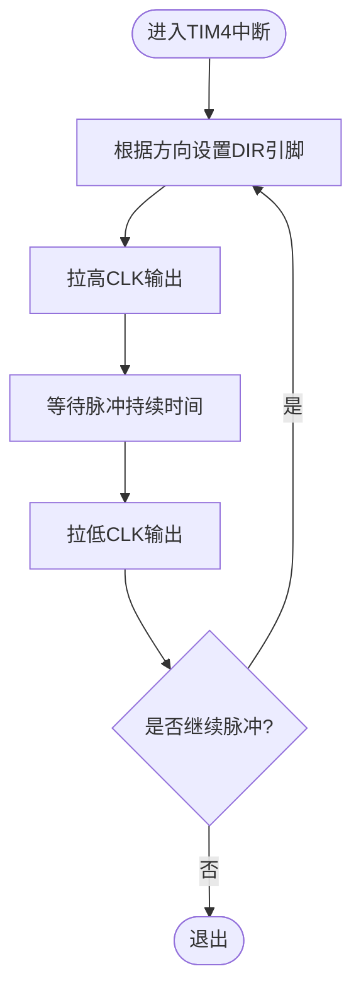
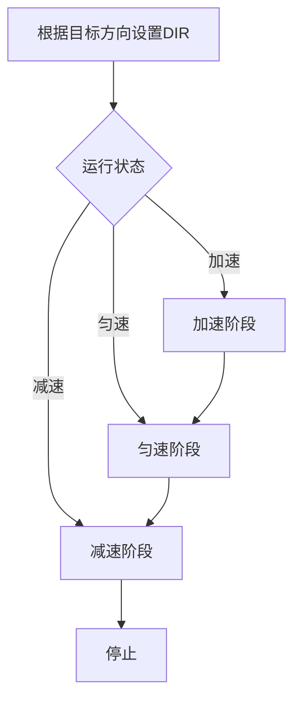
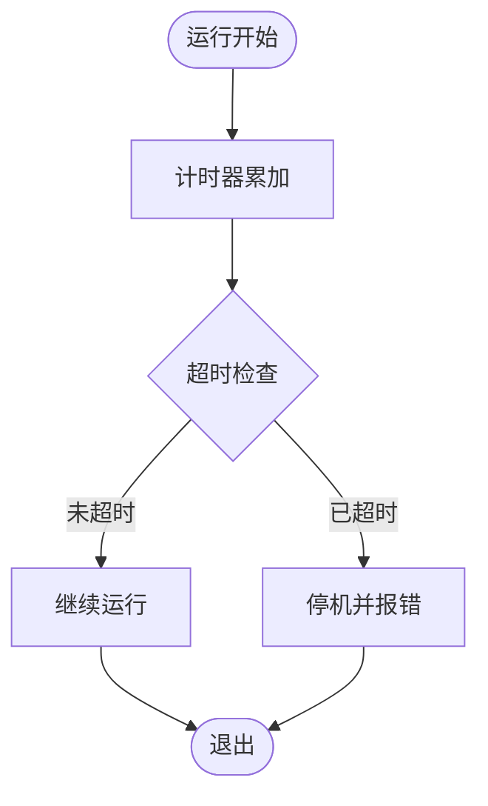
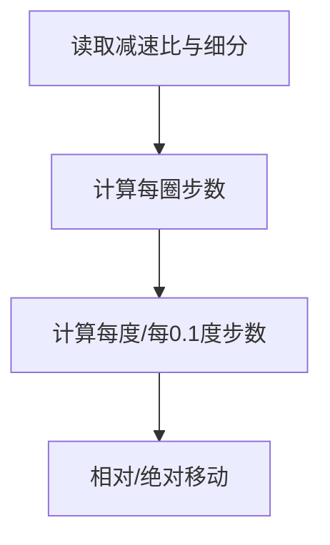
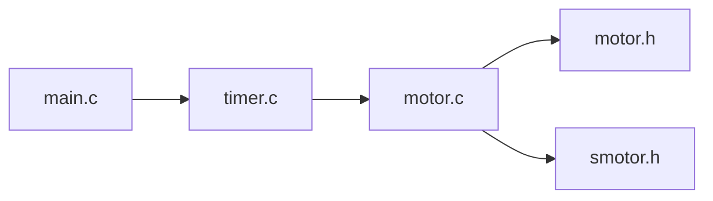

# 电机驱动电路

<cite>
**本文引用的文件**
- [SRC/HARDWARE/motor/motor.c](file://SRC/HARDWARE/motor/motor.c)
- [SRC/HARDWARE/motor/motor.h](file://SRC/HARDWARE/motor/motor.h)
- [SRC/HARDWARE/motor/smotor.h](file://SRC/HARDWARE/motor/smotor.h)
- [SRC/SYSTEM/timer/timer.c](file://SRC/SYSTEM/timer/timer.c)
- [SRC/SYSTEM/timer/timer.h](file://SRC/SYSTEM/timer/timer.h)
- [SRC/APP/main.c](file://SRC/APP/main.c)
- [SRC/APP/main.h](file://SRC/APP/main.h)
</cite>

## 目录
1. [简介](#简介)
2. [项目结构](#项目结构)
3. [核心组件](#核心组件)
4. [架构总览](#架构总览)
5. [详细组件分析](#详细组件分析)
6. [依赖关系分析](#依赖关系分析)
7. [性能考量](#性能考量)
8. [故障排查指南](#故障排查指南)
9. [结论](#结论)
10. [附录](#附录)

## 简介
本文件面向通用开关器项目的电机驱动电路，围绕步进电机的驱动实现、脉冲生成与方向控制、电流与细分配置、保护机制、参数计算与调试方法展开。文档基于仓库中的固件源码进行分析，重点解释以下方面：
- 驱动芯片与硬件接口：基于GPIO与定时器的脉冲/方向输出，以及电流档位设置引脚。
- 脉冲与频率控制：通过定时器中断驱动步进脉冲，结合加速度/速度/减速度规划。
- 方向控制：通过DIR引脚与脉冲计数实现正反转。
- 限流与保护：通过ISET档位设置与超时保护实现限流与过载保护。
- 细分与相序：基于减速比与细分参数的步距角与步进换算。
- 调试与兼容：不同硬件版本（901/906/909）的引脚差异与兼容性。

## 项目结构
电机驱动相关代码主要分布在如下模块：
- APP层：主流程、参数初始化、协议栈、系统定时与保护。
- SYSTEM层：定时器初始化与中断服务，提供脉冲定时基准。
- HARDWARE层：电机控制接口、引脚定义、电流档位设置、运动控制算法接口。

**图示来源**
- [SRC/APP/main.c:445-447](file://SRC/APP/main.c#L445-L447)
- [SRC/SYSTEM/timer/timer.c:81-99](file://SRC/SYSTEM/timer/timer.c#L81-L99)
- [SRC/HARDWARE/motor/motor.c:447](file://SRC/HARDWARE/motor/motor.c#L447)
- [SRC/HARDWARE/motor/motor.h:16-49](file://SRC/HARDWARE/motor/motor.h#L16-L49)
- [SRC/HARDWARE/motor/smotor.h:67-95](file://SRC/HARDWARE/motor/smotor.h#L67-L95)

**章节来源**
- [SRC/APP/main.c:433-494](file://SRC/APP/main.c#L433-L494)
- [SRC/SYSTEM/timer/timer.c:11-99](file://SRC/SYSTEM/timer/timer.c#L11-L99)
- [SRC/HARDWARE/motor/motor.c:4-68](file://SRC/HARDWARE/motor/motor.c#L4-L68)

## 核心组件
- 电机硬件接口与引脚定义：包含ENA、RST、DIR、CLK、ISET等引脚，以及不同硬件版本的差异化配置。
- 脉冲与方向控制：通过GPIO输出脉冲与方向，由定时器中断驱动。
- 电流档位设置：通过ISET引脚组合设置电流等级。
- 运动控制算法接口：提供相对/绝对运动、加减速规划与状态管理。
- 系统参数与保护：从EEPROM读取参数，定时器提供超时保护。

**章节来源**
- [SRC/HARDWARE/motor/motor.h:16-49](file://SRC/HARDWARE/motor/motor.h#L16-L49)
- [SRC/HARDWARE/motor/motor.c:4-68](file://SRC/HARDWARE/motor/motor.c#L4-L68)
- [SRC/HARDWARE/motor/smotor.h:67-95](file://SRC/HARDWARE/motor/smotor.h#L67-L95)
- [SRC/APP/main.c:222-429](file://SRC/APP/main.c#L222-L429)

## 架构总览
电机驱动采用“应用调度 + 定时器中断 + 硬件接口”的分层设计：
- 应用层负责初始化、参数加载、协议处理与运行状态管理。
- 定时器层提供毫秒级计时与脉冲定时基准。
- 硬件层封装GPIO与ISET引脚，提供电机控制接口。

**图示来源**
- [SRC/APP/main.c:445-447](file://SRC/APP/main.c#L445-L447)
- [SRC/SYSTEM/timer/timer.c:81-99](file://SRC/SYSTEM/timer/timer.c#L81-L99)
- [SRC/HARDWARE/motor/motor.c:447](file://SRC/HARDWARE/motor/motor.c#L447)
- [SRC/HARDWARE/motor/smotor.h:89-95](file://SRC/HARDWARE/motor/smotor.h#L89-L95)

## 详细组件分析

### 1) 驱动芯片与硬件接口
- 引脚定义与功能
  - ENA：电机使能，用于启用/禁用驱动输出。
  - RST：复位信号，用于复位驱动器内部状态。
  - DIR：方向控制，决定步进电机旋转方向。
  - CLK：脉冲输入，驱动步进电机步进。
  - ISET：电流档位设置引脚，通过组合输出选择电流等级。
- 硬件版本差异
  - A12_901/909：ISET引脚组合与光耦输入引脚位置不同；DIR/CLK在PA端口。
  - A12_906：DIR/CLK在PA端口，ISET引脚组合与901/909一致但引脚号不同。
- 电流档位设置
  - 通过ISET宏将数值映射到三个ISET引脚，形成多级电流设置。

**章节来源**
- [SRC/HARDWARE/motor/motor.h:16-49](file://SRC/HARDWARE/motor/motor.h#L16-L49)
- [SRC/HARDWARE/motor/motor.c:6-68](file://SRC/HARDWARE/motor/motor.c#L6-L68)

### 2) 脉冲信号生成与频率控制
- 定时器TIM4用于脉冲输出，中断服务中调用轴定时器函数，驱动脉冲与方向输出。
- 脉冲频率由TIM4的ARR/PSC决定，配合加速度/速度/减速度参数控制步进速率。
- 脉冲宽度通常由驱动器内部决定，软件侧通过定时器周期控制脉冲频率。

**图示来源**
- [SRC/SYSTEM/timer/timer.c:92-99](file://SRC/SYSTEM/timer/timer.c#L92-L99)
- [SRC/HARDWARE/motor/smotor.h:67-84](file://SRC/HARDWARE/motor/smotor.h#L67-L84)

**章节来源**
- [SRC/SYSTEM/timer/timer.c:81-99](file://SRC/SYSTEM/timer/timer.c#L81-L99)
- [SRC/HARDWARE/motor/smotor.h:36-44](file://SRC/HARDWARE/motor/smotor.h#L36-L44)

### 3) 方向控制电路与逻辑
- 方向控制通过DIR引脚实现，结合脉冲计数与加减速规划，实现正反转。
- 代码中提供CW/CCW常量与方向开关宏，适配不同硬件版本的方向一致性。

**图示来源**
- [SRC/HARDWARE/motor/smotor.h:20-31](file://SRC/HARDWARE/motor/smotor.h#L20-L31)
- [SRC/HARDWARE/motor/smotor.h:46-50](file://SRC/HARDWARE/motor/smotor.h#L46-L50)

**章节来源**
- [SRC/HARDWARE/motor/smotor.h:20-31](file://SRC/HARDWARE/motor/smotor.h#L20-L31)
- [SRC/HARDWARE/motor/smotor.h:46-50](file://SRC/HARDWARE/motor/smotor.h#L46-L50)

### 4) 限流保护、过热保护与短路保护
- 限流保护：通过ISET档位设置限制电机相电流，避免过流损坏。
- 过热保护：通过超时保护机制，在单次运行或初始化超时后自动停机，防止长时间堵转导致过热。
- 短路保护：硬件层面由驱动器与电源回路承担，软件通过限流与超时保护降低风险。

**图示来源**
- [SRC/APP/main.c:169-202](file://SRC/APP/main.c#L169-L202)

**章节来源**
- [SRC/APP/main.c:169-202](file://SRC/APP/main.c#L169-L202)
- [SRC/HARDWARE/motor/motor.h:10-15](file://SRC/HARDWARE/motor/motor.h#L10-L15)

### 5) 细分驱动与相序控制
- 细分参数：不同硬件版本采用不同的细分值（如901/909为64细分，906为16细分），结合减速比计算每度步数。
- 步距角与步进换算：通过减速比与细分计算每圈步数，再换算为每度/每0.1度步数，用于定位控制。

**图示来源**
- [SRC/APP/main.c:304-336](file://SRC/APP/main.c#L304-L336)
- [SRC/HARDWARE/motor/motor.h:100-148](file://SRC/HARDWARE/motor/motor.h#L100-L148)

**章节来源**
- [SRC/APP/main.c:304-336](file://SRC/APP/main.c#L304-L336)
- [SRC/HARDWARE/motor/motor.h:100-148](file://SRC/HARDWARE/motor/motor.h#L100-L148)

### 6) 电机参数计算方法
- 步距角与保持转矩：由电机自身特性决定，软件侧通过步进换算实现角度控制。
- 相电流：通过ISET档位设置，不同档位对应不同相电流等级。
- 速度/加速度：由系统参数与减速比共同决定，软件侧提供加减速规划接口。

**章节来源**
- [SRC/HARDWARE/motor/motor.h:10-15](file://SRC/HARDWARE/motor/motor.h#L10-L15)
- [SRC/APP/main.c:304-336](file://SRC/APP/main.c#L304-L336)

### 7) 调试与故障排查
- 调试输出：定时器中断中定期输出状态信息，便于观察运行状态。
- 错误闪烁：LED按设定间隔闪烁，指示错误状态。
- 超时保护：单次运行与初始化均有限时，超时自动停机并报错。
- 烧机测试：提供老化测试模式，周期性切换通道，记录切换次数。

**章节来源**
- [SRC/APP/main.c:496-520](file://SRC/APP/main.c#L496-L520)
- [SRC/APP/main.c:169-202](file://SRC/APP/main.c#L169-L202)
- [SRC/HARDWARE/motor/motor.c:376-462](file://SRC/HARDWARE/motor/motor.c#L376-L462)

## 依赖关系分析
- 应用层依赖定时器层提供毫秒计时与脉冲定时。
- 电机控制层依赖硬件接口层的引脚定义与ISET设置。
- 轴控制接口层提供运动控制算法抽象，被应用层调用。

**图示来源**
- [SRC/APP/main.c:445-447](file://SRC/APP/main.c#L445-L447)
- [SRC/SYSTEM/timer/timer.c:81-99](file://SRC/SYSTEM/timer/timer.c#L81-L99)
- [SRC/HARDWARE/motor/motor.c:447](file://SRC/HARDWARE/motor/motor.c#L447)
- [SRC/HARDWARE/motor/motor.h:16-49](file://SRC/HARDWARE/motor/motor.h#L16-L49)
- [SRC/HARDWARE/motor/smotor.h:67-95](file://SRC/HARDWARE/motor/smotor.h#L67-L95)

**章节来源**
- [SRC/APP/main.c:433-494](file://SRC/APP/main.c#L433-L494)
- [SRC/SYSTEM/timer/timer.c:11-99](file://SRC/SYSTEM/timer/timer.c#L11-L99)
- [SRC/HARDWARE/motor/motor.c:4-68](file://SRC/HARDWARE/motor/motor.c#L4-L68)

## 性能考量
- 定时器精度：TIM4提供脉冲输出基准，ARR/PSC决定频率分辨率。
- 加减速策略：通过加速度/速度/减速度参数控制，避免共振与失步。
- 电流限制：ISET档位设置直接影响相电流，影响扭矩与发热。
- 保护机制：超时保护避免长时间堵转，提升系统可靠性。

## 故障排查指南
- 现象：电机不动
  - 检查ENA是否拉高，DIR/CLK是否正确输出。
  - 检查ISET档位设置是否合理。
- 现象：运行超时停机
  - 查看超时保护逻辑，确认运行时间是否超出限制。
  - 检查负载是否过大导致堵转。
- 现象：方向相反
  - 检查方向常量与方向开关宏配置，确保与硬件一致。
- 现象：定位不准
  - 检查减速比与细分参数，确认每度步数换算正确。
  - 校准原点补偿与方向补偿。

**章节来源**
- [SRC/APP/main.c:169-202](file://SRC/APP/main.c#L169-L202)
- [SRC/HARDWARE/motor/motor.h:100-148](file://SRC/HARDWARE/motor/motor.h#L100-L148)
- [SRC/HARDWARE/motor/smotor.h:20-31](file://SRC/HARDWARE/motor/smotor.h#L20-L31)

## 结论
本项目通过GPIO与定时器实现步进电机的脉冲与方向控制，结合ISET档位设置与超时保护，形成完整的驱动与保护体系。不同硬件版本在引脚与细分上存在差异，需按版本正确配置。通过减速比与细分参数，软件实现了高精度的角度控制与可靠的运行保护。

## 附录
- 硬件版本兼容性要点
  - A12_901/909：DIR/CLK在PA端口，ISET引脚组合不同。
  - A12_906：DIR/CLK在PA端口，ISET引脚组合与901/909一致但引脚号不同。
- 参数与地址映射
  - EEPROM参数地址分布与长度定义见应用层参数初始化与地址定义。

**章节来源**
- [SRC/APP/main.h:127-189](file://SRC/APP/main.h#L127-L189)
- [SRC/APP/main.c:222-429](file://SRC/APP/main.c#L222-L429)