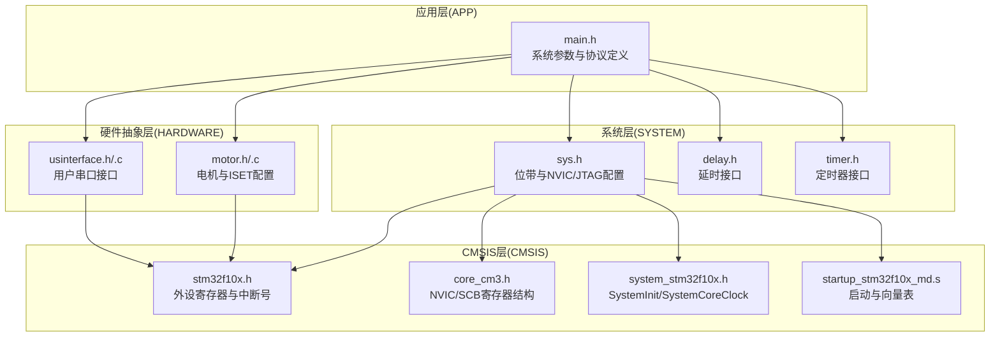
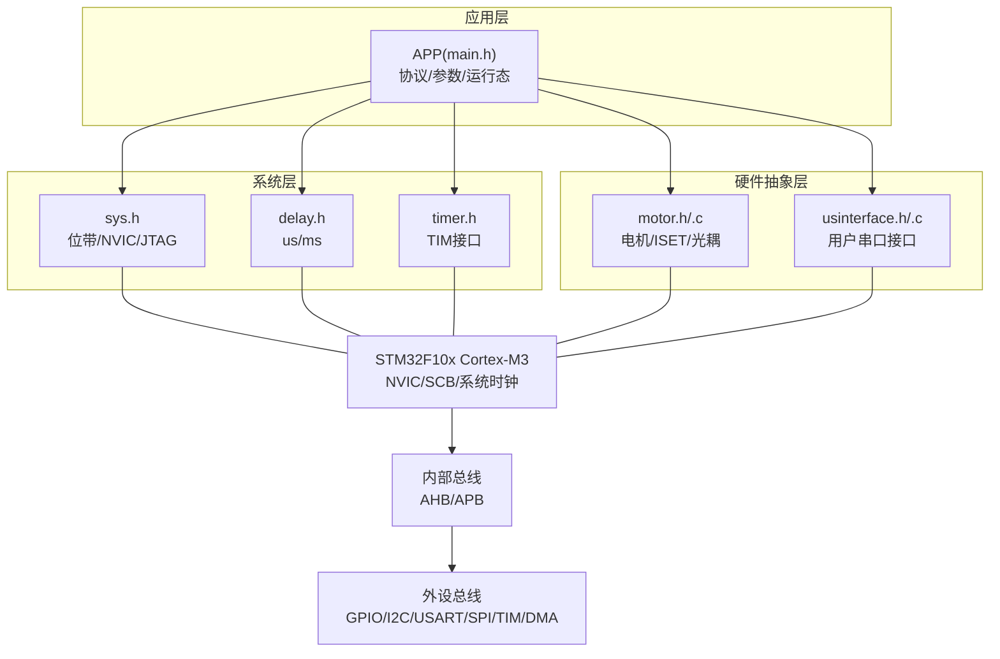
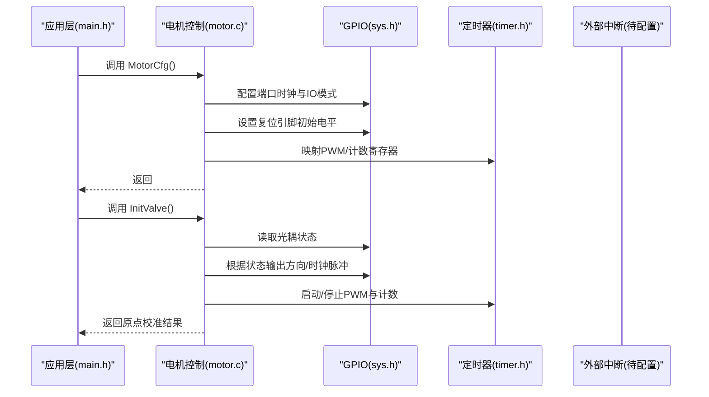
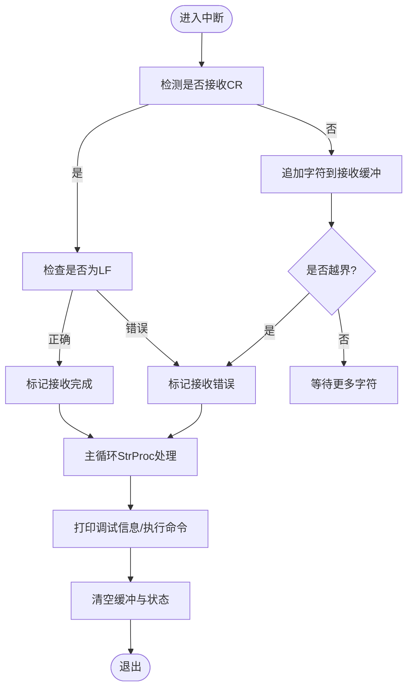
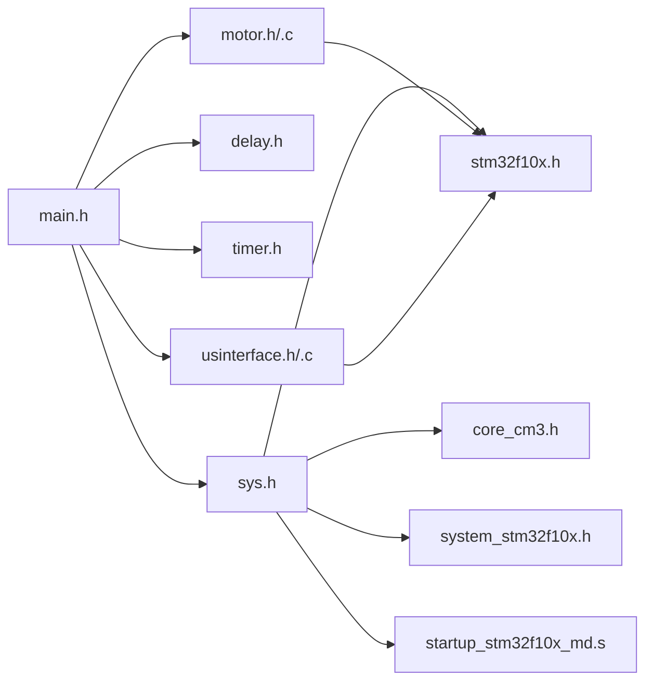

# 硬件架构

<cite>
**本文引用的文件**
- [motor.h](file://SRC/HARDWARE/motor/motor.h)
- [motor.c](file://SRC/HARDWARE/motor/motor.c)
- [usinterface.h](file://SRC/HARDWARE/usinterface/usinterface.h)
- [usinterface.c](file://SRC/HARDWARE/usinterface/usinterface.c)
- [stm32f10x.h](file://SRC/CMSIS/DeviceSupport/stm32f10x.h)
- [core_cm3.h](file://SRC/CMSIS/CoreSupport/core_cm3.h)
- [system_stm32f10x.h](file://SRC/CMSIS/DeviceSupport/system_stm32f10x.h)
- [startup_stm32f10x_md.s](file://SRC/CMSIS/DeviceSupport/startup/startup_stm32f10x_md.s)
- [sys.h](file://SRC/SYSTEM/sys/sys.h)
- [delay.h](file://SRC/SYSTEM/delay/delay.h)
- [timer.h](file://SRC/SYSTEM/timer/timer.h)
- [main.h](file://SRC/APP/main.h)
- [A_901_STM32F103C8_1.0.0.dbgconf](file://USER/DebugConfig/A_901_STM32F103C8_1.0.0.dbgconf)
- [A_906_STM32F103C8_1.0.0.dbgconf](file://USER/DebugConfig/A_906_STM32F103C8_1.0.0.dbgconf)
- [A_909_STM32F103C8_1.0.0.dbgconf](file://USER/DebugConfig/A_909_STM32F103C8_1.0.0.dbgconf)
</cite>

## 目录
1. [简介](#简介)
2. [项目结构](#项目结构)
3. [核心组件](#核心组件)
4. [架构总览](#架构总览)
5. [详细组件分析](#详细组件分析)
6. [依赖关系分析](#依赖关系分析)
7. [性能考虑](#性能考虑)
8. [故障排查指南](#故障排查指南)
9. [结论](#结论)
10. [附录](#附录)

## 简介
本文件面向硬件工程师与嵌入式开发者，系统性梳理通用开关器项目的硬件架构与实现要点。重点覆盖以下方面：
- 支持的硬件版本（A12-901、A12-906、A12-909）及其差异（引脚配置、接口与电气特性）
- STM32F10x 系列微控制器的架构特征（ARM Cortex-M3 内核、内存映射、外设配置）
- 硬件抽象层设计（GPIO、时钟系统、中断处理）
- 电机驱动电路、通信接口电路与电源管理设计
- 硬件调试接口与测试点说明
- 提供硬件连接图与信号时序图的绘制指导
- 结合工程源码定位关键实现路径，便于交叉验证与二次开发

## 项目结构
项目采用分层组织方式，围绕应用层、系统层、硬件抽象层与CMSIS底层库展开：
- 应用层：APP 层负责系统参数、协议与运行态控制
- 系统层：SYSTEM 层封装延时、定时器与系统初始化
- 硬件抽象层：HARDWARE 层封装电机控制、串口用户接口、Modbus 接口、EEPROM、Flash 等
- CMSIS 层：提供 Cortex-M3 内核与 STM32 外设寄存器访问

**图表来源**
- [main.h:110-125](file://SRC/APP/main.h#L110-L125)
- [sys.h:73-86](file://SRC/SYSTEM/sys/sys.h#L73-L86)
- [delay.h:11-13](file://SRC/SYSTEM/delay/delay.h#L11-L13)
- [timer.h:31-39](file://SRC/SYSTEM/timer/timer.h#L31-L39)
- [motor.h:16-49](file://SRC/HARDWARE/motor/motor.h#L16-L49)
- [usinterface.h:74-84](file://SRC/HARDWARE/usinterface/usinterface.h#L74-L84)
- [stm32f10x.h:167-472](file://SRC/CMSIS/DeviceSupport/stm32f10x.h#L167-L472)
- [core_cm3.h:132-147](file://SRC/CMSIS/CoreSupport/core_cm3.h#L132-L147)
- [system_stm32f10x.h:79-80](file://SRC/CMSIS/DeviceSupport/system_stm32f10x.h#L79-L80)
- [startup_stm32f10x_md.s](file://SRC/CMSIS/DeviceSupport/startup/startup_stm32f10x_md.s)

**章节来源**
- [main.h:110-125](file://SRC/APP/main.h#L110-L125)
- [sys.h:73-86](file://SRC/SYSTEM/sys/sys.h#L73-L86)
- [delay.h:11-13](file://SRC/SYSTEM/delay/delay.h#L11-L13)
- [timer.h:31-39](file://SRC/SYSTEM/timer/timer.h#L31-L39)
- [motor.h:16-49](file://SRC/HARDWARE/motor/motor.h#L16-L49)
- [usinterface.h:74-84](file://SRC/HARDWARE/usinterface/usinterface.h#L74-L84)
- [stm32f10x.h:167-472](file://SRC/CMSIS/DeviceSupport/stm32f10x.h#L167-L472)
- [core_cm3.h:132-147](file://SRC/CMSIS/CoreSupport/core_cm3.h#L132-L147)
- [system_stm32f10x.h:79-80](file://SRC/CMSIS/DeviceSupport/system_stm32f10x.h#L79-L80)
- [startup_stm32f10x_md.s](file://SRC/CMSIS/DeviceSupport/startup/startup_stm32f10x_md.s)

## 核心组件
- 微控制器与内核
  - ARM Cortex-M3 内核，支持 4 位抢占优先级分组；NVIC、SCB 寄存器结构由 CMSIS 提供
  - 外设中断号按 STM32F10x 系列统一定义，涵盖 ADC、CAN、I2C、SPI、USART、TIM、EXTI 等
- 时钟系统
  - SystemInit/SystemCoreClockUpdate 由 CMSIS 提供，用于系统时钟初始化与更新
  - 启动文件负责向量表与复位处理
- GPIO 与位带
  - 通过位带别名实现对单个 IO 的原子读写，提升 GPIO 控制效率
  - GPIO 模式与速率宏集中定义，便于跨版本移植
- 定时器与中断
  - 定时器接口封装 TIM2/TIM3/TIM4/TIM5/TIM6/TIM7 等，配合中断实现精确控制
- 电机控制
  - 针对 A12-901/906/909 版本的引脚差异与电流档位（ISET）配置
  - 光耦检测、原点寻找、半通道密封等控制流程
- 用户串口接口
  - 提供命令解析、超时处理、参数提取等能力，支持调试与远程配置

**章节来源**
- [core_cm3.h:132-147](file://SRC/CMSIS/CoreSupport/core_cm3.h#L132-L147)
- [stm32f10x.h:167-472](file://SRC/CMSIS/DeviceSupport/stm32f10x.h#L167-L472)
- [system_stm32f10x.h:79-80](file://SRC/CMSIS/DeviceSupport/system_stm32f10x.h#L79-L80)
- [startup_stm32f10x_md.s](file://SRC/CMSIS/DeviceSupport/startup/startup_stm32f10x_md.s)
- [sys.h:14-56](file://SRC/SYSTEM/sys/sys.h#L14-L56)
- [motor.h:16-49](file://SRC/HARDWARE/motor/motor.h#L16-L49)
- [motor.c:4-68](file://SRC/HARDWARE/motor/motor.c#L4-L68)
- [usinterface.h:44-89](file://SRC/HARDWARE/usinterface/usinterface.h#L44-L89)
- [usinterface.c:15-106](file://SRC/HARDWARE/usinterface/usinterface.c#L15-L106)

## 架构总览
整体硬件架构围绕 STM32F10x 微控制器构建，上层通过系统层与硬件抽象层实现对电机、通信与存储等外设的统一控制。

**图表来源**
- [stm32f10x.h:167-472](file://SRC/CMSIS/DeviceSupport/stm32f10x.h#L167-L472)
- [core_cm3.h:132-147](file://SRC/CMSIS/CoreSupport/core_cm3.h#L132-L147)
- [system_stm32f10x.h:79-80](file://SRC/CMSIS/DeviceSupport/system_stm32f10x.h#L79-L80)
- [sys.h:73-86](file://SRC/SYSTEM/sys/sys.h#L73-L86)
- [delay.h:11-13](file://SRC/SYSTEM/delay/delay.h#L11-L13)
- [timer.h:31-39](file://SRC/SYSTEM/timer/timer.h#L31-L39)
- [motor.h:16-49](file://SRC/HARDWARE/motor/motor.h#L16-L49)
- [usinterface.h:74-84](file://SRC/HARDWARE/usinterface/usinterface.h#L74-L84)

## 详细组件分析

### 硬件版本差异与引脚配置（A12-901/906/909）
- LED 工作指示
  - A12-901/A12-909：PC15
  - A12-906：PC14
- 光耦检测输入
  - A12-901/A12-909：PA15
  - A12-906：PC15
- 电机控制信号
  - A12-901/A12-909：ENA/RES/RST/DIR/CLK 分别位于 PA4/PA5/PA6/PA7
  - A12-906：ENA/RST/DIR/CLK 分别位于 PA6/PA7/PA4/PA5
- 电流档位（ISET）配置
  - A12-901/A12-909：PB0/PB12/PA11
  - A12-906：PB12/PB0/PA11
- IO 口差异
  - A12-901：IO_OUT=PA8，IO_IN=PB3（或 PB3 输出）
  - A12-909：IO_OUT=PB13，IO_IN=PB5
  - A12-906：IO_OUT=PB13，IO_IN=PB14

以上差异通过编译宏（A12_901/ A12_906/ A12_909）在头文件与电机配置中体现，确保同一套软件适配不同硬件版本。

**章节来源**
- [motor.h:16-49](file://SRC/HARDWARE/motor/motor.h#L16-L49)
- [motor.c:6-51](file://SRC/HARDWARE/motor/motor.c#L6-L51)
- [main.h:110-125](file://SRC/APP/main.h#L110-L125)

### STM32F10x 架构与外设映射
- 中断号与外设映射
  - 通过 stm32f10x.h 中的 IRQn_Type 定义，统一管理各外设中断号（如 USART1/2/3、TIM2/3/4、ADC、I2C、SPI 等）
- NVIC/SCB 寄存器
  - core_cm3.h 提供 NVIC/IP/VTOR/ICSR 等寄存器结构，支撑中断优先级与向量表配置
- 系统时钟
  - system_stm32f10x.h 提供 SystemInit/SystemCoreClockUpdate 原型，启动文件负责向量表与复位处理

**章节来源**
- [stm32f10x.h:167-472](file://SRC/CMSIS/DeviceSupport/stm32f10x.h#L167-L472)
- [core_cm3.h:132-147](file://SRC/CMSIS/CoreSupport/core_cm3.h#L132-L147)
- [system_stm32f10x.h:79-80](file://SRC/CMSIS/DeviceSupport/system_stm32f10x.h#L79-L80)
- [startup_stm32f10x_md.s](file://SRC/CMSIS/DeviceSupport/startup/startup_stm32f10x_md.s)

### 硬件抽象层设计（GPIO/时钟/中断）
- GPIO 位带操作
  - sys.h 定义了基于位带的 IO 访问宏（PAout/PAin 等），实现对单 IO 的原子读写
- 时钟初始化
  - sys.h 声明 Stm32_Clock_Init，结合 system_stm32f10x.h 的 SystemInit 进行系统时钟配置
- 中断与优先级
  - sys.h 提供 NVIC 初始化与优先级分组配置，core_cm3.h 的 NVIC 结构支撑中断控制

**章节来源**
- [sys.h:14-56](file://SRC/SYSTEM/sys/sys.h#L14-L56)
- [sys.h:73-86](file://SRC/SYSTEM/sys/sys.h#L73-L86)
- [system_stm32f10x.h:79-80](file://SRC/CMSIS/DeviceSupport/system_stm32f10x.h#L79-L80)
- [core_cm3.h:132-147](file://SRC/CMSIS/CoreSupport/core_cm3.h#L132-L147)

### 电机驱动电路与控制流程
- 引脚与功能
  - 电机使能/复位/方向/时钟信号分别连接至 PA4/PA5/PA6/PA7（不同版本引脚顺序不同）
  - 光耦输入用于检测阀门原点与遮挡状态
  - 电流档位 ISET 通过三线编码选择不同电流等级
- 初始化与原点寻找
  - motor.c 实现 MotorCfg：使能端口时钟、配置 IO 模式、拉高/拉低复位引脚、建立 TIM4 与 PWM 参数映射
  - InitValve：根据光耦状态决定旋转方向与步进策略，实现原点校准与半通道密封控制

**图表来源**
- [motor.c:4-68](file://SRC/HARDWARE/motor/motor.c#L4-L68)
- [motor.c:73-200](file://SRC/HARDWARE/motor/motor.c#L73-L200)
- [sys.h:14-56](file://SRC/SYSTEM/sys/sys.h#L14-L56)
- [timer.h:31-39](file://SRC/SYSTEM/timer/timer.h#L31-L39)

**章节来源**
- [motor.c:4-68](file://SRC/HARDWARE/motor/motor.c#L4-L68)
- [motor.c:73-200](file://SRC/HARDWARE/motor/motor.c#L73-L200)
- [motor.h:16-49](file://SRC/HARDWARE/motor/motor.h#L16-L49)

### 通信接口电路与用户串口接口
- 用户串口接口
  - usinterface.h/.c 提供命令解析、超时处理、参数提取与调试输出
  - 支持回车/换行结束符、超时清除、参数个数与长度限制，避免越界与死机
- 串口接收流程

**图表来源**
- [usinterface.c:15-106](file://SRC/HARDWARE/usinterface/usinterface.c#L15-L106)
- [usinterface.h:44-89](file://SRC/HARDWARE/usinterface/usinterface.h#L44-L89)

**章节来源**
- [usinterface.h:44-89](file://SRC/HARDWARE/usinterface/usinterface.h#L44-L89)
- [usinterface.c:15-106](file://SRC/HARDWARE/usinterface/usinterface.c#L15-L106)

### 电源管理与调试接口
- 电源管理
  - 通过 ISET 三线编码选择不同电流等级，满足不同负载下的功耗与发热控制需求
- 调试接口
  - Debug 配置文件（A_901/A_906/A_909）统一设置 DBGMCU_CR，保留保留位，启用/禁用调试模式下的计数器与看门狗停止行为
  - JTAG/SWD 模式可通过 sys.h 的 JTAG_Set 进行配置

**章节来源**
- [motor.h:44-49](file://SRC/HARDWARE/motor/motor.h#L44-L49)
- [motor.c:64-67](file://SRC/HARDWARE/motor/motor.c#L64-L67)
- [A_901_STM32F103C8_1.0.0.dbgconf:34](file://USER/DebugConfig/A_901_STM32F103C8_1.0.0.dbgconf#L34)
- [A_906_STM32F103C8_1.0.0.dbgconf:34](file://USER/DebugConfig/A_906_STM32F103C8_1.0.0.dbgconf#L34)
- [A_909_STM32F103C8_1.0.0.dbgconf:34](file://USER/DebugConfig/A_909_STM32F103C8_1.0.0.dbgconf#L34)
- [sys.h:68-80](file://SRC/SYSTEM/sys/sys.h#L68-L80)

## 依赖关系分析
- 应用层依赖系统层与硬件抽象层提供的统一接口
- 系统层依赖 CMSIS 提供的内核与外设寄存器访问
- 硬件抽象层直接操作外设寄存器，同时通过 sys.h 的位带宏提升 IO 控制效率
- 不同硬件版本通过编译宏隔离差异，保证软件复用性

**图表来源**
- [main.h:110-125](file://SRC/APP/main.h#L110-L125)
- [sys.h:73-86](file://SRC/SYSTEM/sys/sys.h#L73-L86)
- [delay.h:11-13](file://SRC/SYSTEM/delay/delay.h#L11-L13)
- [timer.h:31-39](file://SRC/SYSTEM/timer/timer.h#L31-L39)
- [motor.h:16-49](file://SRC/HARDWARE/motor/motor.h#L16-L49)
- [usinterface.h:74-84](file://SRC/HARDWARE/usinterface/usinterface.h#L74-L84)
- [stm32f10x.h:167-472](file://SRC/CMSIS/DeviceSupport/stm32f10x.h#L167-L472)
- [core_cm3.h:132-147](file://SRC/CMSIS/CoreSupport/core_cm3.h#L132-L147)
- [system_stm32f10x.h:79-80](file://SRC/CMSIS/DeviceSupport/system_stm32f10x.h#L79-L80)
- [startup_stm32f10x_md.s](file://SRC/CMSIS/DeviceSupport/startup/startup_stm32f10x_md.s)

**章节来源**
- [main.h:110-125](file://SRC/APP/main.h#L110-L125)
- [sys.h:73-86](file://SRC/SYSTEM/sys/sys.h#L73-L86)
- [delay.h:11-13](file://SRC/SYSTEM/delay/delay.h#L11-L13)
- [timer.h:31-39](file://SRC/SYSTEM/timer/timer.h#L31-L39)
- [motor.h:16-49](file://SRC/HARDWARE/motor/motor.h#L16-L49)
- [usinterface.h:74-84](file://SRC/HARDWARE/usinterface/usinterface.h#L74-L84)
- [stm32f10x.h:167-472](file://SRC/CMSIS/DeviceSupport/stm32f10x.h#L167-L472)
- [core_cm3.h:132-147](file://SRC/CMSIS/CoreSupport/core_cm3.h#L132-L147)
- [system_stm32f10x.h:79-80](file://SRC/CMSIS/DeviceSupport/system_stm32f10x.h#L79-L80)
- [startup_stm32f10x_md.s](file://SRC/CMSIS/DeviceSupport/startup/startup_stm32f10x_md.s)

## 性能考虑
- GPIO 位带操作显著降低寄存器访问开销，适合高频 IO 控制场景
- 定时器 PWM 与计数配合，可实现高精度步进控制与速度调节
- 串口接收采用超时与长度限制，避免阻塞与内存越界
- 通过 ISET 选择合适电流档位，平衡性能与功耗

[本节为通用性能讨论，无需列出具体文件来源]

## 故障排查指南
- 电机不动作或原点校准失败
  - 检查光耦输入电平与电机控制引脚映射（不同版本引脚顺序不同）
  - 确认 ISET 档位设置与负载匹配
- 串口无响应或频繁超时
  - 校验接收结束符配置与超时阈值
  - 检查缓冲区长度与参数个数限制
- 调试模式下计数器停止
  - 检查 DBGMCU_CR 配置，确认调试模式下计数器停止行为符合预期

**章节来源**
- [motor.c:73-200](file://SRC/HARDWARE/motor/motor.c#L73-L200)
- [usinterface.c:15-106](file://SRC/HARDWARE/usinterface/usinterface.c#L15-L106)
- [A_901_STM32F103C8_1.0.0.dbgconf:34](file://USER/DebugConfig/A_901_STM32F103C8_1.0.0.dbgconf#L34)
- [A_906_STM32F103C8_1.0.0.dbgconf:34](file://USER/DebugConfig/A_906_STM32F103C8_1.0.0.dbgconf#L34)
- [A_909_STM32F103C8_1.0.0.dbgconf:34](file://USER/DebugConfig/A_909_STM32F103C8_1.0.0.dbgconf#L34)

## 结论
本项目以 STM32F10x 为核心，通过清晰的分层架构与硬件抽象层设计，实现了对电机、通信与电源管理的统一控制。借助编译宏隔离硬件版本差异，软件具备良好的可移植性与可维护性。建议在后续迭代中进一步完善硬件连接图与信号时序图，以辅助硬件调试与系统联调。

[本节为总结性内容，无需列出具体文件来源]

## 附录
- 硬件连接图绘制建议
  - 将 MCU 的 GPIO、USART、I2C、SPI、TIM 等引脚与外部电路（电机驱动、光耦、ISET、通信接口）一一对应标注
  - 标注电源与地、去耦电容、限流电阻与保护二极管等关键器件
- 信号时序图绘制建议
  - 电机控制：ENA/RST/DIR/CLK 与 PWM 的时序关系，光耦检测窗口
  - 串口通信：起始位、数据位、停止位与时钟频率关系，超时与重试机制
- 测试点建议
  - LED 工作指示、光耦输入、ISET 三线编码、电机驱动输出、串口收发指示

[本节为概念性内容，无需列出具体文件来源]