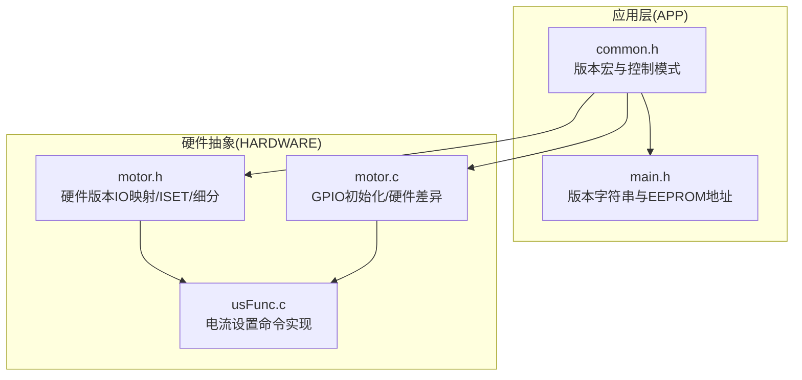
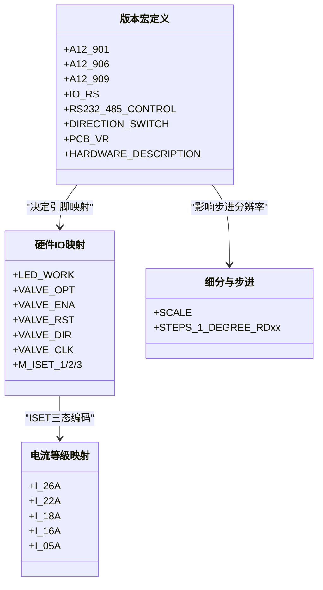
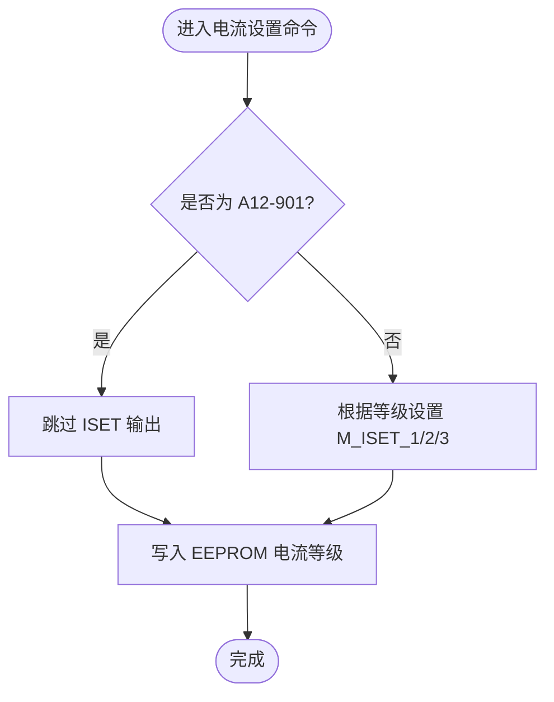
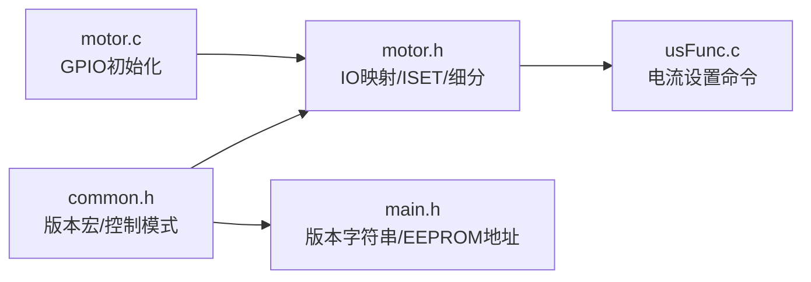

# 硬件版本对比

<cite>
**本文引用的文件**
- [SRC/APP/common.h](file://SRC/APP/common.h)
- [SRC/APP/main.h](file://SRC/APP/main.h)
- [SRC/HARDWARE/motor/motor.c](file://SRC/HARDWARE/motor/motor.c)
- [SRC/HARDWARE/motor/motor.h](file://SRC/HARDWARE/motor/motor.h)
- [SRC/HARDWARE/usinterface/usFunc.c](file://SRC/HARDWARE/usinterface/usFunc.c)
- [Doc/QHF_v1.3.1修改说明.md](file://Doc/QHF_v1.3.1修改说明.md)
</cite>

## 目录
1. [简介](#简介)
2. [项目结构](#项目结构)
3. [核心组件](#核心组件)
4. [架构总览](#架构总览)
5. [详细组件分析](#详细组件分析)
6. [依赖关系分析](#依赖关系分析)
7. [性能考量](#性能考量)
8. [故障排查指南](#故障排查指南)
9. [结论](#结论)
10. [附录](#附录)

## 简介
本文件面向通用开关器项目的硬件版本对比，聚焦 A12-901、A12-906、A12-909 三种硬件版本的技术规格差异与软件配置影响。重点覆盖：
- 额定电流与电流等级映射
- 安装方式与外观版本（水平/垂直/迷你）
- PCB 布局差异（引脚、ISET 三态编码、细分与步进关系）
- 宏定义配置（A12_901、A12_906、A12_909）与版本字符串
- 版本选择对软件配置的影响（IO 控制模式、RS232/485 控制模式）
- 版本切换的配置示例与注意事项
- 硬件版本标识符的使用与版本检测机制

## 项目结构
围绕硬件版本的关键代码分布在以下模块：
- APP 层：版本宏定义、控制方式与版本字符串、EEPROM 地址映射
- MOTOR 层：硬件版本相关的 IO 映射、ISET 三态编码、细分与步进关系
- USINTERFACE 层：电流设置命令实现与 ISET 写入逻辑
- 文档：版本号命名与描述规范

**图表来源**
- [SRC/APP/common.h:42-151](file://SRC/APP/common.h#L42-L151)
- [SRC/APP/main.h:12-181](file://SRC/APP/main.h#L12-L181)
- [SRC/HARDWARE/motor/motor.h:10-49](file://SRC/HARDWARE/motor/motor.h#L10-L49)
- [SRC/HARDWARE/motor/motor.c:4-42](file://SRC/HARDWARE/motor/motor.c#L4-L42)
- [SRC/HARDWARE/usinterface/usFunc.c:499-532](file://SRC/HARDWARE/usinterface/usFunc.c#L499-L532)

**章节来源**
- [SRC/APP/common.h:42-151](file://SRC/APP/common.h#L42-L151)
- [SRC/APP/main.h:12-181](file://SRC/APP/main.h#L12-L181)
- [SRC/HARDWARE/motor/motor.h:10-49](file://SRC/HARDWARE/motor/motor.h#L10-L49)
- [SRC/HARDWARE/motor/motor.c:4-42](file://SRC/HARDWARE/motor/motor.c#L4-L42)
- [SRC/HARDWARE/usinterface/usFunc.c:499-532](file://SRC/HARDWARE/usinterface/usFunc.c#L499-L532)

## 核心组件
- 版本宏与控制模式
  - 在 common.h 中通过 A_901/A_906/A_909、B_901/B_906、O_901/O_906/O_909、C_901 等组合宏，自动推导出 A12_901/A12_906/A12_909、IO_RS、RS232_485_CONTROL、DIRECTION_SWITCH 等控制相关宏，并设置硬件描述字符串与 PCB 版本号。
- 硬件描述与电流等级
  - main.h 中定义了“控制方式”字符串（基于 RS232_485_CONTROL 或 IO_RS 的组合），common.h 中定义了“硬件描述字符串”和“PCB 版本号”，usFunc.c 中实现了电流等级到数值的映射与写入逻辑。

**章节来源**
- [SRC/APP/common.h:42-151](file://SRC/APP/common.h#L42-L151)
- [SRC/APP/main.h:12-39](file://SRC/APP/main.h#L12-L39)
- [SRC/HARDWARE/usinterface/usFunc.c:499-532](file://SRC/HARDWARE/usinterface/usFunc.c#L499-L532)

## 架构总览
硬件版本差异主要体现在：
- 额定电流与电流等级映射（ISET 三态编码）
- 安装方式与外观版本（迷你/水平/垂直）
- PCB 引脚与 GPIO 映射差异
- 细分与步进关系差异（影响步进分辨率）

**图表来源**
- [SRC/APP/common.h:135-151](file://SRC/APP/common.h#L135-L151)
- [SRC/HARDWARE/motor/motor.h:16-49](file://SRC/HARDWARE/motor/motor.h#L16-L49)
- [SRC/HARDWARE/motor/motor.h:100-148](file://SRC/HARDWARE/motor/motor.h#L100-L148)

**章节来源**
- [SRC/APP/common.h:135-151](file://SRC/APP/common.h#L135-L151)
- [SRC/HARDWARE/motor/motor.h:16-49](file://SRC/HARDWARE/motor/motor.h#L16-L49)
- [SRC/HARDWARE/motor/motor.h:100-148](file://SRC/HARDWARE/motor/motor.h#L100-L148)

## 详细组件分析

### 额定电流与电流等级映射
- 电流等级枚举与数值映射
  - ISET 三态编码对应电流等级：I_26A、I_22A、I_18A、I_16A、I_05A。
  - usFunc.c 实现了电流等级读写命令，将等级值写入 EEPROM 并调用 ISET 输出三态编码。
- 版本差异
  - A12-901：默认电流等级为 I_26A（等级 0）。
  - A12-906、A12-909：ISET 三态编码由硬件引脚组合实现，具体等级与数值映射见电流等级枚举。
- 注意事项
  - A12-901 在电流写入时跳过 ISET 输出（条件编译），其他版本通过 ISET 引脚输出三态编码。

**章节来源**
- [SRC/HARDWARE/motor/motor.h:10-14](file://SRC/HARDWARE/motor/motor.h#L10-L14)
- [SRC/HARDWARE/usinterface/usFunc.c:499-532](file://SRC/HARDWARE/usinterface/usFunc.c#L499-L532)
- [SRC/HARDWARE/motor/motor.c:30-42](file://SRC/HARDWARE/motor/motor.c#L30-L42)

### 安装方式与外观版本
- 外观与安装方式
  - A12-901：迷你版本，适合空间受限场景。
  - A12-906：水平版本，适合水平安装。
  - A12-909：垂直版本，适合垂直安装。
- 硬件描述字符串
  - 迷你版本（最大 1.6A）
  - 水平版本（最大 2.5A）
  - 垂直版本（最大 2.2A）

**章节来源**
- [SRC/APP/common.h:135-151](file://SRC/APP/common.h#L135-L151)
- [Doc/QHF_v1.3.1修改说明.md:182-190](file://Doc/QHF_v1.3.1修改说明.md#L182-L190)

### PCB 布局特点
- 引脚与外设映射
  - A12-901/909：LED 工作指示灯、阀门光电传感器、ENA/RST/DIR/CLK 控制引脚、ISET 三态编码引脚。
  - A12-906：LED 工作指示灯、阀门光电传感器、ENA/RST/DIR/CLK 控制引脚、ISET 三态编码引脚。
- ISET 三态编码
  - A12-906/909：通过 M_ISET_1/2/3 三引脚组合实现电流等级编码。
  - A12-901：不直接输出 ISET 三态编码（条件编译）。
- 细分与步进
  - A12-901/909：细分 SCALE=64；A12-906：细分 SCALE=16。
  - 不同减速比对应的每度步数不同，影响定位精度与速度上限。

**图表来源**
- [SRC/HARDWARE/usinterface/usFunc.c:499-532](file://SRC/HARDWARE/usinterface/usFunc.c#L499-L532)
- [SRC/HARDWARE/motor/motor.c:30-42](file://SRC/HARDWARE/motor/motor.c#L30-L42)

**章节来源**
- [SRC/HARDWARE/motor/motor.h:16-49](file://SRC/HARDWARE/motor/motor.h#L16-L49)
- [SRC/HARDWARE/motor/motor.h:100-148](file://SRC/HARDWARE/motor/motor.h#L100-L148)
- [SRC/HARDWARE/motor/motor.c:30-42](file://SRC/HARDWARE/motor/motor.c#L30-L42)

### 宏定义配置与版本字符串
- 版本宏与控制模式
  - 通过 A_901/A_906/A_909、B_901/B_906、O_901/O_906/O_909、C_901 等组合宏，自动推导出 A12_901/A12_906/A12_909、IO_RS、RS232_485_CONTROL、DIRECTION_SWITCH。
  - main.h 中根据 RS232_485_CONTROL 与 IO_RS 设置“控制方式”字符串（如“IO 232/485”、“Only 232/485”）。
- 硬件描述字符串
  - common.h 中定义 PCB_VR 与 HARDWARE_DESCRIPTION，用于下载口版本输出。

**章节来源**
- [SRC/APP/common.h:42-151](file://SRC/APP/common.h#L42-L151)
- [SRC/APP/main.h:12-39](file://SRC/APP/main.h#L12-L39)

### 版本选择对软件配置的影响
- IO 控制模式与 RS232/485 控制模式
  - RS232_485_CONTROL=1：仅支持 RS232/485 控制，屏蔽 IO。
  - RS232_485_CONTROL=0：支持 IO 控制。
  - IO_RS=1：IO_IN 高电平有效、IO_OUT 低电平有效（取反）。
  - IO_RS=0：IO_IN 高电平有效、IO_OUT 高电平有效（同电平）。
- DIRECTION_SWITCH
  - A12-906 可通过 DIRECTION_SWITCH 调整方向，以适配不同安装方向。

**章节来源**
- [SRC/APP/common.h:42-151](file://SRC/APP/common.h#L42-L151)
- [SRC/APP/main.h:15-39](file://SRC/APP/main.h#L15-L39)

### 版本切换的配置示例与注意事项
- 配置示例（以 A_901 为例）
  - 启用 A12_901 与 IO 控制：定义 A_901，RS232_485_CONTROL 将被取消，IOCTRL 启用；IO_RS=1。
  - 启用 A12_906 与 RS232/485 控制：定义 A_906，RS232_485_CONTROL 启用；IOCTRL 取消。
- 注意事项
  - 选择 A12-901 时，电流设置不会通过 ISET 引脚输出三态编码。
  - A12-906 的方向可通过 DIRECTION_SWITCH 调整。
  - 不同版本的 EEPROM 地址映射一致，但电流等级与细分不同，需注意兼容性。

**章节来源**
- [SRC/APP/common.h:77-104](file://SRC/APP/common.h#L77-L104)
- [SRC/HARDWARE/motor/motor.c:30-42](file://SRC/HARDWARE/motor/motor.c#L30-L42)

### 硬件版本标识符的使用与版本检测机制
- 硬件版本标识符
  - PCB_VR：A12-901/A12-906/A12-909。
  - HARDWARE_DESCRIPTION：硬件描述字符串（含最大电流）。
- 版本检测机制
  - 下载口输出包含“程序版本、控制方式、PCB 版本、硬件描述（最大电流）”。
  - EEPROM 地址映射统一，便于跨版本参数迁移。

**章节来源**
- [SRC/APP/common.h:135-151](file://SRC/APP/common.h#L135-L151)
- [SRC/APP/main.h:12-39](file://SRC/APP/main.h#L12-L39)
- [Doc/QHF_v1.3.1修改说明.md:182-190](file://Doc/QHF_v1.3.1修改说明.md#L182-L190)

## 依赖关系分析
- 版本宏定义依赖于 APP 层的控制模式宏，进而影响 MOTOR 层的 IO 映射与 ISET 输出策略。
- USINTERFACE 层的电流设置命令依赖 MOTOR 层的 ISET 三态编码实现。
- EEPROM 地址映射在 APP 层集中定义，确保不同版本的一致性。

**图表来源**
- [SRC/APP/common.h:42-151](file://SRC/APP/common.h#L42-L151)
- [SRC/APP/main.h:12-181](file://SRC/APP/main.h#L12-L181)
- [SRC/HARDWARE/motor/motor.h:16-49](file://SRC/HARDWARE/motor/motor.h#L16-L49)
- [SRC/HARDWARE/motor/motor.c:4-42](file://SRC/HARDWARE/motor/motor.c#L4-L42)
- [SRC/HARDWARE/usinterface/usFunc.c:499-532](file://SRC/HARDWARE/usinterface/usFunc.c#L499-L532)

**章节来源**
- [SRC/APP/common.h:42-151](file://SRC/APP/common.h#L42-L151)
- [SRC/APP/main.h:12-181](file://SRC/APP/main.h#L12-L181)
- [SRC/HARDWARE/motor/motor.h:16-49](file://SRC/HARDWARE/motor/motor.h#L16-L49)
- [SRC/HARDWARE/motor/motor.c:4-42](file://SRC/HARDWARE/motor/motor.c#L4-L42)
- [SRC/HARDWARE/usinterface/usFunc.c:499-532](file://SRC/HARDWARE/usinterface/usFunc.c#L499-L532)

## 性能考量
- 细分与步进关系
  - A12-906 细分为 16，分辨率较低；A12-901/909 细分为 64，分辨率更高，定位更精细。
- 电流等级与发热
  - 不同版本的最大电流不同，应结合负载选择合适版本，避免过流导致发热与误动作。
- ISET 输出策略
  - A12-901 不通过 ISET 引脚输出三态编码，需注意电流设置路径差异。

**章节来源**
- [SRC/HARDWARE/motor/motor.h:100-148](file://SRC/HARDWARE/motor/motor.h#L100-L148)
- [SRC/HARDWARE/motor/motor.c:30-42](file://SRC/HARDWARE/motor/motor.c#L30-L42)

## 故障排查指南
- 电流设置无效或错误
  - 检查版本是否为 A12-901（该版本不输出 ISET 三态编码）。
  - 确认电流等级值在允许范围内（0-4）。
- 通讯异常（RS232/485）
  - 确认 RS232_485_CONTROL 与 IO_RS 配置是否正确。
  - A12-906 方向可通过 DIRECTION_SWITCH 调整。
- EEPROM 参数不生效
  - 确认 EEPROM 地址映射与版本一致，检查写入流程。

**章节来源**
- [SRC/HARDWARE/usinterface/usFunc.c:499-532](file://SRC/HARDWARE/usinterface/usFunc.c#L499-L532)
- [SRC/APP/common.h:42-151](file://SRC/APP/common.h#L42-L151)
- [SRC/APP/main.h:12-181](file://SRC/APP/main.h#L12-L181)

## 结论
- A12-901/906/909 在硬件层面的主要差异体现在电流等级、安装方式与细分分辨率上。
- 软件通过版本宏自动适配 IO 控制模式与 RS232/485 控制模式，并在 EEPROM 地址映射上保持一致性。
- 选择版本时需综合考虑电流需求、安装空间与定位精度要求，并正确配置控制模式与方向参数。

## 附录
- 版本输出格式参考
  - 下载口输出包含“程序版本、控制方式、PCB 版本、硬件描述（最大电流）”。

**章节来源**
- [Doc/QHF_v1.3.1修改说明.md:182-190](file://Doc/QHF_v1.3.1修改说明.md#L182-L190)