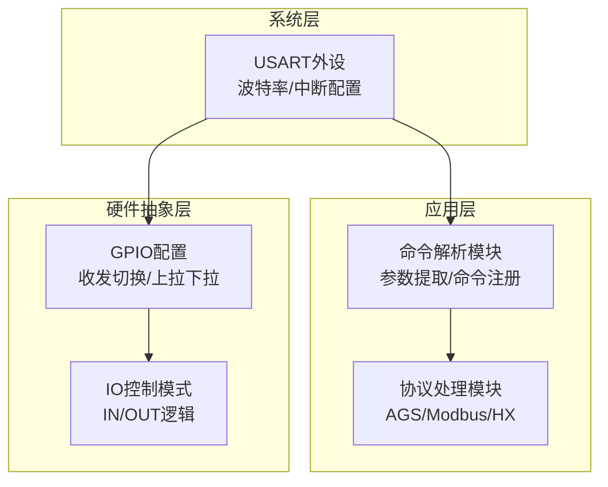
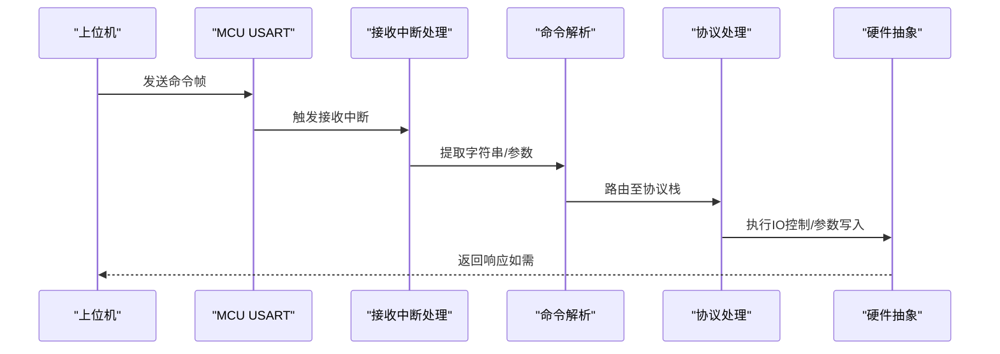
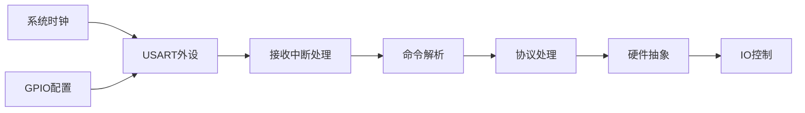

# 通信接口电路

<cite>
**本文引用的文件**
- [usinterface.h](file://SRC/HARDWARE/usinterface/usinterface.h)
- [usinterface.c](file://SRC/HARDWARE/usinterface/usinterface.c)
- [usFunc.h](file://SRC/HARDWARE/usinterface/usFunc.h)
- [usFunc.c](file://SRC/HARDWARE/usinterface/usFunc.c)
- [usart.h](file://SRC/SYSTEM/usart/usart.h)
- [usart.c](file://SRC/SYSTEM/usart/usart.c)
- [main.h](file://SRC/APP/main.h)
- [main.c](file://SRC/APP/main.c)
- [motor.c](file://SRC/HARDWARE/motor/motor.c)
- [common.h](file://SRC/APP/common.h)
- [stm32f10x.h](file://SRC/CMSIS/DeviceSupport/stm32f10x.h)
- [release_version.txt](file://Version/release_version.txt)
</cite>

## 目录
1. [简介](#简介)
2. [项目结构](#项目结构)
3. [核心组件](#核心组件)
4. [架构总览](#架构总览)
5. [详细组件分析](#详细组件分析)
6. [依赖关系分析](#依赖关系分析)
7. [性能考量](#性能考量)
8. [故障排查指南](#故障排查指南)
9. [结论](#结论)
10. [附录](#附录)

## 简介
本文件面向通用开关器项目的通信接口电路设计，聚焦RS232/RS485通信电路的实现要点，包括：
- 电平转换器MAX232与MAX485的应用场景与差异
- 半双工与全双工通信的电路实现差异
- 信号隔离设计（光耦隔离与变压器隔离）的适用性
- 通信线路的终端匹配、阻抗控制与信号完整性考虑
- IO控制模式下的数字信号传输电路
- 通信接口的电气特性参数（电压范围、电流容量、传输速率限制）
- EMC设计考虑与抗干扰措施
- 不同硬件版本的通信接口差异与电路配置变化

## 项目结构
该项目采用分层架构，通信接口由系统层（USART外设）、应用层（协议栈与命令解析）与硬件抽象层（GPIO与收发切换）协同实现。关键文件分布如下：
- 系统层：USART初始化、中断处理与波特率配置
- 应用层：命令解析、参数提取与协议处理
- 硬件抽象层：IO配置、收发切换控制与IO控制模式

图示来源
- [usart.c:38-120](file://SRC/SYSTEM/usart/usart.c#L38-L120)
- [usart.c:159-221](file://SRC/SYSTEM/usart/usart.c#L159-L221)
- [usinterface.c:15-106](file://SRC/HARDWARE/usinterface/usinterface.c#L15-L106)
- [usFunc.c:753-807](file://SRC/HARDWARE/usinterface/usFunc.c#L753-L807)
- [main.c:12-67](file://SRC/APP/main.c#L12-L67)
- [main.c:204-220](file://SRC/APP/main.c#L204-L220)

章节来源
- [usart.h:1-57](file://SRC/SYSTEM/usart/usart.h#L1-L57)
- [usart.c:38-120](file://SRC/SYSTEM/usart/usart.c#L38-L120)
- [usart.c:159-221](file://SRC/SYSTEM/usart/usart.c#L159-L221)
- [usinterface.h:37-95](file://SRC/HARDWARE/usinterface/usinterface.h#L37-L95)
- [usinterface.c:15-106](file://SRC/HARDWARE/usinterface/usinterface.c#L15-L106)
- [usFunc.c:753-807](file://SRC/HARDWARE/usinterface/usFunc.c#L753-L807)
- [main.c:12-67](file://SRC/APP/main.c#L12-L67)
- [main.c:204-220](file://SRC/APP/main.c#L204-L220)

## 核心组件
- USART串口通信：负责数据收发、波特率设置与中断触发
- 命令解析模块：解析用户输入命令、提取参数并执行对应操作
- 协议处理模块：支持AGS、Modbus、HX等多种协议
- 硬件抽象层：配置GPIO、收发切换引脚与IO控制模式

章节来源
- [usart.h:21-41](file://SRC/SYSTEM/usart/usart.h#L21-L41)
- [usart.c:38-120](file://SRC/SYSTEM/usart/usart.c#L38-L120)
- [usart.c:159-221](file://SRC/SYSTEM/usart/usart.c#L159-L221)
- [usinterface.c:15-106](file://SRC/HARDWARE/usinterface/usinterface.c#L15-L106)
- [usFunc.c:753-807](file://SRC/HARDWARE/usinterface/usFunc.c#L753-L807)
- [main.c:12-67](file://SRC/APP/main.c#L12-L67)

## 架构总览
通信接口整体流程：上位机通过RS232/RS485接口发送命令，MCU USART接收中断触发，进入命令解析与协议处理，最终执行IO控制或参数设置。

图示来源
- [usart.c:74-83](file://SRC/SYSTEM/usart/usart.c#L74-L83)
- [usart.c:138-151](file://SRC/SYSTEM/usart/usart.c#L138-L151)
- [usart.c:208-221](file://SRC/SYSTEM/usart/usart.c#L208-L221)
- [usinterface.c:15-106](file://SRC/HARDWARE/usinterface/usinterface.c#L15-L106)
- [usFunc.c:753-807](file://SRC/HARDWARE/usinterface/usFunc.c#L753-L807)
- [main.c:204-220](file://SRC/APP/main.c#L204-L220)

## 详细组件分析

### RS232/RS485通信电路设计
- 电平转换器选择
  - RS232：使用MAX232等电荷泵器件实现±3V至±15V的RS232电平，适用于短距离点对点通信
  - RS485：使用MAX485等差分收发器实现差分信号传输，适用于多点总线拓扑与工业环境
- 电路差异
  - RS232为单端信号，需考虑共模干扰与地环路；RS485为差分信号，具备更强的共模抑制能力
  - RS485需终端匹配电阻（通常120Ω）以消除反射，RS232无需终端匹配
- 信号完整性
  - RS485布线应尽量短且平行，避免与强干扰源邻近；PCB走线应控制阻抗与差分阻抗匹配
  - RS232布线避免长环路，必要时采用屏蔽双绞线

章节来源
- [usart.c:38-120](file://SRC/SYSTEM/usart/usart.c#L38-L120)
- [usart.c:159-221](file://SRC/SYSTEM/usart/usart.c#L159-L221)

### 半双工与全双工通信实现
- 半双工（RS485典型模式）
  - 通过GPIO控制收发切换引脚（如PB1），在发送时切换为驱动模式，在接收时切换为高阻态
  - 需要合理的切换时序，避免发送与接收切换过程中的信号冲突
- 全双工（RS232/部分RS485）
  - 无需收发切换，发送与接收独立，适合点对点或少量节点的简单拓扑

章节来源
- [main.c:12-67](file://SRC/APP/main.c#L12-L67)
- [main.c:204-220](file://SRC/APP/main.c#L204-L220)

### 信号隔离设计
- 光耦隔离
  - 在RS232/RS485接口侧使用光耦隔离，可有效抑制地环路与瞬态干扰
  - 光耦隔离适用于弱电控制与安全要求较高的场合
- 变压器隔离
  - 工业环境中可采用隔离变压器或集成隔离的收发器，进一步提升抗干扰能力
  - 变压器隔离成本较高，适用于高噪声或长距离传输场景

章节来源
- [usart.c:38-120](file://SRC/SYSTEM/usart/usart.c#L38-L120)
- [usart.c:159-221](file://SRC/SYSTEM/usart/usart.c#L159-L221)

### 通信线路终端匹配与阻抗控制
- RS485总线终端匹配
  - 在总线两端各接入120Ω终端电阻，消除信号反射，改善信号质量
- 阻抗控制
  - PCB差分走线应控制差分阻抗（常见90Ω/100Ω），并保持线长匹配
- 信号完整性
  - 避免锐角走线与过孔过多；必要时采用微带线或带状线结构

章节来源
- [usart.c:38-120](file://SRC/SYSTEM/usart/usart.c#L38-L120)
- [usart.c:159-221](file://SRC/SYSTEM/usart/usart.c#L159-L221)

### IO控制模式下的数字信号传输
- IO控制模式
  - 通过命令设置IO控制开关，实现外部IO信号的读取与输出
  - IO引脚配置为上拉/下拉输入与推挽输出，满足不同硬件版本的电平标准
- 电平标准
  - 不同硬件版本（A/B/C）对IO电平有差异化定义，需根据版本正确配置IO逻辑

章节来源
- [usFunc.c:432-453](file://SRC/HARDWARE/usinterface/usFunc.c#L432-L453)
- [main.h:110-125](file://SRC/APP/main.h#L110-L125)
- [main.c:69-141](file://SRC/APP/main.c#L69-L141)

### 通信接口电气特性参数
- 电压范围
  - RS232：±3V至±15V（取决于器件规格）
  - RS485：逻辑“1”与“0”对应的差分电压范围需满足EIA-485标准
- 电流容量
  - RS485总线驱动能力与终端电阻匹配有关，需考虑总线节点数量与布线长度
- 传输速率限制
  - 速率受波特率设置与总线长度影响，长距离传输需降低速率以保证信号质量

章节来源
- [usart.c:38-120](file://SRC/SYSTEM/usart/usart.c#L38-L120)
- [usart.c:159-221](file://SRC/SYSTEM/usart/usart.c#L159-L221)
- [main.h:209-218](file://SRC/APP/main.h#L209-L218)

### EMC设计与抗干扰措施
- PCB布局
  - RS485差分线对紧邻布置，避免与其他高频信号线平行走线
  - 地平面完整，避免分割；敏感模拟地与数字地分离并在一点连接
- 电源与去耦
  - 在接口侧增加去耦电容，抑制瞬态尖峰
- 机械屏蔽
  - 使用屏蔽双绞线并单端接地，减少共模干扰

章节来源
- [usart.c:38-120](file://SRC/SYSTEM/usart/usart.c#L38-L120)
- [usart.c:159-221](file://SRC/SYSTEM/usart/usart.c#L159-L221)

### 不同硬件版本的通信接口差异
- 版本标识与差异
  - 项目支持多种硬件版本（O_901/O_906/O_909/A_901/A_906/A_909/B_901/B_906/C_901），不同版本在IO电平、指示灯与收发切换逻辑上存在差异
- IO电平与逻辑
  - A/B/C版本对IN/OUT电平定义不同，需按版本正确配置GPIO与逻辑
- 收发切换
  - 所有版本均通过GPIO控制收发切换引脚，但具体引脚与初始状态可能不同

章节来源
- [release_version.txt:1-239](file://Version/release_version.txt#L1-L239)
- [main.h:110-125](file://SRC/APP/main.h#L110-L125)
- [main.c:12-67](file://SRC/APP/main.c#L12-L67)

## 依赖关系分析
通信接口涉及的关键依赖关系如下：
- USART外设依赖系统时钟与GPIO配置
- 命令解析模块依赖参数提取与命令注册机制
- 协议处理模块依赖命令解析结果
- 硬件抽象层依赖GPIO模式配置与收发切换控制

图示来源
- [usart.c:38-120](file://SRC/SYSTEM/usart/usart.c#L38-L120)
- [usart.c:159-221](file://SRC/SYSTEM/usart/usart.c#L159-L221)
- [usinterface.c:15-106](file://SRC/HARDWARE/usinterface/usinterface.c#L15-L106)
- [usFunc.c:753-807](file://SRC/HARDWARE/usinterface/usFunc.c#L753-L807)
- [main.c:12-67](file://SRC/APP/main.c#L12-L67)

章节来源
- [usart.c:38-120](file://SRC/SYSTEM/usart/usart.c#L38-L120)
- [usart.c:159-221](file://SRC/SYSTEM/usart/usart.c#L159-L221)
- [usinterface.c:15-106](file://SRC/HARDWARE/usinterface/usinterface.c#L15-L106)
- [usFunc.c:753-807](file://SRC/HARDWARE/usinterface/usFunc.c#L753-L807)
- [main.c:12-67](file://SRC/APP/main.c#L12-L67)

## 性能考量
- 波特率与总线长度
  - RS485总线长度与波特率呈反比关系，长距离传输需降低波特率
- 中断与处理时延
  - USART接收中断触发后，命令解析与协议处理应在合理时间内完成，避免缓冲溢出
- IO控制响应
  - IO控制模式下，外部IO状态变化应快速反映到内部逻辑，确保控制精度

## 故障排查指南
- 通信丢包与误码
  - 检查波特率设置是否一致，确认总线终端匹配与阻抗控制
- 接收中断异常
  - 确认USART中断使能与优先级配置，检查接收缓冲区溢出与超时处理
- IO控制失效
  - 核对硬件版本定义与IO电平配置，验证收发切换引脚逻辑

章节来源
- [usart.c:74-83](file://SRC/SYSTEM/usart/usart.c#L74-L83)
- [usart.c:138-151](file://SRC/SYSTEM/usart/usart.c#L138-L151)
- [usart.c:208-221](file://SRC/SYSTEM/usart/usart.c#L208-L221)
- [usFunc.c:432-453](file://SRC/HARDWARE/usinterface/usFunc.c#L432-L453)
- [main.c:69-141](file://SRC/APP/main.c#L69-L141)

## 结论
本项目通过系统层USART、应用层命令解析与协议处理以及硬件抽象层GPIO控制，实现了RS232/RS485通信接口的灵活配置与可靠运行。针对RS485的半双工特性与信号完整性要求，项目提供了收发切换控制与IO控制模式支持。不同硬件版本在IO电平与指示灯逻辑上有所差异，需按版本正确配置。通过合理的终端匹配、阻抗控制与EMC设计，可在复杂工业环境中实现稳定通信。

## 附录
- 关键宏与参数
  - 波特率枚举与显示映射：见系统参数结构与波特率数组
  - IO控制开关：通过命令设置，写入EEPROM并实时生效
  - 收发切换：通过GPIO控制，确保半双工模式下的信号完整性

章节来源
- [main.h:209-241](file://SRC/APP/main.h#L209-L241)
- [usFunc.c:432-453](file://SRC/HARDWARE/usinterface/usFunc.c#L432-L453)
- [main.c:204-220](file://SRC/APP/main.c#L204-L220)