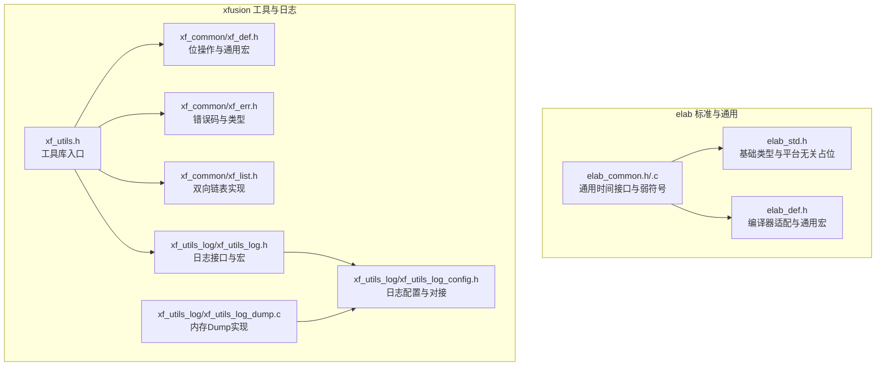
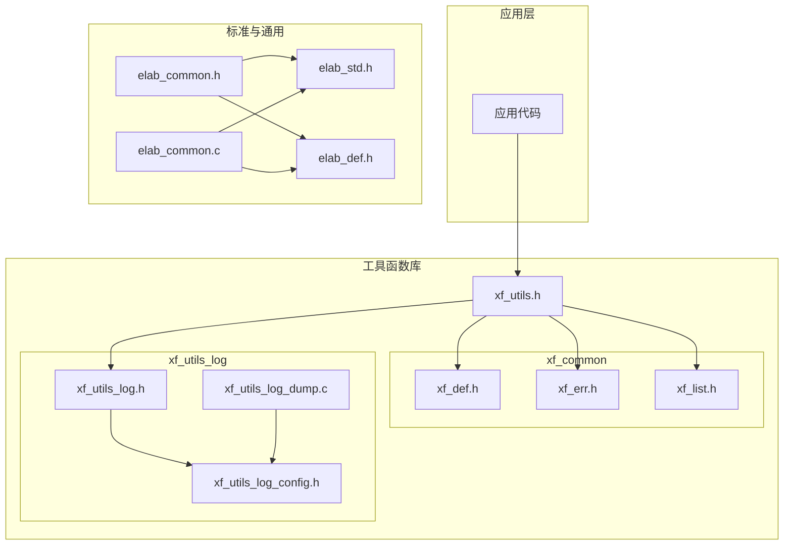
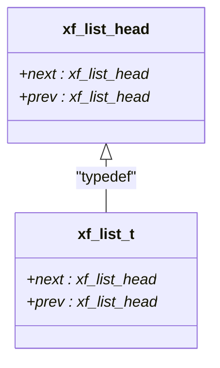
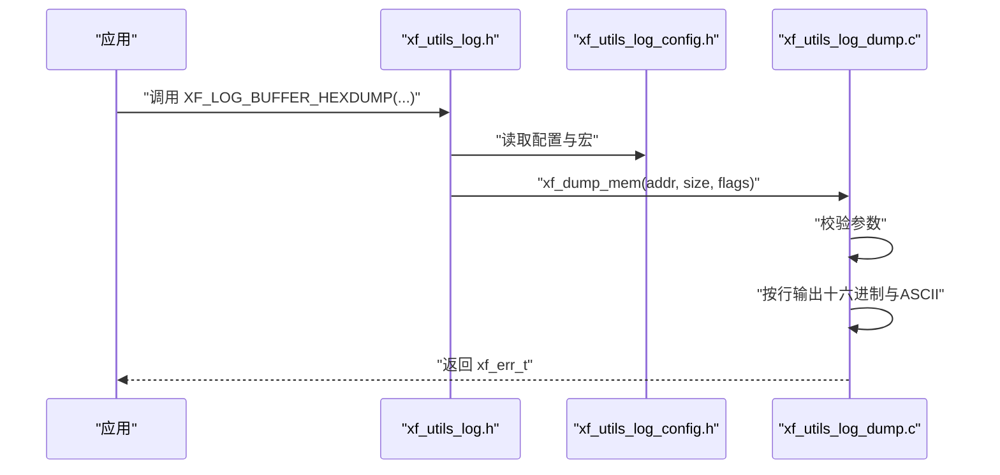
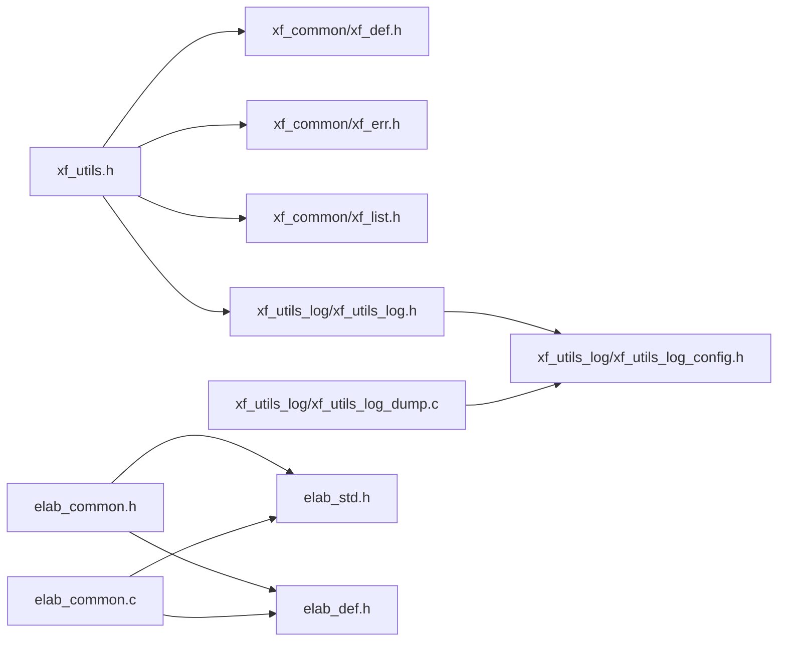

# 工具函数库

<cite>
**本文引用的文件**
- [elab_std.h](file://SRC/3rd/common/elab_std.h)
- [elab_def.h](file://SRC/3rd/common/elab_def.h)
- [elab_common.h](file://SRC/3rd/common/elab_common.h)
- [elab_common.c](file://SRC/3rd/common/elab_common.c)
- [xf_utils.h](file://SRC/3rd/xfusion/xUtils.h)
- [xf_common/xf_def.h](file://SRC/3rd/xfusion/xf_common/xf_def.h)
- [xf_common/xf_err.h](file://SRC/3rd/xfusion/xf_common/xf_err.h)
- [xf_common/xf_list.h](file://SRC/3rd/xfusion/xf_common/xf_list.h)
- [xf_utils_log/xf_utils_log.h](file://SRC/3rd/xfusion/xUtils_log/xf_utils_log.h)
- [xf_utils_log/xf_utils_log_config.h](file://SRC/3rd/xfusion/xUtils_log/xf_utils_log_config.h)
- [xf_utils_log/xf_utils_log_dump.c](file://SRC/3rd/xfusion/xUtils_log/xf_utils_log_dump.c)
</cite>

## 目录
1. [简介](#简介)
2. [项目结构](#项目结构)
3. [核心组件](#核心组件)
4. [架构总览](#架构总览)
5. [详细组件分析](#详细组件分析)
6. [依赖关系分析](#依赖关系分析)
7. [性能考量](#性能考量)
8. [故障排查指南](#故障排查指南)
9. [结论](#结论)
10. [附录](#附录)

## 简介
本文件为通用开关器项目工具函数库的使用与参考手册，重点覆盖以下方面：
- xf_utils.h 提供的通用工具函数集合入口与日志内存 Dump 能力
- elab_std.h 标准头文件提供的基础类型、常用宏与平台无关工具函数占位
- elab_def.h 中的通用定义与编译器适配宏
- xf_common 子模块中的位操作宏、链表实现与错误码体系
- xf_utils_log 子模块中的内存 Dump 日志接口与可配置项

文档同时给出使用示例、参数说明、返回值处理、跨平台兼容性说明、性能考虑与最佳实践，帮助开发者快速集成与高效使用。

## 项目结构
工具函数库主要分布在以下路径：
- elab 标准与通用层：SRC/3rd/common
- xfusion 工具与日志：SRC/3rd/x fusion
- xfusion 子模块：SRC/3rd/x fusion/xf_common 与 SRC/3rd/x fusion/xUtils_log

**图表来源**
- [elab_std.h:1-40](file://SRC/3rd/common/elab_std.h#L1-L40)
- [elab_def.h:1-49](file://SRC/3rd/common/elab_def.h#L1-L49)
- [elab_common.h:1-36](file://SRC/3rd/common/elab_common.h#L1-L36)
- [elab_common.c:1-41](file://SRC/3rd/common/elab_common.c#L1-L41)
- [xf_utils.h:1-19](file://SRC/3rd/xfusion/xUtils.h#L1-L19)
- [xf_common/xf_def.h:1-487](file://SRC/3rd/xfusion/xf_common/xf_def.h#L1-L487)
- [xf_common/xf_err.h:1-69](file://SRC/3rd/xfusion/xf_common/xf_err.h#L1-L69)
- [xf_common/xf_list.h:1-820](file://SRC/3rd/xfusion/xf_common/xf_list.h#L1-L820)
- [xf_utils_log/xf_utils_log.h:1-86](file://SRC/3rd/xfusion/xUtils_log/xf_utils_log.h#L1-L86)
- [xf_utils_log/xf_utils_log_config.h:1-62](file://SRC/3rd/xfusion/xUtils_log/xf_utils_log_config.h#L1-L62)
- [xf_utils_log/xf_utils_log_dump.c:1-161](file://SRC/3rd/xfusion/xUtils_log/xf_utils_log_dump.c#L1-L161)

**章节来源**
- [elab_std.h:1-40](file://SRC/3rd/common/elab_std.h#L1-L40)
- [elab_def.h:1-49](file://SRC/3rd/common/elab_def.h#L1-L49)
- [elab_common.h:1-36](file://SRC/3rd/common/elab_common.h#L1-L36)
- [elab_common.c:1-41](file://SRC/3rd/common/elab_common.c#L1-L41)
- [xf_utils.h:1-19](file://SRC/3rd/xfusion/xUtils.h#L1-L19)
- [xf_common/xf_def.h:1-487](file://SRC/3rd/xfusion/xf_common/xf_def.h#L1-L487)
- [xf_common/xf_err.h:1-69](file://SRC/3rd/xfusion/xf_common/xf_err.h#L1-L69)
- [xf_common/xf_list.h:1-820](file://SRC/3rd/xfusion/xf_common/xf_list.h#L1-L820)
- [xf_utils_log/xf_utils_log.h:1-86](file://SRC/3rd/xfusion/xUtils_log/xf_utils_log.h#L1-L86)
- [xf_utils_log/xf_utils_log_config.h:1-62](file://SRC/3rd/xfusion/xUtils_log/xf_utils_log_config.h#L1-L62)
- [xf_utils_log/xf_utils_log_dump.c:1-161](file://SRC/3rd/xfusion/xUtils_log/xf_utils_log_dump.c#L1-L161)

## 核心组件
- elab_std.h：提供基础类型与平台无关的占位声明，便于统一包含与扩展。
- elab_def.h：根据编译器自动选择弱符号宏，确保跨平台一致性。
- elab_common：提供通用时间接口的弱符号实现，可在目标平台重写。
- xf_utils.h：工具库入口，聚合 xf_common 与 xf_utils_log。
- xf_common/xf_def.h：提供位操作宏族、容器与偏移宏、数组大小宏等。
- xf_common/xf_err.h：定义统一错误码与错误类型，便于跨模块一致处理。
- xf_common/xf_list.h：实现无 GNU 特性的双向链表，提供安全遍历与拼接能力。
- xf_utils_log：提供内存 Dump 日志接口与可配置项，支持多种输出模式。

**章节来源**
- [elab_std.h:1-40](file://SRC/3rd/common/elab_std.h#L1-L40)
- [elab_def.h:1-49](file://SRC/3rd/common/elab_def.h#L1-L49)
- [elab_common.h:28-28](file://SRC/3rd/common/elab_common.h#L28-L28)
- [elab_common.c:27-40](file://SRC/3rd/common/elab_common.c#L27-L40)
- [xf_utils.h:12-18](file://SRC/3rd/xfusion/xUtils.h#L12-L18)
- [xf_common/xf_def.h:48-487](file://SRC/3rd/xfusion/xf_common/xf_def.h#L48-L487)
- [xf_common/xf_err.h:30-58](file://SRC/3rd/xfusion/xf_common/xf_err.h#L30-L58)
- [xf_common/xf_list.h:56-820](file://SRC/3rd/xfusion/xf_common/xf_list.h#L56-L820)
- [xf_utils_log/xf_utils_log.h:26-86](file://SRC/3rd/xfusion/xUtils_log/xf_utils_log.h#L26-L86)
- [xf_utils_log/xf_utils_log_config.h:26-62](file://SRC/3rd/xfusion/xUtils_log/xf_utils_log_config.h#L26-L62)
- [xf_utils_log/xf_utils_log_dump.c:40-155](file://SRC/3rd/xfusion/xUtils_log/xf_utils_log_dump.c#L40-L155)

## 架构总览
工具函数库采用分层设计：
- 标准与通用层：elab_std.h、elab_def.h、elab_common.* 提供平台无关与通用能力
- 工具与日志层：xf_utils.h 聚合 xf_common 与 xf_utils_log，形成统一入口
- xf_common：提供位操作、链表、错误码等基础设施
- xf_utils_log：提供内存 Dump 日志能力，支持可配置输出格式

**图表来源**
- [xf_utils.h:12-18](file://SRC/3rd/xfusion/xUtils.h#L12-L18)
- [xf_common/xf_def.h:1-487](file://SRC/3rd/xfusion/xf_common/xf_def.h#L1-L487)
- [xf_common/xf_err.h:1-69](file://SRC/3rd/xfusion/xf_common/xf_err.h#L1-L69)
- [xf_common/xf_list.h:1-820](file://SRC/3rd/xfusion/xf_common/xf_list.h#L1-L820)
- [xf_utils_log/xf_utils_log.h:1-86](file://SRC/3rd/xfusion/xUtils_log/xf_utils_log.h#L1-L86)
- [xf_utils_log/xf_utils_log_config.h:1-62](file://SRC/3rd/xfusion/xUtils_log/xf_utils_log_config.h#L1-L62)
- [xf_utils_log/xf_utils_log_dump.c:1-161](file://SRC/3rd/xfusion/xUtils_log/xf_utils_log_dump.c#L1-L161)
- [elab_common.h:17-18](file://SRC/3rd/common/elab_common.h#L17-L18)
- [elab_common.c:11-11](file://SRC/3rd/common/elab_common.c#L11-L11)

## 详细组件分析

### 组件 A：位操作与通用宏（xf_common/xf_def.h）
- 功能要点
  - 提供分支预测宏（likely/unlikely），在 GCC 下启用内置优化
  - 提供数组大小宏（ARRAY_SIZE）、未使用变量宏（UNUSED）、拼接宏（CONCAT/CONCAT3）
  - 提供结构体成员偏移与容器反推宏（offsetof/container_of）
  - 提供 32/64 位位操作宏族（BIT_SET0/BIT_SET1/BIT_FLIP/BIT_GET 等）
  - 提供多比特段读取与修改宏（BITS_GET/BITS_SET/BITS_GET_MODIFY 等）
  - 提供掩码与批量位操作宏（BITS_MASK/BITS_SET0/BITS_SET1/BITS_FLIP/BITS_CHECK）

- 使用示例与注意事项
  - 位操作宏族适用于寄存器或结构体字段的快速读写，注意位宽与偏移范围
  - container_of 与 offsetof 用于链表节点与结构体之间的互转，需确保成员对齐
  - 分支预测宏仅在 GCC 下生效，其他编译器将退化为普通条件表达式

- 性能与最佳实践
  - 优先使用位段宏族进行批量位操作，减少多次位运算
  - 在高频路径中谨慎使用 container_of，确保编译器能常量化偏移

**章节来源**
- [xf_common/xf_def.h:25-42](file://SRC/3rd/xfusion/xf_common/xf_def.h#L25-L42)
- [xf_common/xf_def.h:48-129](file://SRC/3rd/xfusion/xf_common/xf_def.h#L48-L129)
- [xf_common/xf_def.h:131-199](file://SRC/3rd/xfusion/xf_common/xf_def.h#L131-L199)
- [xf_common/xf_def.h:208-218](file://SRC/3rd/xfusion/xf_common/xf_def.h#L208-L218)
- [xf_common/xf_def.h:223-274](file://SRC/3rd/xfusion/xf_common/xf_def.h#L223-L274)
- [xf_common/xf_def.h:276-324](file://SRC/3rd/xfusion/xf_common/xf_def.h#L276-L324)
- [xf_common/xf_def.h:329-484](file://SRC/3rd/xfusion/xf_common/xf_def.h#L329-L484)

### 组件 B：双向链表（xf_common/xf_list.h）
- 功能要点
  - 实现无 GNU 特性的双向链表，提供静态与动态初始化
  - 支持在头部/尾部插入、删除、移动、拼接等操作
  - 提供安全遍历宏族（xf_list_for_each_entry_safe 系列），避免删除节点导致的迭代问题
  - 提供容器反推宏 xf_container_of 与 xf_list_entry

- 使用示例与注意事项
  - 链表节点结构需包含 xf_list_t 成员，通常命名为 list_struct
  - 使用安全遍历宏时，务必遵循宏参数类型与命名约定
  - 删除节点后，旧节点状态变为未定义，建议配合 xf_list_del_init 重置

- 性能与最佳实践
  - 插入/删除为 O(1)，适合频繁变更的场景
  - 遍历时尽量使用安全宏，避免悬挂指针与重复遍历

**图表来源**
- [xf_common/xf_list.h:56-59](file://SRC/3rd/xfusion/xf_common/xf_list.h#L56-L59)

**章节来源**
- [xf_common/xf_list.h:89-210](file://SRC/3rd/xfusion/xf_common/xf_list.h#L89-L210)
- [xf_common/xf_list.h:228-246](file://SRC/3rd/xfusion/xf_common/xf_list.h#L228-L246)
- [xf_common/xf_list.h:258-262](file://SRC/3rd/xfusion/xf_common/xf_list.h#L258-L262)
- [xf_common/xf_list.h:579-581](file://SRC/3rd/xfusion/xf_common/xf_list.h#L579-L581)
- [xf_common/xf_list.h:604-652](file://SRC/3rd/xfusion/xf_common/xf_list.h#L604-L652)
- [xf_common/xf_list.h:671-785](file://SRC/3rd/xfusion/xf_common/xf_list.h#L671-L785)

### 组件 C：错误码与类型（xf_common/xf_err.h）
- 功能要点
  - 定义统一错误码枚举（如 XF_OK/XF_FAIL/XF_ERR_INVALID_ARG 等）
  - 定义错误类型 xf_err_t 为 32 位整型，便于跨模块传递与比较

- 使用示例与注意事项
  - 函数返回值应使用 xf_err_t 类型，非 0 视为错误
  - 错误码值用于对比与诊断，不建议直接依赖具体数值

- 性能与最佳实践
  - 错误码为轻量级整型，开销极小
  - 建议在关键路径中尽早检查并短路返回，避免深层嵌套

**章节来源**
- [xf_common/xf_err.h:30-58](file://SRC/3rd/xfusion/xf_common/xf_err.h#L30-L58)

### 组件 D：内存 Dump 日志（xf_utils_log）
- 功能要点
  - 提供 xf_dump_mem 接口，按行输出内存十六进制与 ASCII，支持转义字符显示
  - 通过配置宏控制输出格式（仅十六进制、十六进制+ASCII、十六进制+ASCII+转义）
  - 提供 XF_LOG_BUFFER_* 宏简化调用

- 使用示例与注意事项
  - 调用前需确保 xf_log_printf 与 xf_log_dump_printf 已对接到平台打印函数
  - 地址与长度必须有效，否则返回参数错误
  - 可通过 XF_LOG_DUMP_IS_ENABLE 控制是否启用 Dump 能力

- 性能与最佳实践
  - Dump 为调试用途，避免在生产路径频繁调用
  - 大块内存输出会带来 IO 压力，建议分批输出或按需开启

**图表来源**
- [xf_utils_log/xf_utils_log.h:50-86](file://SRC/3rd/xfusion/xUtils_log/xf_utils_log.h#L50-L86)
- [xf_utils_log/xf_utils_log_config.h:26-62](file://SRC/3rd/xfusion/xUtils_log/xf_utils_log_config.h#L26-L62)
- [xf_utils_log/xf_utils_log_dump.c:40-155](file://SRC/3rd/xfusion/xUtils_log/xf_utils_log_dump.c#L40-L155)

**章节来源**
- [xf_utils_log/xf_utils_log.h:26-86](file://SRC/3rd/xfusion/xUtils_log/xf_utils_log.h#L26-L86)
- [xf_utils_log/xf_utils_log_config.h:26-62](file://SRC/3rd/xfusion/xUtils_log/xf_utils_log_config.h#L26-L62)
- [xf_utils_log/xf_utils_log_dump.c:40-155](file://SRC/3rd/xfusion/xUtils_log/xf_utils_log_dump.c#L40-L155)

### 组件 E：通用时间接口（elab_common.*）
- 功能要点
  - 提供弱符号函数 elab_time_ms，可在不同平台或 RTOS 环境下重写
  - Windows/STM32/Linux 等环境通过条件编译适配

- 使用示例与注意事项
  - 若未重写，返回固定值；在 RTOS 环境下可结合系统 tick 使用
  - 条件编译宏由 elab_def.h 的编译器检测决定

- 性能与最佳实践
  - 时间接口应尽量使用系统提供的高精度计时源
  - 避免在中断上下文中进行复杂的时间计算

**章节来源**
- [elab_common.h:28-28](file://SRC/3rd/common/elab_common.h#L28-L28)
- [elab_common.c:27-40](file://SRC/3rd/common/elab_common.c#L27-L40)
- [elab_def.h:24-36](file://SRC/3rd/common/elab_def.h#L24-L36)

## 依赖关系分析
- xf_utils.h 依赖 xf_common 与 xf_utils_log 的头文件
- xf_utils_log 依赖 xf_utils_log_config.h 与 xf_common 的错误码与通用宏
- elab_common 依赖 elab_std.h 与 elab_def.h，提供弱符号时间接口

**图表来源**
- [xf_utils.h:14-17](file://SRC/3rd/xfusion/xUtils.h#L14-L17)
- [xf_utils_log/xf_utils_log.h:17-17](file://SRC/3rd/xfusion/xUtils_log/xf_utils_log.h#L17-L17)
- [xf_utils_log/xf_utils_log_config.h:16-18](file://SRC/3rd/xfusion/xUtils_log/xf_utils_log_config.h#L16-L18)
- [elab_common.h:17-18](file://SRC/3rd/common/elab_common.h#L17-L18)
- [elab_common.c:11-11](file://SRC/3rd/common/elab_common.c#L11-L11)

**章节来源**
- [xf_utils.h:14-17](file://SRC/3rd/xfusion/xUtils.h#L14-L17)
- [xf_utils_log/xf_utils_log.h:17-17](file://SRC/3rd/xfusion/xUtils_log/xf_utils_log.h#L17-L17)
- [xf_utils_log/xf_utils_log_config.h:16-18](file://SRC/3rd/xfusion/xUtils_log/xf_utils_log_config.h#L16-L18)
- [elab_common.h:17-18](file://SRC/3rd/common/elab_common.h#L17-L18)
- [elab_common.c:11-11](file://SRC/3rd/common/elab_common.c#L11-L11)

## 性能考量
- 位操作宏族为纯编译期/常量折叠，运行时开销极低
- 链表操作为 O(1)，但频繁分配/释放节点会引入内存碎片，建议复用节点池
- 内存 Dump 为调试用途，大块输出会产生显著 IO 压力，建议按需启用与分批输出
- 弱符号时间接口应结合系统 tick 使用，避免额外计算

[本节为通用性能讨论，无需特定文件来源]

## 故障排查指南
- 内存 Dump 返回参数错误
  - 检查地址与长度是否有效，确认 xf_log_printf 已正确对接
  - 参考：[xf_utils_log_dump.c:42-45](file://SRC/3rd/xfusion/xUtils_log/xf_utils_log_dump.c#L42-L45)
- 链表遍历异常或崩溃
  - 确认使用了安全遍历宏，避免在遍历过程中删除未重置的节点
  - 参考：[xf_common/xf_list.h:671-785](file://SRC/3rd/xfusion/xf_common/xf_list.h#L671-L785)
- 编译器不支持
  - 确认编译器在 elab_def.h 中的分支覆盖，否则会触发编译错误
  - 参考：[elab_def.h:24-36](file://SRC/3rd/common/elab_def.h#L24-L36)
- 时间接口未生效
  - 检查是否重写了 elab_time_ms，或 RTOS 条件编译是否正确
  - 参考：[elab_common.c:29-39](file://SRC/3rd/common/elab_common.c#L29-L39)

**章节来源**
- [xf_utils_log/xf_utils_log_dump.c:42-45](file://SRC/3rd/xfusion/xUtils_log/xf_utils_log_dump.c#L42-L45)
- [xf_common/xf_list.h:671-785](file://SRC/3rd/xfusion/xf_common/xf_list.h#L671-L785)
- [elab_def.h:24-36](file://SRC/3rd/common/elab_def.h#L24-L36)
- [elab_common.c:29-39](file://SRC/3rd/common/elab_common.c#L29-L39)

## 结论
本工具函数库通过 elab 与 xfusion 两层设计，提供了跨平台的基础类型、位操作、链表与日志能力。开发者可基于 xf_utils.h 快速集成所需功能，并通过配置项灵活控制日志输出与编译器适配。建议在生产环境中谨慎使用内存 Dump，优先采用安全遍历宏与位段宏族提升性能与稳定性。

[本节为总结性内容，无需特定文件来源]

## 附录
- 集成步骤
  - 在工程中包含 xf_utils.h 即可获取位操作、链表与日志能力
  - 如需内存 Dump，确保 xf_utils_log_config.h 中的打印对接已配置
  - 如需自定义时间源，重写 elab_time_ms 并在链接阶段覆盖弱符号
- 关键宏与接口清单
  - 位操作：BIT_SET0/BIT_SET1/BIT_FLIP/BIT_GET 等
  - 链表：xf_list_add/xf_list_del/xf_list_for_each_entry_safe 等
  - 日志：XF_LOG_BUFFER_HEXDUMP/XF_LOG_BUFFER_HEXDUMP_ESCAPE 等
  - 错误码：XF_OK/XF_FAIL/XF_ERR_INVALID_ARG 等

[本节为概览性内容，无需特定文件来源]