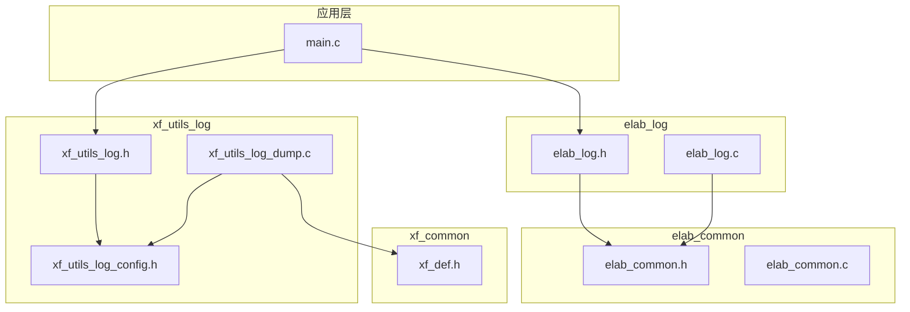
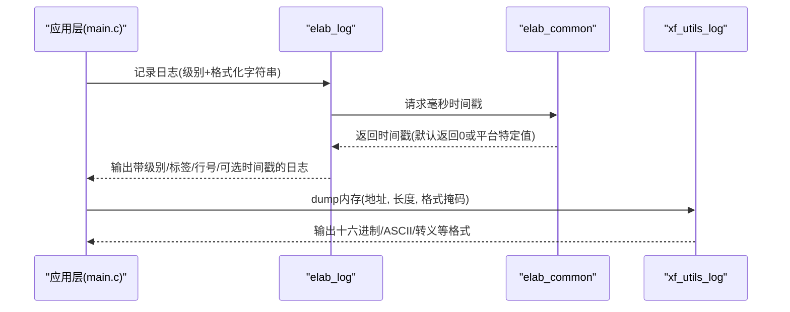
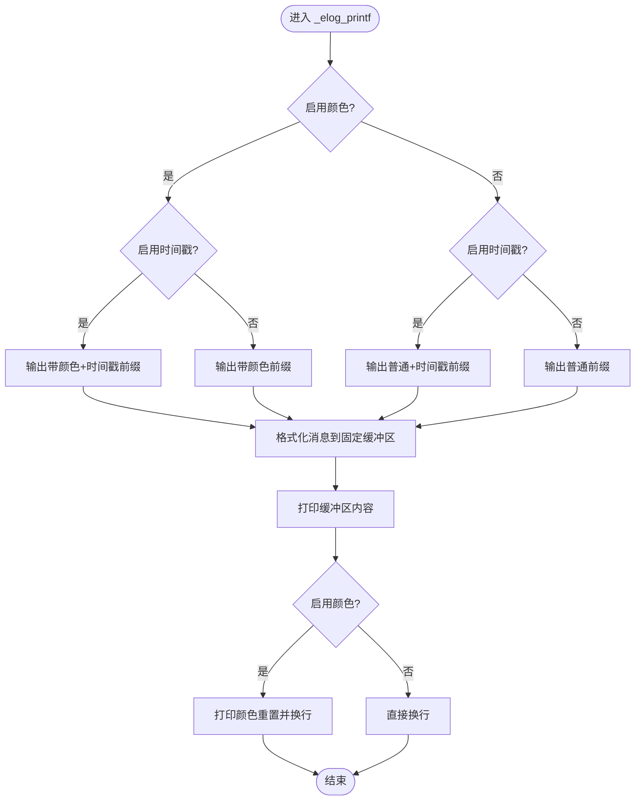
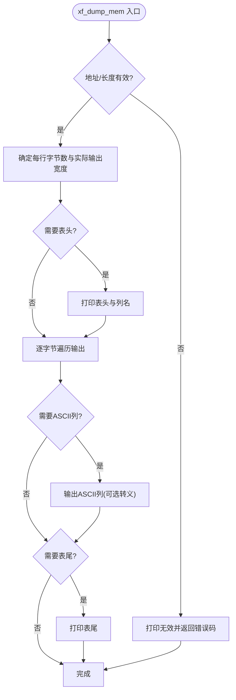
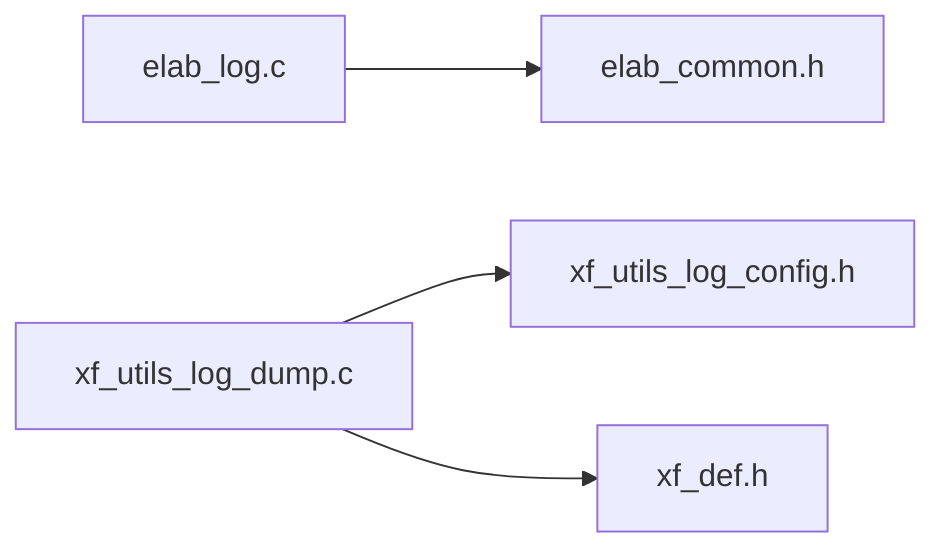

# 日志系统

<cite>
**本文引用的文件**
- [elab_common.h](file://SRC/3rd/common/elab_common.h)
- [elab_common.c](file://SRC/3rd/common/elab_common.c)
- [elab_log.h](file://SRC/3rd/common/elab_log.h)
- [elab_log.c](file://SRC/3rd/common/elab_log.c)
- [xf_utils_log.h](file://SRC/3rd/xfusion/xf_utils_log/xf_utils_log.h)
- [xf_utils_log_config.h](file://SRC/3rd/xfusion/xf_utils_log/xf_utils_log_config.h)
- [xf_utils_log_dump.c](file://SRC/3rd/xfusion/xf_utils_log/xf_utils_log_dump.c)
- [xf_def.h](file://SRC/3rd/xfusion/xf_common/xf_def.h)
- [main.c](file://SRC/APP/main.c)
</cite>

## 目录
1. [简介](#简介)
2. [项目结构](#项目结构)
3. [核心组件](#核心组件)
4. [架构总览](#架构总览)
5. [组件详解](#组件详解)
6. [依赖关系分析](#依赖关系分析)
7. [性能与缓冲区管理](#性能与缓冲区管理)
8. [初始化与使用示例](#初始化与使用示例)
9. [调试与排障指南](#调试与排障指南)
10. [结论](#结论)

## 简介
本文件面向通用开关器项目的日志系统，系统性梳理并讲解以下内容：
- elab_common 时间戳接口：elab_time_ms 的能力边界与默认实现
- elab_log 日志框架：日志级别、输出格式、颜色与时间戳控制、缓冲区与性能要点
- xf_utils_log 工具库：dump 功能、数据转储格式与可选转义输出
- 实际使用示例与最佳实践：初始化、级别设置、输出重定向、性能监控与排障

## 项目结构
日志相关代码主要分布在“common”和“xfusion”两个第三方模块中，并在应用层通过打印接口进行调用。

图示来源
- [main.c:433-494](file://SRC/APP/main.c#L433-L494)
- [elab_common.h:28](file://SRC/3rd/common/elab_common.h#L28)
- [elab_log.h:28](file://SRC/3rd/common/elab_log.h#L28)
- [elab_log.c:54-81](file://SRC/3rd/common/elab_log.c#L54-L81)
- [xf_utils_log.h:50-80](file://SRC/3rd/xfusion/xf_utils_log/xf_utils_log.h#L50-L80)
- [xf_utils_log_config.h:39-46](file://SRC/3rd/xfusion/xf_utils_log/xf_utils_log_config.h#L39-L46)
- [xf_utils_log_dump.c:40-155](file://SRC/3rd/xfusion/xf_utils_log/xf_utils_log_dump.c#L40-L155)
- [xf_def.h:16-20](file://SRC/3rd/xfusion/xf_common/xf_def.h#L16-L20)

章节来源
- [main.c:433-494](file://SRC/APP/main.c#L433-L494)
- [elab_common.h:28](file://SRC/3rd/common/elab_common.h#L28)
- [elab_log.h:28](file://SRC/3rd/common/elab_log.h#L28)
- [elab_log.c:54-81](file://SRC/3rd/common/elab_log.c#L54-L81)
- [xf_utils_log.h:50-80](file://SRC/3rd/xfusion/xf_utils_log/xf_utils_log.h#L50-L80)
- [xf_utils_log_config.h:39-46](file://SRC/3rd/xfusion/xf_utils_log/xf_utils_log_config.h#L39-L46)
- [xf_utils_log_dump.c:40-155](file://SRC/3rd/xfusion/xf_utils_log/xf_utils_log_dump.c#L40-L155)
- [xf_def.h:16-20](file://SRC/3rd/xfusion/xf_common/xf_def.h#L16-L20)

## 核心组件
- elab_common：提供时间戳接口 elab_time_ms，作为日志时间戳来源；默认实现为空实现，需在目标平台补充
- elab_log：轻量级日志框架，支持错误/警告/信息/调试四级别，可选颜色输出与时间戳输出，内部使用固定大小缓冲区
- xf_utils_log：提供内存 dump 工具，支持十六进制、ASCII、转义字符等多格式输出，可按位掩码控制输出风格

章节来源
- [elab_common.c:27-40](file://SRC/3rd/common/elab_common.c#L27-L40)
- [elab_log.h:34-82](file://SRC/3rd/common/elab_log.h#L34-L82)
- [elab_log.c:17-81](file://SRC/3rd/common/elab_log.c#L17-L81)
- [xf_utils_log.h:26-80](file://SRC/3rd/xfusion/xf_utils_log/xf_utils_log.h#L26-L80)
- [xf_utils_log_dump.c:40-155](file://SRC/3rd/xfusion/xf_utils_log/xf_utils_log_dump.c#L40-L155)

## 架构总览
日志系统由“应用层调用”“日志框架”“工具库”三层组成，elab_log 依赖 elab_common 提供时间戳，xf_utils_log 依赖 xf_common 提供平台相关常量与宏。

图示来源
- [main.c:433-494](file://SRC/APP/main.c#L433-L494)
- [elab_log.c:54-81](file://SRC/3rd/common/elab_log.c#L54-L81)
- [elab_common.c:27-40](file://SRC/3rd/common/elab_common.c#L27-L40)
- [xf_utils_log_dump.c:40-155](file://SRC/3rd/xfusion/xf_utils_log/xf_utils_log_dump.c#L40-L155)

## 组件详解

### elab_common：时间戳接口
- 能力：提供 elab_time_ms() 获取毫秒级时间戳
- 实现：默认为空实现（弱符号），在非 Linux 平台下根据 RTOS/CMSIS 宏选择启用；可在目标平台实现以启用时间戳输出
- 注意：若未实现，elab_log 的时间戳输出将不可用或无效

章节来源
- [elab_common.h:28](file://SRC/3rd/common/elab_common.h#L28)
- [elab_common.c:27-40](file://SRC/3rd/common/elab_common.c#L27-L40)

### elab_log：日志框架
- 日志级别：错误、警告、信息、调试四档，通过宏在编译期裁剪
- 输出格式：可选颜色、可选时间戳、包含标签与行号
- 缓冲区：固定大小缓冲区用于格式化消息，防止过长消息导致溢出
- 性能要点：条件编译裁剪低级别日志；颜色与时间戳输出会增加开销

图示来源
- [elab_log.c:54-81](file://SRC/3rd/common/elab_log.c#L54-L81)

章节来源
- [elab_log.h:34-82](file://SRC/3rd/common/elab_log.h#L34-L82)
- [elab_log.c:17-81](file://SRC/3rd/common/elab_log.c#L17-L81)

### xf_utils_log：内存 dump 工具
- 功能：将任意内存块以十六进制、ASCII、转义字符等方式输出
- 格式掩码：表头/表尾、ASCII、转义、仅十六进制等组合
- 输出细节：每行固定字节数，支持偏移、地址、ASCII 列与可选转义字符展示
- 平台常量：使用 xf_def.h 提供的换行符常量保证跨平台一致性

图示来源
- [xf_utils_log_dump.c:40-155](file://SRC/3rd/xfusion/xf_utils_log/xf_utils_log_dump.c#L40-L155)
- [xf_utils_log.h:26-80](file://SRC/3rd/xfusion/xf_utils_log/xf_utils_log.h#L26-L80)
- [xf_utils_log_config.h:39-46](file://SRC/3rd/xfusion/xf_utils_log/xf_utils_log_config.h#L39-L46)
- [xf_def.h:16-20](file://SRC/3rd/xfusion/xf_common/xf_def.h#L16-L20)

章节来源
- [xf_utils_log.h:26-80](file://SRC/3rd/xfusion/xf_utils_log/xf_utils_log.h#L26-L80)
- [xf_utils_log_config.h:39-46](file://SRC/3rd/xfusion/xf_utils_log/xf_utils_log_config.h#L39-L46)
- [xf_utils_log_dump.c:40-155](file://SRC/3rd/xfusion/xf_utils_log/xf_utils_log_dump.c#L40-L155)
- [xf_def.h:16-20](file://SRC/3rd/xfusion/xf_common/xf_def.h#L16-L20)

## 依赖关系分析
- elab_log 依赖 elab_common 提供时间戳
- xf_utils_log 依赖 xf_utils_log_config.h 定义打印后端与开关
- xf_utils_log_dump.c 依赖 xf_def.h 的换行符常量

图示来源
- [elab_log.c:12-14](file://SRC/3rd/common/elab_log.c#L12-L14)
- [elab_common.h:17-18](file://SRC/3rd/common/elab_common.h#L17-L18)
- [xf_utils_log_dump.c:14-17](file://SRC/3rd/xfusion/xf_utils_log/xf_utils_log_dump.c#L14-L17)
- [xf_utils_log_config.h:16-18](file://SRC/3rd/xfusion/xf_utils_log/xf_utils_log_config.h#L16-L18)
- [xf_def.h:16-20](file://SRC/3rd/xfusion/xf_common/xf_def.h#L16-L20)

章节来源
- [elab_log.c:12-14](file://SRC/3rd/common/elab_log.c#L12-L14)
- [elab_common.h:17-18](file://SRC/3rd/common/elab_common.h#L17-L18)
- [xf_utils_log_dump.c:14-17](file://SRC/3rd/xfusion/xf_utils_log/xf_utils_log_dump.c#L14-L17)
- [xf_utils_log_config.h:16-18](file://SRC/3rd/xfusion/xf_utils_log/xf_utils_log_config.h#L16-L18)
- [xf_def.h:16-20](file://SRC/3rd/xfusion/xf_common/xf_def.h#L16-L20)

## 性能与缓冲区管理
- 固定缓冲区：elab_log 使用固定大小缓冲区存放格式化后的日志内容，避免动态分配与堆碎片，但需确保格式化字符串长度不超过缓冲区上限
- 条件编译：通过日志级别裁剪低级别日志，减少分支判断与字符串拼接成本
- 颜色与时间戳：启用颜色与时间戳会增加额外的字符串拼接与 I/O 操作，建议在发布版本关闭颜色并在不需要时关闭时间戳
- dump 输出：xf_utils_log_dump 的输出受格式掩码影响，ASCII 与转义会增加额外处理与输出长度，建议仅在调试阶段启用

章节来源
- [elab_log.c:24](file://SRC/3rd/common/elab_log.c#L24)
- [elab_log.h:30-32](file://SRC/3rd/common/elab_log.h#L30-L32)
- [elab_log.c:54-81](file://SRC/3rd/common/elab_log.c#L54-L81)
- [xf_utils_log_dump.c:40-155](file://SRC/3rd/xfusion/xf_utils_log/xf_utils_log_dump.c#L40-L155)

## 初始化与使用示例

### 初始化与配置
- 日志级别：通过定义当前级别宏控制日志输出范围（例如在构建配置中设置当前级别）
- 颜色与时间戳：通过宏控制颜色与时间戳输出
- 时间戳实现：在目标平台实现 elab_time_ms，以便启用时间戳输出
- 打印后端：xf_utils_log_config.h 提供打印后端宏，可替换为自定义输出函数

章节来源
- [elab_log.h:25-32](file://SRC/3rd/common/elab_log.h#L25-L32)
- [elab_common.c:27-40](file://SRC/3rd/common/elab_common.c#L27-L40)
- [xf_utils_log_config.h:39-46](file://SRC/3rd/xfusion/xf_utils_log/xf_utils_log_config.h#L39-L46)

### 使用示例
- 应用层调用：在主循环与关键路径中使用日志接口输出运行状态、参数与错误信息
- dump 使用：在通信或数据处理环节对关键缓冲区进行十六进制/ASCII/转义输出，便于问题定位

章节来源
- [main.c:433-494](file://SRC/APP/main.c#L433-L494)
- [xf_utils_log.h:66-78](file://SRC/3rd/xfusion/xf_utils_log/xf_utils_log.h#L66-L78)

## 调试与排障指南

### 常见问题与排查
- 日志无时间戳：确认已实现并启用 elab_time_ms；检查时间戳宏开关
- 日志无颜色：确认颜色宏已启用；检查终端是否支持颜色输出
- 日志过多影响性能：降低日志级别或关闭颜色/时间戳；仅在调试阶段保留高冗余日志
- dump 输出异常：检查地址/长度参数；确认格式掩码组合正确；关注 ASCII 与转义输出差异
- 输出换行异常：确认平台换行符常量设置正确

章节来源
- [elab_log.c:54-81](file://SRC/3rd/common/elab_log.c#L54-L81)
- [xf_utils_log_dump.c:40-155](file://SRC/3rd/xfusion/xf_utils_log/xf_utils_log_dump.c#L40-L155)
- [xf_def.h:16-20](file://SRC/3rd/xfusion/xf_common/xf_def.h#L16-L20)

## 结论
本日志系统以轻量、可裁剪为核心设计原则：通过 elab_common 提供时间戳扩展点，通过 elab_log 提供简洁可控的日志输出，通过 xf_utils_log 提供强大的内存 dump 能力。结合合理的级别配置、输出开关与平台适配，可在资源受限的嵌入式环境中获得高效且易用的日志体验。