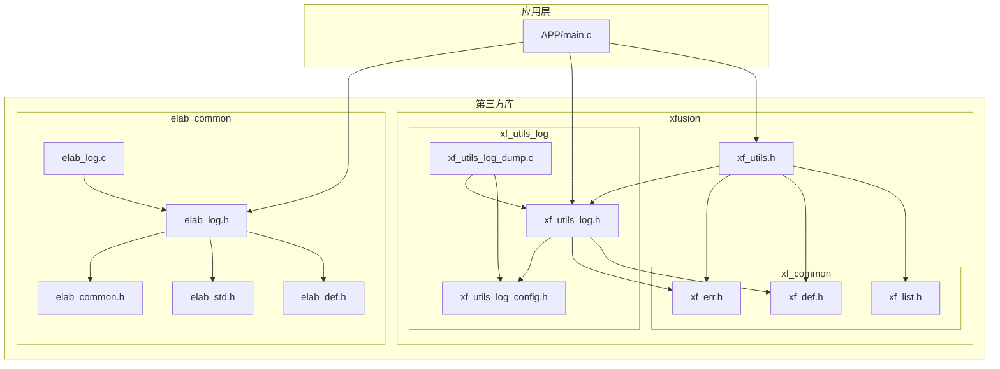
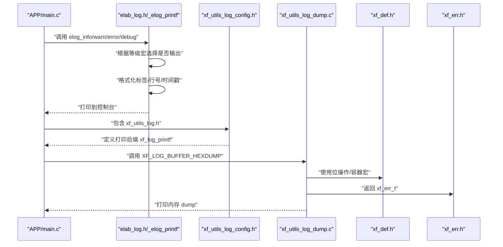
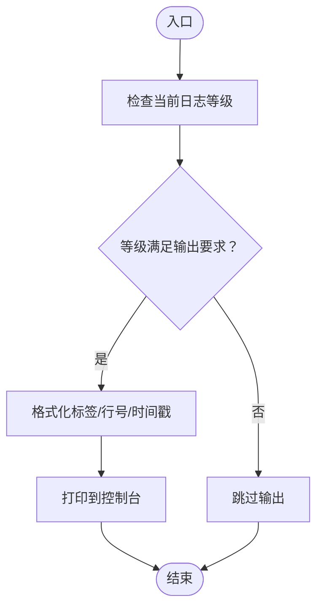
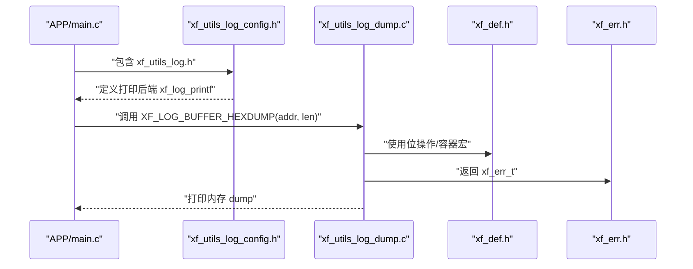
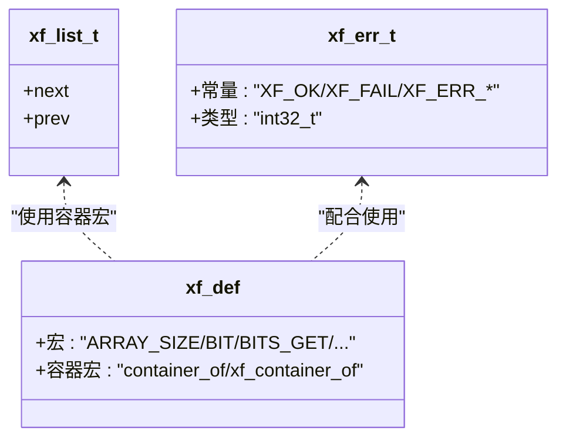
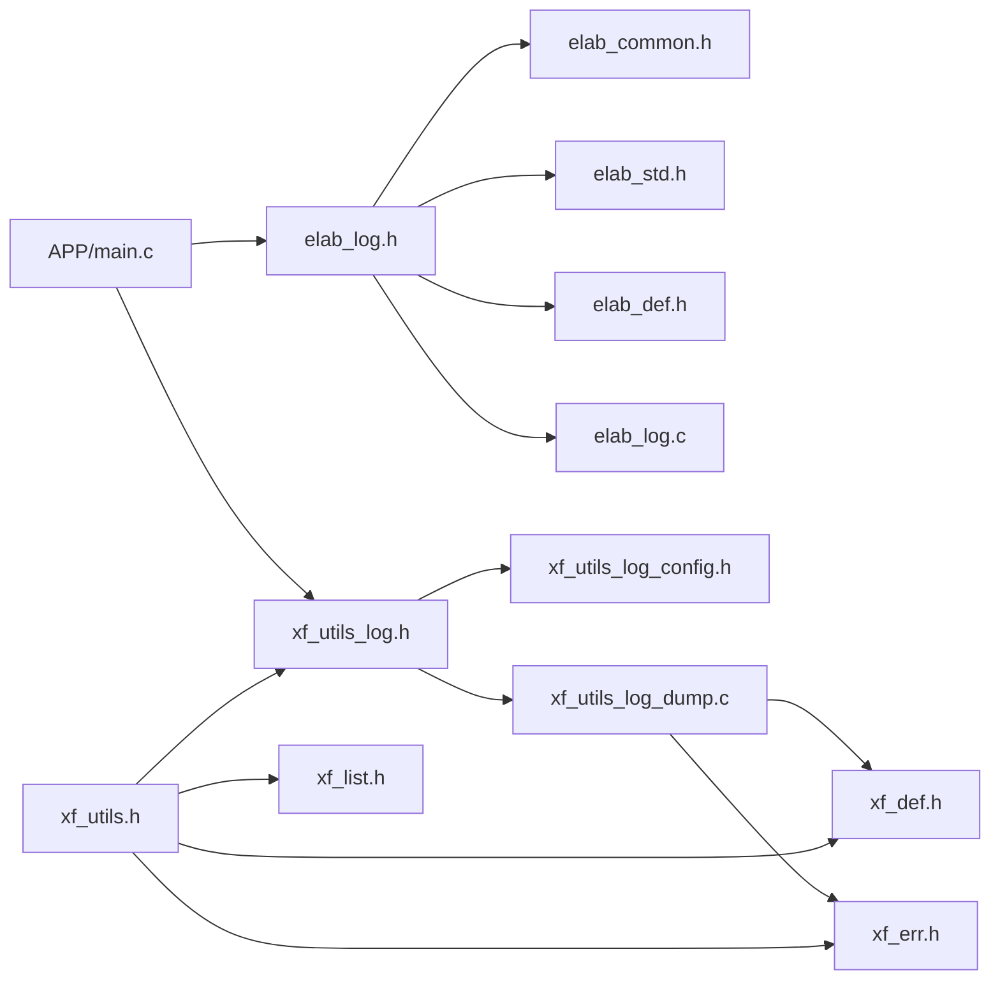

# 第三方库和工具

<cite>
**本文档引用的文件**
- [elab_common.h](file://SRC/3rd/common/elab_common.h)
- [elab_log.h](file://SRC/3rd/common/elab_log.h)
- [elab_log.c](file://SRC/3rd/common/elab_log.c)
- [elab_std.h](file://SRC/3rd/common/elab_std.h)
- [elab_def.h](file://SRC/3rd/common/elab_def.h)
- [xf_utils_log.h](file://SRC/3rd\xfusion\xf_utils_log\xf_utils_log.h)
- [xf_utils_log_config.h](file://SRC/3rd\xfusion\xf_utils_log\xf_utils_log_config.h)
- [xf_utils_log_dump.c](file://SRC/3rd\xfusion\xf_utils_log\xf_utils_log_dump.c)
- [xf_utils.h](file://SRC/3rd\xfusion\xf_utils.h)
- [xf_def.h](file://SRC/3rd\xfusion\xf_common\xf_def.h)
- [xf_err.h](file://SRC/3rd\xfusion\xf_common\xf_err.h)
- [xf_list.h](file://SRC/3rd\xfusion\xf_common\xf_list.h)
- [main.c](file://SRC/APP/main.c)
</cite>

## 目录
1. [简介](#简介)
2. [项目结构](#项目结构)
3. [核心组件](#核心组件)
4. [架构总览](#架构总览)
5. [详细组件分析](#详细组件分析)
6. [依赖关系分析](#依赖关系分析)
7. [性能考虑](#性能考虑)
8. [故障排查指南](#故障排查指南)
9. [结论](#结论)
10. [附录](#附录)

## 简介
本文件面向通用开关器项目的第三方库与工具使用，重点覆盖两类基础能力：
- 日志系统：elab_common 与 xf_utils_log 提供的轻量级日志与内存 dump 能力
- 工具函数库：xfusion 基础库（xf_def、xf_err、xf_list）与 xf_utils 汇总头文件

目标是帮助开发者快速理解第三方库的功能边界、配置项、使用方式、集成方法、版本兼容性以及扩展与二次开发的最佳实践。

## 项目结构
第三方库位于 SRC/3rd 目录，按“供应商+功能域”组织：
- elab_common：基础公共头文件与日志接口
- xfusion：供应商命名空间下的通用工具与日志扩展
  - xf_common：平台无关的基础宏、错误码、链表等
  - xf_utils_log：日志与内存 dump 能力
  - xf_utils：汇总头文件，统一引入常用工具

图表来源
- [elab_common.h:12-36](file://SRC/3rd/common/elab_common.h#L12-L36)
- [elab_log.h:13-83](file://SRC/3rd/common/elab_log.h#L13-L83)
- [elab_log.c:11-83](file://SRC/3rd/common/elab_log.c#L11-L83)
- [xf_utils_log.h:12-86](file://SRC/3rd\xfusion\xf_utils_log\xf_utils_log.h#L12-L86)
- [xf_utils_log_config.h:12-62](file://SRC/3rd\xfusion\xf_utils_log\xf_utils_log_config.h#L12-L62)
- [xf_utils_log_dump.c:12-161](file://SRC/3rd\xfusion\xf_utils_log\xf_utils_log_dump.c#L12-L161)
- [xf_utils.h:12-19](file://SRC/3rd\xfusion\xf_utils.h#L12-L19)
- [xf_def.h:12-487](file://SRC/3rd\xfusion\xf_common\xf_def.h#L12-L487)
- [xf_err.h:12-69](file://SRC/3rd\xfusion\xf_common\xf_err.h#L12-L69)
- [xf_list.h:30-820](file://SRC/3rd\xfusion\xf_common\xf_list.h#L30-L820)
- [main.c:433-494](file://SRC/APP/main.c#L433-L494)

章节来源
- [elab_common.h:12-36](file://SRC/3rd/common/elab_common.h#L12-L36)
- [xf_utils.h:12-19](file://SRC/3rd\xfusion\xf_utils.h#L12-L19)

## 核心组件
- 日志系统（elab_common）
  - 提供统一的日志接口与等级控制，支持彩色输出与时间戳可选
  - 通过预处理器宏控制不同等级日志的启用/禁用
- 内存 dump（xf_utils_log）
  - 提供内存块十六进制与 ASCII/转义字符混合输出
  - 通过配置宏控制是否启用 dump 能力与输出格式
- 工具函数库（xfusion）
  - xf_def：平台无关的宏、容器宏、位操作宏、数组大小等
  - xf_err：统一错误码类型与枚举
  - xf_list：跨平台的双向链表实现与遍历宏
  - xf_utils：汇总头文件，统一引入常用工具

章节来源
- [elab_log.h:24-83](file://SRC/3rd/common/elab_log.h#L24-L83)
- [elab_log.c:15-83](file://SRC/3rd/common/elab_log.c#L15-L83)
- [xf_utils_log.h:23-86](file://SRC/3rd\xfusion\xf_utils_log\xf_utils_log.h#L23-L86)
- [xf_utils_log_config.h:23-62](file://SRC/3rd\xfusion\xf_utils_log\xf_utils_log_config.h#L23-L62)
- [xf_utils_log_dump.c:21-161](file://SRC/3rd\xfusion\xf_utils_log\xf_utils_log_dump.c#L21-L161)
- [xf_def.h:48-487](file://SRC/3rd\xfusion\xf_common\xf_def.h#L48-L487)
- [xf_err.h:22-69](file://SRC/3rd\xfusion\xf_common\xf_err.h#L22-L69)
- [xf_list.h:51-820](file://SRC/3rd\xfusion\xf_common\xf_list.h#L51-L820)
- [xf_utils.h:12-19](file://SRC/3rd\xfusion\xf_utils.h#L12-L19)

## 架构总览
日志与工具库在应用层的集成路径如下：

图表来源
- [main.c:433-494](file://SRC/APP/main.c#L433-L494)
- [elab_log.h:44-83](file://SRC/3rd/common/elab_log.h#L44-L83)
- [elab_log.c:54-83](file://SRC/3rd/common/elab_log.c#L54-L83)
- [xf_utils_log.h:48-86](file://SRC/3rd\xfusion\xf_utils_log\xf_utils_log.h#L48-L86)
- [xf_utils_log_config.h:38-62](file://SRC/3rd\xfusion\xf_utils_log\xf_utils_log_config.h#L38-L62)
- [xf_utils_log_dump.c:40-161](file://SRC/3rd\xfusion\xf_utils_log\xf_utils_log_dump.c#L40-L161)
- [xf_def.h:207-487](file://SRC/3rd\xfusion\xf_common\xf_def.h#L207-L487)
- [xf_err.h:22-69](file://SRC/3rd\xfusion\xf_common\xf_err.h#L22-L69)

## 详细组件分析

### 日志系统（elab_common）
- 功能要点
  - 日志等级：错误、警告、信息、调试四档，可通过宏配置当前等级
  - 输出控制：颜色开关、时间戳开关
  - 标签机制：通过宏绑定 TAG，便于模块识别
  - 时间接口：提供毫秒级时间戳接口
- 关键接口与宏
  - 等级枚举与条件宏：按当前等级决定是否展开对应日志宏
  - TAG 宏：静态标签绑定
  - 时间接口：elab_time_ms
- 使用建议
  - 在开发阶段启用调试等级，在发布版本降低到信息或警告
  - 通过统一的 TAG 宏标识模块，便于过滤与定位
  - 若需时间戳，确保系统时基可用

图表来源
- [elab_log.h:34-83](file://SRC/3rd/common/elab_log.h#L34-L83)
- [elab_log.c:54-83](file://SRC/3rd/common/elab_log.c#L54-L83)

章节来源
- [elab_log.h:24-83](file://SRC/3rd/common/elab_log.h#L24-L83)
- [elab_log.c:15-83](file://SRC/3rd/common/elab_log.c#L15-L83)
- [elab_common.h:28-29](file://SRC/3rd/common/elab_common.h#L28-L29)
- [elab_std.h:15-40](file://SRC/3rd/common/elab_std.h#L15-L40)
- [elab_def.h:24-48](file://SRC/3rd/common/elab_def.h#L24-L48)

### 内存 dump（xf_utils_log）
- 功能要点
  - 支持三种输出模式：仅十六进制、十六进制+ASCII、十六进制+ASCII+转义字符
  - 可选表头/表尾，便于阅读
  - 通过配置宏控制是否启用 dump 能力
  - 与错误码体系配合，返回 xf_err_t
- 关键接口与宏
  - xf_dump_mem：核心 dump 函数
  - XF_LOG_BUFFER_HEX/HEXDUMP/HEXDUMP_ESCAPE：便捷宏
  - XF_LOG_DUMP_IS_ENABLE：编译期开关
- 使用建议
  - 在调试阶段开启 dump 能力；发布版本建议关闭以减少代码体积
  - 根据需求选择输出模式，ASCII 模式更易读，转义模式更精确

图表来源
- [xf_utils_log.h:48-86](file://SRC/3rd\xfusion\xf_utils_log\xf_utils_log.h#L48-L86)
- [xf_utils_log_config.h:38-62](file://SRC/3rd\xfusion\xf_utils_log\xf_utils_log_config.h#L38-L62)
- [xf_utils_log_dump.c:40-161](file://SRC/3rd\xfusion\xf_utils_log\xf_utils_log_dump.c#L40-L161)
- [xf_def.h:207-487](file://SRC/3rd\xfusion\xf_common\xf_def.h#L207-L487)
- [xf_err.h:22-69](file://SRC/3rd\xfusion\xf_common\xf_err.h#L22-L69)

章节来源
- [xf_utils_log.h:23-86](file://SRC/3rd\xfusion\xf_utils_log\xf_utils_log.h#L23-L86)
- [xf_utils_log_config.h:23-62](file://SRC/3rd\xfusion\xf_utils_log\xf_utils_log_config.h#L23-L62)
- [xf_utils_log_dump.c:19-161](file://SRC/3rd\xfusion\xf_utils_log\xf_utils_log_dump.c#L19-L161)

### 工具函数库（xfusion）
- xf_def：提供分支预测、数组大小、容器宏、位操作宏、偏移宏等
- xf_err：统一错误码类型与枚举，便于跨模块一致处理
- xf_list：跨平台双向链表实现，提供丰富的遍历与安全迭代宏
- xf_utils：汇总头文件，统一引入 xf_err、xf_def、xf_list、xf_utils_log

图表来源
- [xf_err.h:22-69](file://SRC/3rd\xfusion\xf_common\xf_err.h#L22-L69)
- [xf_list.h:51-820](file://SRC/3rd\xfusion\xf_common\xf_list.h#L51-L820)
- [xf_def.h:48-487](file://SRC/3rd\xfusion\xf_common\xf_def.h#L48-L487)

章节来源
- [xf_def.h:48-487](file://SRC/3rd\xfusion\xf_common\xf_def.h#L48-L487)
- [xf_err.h:22-69](file://SRC/3rd\xfusion\xf_common\xf_err.h#L22-L69)
- [xf_list.h:51-820](file://SRC/3rd\xfusion\xf_common\xf_list.h#L51-L820)
- [xf_utils.h:12-19](file://SRC/3rd\xfusion\xf_utils.h#L12-L19)

## 依赖关系分析
- 应用层依赖
  - APP/main.c 直接依赖 elab_log.h 与 xf_utils_log.h
- 日志子系统
  - elab_log.h 依赖 elab_common.h、elab_std.h、elab_def.h
  - elab_log.c 实现日志输出，依赖 stdio、inttypes
- dump 子系统
  - xf_utils_log.h 依赖 xf_utils_log_config.h
  - xf_utils_log_dump.c 依赖 xf_utils_log.h、xf_utils_log_config.h、xf_def.h、xf_err.h
- 工具库
  - xf_utils.h 统一引入 xf_err.h、xf_def.h、xf_list.h、xf_utils_log.h

图表来源
- [main.c:433-494](file://SRC/APP/main.c#L433-L494)
- [elab_log.h:16-18](file://SRC/3rd/common/elab_log.h#L16-L18)
- [elab_common.h:17-18](file://SRC/3rd/common/elab_common.h#L17-L18)
- [elab_std.h:15-21](file://SRC/3rd/common/elab_std.h#L15-L21)
- [elab_def.h:15-36](file://SRC/3rd/common/elab_def.h#L15-L36)
- [elab_log.c:11-14](file://SRC/3rd/common/elab_log.c#L11-L14)
- [xf_utils_log.h:17-17](file://SRC/3rd\xfusion\xf_utils_log\xf_utils_log.h#L17-L17)
- [xf_utils_log_config.h:16-18](file://SRC/3rd\xfusion\xf_utils_log\xf_utils_log_config.h#L16-L18)
- [xf_utils_log_dump.c:14-17](file://SRC/3rd\xfusion\xf_utils_log\xf_utils_log_dump.c#L14-L17)
- [xf_def.h:15-35](file://SRC/3rd\xfusion\xf_common\xf_def.h#L15-L35)
- [xf_err.h:16-16](file://SRC/3rd\xfusion\xf_common\xf_err.h#L16-L16)
- [xf_utils.h:14-17](file://SRC/3rd\xfusion\xf_utils.h#L14-L17)

章节来源
- [main.c:433-494](file://SRC/APP/main.c#L433-L494)
- [elab_log.h:16-18](file://SRC/3rd/common/elab_log.h#L16-L18)
- [xf_utils_log.h:17-17](file://SRC/3rd\xfusion\xf_utils_log\xf_utils_log.h#L17-L17)
- [xf_utils.h:14-17](file://SRC/3rd\xfusion\xf_utils.h#L14-L17)

## 性能考虑
- 日志等级控制
  - 通过宏在编译期裁剪低等级日志，减少运行时开销与代码体积
- dump 输出
  - dump 输出为调试专用，发布版本建议关闭，避免影响实时性
  - ASCII/转义模式会增加额外的字符处理与判断逻辑，按需选择
- 链表与宏
  - xf_list 提供安全迭代宏，减少边界判断重复代码，提升可维护性
  - 位操作宏直接映射到硬件位运算，通常为常数时间复杂度

## 故障排查指南
- 日志无输出
  - 检查当前日志等级是否高于配置等级
  - 确认颜色/时间戳宏设置是否符合预期
- dump 无法使用
  - 确认 XF_LOG_DUMP_IS_ENABLE 已启用
  - 检查打印后端 xf_log_printf 是否正确对接
- 内存 dump 异常
  - 确保传入地址非空且长度大于 0
  - 检查 flags_mask 是否包含合法组合
- 错误码处理
  - 统一使用 xf_err_t 类型，遵循 XF_OK/XF_FAIL 与具体错误码约定

章节来源
- [elab_log.h:30-83](file://SRC/3rd/common/elab_log.h#L30-L83)
- [elab_log.c:54-83](file://SRC/3rd/common/elab_log.c#L54-L83)
- [xf_utils_log_config.h:38-62](file://SRC/3rd\xfusion\xf_utils_log\xf_utils_log_config.h#L38-L62)
- [xf_utils_log_dump.c:40-161](file://SRC/3rd\xfusion\xf_utils_log\xf_utils_log_dump.c#L40-L161)
- [xf_err.h:22-69](file://SRC/3rd\xfusion\xf_common\xf_err.h#L22-L69)

## 结论
本项目通过 elab_common 与 xf_utils_log 提供了简洁高效的日志与内存 dump 能力，配合 xfusion 的基础工具库（xf_def、xf_err、xf_list），形成统一、可移植且易于扩展的基础设施。建议在开发阶段充分利用日志与 dump 能力，在发布版本合理裁剪日志等级与关闭 dump，以平衡可维护性与性能。

## 附录

### 日志系统配置与使用
- 日志等级
  - 通过 ELOG_LEVEL_CURRENT 控制当前输出等级
  - 等级宏：ELOG_LEVEL_ERROR/WARNING/INFO/DEBUG
- 输出格式
  - 颜色开关：ELAB_COLOR_ENABLE
  - 时间戳开关：ELAB_TIME_ENABLE
  - 标签绑定：ELAB_TAG(tag)
- 时间接口
  - elab_time_ms：获取毫秒级时间戳

章节来源
- [elab_log.h:25-83](file://SRC/3rd/common/elab_log.h#L25-L83)
- [elab_log.c:17-83](file://SRC/3rd/common/elab_log.c#L17-L83)
- [elab_common.h:28-29](file://SRC/3rd/common/elab_common.h#L28-L29)

### 内存 dump 配置与使用
- 能力开关
  - XF_LOG_DUMP_IS_ENABLE：编译期控制 dump 能力
- 输出模式
  - XF_DUMP_FLAG_HEX_ONLY：仅十六进制
  - XF_DUMP_FLAG_HEX_ASCII：十六进制+ASCII
  - XF_DUMP_FLAG_HEX_ASCII_ESCAPE：十六进制+ASCII+转义字符
- 打印后端
  - xf_log_printf：默认对接 printf，可自定义
  - xf_log_dump_printf：dump 输出后端，可自定义

章节来源
- [xf_utils_log.h:26-86](file://SRC/3rd\xfusion\xf_utils_log\xf_utils_log.h#L26-L86)
- [xf_utils_log_config.h:26-62](file://SRC/3rd\xfusion\xf_utils_log\xf_utils_log_config.h#L26-L62)
- [xf_utils_log_dump.c:21-161](file://SRC/3rd\xfusion\xf_utils_log\xf_utils_log_dump.c#L21-L161)

### 工具函数库使用
- 常用宏
  - ARRAY_SIZE、BIT、BITS_GET、container_of 等
- 错误码
  - xf_err_t 与各类错误码枚举
- 链表
  - xf_list_t、xf_list_add/del/splice 等与安全迭代宏

章节来源
- [xf_def.h:48-487](file://SRC/3rd\xfusion\xf_common\xf_def.h#L48-L487)
- [xf_err.h:22-69](file://SRC/3rd\xfusion\xf_common\xf_err.h#L22-L69)
- [xf_list.h:51-820](file://SRC/3rd\xfusion\xf_common\xf_list.h#L51-L820)

### 集成方法与版本兼容性
- 集成方法
  - 在应用层包含 xf_utils.h 以统一引入工具库
  - 日志：包含 elab_log.h 并根据需要设置等级与输出选项
  - dump：包含 xf_utils_log.h 并按需启用
- 版本兼容性
  - xf_def、xf_err、xf_list 为纯头文件，无动态库依赖
  - elab_* 与 xf_utils_log 依赖标准 C 库与平台头文件
  - 编译器支持：ARM GCC/IAR/Clang 等，具体以 elab_def 中的编译器分支为准

章节来源
- [xf_utils.h:12-19](file://SRC/3rd\xfusion\xf_utils.h#L12-L19)
- [elab_def.h:24-48](file://SRC/3rd/common/elab_def.h#L24-L48)
- [xf_utils_log_config.h:16-28](file://SRC/3rd\xfusion\xf_utils_log\xf_utils_log_config.h#L16-L28)

### 自定义扩展与二次开发
- 自定义打印后端
  - 重定义 xf_log_printf 与 xf_log_dump_printf，适配目标平台输出
- 扩展日志等级
  - 在 elab_log.h 中扩展等级枚举与宏，注意与 _elog_printf 的格式化逻辑保持一致
- 扩展 dump 模式
  - 在 xf_utils_log.h 中新增 flags_mask 组合，补充输出逻辑
- 链表与容器
  - 使用 xf_list 与 xf_def 的容器宏，确保类型安全与可移植性

章节来源
- [xf_utils_log_config.h:38-62](file://SRC/3rd\xfusion\xf_utils_log\xf_utils_log_config.h#L38-L62)
- [elab_log.h:34-83](file://SRC/3rd/common/elab_log.h#L34-L83)
- [xf_utils_log.h:26-86](file://SRC/3rd\xfusion\xf_utils_log\xf_utils_log.h#L26-L86)
- [xf_def.h:127-129](file://SRC/3rd\xfusion\xf_common\xf_def.h#L127-L129)
- [xf_list.h:51-820](file://SRC/3rd\xfusion\xf_common\xf_list.h#L51-L820)