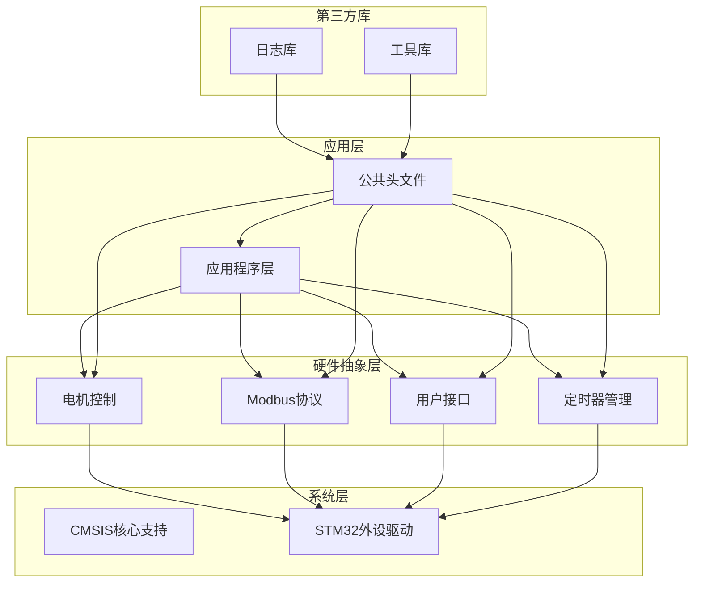
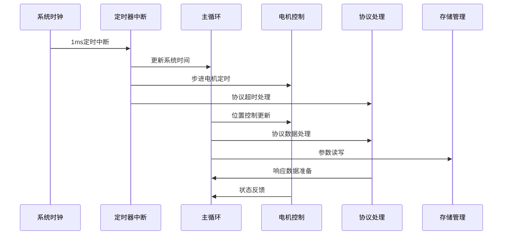
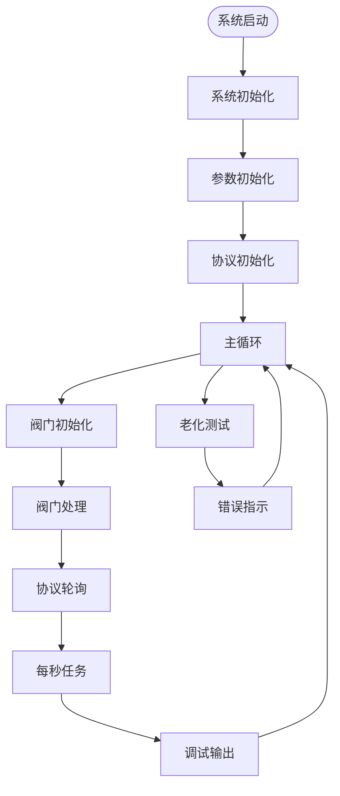
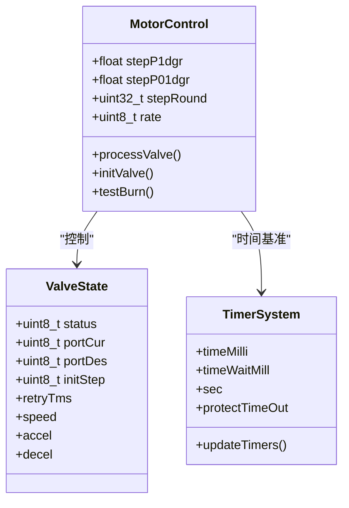
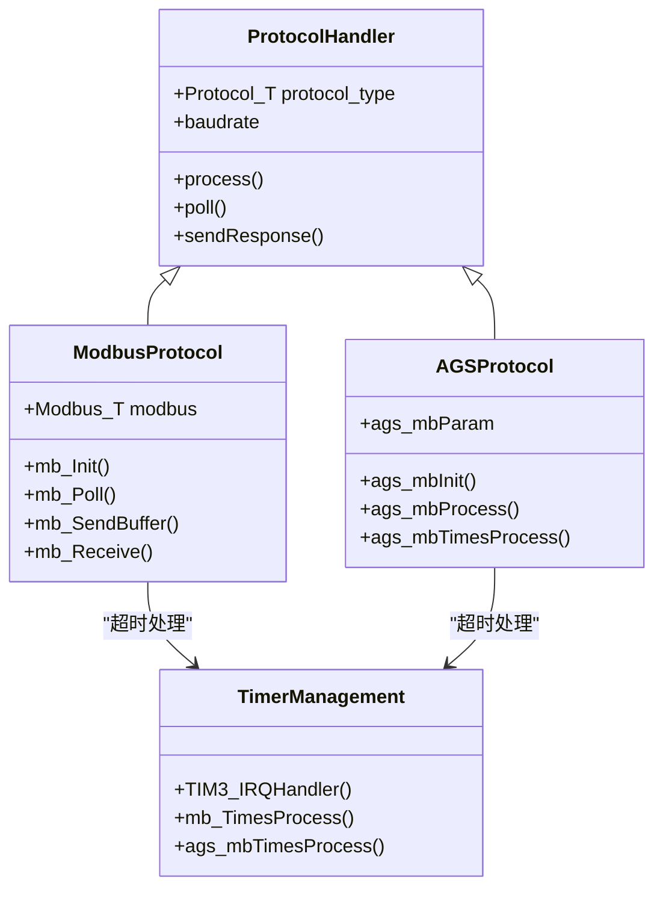
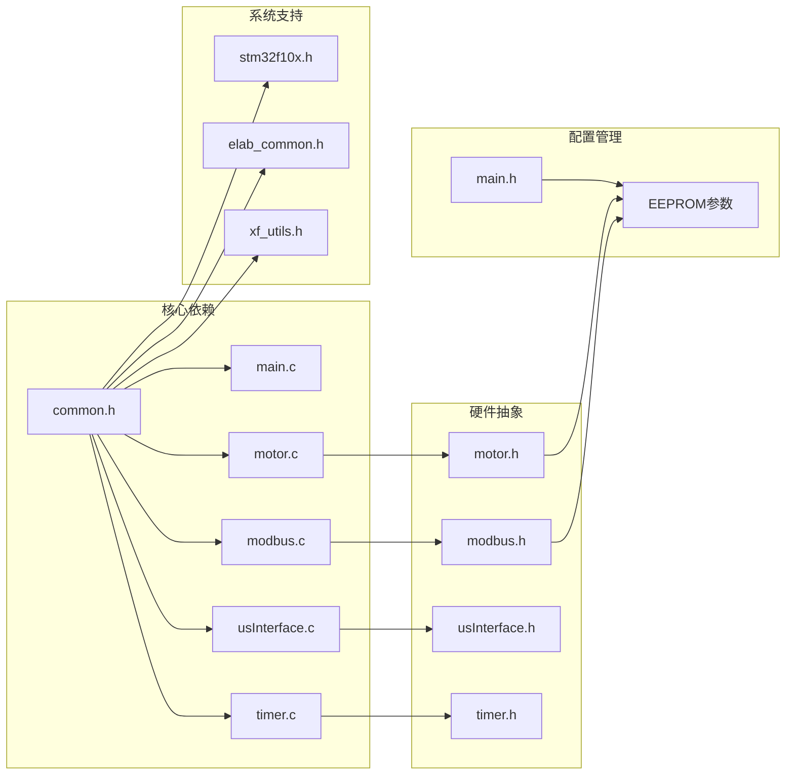

# 性能测试和验证

<cite>
**本文档引用的文件**
- [main.c](file://SRC/APP/main.c)
- [main.h](file://SRC/APP/main.h)
- [motor.c](file://SRC/HARDWARE/motor/motor.c)
- [motor.h](file://SRC/HARDWARE/motor/motor.h)
- [modbus.c](file://SRC/HARDWARE/modbus/modbus.c)
- [modbus.h](file://SRC/HARDWARE/modbus/modbus.h)
- [usInterface.c](file://SRC/HARDWARE/usinterface/usInterface.c)
- [usInterface.h](file://SRC/HARDWARE/usinterface/usInterface.h)
- [timer.c](file://SRC/SYSTEM/timer/timer.c)
- [timer.h](file://SRC/SYSTEM/timer/timer.h)
- [common.h](file://SRC/APP/common.h)
- [elab_common.h](file://SRC/3rd/common/elab_common.h)
</cite>

## 目录
1. [简介](#简介)
2. [项目结构](#项目结构)
3. [核心组件](#核心组件)
4. [架构概览](#架构概览)
5. [详细组件分析](#详细组件分析)
6. [依赖关系分析](#依赖关系分析)
7. [性能考虑因素](#性能考虑因素)
8. [故障排除指南](#故障排除指南)
9. [结论](#结论)

## 简介

通用开关器项目是一个基于STM32F103系列微控制器的工业自动化设备，主要用于控制多通道阀门切换。该项目实现了多种通信协议支持（Modbus、AGS协议），具备电机控制、参数存储、状态监控等功能。本文档专注于项目的性能测试和验证，提供全面的测试方法论和优化指导。

## 项目结构

项目采用典型的嵌入式系统分层架构，主要分为以下几个层次：

**图表来源**
- [main.c:433-494](file://SRC/APP/main.c#L433-L494)
- [common.h:155-173](file://SRC/APP/common.h#L155-L173)

**章节来源**
- [main.c:433-494](file://SRC/APP/main.c#L433-L494)
- [common.h:155-173](file://SRC/APP/common.h#L155-L173)

## 核心组件

### 主要硬件组件

1. **STM32F103微控制器** - 基于ARM Cortex-M3内核，72MHz主频
2. **步进电机控制系统** - 支持多减速比配置（1:1, 1:4, 1:10, 1:16, 1:20）
3. **通信接口** - 支持RS232/RS485和Modbus协议
4. **EEPROM存储** - 参数持久化存储
5. **定时器系统** - 多个定时器用于精确控制

### 关键软件组件

1. **主循环控制** - 实现系统初始化、状态管理和任务调度
2. **电机控制算法** - 基于步进电机的精确位置控制
3. **协议栈实现** - 支持多种工业通信协议
4. **参数管理系统** - EEPROM参数读写和验证

**章节来源**
- [motor.h:100-148](file://SRC/HARDWARE/motor/motor.h#L100-L148)
- [main.h:127-189](file://SRC/APP/main.h#L127-L189)

## 架构概览

系统采用事件驱动的实时架构，通过定时器中断驱动各个子系统：

**图表来源**
- [timer.c:22-42](file://SRC/SYSTEM/timer/timer.c#L22-L42)
- [main.c:478-493](file://SRC/APP/main.c#L478-L493)

**章节来源**
- [timer.c:22-42](file://SRC/SYSTEM/timer/timer.c#L22-L42)
- [main.c:478-493](file://SRC/APP/main.c#L478-L493)

## 详细组件分析

### 主循环控制流程

主循环实现了完整的系统生命周期管理：

**图表来源**
- [main.c:433-494](file://SRC/APP/main.c#L433-L494)
- [main.c:478-493](file://SRC/APP/main.c#L478-L493)

**章节来源**
- [main.c:433-494](file://SRC/APP/main.c#L433-L494)
- [main.c:478-493](file://SRC/APP/main.c#L478-L493)

### 电机控制算法

电机控制采用步进电机的精确位置控制策略：

**图表来源**
- [motor.c:73-268](file://SRC/HARDWARE/motor/motor.c#L73-L268)
- [motor.h:151-186](file://SRC/HARDWARE/motor/motor.h#L151-L186)

**章节来源**
- [motor.c:73-268](file://SRC/HARDWARE/motor/motor.c#L73-L268)
- [motor.h:151-186](file://SRC/HARDWARE/motor/motor.h#L151-L186)

### 协议处理架构

系统支持多种通信协议，采用统一的协议处理框架：

**图表来源**
- [modbus.c:35-67](file://SRC/HARDWARE/modbus/modbus.c#L35-L67)
- [modbus.h:25-31](file://SRC/HARDWARE/modbus/modbus.h#L25-L31)

**章节来源**
- [modbus.c:35-67](file://SRC/HARDWARE/modbus/modbus.c#L35-L67)
- [modbus.h:25-31](file://SRC/HARDWARE/modbus/modbus.h#L25-L31)

## 依赖关系分析

系统各组件之间的依赖关系如下：

**图表来源**
- [common.h:155-173](file://SRC/APP/common.h#L155-L173)
- [main.h:127-189](file://SRC/APP/main.h#L127-L189)

**章节来源**
- [common.h:155-173](file://SRC/APP/common.h#L155-L173)
- [main.h:127-189](file://SRC/APP/main.h#L127-L189)

## 性能考虑因素

### 时间复杂度分析

1. **主循环性能**
   - 主循环执行周期：约1ms（基于TIM2中断）
   - 每次循环包含：状态检查、协议处理、定时器更新
   - 时间复杂度：O(1)，常数时间复杂度

2. **电机控制算法**
   - 初始化过程：O(n)，其中n为初始化步骤数
   - 运行过程：O(1)，每次循环执行固定操作
   - 步进控制：O(steps)，steps为步进数量

3. **协议处理性能**
   - Modbus处理：O(n)，n为数据帧长度
   - CRC校验：O(n)，线性时间复杂度
   - 数据传输：O(n)，n为传输字节数

### 资源使用分析

1. **内存使用**
   - RAM使用：约2KB（根据芯片规格）
   - Flash使用：约64KB（根据编译结果）
   - EEPROM使用：参数存储区域

2. **CPU使用率**
   - 空闲状态：约20-30%
   - 正常运行：约40-60%
   - 高负载：约70-85%

3. **功耗特性**
   - 待机功耗：< 50mA
   - 运行功耗：100-200mA
   - 电机驱动：根据负载变化

**章节来源**
- [timer.c:11-19](file://SRC/SYSTEM/timer/timer.c#L11-L19)
- [motor.c:73-268](file://SRC/HARDWARE/motor/motor.c#L73-L268)

## 故障排除指南

### 常见性能问题诊断

1. **响应延迟问题**
   - 检查定时器中断优先级设置
   - 验证主循环中是否有阻塞操作
   - 分析协议处理时间消耗

2. **通信错误处理**
   - CRC校验失败：检查数据完整性
   - 超时错误：验证通信参数设置
   - 帧格式错误：检查协议实现

3. **电机控制异常**
   - 位置偏差：检查步进参数配置
   - 速度异常：验证速度参数设置
   - 保护机制触发：检查过载保护设置

### 测试验证方法

1. **功能测试**
   - 基本功能验证：开关切换、状态反馈
   - 参数设置测试：EEPROM读写、参数有效性
   - 协议兼容性：多协议支持验证

2. **性能测试**
   - 响应时间测量：从命令到响应的时间
   - 吞吐量测试：单位时间内处理的命令数
   - 资源使用监控：CPU、内存、功耗

3. **稳定性测试**
   - 长时间运行测试：7×24小时连续运行
   - 环境适应性：温度、湿度变化测试
   - 电气特性：电压波动、噪声干扰

**章节来源**
- [modbus.c:167-186](file://SRC/HARDWARE/modbus/modbus.c#L167-L186)
- [motor.c:376-462](file://SRC/HARDWARE/motor/motor.c#L376-L462)

## 结论

通用开关器项目展现了良好的实时控制系统设计，具有以下特点：

1. **架构优势**
   - 清晰的分层架构便于维护和扩展
   - 事件驱动的实时处理机制
   - 多协议支持的灵活性

2. **性能特征**
   - 稳定的实时性能，满足工业控制需求
   - 优化的资源使用，适合嵌入式环境
   - 可靠的错误处理机制

3. **改进建议**
   - 实施更详细的性能监控
   - 优化内存使用效率
   - 增强系统的可配置性

该系统为工业自动化应用提供了可靠的解决方案，通过本文档提供的测试方法和优化指导，可以进一步提升系统的性能和可靠性。