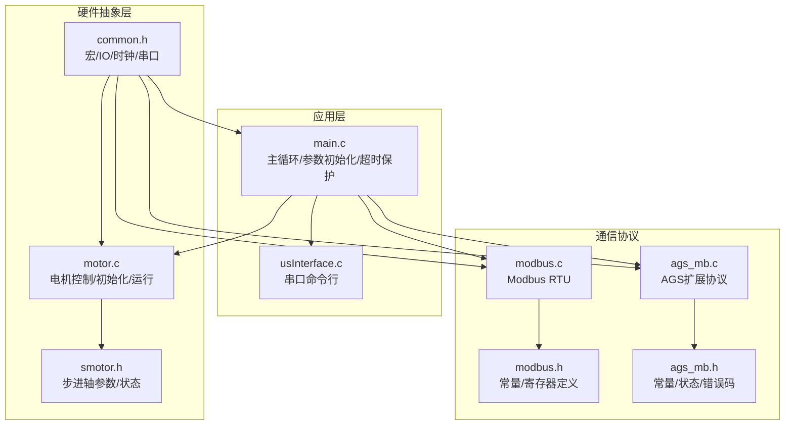
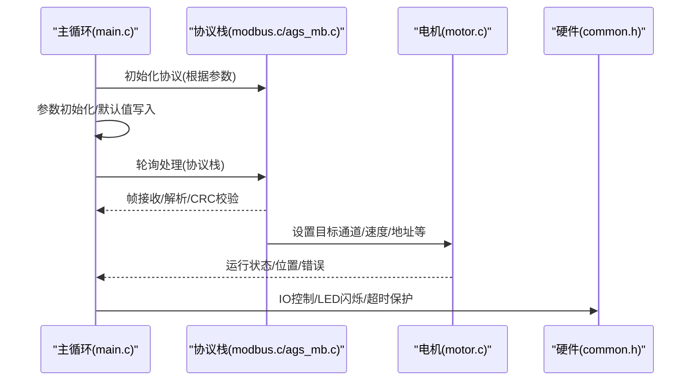
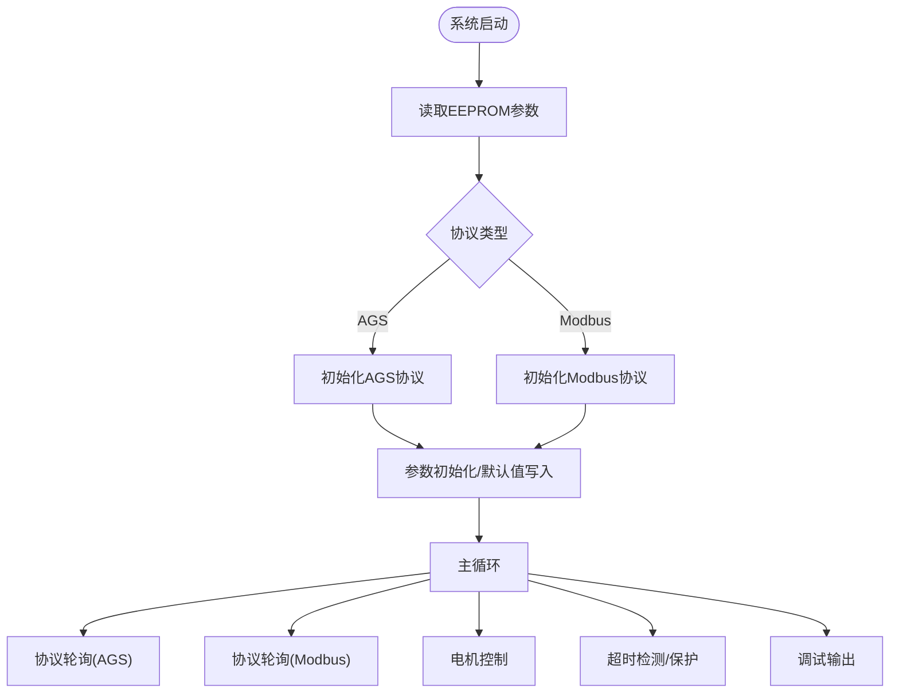
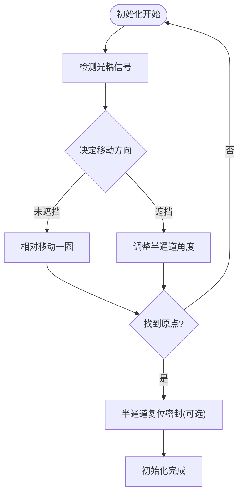
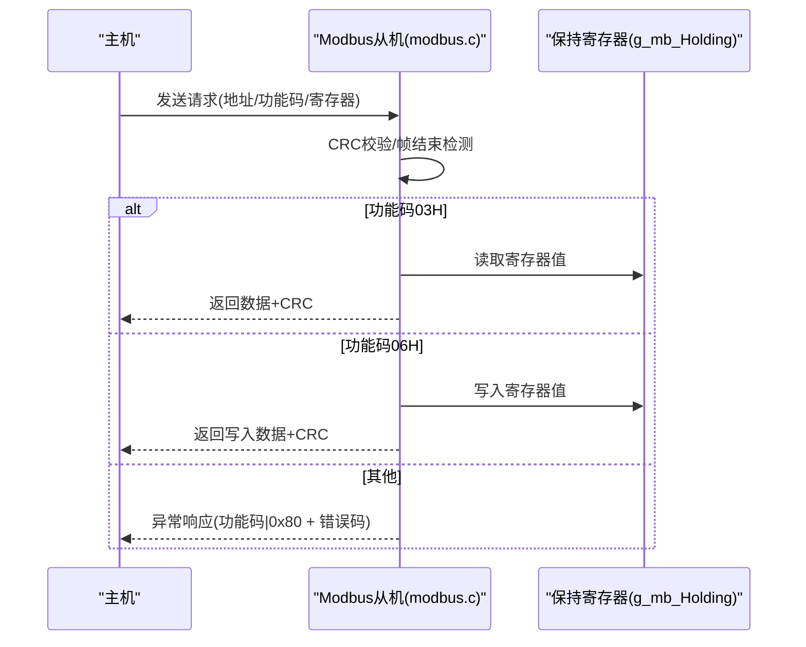
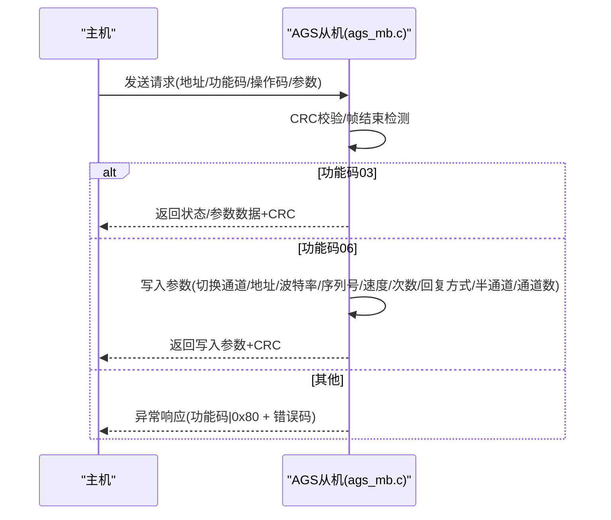
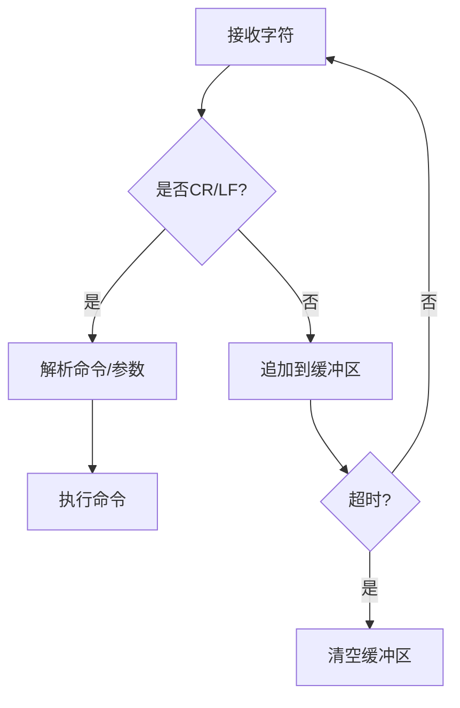
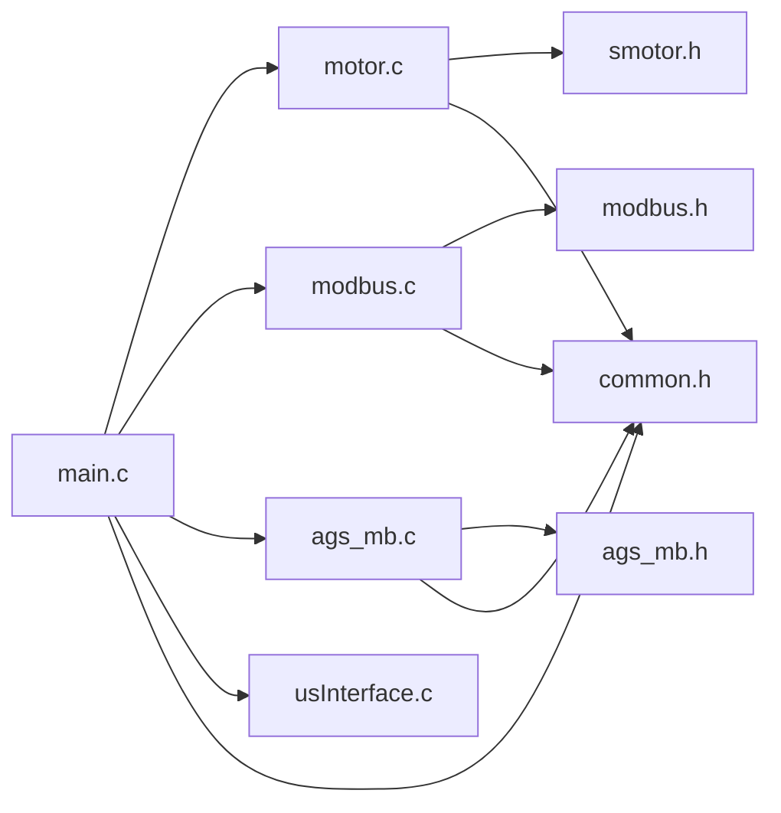
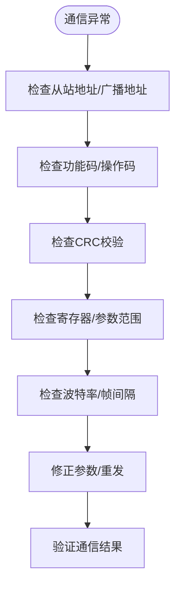

# 故障诊断和排除

<cite>
**本文引用的文件**
- [main.c](file://SRC/APP/main.c)
- [motor.c](file://SRC/HARDWARE/motor/motor.c)
- [modbus.c](file://SRC/HARDWARE/modbus/modbus.c)
- [ags_mb.c](file://SRC/HARDWARE/ags_mb/ags_mb.c)
- [usInterface.c](file://SRC/HARDWARE/usinterface/usInterface.c)
- [modbus.h](file://SRC/HARDWARE/modbus/modbus.h)
- [ags_mb.h](file://SRC/HARDWARE/ags_mb/ags_mb.h)
- [common.h](file://SRC/APP/common.h)
- [smotor.h](file://SRC/HARDWARE/motor/smotor.h)
- [xf_err.h](file://SRC/3rd/x fusion/xf_common/xf_err.h)
</cite>

## 目录
1. [简介](#简介)
2. [项目结构](#项目结构)
3. [核心组件](#核心组件)
4. [架构总览](#架构总览)
5. [详细组件分析](#详细组件分析)
6. [依赖关系分析](#依赖关系分析)
7. [性能考量](#性能考量)
8. [故障排除指南](#故障排除指南)
9. [结论](#结论)
10. [附录](#附录)

## 简介
本指南面向技术支持人员，围绕通用开关器项目的硬件与软件层面，提供系统化的故障诊断与排除方法。内容覆盖：
- 硬件故障：电机故障、通信接口故障、电源问题
- 软件缺陷：协议错误、参数配置错误、超时保护
- 通信问题：Modbus、AGS协议、串口通信
- 异常代码解读与处理策略：功能码错误、操作码错误、参数范围超限
- 性能问题：响应延迟、通信丢包、系统不稳定

## 项目结构
项目采用分层架构，包含应用层、硬件抽象层、通信协议栈与底层驱动：
- 应用层：主循环、参数初始化、IO控制、超时保护与调试输出
- 硬件抽象层：电机控制、定时器、串口、EEPROM
- 通信协议：Modbus RTU、AGS扩展协议
- 调试接口：串口命令行交互

图表来源
- [main.c:433-494](file://SRC/APP/main.c#L433-L494)
- [motor.c:73-351](file://SRC/HARDWARE/motor/motor.c#L73-L351)
- [modbus.c:35-67](file://SRC/HARDWARE/modbus/modbus.c#L35-L67)
- [ags_mb.c:7-73](file://SRC/HARDWARE/ags_mb/ags_mb.c#L7-L73)
- [usInterface.c:15-106](file://SRC/HARDWARE/usinterface/usInterface.c#L15-L106)
- [modbus.h:71-212](file://SRC/HARDWARE/modbus/modbus.h#L71-L212)
- [ags_mb.h:12-162](file://SRC/HARDWARE/ags_mb/ags_mb.h#L12-L162)
- [common.h:155-169](file://SRC/APP/common.h#L155-L169)

章节来源
- [main.c:433-494](file://SRC/APP/main.c#L433-L494)
- [motor.c:73-351](file://SRC/HARDWARE/motor/motor.c#L73-L351)
- [modbus.c:35-67](file://SRC/HARDWARE/modbus/modbus.c#L35-L67)
- [ags_mb.c:7-73](file://SRC/HARDWARE/ags_mb/ags_mb.c#L7-L73)
- [usInterface.c:15-106](file://SRC/HARDWARE/usinterface/usInterface.c#L15-L106)
- [modbus.h:71-212](file://SRC/HARDWARE/modbus/modbus.h#L71-L212)
- [ags_mb.h:12-162](file://SRC/HARDWARE/ags_mb/ags_mb.h#L12-L162)
- [common.h:155-169](file://SRC/APP/common.h#L155-L169)

## 核心组件
- 主循环与参数初始化：负责系统启动、协议选择、参数读取与默认值写入、超时保护与调试输出
- 电机控制：负责阀门初始化、寻位、运行与急停、老化模式
- 通信协议：
  - Modbus RTU：支持功能码03H/06H，保持寄存器读写，CRC校验与错误处理
  - AGS扩展协议：自定义功能码与操作码，支持读写状态、地址、波特率、序列号、速度、切换次数、回复方式、半通道、通道数等
- 串口命令行：基于回车换行的命令解析与超时处理

章节来源
- [main.c:222-429](file://SRC/APP/main.c#L222-L429)
- [motor.c:73-351](file://SRC/HARDWARE/motor/motor.c#L73-L351)
- [modbus.c:469-517](file://SRC/HARDWARE/modbus/modbus.c#L469-L517)
- [ags_mb.c:426-473](file://SRC/HARDWARE/ags_mb/ags_mb.c#L426-L473)
- [usInterface.c:79-131](file://SRC/HARDWARE/usinterface/usInterface.c#L79-L131)

## 架构总览
系统以main.c为核心调度，根据协议类型选择Modbus或AGS协议栈；电机控制由motor.c实现，通过定时器与步进轴参数协调运行；通信层通过common.h中的串口与GPIO宏进行硬件抽象。

图表来源
- [main.c:468-487](file://SRC/APP/main.c#L468-L487)
- [modbus.c:469-517](file://SRC/HARDWARE/modbus/modbus.c#L469-L517)
- [ags_mb.c:426-473](file://SRC/HARDWARE/ags_mb/ags_mb.c#L426-L473)
- [motor.c:275-351](file://SRC/HARDWARE/motor/motor.c#L275-L351)
- [common.h:174-175](file://SRC/APP/common.h#L174-L175)

## 详细组件分析

### 主循环与参数初始化
- 协议选择：根据EEPROM中协议类型初始化Modbus或AGS
- 参数初始化：读取EEPROM中的地址、原点补偿、方向补偿、通道数、波特率、速度、IO控制、老化间隔、电流设置、序列号、协议类型、减速比、半通道、切换次数、回复方式等
- 超时保护：运行与初始化阶段的超时检测，超时后置位错误并停止电机
- 调试输出：周期性打印状态、参数与调试信息

图表来源
- [main.c:466-487](file://SRC/APP/main.c#L466-L487)
- [main.c:222-429](file://SRC/APP/main.c#L222-L429)
- [main.c:69-202](file://SRC/APP/main.c#L69-L202)

章节来源
- [main.c:466-487](file://SRC/APP/main.c#L466-L487)
- [main.c:222-429](file://SRC/APP/main.c#L222-L429)
- [main.c:69-202](file://SRC/APP/main.c#L69-L202)

### 电机控制与运行
- 初始化：根据光耦信号与上次位置决定移动方向，寻找原点，支持半通道复位密封
- 运行：根据目标通道计算相对/绝对步数，设置加速度/减速度/速度，触发电机移动
- 急停与信号：光耦信号异常时置位错误并停止，切换完成后写入当前位置
- 老化模式：支持自动切换与计数保存

图表来源
- [motor.c:73-268](file://SRC/HARDWARE/motor/motor.c#L73-L268)
- [motor.c:353-351](file://SRC/HARDWARE/motor/motor.c#L353-L351)

章节来源
- [motor.c:73-268](file://SRC/HARDWARE/motor/motor.c#L73-L268)
- [motor.c:275-351](file://SRC/HARDWARE/motor/motor.c#L275-L351)
- [motor.c:353-463](file://SRC/HARDWARE/motor/motor.c#L353-L463)
- [smotor.h:67-96](file://SRC/HARDWARE/motor/smotor.h#L67-L96)

### Modbus协议栈
- 初始化：配置串口波特率、定时器、接收缓冲区，清空保持寄存器
- 轮询：接收帧、CRC校验、功能码解析、错误处理
- 功能码：
  - 03H：读保持寄存器，校验地址范围
  - 06H：写单个保持寄存器，更新运行参数与用户参数
- 错误处理：非法功能码、地址越界、数据无效、设备故障、CRC错误

图表来源
- [modbus.c:469-517](file://SRC/HARDWARE/modbus/modbus.c#L469-L517)
- [modbus.c:192-278](file://SRC/HARDWARE/modbus/modbus.c#L192-L278)
- [modbus.c:285-366](file://SRC/HARDWARE/modbus/modbus.c#L285-L366)
- [modbus.h:11-21](file://SRC/HARDWARE/modbus/modbus.h#L11-L21)

章节来源
- [modbus.c:35-67](file://SRC/HARDWARE/modbus/modbus.c#L35-L67)
- [modbus.c:469-517](file://SRC/HARDWARE/modbus/modbus.c#L469-L517)
- [modbus.c:192-278](file://SRC/HARDWARE/modbus/modbus.c#L192-L278)
- [modbus.c:285-366](file://SRC/HARDWARE/modbus/modbus.c#L285-L366)
- [modbus.h:71-212](file://SRC/HARDWARE/modbus/modbus.h#L71-L212)

### AGS扩展协议
- 初始化：配置串口、定时器、接收缓冲区、清空寄存器
- 轮询：接收帧、CRC校验、功能码解析、错误处理
- 功能码：
  - 03：读保持寄存器（状态、当前通道、地址、版本、波特率、序列号、速度、切换次数、回复方式、半通道、通道数等）
  - 06：写单个保持寄存器（切换通道、地址、复位、波特率、序列号、速度、切换次数、回复方式、半通道、通道数等）
- 错误处理：非法功能码、地址越界、数据无效、设备地址错误、忙、设备故障

图表来源
- [ags_mb.c:426-473](file://SRC/HARDWARE/ags_mb/ags_mb.c#L426-L473)
- [ags_mb.c:182-285](file://SRC/HARDWARE/ags_mb/ags_mb.c#L182-L285)
- [ags_mb.c:288-423](file://SRC/HARDWARE/ags_mb/ags_mb.c#L288-L423)
- [ags_mb.h:25-34](file://SRC/HARDWARE/ags_mb/ags_mb.h#L25-L34)

章节来源
- [ags_mb.c:7-73](file://SRC/HARDWARE/ags_mb/ags_mb.c#L7-L73)
- [ags_mb.c:426-473](file://SRC/HARDWARE/ags_mb/ags_mb.c#L426-L473)
- [ags_mb.c:182-285](file://SRC/HARDWARE/ags_mb/ags_mb.c#L182-L285)
- [ags_mb.c:288-423](file://SRC/HARDWARE/ags_mb/ags_mb.c#L288-L423)
- [ags_mb.h:12-162](file://SRC/HARDWARE/ags_mb/ags_mb.h#L12-L162)

### 串口命令行接口
- 接收：基于回车/换行的命令接收，超时清理
- 解析：命令与参数分隔符检查、参数个数与长度校验
- 超时：接收超时自动清空缓冲区

图表来源
- [usInterface.c:15-106](file://SRC/HARDWARE/usinterface/usInterface.c#L15-L106)
- [usInterface.c:109-131](file://SRC/HARDWARE/usinterface/usInterface.c#L109-L131)

章节来源
- [usInterface.c:15-106](file://SRC/HARDWARE/usinterface/usInterface.c#L15-L106)
- [usInterface.c:109-131](file://SRC/HARDWARE/usinterface/usInterface.c#L109-L131)

## 依赖关系分析
- main.c依赖motor.c、modbus.c/ags_mb.c、usInterface.c与common.h中的硬件抽象
- motor.c依赖smotor.h与common.h中的定时器/步进轴参数
- 协议栈依赖modbus.h/ags_mb.h中的常量与寄存器定义
- 错误处理与日志：xf_err.h提供通用错误码类型

图表来源
- [main.c:433-494](file://SRC/APP/main.c#L433-L494)
- [motor.c:73-351](file://SRC/HARDWARE/motor/motor.c#L73-L351)
- [modbus.c:35-67](file://SRC/HARDWARE/modbus/modbus.c#L35-L67)
- [ags_mb.c:7-73](file://SRC/HARDWARE/ags_mb/ags_mb.c#L7-L73)
- [usInterface.c:15-106](file://SRC/HARDWARE/usinterface/usInterface.c#L15-L106)
- [smotor.h:67-96](file://SRC/HARDWARE/motor/smotor.h#L67-L96)
- [modbus.h:71-212](file://SRC/HARDWARE/modbus/modbus.h#L71-L212)
- [ags_mb.h:12-162](file://SRC/HARDWARE/ags_mb/ags_mb.h#L12-L162)
- [common.h:155-169](file://SRC/APP/common.h#L155-L169)

章节来源
- [main.c:433-494](file://SRC/APP/main.c#L433-L494)
- [motor.c:73-351](file://SRC/HARDWARE/motor/motor.c#L73-L351)
- [modbus.c:35-67](file://SRC/HARDWARE/modbus/modbus.c#L35-L67)
- [ags_mb.c:7-73](file://SRC/HARDWARE/ags_mb/ags_mb.c#L7-L73)
- [usInterface.c:15-106](file://SRC/HARDWARE/usinterface/usInterface.c#L15-L106)
- [smotor.h:67-96](file://SRC/HARDWARE/motor/smotor.h#L67-L96)
- [modbus.h:71-212](file://SRC/HARDWARE/modbus/modbus.h#L71-L212)
- [ags_mb.h:12-162](file://SRC/HARDWARE/ags_mb/ags_mb.h#L12-L162)
- [common.h:155-169](file://SRC/APP/common.h#L155-L169)

## 性能考量
- 响应延迟：协议轮询频率、帧处理耗时、CRC校验与缓冲区管理
- 通信丢包：波特率设置、帧间隔时间、总线空闲检测、超时阈值
- 系统不稳定：超时保护触发、电机堵转保护、EEPROM读写一致性

章节来源
- [main.c:69-202](file://SRC/APP/main.c#L69-L202)
- [modbus.c:72-91](file://SRC/HARDWARE/modbus/modbus.c#L72-L91)
- [ags_mb.c:75-94](file://SRC/HARDWARE/ags_mb/ags_mb.c#L75-L94)

## 故障排除指南

### 硬件故障诊断
- 电机不动作/卡死
  - 检查光耦信号与原点补偿设置，确认初始化流程是否完成
  - 确认电机电源与电流设置，必要时降低速度与电流
  - 观察超时保护是否频繁触发，检查机械负载与阻塞
- IO控制异常
  - 根据板型宏配置检查IO电平与方向，确认IO控制使能状态
  - 检查外部IO输入/输出连接与上拉/下拉电阻
- 电源问题
  - 使用万用表测量供电电压，确认稳压与滤波
  - 观察LED闪烁与错误指示，结合ErrBlink逻辑定位

章节来源
- [motor.c:73-268](file://SRC/HARDWARE/motor/motor.c#L73-L268)
- [motor.c:353-351](file://SRC/HARDWARE/motor/motor.c#L353-L351)
- [main.c:69-202](file://SRC/APP/main.c#L69-L202)
- [common.h:43-134](file://SRC/APP/common.h#L43-L134)

### 软件缺陷识别与修复
- 参数配置错误
  - 通道数/波特率/速度/半通道等参数越界时，系统会写入默认值并提示，请按范围重新设置
  - EEPROM参数读取失败时，系统会写入默认参数并提示复位
- 协议错误
  - 功能码/地址/数据无效时，协议栈返回异常响应，需检查主站命令格式与参数范围
- 超时保护
  - 运行/初始化超时触发后，系统停止电机并点亮错误指示，需排查机械卡滞与通信异常

章节来源
- [main.c:222-429](file://SRC/APP/main.c#L222-L429)
- [modbus.c:167-186](file://SRC/HARDWARE/modbus/modbus.c#L167-L186)
- [ags_mb.c:159-179](file://SRC/HARDWARE/ags_mb/ags_mb.c#L159-L179)

### 通信问题诊断流程
- Modbus通信
  - 检查从站地址与功能码是否受支持，确认CRC校验通过
  - 校验寄存器地址范围与字节数，避免地址越界与数据长度不匹配
- AGS协议通信
  - 检查操作码与参数长度，确认模块忙/地址错误/数据无效等异常码
  - 注意广播地址使用场景与回复方式设置
- 串口通信
  - 确认串口波特率一致，检查帧间隔与超时设置
  - 使用串口调试助手验证回车换行与命令格式

图表来源
- [modbus.c:469-517](file://SRC/HARDWARE/modbus/modbus.c#L469-L517)
- [ags_mb.c:426-473](file://SRC/HARDWARE/ags_mb/ags_mb.c#L426-L473)
- [usInterface.c:15-106](file://SRC/HARDWARE/usinterface/usInterface.c#L15-L106)

章节来源
- [modbus.c:469-517](file://SRC/HARDWARE/modbus/modbus.c#L469-L517)
- [ags_mb.c:426-473](file://SRC/HARDWARE/ags_mb/ags_mb.c#L426-L473)
- [usInterface.c:15-106](file://SRC/HARDWARE/usinterface/usInterface.c#L15-L106)

### 异常代码解读与处理
- Modbus异常码
  - 功能码错误：检查功能码是否受支持
  - 地址错误：检查寄存器地址范围
  - 数据错误：检查写入数据值与长度
  - 设备故障：检查总线空闲检测与帧间隔
- AGS异常码
  - 功能码/地址/数据错误：与Modbus类似
  - 设备地址错误：确认从站地址与广播地址使用
  - 忙：模块正在运行，稍后再试
- 通用错误类型
  - 超时、资源不可用、无效参数等，参考xf_err.h

章节来源
- [modbus.h:11-21](file://SRC/HARDWARE/modbus/modbus.h#L11-L21)
- [ags_mb.h:25-34](file://SRC/HARDWARE/ags_mb/ags_mb.h#L25-L34)
- [xf_err.h:30-50](file://SRC/3rd/x fusion/xf_common/xf_err.h#L30-L50)

### 性能问题诊断
- 响应延迟
  - 降低轮询频率，优化帧处理逻辑，减少不必要的调试输出
- 通信丢包
  - 提高波特率，缩短帧间隔，增加总线空闲检测阈值
- 系统不稳定
  - 加强超时保护与错误恢复，避免重复初始化与EEPROM频繁写入

章节来源
- [main.c:69-202](file://SRC/APP/main.c#L69-L202)
- [modbus.c:72-91](file://SRC/HARDWARE/modbus/modbus.c#L72-L91)
- [ags_mb.c:75-94](file://SRC/HARDWARE/ags_mb/ags_mb.c#L75-L94)

## 结论
本指南提供了从硬件到软件、从通信到性能的完整故障诊断路径。通过理解主循环、电机控制、协议栈与串口接口的工作机制，结合异常码与超时保护策略，可快速定位并解决问题。建议在生产环境中定期校验参数、监控通信质量与系统稳定性，并建立标准化的排障流程。

## 附录
- 常用寄存器与参数范围可参考协议头文件定义
- 调试输出可通过DEBUG宏控制，便于现场定位问题

章节来源
- [modbus.h:71-212](file://SRC/HARDWARE/modbus/modbus.h#L71-L212)
- [ags_mb.h:12-162](file://SRC/HARDWARE/ags_mb/ags_mb.h#L12-L162)
- [common.h:34-37](file://SRC/APP/common.h#L34-L37)