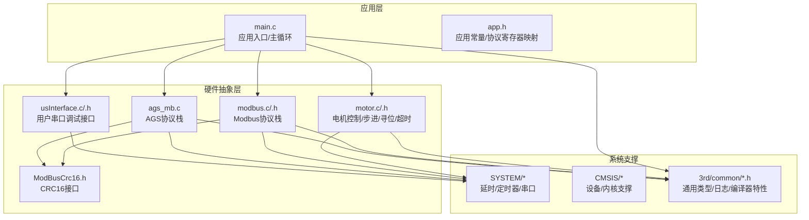
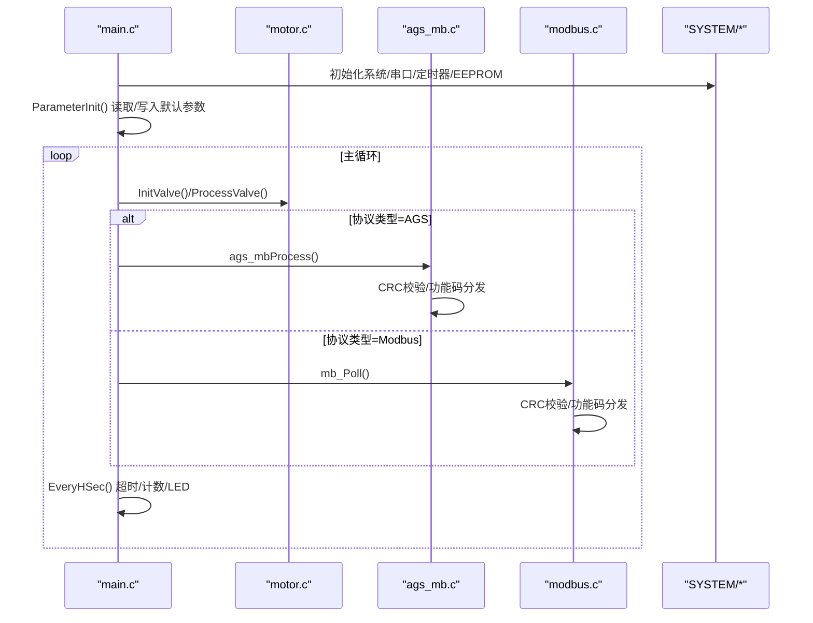
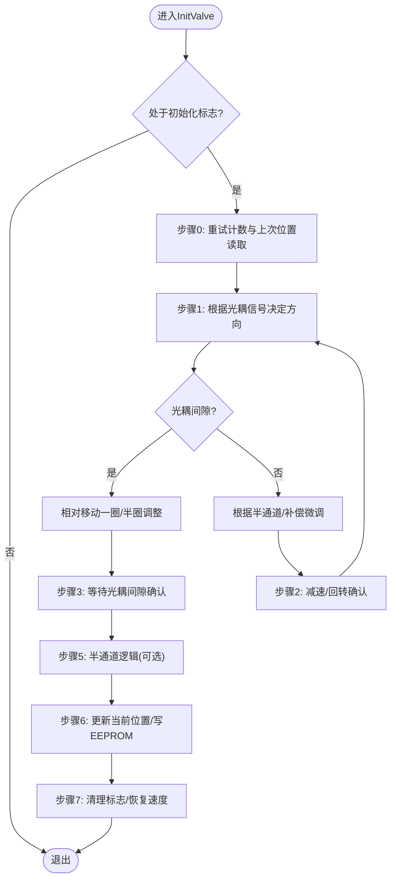
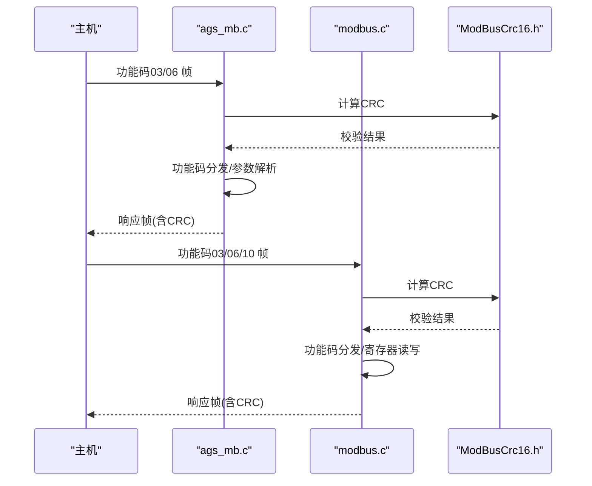
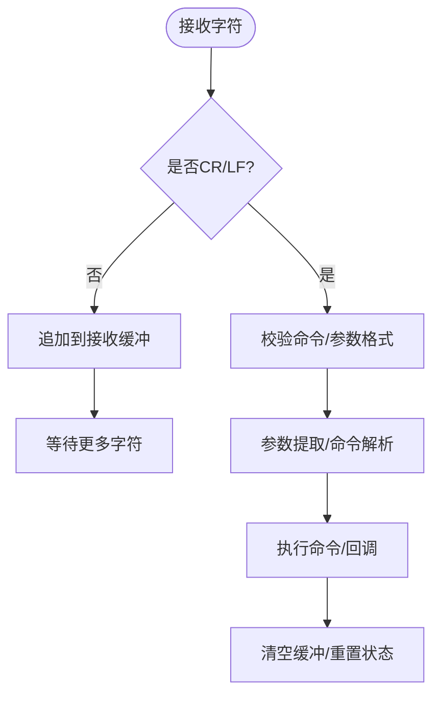
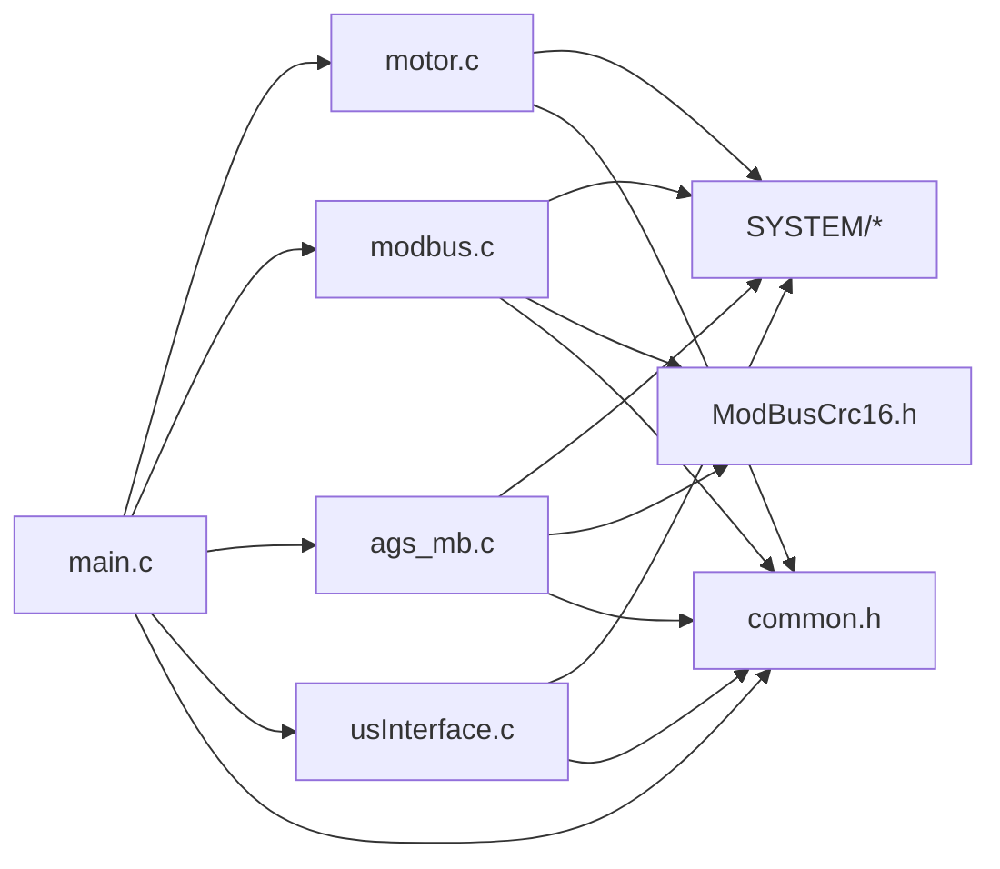

# 测试方法和流程

<cite>
**本文引用的文件**
- [SRC/APP/main.c](file://SRC/APP/main.c)
- [SRC/HARDWARE/motor/motor.c](file://SRC/HARDWARE/motor/motor.c)
- [SRC/HARDWARE/modbus/modbus.c](file://SRC/HARDWARE/modbus/modbus.c)
- [SRC/HARDWARE/usinterface/usInterface.c](file://SRC/HARDWARE/usinterface/usInterface.c)
- [SRC/HARDWARE/ags_mb/ags_mb.c](file://SRC/HARDWARE/ags_mb/ags_mb.c)
- [SRC/HARDWARE/motor/motor.h](file://SRC/HARDWARE/motor/motor.h)
- [SRC/HARDWARE/modbus/modbus.h](file://SRC/HARDWARE/modbus/modbus.h)
- [SRC/HARDWARE/usinterface/usinterface.h](file://SRC/HARDWARE/usinterface/usinterface.h)
- [SRC/APP/app.h](file://SRC/APP/app.h)
- [SRC/APP/common.h](file://SRC/APP/common.h)
- [SRC/HARDWARE/ags_mb/ModBusCrc16.h](file://SRC/HARDWARE/ags_mb/ModBusCrc16.h)
- [SRC/3rd/common/elab_common.h](file://SRC/3rd/common/elab_common.h)
- [SRC/3rd/common/elab_def.h](file://SRC/3rd/common/elab_def.h)
- [SRC/3rd/common/elab_std.h](file://SRC/3rd/common/elab_std.h)
</cite>

## 目录
1. [简介](#简介)
2. [项目结构](#项目结构)
3. [核心组件](#核心组件)
4. [架构总览](#架构总览)
5. [详细组件分析](#详细组件分析)
6. [依赖关系分析](#依赖关系分析)
7. [性能考虑](#性能考虑)
8. [故障排查指南](#故障排查指南)
9. [结论](#结论)
10. [附录](#附录)

## 简介
本指南面向通用开关器项目的测试工程师，提供覆盖单元测试、集成测试与系统测试的完整测试方法与流程。文档聚焦以下模块：
- 电机控制模块：包含初始化、寻位、运行、超时保护与老化测试流程
- 协议栈模块：AGS协议与Modbus协议的解析、校验与参数配置
- 硬件抽象层：串口、定时器、GPIO、EEPROM等外设接口
- 用户串口调试接口：命令解析与参数提取

测试目标包括：
- 验证各模块功能正确性与边界条件处理
- 验证多通道控制与通信协议交互
- 验证参数配置与EEPROM持久化一致性
- 验证系统在典型与极限场景下的稳定性与性能

## 项目结构
项目采用分层组织，核心目录与职责如下：
- SRC/APP：应用入口、系统初始化、参数初始化与主循环
- SRC/HARDWARE：硬件相关实现（电机、协议、串口、定时器、EEPROM）
- SRC/SYSTEM：系统支撑（延时、系统时钟、定时器、串口）
- SRC/CMSIS：设备支持包与内核支撑
- SRC/3rd：第三方库（日志、工具）

图表来源
- [SRC/APP/main.c:433-494](file://SRC/APP/main.c#L433-L494)
- [SRC/HARDWARE/motor/motor.c:4-68](file://SRC/HARDWARE/motor/motor.c#L4-L68)
- [SRC/HARDWARE/modbus/modbus.c:35-67](file://SRC/HARDWARE/modbus/modbus.c#L35-L67)
- [SRC/HARDWARE/ags_mb/ags_mb.c:7-73](file://SRC/HARDWARE/ags_mb/ags_mb.c#L7-L73)
- [SRC/HARDWARE/usinterface/usInterface.c:1-20](file://SRC/HARDWARE/usinterface/usInterface.c#L1-L20)

章节来源
- [SRC/APP/main.c:433-494](file://SRC/APP/main.c#L433-L494)
- [SRC/APP/common.h:1-526](file://SRC/APP/common.h#L1-L526)

## 核心组件
- 电机控制模块（motor）：负责电机初始化、原点寻找、通道切换、运行状态管理、超时保护与老化测试
- 协议栈模块（modbus/ags_mb）：负责Modbus与AGS协议的数据帧解析、CRC校验、寄存器读写与控制命令
- 用户串口调试接口（usInterface）：负责命令接收、解析、参数提取与超时处理
- 系统参数与常量（common/app.h）：系统宏、版本、协议类型、寄存器地址等

章节来源
- [SRC/HARDWARE/motor/motor.c:73-268](file://SRC/HARDWARE/motor/motor.c#L73-L268)
- [SRC/HARDWARE/modbus/modbus.c:35-67](file://SRC/HARDWARE/modbus/modbus.c#L35-L67)
- [SRC/HARDWARE/ags_mb/ags_mb.c:7-73](file://SRC/HARDWARE/ags_mb/ags_mb.c#L7-L73)
- [SRC/HARDWARE/usinterface/usInterface.c:15-106](file://SRC/HARDWARE/usinterface/usInterface.c#L15-L106)
- [SRC/APP/app.h:1-37](file://SRC/APP/app.h#L1-L37)
- [SRC/APP/common.h:1-526](file://SRC/APP/common.h#L1-L526)

## 架构总览
系统主循环在应用入口中调度协议栈轮询、阀门状态处理与周期性检测；电机模块在初始化与运行阶段根据状态机推进；协议栈在中断或轮询中接收数据并进行CRC校验与功能码分发。

图表来源
- [SRC/APP/main.c:478-493](file://SRC/APP/main.c#L478-L493)
- [SRC/HARDWARE/motor/motor.c:73-268](file://SRC/HARDWARE/motor/motor.c#L73-L268)
- [SRC/HARDWARE/ags_mb/ags_mb.c:426-473](file://SRC/HARDWARE/ags_mb/ags_mb.c#L426-L473)
- [SRC/HARDWARE/modbus/modbus.c:469-517](file://SRC/HARDWARE/modbus/modbus.c#L469-L517)

## 详细组件分析

### 电机控制模块测试策略
- 单元测试要点
  - 初始化流程：验证初始化标志位、重试次数、原点寻找方向与减速段设置
  - 寻位流程：验证光耦信号触发、半通道逻辑、方向补偿与步数计算
  - 运行流程：验证A/B位置切换、绝对/相对移动路径、运行结束标志与EEPROM写入
  - 超时保护：验证单次运行与初始化超时阈值、错误标志与电机关闭
  - 老化测试：验证老化地址识别、老化间隔与切换次数统计
- 关键接口与路径
  - 初始化与状态机推进：[motor.c:73-268](file://SRC/HARDWARE/motor/motor.c#L73-L268)
  - 寻位与原点回调：[motor.c:356-371](file://SRC/HARDWARE/motor/motor.c#L356-L371)
  - 运行与切换：[motor.c:275-351](file://SRC/HARDWARE/motor/motor.c#L275-L351)
  - 老化测试：[motor.c:376-462](file://SRC/HARDWARE/motor/motor.c#L376-L462)
  - 结构体与常量：[motor.h:151-237](file://SRC/HARDWARE/motor/motor.h#L151-L237)

图表来源
- [SRC/HARDWARE/motor/motor.c:73-268](file://SRC/HARDWARE/motor/motor.c#L73-L268)

章节来源
- [SRC/HARDWARE/motor/motor.c:73-268](file://SRC/HARDWARE/motor/motor.c#L73-L268)
- [SRC/HARDWARE/motor/motor.h:151-237](file://SRC/HARDWARE/motor/motor.h#L151-L237)

### 协议栈模块测试策略
- 单元测试要点
  - AGS协议：功能码03读保持寄存器、功能码06写单个寄存器、CRC校验、地址匹配与广播处理
  - Modbus协议：功能码03/06/10处理、CRC校验、寄存器读写、错误码生成
  - 参数配置：地址、波特率、速度、序列号、通道数、半通道、回复方式等写入EEPROM
- 关键接口与路径
  - AGS处理流程：[ags_mb.c:426-473](file://SRC/HARDWARE/ags_mb/ags_mb.c#L426-L473)
  - AGS读保持寄存器：[ags_mb.c:182-285](file://SRC/HARDWARE/ags_mb/ags_mb.c#L182-L285)
  - AGS写单个寄存器：[ags_mb.c:288-423](file://SRC/HARDWARE/ags_mb/ags_mb.c#L288-L423)
  - Modbus初始化与轮询：[modbus.c:35-67](file://SRC/HARDWARE/modbus/modbus.c#L35-L67), [modbus.c:469-517](file://SRC/HARDWARE/modbus/modbus.c#L469-L517)
  - 寄存器映射与常量：[modbus.h:88-212](file://SRC/HARDWARE/modbus/modbus.h#L88-L212), [app.h:1-37](file://SRC/APP/app.h#L1-L37)

图表来源
- [SRC/HARDWARE/ags_mb/ags_mb.c:426-473](file://SRC/HARDWARE/ags_mb/ags_mb.c#L426-L473)
- [SRC/HARDWARE/modbus/modbus.c:469-517](file://SRC/HARDWARE/modbus/modbus.c#L469-L517)
- [SRC/HARDWARE/ags_mb/ModBusCrc16.h:1-16](file://SRC/HARDWARE/ags_mb/ModBusCrc16.h#L1-L16)

章节来源
- [SRC/HARDWARE/ags_mb/ags_mb.c:182-423](file://SRC/HARDWARE/ags_mb/ags_mb.c#L182-L423)
- [SRC/HARDWARE/modbus/modbus.c:35-67](file://SRC/HARDWARE/modbus/modbus.c#L35-L67)
- [SRC/HARDWARE/modbus/modbus.h:88-212](file://SRC/HARDWARE/modbus/modbus.h#L88-L212)
- [SRC/APP/app.h:1-37](file://SRC/APP/app.h#L1-L37)

### 用户串口调试接口测试策略
- 单元测试要点
  - 命令接收：CR/LF结束符识别、超时清理、越界保护
  - 参数解析：等号/分隔符、参数长度与个数校验、字符串转整数/十六进制
  - 命令处理：命令注册、操作函数调用、调试输出
- 关键接口与路径
  - 接收与超时：[usInterface.c:15-131](file://SRC/HARDWARE/usinterface/usInterface.c#L15-L131)
  - 参数提取：[usInterface.c:273-573](file://SRC/HARDWARE/usinterface/usInterface.c#L273-L573)
  - 接口声明：[usinterface.h:74-95](file://SRC/HARDWARE/usinterface/usinterface.h#L74-L95)

图表来源
- [SRC/HARDWARE/usinterface/usInterface.c:15-131](file://SRC/HARDWARE/usinterface/usInterface.c#L15-L131)
- [SRC/HARDWARE/usinterface/usInterface.c:273-573](file://SRC/HARDWARE/usinterface/usInterface.c#L273-L573)

章节来源
- [SRC/HARDWARE/usinterface/usInterface.c:15-131](file://SRC/HARDWARE/usinterface/usInterface.c#L15-L131)
- [SRC/HARDWARE/usinterface/usInterface.c:273-573](file://SRC/HARDWARE/usinterface/usInterface.c#L273-L573)
- [SRC/HARDWARE/usinterface/usinterface.h:74-95](file://SRC/HARDWARE/usinterface/usinterface.h#L74-L95)

## 依赖关系分析
- 模块耦合
  - main.c 依赖 motor、modbus/ags_mb、usInterface、common.h
  - motor 依赖 SYSTEM（定时器/延时）、common.h
  - modbus/ags_mb 依赖 SYSTEM（串口/定时器）、CRC16
  - usInterface 依赖 SYSTEM（串口）、common.h
- 外部依赖
  - STM32F10x HAL（通过CMSIS与SYSTEM间接使用）
  - 第三方日志与工具（3rd/common、3rd/xfusion）

图表来源
- [SRC/APP/main.c:433-494](file://SRC/APP/main.c#L433-L494)
- [SRC/HARDWARE/motor/motor.c:4-68](file://SRC/HARDWARE/motor/motor.c#L4-L68)
- [SRC/HARDWARE/modbus/modbus.c:35-67](file://SRC/HARDWARE/modbus/modbus.c#L35-L67)
- [SRC/HARDWARE/ags_mb/ags_mb.c:7-73](file://SRC/HARDWARE/ags_mb/ags_mb.c#L7-L73)
- [SRC/HARDWARE/usinterface/usInterface.c:1-20](file://SRC/HARDWARE/usinterface/usInterface.c#L1-L20)

章节来源
- [SRC/APP/common.h:155-173](file://SRC/APP/common.h#L155-L173)

## 性能考虑
- 串口与定时器
  - 串口波特率配置影响帧间隔与时序，需在协议初始化中正确设置
  - 定时器中断用于超时检测与周期性任务，需避免中断负载过高
- 电机步进与补偿
  - 步数计算受减速比与细分影响，需在参数初始化时统一换算
  - 方向补偿与半通道逻辑影响切换路径与精度
- 资源占用
  - EEPROM读写为阻塞操作，应避免在中断中频繁写入
  - 日志输出在发布模式下应关闭，减少CPU与串口压力

[本节为通用指导，无需具体文件引用]

## 故障排查指南
- 通信异常
  - 检查CRC校验与功能码分发是否正确
  - 校验设备地址与广播地址处理
- 参数不生效
  - 确认EEPROM写入成功与读取一致性
  - 检查参数范围与默认值回退逻辑
- 电机不动作或卡死
  - 检查超时保护触发与错误标志
  - 核对光耦信号与原点回调逻辑
- 调试接口无响应
  - 检查命令结束符、超时清理与参数个数校验

章节来源
- [SRC/HARDWARE/modbus/modbus.c:167-186](file://SRC/HARDWARE/modbus/modbus.c#L167-L186)
- [SRC/HARDWARE/ags_mb/ags_mb.c:159-179](file://SRC/HARDWARE/ags_mb/ags_mb.c#L159-L179)
- [SRC/HARDWARE/motor/motor.c:181-201](file://SRC/HARDWARE/motor/motor.c#L181-L201)
- [SRC/HARDWARE/usinterface/usInterface.c:109-131](file://SRC/HARDWARE/usinterface/usInterface.c#L109-L131)

## 结论
通过分层测试策略，可系统性地验证通用开关器在电机控制、协议栈与用户接口方面的正确性与鲁棒性。建议优先覆盖关键状态机与边界条件，结合集成测试验证多通道与参数配置，最终以系统测试评估稳定性与性能。

[本节为总结性内容，无需具体文件引用]

## 附录

### 测试环境搭建指南
- 硬件设备
  - STM32F103开发板（对应A12系列）
  - 串口调试助手（支持回车换行）
  - 多通道阀门模拟装置（可选）
- 软件工具
  - Keil MDK 或 IAR/CLANG（依据工程配置）
  - 串口监控工具（如HTerm）
  - EEPROM读写工具（配合I2C）
- 测试数据准备
  - 参数初始化：地址、波特率、速度、通道数、半通道、序列号、回复方式
  - 参数边界：最小/最大速度、通道数、波特率、补偿值
  - 通信帧样例：AGS与Modbus功能码03/06/10请求与期望响应

[本节为通用指导，无需具体文件引用]

### 自动化测试与测试报告
- 自动化测试建议
  - 协议栈：构造合法/非法帧，断言CRC与功能码处理
  - 电机：模拟光耦信号与超时，断言状态机推进与EEPROM写入
  - 参数：批量写入/读取，断言一致性与默认回退
- 测试报告模板
  - 测试项、测试步骤、预期结果、实际结果、通过/失败、备注
  - 关键指标：平均响应时间、超时次数、错误码分布、EEPROM写入成功率

[本节为通用指导，无需具体文件引用]