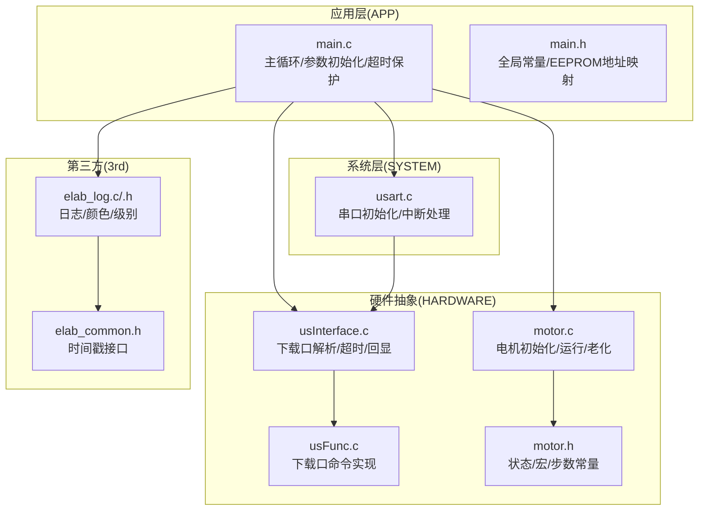
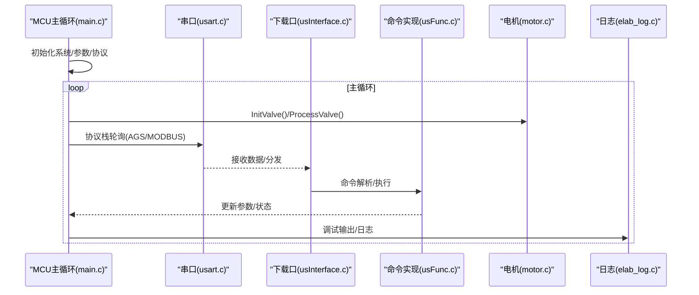
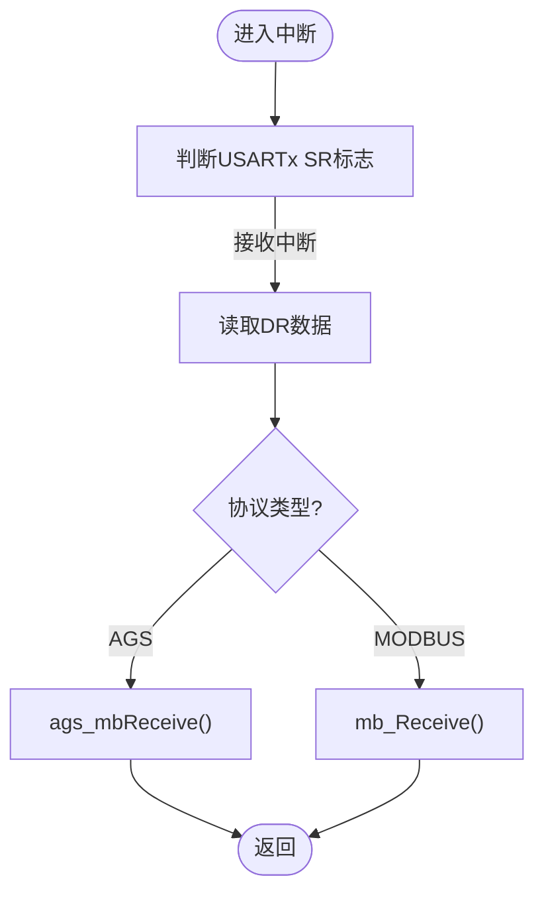
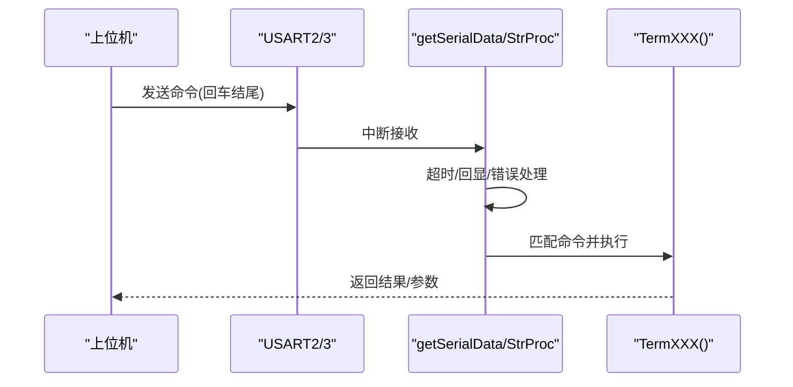
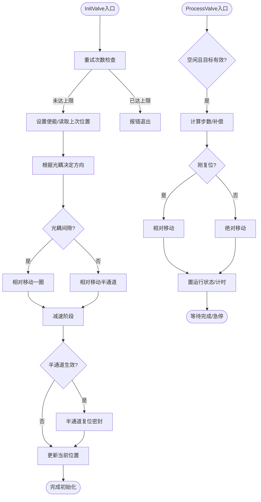
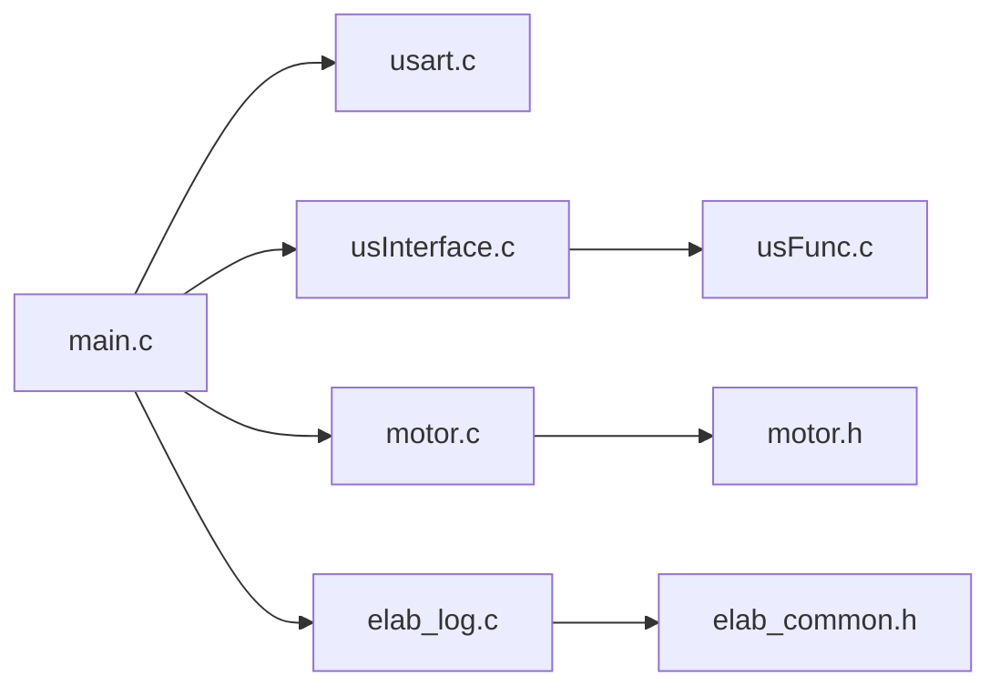

# 调试和测试

<cite>
**本文引用的文件**
- [main.c](file://SRC/APP/main.c)
- [main.h](file://SRC/APP/main.h)
- [usart.c](file://SRC/SYSTEM/usart/usart.c)
- [usInterface.c](file://SRC/HARDWARE/usinterface/usInterface.c)
- [usFunc.c](file://SRC/HARDWARE/usinterface/usFunc.c)
- [motor.c](file://SRC/HARDWARE/motor/motor.c)
- [motor.h](file://SRC/HARDWARE/motor/motor.h)
- [elab_log.c](file://SRC/3rd/common/elab_log.c)
- [elab_log.h](file://SRC/3rd/common/elab_log.h)
- [elab_common.h](file://SRC/3rd/common/elab_common.h)
- [A_901_STM32F103C8_1.0.0.dbgconf](file://USER/DebugConfig/A_901_STM32F103C8_1.0.0.dbgconf)
- [B_901_STM32F103C8_1.0.0.dbgconf](file://USER/DebugConfig/B_901_STM32F103C8_1.0.0.dbgconf)
- [O_901_STM32F103C8_1.0.0.dbgconf](file://USER/DebugConfig/O_901_STM32F103C8_1.0.0.dbgconf)
- [QHF_v1.3.1修改说明.md](file://Doc/QHF_v1.3.1修改说明.md)
</cite>

## 目录
1. [简介](#简介)
2. [项目结构](#项目结构)
3. [核心组件](#核心组件)
4. [架构总览](#架构总览)
5. [详细组件分析](#详细组件分析)
6. [依赖关系分析](#依赖关系分析)
7. [性能考虑](#性能考虑)
8. [故障排查指南](#故障排查指南)
9. [结论](#结论)
10. [附录](#附录)

## 简介
本指南面向测试工程师与调试人员，围绕通用开关器项目的调试与测试实践，覆盖JTAG调试、串口调试、逻辑分析仪配置；测试策略（单元、集成、系统）与用例设计；常见故障诊断与排除；以及性能与稳定性测试方法。文档基于仓库源码与配置文件进行深入分析，提供可操作的步骤与图示。

## 项目结构
项目采用分层组织：应用层（APP）、系统层（SYSTEM）、硬件抽象层（HARDWARE）、第三方库（3rd）。调试与测试涉及：
- 应用入口与主循环、参数初始化、超时保护与LED指示
- 串口通信与协议栈（AGS/MODBUS）
- 下载口调试接口与命令集
- 电机控制与初始化流程
- 日志与时间戳工具

**图表来源**
- [main.c:433-494](file://SRC/APP/main.c#L433-L494)
- [usart.c:38-120](file://SRC/SYSTEM/usart/usart.c#L38-L120)
- [usInterface.c:15-106](file://SRC/HARDWARE/usinterface/usInterface.c#L15-L106)
- [usFunc.c:70-110](file://SRC/HARDWARE/usinterface/usFunc.c#L70-L110)
- [motor.c:4-68](file://SRC/HARDWARE/motor/motor.c#L4-L68)
- [motor.h:100-148](file://SRC/HARDWARE/motor/motor.h#L100-L148)
- [elab_log.c:54-81](file://SRC/3rd/common/elab_log.c#L54-L81)
- [elab_common.h:28-28](file://SRC/3rd/common/elab_common.h#L28-L28)

**章节来源**
- [main.c:433-494](file://SRC/APP/main.c#L433-L494)
- [main.h:127-189](file://SRC/APP/main.h#L127-L189)
- [usart.c:38-120](file://SRC/SYSTEM/usart/usart.c#L38-L120)
- [usInterface.c:15-106](file://SRC/HARDWARE/usinterface/usInterface.c#L15-L106)
- [usFunc.c:70-110](file://SRC/HARDWARE/usinterface/usFunc.c#L70-L110)
- [motor.c:4-68](file://SRC/HARDWARE/motor/motor.c#L4-L68)
- [motor.h:100-148](file://SRC/HARDWARE/motor/motor.h#L100-L148)
- [elab_log.c:54-81](file://SRC/3rd/common/elab_log.c#L54-L81)
- [elab_common.h:28-28](file://SRC/3rd/common/elab_common.h#L28-L28)

## 核心组件
- 主循环与参数初始化：系统时钟、延时、串口、I2C、定时器、电机配置、IO配置、协议栈初始化、参数读取与默认值写入、主循环调度。
- 串口与协议：USART1/2/3初始化、中断接收、AGS/MODBUS协议分发。
- 下载口调试：命令解析、超时、回显、常用命令（版本、地址、波特率、速度、IO、半通道、电流、点检、回复方式、协议类型等）。
- 电机控制：初始化流程（原点搜索、半通道、更新位置）、运行流程（相对/绝对移动、光耦检测、急停）、老化模式。
- 日志与时间：彩色日志、级别宏、时间戳接口。

**章节来源**
- [main.c:433-494](file://SRC/APP/main.c#L433-L494)
- [main.h:127-189](file://SRC/APP/main.h#L127-L189)
- [usart.c:38-120](file://SRC/SYSTEM/usart/usart.c#L38-L120)
- [usInterface.c:15-106](file://SRC/HARDWARE/usinterface/usInterface.c#L15-L106)
- [usFunc.c:70-110](file://SRC/HARDWARE/usinterface/usFunc.c#L70-L110)
- [motor.c:73-268](file://SRC/HARDWARE/motor/motor.c#L73-L268)
- [motor.h:100-148](file://SRC/HARDWARE/motor/motor.h#L100-L148)
- [elab_log.c:54-81](file://SRC/3rd/common/elab_log.c#L54-L81)
- [elab_log.h:50-73](file://SRC/3rd/common/elab_log.h#L50-L73)
- [elab_common.h:28-28](file://SRC/3rd/common/elab_common.h#L28-L28)

## 架构总览
系统采用“主循环+多模块协作”的结构：主循环负责调度初始化、协议处理、周期性检测与调试输出；串口模块负责通信；下载口模块负责参数配置与诊断；电机模块负责运动控制与状态管理；日志模块提供统一输出能力。

**图表来源**
- [main.c:478-493](file://SRC/APP/main.c#L478-L493)
- [usart.c:145-150](file://SRC/SYSTEM/usart/usart.c#L145-L150)
- [usInterface.c:79-106](file://SRC/HARDWARE/usinterface/usInterface.c#L79-L106)
- [usFunc.c:70-110](file://SRC/HARDWARE/usinterface/usFunc.c#L70-L110)
- [motor.c:73-268](file://SRC/HARDWARE/motor/motor.c#L73-L268)
- [elab_log.c:54-81](file://SRC/3rd/common/elab_log.c#L54-L81)

## 详细组件分析

### 调试配置与工具
- JTAG调试
  - 在主循环中通过JTAG设置函数启用SWD，便于在线调试。
  - 建议在Keil/MDK中使用对应芯片的JTAG接口，配合DBGMCU寄存器配置（见调试配置文件）。
- 串口调试
  - USART1用于调试输出，USART2/3用于协议接收；下载口命令通过回车换行触发解析。
  - 建议使用终端工具设置“以回车发送”，并保持波特率一致。
- 逻辑分析仪
  - 可采集电机控制引脚（ENA/DIR/CLK）、光耦信号、IO控制引脚，验证运动时序与IO电平。

**章节来源**
- [main.c:438-441](file://SRC/APP/main.c#L438-L441)
- [usart.c:38-66](file://SRC/SYSTEM/usart/usart.c#L38-L66)
- [usInterface.c:7-14](file://SRC/HARDWARE/usinterface/usInterface.c#L7-L14)
- [A_901_STM32F103C8_1.0.0.dbgconf:8-34](file://USER/DebugConfig/A_901_STM32F103C8_1.0.0.dbgconf#L8-L34)
- [B_901_STM32F103C8_1.0.0.dbgconf:8-34](file://USER/DebugConfig/B_901_STM32F103C8_1.0.0.dbgconf#L8-L34)
- [O_901_STM32F103C8_1.0.0.dbgconf:8-34](file://USER/DebugConfig/O_901_STM32F103C8_1.0.0.dbgconf#L8-L34)

### 串口与协议处理
- 串口初始化与中断
  - USART1：调试输出，阻塞式发送。
  - USART2/3：协议接收，进入对应协议处理函数。
- 协议分发
  - 根据协议类型分发至AGS或MODBUS处理路径。

**图表来源**
- [usart.c:138-151](file://SRC/SYSTEM/usart/usart.c#L138-L151)
- [usart.c:208-221](file://SRC/SYSTEM/usart/usart.c#L208-L221)

**章节来源**
- [usart.c:38-120](file://SRC/SYSTEM/usart/usart.c#L38-L120)
- [usart.c:138-151](file://SRC/SYSTEM/usart/usart.c#L138-L151)
- [usart.c:208-221](file://SRC/SYSTEM/usart/usart.c#L208-L221)

### 下载口调试接口与命令
- 接口要点
  - 支持回车/换行结尾，超时检测，错误提示，命令解析与执行。
- 常用命令
  - 版本、地址、波特率、速度、IO、半通道、电流、点检、回复方式、协议类型、复位等。
- 命令结构
  - 命令数组与注释集中定义，便于扩展与维护。

**图表来源**
- [usInterface.c:15-106](file://SRC/HARDWARE/usinterface/usInterface.c#L15-L106)
- [usInterface.c:109-131](file://SRC/HARDWARE/usinterface/usInterface.c#L109-L131)
- [usFunc.c:70-110](file://SRC/HARDWARE/usinterface/usFunc.c#L70-L110)
- [usFunc.c:753-778](file://SRC/HARDWARE/usinterface/usFunc.c#L753-L778)

**章节来源**
- [usInterface.c:15-106](file://SRC/HARDWARE/usinterface/usInterface.c#L15-L106)
- [usInterface.c:109-131](file://SRC/HARDWARE/usinterface/usInterface.c#L109-L131)
- [usFunc.c:753-778](file://SRC/HARDWARE/usinterface/usFunc.c#L753-L778)

### 电机控制与初始化流程
- 初始化流程
  - 重试逻辑、原点搜索、半通道处理、位置更新、状态切换。
- 运行流程
  - 目标位置判断、相对/绝对移动、光耦检测、急停、计数与时间统计。
- 老化模式
  - 地址或模式触发，按间隔自动切换，支持正反转循环。

**图表来源**
- [motor.c:73-268](file://SRC/HARDWARE/motor/motor.c#L73-L268)
- [motor.c:275-351](file://SRC/HARDWARE/motor/motor.c#L275-L351)
- [motor.c:376-462](file://SRC/HARDWARE/motor/motor.c#L376-L462)
- [motor.h:100-148](file://SRC/HARDWARE/motor/motor.h#L100-L148)

**章节来源**
- [motor.c:73-268](file://SRC/HARDWARE/motor/motor.c#L73-L268)
- [motor.c:275-351](file://SRC/HARDWARE/motor/motor.c#L275-L351)
- [motor.c:376-462](file://SRC/HARDWARE/motor/motor.c#L376-L462)
- [motor.h:100-148](file://SRC/HARDWARE/motor/motor.h#L100-L148)

### 日志与调试输出
- 日志模块
  - 提供彩色输出、级别宏、时间戳接口，便于快速定位问题。
- 调试输出
  - 主循环中定期输出状态、LED闪烁、超时保护等信息。

**章节来源**
- [elab_log.c:54-81](file://SRC/3rd/common/elab_log.c#L54-L81)
- [elab_log.h:50-73](file://SRC/3rd/common/elab_log.h#L50-L73)
- [elab_common.h:28-28](file://SRC/3rd/common/elab_common.h#L28-L28)
- [main.c:496-510](file://SRC/APP/main.c#L496-L510)

## 依赖关系分析
- 主循环依赖串口与协议栈、下载口、电机控制、日志模块。
- 串口模块依赖系统时钟与NVIC中断配置。
- 下载口命令依赖EEPROM参数与电机状态。
- 电机模块依赖定时器与GPIO配置。

**图表来源**
- [main.c:433-494](file://SRC/APP/main.c#L433-L494)
- [usart.c:38-120](file://SRC/SYSTEM/usart/usart.c#L38-L120)
- [usInterface.c:15-106](file://SRC/HARDWARE/usinterface/usInterface.c#L15-L106)
- [usFunc.c:70-110](file://SRC/HARDWARE/usinterface/usFunc.c#L70-L110)
- [motor.c:4-68](file://SRC/HARDWARE/motor/motor.c#L4-L68)
- [motor.h:100-148](file://SRC/HARDWARE/motor/motor.h#L100-L148)
- [elab_log.c:54-81](file://SRC/3rd/common/elab_log.c#L54-L81)
- [elab_common.h:28-28](file://SRC/3rd/common/elab_common.h#L28-L28)

**章节来源**
- [main.c:433-494](file://SRC/APP/main.c#L433-L494)
- [usart.c:38-120](file://SRC/SYSTEM/usart/usart.c#L38-L120)
- [usInterface.c:15-106](file://SRC/HARDWARE/usinterface/usInterface.c#L15-L106)
- [usFunc.c:70-110](file://SRC/HARDWARE/usinterface/usFunc.c#L70-L110)
- [motor.c:4-68](file://SRC/HARDWARE/motor/motor.c#L4-L68)
- [motor.h:100-148](file://SRC/HARDWARE/motor/motor.h#L100-L148)
- [elab_log.c:54-81](file://SRC/3rd/common/elab_log.c#L54-L81)
- [elab_common.h:28-28](file://SRC/3rd/common/elab_common.h#L28-L28)

## 性能考虑
- 串口带宽与帧长：合理设置波特率与帧长度，避免超时与丢包。
- 中断优先级：USART接收中断优先级应适中，避免与高优先级任务抢占。
- LED闪烁与调试输出：降低调试输出频率，避免影响通信。
- 电机步数与速度：根据减速比与细分计算步数，避免过快导致抖动或过慢影响效率。
- 老化模式：设置合理的老化间隔与循环次数，平衡测试强度与设备寿命。

[本节为通用指导，无需列出具体文件来源]

## 故障排查指南

### 硬件故障
- 电机不动/卡死
  - 检查使能引脚、方向/时钟引脚连接与电平。
  - 检查光耦信号与位置更新逻辑。
- IO控制异常
  - 检查IO引脚电平与配置，确认下载口命令已正确写入EEPROM。
- 串口无响应
  - 检查波特率设置、线序与终端工具配置。
  - 确认USART中断使能与NVIC优先级。

**章节来源**
- [motor.c:4-68](file://SRC/HARDWARE/motor/motor.c#L4-L68)
- [motor.c:73-268](file://SRC/HARDWARE/motor/motor.c#L73-L268)
- [usart.c:38-120](file://SRC/SYSTEM/usart/usart.c#L38-L120)
- [usInterface.c:15-106](file://SRC/HARDWARE/usinterface/usInterface.c#L15-L106)

### 软件缺陷
- 参数未生效
  - 确认EEPROM写入成功与重启后读取。
  - 使用下载口命令核对参数。
- 初始化失败
  - 关注初始化步骤与重试次数，检查光耦信号与原点补偿。
- 超时保护触发
  - 检查单次运行与初始化超时阈值，避免堵转。

**章节来源**
- [main.c:222-429](file://SRC/APP/main.c#L222-L429)
- [main.c:170-202](file://SRC/APP/main.c#L170-L202)
- [motor.c:73-268](file://SRC/HARDWARE/motor/motor.c#L73-L268)
- [QHF_v1.3.1修改说明.md:20-47](file://Doc/QHF_v1.3.1修改说明.md#L20-L47)

### 通信问题
- 帧格式错误/超时
  - 检查下载口命令格式与回车结尾。
  - 核对协议类型与命令范围。
- 波特率不匹配
  - 使用下载口读取/设置波特率，确保两端一致。

**章节来源**
- [usInterface.c:15-106](file://SRC/HARDWARE/usinterface/usInterface.c#L15-L106)
- [usFunc.c:317-358](file://SRC/HARDWARE/usinterface/usFunc.c#L317-L358)
- [QHF_v1.3.1修改说明.md:100-104](file://Doc/QHF_v1.3.1修改说明.md#L100-L104)

## 结论
本指南提供了从硬件到软件的完整调试与测试路径：JTAG与串口调试、下载口命令核对、电机初始化与运行流程验证、日志与时间戳辅助定位问题。结合性能与稳定性测试策略，可系统性提升系统的可靠性与可维护性。

[本节为总结性内容，无需列出具体文件来源]

## 附录

### 调试配置文件说明（DBGMCU）
- 文件包含DBGMCU_CR寄存器配置项，用于控制调试模式下的外设行为（如定时器停止、看门狗停止、睡眠/停止/待机调试等）。
- 建议在调试阶段保留必要的调试功能，发布版本可根据需求关闭。

**章节来源**
- [A_901_STM32F103C8_1.0.0.dbgconf:8-34](file://USER/DebugConfig/A_901_STM32F103C8_1.0.0.dbgconf#L8-L34)
- [B_901_STM32F103C8_1.0.0.dbgconf:8-34](file://USER/DebugConfig/B_901_STM32F103C8_1.0.0.dbgconf#L8-L34)
- [O_901_STM32F103C8_1.0.0.dbgconf:8-34](file://USER/DebugConfig/O_901_STM32F103C8_1.0.0.dbgconf#L8-L34)

### 版本与特性参考
- 版本命名与特性列表可作为测试用例覆盖依据，确保各版本差异点得到验证。

**章节来源**
- [QHF_v1.3.1修改说明.md:1-190](file://Doc/QHF_v1.3.1修改说明.md#L1-L190)