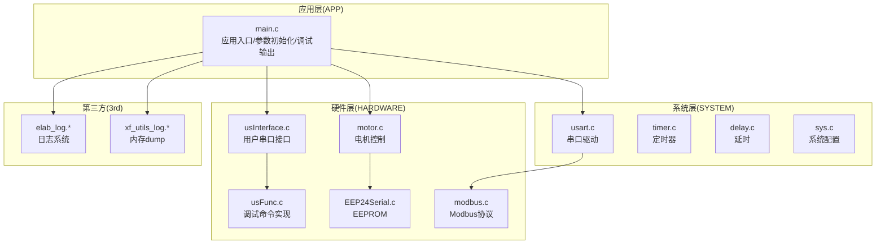
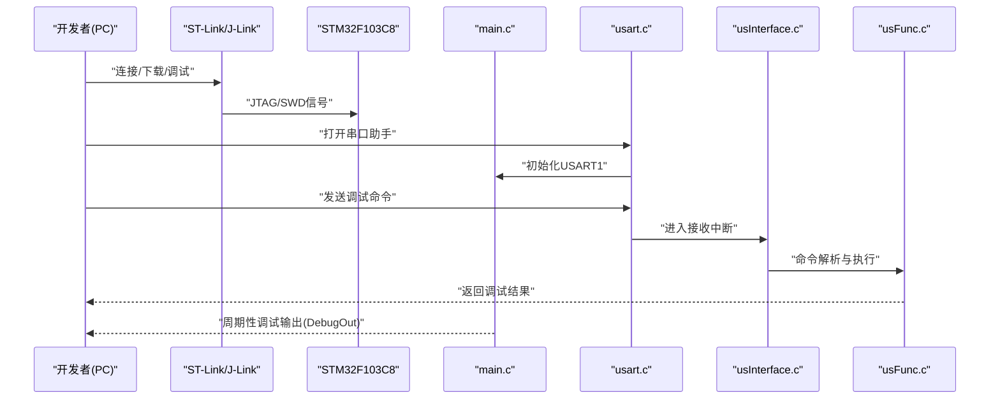
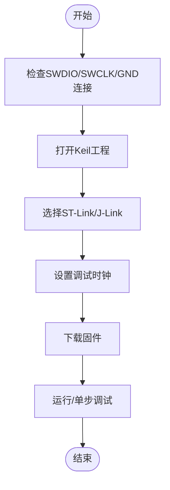
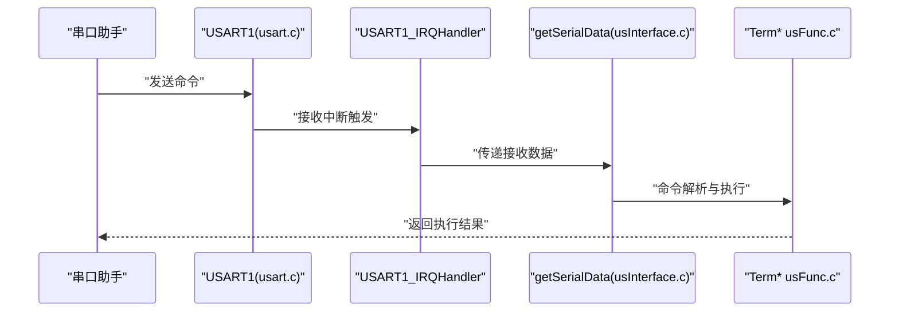
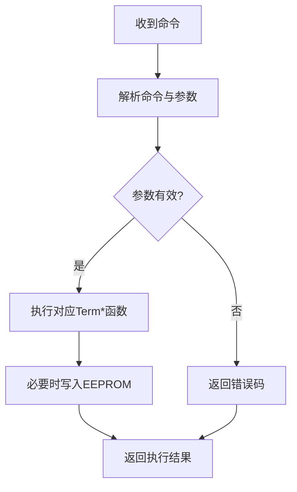
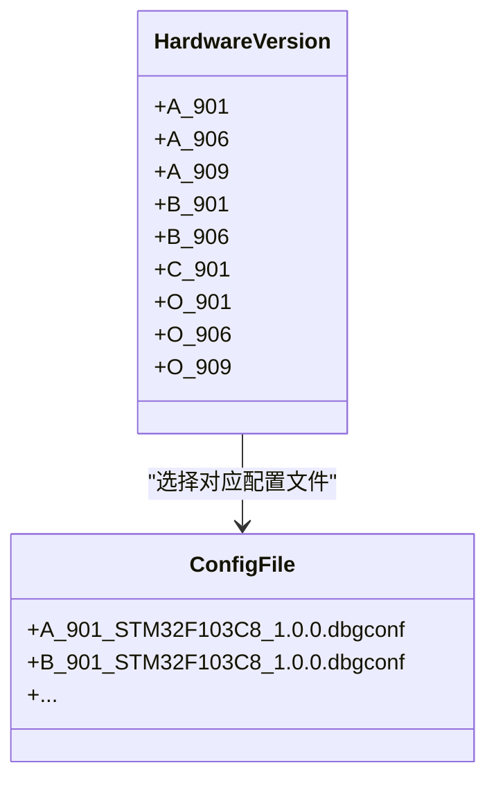
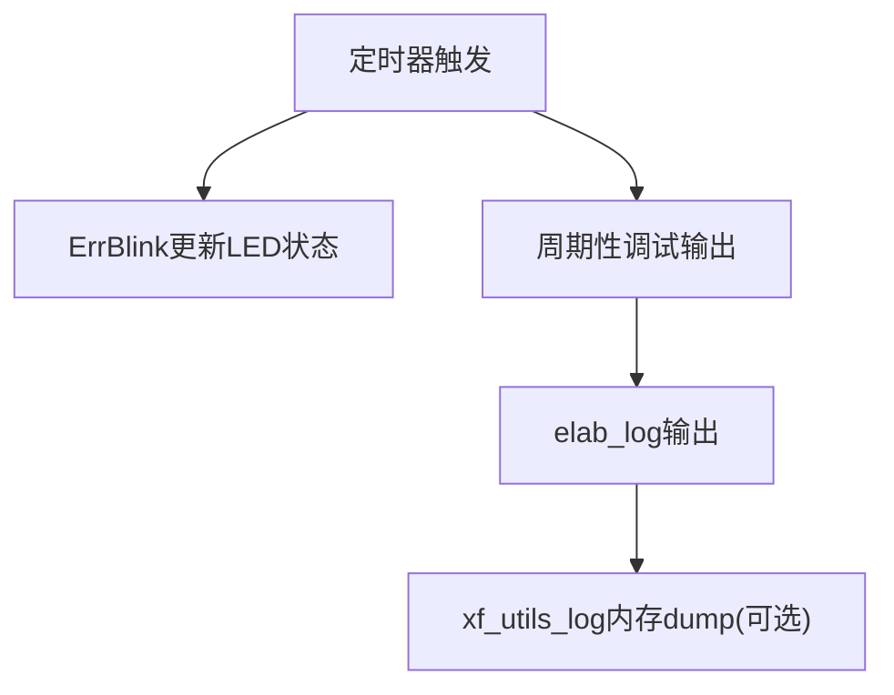
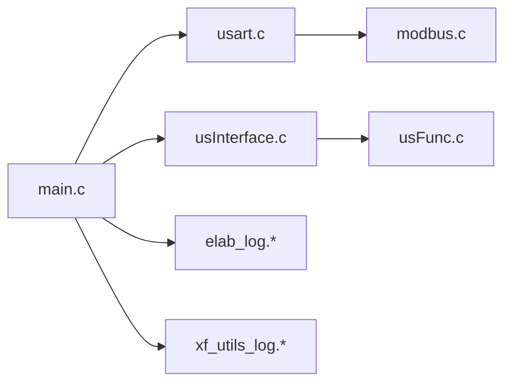

# 调试工具和配置

<cite>
**本文档引用的文件**
- [main.c](file://SRC/APP/main.c)
- [common.h](file://SRC/APP/common.h)
- [usart.c](file://SRC/SYSTEM/usart/usart.c)
- [usInterface.c](file://SRC/HARDWARE/usinterface/usInterface.c)
- [usFunc.c](file://SRC/HARDWARE/usinterface/usFunc.c)
- [motor.c](file://SRC/HARDWARE/motor/motor.c)
- [elab_log.h](file://SRC/3rd/common/elab_log.h)
- [elab_log.c](file://SRC/3rd/common/elab_log.c)
- [xf_utils_log.h](file://SRC/3rd/x fusion/xf_utils_log/xf_utils_log.h)
- [xf_utils_log_dump.c](file://SRC/3rd/x fusion/xf_utils_log/xf_utils_log_dump.c)
- [A_901_STM32F103C8_1.0.0.dbgconf](file://USER/DebugConfig/A_901_STM32F103C8_1.0.0.dbgconf)
- [B_901_STM32F103C8_1.0.0.dbgconf](file://USER/DebugConfig/B_901_STM32F103C8_1.0.0.dbgconf)
- [QHF.uvprojx](file://USER/QHF.uvprojx)
</cite>

## 目录
1. [简介](#简介)
2. [项目结构](#项目结构)
3. [核心组件](#核心组件)
4. [架构总览](#架构总览)
5. [详细组件分析](#详细组件分析)
6. [依赖关系分析](#依赖关系分析)
7. [性能考虑](#性能考虑)
8. [故障排除指南](#故障排除指南)
9. [结论](#结论)
10. [附录](#附录)

## 简介
本指南面向通用开关器项目的开发者，提供完整的调试工具链配置与使用说明，涵盖：
- JTAG调试器（ST-Link、J-Link）的连接与设置
- 串口调试配置与调试口指令（如RST复位、MOVES查询等）
- 逻辑分析仪使用与波形分析技巧
- 不同硬件版本（A/B/C/O等）的调试配置差异及调试配置文件使用
- 调试信息解读（LED状态、调试输出格式等）

## 项目结构
该项目基于STM32F103C8微控制器，采用分层架构组织代码：
- APP层：应用入口与主循环、参数初始化、调试输出
- SYSTEM层：串口、延时、系统时钟、定时器等基础驱动
- HARDWARE层：电机控制、EEPROM、Modbus协议栈、用户串口接口
- 3rd-party：第三方日志与内存dump工具

**图表来源**
- [main.c:433-494](file://SRC/APP/main.c#L433-L494)
- [usart.c:38-66](file://SRC/SYSTEM/usart/usart.c#L38-L66)
- [motor.c:4-68](file://SRC/HARDWARE/motor/motor.c#L4-L68)
- [usInterface.c:1-141](file://SRC/HARDWARE/usinterface/usInterface.c#L1-L141)
- [usFunc.c:116-123](file://SRC/HARDWARE/usinterface/usFunc.c#L116-L123)
- [elab_log.h:1-83](file://SRC/3rd/common/elab_log.h#L1-L83)
- [xf_utils_log.h:1-86](file://SRC/3rd/x fusion/xf_utils_log/xf_utils_log.h#L1-L86)

**章节来源**
- [main.c:433-494](file://SRC/APP/main.c#L433-L494)
- [common.h:1-170](file://SRC/APP/common.h#L1-L170)

## 核心组件
- JTAG调试与SWD设置：在应用入口处通过JTAG_Set控制SWD/JTAG使能，便于ST-Link/J-Link连接
- 串口调试：USART1作为调试串口，支持printf重定向与命令解析
- 用户串口接口：提供调试命令集，支持参数读写、复位、状态查询等
- 日志系统：提供彩色/带时间戳的日志输出，便于问题定位
- 内存dump：支持十六进制内存查看与ASCII辅助输出
- 电机与IO控制：提供LED状态指示与IO输出翻转等调试手段

**章节来源**
- [main.c:433-466](file://SRC/APP/main.c#L433-L466)
- [usart.c:38-66](file://SRC/SYSTEM/usart/usart.c#L38-L66)
- [usInterface.c:136-141](file://SRC/HARDWARE/usinterface/usInterface.c#L136-L141)
- [usFunc.c:116-123](file://SRC/HARDWARE/usinterface/usFunc.c#L116-L123)
- [elab_log.h:25-83](file://SRC/3rd/common/elab_log.h#L25-L83)
- [xf_utils_log.h:26-86](file://SRC/3rd/x fusion/xf_utils_log/xf_utils_log.h#L26-L86)

## 架构总览
调试工具链的关键交互如下：

**图表来源**
- [main.c:433-466](file://SRC/APP/main.c#L433-L466)
- [usart.c:74-83](file://SRC/SYSTEM/usart/usart.c#L74-L83)
- [usInterface.c:15-106](file://SRC/HARDWARE/usinterface/usInterface.c#L15-L106)
- [usFunc.c:753-778](file://SRC/HARDWARE/usinterface/usFunc.c#L753-L778)

## 详细组件分析

### JTAG调试器配置与使用
- SWD/JTAG使能：应用入口通过JTAG_Set控制SWD/JTAG使能，便于ST-Link/J-Link正常连接
- Keil工程设置：工程文件包含目标设备、Flash驱动、调试选项等，确保与硬件匹配
- ST-Link/J-Link连接：确认SWDIO、SWCLK、GND连接正确；在Keil中选择合适的调试器并设置时钟

**图表来源**
- [main.c:438-441](file://SRC/APP/main.c#L438-L441)
- [QHF.uvprojx:17-26](file://USER/QHF.uvprojx#L17-L26)

**章节来源**
- [main.c:438-441](file://SRC/APP/main.c#L438-L441)
- [QHF.uvprojx:17-26](file://USER/QHF.uvprojx#L17-L26)

### 串口调试配置
- USART1初始化：设置波特率、IO模式、中断使能，支持printf重定向
- 接收处理：串口中断解析收到的数据，交由用户串口接口处理
- 调试输出：主循环中可周期性输出状态信息，便于观察运行状态

**图表来源**
- [usart.c:74-83](file://SRC/SYSTEM/usart/usart.c#L74-L83)
- [usInterface.c:15-106](file://SRC/HARDWARE/usinterface/usInterface.c#L15-L106)
- [usFunc.c:753-778](file://SRC/HARDWARE/usinterface/usFunc.c#L753-L778)

**章节来源**
- [usart.c:38-66](file://SRC/SYSTEM/usart/usart.c#L38-L66)
- [usart.c:74-83](file://SRC/SYSTEM/usart/usart.c#L74-L83)
- [usInterface.c:136-141](file://SRC/HARDWARE/usinterface/usInterface.c#L136-L141)

### 用户串口调试命令（调试口指令）
常用调试命令（示例，具体以代码为准）：
- RST：复位开关器，重新初始化
- MOVES：查询或设置切换次数
- INSP：点检模式，打印关键参数
- VR：显示软件版本
- ADDR/CNT/BDR/SPD/ISET/RDCR/HALF/REPLY/PRTCL：参数读写与设置
- OUT：IO输出引脚翻转
- IIC：EEPROM读写测试
- FIXO/FIXG：原点与方向补偿读写

**图表来源**
- [usInterface.c:79-106](file://SRC/HARDWARE/usinterface/usInterface.c#L79-L106)
- [usFunc.c:116-123](file://SRC/HARDWARE/usinterface/usFunc.c#L116-L123)
- [usFunc.c:617-638](file://SRC/HARDWARE/usinterface/usFunc.c#L617-L638)

**章节来源**
- [usInterface.c:79-106](file://SRC/HARDWARE/usinterface/usInterface.c#L79-L106)
- [usFunc.c:753-778](file://SRC/HARDWARE/usinterface/usFunc.c#L753-L778)

### 逻辑分析仪使用与波形分析
- 触发事件：电机动作、IO翻转、通信帧开始/结束等
- 采样设置：根据波特率与信号频率设置合适采样率
- 关注要点：高低电平持续时间、边沿对齐、帧格式（起始/停止位、校验位）、应答时序
- 结合调试命令：通过OUT、RST、MOVES等命令触发特定事件，便于捕获关键波形

**章节来源**
- [motor.c:53-56](file://SRC/HARDWARE/motor/motor.c#L53-L56)
- [usFunc.c:604-612](file://SRC/HARDWARE/usinterface/usFunc.c#L604-L612)

### 不同硬件版本的调试配置差异
- 版本宏定义：通过A_901、A_906、A_909、B_901、B_906、C_901、O_901、O_906、O_909等宏区分硬件版本
- IO控制与方向：不同版本的IO_RS、RS232_485_CONTROL、DIRECTION_SWITCH等配置影响IO行为
- 调试配置文件：USER/DebugConfig目录下的dbgconf文件用于配置DBGMCU_CR寄存器，影响调试时的外设行为

**图表来源**
- [common.h:42-134](file://SRC/APP/common.h#L42-L134)
- [A_901_STM32F103C8_1.0.0.dbgconf:1-37](file://USER/DebugConfig/A_901_STM32F103C8_1.0.0.dbgconf#L1-L37)
- [B_901_STM32F103C8_1.0.0.dbgconf:1-37](file://USER/DebugConfig/B_901_STM32F103C8_1.0.0.dbgconf#L1-L37)

**章节来源**
- [common.h:42-134](file://SRC/APP/common.h#L42-L134)
- [A_901_STM32F103C8_1.0.0.dbgconf:1-37](file://USER/DebugConfig/A_901_STM32F103C8_1.0.0.dbgconf#L1-L37)
- [B_901_STM32F103C8_1.0.0.dbgconf:1-37](file://USER/DebugConfig/B_901_STM32F103C8_1.0.0.dbgconf#L1-L37)

### 调试信息解读与LED状态
- LED工作指示：ErrBlink函数按设定周期翻转LED，错误时闪烁模式不同
- 调试输出：DebugOut周期性输出状态信息，结合参数初始化输出便于理解当前状态
- 日志系统：elab_log提供彩色/带时间戳日志，便于快速定位问题
- 内存dump：xf_utils_log支持十六进制内存查看，便于分析数据结构与通信缓冲

**图表来源**
- [main.c:512-520](file://SRC/APP/main.c#L512-L520)
- [main.c:496-510](file://SRC/APP/main.c#L496-L510)
- [elab_log.c:54-81](file://SRC/3rd/common/elab_log.c#L54-L81)
- [xf_utils_log_dump.c:40-155](file://SRC/3rd/x fusion/xf_utils_log/xf_utils_log_dump.c#L40-L155)

**章节来源**
- [main.c:512-520](file://SRC/APP/main.c#L512-L520)
- [main.c:496-510](file://SRC/APP/main.c#L496-L510)
- [elab_log.h:25-83](file://SRC/3rd/common/elab_log.h#L25-L83)
- [xf_utils_log.h:26-86](file://SRC/3rd/x fusion/xf_utils_log/xf_utils_log.h#L26-L86)

## 依赖关系分析
- main.c依赖USART、电机控制、用户串口接口、日志系统等模块
- usInterface.c依赖usFunc.c实现具体命令
- usart.c提供底层串口收发与中断服务
- 日志与内存dump为调试辅助工具，可按需启用

**图表来源**
- [main.c:433-494](file://SRC/APP/main.c#L433-L494)
- [usart.c:38-66](file://SRC/SYSTEM/usart/usart.c#L38-L66)
- [usInterface.c:1-141](file://SRC/HARDWARE/usinterface/usInterface.c#L1-L141)
- [usFunc.c:1-800](file://SRC/HARDWARE/usinterface/usFunc.c#L1-L800)
- [elab_log.h:1-83](file://SRC/3rd/common/elab_log.h#L1-L83)
- [xf_utils_log.h:1-86](file://SRC/3rd/x fusion/xf_utils_log/xf_utils_log.h#L1-L86)

**章节来源**
- [main.c:433-494](file://SRC/APP/main.c#L433-L494)
- [usInterface.c:1-141](file://SRC/HARDWARE/usinterface/usInterface.c#L1-L141)
- [usFunc.c:1-800](file://SRC/HARDWARE/usinterface/usFunc.c#L1-L800)

## 性能考虑
- 串口波特率设置：根据需求选择合适波特率，避免过高导致误码，过低影响效率
- 调试输出频率：DebugOut周期性输出需平衡信息量与CPU占用
- 中断优先级：USART中断优先级设置影响实时性与稳定性
- 日志级别：生产环境可降低日志级别以减少开销

## 故障排除指南
- 无法连接调试器：检查SWDIO/SWCLK/GND连接，确认JTAG_Set设置，更换USB线或调试器
- 串口无输出：确认USART1初始化、波特率设置、串口助手设置（回车发送、波特率一致）
- 命令无响应：检查命令格式、参数个数与长度，确认接收超时处理逻辑
- LED不闪烁：检查ErrBlink时间间隔与定时器配置
- EEPROM读写失败：使用IIC命令进行读写验证，检查I2C引脚与上拉电阻

**章节来源**
- [usart.c:38-66](file://SRC/SYSTEM/usart/usart.c#L38-L66)
- [usInterface.c:109-131](file://SRC/HARDWARE/usinterface/usInterface.c#L109-L131)
- [usFunc.c:70-110](file://SRC/HARDWARE/usinterface/usFunc.c#L70-L110)
- [main.c:512-520](file://SRC/APP/main.c#L512-L520)

## 结论
通过合理配置JTAG调试器、串口调试与用户命令接口，并结合日志与内存dump工具，开发者可以高效定位与解决通用开关器在不同硬件版本下的问题。建议在开发阶段充分利用调试命令与周期性调试输出，在发布阶段适当降低调试输出与日志级别以优化性能。

## 附录
- 调试配置文件路径：USER/DebugConfig/*.dbgconf
- Keil工程文件：USER/QHF.uvprojx
- 常用命令参考：RST、MOVES、INSP、VR、ADDR/CNT/BDR/SPD/ISET/RDCR/HALF/REPLY/PRTCL、OUT、IIC、FIXO/FIXG