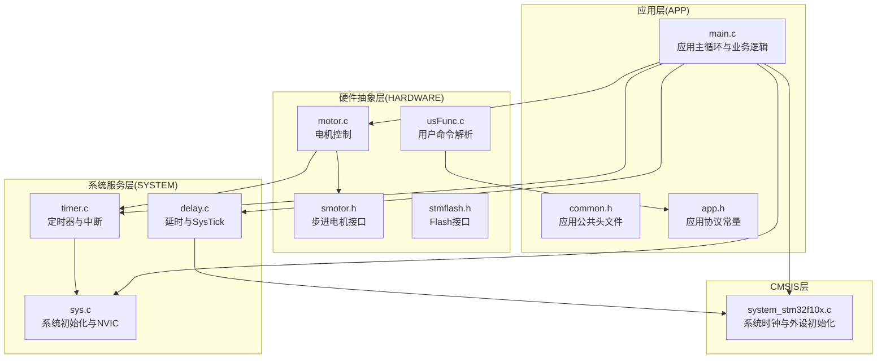
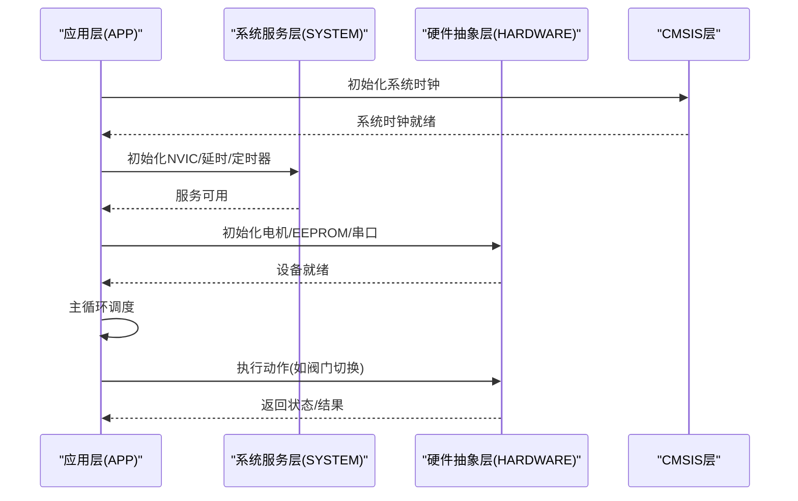
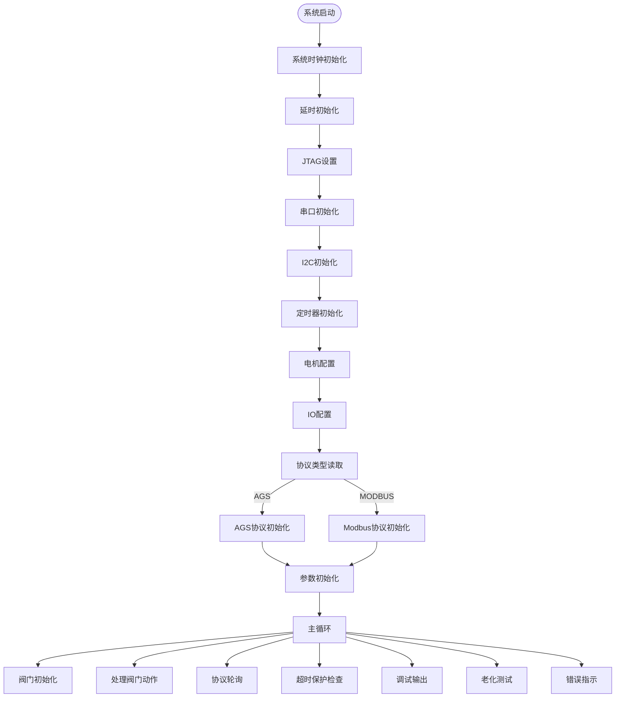
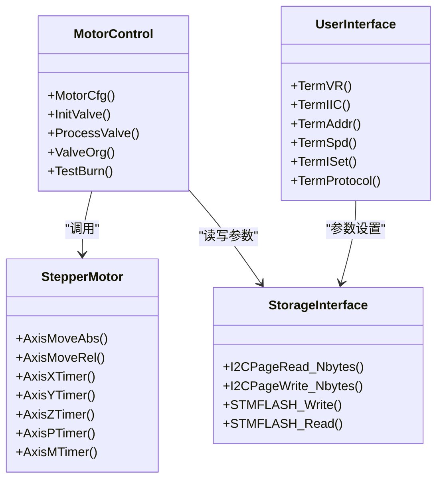
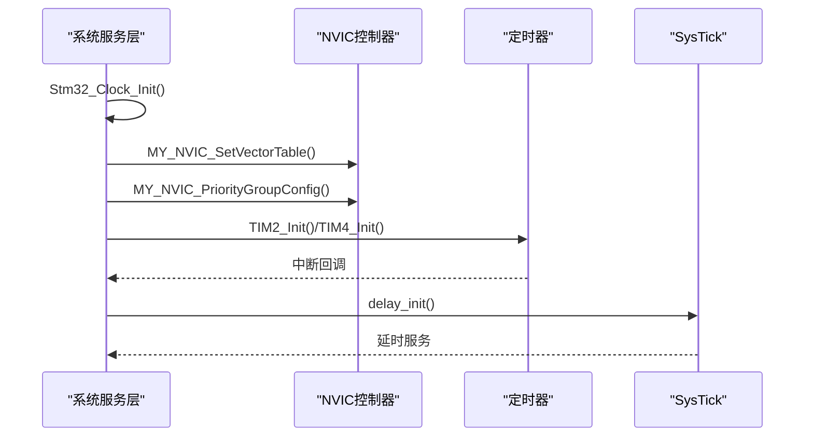
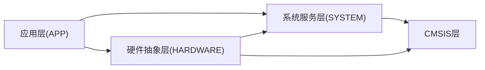

# 分层架构设计

<cite>
**本文档引用的文件**
- [main.c](file://SRC/APP/main.c)
- [app.h](file://SRC/APP/app.h)
- [common.h](file://SRC/APP/common.h)
- [motor.c](file://SRC/HARDWARE/motor/motor.c)
- [smotor.h](file://SRC/HARDWARE/motor/smotor.h)
- [sys.c](file://SRC/SYSTEM/sys/sys.c)
- [delay.c](file://SRC/SYSTEM/delay/delay.c)
- [timer.c](file://SRC/SYSTEM/timer/timer.c)
- [system_stm32f10x.c](file://SRC/CMSIS/DeviceSupport/system_stm32f10x.c)
- [usFunc.c](file://SRC/HARDWARE/usinterface/usFunc.c)
- [stmflash.h](file://SRC/HARDWARE/stmFlash/stmflash.h)
- [elab_common.h](file://SRC/3rd/common/elab_common.h)
- [elab_log.h](file://SRC/3rd/common/elab_log.h)
</cite>

## 目录
1. [简介](#简介)
2. [项目结构](#项目结构)
3. [核心组件](#核心组件)
4. [架构总览](#架构总览)
5. [详细组件分析](#详细组件分析)
6. [依赖关系分析](#依赖关系分析)
7. [性能考虑](#性能考虑)
8. [故障排查指南](#故障排查指南)
9. [结论](#结论)

## 简介
本项目采用四层架构设计，自底向上分别为：
- CMSIS层：提供标准外设驱动与系统时钟初始化
- 系统服务层（SYSTEM）：封装底层系统功能（时钟、中断、延时、NVIC等）
- 硬件抽象层（HARDWARE）：封装具体硬件设备接口（电机、EEPROM、串口等）
- 应用层（APP）：实现业务逻辑与系统控制

该架构通过清晰的职责边界与接口定义，实现了模块独立性、可测试性与可维护性，同时兼顾实时性与资源效率。

## 项目结构
项目采用按层次组织的目录结构，各层职责明确：
- APP层：应用主程序、公共头文件、应用协议常量
- SYSTEM层：系统初始化、延时、定时器、USART、SYS控制
- HARDWARE层：电机控制、EEPROM、串口接口、Flash存储
- CMSIS层：标准外设驱动与系统初始化
- 3rd层：第三方库（日志、工具）

**图表来源**
- [main.c:433-494](file://SRC/APP/main.c#L433-L494)
- [motor.c:1-463](file://SRC/HARDWARE/motor/motor.c#L1-L463)
- [timer.c:1-223](file://SRC/SYSTEM/timer/timer.c#L1-L223)
- [delay.c:1-160](file://SRC/SYSTEM/delay/delay.c#L1-L160)
- [sys.c:1-201](file://SRC/SYSTEM/sys/sys.c#L1-L201)
- [system_stm32f10x.c:212-269](file://SRC/CMSIS/DeviceSupport/system_stm32f10x.c#L212-L269)

**章节来源**
- [main.c:433-494](file://SRC/APP/main.c#L433-L494)
- [common.h:155-169](file://SRC/APP/common.h#L155-L169)

## 核心组件
- 应用主循环与业务控制：负责系统初始化、协议栈选择、参数初始化、主循环调度与异常处理
- 电机控制模块：实现阀门初始化、寻位、运行与保护逻辑
- 系统服务模块：提供系统时钟、NVIC、SysTick延时、定时器中断等基础能力
- 硬件抽象模块：封装GPIO、I2C、USART、Flash等外设访问
- CMSIS系统初始化：提供标准的系统时钟配置与外设初始化入口

**章节来源**
- [main.c:433-494](file://SRC/APP/main.c#L433-L494)
- [motor.c:73-351](file://SRC/HARDWARE/motor/motor.c#L73-L351)
- [sys.c:152-172](file://SRC/SYSTEM/sys/sys.c#L152-L172)
- [system_stm32f10x.c:212-269](file://SRC/CMSIS/DeviceSupport/system_stm32f10x.c#L212-L269)

## 架构总览
四层架构通过清晰的依赖关系实现解耦：
- APP层仅依赖SYSTEM与HARDWARE提供的稳定接口，不直接操作底层寄存器
- HARDWARE层封装具体硬件细节，向上提供统一的设备接口
- SYSTEM层提供系统级服务，屏蔽CMSIS差异
- CMSIS层提供标准外设访问与系统初始化

**图表来源**
- [main.c:433-494](file://SRC/APP/main.c#L433-L494)
- [sys.c:152-172](file://SRC/SYSTEM/sys/sys.c#L152-L172)
- [system_stm32f10x.c:212-269](file://SRC/CMSIS/DeviceSupport/system_stm32f10x.c#L212-L269)

## 详细组件分析

### 应用层（APP）分析
应用层负责系统控制与业务逻辑，主要职责：
- 系统初始化：时钟、延时、JTAG、串口、I2C、定时器、电机配置、IO配置
- 参数管理：从EEPROM读取/写入系统参数，支持多种协议类型
- 协议栈集成：根据协议类型初始化AGS或Modbus协议栈
- 主循环：执行阀门初始化、处理阀门动作、协议轮询、超时保护、调试输出

**图表来源**
- [main.c:433-494](file://SRC/APP/main.c#L433-L494)
- [main.c:222-429](file://SRC/APP/main.c#L222-L429)
- [main.c:478-493](file://SRC/APP/main.c#L478-L493)

**章节来源**
- [main.c:433-494](file://SRC/APP/main.c#L433-L494)
- [app.h:1-37](file://SRC/APP/app.h#L1-L37)

### 硬件抽象层（HARDWARE）分析
硬件抽象层封装具体硬件设备，主要职责：
- 电机控制：实现阀门初始化、寻位、相对/绝对移动、急停与保护
- 用户接口：命令解析与参数设置（地址、波特率、速度、电流等）
- 存储接口：EEPROM与Flash读写封装
- 设备配置：GPIO、I2C、USART等外设配置

**图表来源**
- [motor.c:4-68](file://SRC/HARDWARE/motor/motor.c#L4-L68)
- [motor.c:73-351](file://SRC/HARDWARE/motor/motor.c#L73-L351)
- [smotor.h:67-96](file://SRC/HARDWARE/motor/smotor.h#L67-L96)
- [usFunc.c:7-22](file://SRC/HARDWARE/usinterface/usFunc.c#L7-L22)
- [stmflash.h:19-32](file://SRC/HARDWARE/stmFlash/stmflash.h#L19-L32)

**章节来源**
- [motor.c:73-351](file://SRC/HARDWARE/motor/motor.c#L73-L351)
- [smotor.h:1-100](file://SRC/HARDWARE/motor/smotor.h#L1-L100)
- [usFunc.c:1-834](file://SRC/HARDWARE/usinterface/usFunc.c#L1-L834)
- [stmflash.h:1-53](file://SRC/HARDWARE/stmFlash/stmflash.h#L1-L53)

### 系统服务层（SYSTEM）分析
系统服务层提供系统级基础设施，主要职责：
- 系统初始化：时钟配置、向量表设置、NVIC分组配置
- 中断管理：NVIC初始化、中断优先级设置、外部中断配置
- 延时与SysTick：基于SysTick的微秒/毫秒延时
- 定时器服务：多路定时器初始化与中断处理

**图表来源**
- [sys.c:8-49](file://SRC/SYSTEM/sys/sys.c#L8-L49)
- [sys.c:152-172](file://SRC/SYSTEM/sys/sys.c#L152-L172)
- [delay.c:23-42](file://SRC/SYSTEM/delay/delay.c#L23-L42)
- [timer.c:11-19](file://SRC/SYSTEM/timer/timer.c#L11-L19)

**章节来源**
- [sys.c:1-201](file://SRC/SYSTEM/sys/sys.c#L1-L201)
- [delay.c:1-160](file://SRC/SYSTEM/delay/delay.c#L1-L160)
- [timer.c:1-223](file://SRC/SYSTEM/timer/timer.c#L1-L223)

### CMSIS层分析
CMSIS层提供标准外设访问与系统初始化，主要职责：
- 系统时钟初始化：根据配置设置PLL、AHB/APB分频与Flash等待周期
- 系统变量更新：SystemCoreClock计算与更新
- 外设初始化：向量表重定位、外部SRAM配置（可选）

**章节来源**
- [system_stm32f10x.c:212-269](file://SRC/CMSIS/DeviceSupport/system_stm32f10x.c#L212-L269)
- [system_stm32f10x.c:306-412](file://SRC/CMSIS/DeviceSupport/system_stm32f10x.c#L306-L412)

## 依赖关系分析
四层架构的依赖关系呈现自顶向下逐层依赖的特点：
- APP层依赖SYSTEM与HARDWARE层提供的稳定接口
- HARDWARE层依赖SYSTEM层的系统服务与CMSIS层的标准外设
- SYSTEM层依赖CMSIS层的系统初始化与外设驱动
- CMSIS层提供标准的系统初始化入口

**图表来源**
- [common.h:155-169](file://SRC/APP/common.h#L155-L169)
- [motor.c:1-463](file://SRC/HARDWARE/motor/motor.c#L1-L463)
- [sys.c:1-201](file://SRC/SYSTEM/sys/sys.c#L1-L201)

**章节来源**
- [common.h:155-169](file://SRC/APP/common.h#L155-L169)

## 性能考虑
- 实时性保障：通过定时器中断与SysTick实现精确的时间基准，定时器中断处理中调用协议栈轮询与电机定时器回调
- 资源优化：使用宏定义与条件编译支持不同硬件版本，减少不必要的代码开销
- 异常处理：超时保护机制防止长时间堵转损坏电路，错误状态通过LED闪烁指示
- 通信效率：支持多种协议（AGS、Modbus），通过参数配置灵活适配不同应用场景

## 故障排查指南
- 超时保护：当阀门运行或初始化超时，系统会自动停止电机并进入错误状态，检查机械负载与传感器连接
- 参数校验：参数设置时有严格的范围检查，超出范围会回退到默认值，可通过点检模式查看当前参数
- 通信问题：通过用户命令接口进行I2C读写测试，验证EEPROM通信链路
- 硬件版本：不同硬件版本的IO配置与方向开关可能不同，需确认宏定义配置正确

**章节来源**
- [motor.c:180-201](file://SRC/HARDWARE/motor/motor.c#L180-L201)
- [usFunc.c:644-671](file://SRC/HARDWARE/usinterface/usFunc.c#L644-L671)

## 结论
本项目采用的四层架构设计有效实现了职责分离与模块解耦，通过清晰的接口定义与稳定的依赖关系，提升了系统的可维护性与可扩展性。应用层专注于业务逻辑，硬件抽象层屏蔽硬件差异，系统服务层提供基础设施，CMSIS层提供标准外设访问，形成了高效、可靠的嵌入式控制系统架构。