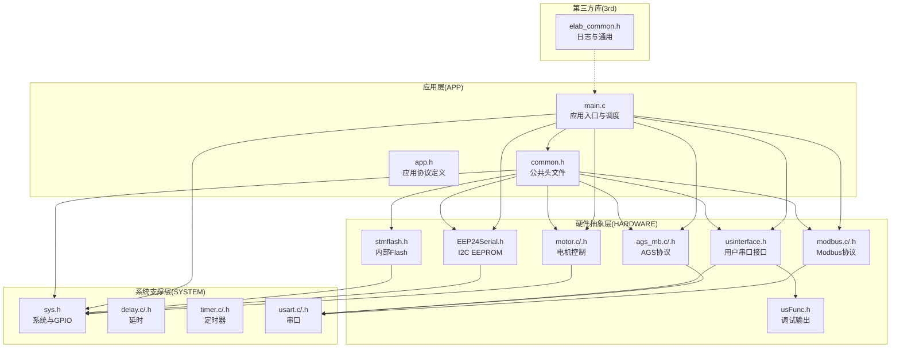
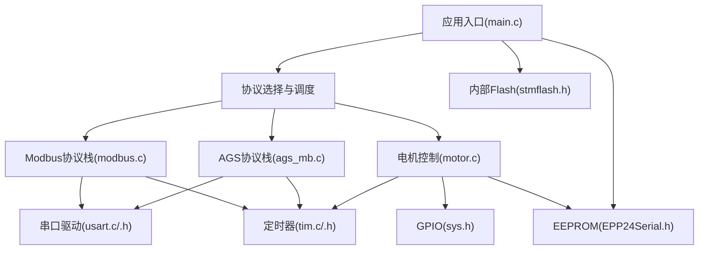
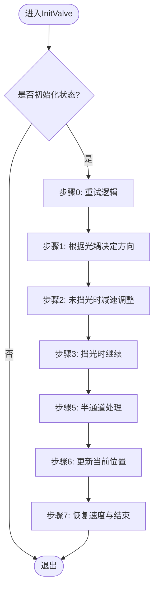
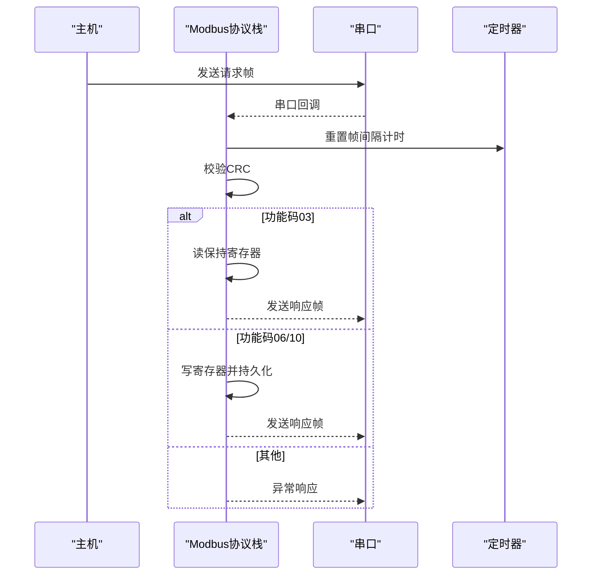
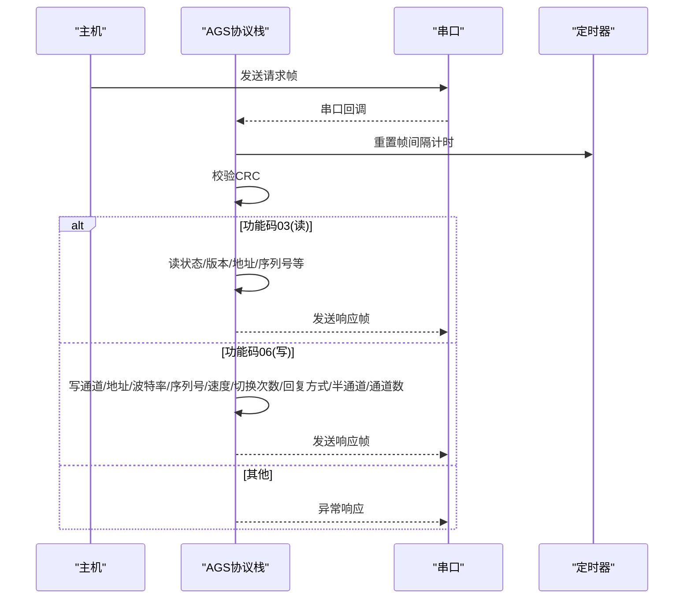
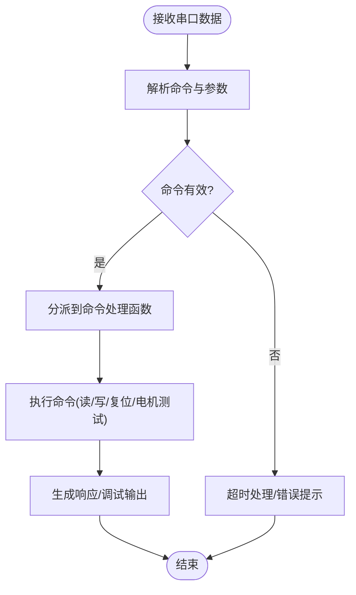
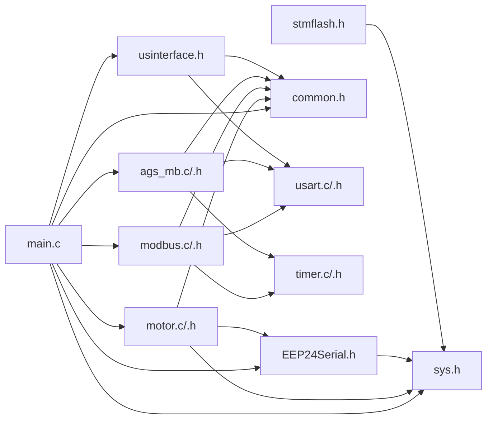

# 模块化组织结构

<cite>
**本文档引用的文件**
- [main.c](file://SRC/APP/main.c)
- [main.h](file://SRC/APP/main.h)
- [common.h](file://SRC/APP/common.h)
- [motor.c](file://SRC/HARDWARE/motor/motor.c)
- [motor.h](file://SRC/HARDWARE/motor/motor.h)
- [modbus.c](file://SRC/HARDWARE/modbus/modbus.c)
- [modbus.h](file://SRC/HARDWARE/modbus/modbus.h)
- [usinterface.h](file://SRC/HARDWARE/usinterface/usinterface.h)
- [usFunc.h](file://SRC/HARDWARE/usinterface/usFunc.h)
- [EEP24Serial.h](file://SRC/HARDWARE/EEPROM/EEP24Serial.h)
- [sys.h](file://SRC/SYSTEM/sys/sys.h)
- [ags_mb.h](file://SRC/HARDWARE/ags_mb/ags_mb.h)
- [ags_mb.c](file://SRC/HARDWARE/ags_mb/ags_mb.c)
- [stmflash.h](file://SRC/HARDWARE/stmFlash/stmflash.h)
- [elab_common.h](file://SRC/3rd/common/elab_common.h)
</cite>

## 目录
1. [简介](#简介)
2. [项目结构](#项目结构)
3. [核心组件](#核心组件)
4. [架构总览](#架构总览)
5. [详细组件分析](#详细组件分析)
6. [依赖分析](#依赖分析)
7. [性能考虑](#性能考虑)
8. [故障排查指南](#故障排查指南)
9. [结论](#结论)
10. [附录](#附录)

## 简介
本项目为通用开关器控制器，采用模块化设计，将系统划分为多个职责清晰、边界明确的功能模块，包括：应用入口与系统调度模块、电机控制模块、通信协议模块（Modbus与AGS协议）、硬件抽象与外设驱动模块、用户串口调试接口模块、以及参数存储与系统服务模块。模块间通过标准化接口耦合，实现代码重用、并行开发与独立测试，满足多硬件平台与多种通信协议的适配需求。

## 项目结构
项目采用按功能域分层的目录组织方式，顶层目录包含应用层、硬件抽象层、系统支撑层与第三方库：

- 应用层（APP）：应用入口、公共头文件与全局配置
- 硬件抽象层（HARDWARE）：电机控制、通信协议、用户接口、EEPROM、STM32 Flash等
- 系统支撑层（SYSTEM）：延时、系统、定时器、串口等基础功能
- 第三方库（3rd）：日志与工具库



**图表来源**
- [main.c:433-494](file://SRC/APP/main.c#L433-L494)
- [common.h:155-173](file://SRC/APP/common.h#L155-L173)
- [motor.c:4-68](file://SRC/HARDWARE/motor/motor.c#L4-L68)
- [modbus.c:35-67](file://SRC/HARDWARE/modbus/modbus.c#L35-L67)
- [ags_mb.c:7-73](file://SRC/HARDWARE/ags_mb/ags_mb.c#L7-L73)

**章节来源**
- [main.c:433-494](file://SRC/APP/main.c#L433-L494)
- [common.h:155-173](file://SRC/APP/common.h#L155-L173)

## 核心组件
本节概述各模块的职责与接口边界，强调模块的独立性与封装性。

- 应用入口与系统调度模块（APP）
  - 负责系统初始化、协议选择、主循环调度、参数读取与保存、IO控制与超时保护等
  - 关键接口：main、ParameterInit、EnableReceive、DisableReceive、DebugOut、ErrBlink、TestBurn
  - 依赖：通信协议模块、电机控制模块、EEPROM、系统时钟与串口

- 电机控制模块（HARDWARE/motor）
  - 负责步进电机硬件配置、初始化、寻位、运行与急停、老化测试等
  - 关键接口：MotorCfg、InitValve、ProcessValve、ValveOrg、TestBurn
  - 依赖：系统GPIO、定时器、EEPROM、公共头文件

- 通信协议模块（HARDWARE/modbus 与 HARDWARE/ags_mb）
  - 提供Modbus与AGS两种通信协议栈，负责帧解析、CRC校验、寄存器读写、错误处理与发送
  - 关键接口：mb_Init/mb_Poll、ags_mbInit/ags_mbProcess、ModbusCRC16
  - 依赖：串口、定时器、EEPROM、公共头文件

- 用户串口调试接口模块（HARDWARE/usinterface 与 HARDWARE/usFunc）
  - 提供命令注册、解析、超时处理与调试输出，支持批量参数读写
  - 关键接口：UsrCmdAnalyse、RegisterCmds、TermList/TermVR/TermMap/TermIIC/TermReset/TermMotorX、UsrCmdInit
  - 依赖：串口、公共头文件

- 硬件抽象与外设驱动模块（SYSTEM 与 HARDWARE/stmFlash）
  - 提供系统时钟、GPIO位带操作、延时、定时器、串口初始化与内部Flash读写
  - 关键接口：Stm32_Clock_Init、JTAG_Set、delay_ms/delay_us、TIMx_Init、Usartx_Init、STMFLASH_*等
  - 依赖：CMSIS设备支持

- 参数存储与系统服务模块（HARDWARE/EEPROM 与 HARDWARE/stmFlash）
  - 提供I2C页写/读与内部Flash读写，用于参数持久化与固件升级
  - 关键接口：I2CPageRead_Nbytes/I2CPageWrite_Nbytes、STMFLASH_*等
  - 依赖：I2C与内部Flash控制器

**章节来源**
- [main.c:12-201](file://SRC/APP/main.c#L12-L201)
- [motor.c:4-463](file://SRC/HARDWARE/motor/motor.c#L4-L463)
- [modbus.c:35-776](file://SRC/HARDWARE/modbus/modbus.c#L35-L776)
- [ags_mb.c:7-474](file://SRC/HARDWARE/ags_mb/ags_mb.c#L7-L474)
- [usinterface.h:44-95](file://SRC/HARDWARE/usinterface/usinterface.h#L44-L95)
- [usFunc.h:10-55](file://SRC/HARDWARE/usinterface/usFunc.h#L10-L55)
- [sys.h:73-99](file://SRC/SYSTEM/sys/sys.h#L73-L99)
- [EEP24Serial.h:29-38](file://SRC/HARDWARE/EEPROM/EEP24Serial.h#L29-L38)
- [stmflash.h:19-35](file://SRC/HARDWARE/stmFlash/stmflash.h#L19-L35)

## 架构总览
系统采用“应用调度 + 多协议 + 硬件抽象”的分层架构。应用层统一调度协议栈与电机控制，协议栈通过串口与定时器与硬件交互，电机控制通过GPIO与定时器驱动步进电机，参数通过EEPROM与内部Flash持久化。



**图表来源**
- [main.c:466-494](file://SRC/APP/main.c#L466-L494)
- [modbus.c:35-67](file://SRC/HARDWARE/modbus/modbus.c#L35-L67)
- [ags_mb.c:7-73](file://SRC/HARDWARE/ags_mb/ags_mb.c#L7-L73)
- [motor.c:4-68](file://SRC/HARDWARE/motor/motor.c#L4-L68)

## 详细组件分析

### 应用入口与系统调度模块
- 职责
  - 初始化系统时钟、延时、JTAG、串口、定时器、电机与IO配置
  - 根据协议类型初始化对应协议栈（AGS或Modbus）
  - 参数初始化与EEPROM读写、协议轮询、周期性检测与错误指示
- 关键流程
  - 系统初始化 → 协议初始化 → 参数初始化 → 主循环（初始化阀门、处理阀门、协议轮询、周期检测、调试输出）

```mermaid
sequenceDiagram
participant Main as "main.c"
participant Sys as "系统初始化"
participant Proto as "协议初始化"
participant Param as "参数初始化"
participant Loop as "主循环"
Main->>Sys : 初始化时钟/延时/JTAG/串口/定时器
Main->>Proto : 依据协议类型初始化AGS或Modbus
Main->>Param : 读取/写入EEPROM参数
loop 每个主循环周期
Main->>Loop : 调用InitValve/ProcessValve
Main->>Loop : 协议轮询(AGS/Modbus)
Main->>Loop : 周期检测与错误指示
end
```

**图表来源**
- [main.c:433-494](file://SRC/APP/main.c#L433-L494)
- [main.c:222-429](file://SRC/APP/main.c#L222-L429)

**章节来源**
- [main.c:433-494](file://SRC/APP/main.c#L433-L494)
- [main.c:222-429](file://SRC/APP/main.c#L222-L429)

### 电机控制模块
- 职责
  - 配置电机驱动引脚与光耦信号，实现初始化寻位、通道切换、半通道复位、急停与老化测试
- 关键流程
  - 初始化：根据光耦信号确定旋转方向，执行相对/绝对移动，完成原点校准与状态更新
  - 运行：根据目标位置计算步数，执行相对/绝对移动，更新当前位置与切换次数



**图表来源**
- [motor.c:73-268](file://SRC/HARDWARE/motor/motor.c#L73-L268)

**章节来源**
- [motor.c:4-463](file://SRC/HARDWARE/motor/motor.c#L4-L463)
- [motor.h:151-237](file://SRC/HARDWARE/motor/motor.h#L151-L237)

### 通信协议模块（Modbus）
- 职责
  - 实现Modbus RTU帧解析、CRC校验、功能码处理（读保持寄存器、写单个/多个寄存器），并维护保持寄存器数组
- 关键流程
  - 初始化串口与定时器，设置波特率与帧间隔
  - 接收数据帧，校验CRC，根据功能码分派处理，构造响应帧并发送



**图表来源**
- [modbus.c:35-130](file://SRC/HARDWARE/modbus/modbus.c#L35-L130)
- [modbus.c:469-517](file://SRC/HARDWARE/modbus/modbus.c#L469-L517)

**章节来源**
- [modbus.c:35-776](file://SRC/HARDWARE/modbus/modbus.c#L35-L776)
- [modbus.h:205-213](file://SRC/HARDWARE/modbus/modbus.h#L205-L213)

### 通信协议模块（AGS协议）
- 职责
  - 基于Modbus的扩展协议，提供状态读取、参数读写、通道切换、复位、老化模式等功能
- 关键流程
  - 初始化串口与定时器，设置波特率
  - 接收帧，校验CRC，根据功能码与操作码处理读写请求，构造响应帧



**图表来源**
- [ags_mb.c:7-73](file://SRC/HARDWARE/ags_mb/ags_mb.c#L7-L73)
- [ags_mb.c:426-473](file://SRC/HARDWARE/ags_mb/ags_mb.c#L426-L473)

**章节来源**
- [ags_mb.c:7-474](file://SRC/HARDWARE/ags_mb/ags_mb.c#L7-L474)
- [ags_mb.h:149-163](file://SRC/HARDWARE/ags_mb/ags_mb.h#L149-L163)

### 用户串口调试接口模块
- 职责
  - 提供命令注册与解析、超时处理、调试输出与参数读写接口
- 关键接口
  - 注册命令：RegisterCmds
  - 命令解析：UsrCmdAnalyse
  - 调试输出：TermList/TermVR/TermMap/TermIIC/TermReset/TermMotorX
  - 参数提取：FetchChar/FetchInt/UnEqFetchChar/UnEqFetchInt



**图表来源**
- [usinterface.h:58-95](file://SRC/HARDWARE/usinterface/usinterface.h#L58-L95)
- [usFunc.h:42-55](file://SRC/HARDWARE/usinterface/usFunc.h#L42-L55)

**章节来源**
- [usinterface.h:44-95](file://SRC/HARDWARE/usinterface/usinterface.h#L44-L95)
- [usFunc.h:10-55](file://SRC/HARDWARE/usinterface/usFunc.h#L10-L55)

### 硬件抽象与外设驱动模块
- 职责
  - 提供系统时钟、GPIO位带操作、延时、定时器、串口初始化与内部Flash读写
- 关键接口
  - 系统与GPIO：Stm32_Clock_Init、JTAG_Set、位带宏
  - 延时与定时器：delay_ms/delay_us、TIMx_Init
  - 串口：Usartx_Init
  - 内部Flash：STMFLASH_*系列

**章节来源**
- [sys.h:73-99](file://SRC/SYSTEM/sys/sys.h#L73-L99)

### 参数存储与系统服务模块
- 职责
  - 提供EEPROM页读写与内部Flash读写接口，用于参数持久化与固件升级
- 关键接口
  - EEPROM：I2CPageRead_Nbytes/I2CPageWrite_Nbytes
  - 内部Flash：STMFLASH_Write/Read/Erase等

**章节来源**
- [EEP24Serial.h:29-38](file://SRC/HARDWARE/EEPROM/EEP24Serial.h#L29-L38)
- [stmflash.h:19-35](file://SRC/HARDWARE/stmFlash/stmflash.h#L19-L35)

## 依赖分析
模块间依赖遵循“自顶向下、接口清晰、单向依赖”的原则，避免循环依赖。



**图表来源**
- [common.h:155-173](file://SRC/APP/common.h#L155-L173)
- [motor.c:4-68](file://SRC/HARDWARE/motor/motor.c#L4-L68)
- [modbus.c:35-67](file://SRC/HARDWARE/modbus/modbus.c#L35-L67)
- [ags_mb.c:7-73](file://SRC/HARDWARE/ags_mb/ags_mb.c#L7-L73)

**章节来源**
- [common.h:155-173](file://SRC/APP/common.h#L155-L173)

## 性能考虑
- 串口与定时器
  - 通过定时器精确控制帧间隔与波特率，避免Modbus/AGS协议的时序误差
- 电机控制
  - 使用相对/绝对移动策略与减速补偿，提升定位精度与稳定性
- 参数持久化
  - EEPROM与内部Flash分离使用，减少频繁写入对EEPROM寿命的影响
- 调试输出
  - 条件编译控制调试输出，避免影响实时性能

## 故障排查指南
- 通信异常
  - 检查波特率设置与串口初始化，确认CRC校验与帧长度
  - 查看协议栈错误码与异常响应
- 电机不动作
  - 检查电机使能、方向与脉冲配置，确认光耦信号与急停逻辑
- 参数未生效
  - 确认EEPROM写入地址与长度，检查写入后是否立即生效
- 超时保护
  - 检查超时计时与保护逻辑，避免长时间堵转

**章节来源**
- [modbus.c:167-186](file://SRC/HARDWARE/modbus/modbus.c#L167-L186)
- [ags_mb.c:159-179](file://SRC/HARDWARE/ags_mb/ags_mb.c#L159-L179)
- [motor.c:181-201](file://SRC/HARDWARE/motor/motor.c#L181-L201)

## 结论
本项目通过模块化设计实现了高内聚、低耦合的系统架构。应用层统一调度，协议层与硬件层解耦，参数与服务模块独立封装，既保证了代码重用与并行开发，也为后续扩展与维护提供了清晰的接口与稳定的边界。建议在新模块集成时严格遵循接口规范与命名约定，确保模块间的稳定协作。

## 附录

### 模块命名约定与文件组织原则
- 文件命名
  - 模块源文件采用小写，如 motor.c、modbus.c、ags_mb.c
  - 头文件采用大写，如 MOTOR.H、MODBUS.H、AGS_MB.H
- 目录组织
  - 按功能域分层：APP、HARDWARE、SYSTEM、3rd
  - 每个功能域内按子模块划分目录，如 HARDWARE/motor、HARDWARE/modbus
- 接口导出
  - 使用PEXT宏控制接口导出，避免全局污染
  - 头文件仅暴露必要接口与常量，隐藏实现细节

### 模块接口规范
- 电机控制接口
  - MotorCfg、InitValve、ProcessValve、ValveOrg、TestBurn
- 通信协议接口
  - mb_Init/mb_Poll、ags_mbInit/ags_mbProcess、ModbusCRC16
- 用户接口接口
  - RegisterCmds、UsrCmdAnalyse、TermList/TermVR/TermMap/TermIIC/TermReset/TermMotorX
- 存储接口
  - I2CPageRead_Nbytes/I2CPageWrite_Nbytes、STMFLASH_Write/Read/Erase

### 模块扩展指南与新模块集成方法
- 新模块设计
  - 明确职责与边界，避免跨模块直接耦合
  - 通过公共头文件暴露最小接口，隐藏实现细节
- 集成步骤
  - 在common.h中包含新模块头文件
  - 在应用入口中调用新模块初始化与轮询接口
  - 如涉及硬件，确保GPIO/定时器/串口等资源不冲突
- 测试建议
  - 单元测试覆盖关键接口与边界条件
  - 集成测试验证模块间协作与数据一致性