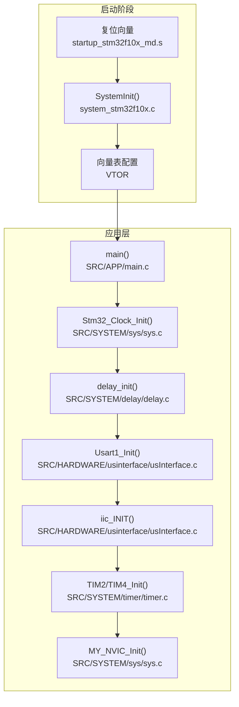
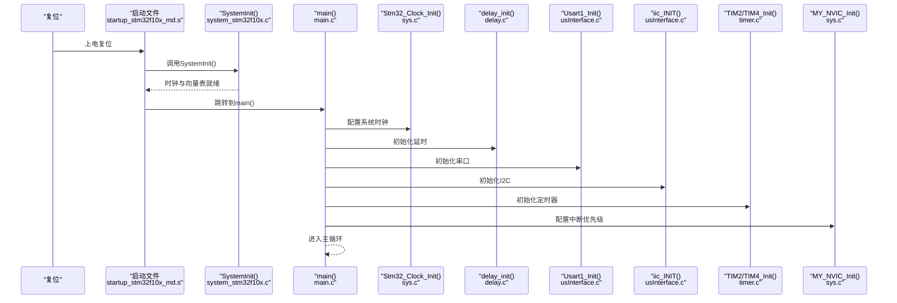
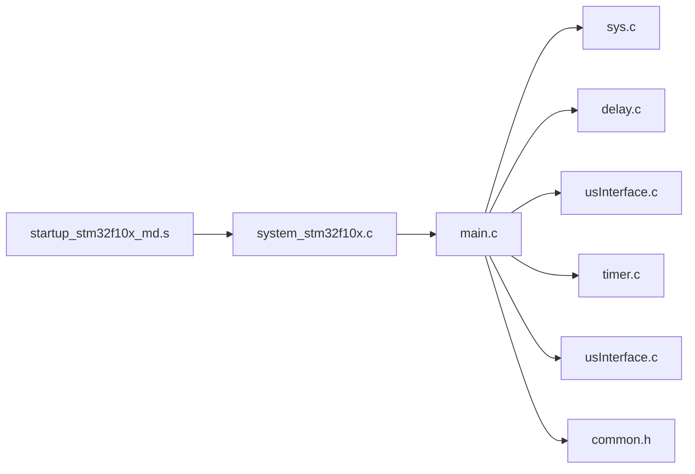

# 系统启动流程

<cite>
**本文引用的文件**
- [main.c](file://SRC/APP/main.c)
- [system_stm32f10x.c](file://SRC/CMSIS/DeviceSupport/system_stm32f10x.c)
- [startup_stm32f10x_md.s](file://SRC/CMSIS/DeviceSupport/startup/startup_stm32f10x_md.s)
- [delay.c](file://SRC/SYSTEM/delay/delay.c)
- [usInterface.c](file://SRC/HARDWARE/usinterface/usInterface.c)
- [usFunc.c](file://SRC/HARDWARE/usinterface/usFunc.c)
- [sys.c](file://SRC/SYSTEM/sys/sys.c)
- [core_cm3.c](file://SRC/CMSIS/CoreSupport/core_cm3.c)
- [common.h](file://SRC/APP/common.h)
- [timer.c](file://SRC/SYSTEM/timer/timer.c)
</cite>

## 目录
1. [简介](#简介)
2. [项目结构](#项目结构)
3. [核心组件](#核心组件)
4. [架构总览](#架构总览)
5. [详细组件分析](#详细组件分析)
6. [依赖关系分析](#依赖关系分析)
7. [性能考虑](#性能考虑)
8. [故障排查指南](#故障排查指南)
9. [结论](#结论)
10. [附录](#附录)

## 简介
本文件面向嵌入式开发者，系统性梳理通用开关器项目的系统启动流程，覆盖从上电复位到系统完全初始化的全过程，重点解释：
- 时钟配置（系统时钟、AHB/APB分频）
- 内存初始化（向量表、堆栈）
- 外设初始化（GPIO、USART、I2C、定时器、中断）
- 中断系统配置（NVIC分组、优先级、中断使能）
- main函数中的初始化序列：Stm32_Clock_Init、delay_init、Usart1_Init、iic_INIT等
- 关键里程碑与状态检查点
- 启动失败的常见原因与诊断方法
- 启动流程时序图与状态转换图
- 启动优化技巧与启动时间分析

## 项目结构
项目采用分层组织，围绕APP、CMSIS、SYSTEM、HARDWARE四大模块展开：
- APP：应用入口与业务逻辑（main.c）
- CMSIS：设备支持包与核心支持包（SystemInit、启动汇编、内核寄存器访问）
- SYSTEM：系统功能封装（延时、中断、定时器、系统控制）
- HARDWARE：硬件抽象层（串口调试、I2C、电机控制等）

图表来源
- [startup_stm32f10x_md.s:128-137](file://SRC/CMSIS/DeviceSupport/startup/startup_stm32f10x_md.s#L128-L137)
- [system_stm32f10x.c:212-269](file://SRC/CMSIS/DeviceSupport/system_stm32f10x.c#L212-L269)
- [main.c:433-494](file://SRC/APP/main.c#L433-L494)
- [sys.c:150-172](file://SRC/SYSTEM/sys/sys.c#L150-L172)
- [delay.c:23-42](file://SRC/SYSTEM/delay/delay.c#L23-L42)
- [usInterface.c:15-106](file://SRC/HARDWARE/usinterface/usInterface.c#L15-L106)
- [timer.c:11-19](file://SRC/SYSTEM/timer/timer.c#L11-L19)

章节来源
- [startup_stm32f10x_md.s:1-308](file://SRC/CMSIS/DeviceSupport/startup/startup_stm32f10x_md.s#L1-L308)
- [system_stm32f10x.c:1-1095](file://SRC/CMSIS/DeviceSupport/system_stm32f10x.c#L1-L1095)
- [main.c:1-552](file://SRC/APP/main.c#L1-L552)
- [sys.c:1-201](file://SRC/SYSTEM/sys/sys.c#L1-L201)
- [delay.c:1-160](file://SRC/SYSTEM/delay/delay.c#L1-L160)
- [usInterface.c:1-577](file://SRC/HARDWARE/usinterface/usInterface.c#L1-L577)
- [timer.c:1-223](file://SRC/SYSTEM/timer/timer.c#L1-L223)

## 核心组件
- 启动向量与SystemInit：由启动文件调用SystemInit完成时钟与向量表配置
- 时钟系统：通过Stm32_Clock_Init设置外部高速晶振、PLL倍频与AHB/APB分频
- 延时系统：基于SysTick或操作系统节拍，提供us/ms级延时
- 串口与调试：USART1初始化与命令解析接口
- I2C与EEPROM：参数读写与校验
- 定时器与中断：TIM2/TIM4用于系统节拍与步进控制；NVIC配置中断优先级与使能
- 主循环：初始化完成后进入主循环，执行协议栈与运行控制

章节来源
- [system_stm32f10x.c:212-269](file://SRC/CMSIS/DeviceSupport/system_stm32f10x.c#L212-L269)
- [sys.c:150-172](file://SRC/SYSTEM/sys/sys.c#L150-L172)
- [delay.c:23-42](file://SRC/SYSTEM/delay/delay.c#L23-L42)
- [usInterface.c:15-106](file://SRC/HARDWARE/usinterface/usInterface.c#L15-L106)
- [timer.c:11-19](file://SRC/SYSTEM/timer/timer.c#L11-L19)

## 架构总览
系统启动遵循标准ARM Cortex-M3流程：复位后由启动文件设置初始栈与向量表，调用SystemInit完成时钟与外设基础配置，随后跳转至C语言入口main，在main中完成具体外设初始化与系统参数加载。

图表来源
- [startup_stm32f10x_md.s:128-137](file://SRC/CMSIS/DeviceSupport/startup/startup_stm32f10x_md.s#L128-L137)
- [system_stm32f10x.c:212-269](file://SRC/CMSIS/DeviceSupport/system_stm32f10x.c#L212-L269)
- [main.c:433-494](file://SRC/APP/main.c#L433-L494)
- [sys.c:150-172](file://SRC/SYSTEM/sys/sys.c#L150-L172)
- [delay.c:23-42](file://SRC/SYSTEM/delay/delay.c#L23-L42)
- [usInterface.c:15-106](file://SRC/HARDWARE/usinterface/usInterface.c#L15-L106)
- [timer.c:11-19](file://SRC/SYSTEM/timer/timer.c#L11-L19)

## 详细组件分析

### 启动向量与SystemInit
- 启动文件在Reset_Handler中调用SystemInit，完成：
  - 复位RCC寄存器（除部分保留位）
  - 配置AHB/APB分频与预取缓冲
  - 设置向量表偏移（默认在Flash）
- SystemInit进一步调用SetSysClock，按编译期宏选择目标系统频率（如72MHz），并更新SystemCoreClock

章节来源
- [startup_stm32f10x_md.s:128-137](file://SRC/CMSIS/DeviceSupport/startup/startup_stm32f10x_md.s#L128-L137)
- [system_stm32f10x.c:212-269](file://SRC/CMSIS/DeviceSupport/system_stm32f10x.c#L212-L269)
- [system_stm32f10x.c:419-437](file://SRC/CMSIS/DeviceSupport/system_stm32f10x.c#L419-L437)

### 时钟系统初始化
- Stm32_Clock_Init负责：
  - 使能外部高速晶振（HSE）
  - 配置AHB/APB分频（AHB=SYSCLK；APB2=SYSCLK；APB1=SYSCLK/2）
  - 设置PLL倍频（2~16），启用PLL并等待锁定
  - 将系统时钟切换为PLL输出
- 延时系统基于SystemCoreClock配置SysTick，提供us/ms延时

章节来源
- [sys.c:150-172](file://SRC/SYSTEM/sys/sys.c#L150-L172)
- [delay.c:23-42](file://SRC/SYSTEM/delay/delay.c#L23-L42)
- [system_stm32f10x.c:306-412](file://SRC/CMSIS/DeviceSupport/system_stm32f10x.c#L306-L412)

### 内存与向量表
- 向量表默认位于Flash起始地址，可通过MY_NVIC_SetVectorTable在RAM或Flash之间切换
- 启动文件设置初始栈指针与向量表，确保异常处理正确跳转

章节来源
- [sys.c:8-12](file://SRC/SYSTEM/sys/sys.c#L8-L12)
- [startup_stm32f10x_md.s:55-122](file://SRC/CMSIS/DeviceSupport/startup/startup_stm32f10x_md.s#L55-L122)

### 外设初始化序列（main函数）
- Stm32_Clock_Init(9)：设置系统时钟
- delay_init(72)：初始化SysTick延时
- Usart1_Init(72, 115200)：初始化串口1，波特率115200
- iic_INIT()：初始化I2C总线
- TIM2_Init(999, 71)：10kHz计数频率，用于毫秒级节拍
- TIM4_Init(65535, 35)：X轴脉冲定时器
- MotorCfg()：电机相关配置（由上层模块提供）
- IOconfig()：IO引脚配置（RS232/485收发切换、按键/反馈等）
- 参数初始化与协议栈初始化：ParameterInit()、协议栈初始化
- 用户命令初始化：UsrCmdInit()

章节来源
- [main.c:433-494](file://SRC/APP/main.c#L433-L494)
- [usInterface.c:15-106](file://SRC/HARDWARE/usinterface/usInterface.c#L15-L106)
- [timer.c:11-19](file://SRC/SYSTEM/timer/timer.c#L11-L19)
- [sys.c:150-172](file://SRC/SYSTEM/sys/sys.c#L150-L172)

### 中断系统配置
- NVIC分组：MY_NVIC_PriorityGroupConfig设置分组（0~4）
- 中断优先级：PreemptionPriority与SubPriority组合，数值越小优先级越高
- 中断使能：MY_NVIC_Init按通道使能并设置优先级
- 示例：TIM2/TIM4中断优先级配置（抢占1，子优先级3，组2）

章节来源
- [sys.c:15-49](file://SRC/SYSTEM/sys/sys.c#L15-L49)
- [timer.c:11-19](file://SRC/SYSTEM/timer/timer.c#L11-L19)
- [timer.c:81-89](file://SRC/SYSTEM/timer/timer.c#L81-L89)

### 串口与调试接口
- 串口初始化：Usart1_Init设置波特率与工作模式
- 命令解析：getSerialData接收字符，StrProc解析命令，TimeOutInt处理超时
- 用户命令：TermXXX系列函数实现参数读写、设备控制等

章节来源
- [usInterface.c:15-106](file://SRC/HARDWARE/usinterface/usInterface.c#L15-L106)
- [usFunc.c:1-834](file://SRC/HARDWARE/usinterface/usFunc.c#L1-L834)

### I2C与EEPROM参数管理
- I2C初始化：iic_INIT
- 参数读写：I2CPageRead_Nbytes/I2CPageWrite_Nbytes
- 参数初始化：ParameterInit根据EEPROM内容加载或写入默认参数

章节来源
- [usInterface.c:15-106](file://SRC/HARDWARE/usinterface/usInterface.c#L15-L106)
- [main.c:222-429](file://SRC/APP/main.c#L222-L429)

### 定时器与时钟节拍
- TIM2：10kHz计数，溢出中断提供毫秒级节拍与超时保护
- TIM4：步进电机脉冲定时
- TIM3：协议栈定时处理（AGS/Modbus）
- 中断服务：TIM2_IRQHandler、TIM4_IRQHandler、TIM3_IRQHandler

章节来源
- [timer.c:11-19](file://SRC/SYSTEM/timer/timer.c#L11-L19)
- [timer.c:61-73](file://SRC/SYSTEM/timer/timer.c#L61-L73)
- [timer.c:91-99](file://SRC/SYSTEM/timer/timer.c#L91-L99)

## 依赖关系分析
- 启动文件依赖CMSIS的SystemInit，后者依赖RCC/FLASH/SCB寄存器
- main依赖各外设驱动与系统封装（sys、delay、timer、usInterface）
- 中断系统依赖NVIC与各外设中断控制器
- 参数与协议栈依赖I2C与EEPROM

图表来源
- [startup_stm32f10x_md.s:128-137](file://SRC/CMSIS/DeviceSupport/startup/startup_stm32f10x_md.s#L128-L137)
- [system_stm32f10x.c:212-269](file://SRC/CMSIS/DeviceSupport/system_stm32f10x.c#L212-L269)
- [main.c:433-494](file://SRC/APP/main.c#L433-L494)
- [sys.c:1-201](file://SRC/SYSTEM/sys/sys.c#L1-L201)
- [delay.c:1-160](file://SRC/SYSTEM/delay/delay.c#L1-L160)
- [usInterface.c:1-577](file://SRC/HARDWARE/usinterface/usInterface.c#L1-L577)
- [timer.c:1-223](file://SRC/SYSTEM/timer/timer.c#L1-L223)
- [common.h:155-169](file://SRC/APP/common.h#L155-L169)

## 性能考虑
- 启动时间构成
  - SystemInit：外部晶振稳定、PLL锁定、Flash等待状态更新
  - main初始化：时钟配置、延时初始化、串口与I2C初始化、定时器与中断配置
  - 参数加载与协议栈初始化：I2C读写、参数校验与写回
- 优化建议
  - 选择合适的系统频率（如72MHz）以平衡性能与功耗
  - 合理设置SysTick分频，避免过高的中断频率影响实时性
  - I2C读写采用批量页写提升效率
  - 降低不必要的外设初始化顺序，合并配置减少寄存器访问次数
  - 在Release模式下关闭调试输出，减少串口占用

## 故障排查指南
- 启动卡死在SystemInit
  - 检查外部晶振是否正常（HSE就绪）
  - 检查PLL倍频设置是否超出器件限制
- 串口无输出或乱码
  - 检查Usart1_Init参数（波特率、时钟源）
  - 检查GPIO复用与引脚配置
- I2C通信失败
  - 检查上拉电阻与总线电平
  - 检查EEPROM地址与页写边界
- 定时器中断不触发
  - 检查TIMx时钟使能与ARR/PSC设置
  - 检查NVIC优先级分组与中断使能
- 启动后立即进入HardFault
  - 检查向量表偏移与栈指针
  - 检查中断优先级配置是否越界

章节来源
- [system_stm32f10x.c:500-570](file://SRC/CMSIS/DeviceSupport/system_stm32f10x.c#L500-L570)
- [usInterface.c:15-106](file://SRC/HARDWARE/usinterface/usInterface.c#L15-L106)
- [timer.c:102-111](file://SRC/SYSTEM/timer/timer.c#L102-L111)
- [sys.c:150-172](file://SRC/SYSTEM/sys/sys.c#L150-L172)

## 结论
本项目遵循标准Cortex-M3启动流程，通过启动文件与CMSIS SystemInit完成基础时钟与向量表配置，随后在main中完成外设初始化与系统参数加载。通过合理的时钟配置、中断优先级与定时器节拍设计，系统实现了稳定的启动与运行。建议在开发过程中重点关注I2C与串口初始化、NVIC优先级分组与向量表偏移，以确保启动稳定性与可维护性。

## 附录

### 启动关键里程碑与状态检查点
- 复位完成：向量表就绪、栈指针初始化
- SystemInit完成：HSE就绪、PLL锁定、AHB/APB分频生效
- main初始化完成：时钟、延时、串口、I2C、定时器、中断配置
- 参数加载完成：EEPROM读取与参数校验
- 协议栈初始化完成：AGS/Modbus协议栈准备
- 主循环启动：进入运行态，执行协议处理与控制逻辑

章节来源
- [startup_stm32f10x_md.s:128-137](file://SRC/CMSIS/DeviceSupport/startup/startup_stm32f10x_md.s#L128-L137)
- [system_stm32f10x.c:212-269](file://SRC/CMSIS/DeviceSupport/system_stm32f10x.c#L212-L269)
- [main.c:433-494](file://SRC/APP/main.c#L433-L494)