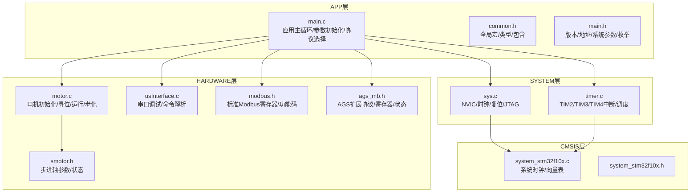
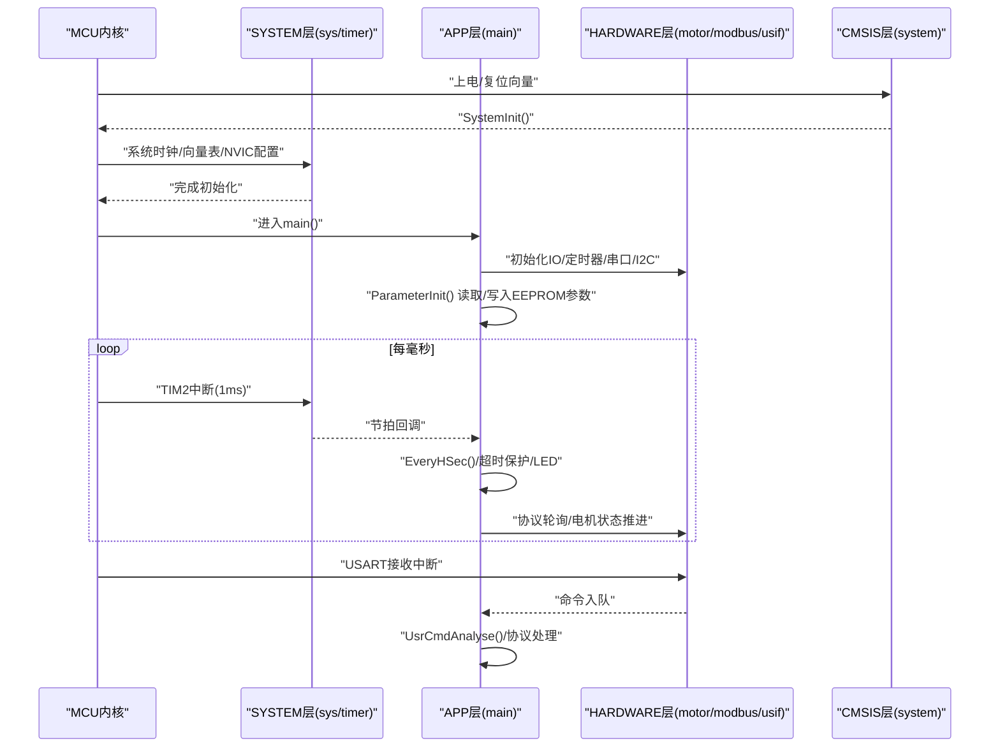
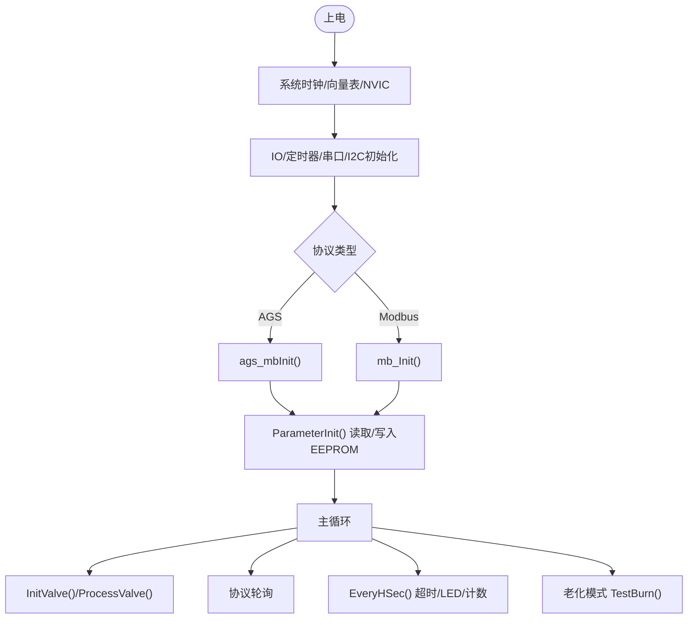
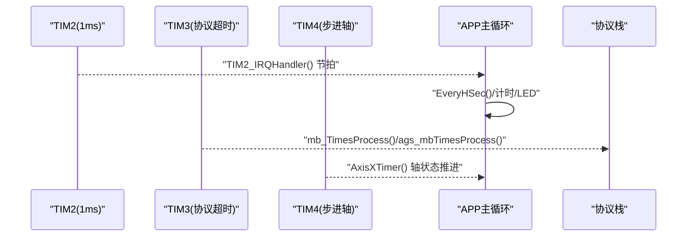
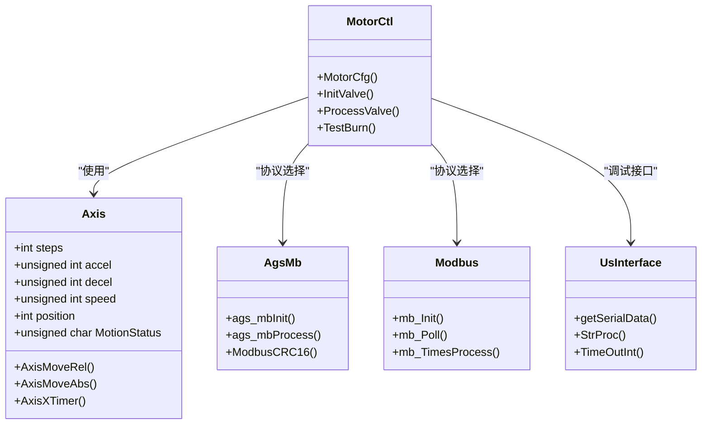
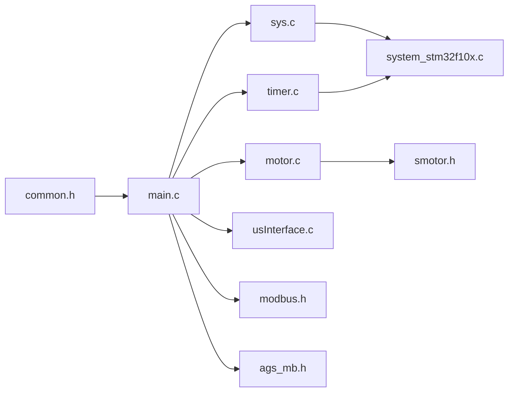

# 软件架构

<cite>
**本文引用的文件**
- [main.c](file://SRC/APP/main.c)
- [main.h](file://SRC/APP/main.h)
- [common.h](file://SRC/APP/common.h)
- [sys.c](file://SRC/SYSTEM/sys/sys.c)
- [timer.c](file://SRC/SYSTEM/timer/timer.c)
- [motor.c](file://SRC/HARDWARE/motor/motor.c)
- [smotor.h](file://SRC/HARDWARE/motor/smotor.h)
- [usInterface.c](file://SRC/HARDWARE/usinterface/usInterface.c)
- [modbus.h](file://SRC/HARDWARE/modbus/modbus.h)
- [ags_mb.h](file://SRC/HARDWARE/ags_mb/ags_mb.h)
- [system_stm32f10x.c](file://SRC/CMSIS/DeviceSupport/system_stm32f10x.c)
- [system_stm32f10x.h](file://SRC/CMSIS/DeviceSupport/system_stm32f10x.h)
- [eide.yml](file://EIDE_Project/.eide/eide.yml)
</cite>

## 目录
1. [简介](#简介)
2. [项目结构](#项目结构)
3. [核心组件](#核心组件)
4. [架构总览](#架构总览)
5. [详细组件分析](#详细组件分析)
6. [依赖分析](#依赖分析)
7. [性能考量](#性能考量)
8. [故障排查指南](#故障排查指南)
9. [结论](#结论)
10. [附录](#附录)

## 简介
本项目为通用开关器固件，面向STM32F10x系列MCU，采用分层架构设计，自底向上分为CMSIS层（硬件抽象与系统时钟）、SYSTEM层（系统服务与外设驱动）、HARDWARE层（硬件功能模块）与APP层（应用逻辑）。系统通过定时器中断驱动任务调度，结合协议栈（AGS Modbus扩展与标准Modbus）实现远程控制与本地调试接口，具备参数配置、超时保护、电机闭环控制与IO联动等功能。

## 项目结构
项目按功能域组织，采用“分层+模块化”的目录布局：
- APP层：应用入口与主循环、参数初始化、IO控制与LED指示、协议栈选择与轮询
- SYSTEM层：系统初始化、NVIC与中断、延时、USART、定时器、电源与复位
- HARDWARE层：电机驱动、EEPROM、Modbus/AGS协议、用户串口调试接口
- CMSIS层：设备系统时钟与启动文件
- 第三方库：日志与工具库（3rd）

图表来源
- [main.c:433-494](file://SRC/APP/main.c#L433-L494)
- [sys.c:150-172](file://SRC/SYSTEM/sys/sys.c#L150-L172)
- [timer.c:11-99](file://SRC/SYSTEM/timer/timer.c#L11-L99)
- [motor.c:4-68](file://SRC/HARDWARE/motor/motor.c#L4-L68)
- [smotor.h:67-96](file://SRC/HARDWARE/motor/smotor.h#L67-L96)
- [usInterface.c:15-106](file://SRC/HARDWARE/usinterface/usInterface.c#L15-L106)
- [modbus.h:25-37](file://SRC/HARDWARE/modbus/modbus.h#L25-L37)
- [ags_mb.h:70-81](file://SRC/HARDWARE/ags_mb/ags_mb.h#L70-L81)
- [system_stm32f10x.c:212-269](file://SRC/CMSIS/DeviceSupport/system_stm32f10x.c#L212-L269)

章节来源
- [main.c:433-494](file://SRC/APP/main.c#L433-L494)
- [common.h:1-526](file://SRC/APP/common.h#L1-L526)
- [sys.c:150-172](file://SRC/SYSTEM/sys/sys.c#L150-L172)
- [timer.c:11-99](file://SRC/SYSTEM/timer/timer.c#L11-L99)
- [motor.c:4-68](file://SRC/HARDWARE/motor/motor.c#L4-L68)
- [smotor.h:67-96](file://SRC/HARDWARE/motor/smotor.h#L67-L96)
- [usInterface.c:15-106](file://SRC/HARDWARE/usinterface/usInterface.c#L15-L106)
- [modbus.h:25-37](file://SRC/HARDWARE/modbus/modbus.h#L25-L37)
- [ags_mb.h:70-81](file://SRC/HARDWARE/ags_mb/ags_mb.h#L70-L81)
- [system_stm32f10x.c:212-269](file://SRC/CMSIS/DeviceSupport/system_stm32f10x.c#L212-L269)

## 核心组件
- 应用层（APP）
  - 主循环与初始化：系统时钟、延时、JTAG设置、串口、I2C、定时器、IO配置、协议初始化、参数读取与写入、主循环调度
  - 任务调度：每毫秒定时器驱动的1ms节拍，驱动超时保护、切换时间统计、LED闪烁、协议轮询与调试输出
  - IO控制与LED：根据硬件版本与宏定义配置IO输入输出，实现状态指示与联动
- 系统服务层（SYSTEM）
  - 系统初始化：RCC时钟配置、向量表、NVIC分组与中断使能
  - 定时器服务：TIM2（1ms节拍）、TIM3（协议超时）、TIM4（步进轴定时器）
  - USART服务：串口初始化与接收中断处理
- 硬件抽象层（HARDWARE）
  - 电机控制：初始化、原点搜索、相对/绝对移动、半通道、急停与保护
  - EEPROM：I2C页写读，参数持久化
  - 协议栈：AGS Modbus扩展与标准Modbus，支持寄存器读写、功能码、错误码与超时处理
  - 用户串口接口：命令解析、超时处理、调试输出
- CMSIS层
  - 系统时钟初始化与更新，向量表配置

章节来源
- [main.c:433-494](file://SRC/APP/main.c#L433-L494)
- [main.h:195-251](file://SRC/APP/main.h#L195-L251)
- [common.h:14-134](file://SRC/APP/common.h#L14-L134)
- [sys.c:150-172](file://SRC/SYSTEM/sys/sys.c#L150-L172)
- [timer.c:11-99](file://SRC/SYSTEM/timer/timer.c#L11-L99)
- [motor.c:73-268](file://SRC/HARDWARE/motor/motor.c#L73-L268)
- [smotor.h:67-96](file://SRC/HARDWARE/motor/smotor.h#L67-L96)
- [usInterface.c:15-106](file://SRC/HARDWARE/usinterface/usInterface.c#L15-L106)
- [modbus.h:25-37](file://SRC/HARDWARE/modbus/modbus.h#L25-L37)
- [ags_mb.h:70-81](file://SRC/HARDWARE/ags_mb/ags_mb.h#L70-L81)
- [system_stm32f10x.c:212-269](file://SRC/CMSIS/DeviceSupport/system_stm32f10x.c#L212-L269)

## 架构总览
系统采用“中断驱动 + 轮询调度”的混合实时框架：
- 中断驱动：定时器中断提供1ms节拍，USART接收中断处理串口数据
- 轮询调度：主循环中按优先级执行协议解析、状态机推进、IO检测与调试输出
- 分层解耦：APP层仅依赖SYSTEM/HARDWARE接口，HARDWARE层封装具体外设细节，CMSIS层提供底层硬件抽象

图表来源
- [system_stm32f10x.c:212-269](file://SRC/CMSIS/DeviceSupport/system_stm32f10x.c#L212-L269)
- [sys.c:150-172](file://SRC/SYSTEM/sys/sys.c#L150-L172)
- [timer.c:22-42](file://SRC/SYSTEM/timer/timer.c#L22-L42)
- [main.c:433-494](file://SRC/APP/main.c#L433-L494)
- [usInterface.c:15-106](file://SRC/HARDWARE/usinterface/usInterface.c#L15-L106)

## 详细组件分析

### 应用层（APP）与启动流程
- 启动阶段
  - 系统时钟初始化（72MHz）、延时初始化、JTAG设置、串口初始化、I2C初始化、定时器初始化、电机与IO配置
  - 根据协议类型初始化AGS或Modbus协议栈
  - ParameterInit：读取EEPROM参数，若首次上电则写入默认参数并提示复位
  - 初始化完成后进入主循环
- 主循环
  - InitValve/ProcessValve：阀门初始化与运行状态推进
  - 协议轮询：根据协议类型调用AGS或Modbus解析
  - EveryHSec：1秒级超时检测、切换次数保存、LED状态输出
  - 老化模式：周期性正反转切换，记录老化次数

图表来源
- [main.c:433-494](file://SRC/APP/main.c#L433-L494)
- [main.h:195-251](file://SRC/APP/main.h#L195-L251)

章节来源
- [main.c:433-494](file://SRC/APP/main.c#L433-L494)
- [main.h:195-251](file://SRC/APP/main.h#L195-L251)

### 系统服务层（SYSTEM）与实时调度
- 定时器服务
  - TIM2：1ms节拍，驱动系统时间、LED闪烁、切换时间统计、超时保护
  - TIM3：协议超时处理（AGS/Modbus）
  - TIM4：步进轴定时器，驱动AxisXTimer等轴相关处理
- NVIC与中断
  - NVIC分组配置、中断优先级、外部中断与串口中断
- 系统初始化
  - RCC时钟配置、向量表偏移、JTAG模式设置、软复位

图表来源
- [timer.c:22-99](file://SRC/SYSTEM/timer/timer.c#L22-L99)
- [sys.c:15-49](file://SRC/SYSTEM/sys/sys.c#L15-L49)

章节来源
- [timer.c:11-99](file://SRC/SYSTEM/timer/timer.c#L11-L99)
- [sys.c:15-49](file://SRC/SYSTEM/sys/sys.c#L15-L49)

### 硬件抽象层（HARDWARE）与电机控制
- 电机控制
  - MotorCfg：IO与驱动芯片配置、光耦输入、电流设置
  - InitValve：原点搜索、半通道、方向补偿、初始化完成状态更新
  - ProcessValve：目标位置到达检测、切换次数统计、运行结束状态
  - TestBurn：老化模式正反转切换
- 协议栈
  - AGS Modbus扩展：地址、功能码、异常码、寄存器映射、CRC校验
  - 标准Modbus：功能码支持、寄存器定义、错误状态
- 用户串口接口
  - 命令解析、超时处理、调试输出

图表来源
- [motor.c:4-68](file://SRC/HARDWARE/motor/motor.c#L4-L68)
- [smotor.h:67-96](file://SRC/HARDWARE/motor/smotor.h#L67-L96)
- [ags_mb.h:149-160](file://SRC/HARDWARE/ags_mb/ags_mb.h#L149-L160)
- [modbus.h:205-211](file://SRC/HARDWARE/modbus/modbus.h#L205-L211)
- [usInterface.c:15-106](file://SRC/HARDWARE/usinterface/usInterface.c#L15-L106)

章节来源
- [motor.c:73-268](file://SRC/HARDWARE/motor/motor.c#L73-L268)
- [smotor.h:67-96](file://SRC/HARDWARE/motor/smotor.h#L67-L96)
- [ags_mb.h:149-160](file://SRC/HARDWARE/ags_mb/ags_mb.h#L149-L160)
- [modbus.h:205-211](file://SRC/HARDWARE/modbus/modbus.h#L205-L211)
- [usInterface.c:15-106](file://SRC/HARDWARE/usinterface/usInterface.c#L15-L106)

### 配置管理机制
- 编译期配置
  - 板级宏：A_901/A_906/A_909/O_901/O_906/O_909/B_901/B_906/B_909/C_901 等，决定IO电平、控制模式、方向补偿
  - 功能宏：RS232_485_CONTROL、IOCTRL、AGING_MODE、RELEASE、DEBUG等
  - 方向开关：DIRECTION_SWITCH统一电机转向逻辑
- 运行时配置
  - EEPROM参数：地址、波特率、速度、通道数、原点/方向补偿、半通道、回复方式、协议类型、老化次数等
  - 参数初始化：首次上电写默认值，后续读取并校验范围
- 版本与描述
  - 软件版本、修订号、控制模式描述、PCB型号与硬件描述

章节来源
- [common.h:14-134](file://SRC/APP/common.h#L14-L134)
- [main.h:12-189](file://SRC/APP/main.h#L12-L189)
- [main.c:222-429](file://SRC/APP/main.c#L222-L429)

## 依赖分析
- 模块内聚与耦合
  - APP层对SYSTEM/HARDWARE采用接口化依赖，耦合度低，便于移植与测试
  - MOTOR模块与SMOTOR状态结构紧密耦合，但通过公共头暴露必要接口
  - 协议栈与APP层通过函数指针/轮询接口交互，避免强绑定
- 外部依赖
  - CMSIS提供系统时钟与中断向量基础
  - Keil AC5工具链与scatter配置影响内存布局

图表来源
- [common.h:155-169](file://SRC/APP/common.h#L155-L169)
- [main.c:433-494](file://SRC/APP/main.c#L433-L494)
- [sys.c:150-172](file://SRC/SYSTEM/sys/sys.c#L150-L172)
- [timer.c:11-99](file://SRC/SYSTEM/timer/timer.c#L11-L99)
- [motor.c:4-68](file://SRC/HARDWARE/motor/motor.c#L4-L68)
- [usInterface.c:15-106](file://SRC/HARDWARE/usinterface/usInterface.c#L15-L106)
- [modbus.h:205-211](file://SRC/HARDWARE/modbus/modbus.h#L205-L211)
- [ags_mb.h:149-160](file://SRC/HARDWARE/ags_mb/ags_mb.h#L149-L160)
- [system_stm32f10x.c:212-269](file://SRC/CMSIS/DeviceSupport/system_stm32f10x.c#L212-L269)

章节来源
- [common.h:155-169](file://SRC/APP/common.h#L155-L169)
- [main.c:433-494](file://SRC/APP/main.c#L433-L494)

## 性能考量
- 实时性保障
  - 1ms定时器中断提供稳定节拍，协议超时与电机轴定时器独立处理，避免长尾中断
  - LED闪烁与调试输出按周期抑制，降低对主循环的影响
- 存储与I/O
  - EEPROM页读写减少I/O次数，参数范围校验避免无效配置
  - 串口接收采用中断+超时机制，防止阻塞
- 时钟与功耗
  - 72MHz系统时钟满足协议与控制需求，JTAG设置可按需关闭以节省资源

## 故障排查指南
- 启动失败
  - 检查SystemInit是否正确加载，向量表偏移与内存布局
- 通信异常
  - 校验波特率与协议类型配置，确认AGS/Modbus初始化顺序
  - 查看协议栈错误码与超时时间
- 电机不动作或误动作
  - 检查电机IO配置、方向补偿、半通道设置与原点信号
  - 观察轴状态与急停标志
- 参数异常
  - 恢复默认参数后复位，确认EEPROM写入成功

章节来源
- [system_stm32f10x.c:212-269](file://SRC/CMSIS/DeviceSupport/system_stm32f10x.c#L212-L269)
- [timer.c:62-72](file://SRC/SYSTEM/timer/timer.c#L62-L72)
- [motor.c:356-371](file://SRC/HARDWARE/motor/motor.c#L356-L371)
- [main.c:222-429](file://SRC/APP/main.c#L222-L429)

## 结论
本项目通过清晰的分层架构与模块化设计，在有限资源下实现了稳定的实时控制与通信能力。APP层专注于业务逻辑与调度，SYSTEM层提供可靠的基础服务，HARDWARE层封装复杂外设细节，CMSIS层提供底层硬件抽象。配置管理机制覆盖编译期与运行时，确保系统可移植与可维护。建议持续优化参数校验与错误恢复策略，增强边界条件下的鲁棒性。

## 附录
- 工具链与构建
  - Keil AC5工具链，CPU类型Cortex-M3，微库开关与优化级别配置
  - 内存布局：IROM/IRAM基址与大小，输出格式为elf

章节来源
- [eide.yml:70-106](file://EIDE_Project/.eide/eide.yml#L70-L106)