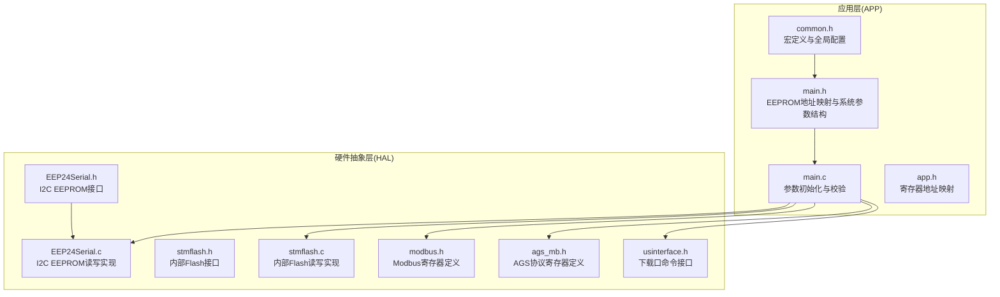
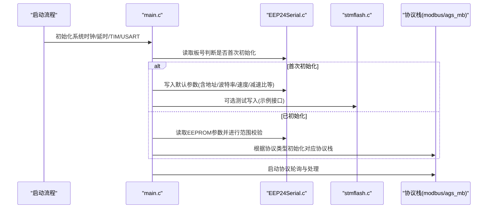
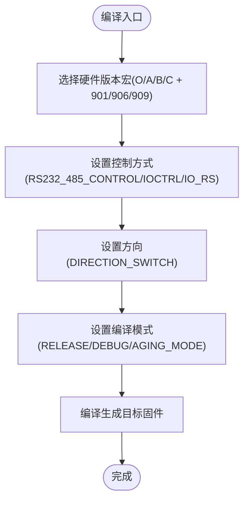
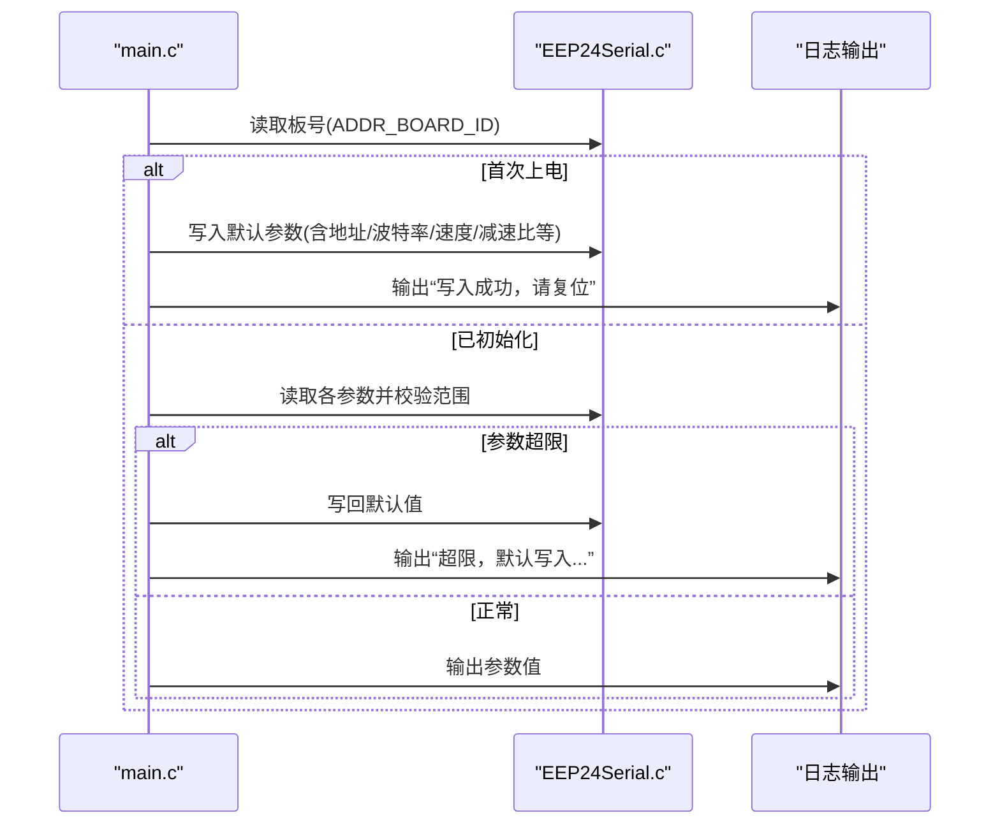
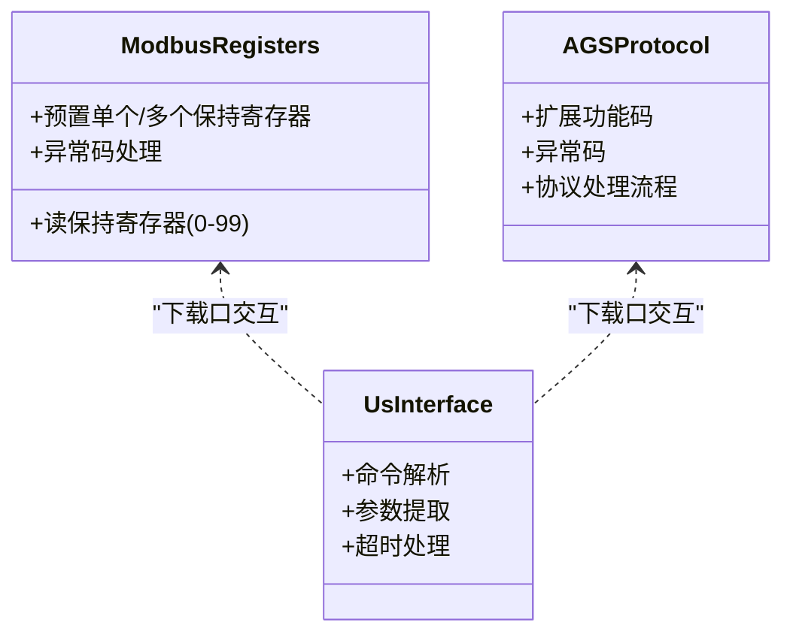
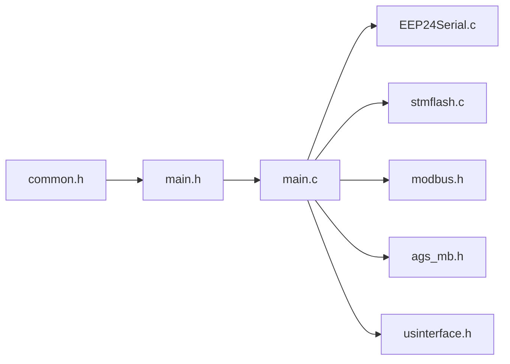

# 配置管理机制

<cite>
**本文引用的文件**
- [common.h](file://SRC/APP/common.h)
- [main.h](file://SRC/APP/main.h)
- [main.c](file://SRC/APP/main.c)
- [app.h](file://SRC/APP/app.h)
- [EEP24Serial.h](file://SRC/HARDWARE/EEPROM/EEP24Serial.h)
- [EEP24Serial.c](file://SRC/HARDWARE/EEPROM/EEP24Serial.c)
- [stmflash.h](file://SRC/HARDWARE/stmFlash/stmflash.h)
- [stmflash.c](file://SRC/HARDWARE/stmFlash/stmflash.c)
- [modbus.h](file://SRC/HARDWARE/modbus/modbus.h)
- [ags_mb.h](file://SRC/HARDWARE/ags_mb/ags_mb.h)
- [usinterface.h](file://SRC/HARDWARE/usinterface/usinterface.h)
- [C_901_STM32F103C8_1.0.0.dbgconf](file://USER/DebugConfig/C_901_STM32F103C8_1.0.0.dbgconf)
</cite>

## 目录
1. [简介](#简介)
2. [项目结构](#项目结构)
3. [核心组件](#核心组件)
4. [架构总览](#架构总览)
5. [详细组件分析](#详细组件分析)
6. [依赖关系分析](#依赖关系分析)
7. [性能考量](#性能考量)
8. [故障排查指南](#故障排查指南)
9. [结论](#结论)
10. [附录](#附录)

## 简介
本文件系统性梳理通用开关器项目的配置管理机制，覆盖以下方面：
- 宏定义系统：硬件版本配置（C_901、A12_901 等）、编译选项与运行时配置
- EEPROM 参数存储：参数结构定义、默认值管理、参数校验与持久化
- 配置分类：硬件配置、功能配置、通信配置等
- 配置修改与参数校准流程
- 影响分析与回滚策略
- 安全性与完整性保护
- 开发者最佳实践

## 项目结构
项目采用“分层+按功能模块组织”的结构，配置管理涉及 APP 层（应用逻辑与参数）、硬件抽象层（EEPROM、Flash、通信协议）与系统支撑层（延时、定时、串口等）。关键配置入口集中在 APP 层的公共头文件与主程序中。

图表来源
- [common.h:14-134](file://SRC/APP/common.h#L14-L134)
- [main.h:127-189](file://SRC/APP/main.h#L127-L189)
- [main.c:222-429](file://SRC/APP/main.c#L222-L429)
- [EEP24Serial.h:10-35](file://SRC/HARDWARE/EEPROM/EEP24Serial.h#L10-L35)
- [EEP24Serial.c:95-200](file://SRC/HARDWARE/EEPROM/EEP24Serial.c#L95-L200)
- [stmflash.h:10-35](file://SRC/HARDWARE/stmFlash/stmflash.h#L10-L35)
- [stmflash.c:122-172](file://SRC/HARDWARE/stmFlash/stmflash.c#L122-L172)
- [modbus.h:71-198](file://SRC/HARDWARE/modbus/modbus.h#L71-L198)
- [ags_mb.h:108-162](file://SRC/HARDWARE/ags_mb/ags_mb.h#L108-L162)
- [usinterface.h:37-95](file://SRC/HARDWARE/usinterface/usinterface.h#L37-L95)

章节来源
- [common.h:14-134](file://SRC/APP/common.h#L14-L134)
- [main.h:127-189](file://SRC/APP/main.h#L127-L189)
- [main.c:222-429](file://SRC/APP/main.c#L222-L429)

## 核心组件
- 宏定义系统与编译期配置
  - 硬件版本宏：O_901/O_906/O_909、A_901/A_906/A_909、B_901/B_906、C_901 等，决定 I/O 电平、控制方式（RS232/485 或 IO）、方向开关等
  - 编译模式宏：RELEASE/DEBUG/AGING_MODE 等，影响日志输出与功能裁剪
  - 运行时配置宏：如 IO_RS、RS232_485_CONTROL、IOCTRL、DIRECTION_SWITCH 等，动态影响 IO 电平与行为
- EEPROM 参数存储
  - 地址映射：通过 main.h 中的 ADDR_* 宏定义，集中管理各参数在 EEPROM 中的起始地址与长度
  - 读写接口：EEP24Serial 提供 I2CPageRead_Nbytes/I2CPageWrite_Nbytes
  - 默认值与校验：main.c 的 ParameterInit 在首次上电或参数缺失时写入默认值，并对关键参数进行范围校验
- Flash 存储
  - 内部 Flash 读写接口：stmflash 提供 Unlock/Lock、WaitDone、ErasePage、Write/Read 等底层操作
  - 使用场景：用于测试写入或特殊用途（示例接口存在），常规参数持久化使用 EEPROM
- 通信配置
  - Modbus/AGS 协议寄存器：modbus.h 与 ags_mb.h 定义了寄存器地址与功能码，支持通过串口/下载口读写运行参数
  - 下载口命令：usinterface.h 定义命令解析框架，便于现场参数校准与调试

章节来源
- [common.h:14-134](file://SRC/APP/common.h#L14-L134)
- [main.h:127-189](file://SRC/APP/main.h#L127-L189)
- [main.c:222-429](file://SRC/APP/main.c#L222-L429)
- [EEP24Serial.h:10-35](file://SRC/HARDWARE/EEPROM/EEP24Serial.h#L10-L35)
- [EEP24Serial.c:95-200](file://SRC/HARDWARE/EEPROM/EEP24Serial.c#L95-L200)
- [stmflash.h:10-35](file://SRC/HARDWARE/stmFlash/stmflash.h#L10-L35)
- [stmflash.c:122-172](file://SRC/HARDWARE/stmFlash/stmflash.c#L122-L172)
- [modbus.h:71-198](file://SRC/HARDWARE/modbus/modbus.h#L71-L198)
- [ags_mb.h:108-162](file://SRC/HARDWARE/ags_mb/ags_mb.h#L108-L162)
- [usinterface.h:37-95](file://SRC/HARDWARE/usinterface/usinterface.h#L37-L95)

## 架构总览
配置管理贯穿“编译期宏选择—运行期参数初始化—通信协议交互—EEPROM持久化”的完整链路。

图表来源
- [main.c:433-494](file://SRC/APP/main.c#L433-L494)
- [main.c:222-429](file://SRC/APP/main.c#L222-L429)
- [EEP24Serial.c:95-200](file://SRC/HARDWARE/EEPROM/EEP24Serial.c#L95-L200)
- [stmflash.c:122-172](file://SRC/HARDWARE/stmFlash/stmflash.c#L122-L172)
- [modbus.h:71-198](file://SRC/HARDWARE/modbus/modbus.h#L71-L198)
- [ags_mb.h:108-162](file://SRC/HARDWARE/ags_mb/ags_mb.h#L108-L162)

## 详细组件分析

### 宏定义系统与硬件版本配置
- 硬件版本宏（O_901/O_906/O_909、A_901/A_906/A_909、B_901/B_906、C_901）
  - 作用：选择不同 PCB 版本对应的 IO 引脚、控制方式（RS232/485 或 IO）、方向开关等
  - 示例：A12_901/A12_906/A12_909 宏决定硬件描述字符串与 IO 引脚配置
- 控制方式与方向
  - RS232_485_CONTROL：启用 RS232/485 控制
  - IOCTRL：启用 IO 控制
  - IO_RS：决定 IO 电平标准（A/B 两种）
  - DIRECTION_SWITCH：在特定宏下启用反向切换
- 编译模式
  - RELEASE/DEBUG：控制调试输出与功能裁剪
  - AGING_MODE：仅支持正反转的“老化模式”

图表来源
- [common.h:49-133](file://SRC/APP/common.h#L49-L133)
- [main.h:15-39](file://SRC/APP/main.h#L15-L39)

章节来源
- [common.h:49-133](file://SRC/APP/common.h#L49-L133)
- [main.h:15-39](file://SRC/APP/main.h#L15-L39)

### EEPROM 参数存储与默认值管理
- 地址映射与参数结构
  - main.h 中通过 ADDR_* 宏集中定义参数在 EEPROM 中的起始地址与长度，涵盖：板号、模块地址、原点补偿、方向补偿、通道数、波特率、速度、IO 控制、老化间隔、电流设置、序列号、减速比、半通道、切换次数、回复方式、初始状态、协议类型、烧机次数、上帝模式等
- 参数初始化与校验流程
  - 首次上电：读取板号，若不匹配则写入默认参数并提示复位
  - 已初始化：逐项读取并进行范围校验，超限时写回默认值并记录日志
- 关键参数范围与默认值
  - 地址：0-63
  - 波特率：1-3（对应 9600/19200/38400）
  - 速度：20-200（单位：转/分钟）
  - 通道数：3-16
  - 减速比：支持多种档位，错误时回退到默认档位
  - 半通道：0/1
  - 回复方式：0/1/2/3
  - 协议类型：AGS_MODBUS/MODBUS/EXT_COMM
- 读写接口
  - I2CPageRead_Nbytes/I2CPageWrite_Nbytes 提供按页读写能力，适配不同容量 EEPROM

图表来源
- [main.c:222-429](file://SRC/APP/main.c#L222-L429)
- [EEP24Serial.c:95-200](file://SRC/HARDWARE/EEPROM/EEP24Serial.c#L95-L200)
- [main.h:127-189](file://SRC/APP/main.h#L127-L189)

章节来源
- [main.h:127-189](file://SRC/APP/main.h#L127-L189)
- [main.c:222-429](file://SRC/APP/main.c#L222-L429)
- [EEP24Serial.c:95-200](file://SRC/HARDWARE/EEPROM/EEP24Serial.c#L95-L200)

### 通信配置与协议寄存器
- Modbus 寄存器定义
  - 保持寄存器：地址 0-99，包含控制指令、只读状态、运行参数、用户序列号、出厂参数、后备寄存器等
  - 支持功能码：01H/02H/03H/04H/05H/06H/10H（具体启用由宏控制）
- AGS 协议寄存器
  - 定义了扩展功能码与异常码，支持通过串口下发控制命令与读取状态
- 下载口命令
  - usinterface.h 提供命令解析框架，便于现场通过下载口进行参数校准与调试

图表来源
- [modbus.h:71-198](file://SRC/HARDWARE/modbus/modbus.h#L71-L198)
- [ags_mb.h:108-162](file://SRC/HARDWARE/ags_mb/ags_mb.h#L108-L162)
- [usinterface.h:37-95](file://SRC/HARDWARE/usinterface/usinterface.h#L37-L95)

章节来源
- [modbus.h:71-198](file://SRC/HARDWARE/modbus/modbus.h#L71-L198)
- [ags_mb.h:108-162](file://SRC/HARDWARE/ags_mb/ags_mb.h#L108-L162)
- [usinterface.h:37-95](file://SRC/HARDWARE/usinterface/usinterface.h#L37-L95)

### 寄存器地址映射与系统参数结构
- 寄存器地址映射
  - app.h 定义了系统寄存器地址（如读状态、读通道、读版本、写绝对体积位置、写相对推出/抽取、写速度、写复位等），用于通信协议与下载口交互
- 系统参数结构
  - main.h 定义了系统参数结构体（协议类型、波特率、切换时间计时标志、切换次数、烧机次数、超时保护时间、回复方式、上帝模式等），并在 main.c 中初始化与使用

章节来源
- [app.h:5-34](file://SRC/APP/app.h#L5-L34)
- [main.h:229-241](file://SRC/APP/main.h#L229-L241)

## 依赖关系分析
- 编译期依赖
  - common.h 中的硬件版本宏决定 main.h 中的 IO 引脚与控制方式，进而影响 main.c 的 IO 配置与运行逻辑
- 运行期依赖
  - main.c 依赖 EEPROM 接口进行参数读写，依赖协议栈进行通信，依赖 Flash 接口进行可选测试
- 外部依赖
  - I2C EEPROM（EEP24Serial）、内部 Flash（stmflash）、Modbus/AGS 协议栈、下载口命令解析

图表来源
- [common.h:14-134](file://SRC/APP/common.h#L14-L134)
- [main.h:127-189](file://SRC/APP/main.h#L127-L189)
- [main.c:222-429](file://SRC/APP/main.c#L222-L429)
- [EEP24Serial.h:10-35](file://SRC/HARDWARE/EEPROM/EEP24Serial.h#L10-L35)
- [stmflash.h:10-35](file://SRC/HARDWARE/stmFlash/stmflash.h#L10-L35)
- [modbus.h:71-198](file://SRC/HARDWARE/modbus/modbus.h#L71-L198)
- [ags_mb.h:108-162](file://SRC/HARDWARE/ags_mb/ags_mb.h#L108-L162)
- [usinterface.h:37-95](file://SRC/HARDWARE/usinterface/usinterface.h#L37-L95)

章节来源
- [common.h:14-134](file://SRC/APP/common.h#L14-L134)
- [main.h:127-189](file://SRC/APP/main.h#L127-L189)
- [main.c:222-429](file://SRC/APP/main.c#L222-L429)

## 性能考量
- EEPROM 读写
  - 采用按页读写接口，避免频繁擦写导致寿命损耗
  - 写入前进行扇区剩余空间与校验，必要时先擦除再写入
- Flash 写入
  - 提供 Unlock/Lock、WaitDone、ErasePage、Write/Read 等底层接口，建议仅用于测试或特殊用途
- 通信效率
  - 协议栈根据波特率动态计算帧间隔与超时阈值，确保稳定通信
  - 下载口命令解析具备超时与参数个数校验，防止越界与死机

[本节为通用性能讨论，不直接分析具体文件]

## 故障排查指南
- 参数未生效或异常
  - 检查 EEPROM 地址映射与参数范围是否正确
  - 确认 ParameterInit 是否执行默认值写入路径
- EEPROM 读写失败
  - 检查 I2C 引脚配置与时序参数
  - 确认 Page_Size 与 TotalPage 宏与硬件 EEPROM 容量匹配
- Flash 写入失败
  - 检查 Unlock/WaitDone/ErasePage/Write 流程是否正确
  - 确认地址合法性与扇区边界
- 通信异常
  - 校验波特率设置与协议类型
  - 检查 Modbus/AGS 功能码启用状态与寄存器地址映射

章节来源
- [main.c:222-429](file://SRC/APP/main.c#L222-L429)
- [EEP24Serial.c:95-200](file://SRC/HARDWARE/EEPROM/EEP24Serial.c#L95-L200)
- [stmflash.c:122-172](file://SRC/HARDWARE/stmFlash/stmflash.c#L122-L172)
- [modbus.h:71-198](file://SRC/HARDWARE/modbus/modbus.h#L71-L198)
- [ags_mb.h:108-162](file://SRC/HARDWARE/ags_mb/ags_mb.h#L108-L162)

## 结论
本项目通过“宏定义系统 + EEPROM 参数持久化 + 协议栈交互”的组合，实现了灵活且可维护的配置管理机制。硬件版本与控制方式在编译期确定，运行期参数在首次上电时自动初始化并进行范围校验，确保设备稳定运行。建议在后续版本中进一步完善参数校验与回滚策略、增强配置变更的影响评估与自动化测试。

[本节为总结性内容，不直接分析具体文件]

## 附录

### 配置项分类与默认值清单
- 硬件配置
  - 硬件版本：A12_901/A12_906/A12_909
  - 控制方式：RS232_485_CONTROL、IOCTRL、IO_RS
  - 方向：DIRECTION_SWITCH
- 功能配置
  - 地址：0-63（默认 1）
  - 波特率：1-3（默认 1，即 9600）
  - 速度：20-200（默认 20）
  - 通道数：3-16（默认 10）
  - 半通道：0/1（默认 0）
  - 回复方式：0/1/2/3（默认 0）
  - 协议类型：AGS_MODBUS/MODBUS/EXT_COMM（默认 AGS_MODBUS）
  - 减速比：多种档位（默认 4）
  - IO 控制：0/1（默认 1）
  - 老化间隔：默认 5 秒
  - 电流设置：0-4（默认 0）
- 通信配置
  - Modbus 寄存器：0-99
  - AGS 协议扩展功能码与异常码
  - 下载口命令解析框架

章节来源
- [main.h:127-189](file://SRC/APP/main.h#L127-L189)
- [main.c:352-414](file://SRC/APP/main.c#L352-L414)
- [modbus.h:71-198](file://SRC/HARDWARE/modbus/modbus.h#L71-L198)
- [ags_mb.h:108-162](file://SRC/HARDWARE/ags_mb/ags_mb.h#L108-L162)
- [usinterface.h:37-95](file://SRC/HARDWARE/usinterface/usinterface.h#L37-L95)

### 配置修改与参数校准方法
- 修改步骤
  - 通过下载口命令或协议寄存器写入目标参数
  - 参数写入后立即进行范围校验，超限则回退默认值
  - 若为首次上电或参数缺失，系统将自动写入默认值
- 参数校准
  - 使用下载口进行参数读取与范围检查
  - 结合日志输出确认参数生效与异常码

章节来源
- [main.c:222-429](file://SRC/APP/main.c#L222-L429)
- [usinterface.h:37-95](file://SRC/HARDWARE/usinterface/usinterface.h#L37-L95)

### 配置变更的影响分析与回滚机制
- 影响分析
  - 地址变更：影响通信寻址与广播地址使用
  - 波特率变更：影响通信时序与超时阈值
  - 速度/减速比变更：影响电机运行性能与精度
  - 半通道/IO 控制变更：影响外部控制逻辑
- 回滚机制
  - 参数超限时自动写回默认值
  - 首次上电时写入默认参数并提示复位
  - 建议在批量部署前进行参数一致性校验与回归测试

章节来源
- [main.c:222-429](file://SRC/APP/main.c#L222-L429)

### 配置安全性与完整性保护
- 安全性
  - 协议栈支持安全码（如 NORMAL_CODE/AGING_CODE/SECURITY_CODE），用于限制敏感操作
  - 下载口命令解析具备超时与参数个数校验，防止越界与死机
- 完整性保护
  - EEPROM 读写采用 CRC/校验和机制（I2CPageRead_Nbytes 返回校验和）
  - 参数范围校验与默认值回退，确保参数有效性

章节来源
- [modbus.h:77-79](file://SRC/HARDWARE/modbus/modbus.h#L77-L79)
- [EEP24Serial.c:95-200](file://SRC/HARDWARE/EEPROM/EEP24Serial.c#L95-L200)
- [usinterface.h:37-95](file://SRC/HARDWARE/usinterface/usinterface.h#L37-L95)

### 开发者最佳实践
- 编译期配置
  - 明确硬件版本宏与控制方式，避免混用导致 IO 电平不一致
  - 在 RELEASE 模式下禁用调试输出，减少资源占用
- 参数管理
  - 统一通过 EEPROM 地址映射集中管理参数，避免分散定义
  - 新增参数时同步更新默认值与范围校验逻辑
- 通信与协议
  - 根据实际需求启用相应功能码，减少协议栈复杂度
  - 严格校验参数范围与命令格式，提升鲁棒性
- 调试与测试
  - 使用下载口进行参数校准与功能验证
  - 建立参数一致性检查与回归测试流程

章节来源
- [common.h:14-134](file://SRC/APP/common.h#L14-L134)
- [main.h:127-189](file://SRC/APP/main.h#L127-L189)
- [main.c:222-429](file://SRC/APP/main.c#L222-L429)
- [modbus.h:71-198](file://SRC/HARDWARE/modbus/modbus.h#L71-L198)
- [ags_mb.h:108-162](file://SRC/HARDWARE/ags_mb/ags_mb.h#L108-L162)
- [usinterface.h:37-95](file://SRC/HARDWARE/usinterface/usinterface.h#L37-L95)