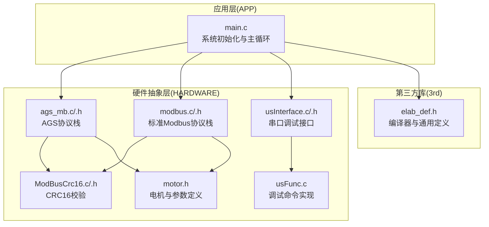
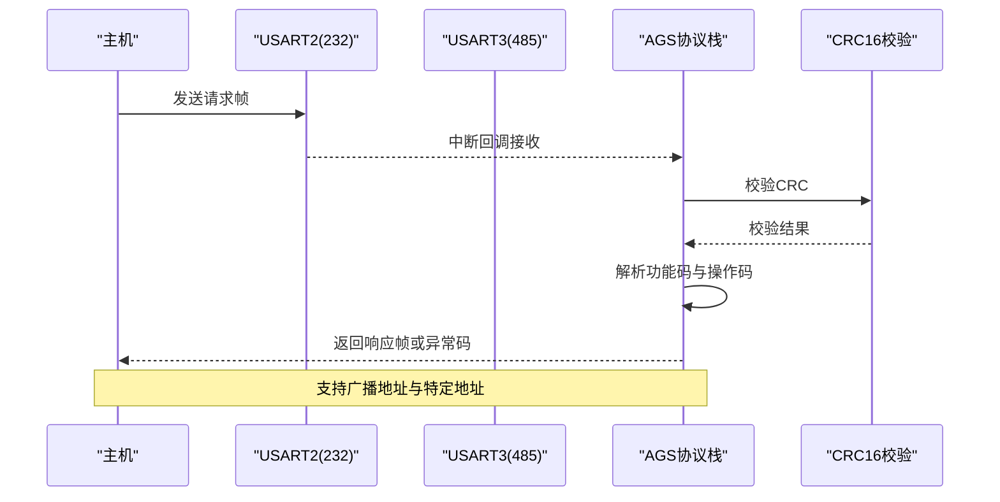
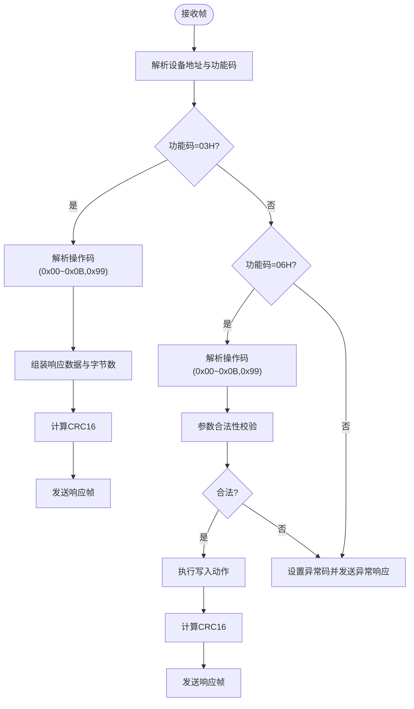
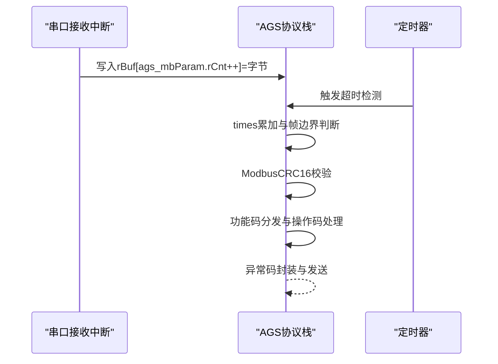
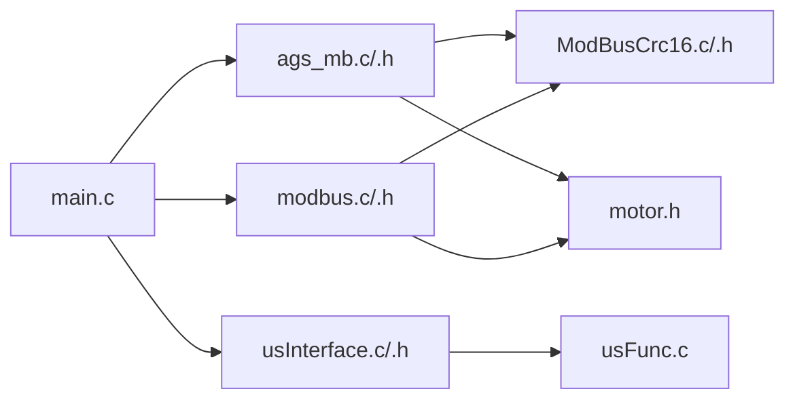

# AGS协议详解

<cite>
**本文档引用的文件**
- [ags_mb.h](file://SRC/HARDWARE/ags_mb/ags_mb.h)
- [ags_mb.c](file://SRC/HARDWARE/ags_mb/ags_mb.c)
- [ModBusCrc16.c](file://SRC/HARDWARE/ags_mb/ModBusCrc16.c)
- [ModBusCrc16.h](file://SRC/HARDWARE/ags_mb/ModBusCrc16.h)
- [modbus.h](file://SRC/HARDWARE/modbus/modbus.h)
- [modbus.c](file://SRC/HARDWARE/modbus/modbus.c)
- [usInterface.c](file://SRC/HARDWARE/usinterface/usInterface.c)
- [usFunc.c](file://SRC/HARDWARE/usinterface/usFunc.c)
- [main.c](file://SRC/APP/main.c)
- [motor.h](file://SRC/HARDWARE/motor/motor.h)
- [elab_def.h](file://SRC/3rd/common/elab_def.h)
</cite>

## 目录
1. [简介](#简介)
2. [项目结构](#项目结构)
3. [核心组件](#核心组件)
4. [架构总览](#架构总览)
5. [详细组件分析](#详细组件分析)
6. [依赖关系分析](#依赖关系分析)
7. [性能考虑](#性能考虑)
8. [故障排除指南](#故障排除指南)
9. [结论](#结论)
10. [附录](#附录)

## 简介
本文件面向通用开关器项目的AGS协议技术文档，系统性阐述AGS协议的设计理念、数据帧格式与通信机制，明确地址分配、功能码与操作码规范，对比AGS与标准Modbus协议的差异与优势（如中文指令支持、自定义功能），并深入解析协议栈实现细节（初始化流程、数据收发处理、CRC校验与错误处理）。同时提供完整的寄存器映射表、协议扩展与定制化开发指南，帮助开发者快速实现AGS协议的完整参考与最佳实践。

## 项目结构
本项目采用分层架构组织，核心协议位于硬件抽象层（HARDWARE）下的AGS与Modbus子模块，应用入口位于APP层，硬件控制与电机参数定义位于HARDWARE子目录，第三方通用工具位于3rd目录。

**图表来源**
- [main.c:468-494](file://SRC/APP/main.c#L468-L494)
- [ags_mb.c:7-73](file://SRC/HARDWARE/ags_mb/ags_mb.c#L7-L73)
- [modbus.c:35-67](file://SRC/HARDWARE/modbus/modbus.c#L35-L67)
- [usInterface.c:15-106](file://SRC/HARDWARE/usinterface/usInterface.c#L15-L106)
- [usFunc.c:707-747](file://SRC/HARDWARE/usinterface/usFunc.c#L707-L747)
- [motor.h:1-237](file://SRC/HARDWARE/motor/motor.h#L1-L237)
- [elab_def.h:12-48](file://SRC/3rd/common/elab_def.h#L12-L48)

**章节来源**
- [main.c:433-494](file://SRC/APP/main.c#L433-L494)
- [ags_mb.h:1-163](file://SRC/HARDWARE/ags_mb/ags_mb.h#L1-L163)
- [modbus.h:1-213](file://SRC/HARDWARE/modbus/modbus.h#L1-L213)

## 核心组件
- AGS协议栈：负责AGS协议的数据帧解析、功能码处理、CRC校验与错误响应，支持读保持寄存器与预置单个保持寄存器两类功能码。
- 标准Modbus协议栈：提供标准Modbus RTU兼容的读写能力，便于兼容上位机软件。
- CRC16校验：提供标准Modbus CRC16算法实现，确保数据完整性。
- 串口调试接口：提供基于串口的命令行调试能力，支持地址、波特率、速度、通道数等参数设置与查询。
- 电机与参数：定义了地址范围、速度范围、通道数范围、波特率枚举等关键参数，支撑协议栈的业务逻辑。

**章节来源**
- [ags_mb.c:426-474](file://SRC/HARDWARE/ags_mb/ags_mb.c#L426-L474)
- [modbus.c:469-517](file://SRC/HARDWARE/modbus/modbus.c#L469-L517)
- [ModBusCrc16.c:62-74](file://SRC/HARDWARE/ags_mb/ModBusCrc16.c#L62-L74)
- [usFunc.c:208-237](file://SRC/HARDWARE/usinterface/usFunc.c#L208-L237)
- [motor.h:77-92](file://SRC/HARDWARE/motor/motor.h#L77-L92)

## 架构总览
AGS协议在应用层初始化后，进入主循环，周期性调用协议栈处理函数。AGS协议栈通过串口接收中断回调接入数据流，完成帧解析、CRC校验与功能码分发；错误处理统一生成异常响应帧；同时支持广播地址与特定地址两种接收模式。

**图表来源**
- [ags_mb.c:131-157](file://SRC/HARDWARE/ags_mb/ags_mb.c#L131-L157)
- [ags_mb.c:426-474](file://SRC/HARDWARE/ags_mb/ags_mb.c#L426-L474)
- [ModBusCrc16.c:62-74](file://SRC/HARDWARE/ags_mb/ModBusCrc16.c#L62-L74)

**章节来源**
- [main.c:482-487](file://SRC/APP/main.c#L482-L487)
- [ags_mb.c:7-73](file://SRC/HARDWARE/ags_mb/ags_mb.c#L7-L73)

## 详细组件分析

### AGS协议栈设计与数据帧格式
- 帧结构：设备地址 + 功能码 + 操作码 + 数据 + CRC16（低字节在前）
- 地址分配：支持0~63常规地址、64老化地址、65电机老化地址；默认地址1；广播地址0xAA
- 功能码：
  - 读保持寄存器（03H）：用于读取状态、当前通道、地址、版本、波特率、序列号、速度、切换次数、回复方式、半通道、通道数等
  - 预置单个保持寄存器（06H）：用于写通道、地址、复位、波特率、序列号、速度、切换次数、回复方式、半通道、通道数等
- 操作码（03H读取类）：
  - 0x00：读状态（模块状态、当前通道、模块地址、通道数、原点补偿、方向补偿、速度）
  - 0x01：读当前通道
  - 0x02：读地址
  - 0x03：读版本
  - 0x07：读波特率
  - 0x08：读序列号
  - 0x09：读速度
  - 0x0A：读切换次数
  - 0x0B：读回复方式
  - 0x0D：读半通道
  - 0x99：读通道数
- 操作码（06H写入类）：
  - 0x00：写通道（A/B）
  - 0x01：写地址
  - 0x06：复位
  - 0x07：写波特率
  - 0x08：写序列号
  - 0x09：写速度
  - 0x0A：写切换次数
  - 0x0B：设置通道状态指令回复方式
  - 0x0D：写半通道
  - 0x99：写通道数

**图表来源**
- [ags_mb.c:182-285](file://SRC/HARDWARE/ags_mb/ags_mb.c#L182-L285)
- [ags_mb.c:287-423](file://SRC/HARDWARE/ags_mb/ags_mb.c#L287-L423)
- [ags_mb.c:426-474](file://SRC/HARDWARE/ags_mb/ags_mb.c#L426-L474)

**章节来源**
- [ags_mb.h:16-24](file://SRC/HARDWARE/ags_mb/ags_mb.h#L16-L24)
- [ags_mb.h:113-140](file://SRC/HARDWARE/ags_mb/ags_mb.h#L113-L140)
- [ags_mb.c:182-285](file://SRC/HARDWARE/ags_mb/ags_mb.c#L182-L285)
- [ags_mb.c:287-423](file://SRC/HARDWARE/ags_mb/ags_mb.c#L287-L423)

### AGS协议与标准Modbus协议的差异与优势
- 功能码覆盖：AGS协议仅实现03H与06H两类功能码，简化实现；标准Modbus支持01H/02H/03H/04H/05H/06H/10H等，兼容性更强但复杂度更高。
- 操作码扩展：AGS在03H/06H下引入自定义操作码（如0x00~0x0B,0x99），用于读写状态、参数与配置，具备中文指令支持与定制化能力。
- 地址范围：AGS支持0~63常规地址、64老化地址、65电机老化地址；标准Modbus从站地址通常为1~247。
- 回复方式：AGS支持定制回复模式（REPLYMODE_CUSTOM_1等），可按需抑制某些指令的响应，降低总线负载。
- 适用场景：AGS更适合专用设备与定制化需求，标准Modbus更适合通用工业环境与广泛兼容性。

**章节来源**
- [modbus.h:52-63](file://SRC/HARDWARE/modbus/modbus.h#L52-L63)
- [modbus.c:469-517](file://SRC/HARDWARE/modbus/modbus.c#L469-L517)
- [ags_mb.h:113-140](file://SRC/HARDWARE/ags_mb/ags_mb.h#L113-L140)
- [usFunc.c:676-705](file://SRC/HARDWARE/usinterface/usFunc.c#L676-L705)

### 协议栈实现细节
- 初始化流程：串口初始化（USART2/USART3）、定时器初始化（TIM3）、参数清零与默认值设定、设备地址与波特率加载。
- 数据收发处理：接收中断回调将字节写入rBuf，超时与帧边界检测；发送时分别通过USART2与USART3输出。
- CRC校验机制：使用标准Modbus CRC16查找表算法，低字节在前，校验通过后才进行功能码分发。
- 错误处理策略：非法功能码、非法数据地址、非法数据值、设备故障、异常确认、设备忙、非法从站地址等异常码封装为响应帧返回。

**图表来源**
- [ags_mb.c:131-157](file://SRC/HARDWARE/ags_mb/ags_mb.c#L131-L157)
- [ags_mb.c:75-94](file://SRC/HARDWARE/ags_mb/ags_mb.c#L75-L94)
- [ags_mb.c:426-474](file://SRC/HARDWARE/ags_mb/ags_mb.c#L426-L474)
- [ModBusCrc16.c:62-74](file://SRC/HARDWARE/ags_mb/ModBusCrc16.c#L62-L74)

**章节来源**
- [ags_mb.c:7-73](file://SRC/HARDWARE/ags_mb/ags_mb.c#L7-L73)
- [ags_mb.c:96-129](file://SRC/HARDWARE/ags_mb/ags_mb.c#L96-L129)
- [ags_mb.c:131-157](file://SRC/HARDWARE/ags_mb/ags_mb.c#L131-L157)
- [ags_mb.c:159-179](file://SRC/HARDWARE/ags_mb/ags_mb.c#L159-L179)

### 串口调试接口与命令实现
- 命令结构：支持"/?"列出、"VR"版本、"ADDR"地址、"CNT"通道数、"POS"位置、"BDR"波特率、"SPD"速度、"IOE"IO控制、"INT"间隔、"ISET"电流、"OUT"IO输出、"RDCR"减速比、"HALF"半通道、"MOVES"切换次数、"INSP"点检、"REPLY"回复模式、"PRTCL"协议选择等。
- 参数解析：提供整数与字符参数提取函数，支持分隔符与长度校验，错误码返回。
- 实现要点：命令执行后同步更新EEPROM参数，确保断电不丢失。

**章节来源**
- [usInterface.c:15-106](file://SRC/HARDWARE/usinterface/usInterface.c#L15-L106)
- [usInterface.c:273-343](file://SRC/HARDWARE/usinterface/usInterface.c#L273-L343)
- [usFunc.c:753-800](file://SRC/HARDWARE/usinterface/usFunc.c#L753-L800)
- [usFunc.c:208-237](file://SRC/HARDWARE/usinterface/usFunc.c#L208-L237)

### 寄存器映射表（AGS协议）
- 状态寄存器（03H操作码0x00读取）：
  - 0：模块状态
  - 1：当前通道
  - 2：模块地址
  - 3：通道数
  - 4：原点补偿值
  - 5：方向补偿值
  - 6：速度
- 配置寄存器（06H写入类操作码）：
  - 0x00：写通道（A/B）
  - 0x01：写地址（0~63）
  - 0x06：复位
  - 0x07：写波特率（1=9600,2=19200,3=38400）
  - 0x08：写序列号（5字节）
  - 0x09：写速度（1~200）
  - 0x0A：写切换次数（32位）
  - 0x0B：设置回复方式（0~3）
  - 0x0D：写半通道（0/1）
  - 0x99：写通道数（3~16）

**章节来源**
- [ags_mb.c:194-264](file://SRC/HARDWARE/ags_mb/ags_mb.c#L194-L264)
- [ags_mb.c:299-399](file://SRC/HARDWARE/ags_mb/ags_mb.c#L299-L399)
- [motor.h:77-92](file://SRC/HARDWARE/motor/motor.h#L77-L92)

### 协议扩展与定制化开发指南
- 新增功能码：在AGS协议栈中新增对应处理函数，完善功能码分发与异常处理。
- 新增操作码：在03H/06H分支下增加操作码分支，补充读写逻辑与参数校验。
- 自定义寄存器：在保持寄存器数组中预留区间，实现读写接口与EEPROM持久化。
- 回复模式定制：通过REPLYMODE参数控制响应行为，减少总线压力。
- 广播地址使用：利用0xAA广播地址进行批量查询或控制，注意仅在特定操作码下允许。

**章节来源**
- [ags_mb.c:426-474](file://SRC/HARDWARE/ags_mb/ags_mb.c#L426-L474)
- [usFunc.c:676-705](file://SRC/HARDWARE/usinterface/usFunc.c#L676-L705)

## 依赖关系分析
- AGS协议栈依赖CRC16实现与电机参数定义；与标准Modbus协议栈互斥选择，由系统参数决定启用哪一套。
- 串口调试接口独立于协议栈，通过命令解析与EEPROM读写实现参数配置。
- 应用层根据协议类型选择初始化AGS或Modbus协议栈，并在主循环中轮询处理。

**图表来源**
- [main.c:468-473](file://SRC/APP/main.c#L468-L473)
- [ags_mb.c:7-73](file://SRC/HARDWARE/ags_mb/ags_mb.c#L7-L73)
- [modbus.c:35-67](file://SRC/HARDWARE/modbus/modbus.c#L35-L67)
- [usInterface.c:15-106](file://SRC/HARDWARE/usinterface/usInterface.c#L15-L106)
- [usFunc.c:753-800](file://SRC/HARDWARE/usinterface/usFunc.c#L753-L800)
- [motor.h:150-186](file://SRC/HARDWARE/motor/motor.h#L150-L186)

**章节来源**
- [main.c:468-494](file://SRC/APP/main.c#L468-L494)
- [ags_mb.h:142-146](file://SRC/HARDWARE/ags_mb/ags_mb.h#L142-L146)
- [modbus.h:200-202](file://SRC/HARDWARE/modbus/modbus.h#L200-L202)

## 性能考虑
- 串口波特率：支持9600/19200/38400bps，不同波特率对应不同的帧间隔与时序要求，需在初始化时正确配置。
- CRC校验：采用查表法实现，时间复杂度O(n)，在保证正确性的同时兼顾实时性。
- 超时检测：通过定时器中断累加times字段，结合BUS_IDLE_TIME与FRAME_ERR_TIME阈值，避免阻塞与资源浪费。
- 帧长度限制：AGS协议帧长度较小，适合短帧高频通信场景；标准Modbus在批量读写时可能带来额外开销。

[本节为通用性能讨论，无需具体文件分析]

## 故障排除指南
- CRC校验失败：检查串口波特率设置、线缆质量与终端电阻；确认CRC计算顺序（低字节在前）。
- 非法功能码/地址：核对功能码与操作码范围，确保在允许范围内；检查设备地址与广播地址使用规则。
- 设备忙/异常确认：在执行写入操作前检查设备状态，避免在运行中进行地址变更等敏感操作。
- 通信超时：检查帧间隔时间、波特率与定时器配置，确保times计数与阈值设置合理。

**章节来源**
- [ags_mb.c:159-179](file://SRC/HARDWARE/ags_mb/ags_mb.c#L159-L179)
- [ags_mb.c:461-466](file://SRC/HARDWARE/ags_mb/ags_mb.c#L461-L466)
- [ModBusCrc16.c:62-74](file://SRC/HARDWARE/ags_mb/ModBusCrc16.c#L62-L74)

## 结论
AGS协议以简洁的功能码与丰富的操作码为核心，结合CRC16校验与完善的错误处理机制，在专用设备与定制化场景中提供了高效稳定的通信方案。通过串口调试接口与EEPROM参数持久化，开发者能够快速完成参数配置与现场调试。相较标准Modbus，AGS在易用性与扩展性方面具有优势，但在通用兼容性方面略显不足。建议在需要广泛兼容的工业环境中优先考虑标准Modbus。

[本节为总结性内容，无需具体文件分析]

## 附录

### AGS协议帧格式与字段说明
- 设备地址：1字节，0~63常规地址，0xAA广播地址
- 功能码：1字节，03H（读保持寄存器）、06H（预置单个保持寄存器）
- 操作码：1字节，定义在03H/06H下，用于区分具体读写对象
- 数据：变长，依据操作码与寄存器定义
- CRC16：2字节，低字节在前

**章节来源**
- [ags_mb.h:16-24](file://SRC/HARDWARE/ags_mb/ags_mb.h#L16-L24)
- [ags_mb.h:113-140](file://SRC/HARDWARE/ags_mb/ags_mb.h#L113-L140)

### 关键宏与常量
- 地址范围：AGS_ADDR_MIN=0、AGS_ADDR_MAX=63、BURN_ADDR=64、MOTOR_AGING_ADDR=65、AGS_ADDR_DEF=1
- 波特率：BAUD_9600、BAUD_19200、BAUD_38400
- 通道数：CHANNEL_MIN=3、CHANNEL_MAX=16、CHANNEL_DEF=10
- 速度：SPD_MIN=1、SPD_MAX=200、SPD_MIN_RDCR20=1、SPD_MAX_RDCR20=50
- 回复模式：REPLYMODE_AGS、REPLYMODE_CUSTOM_1、REPLYMODE_CUSTOM_2、REPLYMODE_CUSTOM_3

**章节来源**
- [motor.h:77-92](file://SRC/HARDWARE/motor/motor.h#L77-L92)
- [motor.h:87-89](file://SRC/HARDWARE/motor/motor.h#L87-L89)