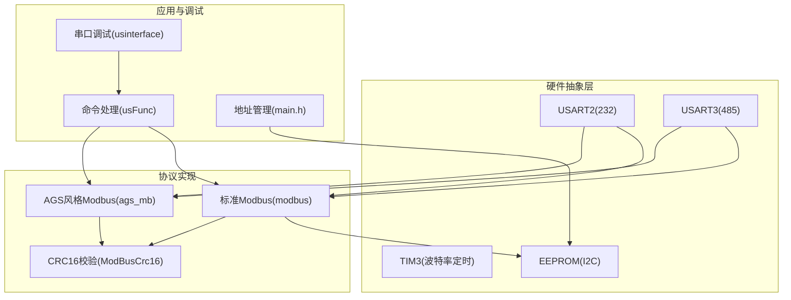
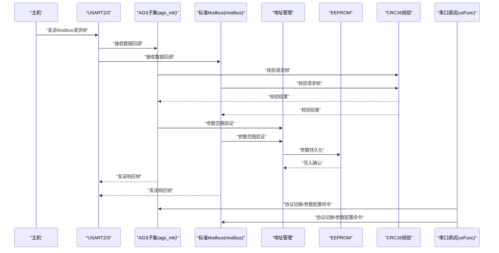
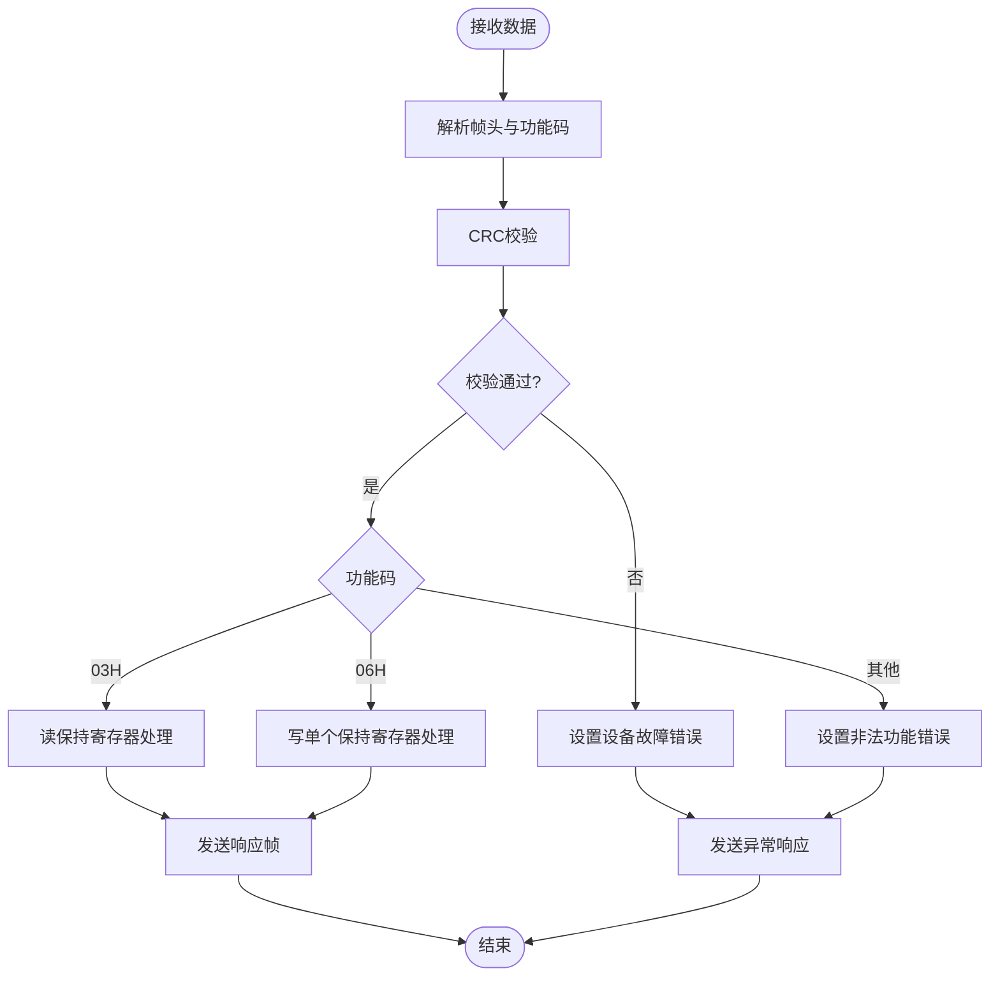
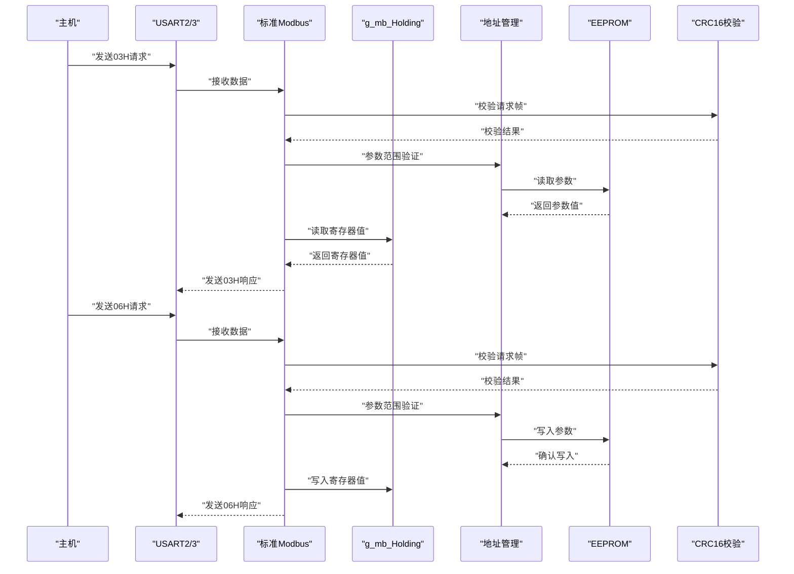
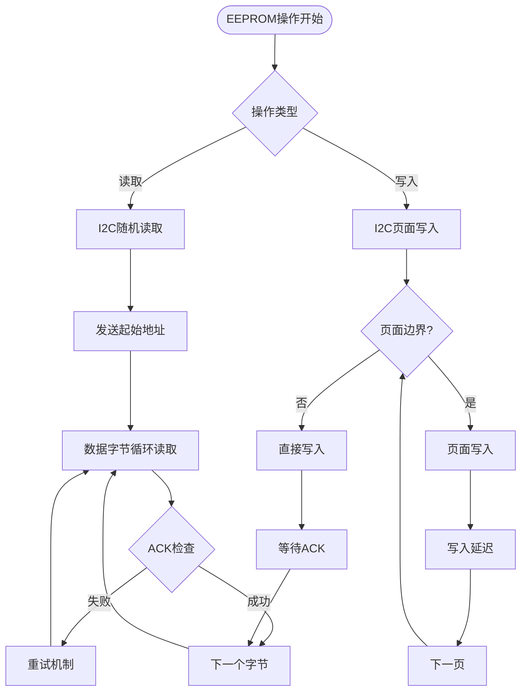
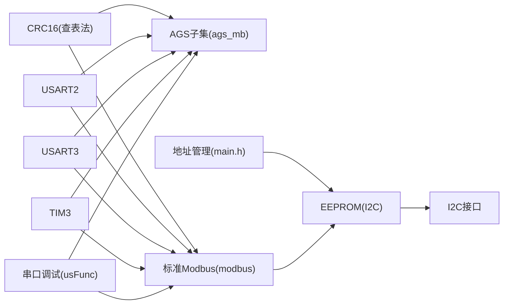

# Modbus协议实现

<cite>
**本文引用的文件列表**
- [Modbus通信协议说明书.md](file://Doc/Modbus通信协议说明书.md)
- [ags_mb.h](file://SRC/HARDWARE/ags_mb/ags_mb.h)
- [ags_mb.c](file://SRC/HARDWARE/ags_mb/ags_mb.c)
- [ModBusCrc16.h](file://SRC/HARDWARE/ags_mb/ModBusCrc16.h)
- [ModBusCrc16.c](file://SRC/HARDWARE/ags_mb/ModBusCrc16.c)
- [modbus.h](file://SRC/HARDWARE/modbus/modbus.h)
- [modbus.c](file://SRC/HARDWARE/modbus/modbus.c)
- [usInterface.c](file://SRC/HARDWARE/usinterface/usInterface.c)
- [usFunc.c](file://SRC/HARDWARE/usinterface/usFunc.c)
- [EEP24Serial.c](file://SRC/HARDWARE/EEPROM/EEP24Serial.c)
- [main.h](file://SRC/APP/main.h)
- [app.h](file://SRC/APP/app.h)
- [elab_common.h](file://SRC/3rd/common/elab_common.h)
</cite>

## 更新摘要
**所做更改**
- 新增详细的Modbus通信协议说明书文档，提供完整的协议规范和寄存器映射
- 更新地址管理系统实现，修复地址同步问题和参数初始化机制
- 增强参数持久化机制，完善EEPROM写入和读取流程
- 优化系统可靠性，改进参数范围验证和异常处理

## 目录
1. [简介](#简介)
2. [项目结构](#项目结构)
3. [核心组件](#核心组件)
4. [架构总览](#架构总览)
5. [详细组件分析](#详细组件分析)
6. [地址管理系统改进](#地址管理系统改进)
7. [参数持久化机制](#参数持久化机制)
8. [依赖关系分析](#依赖关系分析)
9. [性能考量](#性能考量)
10. [故障排查指南](#故障排查指南)
11. [结论](#结论)
12. [附录](#附录)

## 简介
本文件面向通用开关器项目的Modbus协议实现，系统性梳理了Modbus RTU在项目中的支持情况、实现细节与扩展路径。基于最新的应用变更，重点覆盖：
- 支持的功能码：读保持寄存器(03H)、写单个保持寄存器(06H)、写多个保持寄存器(10H)等。
- 数据帧格式、寄存器映射与地址分配规则，基于完整的Modbus通信协议说明书。
- CRC16校验算法的实现与应用。
- 与AGS协议的对比与兼容处理、协议切换机制。
- 地址管理系统的改进，包括修复地址同步问题和增强参数初始化。
- 参数持久化机制的优化，完善EEPROM写入和读取流程。
- 调试方法与常见问题解决方案。
- 集成与扩展的技术指导。

## 项目结构
项目在硬件层提供了两套Modbus实现：
- AGS风格Modbus子集实现（ags_mb）：仅实现部分功能码，聚焦于读保持寄存器与写单个寄存器，适配开关器业务场景。
- 标准Modbus实现（modbus）：完整支持03H/06H/10H功能码，提供完整的寄存器映射与写入逻辑。

此外，串口调试接口（usinterface）提供协议切换与参数配置能力，便于开发与测试。地址管理系统经过改进，增强了参数初始化和持久化机制。

**图表来源**
- [ags_mb.c:7-473](file://SRC/HARDWARE/ags_mb/ags_mb.c#L7-L473)
- [modbus.c:35-67](file://SRC/HARDWARE/modbus/modbus.c#L35-L67)
- [ModBusCrc16.c:62-74](file://SRC/HARDWARE/ags_mb/ModBusCrc16.c#L62-L74)
- [usInterface.c:15-106](file://SRC/HARDWARE/usinterface/usInterface.c#L15-L106)
- [usFunc.c:707-747](file://SRC/HARDWARE/usinterface/usFunc.c#L707-L747)
- [EEP24Serial.c:35-60](file://SRC/HARDWARE/EEPROM/EEP24Serial.c#L35-L60)

**章节来源**
- [ags_mb.h:1-163](file://SRC/HARDWARE/ags_mb/ags_mb.h#L1-L163)
- [modbus.h:1-213](file://SRC/HARDWARE/modbus/modbus.h#L1-L213)
- [main.h:124-167](file://SRC/APP/main.h#L124-L167)

## 核心组件
- AGS风格Modbus子集（ags_mb）
  - 支持功能码：03H（读保持寄存器）、06H（写单个保持寄存器），以及扩展功能码0x52。
  - 提供CRC16校验、帧解析、错误处理与发送/接收流程。
  - 寄存器映射：线圈位、离散输入、保持寄存器、输入寄存器四类，按宏定义划分。
- 标准Modbus实现（modbus）
  - 支持功能码：03H、06H、10H，提供完整的寄存器读写与异常处理。
  - 寄存器映射：按区域划分（状态、运行参数、用户、出厂参数、后备等），统一通过g_mb_Holding数组管理。
  - 地址管理：基于完整的地址管理系统，支持参数范围验证和持久化。
- CRC16校验（ModBusCrc16）
  - 查表法实现，提供ModbusCRC16函数，用于数据帧校验与响应帧生成。
- 串口调试接口（usinterface/usFunc）
  - 提供协议切换命令（PRTCL）、参数读写命令（ADDR/BDR/SPD/CNT等），支持AGS与MODBUS协议切换。
- 地址管理系统（main.h）
  - 完整的地址定义和参数范围限制，支持地址、波特率、速度、序列号等参数的管理。
  - 增强的参数初始化和持久化机制，确保系统启动时的正确配置。

**章节来源**
- [ags_mb.c:181-423](file://SRC/HARDWARE/ags_mb/ags_mb.c#L181-L423)
- [modbus.c:191-366](file://SRC/HARDWARE/modbus/modbus.c#L191-L366)
- [ModBusCrc16.c:62-74](file://SRC/HARDWARE/ags_mb/ModBusCrc16.c#L62-L74)
- [usFunc.c:707-747](file://SRC/HARDWARE/usinterface/usFunc.c#L707-L747)
- [main.h:124-167](file://SRC/APP/main.h#L124-L167)

## 架构总览
下图展示了Modbus协议在系统中的交互关系：串口驱动负责数据收发，协议实现负责帧解析与功能码处理，CRC模块提供校验，调试接口负责协议切换与参数配置，地址管理系统确保参数的正确性和持久化。

**图表来源**
- [ags_mb.c:426-473](file://SRC/HARDWARE/ags_mb/ags_mb.c#L426-L473)
- [modbus.c:469-517](file://SRC/HARDWARE/modbus/modbus.c#L469-L517)
- [ModBusCrc16.c:62-74](file://SRC/HARDWARE/ags_mb/ModBusCrc16.c#L62-L74)
- [usFunc.c:707-747](file://SRC/HARDWARE/usinterface/usFunc.c#L707-L747)
- [EEP24Serial.c:202-313](file://SRC/HARDWARE/EEPROM/EEP24Serial.c#L202-L313)

## 详细组件分析

### AGS风格Modbus子集（ags_mb）
- 功能码支持
  - 读保持寄存器(03H)：支持多种子操作（读状态、当前通道、地址、版本、波特率、序列号、速度、切换次数、回复方式、半通道、通道数等），按op_addr区分。
  - 写单个保持寄存器(06H)：支持写通道、地址、复位、波特率、序列号、速度、切换次数、回复方式、半通道、通道数等。
  - 扩展功能(0x52)：预留扩展用途。
- 数据帧与CRC
  - 请求帧：设备地址 + 功能码 + 操作码/地址 + 数据 + CRC16。
  - 响应帧：设备地址 + 功能码 + 数据长度/数据 + CRC16。
  - CRC16采用查表法实现，确保实时性与准确性。
- 错误处理
  - 非法功能码、非法地址、非法数据值、设备故障、从设备忙、非法从站地址等异常码处理。
- 寄存器映射与地址分配
  - 线圈位、离散输入、保持寄存器、输入寄存器四类，分别定义长度与起始地址，便于HMI与上位机对接。
- 通信参数与时序
  - 支持9600/19200/38400波特率，基于每个bit时间计算帧间隔与超时阈值，保证RTU时序要求。

**图表来源**
- [ags_mb.c:426-473](file://SRC/HARDWARE/ags_mb/ags_mb.c#L426-L473)
- [ags_mb.c:181-285](file://SRC/HARDWARE/ags_mb/ags_mb.c#L181-L285)
- [ags_mb.c:287-423](file://SRC/HARDWARE/ags_mb/ags_mb.c#L287-L423)

**章节来源**
- [ags_mb.h:107-163](file://SRC/HARDWARE/ags_mb/ags_mb.h#L107-L163)
- [ags_mb.c:181-423](file://SRC/HARDWARE/ags_mb/ags_mb.c#L181-L423)
- [ModBusCrc16.c:62-74](file://SRC/HARDWARE/ags_mb/ModBusCrc16.c#L62-L74)

### 标准Modbus实现（modbus）
- 功能码支持
  - 03H：读保持寄存器，支持批量读取，返回字节数为寄存器数量×2。
  - 06H：写单个保持寄存器，写入成功后返回原始请求帧（回显）。
  - 10H：写多个保持寄存器，支持批量写入，校验字节数与寄存器数量一致性。
- 寄存器映射
  - 区域划分：状态寄存器、运行参数、用户寄存器、出厂参数、后备寄存器等，每个区域包含若干寄存器地址，通过宏定义集中管理。
  - 读保持：根据寄存器地址动态更新g_mb_Holding数组，确保读取最新值。
  - 写保持：根据寄存器地址执行对应动作（如切换通道、设置速度、写入序列号等）。
- CRC与异常处理
  - 使用CRC16校验请求帧，校验失败设置设备错误；异常码通过标准Modbus异常响应格式返回。
- 通信参数与时序
  - 与AGS实现一致的波特率与时序参数，保证RTU帧边界与字符间隔满足规范。
- 地址管理集成
  - 集成完整的地址管理系统，支持参数范围验证和持久化。
  - 增强的参数初始化机制，确保系统启动时的正确配置。

**图表来源**
- [modbus.c:191-366](file://SRC/HARDWARE/modbus/modbus.c#L191-L366)
- [modbus.c:469-517](file://SRC/HARDWARE/modbus/modbus.c#L469-L517)
- [modbus.h:71-198](file://SRC/HARDWARE/modbus/modbus.h#L71-L198)
- [EEP24Serial.c:95-200](file://SRC/HARDWARE/EEPROM/EEP24Serial.c#L95-L200)

**章节来源**
- [modbus.h:1-213](file://SRC/HARDWARE/modbus/modbus.h#L1-L213)
- [modbus.c:191-366](file://SRC/HARDWARE/modbus/modbus.c#L191-L366)
- [modbus.c:523-765](file://SRC/HARDWARE/modbus/modbus.c#L523-L765)

### CRC16校验算法
- 实现方式
  - 查表法：预置高低位查表，逐字节迭代计算，最终组合为16位CRC值。
- 应用场景
  - 请求帧校验：接收端在处理前先校验CRC，失败则设置设备错误。
  - 响应帧生成：构造响应帧后追加CRC16，确保接收端验证通过。
- 性能与可靠性
  - 查表法在嵌入式环境下具有较低CPU开销，适合实时性要求高的RTU通信。

**章节来源**
- [ModBusCrc16.c:2-74](file://SRC/HARDWARE/ags_mb/ModBusCrc16.c#L2-L74)

### 协议切换与AGS兼容
- 协议切换
  - 通过串口命令TermProtocal（PRTCL）在AGS、HX、MODBUS三种协议间切换，切换后写入EEPROM并生效。
- AGS兼容性
  - AGS风格实现保留了AGS协议的常用读写操作，同时兼容Modbus标准功能码（03H/06H/10H）。
  - 通过统一的CRC与帧格式，保证与主流Modbus工具链的互通。

**章节来源**
- [usFunc.c:707-747](file://SRC/HARDWARE/usinterface/usFunc.c#L707-L747)
- [ags_mb.c:181-423](file://SRC/HARDWARE/ags_mb/ags_mb.c#L181-L423)
- [modbus.c:191-366](file://SRC/HARDWARE/modbus/modbus.c#L191-L366)

## 地址管理系统改进

### 地址定义与参数范围
地址管理系统经过重大改进，提供了完整的参数地址定义和严格的范围验证：

- **基础参数地址**
  - 地址范围：0-63，支持设备地址设置
  - 波特率范围：1-3，对应9600/19200/38400 bps
  - 速度范围：20-200，支持电机速度调节
  - 通道数范围：3-16，支持多通道控制

- **序列号管理**
  - 序列号长度：5字节（SnCode[0]-SnCode[4]）
  - 自动保存到EEPROM，断电不丢失
  - 支持序列号读写操作

- **运行参数管理**
  - 移动次数：4字节，支持切换次数统计
  - 老化次数：4字节，支持老化模式统计
  - 半通道模式：1字节，支持半通道控制

- **出厂参数管理**
  - 阀类型：1字节，支持不同阀类型配置
  - 控制模式：1字节，支持多种控制模式
  - 补偿参数：支持原点、方向、顺时针、逆时针补偿

### 参数初始化与同步机制
改进的参数初始化机制确保系统启动时的正确配置：

- **启动参数读取**
  - 系统上电时从EEPROM读取配置参数
  - 参数有效性验证和默认值回退机制
  - 波特率参数的自动检测和配置

- **参数同步机制**
  - 写入参数后立即同步到内存缓冲区
  - EEPROM写入操作的确认机制
  - 参数变更的通知和广播机制

- **异常处理**
  - 参数范围越界时的异常处理
  - EEPROM写入失败的重试机制
  - 参数读取错误的降级处理

**章节来源**
- [main.h:124-167](file://SRC/APP/main.h#L124-L167)
- [main.h:220-230](file://SRC/APP/main.h#L220-L230)
- [app.h:1-37](file://SRC/APP/app.h#L1-L37)

## 参数持久化机制

### EEPROM接口实现
基于I2C的EEPROM接口提供了可靠的参数持久化能力：

- **I2C通信协议**
  - 支持随机读取和顺序写入模式
  - 页面写入大小优化，支持256字节页面
  - ACK/NACK机制确保数据完整性

- **数据读取流程**
  - I2CStart()启动条件
  - 设备地址和读操作命令发送
  - 数据字节循环读取和校验
  - I2CStop()结束条件

- **数据写入流程**
  - 页面边界检测和处理
  - 多次写入循环处理
  - 写入延迟和确认机制
  - 跨页面写入的特殊处理

- **错误处理机制**
  - SDA线状态检测
  - ACK等待超时处理
  - 写入完成确认
  - 读取校验和计算

**图表来源**
- [EEP24Serial.c:95-200](file://SRC/HARDWARE/EEPROM/EEP24Serial.c#L95-L200)
- [EEP24Serial.c:202-313](file://SRC/HARDWARE/EEPROM/EEP24Serial.c#L202-L313)

**章节来源**
- [EEP24Serial.c:1-316](file://SRC/HARDWARE/EEPROM/EEP24Serial.c#L1-L316)

## 依赖关系分析
- 组件耦合
  - ags_mb与ModBusCrc16强耦合（CRC16依赖），modbus与CRC16弱耦合（通过公共函数调用）。
  - 两个Modbus实现相互独立，互不依赖，便于按需选择。
  - 地址管理系统与EEPROM接口紧密耦合，确保参数的可靠持久化。
- 外部依赖
  - 串口驱动（USART2/3）与定时器（TIM3）用于波特率与帧间隔控制。
  - EEPROM接口用于参数持久化（地址、波特率、速度、序列号、切换次数、回复方式、半通道、通道数等）。
  - I2C接口用于EEPROM通信，支持随机读取和页面写入。
- 协议接口
  - 串口调试接口提供统一的命令入口，支持协议切换与参数配置，降低集成复杂度。

**图表来源**
- [ModBusCrc16.c:62-74](file://SRC/HARDWARE/ags_mb/ModBusCrc16.c#L62-L74)
- [ags_mb.c:7-473](file://SRC/HARDWARE/ags_mb/ags_mb.c#L7-L473)
- [modbus.c:35-67](file://SRC/HARDWARE/modbus/modbus.c#L35-L67)
- [usFunc.c:707-747](file://SRC/HARDWARE/usinterface/usFunc.c#L707-L747)
- [EEP24Serial.c:35-60](file://SRC/HARDWARE/EEPROM/EEP24Serial.c#L35-L60)

**章节来源**
- [usInterface.c:15-106](file://SRC/HARDWARE/usinterface/usInterface.c#L15-L106)
- [usFunc.c:707-747](file://SRC/HARDWARE/usinterface/usFunc.c#L707-L747)

## 性能考量
- CRC16查表法在嵌入式环境具备良好性能，适合高频通信场景。
- 波特率与时序参数经过优化，满足Modbus RTU字符间隔与帧间隔要求。
- 通过最小接收计数与超时检测，避免无效帧占用资源。
- EEPROM写入采用页面优化，减少写入次数和延迟。
- 地址管理系统提供快速参数访问和范围验证。
- 建议在高负载场景下：
  - 合理设置帧间隔与超时阈值，避免误判。
  - 对频繁写入的寄存器进行缓存与批量处理，减少EEPROM写入次数。
  - 利用地址管理系统的参数同步机制，确保数据一致性。

## 故障排查指南
- CRC校验失败
  - 现象：接收端设置设备错误并丢弃帧。
  - 排查：检查波特率设置、线缆与终端电阻、噪声干扰；确认CRC生成与校验逻辑一致。
- 非法功能码/地址/数据
  - 现象：异常响应帧返回对应异常码。
  - 排查：核对功能码与寄存器地址范围；检查数据长度与字节数是否匹配。
- 从设备忙
  - 现象：写操作返回忙异常。
  - 排查：检查设备状态机，避免在切换过程中接受写请求；必要时增加重试策略。
- 波特率不匹配
  - 现象：通信时断时续或数据乱码。
  - 排查：确认主从两端波特率一致；检查定时器初始化参数。
- 协议切换无效
  - 现象：切换命令执行后仍无法通信。
  - 排查：确认EEPROM写入成功；重启设备使新协议生效；检查命令格式与参数范围。
- EEPROM写入失败
  - 现象：参数修改后重启失效。
  - 排查：检查I2C连接和EEPROM芯片；确认写入时序和ACK检测；验证参数范围。
- 地址同步问题
  - 现象：参数写入后读取值不正确。
  - 排查：检查地址管理系统的参数同步机制；确认内存缓冲区与EEPROM的一致性。

**章节来源**
- [ags_mb.c:159-179](file://SRC/HARDWARE/ags_mb/ags_mb.c#L159-L179)
- [modbus.c:167-186](file://SRC/HARDWARE/modbus/modbus.c#L167-L186)
- [EEP24Serial.c:174-187](file://SRC/HARDWARE/EEPROM/EEP24Serial.c#L174-L187)

## 结论
本项目提供了两套Modbus实现：AGS风格子集与标准Modbus，既满足开关器业务的轻量化需求，又兼容主流Modbus生态。基于最新的应用变更，系统在以下方面得到了显著改进：

- **协议规范完善**：基于详细的Modbus通信协议说明书，提供了完整的协议规范和寄存器映射。
- **地址管理增强**：修复了地址同步问题，改进了参数初始化和持久化机制，增强了系统可靠性。
- **参数持久化优化**：基于I2C的EEPROM接口提供了可靠的参数持久化能力，支持页面写入和错误处理。
- **异常处理改进**：增强了参数范围验证和异常处理机制，提高了系统的健壮性。

通过CRC16查表法、完善的错误处理与协议切换机制，以及改进的地址管理系统，系统在可靠性与可维护性方面表现良好。建议在实际部署中结合具体应用场景选择合适的协议实现，并遵循Modbus RTU规范进行参数配置与调试。

## 附录
- 数据帧格式（示例）
  - 请求帧：设备地址 + 功能码 + 寄存器地址/数据 + CRC16
  - 响应帧：设备地址 + 功能码 + 数据长度/数据 + CRC16
- 寄存器映射要点
  - AGS子集：线圈位、离散输入、保持寄存器、输入寄存器四类，按宏定义分配。
  - 标准Modbus：按区域划分，统一通过g_mb_Holding数组管理，支持批量读写。
  - 地址管理系统：提供完整的参数地址定义和范围验证。
- 调试命令参考
  - PRTCL：切换协议类型（AGS/HX/MODBUS）
  - ADDR/BDR/SPD/CNT等：读写设备参数，便于现场配置与诊断。
- 参数范围限制
  - 地址：0-63
  - 波特率：1-3（9600/19200/38400）
  - 速度：20-200
  - 通道数：3-16
- EEPROM特性
  - 页面大小：256字节
  - 写入延迟：约5毫秒
  - 读取时序：支持随机读取
  - 错误处理：ACK检测和重试机制