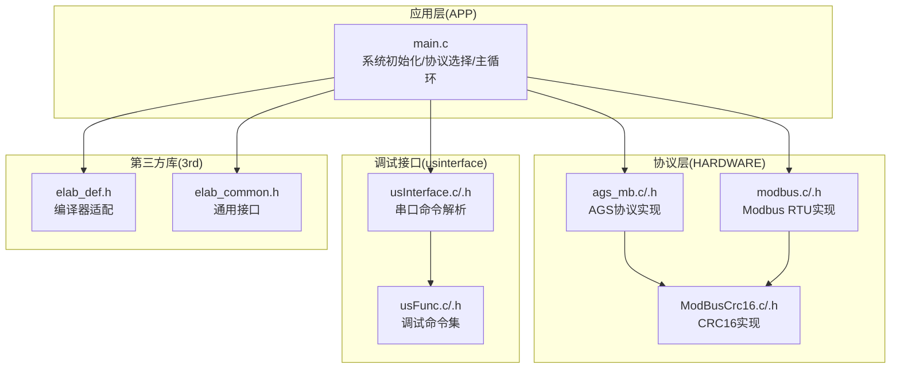
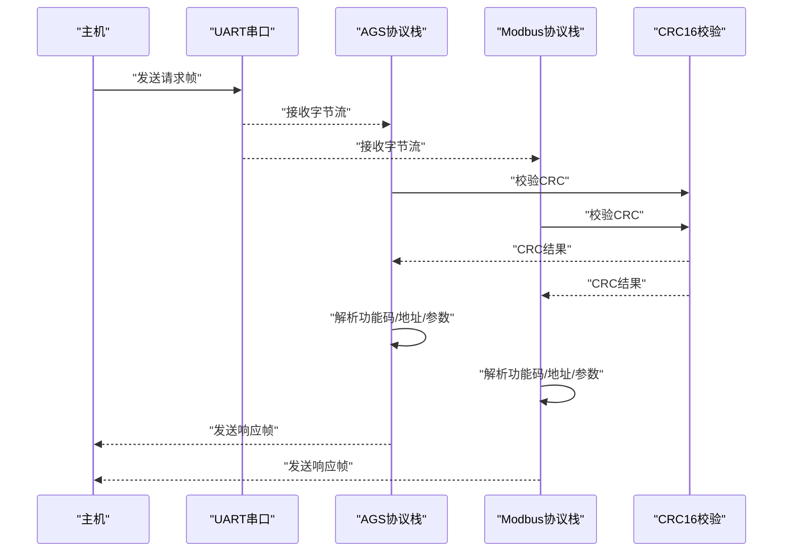
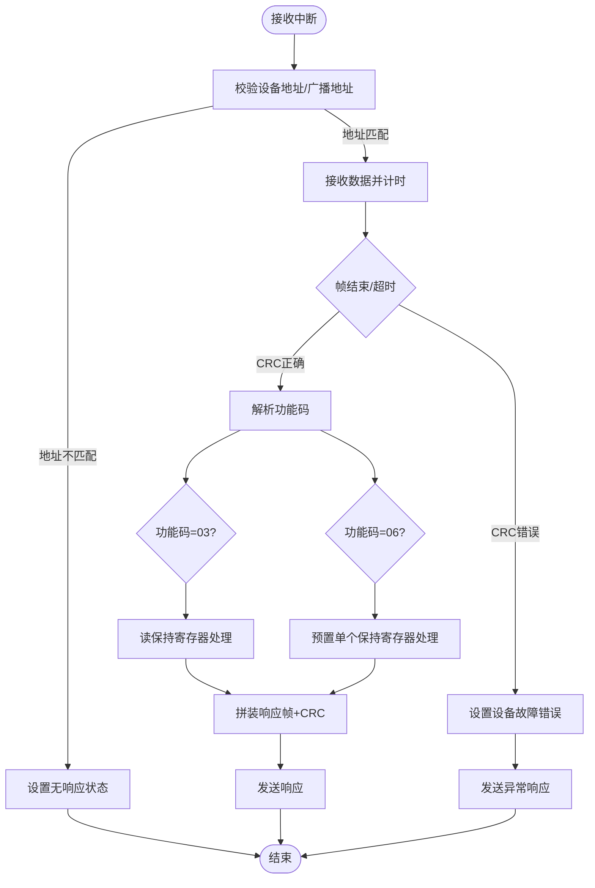
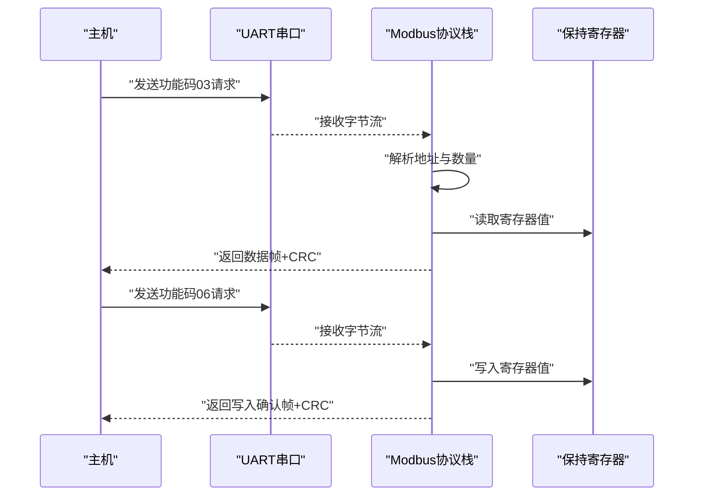
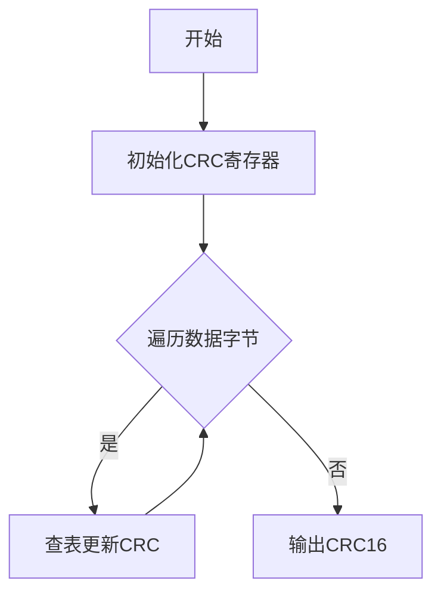
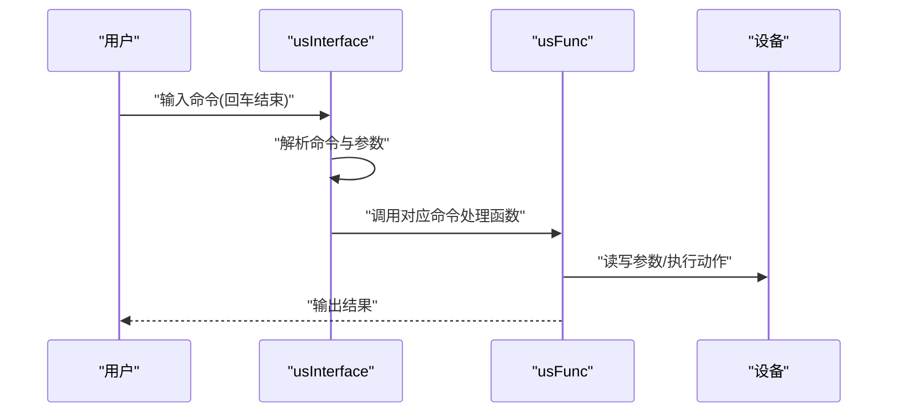
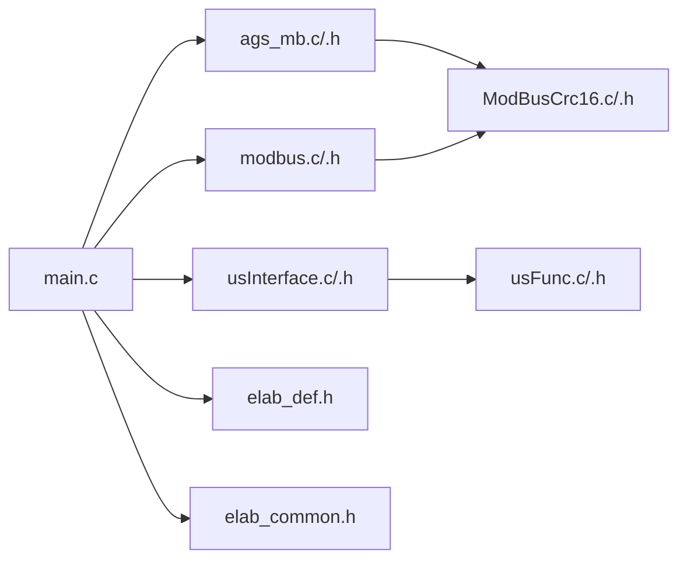

# 通信协议栈

<cite>
**本文引用的文件**
- [ags_mb.c](file://SRC/HARDWARE/ags_mb/ags_mb.c)
- [ags_mb.h](file://SRC/HARDWARE/ags_mb/ags_mb.h)
- [ModBusCrc16.c](file://SRC/HARDWARE/ags_mb/ModBusCrc16.c)
- [ModBusCrc16.h](file://SRC/HARDWARE/ags_mb/ModBusCrc16.h)
- [modbus.c](file://SRC/HARDWARE/modbus/modbus.c)
- [modbus.h](file://SRC/HARDWARE/modbus/modbus.h)
- [usInterface.c](file://SRC/HARDWARE/usinterface/usInterface.c)
- [usInterface.h](file://SRC/HARDWARE/usinterface/usInterface.h)
- [usFunc.c](file://SRC/HARDWARE/usinterface/usFunc.c)
- [usFunc.h](file://SRC/HARDWARE/usinterface/usFunc.h)
- [main.c](file://SRC/APP/main.c)
- [elab_def.h](file://SRC/3rd/common/elab_def.h)
- [elab_common.h](file://SRC/3rd/common/elab_common.h)
</cite>

## 目录
1. [简介](#简介)
2. [项目结构](#项目结构)
3. [核心组件](#核心组件)
4. [架构总览](#架构总览)
5. [详细组件分析](#详细组件分析)
6. [依赖关系分析](#依赖关系分析)
7. [性能考量](#性能考量)
8. [故障排查指南](#故障排查指南)
9. [结论](#结论)
10. [附录](#附录)

## 简介
本文件面向通用开关器项目的通信协议栈，系统性梳理并解释AGS协议与Modbus RTU协议的实现细节、数据帧结构、错误检测与处理机制、寄存器映射与功能码定义、CRC校验流程以及扩展与定制方法。文档同时提供调试工具与测试方法，帮助开发者快速定位问题并进行协议优化与二次开发。

## 项目结构
项目采用硬件抽象与应用分离的组织方式：
- 协议实现位于硬件层：AGS协议与Modbus协议分别封装在独立模块中，包含初始化、帧处理、错误处理与CRC校验。
- 串口调试接口位于usinterface模块，提供命令行交互与参数设置能力。
- 应用入口在APP层，负责系统初始化、协议选择与主循环调度。

图表来源
- [main.c:466-494](file://SRC/APP/main.c#L466-L494)
- [ags_mb.c:7-73](file://SRC/HARDWARE/ags_mb/ags_mb.c#L7-L73)
- [modbus.c:35-67](file://SRC/HARDWARE/modbus/modbus.c#L35-L67)
- [usInterface.c:136-141](file://SRC/HARDWARE/usinterface/usInterface.c#L136-L141)
- [usFunc.c:753-778](file://SRC/HARDWARE/usinterface/usFunc.c#L753-L778)

章节来源
- [main.c:433-494](file://SRC/APP/main.c#L433-L494)
- [ags_mb.h:12-81](file://SRC/HARDWARE/ags_mb/ags_mb.h#L12-L81)
- [modbus.h:25-31](file://SRC/HARDWARE/modbus/modbus.h#L25-L31)

## 核心组件
- AGS协议栈：基于Modbus RTU的扩展协议，支持读保持寄存器与预置单个保持寄存器两类功能码，具备自定义扩展功能码与广播地址支持。
- Modbus RTU协议栈：标准Modbus RTU实现，支持读保持寄存器、写单个保持寄存器、写多个保持寄存器等常用功能码。
- CRC16校验：采用标准Modbus CRC16查找表算法，确保帧完整性。
- 串口调试接口：提供命令行交互、参数读写、设备状态查看与协议切换等功能。

章节来源
- [ags_mb.c:182-285](file://SRC/HARDWARE/ags_mb/ags_mb.c#L182-L285)
- [modbus.c:191-278](file://SRC/HARDWARE/modbus/modbus.c#L191-L278)
- [ModBusCrc16.c:62-74](file://SRC/HARDWARE/ags_mb/ModBusCrc16.c#L62-L74)
- [usFunc.c:753-778](file://SRC/HARDWARE/usinterface/usFunc.c#L753-L778)

## 架构总览
协议栈整体采用“协议抽象层 + 数据帧处理 + 错误检测”的分层设计：
- 协议抽象层：定义状态机、错误码、缓冲区与公共参数，屏蔽底层差异。
- 数据帧处理：解析功能码、校验地址与CRC、执行对应业务逻辑并生成响应。
- 错误检测：帧超时、CRC错误、非法地址/数据、设备忙等异常处理与错误响应。

图表来源
- [ags_mb.c:426-473](file://SRC/HARDWARE/ags_mb/ags_mb.c#L426-L473)
- [modbus.c:469-517](file://SRC/HARDWARE/modbus/modbus.c#L469-L517)
- [ModBusCrc16.c:62-74](file://SRC/HARDWARE/ags_mb/ModBusCrc16.c#L62-L74)

## 详细组件分析

### AGS协议栈
- 初始化与串口配置：根据系统参数初始化USART与TIM，设置波特率与帧间隔阈值。
- 帧接收与状态机：维护接收计数、超时计时与运行状态，支持空闲帧检测与错误帧识别。
- 功能码处理：
  - 功能码03：读保持寄存器，支持读取设备状态、当前通道、设备地址、软件版本、波特率、序列号、速度、切换次数、回复方式、半通道与通道数等。
  - 功能码06：预置单个保持寄存器，支持写通道、地址、复位、波特率、序列号、速度、切换次数、回复方式、半通道与通道数等。
- 错误处理：针对非法功能码、非法地址、非法数据、设备故障、设备忙等情况生成异常响应帧。
- CRC校验：使用查找表法计算CRC16，确保帧完整性。

图表来源
- [ags_mb.c:131-157](file://SRC/HARDWARE/ags_mb/ags_mb.c#L131-L157)
- [ags_mb.c:426-473](file://SRC/HARDWARE/ags_mb/ags_mb.c#L426-L473)
- [ags_mb.c:182-285](file://SRC/HARDWARE/ags_mb/ags_mb.c#L182-L285)
- [ags_mb.c:287-423](file://SRC/HARDWARE/ags_mb/ags_mb.c#L287-L423)

章节来源
- [ags_mb.c:7-73](file://SRC/HARDWARE/ags_mb/ags_mb.c#L7-L73)
- [ags_mb.c:426-473](file://SRC/HARDWARE/ags_mb/ags_mb.c#L426-L473)
- [ags_mb.c:182-285](file://SRC/HARDWARE/ags_mb/ags_mb.c#L182-L285)
- [ags_mb.c:287-423](file://SRC/HARDWARE/ags_mb/ags_mb.c#L287-L423)

### Modbus RTU协议栈
- 初始化与参数：初始化USART、TIM，设置从站地址、保持寄存器数组与默认值。
- 帧处理：
  - 功能码03：读保持寄存器，按地址范围读取并返回数据。
  - 功能码06：写单个保持寄存器，更新对应寄存器值。
  - 功能码10：写多个保持寄存器，批量写入寄存器。
- 寄存器映射：定义控制指令、只读参数、运行参数、序列号、出厂参数、后备寄存器等区域，覆盖设备状态、运行参数、用户数据与工厂参数。
- 错误处理：非法功能码、地址越界、数据长度不匹配、CRC错误等异常处理与异常响应。

图表来源
- [modbus.c:191-278](file://SRC/HARDWARE/modbus/modbus.c#L191-L278)
- [modbus.c:284-367](file://SRC/HARDWARE/modbus/modbus.c#L284-L367)
- [modbus.c:372-467](file://SRC/HARDWARE/modbus/modbus.c#L372-L467)

章节来源
- [modbus.c:35-67](file://SRC/HARDWARE/modbus/modbus.c#L35-L67)
- [modbus.c:469-517](file://SRC/HARDWARE/modbus/modbus.c#L469-L517)
- [modbus.h:81-198](file://SRC/HARDWARE/modbus/modbus.h#L81-L198)

### CRC16校验
- 查找表法：使用预置的高低字节查找表，逐字节迭代计算CRC16，保证效率与准确性。
- 应用场景：AGS协议与Modbus协议均在发送响应帧前附加CRC16校验值。

图表来源
- [ModBusCrc16.c:62-74](file://SRC/HARDWARE/ags_mb/ModBusCrc16.c#L62-L74)

章节来源
- [ModBusCrc16.c:1-76](file://SRC/HARDWARE/ags_mb/ModBusCrc16.c#L1-L76)

### 串口调试接口
- 命令解析：支持回车/换行结束符，自动超时清理，参数个数与长度校验。
- 调试命令集：版本查询、IIC读写、复位、参数设置（地址、通道数、波特率、速度、减速比、半通道、电流、间隔、切换次数、回复方式、协议类型）、点检模式等。
- 用户接口：BootInterface启动、StrProc处理接收、TimeOutInt超时处理。

图表来源
- [usInterface.c:79-106](file://SRC/HARDWARE/usinterface/usInterface.c#L79-L106)
- [usFunc.c:753-778](file://SRC/HARDWARE/usinterface/usFunc.c#L753-L778)

章节来源
- [usInterface.c:15-106](file://SRC/HARDWARE/usinterface/usInterface.c#L15-L106)
- [usFunc.c:707-747](file://SRC/HARDWARE/usinterface/usFunc.c#L707-L747)

## 依赖关系分析
- 协议选择：应用层根据EEPROM中协议类型选择AGS或Modbus协议栈。
- 串口与定时器：协议栈依赖USART与TIM进行数据收发与时序控制。
- CRC依赖：协议栈均依赖CRC16实现。
- 调试接口：调试命令通过usInterface与usFunc实现，与协议栈解耦。

图表来源
- [main.c:466-494](file://SRC/APP/main.c#L466-L494)
- [ags_mb.c:7-73](file://SRC/HARDWARE/ags_mb/ags_mb.c#L7-L73)
- [modbus.c:35-67](file://SRC/HARDWARE/modbus/modbus.c#L35-L67)
- [usInterface.c:136-141](file://SRC/HARDWARE/usinterface/usInterface.c#L136-L141)

章节来源
- [main.c:466-494](file://SRC/APP/main.c#L466-L494)

## 性能考量
- 波特率与时序：不同波特率下，每个字节的占空与时钟周期不同，需合理设置BUS_IDLE_TIME与FRAME_ERR_TIME阈值，避免误判帧结束与超时。
- CRC计算：查找表法相比位运算法具有更高吞吐，适合实时性要求高的场景。
- 中断与轮询：协议栈通过中断接收与轮询处理相结合，减少CPU占用并提高响应速度。
- 缓冲区管理：接收缓冲区与发送缓冲区大小需与最大帧长度匹配，避免溢出与丢帧。

## 故障排查指南
- CRC错误：检查数据帧长度、字节顺序与CRC计算逻辑，确认发送端与接收端一致。
- 地址错误：核对设备地址与广播地址配置，确保主机请求的目标地址正确。
- 功能码异常：确认主机发送的功能码是否在协议栈支持范围内。
- 超时与溢出：检查BUS_IDLE_TIME与FRAME_ERR_TIME设置，确保在噪声环境下稳定工作。
- 调试命令：通过串口调试接口查看版本、参数与设备状态，快速定位问题。

章节来源
- [ags_mb.c:159-179](file://SRC/HARDWARE/ags_mb/ags_mb.c#L159-L179)
- [modbus.c:167-186](file://SRC/HARDWARE/modbus/modbus.c#L167-L186)
- [usFunc.c:644-671](file://SRC/HARDWARE/usinterface/usFunc.c#L644-L671)

## 结论
本通信协议栈在AGS协议与Modbus RTU协议的基础上，提供了清晰的状态机、完善的错误处理与高效的CRC校验机制。通过串口调试接口，开发者可便捷地进行参数配置与设备诊断。建议在实际部署中结合具体应用场景调整时序参数与错误阈值，确保在复杂工业环境下的稳定性与可靠性。

## 附录

### 功能码与寄存器映射
- AGS协议功能码
  - 03：读保持寄存器（扩展）
  - 06：预置单个保持寄存器（扩展）
- Modbus功能码
  - 03：读保持寄存器
  - 06：写单个保持寄存器
  - 10：写多个保持寄存器

- 寄存器区域（Modbus）
  - 控制指令（CTRL）：设置切换通道、复位、模式设置等
  - 只读参数（STATUS）：当前通道、控制状态、上次移动耗时、软件版本与计数
  - 运行参数（OPERATE1）：地址、速度、方向、波特率、移动次数
  - 序列号（USER）：序列号分段存储
  - 出厂参数（FACTORY1/FACTORY2）：UID、通道数、半通道、补偿值、安全码等

章节来源
- [ags_mb.h:15-33](file://SRC/HARDWARE/ags_mb/ags_mb.h#L15-L33)
- [modbus.h:81-198](file://SRC/HARDWARE/modbus/modbus.h#L81-L198)

### CRC校验机制
- 查找表法：使用高低字节查找表，逐字节迭代计算CRC16，输出高字节在前。
- 应用：AGS协议与Modbus协议在发送响应帧前附加CRC16校验值。

章节来源
- [ModBusCrc16.c:62-74](file://SRC/HARDWARE/ags_mb/ModBusCrc16.c#L62-L74)

### 通信调试工具与测试方法
- 串口助手：建议使用以回车发送的串口助手，便于命令解析与超时处理。
- 调试命令：通过命令集查看版本、参数与设备状态，执行参数设置与设备复位。
- 测试步骤：先通过点检模式确认参数一致性，再进行功能码测试与CRC验证。

章节来源
- [usInterface.c:6-8](file://SRC/HARDWARE/usinterface/usInterface.c#L6-L8)
- [usFunc.c:707-747](file://SRC/HARDWARE/usinterface/usFunc.c#L707-L747)