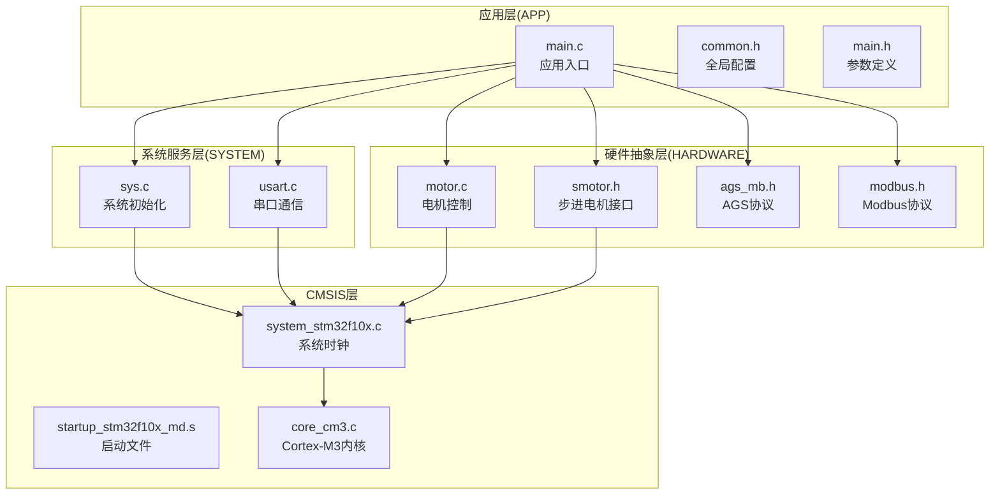
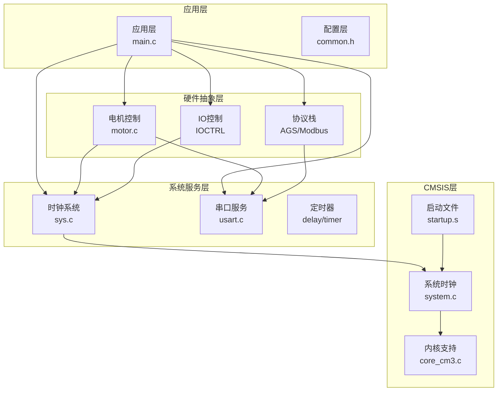
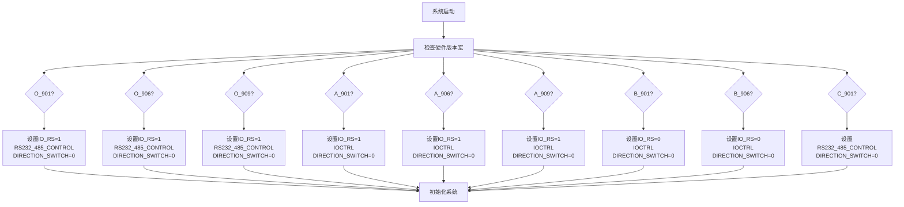
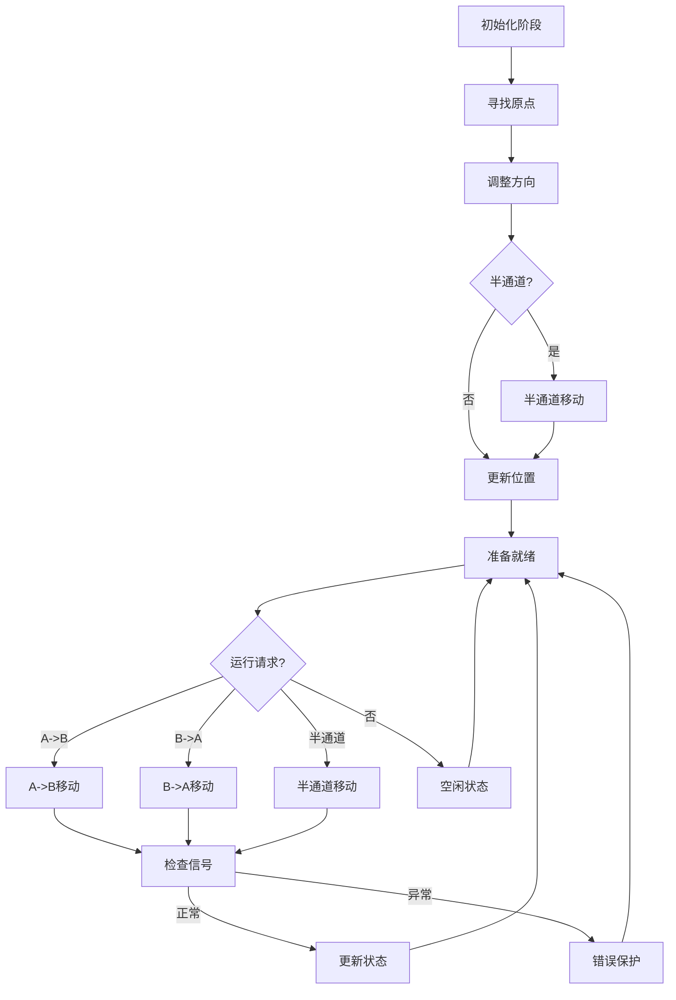
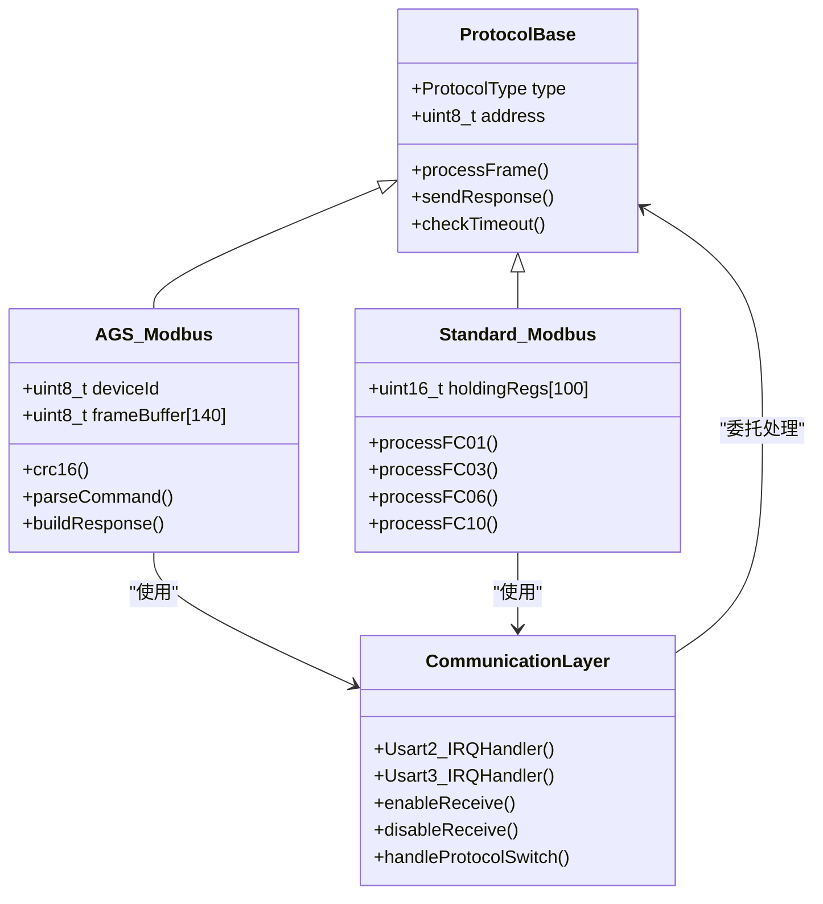
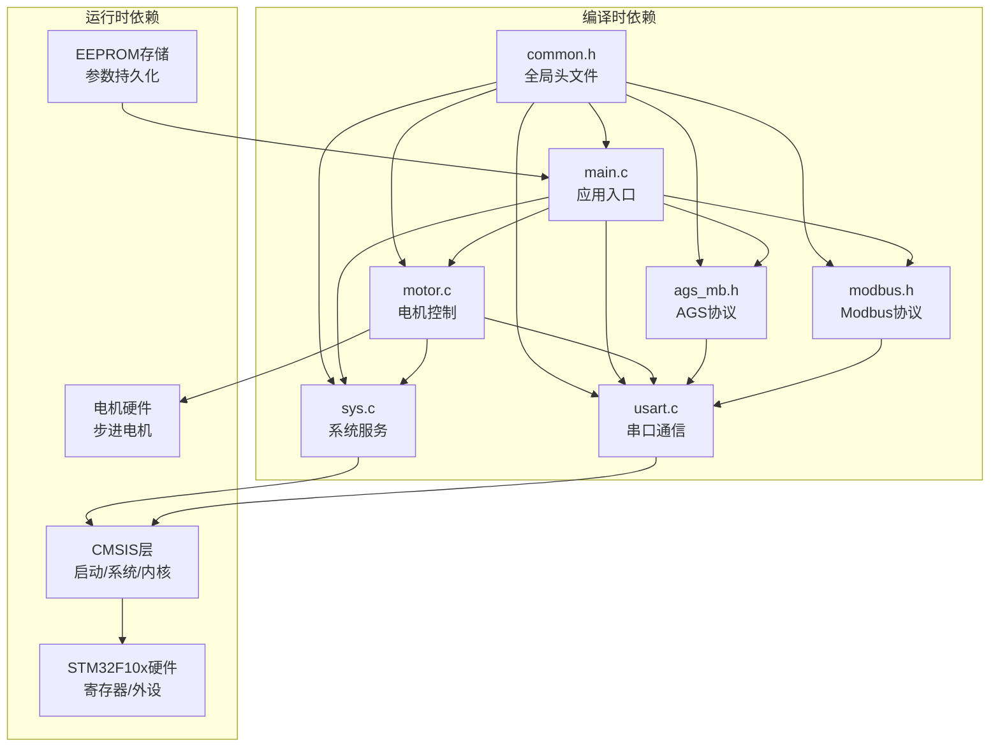

# 技术架构概览

<cite>
**本文档引用的文件**
- [main.c](file://SRC/APP/main.c)
- [main.h](file://SRC/APP/main.h)
- [common.h](file://SRC/APP/common.h)
- [sys.c](file://SRC/SYSTEM/sys/sys.c)
- [usart.c](file://SRC/SYSTEM/usart/usart.c)
- [motor.c](file://SRC/HARDWARE/motor/motor.c)
- [smotor.h](file://SRC/HARDWARE/motor/smotor.h)
- [ags_mb.h](file://SRC/HARDWARE/ags_mb/ags_mb.h)
- [modbus.h](file://SRC/HARDWARE/modbus/modbus.h)
- [startup_stm32f10x_md.s](file://SRC/CMSIS/DeviceSupport/startup/startup_stm32f10x_md.s)
- [system_stm32f10x.c](file://SRC/CMSIS/DeviceSupport/system_stm32f10x.c)
- [core_cm3.c](file://SRC/CMSIS/CoreSupport/core_cm3.c)
- [elab_common.h](file://SRC/3rd/common/elab_common.h)
</cite>

## 目录
1. [简介](#简介)
2. [项目结构](#项目结构)
3. [核心组件](#核心组件)
4. [架构总览](#架构总览)
5. [详细组件分析](#详细组件分析)
6. [依赖关系分析](#依赖关系分析)
7. [性能考虑](#性能考虑)
8. [故障排除指南](#故障排除指南)
9. [结论](#结论)

## 简介
本项目为通用开关器嵌入式系统，基于ARM Cortex-M3内核STM32F10x系列微控制器，采用分层架构设计，包含应用层(APP)、硬件抽象层(HARDWARE)、系统服务层(SYSTEM)和CMSIS层。系统通过宏定义实现硬件版本灵活配置，支持多种硬件版本和IO控制模式，并提供AGS Modbus与标准Modbus两种通信协议。

## 项目结构
项目采用模块化组织方式，按功能层次划分为四个主要层级：



**图表来源**
- [main.c:433-494](file://SRC/APP/main.c#L433-L494)
- [common.h:1-526](file://SRC/APP/common.h#L1-L526)
- [sys.c:152-172](file://SRC/SYSTEM/sys/sys.c#L152-L172)
- [usart.c:38-66](file://SRC/SYSTEM/usart/usart.c#L38-L66)

**章节来源**
- [main.c:433-494](file://SRC/APP/main.c#L433-L494)
- [common.h:1-526](file://SRC/APP/common.h#L1-L526)

## 核心组件
系统采用分层架构设计，各层职责明确，相互独立又紧密协作：

### 应用层(APP)
- **main.c**: 系统主入口，负责硬件初始化、参数配置、主循环控制
- **common.h**: 全局宏定义和头文件包含，实现硬件版本灵活配置
- **main.h**: 系统参数定义、EEPROM地址分配、协议类型枚举

### 硬件抽象层(HARDWARE)
- **motor.c**: 电机控制核心，实现阀门初始化、运行控制、烧机测试
- **smotor.h**: 步进电机接口定义，包含轴运动控制算法
- **协议模块**: 支持AGS Modbus和标准Modbus两种通信协议

### 系统服务层(SYSTEM)
- **sys.c**: 系统初始化、时钟配置、NVIC中断管理
- **usart.c**: 串口通信服务，支持多路串口和中断处理

### CMSIS层
- **startup_stm32f10x_md.s**: Cortex-M3启动文件，系统复位和向量表配置
- **system_stm32f10x.c**: 系统时钟初始化，提供SystemCoreClock更新
- **core_cm3.c**: Cortex-M3内核支持，提供寄存器访问和中断处理

**章节来源**
- [main.c:1-552](file://SRC/APP/main.c#L1-L552)
- [common.h:14-173](file://SRC/APP/common.h#L14-L173)
- [sys.c:152-172](file://SRC/SYSTEM/sys/sys.c#L152-L172)
- [usart.c:38-66](file://SRC/SYSTEM/usart/usart.c#L38-L66)

## 架构总览
系统采用经典的分层架构，通过清晰的依赖关系实现模块化设计：



**图表来源**
- [main.c:433-494](file://SRC/APP/main.c#L433-L494)
- [motor.c:4-68](file://SRC/HARDWARE/motor/motor.c#L4-L68)
- [sys.c:152-172](file://SRC/SYSTEM/sys/sys.c#L152-L172)
- [startup_stm32f10x_md.s:128-137](file://SRC/CMSIS/DeviceSupport/startup/startup_stm32f10x_md.s#L128-L137)

### 配置驱动机制
系统通过宏定义实现硬件版本灵活配置，支持多种硬件版本和IO控制模式：



**图表来源**
- [common.h:42-134](file://SRC/APP/common.h#L42-L134)

**章节来源**
- [common.h:42-134](file://SRC/APP/common.h#L42-L134)
- [main.h:110-189](file://SRC/APP/main.h#L110-L189)

## 详细组件分析

### 应用层主循环分析
应用层采用主循环模式，负责系统初始化、主循环调度和异常处理：

```mermaid
sequenceDiagram
participant SYS as 系统初始化
participant INIT as 参数初始化
participant LOOP as 主循环
participant PROTO as 协议处理
participant MOTOR as 电机控制
SYS->>SYS : 系统时钟初始化
SYS->>SYS : 延时初始化
SYS->>SYS : 串口初始化
SYS->>SYS : I2C初始化
SYS->>SYS : 定时器初始化
SYS->>SYS : 电机配置
SYS->>SYS : IO配置
SYS->>INIT : ParameterInit()
INIT->>PROTO : 协议初始化
INIT->>LOOP : 进入主循环
loop 每个循环周期
LOOP->>MOTOR : InitValve()
LOOP->>MOTOR : ProcessValve()
LOOP->>PROTO : 协议处理
LOOP->>LOOP : EveryHSec()
LOOP->>LOOP : DebugOut()
LOOP->>MOTOR : TestBurn()
LOOP->>LOOP : ErrBlink()
end
```

**图表来源**
- [main.c:433-494](file://SRC/APP/main.c#L433-L494)
- [main.c:478-493](file://SRC/APP/main.c#L478-L493)

### 电机控制系统分析
电机控制系统实现阀门的初始化、运行控制和保护机制：



**图表来源**
- [motor.c:73-268](file://SRC/HARDWARE/motor/motor.c#L73-L268)
- [motor.c:275-351](file://SRC/HARDWARE/motor/motor.c#L275-L351)

**章节来源**
- [motor.c:73-268](file://SRC/HARDWARE/motor/motor.c#L73-L268)
- [motor.c:275-351](file://SRC/HARDWARE/motor/motor.c#L275-L351)

### 通信协议栈分析
系统支持两种通信协议，通过运行时选择实现灵活配置：



**图表来源**
- [ags_mb.h:70-162](file://SRC/HARDWARE/ags_mb/ags_mb.h#L70-L162)
- [modbus.h:25-212](file://SRC/HARDWARE/modbus/modbus.h#L25-L212)
- [usart.c:138-221](file://SRC/SYSTEM/usart/usart.c#L138-L221)

**章节来源**
- [ags_mb.h:70-162](file://SRC/HARDWARE/ags_mb/ags_mb.h#L70-L162)
- [modbus.h:25-212](file://SRC/HARDWARE/modbus/modbus.h#L25-L212)
- [usart.c:138-221](file://SRC/SYSTEM/usart/usart.c#L138-L221)

## 依赖关系分析



**图表来源**
- [common.h:165-172](file://SRC/APP/common.h#L165-L172)
- [main.c:433-494](file://SRC/APP/main.c#L433-L494)
- [motor.c:4-68](file://SRC/HARDWARE/motor/motor.c#L4-L68)

### 关键依赖链
1. **启动依赖链**: startup.s → system.c → core_cm3.c → main.c
2. **系统依赖链**: sys.c → system.c → core_cm3.c → main.c
3. **通信依赖链**: usart.c → ags_mb.h/modbus.h → main.c
4. **硬件依赖链**: motor.c → smotor.h → main.c

**章节来源**
- [startup_stm32f10x_md.s:128-137](file://SRC/CMSIS/DeviceSupport/startup/startup_stm32f10x_md.s#L128-L137)
- [system_stm32f10x.c:212-269](file://SRC/CMSIS/DeviceSupport/system_stm32f10x.c#L212-L269)
- [core_cm3.c:1-785](file://SRC/CMSIS/CoreSupport/core_cm3.c#L1-L785)

## 性能考虑
系统在设计时充分考虑了实时性和可靠性要求：

### 实时性保障
- **中断优先级**: 采用分组配置，确保关键中断的及时响应
- **定时器精度**: 使用高精度定时器实现精确的时间控制
- **通信处理**: 串口中断处理，避免阻塞主循环

### 内存管理
- **堆栈配置**: 合理的堆栈和堆空间分配
- **静态内存**: 关键数据结构采用静态分配，避免动态内存碎片
- **缓冲区管理**: 通信缓冲区大小经过优化，平衡内存使用和性能

### 代码优化
- **宏定义优化**: 大量使用宏定义减少运行时开销
- **分支预测**: 通过合理的条件判断减少分支跳转
- **循环优化**: 关键循环采用高效实现

## 故障排除指南

### 启动阶段问题
1. **系统无法启动**
   - 检查启动文件配置
   - 验证时钟系统初始化
   - 确认向量表设置正确

2. **硬件版本识别错误**
   - 检查宏定义配置
   - 验证PCB版本标识
   - 确认IO控制模式设置

### 运行时问题
1. **电机不动作**
   - 检查电机驱动器供电
   - 验证步进电机接口配置
   - 确认限位开关状态

2. **通信异常**
   - 检查串口配置参数
   - 验证波特率设置
   - 确认协议栈初始化

### 调试建议
- 使用调试输出功能定位问题
- 检查LED指示状态
- 分析错误闪烁模式

**章节来源**
- [main.c:512-519](file://SRC/APP/main.c#L512-L519)
- [sys.c:122-149](file://SRC/SYSTEM/sys/sys.c#L122-L149)

## 结论
本项目采用清晰的分层架构设计，通过宏定义实现硬件版本灵活配置，支持多种硬件版本和IO控制模式。系统具有良好的模块化特性，各层职责明确，依赖关系清晰。通过合理的实时性保障和性能优化，系统能够稳定可靠地运行。协议栈的双协议支持为用户提供了更多的选择空间，而完善的错误处理机制确保了系统的鲁棒性。