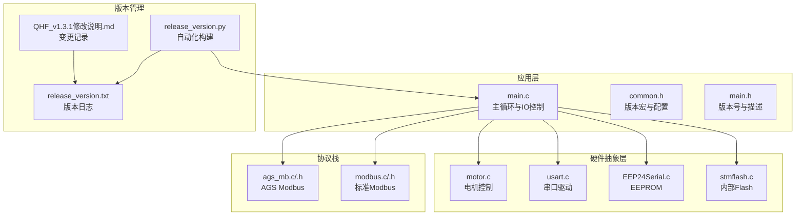
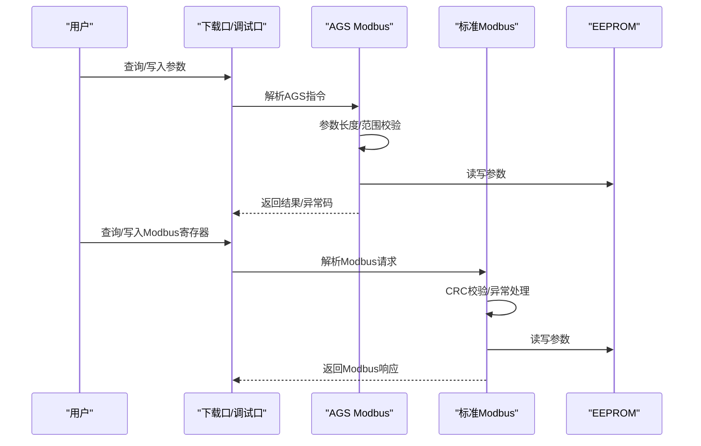
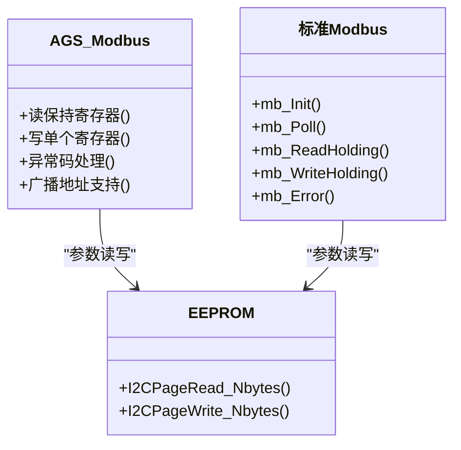
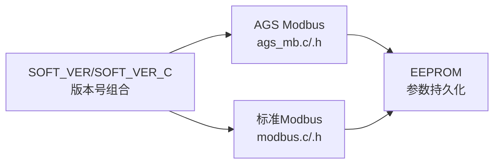

# 版本发展历程

<cite>
**本文档引用的文件**
- [QHF_v1.3.1修改说明.md](file://Doc/QHF_v1.3.1修改说明.md)
- [release_version.txt](file://Version/release_version.txt)
- [release_version.py](file://release_version.py)
- [modbus.c](file://SRC/HARDWARE/modbus/modbus.c)
- [modbus.h](file://SRC/HARDWARE/modbus/modbus.h)
- [ags_mb.c](file://SRC/HARDWARE/ags_mb/ags_mb.c)
- [ags_mb.h](file://SRC/HARDWARE/ags_mb/ags_mb.h)
- [main.c](file://SRC/APP/main.c)
- [common.h](file://SRC/APP/common.h)
- [main.h](file://SRC/APP/main.h)
</cite>

## 目录
1. [简介](#简介)
2. [项目结构](#项目结构)
3. [核心组件](#核心组件)
4. [架构总览](#架构总览)
5. [详细组件分析](#详细组件分析)
6. [依赖分析](#依赖分析)
7. [性能考虑](#性能考虑)
8. [故障排除指南](#故障排除指南)
9. [结论](#结论)
10. [附录](#附录)

## 简介
本文件系统梳理通用开关器项目从 V1.2.9 到 V1.3.1 的完整演进历程，重点覆盖以下方面：
- 版本命名规则与版本号含义
- 关键功能的添加与优化历史（原点补偿、方向补偿、参数验证、异常处理、Modbus 支持等）
- 版本间的兼容性与迁移注意事项
- 版本更新日志与功能变更对照表
- 版本控制策略与发布周期

## 项目结构
该项目采用嵌入式固件架构，核心分为应用层、硬件抽象层与第三方库层：
- 应用层：主控逻辑、IO 控制、定时与通信调度
- 硬件抽象层：电机控制、串口通信、EEPROM、Flash 等
- 协议栈：AGS Modbus 与标准 Modbus 实现
- 版本管理：自动化构建脚本与版本日志

**图表来源**
- [main.c:1-200](file://SRC/APP/main.c#L1-L200)
- [common.h:1-200](file://SRC/APP/common.h#L1-L200)
- [main.h:1-50](file://SRC/APP/main.h#L1-L50)
- [ags_mb.c:1-120](file://SRC/HARDWARE/ags_mb/ags_mb.c#L1-L120)
- [modbus.c:1-120](file://SRC/HARDWARE/modbus/modbus.c#L1-L120)
- [release_version.py:1-120](file://release_version.py#L1-L120)
- [release_version.txt:1-120](file://Version/release_version.txt#L1-L120)
- [QHF_v1.3.1修改说明.md:1-60](file://Doc/QHF_v1.3.1修改说明.md#L1-L60)

**章节来源**
- [main.c:1-200](file://SRC/APP/main.c#L1-L200)
- [common.h:1-200](file://SRC/APP/common.h#L1-L200)
- [release_version.py:1-120](file://release_version.py#L1-L120)

## 核心组件
- 版本号与命名规范：采用 vX.Y.Z-rN 格式，其中 X.Y.Z 为软件版本，N 为版次，用于区分同一版本的不同修改。
- 自动化构建：通过 release_version.py 统一编译、重命名、打包并生成版本日志，支持多目标（O_901/O_906/O_909/A/B/C 系列）。
- 协议栈：同时支持 AGS Modbus 与标准 Modbus，提供读写保持寄存器、异常码处理、广播地址支持等功能。
- 参数验证与异常处理：在写入参数时进行长度与范围校验，并定义了明确的异常码。
- Modbus 支持：自 V1.3.1-r27 起正式引入 Modbus 支持，修复 485 串口接收问题。

**章节来源**
- [QHF_v1.3.1修改说明.md:173-190](file://Doc/QHF_v1.3.1修改说明.md#L173-L190)
- [release_version.py:1-120](file://release_version.py#L1-L120)
- [modbus.c:1-120](file://SRC/HARDWARE/modbus/modbus.c#L1-L120)
- [ags_mb.c:1-120](file://SRC/HARDWARE/ags_mb/ags_mb.c#L1-L120)

## 架构总览
通用开关器的版本演进以“协议增强 + 参数校验 + 版本管理自动化”为主线。V1.2.9 引入原点/方向补偿，V1.3.0 进一步完善通信稳定性与参数限制，V1.3.1 引入 Modbus 支持并优化异常处理与参数验证。

**图表来源**
- [ags_mb.c:180-285](file://SRC/HARDWARE/ags_mb/ags_mb.c#L180-L285)
- [modbus.c:190-278](file://SRC/HARDWARE/modbus/modbus.c#L190-L278)
- [modbus.c:520-568](file://SRC/HARDWARE/modbus/modbus.c#L520-L568)

**章节来源**
- [ags_mb.c:180-285](file://SRC/HARDWARE/ags_mb/ags_mb.c#L180-L285)
- [modbus.c:190-278](file://SRC/HARDWARE/modbus/modbus.c#L190-L278)

## 详细组件分析

### 版本命名规则与版本号含义
- 命名格式：vX.Y.Z-rN
  - X.Y.Z：软件版本号
  - N：版次，用于区分同一版本的不同修改
- 示例：
  - v1.3.1A-r1：版本 1.3.1A，版次 r1，类型 A（232/485/IO）
  - v1.3.1-r11：版本 1.3.1，版次 r11，仅 232/485

**章节来源**
- [QHF_v1.3.1修改说明.md:175-181](file://Doc/QHF_v1.3.1修改说明.md#L175-L181)

### 版本控制策略与发布周期
- 自动化构建：release_version.py 统一管理 Keil 编译、日志记录、产物命名与打包。
- 多目标支持：O_901/O_906/O_909（232/485）、A_901/A_906/A_909（232/485/IO）、B_901/B_906（IO）、C_901（带灯输出）。
- 版次号：每次发布通过输入版次号（如 r27、r28）进行区分。
- 日志记录：release_version.txt 记录编译时间、目标、变更记录与产物路径。

**章节来源**
- [release_version.py:15-47](file://release_version.py#L15-L47)
- [release_version.txt:1-120](file://Version/release_version.txt#L1-L120)

### 协议栈演进：从 AGS Modbus 到标准 Modbus
- AGS Modbus：支持读写保持寄存器、扩展功能码、异常码处理与广播地址。
- 标准 Modbus：自 V1.3.1-r27 引入，支持 03/06 功能码，定义保持寄存器地址空间与异常码。
- 参数校验：写入时进行长度与范围检查，CRC 校验失败时返回异常。

**图表来源**
- [ags_mb.c:180-285](file://SRC/HARDWARE/ags_mb/ags_mb.c#L180-L285)
- [modbus.c:35-67](file://SRC/HARDWARE/modbus/modbus.c#L35-L67)
- [modbus.c:520-568](file://SRC/HARDWARE/modbus/modbus.c#L520-L568)

**章节来源**
- [ags_mb.c:180-285](file://SRC/HARDWARE/ags_mb/ags_mb.c#L180-L285)
- [modbus.c:35-67](file://SRC/HARDWARE/modbus/modbus.c#L35-L67)

### 参数验证与异常处理
- 参数验证：写入地址、波特率、速度、通道数等参数时进行范围与长度校验。
- 异常码：定义功能码错、操作码错、写入参数范围/长度超限等异常码。
- CRC 校验：接收数据后进行 CRC 校验，失败时返回异常响应。

**章节来源**
- [QHF_v1.3.1修改说明.md:81-89](file://Doc/QHF_v1.3.1修改说明.md#L81-L89)
- [modbus.c:167-186](file://SRC/HARDWARE/modbus/modbus.c#L167-L186)
- [ags_mb.c:425-474](file://SRC/HARDWARE/ags_mb/ags_mb.c#L425-L474)

### Modbus 支持与功能增强
- 引入标准 Modbus：支持 03/06 功能码，定义保持寄存器地址空间（状态、运行参数、序列号、出厂参数等）。
- 异常处理：定义异常码并使用宏优化语句，提升可维护性。
- 修复问题：修复 485 串口无法接收、下载口读电流错误等问题。

**章节来源**
- [QHF_v1.3.1修改说明.md:47-47](file://Doc/QHF_v1.3.1修改说明.md#L47-L47)
- [modbus.c:190-278](file://SRC/HARDWARE/modbus/modbus.c#L190-L278)
- [modbus.h:11-21](file://SRC/HARDWARE/modbus/modbus.h#L11-L21)

### 版本间兼容性与迁移注意事项
- 版本号分离：V1.3.1A/B-r1 起分离软件版本号中的修改版次与版本名称。
- IO 控制宏：统一 IO 宏定义 IO_RS，区分 A（232/485/IO）与 B（IO）两种电平标准。
- 参数默认值：默认波特率改为 9600，减速比默认 4，通道数默认 10，半通道默认关闭。
- 兼容性：V1.3.1-r27 引入 Modbus 后，AGS 指令与标准 Modbus 并存，需根据目标协议选择相应接口。

**章节来源**
- [QHF_v1.3.1修改说明.md:74-77](file://Doc/QHF_v1.3.1修改说明.md#L74-L77)
- [QHF_v1.3.1修改说明.md:124-128](file://Doc/QHF_v1.3.1修改说明.md#L124-L128)
- [common.h:42-133](file://SRC/APP/common.h#L42-L133)

## 依赖分析
- 版本号依赖：SOFT_VER_NUM 与 SOFT_REVISION 组合形成最终版本号，SOFT_VER_C 提供字符串化版本标识。
- 协议栈依赖：AGS Modbus 与标准 Modbus 共存，分别处理不同接口与协议族。
- 硬件依赖：EEPROM 用于参数持久化，USART 用于串口通信，定时器用于超时检测与保护。

**图表来源**
- [main.h:12-42](file://SRC/APP/main.h#L12-L42)
- [ags_mb.c:1-73](file://SRC/HARDWARE/ags_mb/ags_mb.c#L1-L73)
- [modbus.c:1-67](file://SRC/HARDWARE/modbus/modbus.c#L1-L67)

**章节来源**
- [main.h:12-42](file://SRC/APP/main.h#L12-L42)
- [ags_mb.c:1-73](file://SRC/HARDWARE/ags_mb/ags_mb.c#L1-L73)
- [modbus.c:1-67](file://SRC/HARDWARE/modbus/modbus.c#L1-L67)

## 性能考虑
- LED 闪烁优化：通过宏开关与定时器优化 LED 闪烁频率，降低对通信的干扰。
- 超时保护：在运行与初始化阶段设置超时保护，避免长时间堵转导致硬件损坏。
- 串口优化：统一波特率显示与点检模式，减少冗余输出，提升调试效率。

**章节来源**
- [QHF_v1.3.1修改说明.md:134-136](file://Doc/QHF_v1.3.1修改说明.md#L134-L136)
- [QHF_v1.3.1修改说明.md:146-148](file://Doc/QHF_v1.3.1修改说明.md#L146-L148)
- [main.c:169-200](file://SRC/APP/main.c#L169-L200)

## 故障排除指南
- CRC 校验失败：检查串口波特率与线缆连接，确认 CRC 计算正确。
- 异常码 01/02/03：核对功能码与操作码，确保参数长度与范围符合要求。
- 485 串口无法接收：确认 RX/TX 引脚配置与方向控制逻辑，检查波特率设置。
- 参数写入不生效：确认目标状态为 VALVE_RUN_END，且写入流程未被屏蔽（如特定回复模式）。

**章节来源**
- [modbus.c:167-186](file://SRC/HARDWARE/modbus/modbus.c#L167-L186)
- [ags_mb.c:425-474](file://SRC/HARDWARE/ags_mb/ags_mb.c#L425-L474)
- [main.c:169-200](file://SRC/APP/main.c#L169-L200)

## 结论
V1.2.9 到 V1.3.1 的演进体现了从“功能完善”到“协议标准化”的转变。V1.3.1 引入的标准 Modbus 支持显著提升了系统的互操作性，配合严格的参数验证与异常处理机制，为后续版本的稳定运行奠定了坚实基础。版本管理自动化工具链保证了发布的可追溯性与一致性。

## 附录

### 版本更新日志与功能变更对照表（V1.2.9 → V1.3.1）
- V1.2.9r7（2024.09.26）
  - 原点补偿做减速区间
- V1.3.0r0（2025.01.14）
  - 修改通信丢包
- V1.3.0r1（2025.03.05）
  - 修改序列号地址重复
- V1.3.0r2（2025.05.19）
  - 应用方向补偿
- V1.3.0r3（2025.05.21）
  - 修改通道数限制
- V1.3.0r4（2025.06.20）
  - 修复读序列号
- V1.3.1A/B（2025.06.26）
  - 统一 IO 宏定义 IO_RS，区分 A（232/485/IO）与 B（IO）
- V1.3.1A/B-r1（2025.07.21）
  - 支持 0 地址，修复默认参数写入乱码，支持 02 读版本
- V1.3.1A/B-r2（2025.07.22）
  - 分离软件版本号中的修改版次与版本名称
- V1.3.1A/B-r3（2025.07.31）
  - 对地址、波特率、速度、通道数进行限制，修复广播地址问题
- V1.3.1A/B-r10（2025.08.21）
  - 新增 20 减速比，速度限制优化，增加默认值写入
- V1.3.1-r11（2025.09.04）
  - 输出三种版本程序（1.3.1/1.3.1AB/1.3.1A/B），默认波特率改为 9600
- V1.3.1-r13（2025.09.05）
  - 修复 20 减速比支持
- V1.3.1-r14（2025.11.13）
  - 新增 0B 回复方式设置，汉化指令与点检模式
- V1.3.1-r15（2025.11.15）
  - 新增 C 版本灯状态输出
- V1.3.1-r16（2025.11.20）
  - 新增电机老化模式，调试输出优化
- V1.3.1-r20（2026.03.04）
  - 调整 906 方向，点检指令增加波特率显示
- V1.3.1-r22（2026.03.09）
  - 串口新增 0D 功能码读写半通道
- V1.3.1-r26（2026.03.27）
  - 修复错误长度读指令使设备死机问题
- V1.3.1-r27（2026.04.22）
  - 支援 Modbus，修复 485 串口无法接收，修复下载口读电流错误，优化代码

**章节来源**
- [QHF_v1.3.1修改说明.md:50-171](file://Doc/QHF_v1.3.1修改说明.md#L50-L171)